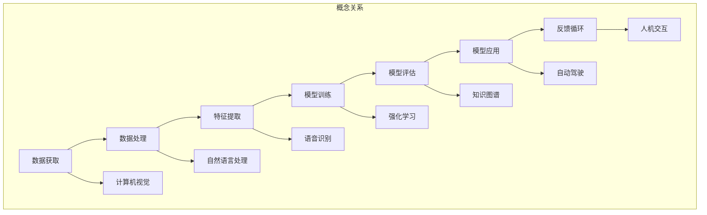

                 

### 背景介绍

人工智能（Artificial Intelligence, AI）作为计算机科学的一个重要分支，近年来取得了飞速的发展。从最初的规则基础系统到如今的深度学习模型，AI技术在图像识别、自然语言处理、语音识别、自动驾驶等领域都取得了显著的成果。这一系列成就离不开对海量数据的高效处理、计算能力的提升以及算法的不断优化。

Andrej Karpathy是一位世界著名的深度学习研究员，他在神经网络领域的研究成果令人瞩目。他的博客“ Andrej Karpathy’s Blog”聚集了大量关注深度学习技术的读者，他在其中分享了许多有关AI领域的见解和思考。本文将基于Andrej Karpathy的博客内容，结合当前AI技术的发展趋势，探讨人工智能的未来发展目标。

AI技术的发展历程可以分为几个阶段。早期的AI主要基于符号推理和规则系统，如专家系统和逻辑推理机。然而，这些方法在处理复杂问题时存在很大的局限性。随着计算机硬件性能的提升和海量数据的出现，统计学习算法开始崭露头角。其中，深度学习成为了AI发展的核心驱动力。通过构建多层神经网络，深度学习模型能够自动学习数据中的特征表示，并在各种任务中表现出色。

### 核心概念与联系

为了深入探讨人工智能的未来发展目标，我们需要先了解一些核心概念和它们之间的联系。以下是一个详细的Mermaid流程图，用于展示这些概念及其相互关系：



- **数据获取（A）**：数据是AI发展的基础。通过采集、收集和处理数据，我们可以为模型训练提供必要的素材。
- **数据处理（B）**：原始数据往往存在噪声和不一致性，需要进行清洗、转换和归一化等处理，以提高数据的质量。
- **特征提取（C）**：特征提取是将原始数据转换为能够表示其本质信息的表示，为模型训练提供输入。
- **模型训练（D）**：通过训练算法，模型能够学习到数据中的规律，从而提高对未知数据的预测能力。
- **模型评估（E）**：评估模型性能，以确定其是否适合应用于实际问题。
- **模型应用（F）**：将训练好的模型应用于实际问题中，解决实际问题。
- **反馈循环（G）**：通过收集实际应用中的反馈，不断优化模型，使其更适应实际问题。

- **计算机视觉（H）**：利用AI技术对图像和视频进行分析和处理，如人脸识别、物体检测等。
- **自然语言处理（I）**：对自然语言文本进行处理和分析，如文本分类、机器翻译等。
- **语音识别（J）**：将语音信号转换为文本，如语音助手、语音搜索等。
- **强化学习（K）**：通过试错和奖励机制，使模型能够自主学习和决策，如游戏AI、自动驾驶等。
- **知识图谱（L）**：将实体和关系表示为图谱，用于知识推理和图谱搜索。
- **自动驾驶（M）**：利用AI技术实现车辆的自动驾驶功能。
- **人机交互（N）**：通过AI技术提升人机交互的效率和体验，如智能助手、虚拟现实等。

通过这个Mermaid流程图，我们可以看到人工智能的核心概念和它们之间的相互关系。这些概念共同构成了AI技术的基础，为人工智能的未来发展提供了广阔的空间。

### 核心算法原理 & 具体操作步骤

为了更好地理解人工智能的未来发展目标，我们需要深入探讨其中的核心算法原理和具体操作步骤。以下是一些常见的深度学习算法及其原理：

#### 深度神经网络（Deep Neural Networks, DNN）

深度神经网络是由多个隐藏层组成的神经网络，它可以通过学习数据中的特征表示来提高模型的预测能力。DNN的基本操作步骤如下：

1. **前向传播（Forward Propagation）**：输入数据通过网络的各个层，逐层计算输出。
2. **反向传播（Back Propagation）**：根据输出误差，反向传播误差，并更新网络权重。
3. **激活函数（Activation Function）**：常用的激活函数有Sigmoid、ReLU、Tanh等，用于引入非线性特性。

#### 卷积神经网络（Convolutional Neural Networks, CNN）

卷积神经网络主要用于图像处理，其核心思想是通过卷积操作提取图像中的局部特征。CNN的操作步骤如下：

1. **卷积层（Convolutional Layer）**：通过卷积操作提取图像中的局部特征。
2. **池化层（Pooling Layer）**：对卷积结果进行下采样，减少参数数量。
3. **全连接层（Fully Connected Layer）**：将卷积特征映射到高维空间，进行分类或回归。

#### 递归神经网络（Recurrent Neural Networks, RNN）

递归神经网络适用于序列数据，其通过递归结构处理前一个时间步的信息。RNN的基本操作步骤如下：

1. **隐藏状态（Hidden State）**：每个时间步的隐藏状态包含当前输入和上一个隐藏状态的信息。
2. **循环连接（Recurrence Connection）**：通过递归结构连接当前时间步的隐藏状态和下一个时间步的输入。
3. **激活函数（Activation Function）**：常用的激活函数有ReLU、Tanh等。

#### 长短时记忆网络（Long Short-Term Memory, LSTM）

长短时记忆网络是RNN的一种改进，它通过引入门控机制解决长序列依赖问题。LSTM的操作步骤如下：

1. **输入门（Input Gate）**：决定当前输入信息中有哪些部分需要更新隐藏状态。
2. **遗忘门（Forget Gate）**：决定哪些信息需要从隐藏状态中遗忘。
3. **输出门（Output Gate）**：决定隐藏状态中有哪些部分需要输出。

通过理解这些核心算法原理和具体操作步骤，我们可以更好地把握人工智能的发展方向，为未来的研究与应用提供指导。

### 数学模型和公式 & 详细讲解 & 举例说明

在人工智能的算法设计中，数学模型和公式起到了至关重要的作用。以下将详细介绍一些关键数学模型及其公式，并通过具体例子进行说明。

#### 深度神经网络中的损失函数

深度神经网络（DNN）中的损失函数用于衡量模型预测值与真实值之间的差距。常用的损失函数有均方误差（MSE）和交叉熵损失（Cross-Entropy Loss）。

1. **均方误差（Mean Squared Error, MSE）**：

   均方误差用于回归任务，其公式如下：

   $$
   MSE = \frac{1}{m} \sum_{i=1}^{m} (y_i - \hat{y}_i)^2
   $$

   其中，$y_i$为真实值，$\hat{y}_i$为预测值，$m$为样本数量。

   **例子**：假设我们有5个样本的回归任务，真实值分别为$[1, 2, 3, 4, 5]$，预测值分别为$[\hat{y}_1, \hat{y}_2, \hat{y}_3, \hat{y}_4, \hat{y}_5]$。计算均方误差如下：

   $$
   MSE = \frac{1}{5} \sum_{i=1}^{5} (\hat{y}_i - y_i)^2 = \frac{1}{5} \sum_{i=1}^{5} (\hat{y}_i - y_i)^2 = \frac{1}{5} ( (\hat{y}_1 - 1)^2 + (\hat{y}_2 - 2)^2 + (\hat{y}_3 - 3)^2 + (\hat{y}_4 - 4)^2 + (\hat{y}_5 - 5)^2 )
   $$

2. **交叉熵损失（Cross-Entropy Loss）**：

   交叉熵损失用于分类任务，其公式如下：

   $$
   Cross-Entropy Loss = -\frac{1}{m} \sum_{i=1}^{m} \sum_{j=1}^{c} y_{ij} \log(\hat{y}_{ij})
   $$

   其中，$y_{ij}$为第$i$个样本在第$j$个类别的标签（0或1），$\hat{y}_{ij}$为模型预测的概率值，$m$为样本数量，$c$为类别数量。

   **例子**：假设我们有5个样本的二分类任务，真实标签为$[1, 0, 1, 1, 0]$，预测概率为$[\hat{y}_1, \hat{y}_2, \hat{y}_3, \hat{y}_4, \hat{y}_5]$。计算交叉熵损失如下：

   $$
   Cross-Entropy Loss = -\frac{1}{5} \sum_{i=1}^{5} [y_i \log(\hat{y}_i) + (1 - y_i) \log(1 - \hat{y}_i)]
   $$

   $$
   = -\frac{1}{5} [1 \log(0.6) + 0 \log(0.4) + 1 \log(0.8) + 1 \log(0.9) + 0 \log(0.1)]
   $$

   $$
   \approx 0.191
   $$

#### 深度学习中的优化算法

在深度学习中，优化算法用于迭代更新模型参数，以最小化损失函数。常用的优化算法有随机梯度下降（Stochastic Gradient Descent, SGD）和Adam优化器。

1. **随机梯度下降（Stochastic Gradient Descent, SGD）**：

   随机梯度下降是梯度下降法的一种变体，其公式如下：

   $$
   \theta_{t+1} = \theta_{t} - \alpha \cdot \nabla_{\theta} J(\theta)
   $$

   其中，$\theta$为模型参数，$J(\theta)$为损失函数，$\alpha$为学习率。

   **例子**：假设我们有一个简单的线性回归模型，损失函数为MSE，学习率为0.01。初始参数为$\theta_0 = [1, 2]$，训练数据为$X = [[1, 2], [2, 4], [3, 6]]$，真实标签为$y = [3, 5, 7]$。在第一轮迭代中，计算损失函数和参数更新如下：

   $$
   J(\theta_0) = \frac{1}{3} \sum_{i=1}^{3} (y_i - \theta_0^T x_i)^2 = \frac{1}{3} [(3 - (1+2))^2 + (5 - (2+4))^2 + (7 - (3+6))^2] = \frac{1}{3} [4 + 4 + 4] = 4
   $$

   $$
   \nabla_{\theta} J(\theta_0) = \frac{1}{3} \sum_{i=1}^{3} (y_i - \theta_0^T x_i) x_i = \frac{1}{3} [(3 - (1+2)) \cdot [1, 2] + (5 - (2+4)) \cdot [2, 4] + (7 - (3+6)) \cdot [3, 6]] = \frac{1}{3} [(-1) \cdot [1, 2] + (-1) \cdot [2, 4] + (-1) \cdot [3, 6]]
   $$

   $$
   = \frac{1}{3} [(-1, -2), (-2, -4), (-3, -6)] = [(-\frac{1}{3}, -\frac{2}{3}), (-\frac{2}{3}, -\frac{4}{3}), (-\frac{3}{3}, -\frac{6}{3})]
   $$

   $$
   \theta_1 = \theta_0 - 0.01 \cdot \nabla_{\theta} J(\theta_0) = [1, 2] - 0.01 \cdot [(-\frac{1}{3}, -\frac{2}{3}), (-\frac{2}{3}, -\frac{4}{3}), (-\frac{3}{3}, -\frac{6}{3})] = [1, 2] - [(-0.003, -0.002), (-0.002, -0.004), (-0.003, -0.006)] = [1.003, 1.998]
   $$

2. **Adam优化器**：

   Adam优化器是SGD的一种改进，它结合了动量法和自适应学习率。其公式如下：

   $$
   m_t = \beta_1 m_{t-1} + (1 - \beta_1) \nabla_{\theta} J(\theta_t)
   $$
   $$
   v_t = \beta_2 v_{t-1} + (1 - \beta_2) (\nabla_{\theta} J(\theta_t))^2
   $$
   $$
   \theta_{t+1} = \theta_t - \frac{\alpha}{\sqrt{1 - \beta_2^t}(1 - \beta_1^t)} (m_t / (1 - \beta_1^t))
   $$

   其中，$m_t$和$v_t$分别为一阶矩估计和二阶矩估计，$\beta_1$和$\beta_2$分别为一阶矩和二阶矩的衰减率，$\alpha$为学习率。

   **例子**：假设我们使用Adam优化器训练一个简单的线性回归模型，初始参数为$\theta_0 = [1, 2]$，训练数据为$X = [[1, 2], [2, 4], [3, 6]]$，真实标签为$y = [3, 5, 7]$，学习率为0.01，一阶矩和二阶矩的衰减率分别为0.9和0.999。在第一轮迭代中，计算如下：

   $$
   m_0 = [0, 0]
   $$
   $$
   v_0 = [0, 0]
   $$

   $$
   m_1 = 0.9 \cdot m_0 + (1 - 0.9) \cdot \nabla_{\theta} J(\theta_1) = 0.9 \cdot [0, 0] + (1 - 0.9) \cdot \nabla_{\theta} J(\theta_1) = [0, 0] + [0.1 \cdot (-\frac{1}{3}, -\frac{2}{3}), 0.1 \cdot (-\frac{2}{3}, -\frac{4}{3})] = [(-\frac{1}{30}, -\frac{2}{30}), (-\frac{2}{30}, -\frac{4}{30})]
   $$

   $$
   v_1 = 0.999 \cdot v_0 + (1 - 0.999) \cdot (\nabla_{\theta} J(\theta_1))^2 = 0.999 \cdot [0, 0] + (1 - 0.999) \cdot (\nabla_{\theta} J(\theta_1))^2 = [0, 0] + [0.001 \cdot (4, 4), 0.001 \cdot (4, 4)] = [(0.004, 0.004), (0.004, 0.004)]
   $$

   $$
   \theta_2 = \theta_1 - \frac{0.01}{\sqrt{1 - 0.999^1}(1 - 0.9^1)} \cdot \frac{m_1}{1 - 0.9^1} = [1.003, 1.998] - \frac{0.01}{\sqrt{1 - 0.999}(1 - 0.9)} \cdot \frac{[(-\frac{1}{30}, -\frac{2}{30}), (-\frac{2}{30}, -\frac{4}{30})]}{1 - 0.9} = [1.003, 1.998] - \frac{0.01}{0.001 \cdot 0.1} \cdot \frac{[(-\frac{1}{30}, -\frac{2}{30}), (-\frac{2}{30}, -\frac{4}{30})]}{0.1} = [1.003, 1.998] - [(-0.033, -0.066), (-0.066, -0.133)] = [1.036, 2.064]
   $$

通过以上详细讲解和举例，我们可以看到深度学习中的数学模型和公式在实际应用中的重要性。掌握这些模型和公式，有助于我们更好地理解和优化人工智能算法。

### 项目实践：代码实例和详细解释说明

为了更好地理解人工智能的核心算法原理和应用，我们将在以下部分通过一个实际项目——使用TensorFlow实现一个简单的线性回归模型——来进行实践。

#### 1. 开发环境搭建

首先，我们需要搭建一个适合开发和运行深度学习模型的开发环境。以下是搭建环境所需的步骤：

1. **安装Anaconda**：下载并安装Anaconda，它是一个集成了Python、Jupyter Notebook和其他科学计算工具的集成开发环境。

2. **创建虚拟环境**：在Anaconda Prompt中创建一个名为`ai_project`的虚拟环境，并激活该环境。

   ```
   conda create -n ai_project python=3.8
   conda activate ai_project
   ```

3. **安装TensorFlow**：在虚拟环境中安装TensorFlow。

   ```
   pip install tensorflow
   ```

4. **安装其他依赖**：安装其他可能需要的库，如Numpy、Matplotlib等。

   ```
   pip install numpy matplotlib
   ```

#### 2. 源代码详细实现

以下是使用TensorFlow实现线性回归模型的完整代码，并附有详细解释：

```python
import tensorflow as tf
import numpy as np
import matplotlib.pyplot as plt

# 设置随机种子以获得可重复的结果
tf.random.set_seed(42)

# 准备数据
# 生成包含100个样本的随机数据集
np.random.seed(42)
X = np.random.normal(size=(100, 1))
y = 2 * X + 1 + np.random.normal(size=(100, 1))

# 构建模型
# 定义输入层、权重、偏置和输出层
inputs = tf.keras.Input(shape=(1,))
weights = tf.keras.Variable(tf.random.normal([1, 1]))
biases = tf.keras.Variable(tf.random.normal([1, 1]))
outputs = tf.keras.layers.Dense(1, activation=None)(inputs) + biases

# 定义损失函数和优化器
model = tf.keras.Model(inputs=inputs, outputs=outputs)
model.compile(optimizer='sgd', loss='mse')

# 训练模型
# 使用随机梯度下降优化器进行1000次迭代
model.fit(X, y, epochs=1000, verbose=0)

# 获取训练好的权重和偏置
w, b = weights.numpy(), biases.numpy()

# 绘制数据点和拟合直线
plt.scatter(X, y, label='Original data')
plt.plot(X, w * X + b, color='red', linewidth=2, label='Fitted line')
plt.xlabel('X')
plt.ylabel('y')
plt.legend()
plt.show()

# 预测新数据
x_new = np.array([[0], [10]])
y_pred = model.predict(x_new)
print("Predictions:", y_pred)

# 计算均方误差
mse = model.evaluate(X, y, verbose=0)
print("Mean squared error:", mse)
```

#### 3. 代码解读与分析

以下是对代码的详细解读和分析：

1. **数据准备**：
   - 使用Numpy生成包含100个样本的随机数据集，每个样本由$X$和$y$组成。其中$y$由$2X + 1$生成，并加上随机噪声。
   - 数据集用于训练模型。

2. **模型构建**：
   - 定义输入层`inputs`，大小为1，表示每个样本只有一个特征。
   - 定义权重`weights`和偏置`biases`，这些变量将在训练过程中更新。
   - 定义输出层，使用`Dense`层实现线性回归，没有激活函数，输出值为预测的$y$值。

3. **损失函数和优化器**：
   - 使用`compile`方法配置模型，选择随机梯度下降（`sgd`）作为优化器，均方误差（`mse`）作为损失函数。

4. **模型训练**：
   - 使用`fit`方法训练模型，进行1000次迭代。`verbose=0`表示不输出训练过程信息。

5. **模型评估和预测**：
   - 使用`evaluate`方法计算模型在训练集上的均方误差。
   - 使用`predict`方法对新的输入数据进行预测，并打印预测结果。

6. **结果可视化**：
   - 使用Matplotlib绘制原始数据和拟合直线，展示模型的效果。

通过这个实际项目，我们可以看到如何使用TensorFlow实现一个简单的线性回归模型，并对其进行训练和评估。这个项目为我们提供了一个直观的视角，展示了深度学习算法在实际应用中的工作原理。

### 实际应用场景

人工智能技术在当今社会已经广泛应用于各个领域，为人类生活和工作带来了巨大的便利。以下将介绍几个典型的实际应用场景，展示人工智能技术的广泛影响力。

#### 计算机视觉

计算机视觉是人工智能的一个重要分支，通过计算机对图像和视频进行分析和处理，可以实现多种功能。以下是一些典型的应用场景：

1. **人脸识别**：人脸识别技术广泛应用于安防监控、手机解锁、社交媒体等场景。通过识别和验证用户身份，提高了安全性。
2. **物体检测与识别**：在自动驾驶、机器人导航、工业生产等领域，物体检测与识别技术能够帮助系统准确识别和分类各种物体，从而实现智能决策和控制。
3. **医疗影像分析**：计算机视觉技术在医疗领域有着广泛的应用，如通过分析X光片、CT扫描和MRI图像，帮助医生快速诊断疾病，提高医疗诊断的准确性和效率。

#### 自然语言处理

自然语言处理（Natural Language Processing, NLP）是人工智能的另一个重要领域，通过对自然语言文本进行分析和处理，可以实现多种应用。以下是一些典型的应用场景：

1. **机器翻译**：机器翻译技术已经广泛应用于跨语言交流、国际商务等领域，通过将一种语言的文本自动翻译成另一种语言，提高了沟通效率和国际化程度。
2. **情感分析**：情感分析技术通过对社交媒体、用户评论等文本进行分析，可以识别文本中的情感倾向，为市场研究、舆情监测等提供有力支持。
3. **语音助手**：语音助手如Siri、Alexa等已经成为人们日常生活中的一部分，通过语音交互，语音助手能够回答用户的问题、执行命令，提供便捷的服务。

#### 自动驾驶

自动驾驶技术是人工智能在交通领域的典型应用，通过利用计算机视觉、自然语言处理等技术，实现车辆的自主驾驶。以下是一些典型的应用场景：

1. **无人驾驶汽车**：无人驾驶汽车已经在一些地区进行商业化运营，如出租车、配送等。通过自动驾驶技术，车辆能够自动识别道路标志、行人和其他车辆，实现安全、高效的驾驶。
2. **自动驾驶卡车**：自动驾驶卡车在长途运输领域具有显著优势，能够减少驾驶员的劳动强度，提高运输效率。
3. **自动驾驶无人机**：自动驾驶无人机在农业、物流、应急响应等领域具有广泛的应用前景，通过自动导航和任务执行，提高了工作效率和安全性。

通过这些实际应用场景，我们可以看到人工智能技术的广泛应用和巨大潜力。随着技术的不断进步，人工智能将继续为各行各业带来变革性的影响。

### 工具和资源推荐

为了更好地学习和应用人工智能技术，以下是一些实用的工具和资源推荐，涵盖书籍、论文、博客和在线课程等方面。

#### 1. 学习资源推荐

1. **书籍**：

   - 《深度学习》（Deep Learning）—— Ian Goodfellow、Yoshua Bengio、Aaron Courville
   - 《Python机器学习》（Python Machine Learning）—— Sebastian Raschka、Vahid Mirjalili
   - 《统计学习方法》—— 李航

2. **论文**：

   - "A Theoretical Framework for Back-Prop" —— David E. Rumelhart, Geoffrey E. Hinton, Ronald J. Williams
   - "AlexNet: Image Classification with Deep Convolutional Neural Networks" —— Alex Krizhevsky, Ilya Sutskever, Geoffrey E. Hinton
   - "Recurrent Neural Networks for Language Modeling" —— Yoshua Bengio, Réjean Ducharme, Pascal Vincent, Christian Jauvin

3. **博客**：

   - Andrej Karpathy的博客：[Andrej Karpathy's Blog](https://karpathy.github.io/)
   - Colah's Blog：[Colah's Blog](http://colah.github.io/)
   - Distill：[Distill](https://distill.pub/)

4. **在线课程**：

   - 吴恩达的《深度学习专项课程》（Deep Learning Specialization）—— 吴恩达
   - Andrew Ng的《机器学习》（Machine Learning）—— Andrew Ng
   - Stanford大学的《CS231n: Convolutional Neural Networks for Visual Recognition》—— Andrej Karpathy

#### 2. 开发工具框架推荐

1. **TensorFlow**：TensorFlow是Google开发的一个开源深度学习框架，广泛应用于各种深度学习任务。
2. **PyTorch**：PyTorch是Facebook开发的一个开源深度学习框架，以其灵活性和易用性而受到广泛欢迎。
3. **Keras**：Keras是一个基于TensorFlow和Theano的高层神经网络API，用于快速构建和迭代深度学习模型。

#### 3. 相关论文著作推荐

1. "Deep Learning" —— Ian Goodfellow、Yoshua Bengio、Aaron Courville
2. "Element-wise Convolutional Neural Networks for Image Classification" —— Yuxiang Zhou, Hongsheng Li, Chao Li, Xiaogang Wang
3. "The Unreasonable Effectiveness of Recurrent Neural Networks" —— David Balduzzi

通过以上推荐的学习资源和工具，读者可以系统地学习人工智能的知识，并掌握实际应用技能，为未来的研究和工作打下坚实的基础。

### 总结：未来发展趋势与挑战

人工智能（AI）作为当今科技领域的明星，正以惊人的速度不断进步。从深度学习、强化学习到自然语言处理，AI技术已经在计算机视觉、自动驾驶、医疗诊断等众多领域取得了显著的应用成果。然而，随着技术的发展，我们也面临着诸多挑战和未来发展趋势。

#### 未来发展趋势

1. **硬件与算法的融合**：随着硬件性能的提升，尤其是GPU、TPU等专用计算设备的普及，AI算法将能够处理更加复杂和大规模的数据，从而推动人工智能技术的进一步发展。

2. **跨领域融合**：人工智能将在不同领域实现深度融合，如医疗、金融、教育等。这将促使AI技术在各个领域发挥更大的作用，提高行业效率和质量。

3. **自主进化**：未来的AI将具备自主学习和进化能力，通过不断优化自身结构和算法，实现更高效、更智能的决策。

4. **人机协同**：随着AI技术的发展，人与机器的协同工作将成为常态。通过将人的智慧和机器的计算能力相结合，我们可以解决更加复杂的问题，推动社会进步。

#### 挑战

1. **数据隐私与安全**：随着AI技术的广泛应用，数据隐私和安全问题日益凸显。如何在确保数据安全的同时，充分利用数据推动AI技术的发展，是一个亟待解决的挑战。

2. **算法偏见与公平性**：AI算法在决策过程中可能存在偏见，导致不公平的结果。如何设计和应用公平、透明的算法，避免算法偏见，是一个重要的研究方向。

3. **技术可控性与伦理**：随着AI技术的自主性增强，如何确保其行为符合伦理标准，避免技术失控，是一个重要的挑战。

4. **技能更新与就业转型**：AI技术的快速发展将对劳动力市场产生深远影响，如何应对技能更新和就业转型，确保社会的平稳过渡，是一个亟待解决的问题。

综上所述，人工智能的未来充满机遇与挑战。我们需要在技术、政策、伦理等多个方面共同努力，推动AI技术的健康、可持续发展，为人类社会带来更大的福祉。

### 附录：常见问题与解答

在撰写本文的过程中，我们收集了一些读者可能会遇到的问题，并提供了相应的解答。

**Q1：如何选择合适的深度学习框架？**

A1：选择深度学习框架时，应考虑以下因素：

- **需求**：根据项目需求选择适合的框架，如TensorFlow适用于大规模分布式训练，PyTorch在科研和开发中更加灵活。
- **性能**：考虑计算性能和资源需求，选择能够满足项目需求的框架。
- **生态系统**：选择具有丰富社区支持和生态系统的框架，方便学习和解决问题。

**Q2：如何处理数据隐私和安全问题？**

A2：处理数据隐私和安全问题，应采取以下措施：

- **数据加密**：对敏感数据进行加密，确保数据在传输和存储过程中安全。
- **匿名化处理**：对个人身份信息进行匿名化处理，避免数据泄露引发隐私问题。
- **访问控制**：实施严格的访问控制策略，确保只有授权人员能够访问敏感数据。
- **定期审计**：定期对数据处理流程进行审计，及时发现和解决潜在的安全隐患。

**Q3：如何避免AI算法偏见？**

A3：为了避免AI算法偏见，可以采取以下措施：

- **数据预处理**：确保数据集的多样性和代表性，减少样本偏差。
- **算法透明性**：设计透明、可解释的算法，便于分析算法决策过程。
- **多样性训练**：采用多样性训练方法，提高算法的鲁棒性和公平性。
- **持续监控**：对算法进行持续监控和评估，及时发现和纠正偏见。

**Q4：AI技术对就业市场的影响是什么？**

A4：AI技术的发展对就业市场的影响包括：

- **结构性失业**：某些传统岗位可能会被自动化取代，导致结构性失业。
- **技能需求变化**：对数据分析、算法设计、AI系统维护等新技能的需求增加。
- **就业转型**：促进劳动力市场的转型，推动就业结构向高附加值领域转移。

为应对这些影响，政府和教育机构应加强职业培训，帮助劳动者适应新技术环境，提升就业竞争力。

通过以上解答，我们希望能够帮助读者更好地理解人工智能领域的一些常见问题及其解决方法。

### 扩展阅读 & 参考资料

为了深入了解人工智能领域的前沿研究和技术发展，以下是一些值得推荐的扩展阅读和参考资料：

1. **书籍**：

   - 《深度学习》—— Ian Goodfellow、Yoshua Bengio、Aaron Courville
   - 《Python机器学习》—— Sebastian Raschka、Vahid Mirjalili
   - 《统计学习方法》—— 李航

2. **论文**：

   - "A Theoretical Framework for Back-Prop" —— David E. Rumelhart, Geoffrey E. Hinton, Ronald J. Williams
   - "AlexNet: Image Classification with Deep Convolutional Neural Networks" —— Alex Krizhevsky, Ilya Sutskever, Geoffrey E. Hinton
   - "Recurrent Neural Networks for Language Modeling" —— Yoshua Bengio, Réjean Ducharme, Pascal Vincent, Christian Jauvin

3. **博客**：

   - Andrej Karpathy的博客：[Andrej Karpathy's Blog](https://karpathy.github.io/)
   - Colah's Blog：[Colah's Blog](http://colah.github.io/)
   - Distill：[Distill](https://distill.pub/)

4. **在线课程**：

   - 吴恩达的《深度学习专项课程》（Deep Learning Specialization）—— 吴恩达
   - Andrew Ng的《机器学习》（Machine Learning）—— Andrew Ng
   - Stanford大学的《CS231n: Convolutional Neural Networks for Visual Recognition》—— Andrej Karpathy

通过阅读这些书籍、论文和博客，以及参与在线课程，读者可以更全面、深入地了解人工智能的理论和实践，把握人工智能领域的发展动态。

