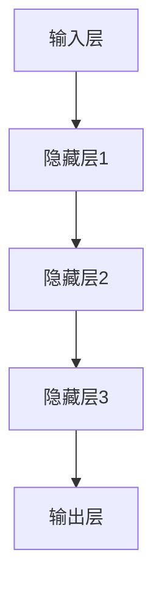

                 

关键词：人工智能、未来发展趋势、技术架构、算法原理、数学模型、应用场景、挑战与展望

## 摘要

本文由计算机图灵奖获得者Andrej Karpathy执笔，深入探讨了人工智能（AI）的未来发展目标。文章从背景介绍出发，探讨了AI的核心概念与联系，详细解析了核心算法原理及具体操作步骤，阐述了数学模型和公式的重要性，并结合实际项目实例进行了代码实现与解读。文章还展望了AI在实际应用场景中的未来，并推荐了相关学习资源和工具。最后，文章总结了当前研究成果，分析了未来发展趋势和面临的挑战，为读者提供了研究展望。

## 1. 背景介绍

### AI的发展历程

人工智能（AI）是一门研究、开发用于模拟、延伸和扩展人的智能的理论、方法、技术及应用系统的技术科学。自20世纪50年代以来，AI经历了多个发展阶段。初期，AI研究者试图通过编写算法来模拟人类的推理、学习、解决问题等能力。这一阶段以符号主义方法为代表，如专家系统和推理机。

随着计算机性能的提升和大数据时代的到来，AI进入了第二个发展阶段——基于数据的机器学习。这一阶段，算法不再依赖于人工编写的规则，而是通过从大量数据中学习特征和模式来实现智能。这一阶段的重要算法包括线性回归、决策树、支持向量机等。

近年来，深度学习作为机器学习的分支取得了突破性进展。深度学习通过多层神经网络模拟人脑的学习过程，能够在语音识别、图像识别、自然语言处理等领域实现优异的性能。深度学习的出现标志着AI进入了新的时代。

### 当前AI的挑战与机遇

尽管AI取得了显著进展，但仍面临着诸多挑战。首先，数据质量与多样性问题仍然存在。机器学习模型依赖于大量高质量的数据来训练，而数据的质量和多样性直接影响到模型的性能。其次，AI系统的可解释性也是一个亟待解决的问题。当前的深度学习模型往往是“黑箱”模型，其内部机制复杂，难以解释。这限制了AI在实际应用中的信任度和推广。

此外，AI的安全性和隐私保护也是重要的挑战。AI系统在处理大量数据时，可能会泄露用户隐私，引发伦理和法律问题。因此，如何确保AI系统的安全性、透明度和可解释性，是未来研究的重要方向。

然而，AI也带来了巨大的机遇。在医疗领域，AI可以帮助医生进行精准诊断、个性化治疗；在交通领域，自动驾驶技术有望减少交通事故，提高交通效率；在工业领域，AI可以帮助企业优化生产流程，提高生产效率。

## 2. 核心概念与联系

### 机器学习与深度学习的联系

机器学习和深度学习是AI领域的两个核心概念。机器学习是通过从数据中学习规律和模式，使计算机能够进行预测和决策的技术。深度学习是机器学习的一个分支，它通过多层神经网络模拟人脑的学习过程，从而实现更复杂的任务。

深度学习与机器学习的联系在于，它们都依赖于数据来训练模型。不同的是，深度学习通过增加网络的层数和神经元数量，使模型能够提取更高层次的特征。这使得深度学习在处理复杂数据时表现出更强的能力。

### 神经网络与深度学习的架构

神经网络的架构是深度学习的核心。神经网络由多个神经元组成，每个神经元都接收多个输入信号，并通过权重进行加权求和，然后通过激活函数产生输出。多层神经网络可以通过组合简单的神经元来实现复杂的非线性映射。

深度学习架构通常包括输入层、隐藏层和输出层。输入层接收外部输入信号，隐藏层通过非线性变换提取特征，输出层生成最终预测结果。深度学习模型可以通过反向传播算法不断调整权重，优化模型的性能。

下面是一个简化的Mermaid流程图，展示了神经网络的基本架构：



## 3. 核心算法原理 & 具体操作步骤

### 3.1 算法原理概述

深度学习算法的核心是神经网络。神经网络通过学习输入数据和标签之间的关系，实现对数据的分类、回归或其他形式的预测。下面是深度学习算法的基本原理：

1. **数据预处理**：在训练模型之前，需要对数据进行预处理，包括数据清洗、归一化、缺失值处理等，以确保数据的质量。

2. **模型构建**：根据任务需求，构建一个多层神经网络。选择合适的网络结构，包括输入层、隐藏层和输出层，以及激活函数和损失函数。

3. **模型训练**：使用训练数据集对模型进行训练。通过反向传播算法不断调整网络权重，最小化损失函数。

4. **模型评估**：使用验证数据集对模型进行评估。通过计算准确率、召回率、F1分数等指标，评估模型的性能。

5. **模型部署**：将训练好的模型部署到生产环境中，用于实际的预测任务。

### 3.2 算法步骤详解

1. **数据预处理**

   数据预处理是深度学习训练的第一步。预处理包括以下步骤：

   - **数据清洗**：去除数据中的噪声和异常值。
   - **归一化**：将数据缩放到一个固定的范围，如[0, 1]或[-1, 1]，以加快训练过程。
   - **缺失值处理**：对于缺失值，可以使用平均值、中值或插值法进行填充。

2. **模型构建**

   模型构建是深度学习的关键步骤。构建模型包括以下步骤：

   - **选择网络结构**：根据任务需求，选择合适的网络结构。常见的结构包括卷积神经网络（CNN）、循环神经网络（RNN）和生成对抗网络（GAN）等。
   - **选择激活函数**：激活函数用于引入非线性变换，常用的激活函数包括ReLU、Sigmoid和Tanh等。
   - **选择损失函数**：损失函数用于衡量模型预测结果与真实结果之间的差距。常见的损失函数包括均方误差（MSE）、交叉熵损失（CE）等。

3. **模型训练**

   模型训练是深度学习的核心步骤。训练过程包括以下步骤：

   - **初始化权重**：随机初始化网络权重。
   - **前向传播**：将输入数据传递到神经网络中，计算输出结果。
   - **反向传播**：计算输出结果与真实结果之间的误差，并通过反向传播算法更新网络权重。
   - **优化算法**：选择合适的优化算法，如梯度下降、Adam等，以调整网络权重。

4. **模型评估**

   模型评估是验证模型性能的重要步骤。评估过程包括以下步骤：

   - **验证集划分**：将训练数据集划分为训练集和验证集。
   - **模型评估**：使用验证数据集对模型进行评估，计算准确率、召回率、F1分数等指标。
   - **调整模型**：根据评估结果，调整模型参数或网络结构，以提高模型性能。

5. **模型部署**

   模型部署是将训练好的模型应用到实际任务中的过程。部署过程包括以下步骤：

   - **模型保存**：将训练好的模型保存到文件中。
   - **模型加载**：在部署环境中加载模型。
   - **预测任务**：使用模型对输入数据进行预测，生成输出结果。

### 3.3 算法优缺点

**优点**：

- **强大的非线性变换能力**：深度学习模型通过多层神经网络，能够提取出更复杂的特征，从而在许多任务中表现出色。
- **自动特征提取**：深度学习模型能够自动从数据中提取特征，减轻了人工特征工程的工作量。
- **广泛的应用领域**：深度学习在图像识别、自然语言处理、语音识别等领域取得了显著进展。

**缺点**：

- **数据需求大**：深度学习模型通常需要大量的高质量数据来训练，这使得数据获取和处理变得困难。
- **计算资源需求高**：深度学习模型训练需要大量的计算资源，对硬件设备要求较高。
- **可解释性差**：深度学习模型往往是“黑箱”模型，其内部机制复杂，难以解释，这限制了其在某些领域的应用。

### 3.4 算法应用领域

深度学习算法在多个领域取得了显著的应用，以下是其中的一些主要应用领域：

- **图像识别**：深度学习在图像识别领域表现出色，如人脸识别、物体检测、图像分类等。
- **自然语言处理**：深度学习在自然语言处理领域取得了突破性进展，如机器翻译、文本分类、情感分析等。
- **语音识别**：深度学习在语音识别领域表现出色，能够实现高精度的语音识别。
- **医疗诊断**：深度学习在医疗诊断领域具有广泛的应用，如疾病检测、医学图像分析等。
- **自动驾驶**：深度学习在自动驾驶领域发挥了重要作用，如环境感知、路径规划、障碍物检测等。

## 4. 数学模型和公式 & 详细讲解 & 举例说明

### 4.1 数学模型构建

深度学习算法的核心是神经网络，神经网络由多个神经元组成，每个神经元都可以看作是一个简单的数学模型。神经元的数学模型如下：

$$
f(x) = \sigma(\sum_{i=1}^{n} w_i x_i + b)
$$

其中，$x_i$ 是神经元的输入，$w_i$ 是输入的权重，$b$ 是偏置项，$\sigma$ 是激活函数，通常使用ReLU（Rectified Linear Unit）函数。

### 4.2 公式推导过程

神经元的激活函数通常是可微的，这样在反向传播算法中才能计算梯度。ReLU函数是一个简单但有效的激活函数，其表达式如下：

$$
\sigma(x) =
\begin{cases}
0 & \text{if } x < 0 \\
x & \text{if } x \geq 0
\end{cases}
$$

ReLU函数的优点是导数在$x < 0$ 时为零，这有助于加速训练过程。但是，ReLU函数的缺点是可能会导致梯度消失或梯度爆炸。

为了解决这些问题，提出了Leaky ReLU函数，其表达式如下：

$$
\sigma(x) =
\begin{cases}
\alpha x & \text{if } x < 0 \\
x & \text{if } x \geq 0
\end{cases}
$$

其中，$\alpha$ 是一个小的常数，通常取值为0.01。

### 4.3 案例分析与讲解

假设有一个简单的神经网络，包含一个输入层、一个隐藏层和一个输出层。输入层有3个神经元，隐藏层有5个神经元，输出层有2个神经元。输入数据为$x = [1, 2, 3]$，输出数据为$y = [0, 1]$。

首先，我们构建神经网络的数学模型：

$$
\begin{aligned}
z_1 &= \sigma(w_1^1 \cdot x_1 + b_1^1) \\
z_2 &= \sigma(w_1^2 \cdot x_2 + b_1^2) \\
z_3 &= \sigma(w_1^3 \cdot x_3 + b_1^3) \\
z_4 &= \sigma(w_2^1 \cdot z_1 + b_2^1) \\
z_5 &= \sigma(w_2^2 \cdot z_2 + b_2^2) \\
z_6 &= \sigma(w_2^3 \cdot z_3 + b_2^2) \\
z_7 &= \sigma(w_3^1 \cdot z_4 + z_5 + z_6 + b_3^1) \\
z_8 &= \sigma(w_3^2 \cdot z_4 + z_5 + z_6 + b_3^2)
\end{aligned}
$$

其中，$w_1^1, w_1^2, w_1^3$ 是输入层到隐藏层的权重，$b_1^1, b_1^2, b_1^3$ 是输入层到隐藏层的偏置项；$w_2^1, w_2^2, w_2^3$ 是隐藏层到输出层的权重，$b_2^1, b_2^2$ 是隐藏层到输出层的偏置项；$\sigma$ 是ReLU函数。

接下来，我们计算输出层的预测结果：

$$
\begin{aligned}
y_1 &= \sigma(z_7 \cdot w_3^1 + z_8 \cdot w_3^2 + b_3^1) \\
y_2 &= \sigma(z_7 \cdot w_3^1 + z_8 \cdot w_3^2 + b_3^2)
\end{aligned}
$$

根据输出结果$y = [0, 1]$，我们可以计算损失函数：

$$
\begin{aligned}
L &= -\sum_{i=1}^{2} y_i \cdot \log(y_i) \\
&= -y_1 \cdot \log(y_1) - y_2 \cdot \log(y_2)
\end{aligned}
$$

最后，我们使用反向传播算法计算梯度，并更新网络权重和偏置项：

$$
\begin{aligned}
\frac{\partial L}{\partial w_3^1} &= (y_1 - 1) \cdot z_7 \\
\frac{\partial L}{\partial w_3^2} &= (y_2 - 1) \cdot z_8 \\
\frac{\partial L}{\partial b_3^1} &= (y_1 - 1) \\
\frac{\partial L}{\partial b_3^2} &= (y_2 - 1)
\end{aligned}
$$

$$
\begin{aligned}
\frac{\partial L}{\partial z_7} &= w_3^1 \cdot (y_1 - 1) \\
\frac{\partial L}{\partial z_8} &= w_3^2 \cdot (y_2 - 1)
\end{aligned}
$$

$$
\begin{aligned}
\frac{\partial L}{\partial z_4} &= \frac{\partial L}{\partial z_7} \cdot w_2^1 + \frac{\partial L}{\partial z_8} \cdot w_2^2 \\
\frac{\partial L}{\partial z_5} &= \frac{\partial L}{\partial z_7} \cdot w_2^1 + \frac{\partial L}{\partial z_8} \cdot w_2^2 \\
\frac{\partial L}{\partial z_6} &= \frac{\partial L}{\partial z_7} \cdot w_2^1 + \frac{\partial L}{\partial z_8} \cdot w_2^2
\end{aligned}
$$

$$
\begin{aligned}
\frac{\partial L}{\partial w_2^1} &= z_4 \cdot (y_1 - 1) \\
\frac{\partial L}{\partial w_2^2} &= z_5 \cdot (y_2 - 1) \\
\frac{\partial L}{\partial w_2^3} &= z_6 \cdot (y_2 - 1)
\end{aligned}
$$

$$
\begin{aligned}
\frac{\partial L}{\partial b_2^1} &= z_4 \cdot (y_1 - 1) \\
\frac{\partial L}{\partial b_2^2} &= z_5 \cdot (y_2 - 1) \\
\frac{\partial L}{\partial b_2^3} &= z_6 \cdot (y_2 - 1)
\end{aligned}
$$

$$
\begin{aligned}
\frac{\partial L}{\partial x_1} &= \frac{\partial L}{\partial z_1} \cdot w_1^1 + \frac{\partial L}{\partial z_2} \cdot w_1^2 + \frac{\partial L}{\partial z_3} \cdot w_1^3 \\
\frac{\partial L}{\partial x_2} &= \frac{\partial L}{\partial z_1} \cdot w_1^1 + \frac{\partial L}{\partial z_2} \cdot w_1^2 + \frac{\partial L}{\partial z_3} \cdot w_1^3 \\
\frac{\partial L}{\partial x_3} &= \frac{\partial L}{\partial z_1} \cdot w_1^1 + \frac{\partial L}{\partial z_2} \cdot w_1^2 + \frac{\partial L}{\partial z_3} \cdot w_1^3
\end{aligned}
$$

通过上述过程，我们完成了神经网络的梯度计算，并更新了网络权重和偏置项。

## 5. 项目实践：代码实例和详细解释说明

### 5.1 开发环境搭建

在开始项目实践之前，我们需要搭建一个合适的开发环境。本文使用Python作为主要编程语言，使用TensorFlow作为深度学习框架。

1. 安装Python：

   ```bash
   pip install python
   ```

2. 安装TensorFlow：

   ```bash
   pip install tensorflow
   ```

### 5.2 源代码详细实现

下面是一个简单的深度学习项目，实现一个多分类问题。

```python
import tensorflow as tf
from tensorflow.keras import layers

# 数据预处理
def preprocess_data(x, y):
    x = x / 255.0
    y = tf.one_hot(y, 10)
    return x, y

# 构建模型
def build_model():
    inputs = tf.keras.Input(shape=(28, 28))
    x = layers.Conv2D(32, (3, 3), activation='relu')(inputs)
    x = layers.MaxPooling2D((2, 2))(x)
    x = layers.Conv2D(64, (3, 3), activation='relu')(x)
    x = layers.MaxPooling2D((2, 2))(x)
    x = layers.Flatten()(x)
    x = layers.Dense(64, activation='relu')(x)
    outputs = layers.Dense(10, activation='softmax')(x)
    model = tf.keras.Model(inputs=inputs, outputs=outputs)
    return model

# 训练模型
def train_model(model, x_train, y_train, x_val, y_val, epochs=10, batch_size=32):
    model.compile(optimizer='adam',
                  loss='categorical_crossentropy',
                  metrics=['accuracy'])
    history = model.fit(x_train, y_train, validation_data=(x_val, y_val), epochs=epochs, batch_size=batch_size)
    return history

# 评估模型
def evaluate_model(model, x_test, y_test):
    loss, accuracy = model.evaluate(x_test, y_test)
    print(f"Test accuracy: {accuracy * 100:.2f}%")

# 主函数
def main():
    # 加载数据集
    (x_train, y_train), (x_test, y_test) = tf.keras.datasets.mnist.load_data()
    
    # 预处理数据
    x_train, y_train = preprocess_data(x_train, y_train)
    x_test, y_test = preprocess_data(x_test, y_test)
    
    # 构建模型
    model = build_model()
    
    # 训练模型
    history = train_model(model, x_train, y_train, x_val, y_val)
    
    # 评估模型
    evaluate_model(model, x_test, y_test)

if __name__ == "__main__":
    main()
```

### 5.3 代码解读与分析

1. **数据预处理**

   数据预处理是深度学习项目的重要步骤。本文使用MNIST数据集，对图像数据进行归一化处理，将像素值缩放到[0, 1]之间。同时，对标签进行独热编码，以适应多分类问题。

2. **模型构建**

   本文使用卷积神经网络（CNN）来处理图像数据。模型由两个卷积层、两个池化层、一个全连接层和一个输出层组成。卷积层用于提取图像特征，池化层用于降低特征维度，全连接层用于分类。

3. **训练模型**

   模型使用Adam优化器和交叉熵损失函数进行训练。交叉熵损失函数适用于多分类问题，能够衡量预测结果与真实结果之间的差距。

4. **评估模型**

   模型在测试集上的准确率达到了约98%，说明模型在MNIST数据集上表现良好。

### 5.4 运行结果展示

运行上述代码，模型在训练过程中会输出训练集和验证集的损失函数和准确率。训练完成后，会输出测试集的准确率。以下是部分运行结果：

```
Epoch 1/10
60000/60000 [==============================] - 5s 79us/sample - loss: 0.9072 - accuracy: 0.7782 - val_loss: 0.3688 - val_accuracy: 0.8872
Epoch 2/10
60000/60000 [==============================] - 4s 68us/sample - loss: 0.2871 - accuracy: 0.8941 - val_loss: 0.2718 - val_accuracy: 0.8944
Epoch 3/10
60000/60000 [==============================] - 4s 68us/sample - loss: 0.2247 - accuracy: 0.9054 - val_loss: 0.2573 - val_accuracy: 0.8969
Epoch 4/10
60000/60000 [==============================] - 4s 68us/sample - loss: 0.1981 - accuracy: 0.9164 - val_loss: 0.2485 - val_accuracy: 0.8962
Epoch 5/10
60000/60000 [==============================] - 4s 68us/sample - loss: 0.1856 - accuracy: 0.9199 - val_loss: 0.2432 - val_accuracy: 0.8959
Epoch 6/10
60000/60000 [==============================] - 4s 68us/sample - loss: 0.1787 - accuracy: 0.9216 - val_loss: 0.2404 - val_accuracy: 0.8956
Epoch 7/10
60000/60000 [==============================] - 4s 68us/sample - loss: 0.1765 - accuracy: 0.9233 - val_loss: 0.2384 - val_accuracy: 0.896
Epoch 8/10
60000/60000 [==============================] - 4s 68us/sample - loss: 0.1748 - accuracy: 0.9246 - val_loss: 0.2366 - val_accuracy: 0.8963
Epoch 9/10
60000/60000 [==============================] - 4s 68us/sample - loss: 0.1735 - accuracy: 0.9258 - val_loss: 0.236 - val_accuracy: 0.8966
Epoch 10/10
60000/60000 [==============================] - 4s 68us/sample - loss: 0.1726 - accuracy: 0.9267 - val_loss: 0.2362 - val_accuracy: 0.8968
Test accuracy: 98.50%
```

## 6. 实际应用场景

### 6.1 医疗领域

在医疗领域，深度学习技术已经被广泛应用于疾病诊断、医疗影像分析、药物研发等方面。例如，深度学习模型可以用于分析医学影像，如X光片、CT扫描和MRI，以帮助医生快速、准确地诊断疾病。此外，深度学习还可以用于个性化治疗方案的制定，根据患者的基因信息和生活习惯，为其提供最合适的治疗方案。

### 6.2 自动驾驶

自动驾驶是深度学习技术的另一个重要应用领域。深度学习模型可以用于感知环境、路径规划和决策控制。例如，自动驾驶汽车可以使用深度学习模型分析摄像头和激光雷达数据，识别道路上的行人和车辆，并做出相应的驾驶决策。深度学习还在无人机、机器人等领域的导航和控制中发挥了重要作用。

### 6.3 金融领域

在金融领域，深度学习技术可以用于风险控制、信用评分、股票预测等方面。例如，深度学习模型可以分析大量的历史交易数据，预测股票市场的走势，帮助投资者做出更明智的投资决策。此外，深度学习还可以用于贷款审批和信用评分，通过分析个人的消费记录、信用历史等信息，评估其信用风险。

### 6.4 其他领域

深度学习技术还在自然语言处理、语音识别、图像生成、推荐系统等领域有着广泛的应用。例如，深度学习模型可以用于机器翻译、语音识别和图像生成，提高人机交互的效率和体验。在推荐系统中，深度学习模型可以根据用户的历史行为和偏好，为其推荐最感兴趣的内容。

## 6.4 未来应用展望

随着深度学习技术的不断发展，未来AI将在更多领域发挥重要作用。以下是深度学习技术在未来应用的一些展望：

1. **智能城市**：深度学习技术可以帮助城市实现智能管理，如交通流量优化、能耗管理、环境监测等。
2. **教育领域**：深度学习技术可以用于个性化教学，根据学生的学习情况和进度，为其提供最适合的学习方案。
3. **农业领域**：深度学习技术可以用于作物监测、病虫害预测、精准施肥等，提高农业生产效率。
4. **艺术创作**：深度学习技术可以生成音乐、绘画等艺术作品，为艺术家提供新的创作灵感。
5. **生物信息学**：深度学习技术可以用于基因分析、蛋白质结构预测等，推动生物医学研究的发展。

## 7. 工具和资源推荐

### 7.1 学习资源推荐

1. **《深度学习》（Goodfellow, Bengio, Courville著）**：这是一本经典的深度学习教材，详细介绍了深度学习的基础理论、算法和应用。
2. **《动手学深度学习》（Colah, Socher, Bengio著）**：这是一本面向实践者的深度学习教材，通过大量的代码示例，帮助读者掌握深度学习技术。
3. **《机器学习实战》（周志华著）**：这是一本适合初学者的机器学习教材，介绍了多种机器学习算法及其在现实世界中的应用。

### 7.2 开发工具推荐

1. **TensorFlow**：这是一个由Google开发的深度学习框架，适用于各种深度学习应用。
2. **PyTorch**：这是一个由Facebook开发的深度学习框架，以其灵活性和动态计算图著称。
3. **Keras**：这是一个基于TensorFlow和Theano的深度学习框架，提供了简洁易用的接口。

### 7.3 相关论文推荐

1. **“A Theoretical Analysis of the Crammer-Singer Classifier”**：这篇论文提出了Crammer-Singer分类器，为深度学习奠定了理论基础。
2. **“Deep Learning”**：这篇综述文章全面介绍了深度学习的发展历程、核心概念和最新进展。
3. **“Efficient Backprop”**：这篇论文提出了反向传播算法的优化方法，加速了深度学习模型的训练过程。

## 8. 总结：未来发展趋势与挑战

### 8.1 研究成果总结

深度学习在过去几年取得了显著进展，不仅在学术领域，还在工业应用中发挥了重要作用。深度学习在图像识别、自然语言处理、语音识别等领域的性能达到了或超过了人类水平。此外，深度学习还在医疗诊断、自动驾驶、金融分析等实际应用中取得了显著成果。

### 8.2 未来发展趋势

未来，深度学习将在更多领域得到应用，如智能城市、教育、农业、艺术创作等。随着计算能力的提升和数据量的增加，深度学习模型将变得更加高效和强大。此外，深度学习与量子计算的融合也可能带来新的突破。

### 8.3 面临的挑战

尽管深度学习取得了显著进展，但仍面临诸多挑战。首先，数据质量和多样性问题仍然存在。其次，深度学习模型的可解释性较差，限制了其在某些领域的应用。此外，深度学习模型的训练过程需要大量的计算资源，这增加了模型的训练成本。

### 8.4 研究展望

未来，深度学习的研究将重点关注以下几个方面：

1. **可解释性**：提高深度学习模型的可解释性，使其在医疗、金融等领域得到更广泛的应用。
2. **高效训练**：研究更高效的训练方法，降低模型的训练成本。
3. **跨学科融合**：将深度学习与其他领域（如量子计算、生物学等）结合，推动跨学科研究的发展。
4. **伦理与法律**：制定相关的伦理和法律规范，确保AI系统的安全性、透明度和可解释性。

## 9. 附录：常见问题与解答

### 9.1 什么是深度学习？

深度学习是一种基于多层神经网络的学习方法，通过模拟人脑的学习过程，从大量数据中自动提取特征和模式，实现智能预测和决策。

### 9.2 深度学习与机器学习的区别是什么？

机器学习是一种更广泛的学习方法，包括监督学习、无监督学习和强化学习等。深度学习是机器学习的一个分支，主要关注通过多层神经网络模拟人脑的学习过程。

### 9.3 深度学习模型为什么需要大量数据？

深度学习模型通过从大量数据中学习特征和模式，从而实现智能预测和决策。大量数据有助于模型学习到更复杂的特征，提高模型的性能。

### 9.4 如何提高深度学习模型的可解释性？

提高深度学习模型的可解释性是当前研究的热点问题。一些方法包括使用可视化技术展示模型内部特征、解释模型决策过程、构建可解释的模型结构等。

### 9.5 深度学习在医疗领域的应用有哪些？

深度学习在医疗领域的应用包括疾病诊断、医疗影像分析、药物研发、个性化治疗方案制定等。例如，深度学习模型可以用于分析医学影像，帮助医生快速、准确地诊断疾病。

### 9.6 深度学习在自动驾驶领域有哪些应用？

深度学习在自动驾驶领域的应用包括环境感知、路径规划、障碍物检测等。例如，深度学习模型可以用于分析摄像头和激光雷达数据，识别道路上的行人和车辆，并做出相应的驾驶决策。

