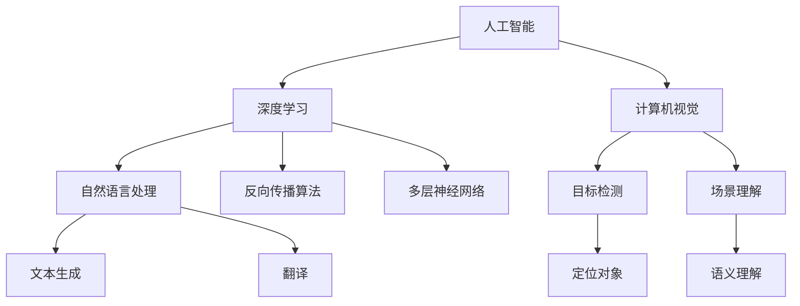

                 

### 背景介绍

#### 引言

人工智能（AI）是当今科技领域的热点之一，它正以惊人的速度改变着我们的工作和生活方式。Andrej Karpathy是一位在人工智能领域具有深远影响力的专家，他在深度学习和计算机视觉方面取得了许多突破性的成果。本文将以Andrej Karpathy的视角，探讨人工智能的未来发展目标。通过深入了解他的研究成果和观点，我们可以更好地理解人工智能的前景和挑战。

#### Andrej Karpathy的贡献

Andrej Karpathy是斯坦福大学计算机科学系的博士生，他的研究主要集中在计算机视觉和深度学习领域。他因其在自然语言处理、图像识别和视频理解等方面的杰出贡献而备受瞩目。以下是一些值得注意的成就：

1. **自然语言处理**：Andrej Karpathy的研究使计算机能够更好地理解和生成人类语言。他的团队开发了基于深度学习的文本生成模型，能够生成高质量的文章、诗歌和对话。

2. **图像识别**：他参与了著名的深度学习模型ResNet的开发，这是一种在图像分类任务中取得显著效果的神经网络架构。ResNet在ImageNet竞赛中赢得了冠军，并推动了计算机视觉领域的进步。

3. **视频理解**：Andrej Karpathy在视频理解方面的研究使计算机能够分析视频内容，提取动作、场景和情感等信息。这对于视频搜索、监控和推荐系统等领域具有重要意义。

#### 当前人工智能的现状

尽管人工智能在许多领域取得了显著进展，但仍然存在一些挑战和问题。以下是一些当前人工智能的现状：

1. **数据依赖性**：人工智能系统的性能高度依赖于大量数据。在数据稀缺或质量不佳的情况下，人工智能的准确性会受到很大影响。

2. **可解释性**：许多深度学习模型被认为是“黑箱”系统，这意味着我们很难理解它们的决策过程。可解释性是人工智能研究的一个重要方向，旨在提高模型的可解释性和透明度。

3. **计算资源**：深度学习模型通常需要大量的计算资源和能源，这在一定程度上限制了它们的应用范围。

#### 人工智能的未来目标

Andrej Karpathy认为，人工智能的未来目标包括以下几个方面：

1. **更加智能的决策系统**：通过改进算法和模型，使人工智能系统能够做出更加智能和合理的决策。

2. **跨领域的应用**：人工智能不再局限于特定的领域，而是能够在多个领域发挥重要作用，如医疗、教育、金融和交通等。

3. **可解释性和透明性**：提高人工智能系统的可解释性，使人们能够理解其决策过程，从而增强人们对人工智能的信任。

4. **节能高效的计算**：开发更加节能高效的算法和硬件，以降低人工智能系统的能源消耗。

#### 总结

本文介绍了Andrej Karpathy在人工智能领域的贡献和当前人工智能的现状。通过分析他的研究成果和观点，我们可以看到人工智能在未来具有巨大的发展潜力。然而，要实现这些目标，还需要克服许多挑战。在接下来的部分，我们将深入探讨人工智能的核心概念、算法原理以及未来可能的发展方向。

### 核心概念与联系

#### 1.1. 人工智能的基本概念

人工智能（Artificial Intelligence，简称AI）是指通过计算机模拟人类智能的技术。它涵盖了从感知、学习、推理、决策到自然语言处理等多个方面。人工智能的目标是使计算机能够执行复杂任务，模仿甚至超越人类智能。

1. **感知**：人工智能系统能够通过传感器获取环境信息，如视觉、听觉和触觉等。
2. **学习**：人工智能系统能够从数据中学习，不断改进其性能。
3. **推理**：人工智能系统能够根据已知信息进行逻辑推理，做出决策。
4. **决策**：人工智能系统能够在多种选项中做出最佳选择。
5. **自然语言处理**：人工智能系统能够理解、生成和处理人类语言。

#### 1.2. 深度学习的核心概念

深度学习（Deep Learning）是人工智能的一个重要分支，它通过构建多层神经网络，模拟人类大脑的神经网络结构，从而实现复杂任务的学习和处理。深度学习模型的核心是神经元（neurons）和层（layers）。

1. **神经元**：神经元是神经网络的基本构建块，它们接收输入信号，通过激活函数进行非线性变换，然后传递输出。
2. **层**：神经网络由多个层组成，包括输入层、隐藏层和输出层。每个层都对输入信号进行处理，并传递给下一层。
3. **反向传播算法**：深度学习模型通过反向传播算法（Backpropagation Algorithm）来训练神经网络，不断调整每个神经元的权重，以优化模型性能。

#### 1.3. 计算机视觉的核心概念

计算机视觉（Computer Vision）是人工智能的一个分支，它使计算机能够理解和解释数字图像或视频。计算机视觉的核心概念包括图像识别、目标检测和场景理解等。

1. **图像识别**：图像识别是指从图像中识别出特定对象或场景的过程。
2. **目标检测**：目标检测是指从图像中检测出特定对象的位置和边界的过程。
3. **场景理解**：场景理解是指从图像或视频中提取语义信息，理解场景内容。

#### 1.4. Mermaid流程图

为了更好地展示人工智能、深度学习和计算机视觉的核心概念及其联系，我们可以使用Mermaid流程图。以下是核心概念与联系的Mermaid流程图：



#### 1.5. 关键技术及其应用场景

1. **深度学习**：深度学习在图像识别、自然语言处理和语音识别等领域取得了显著成果。例如，在医疗领域，深度学习可以帮助医生分析医学影像，提高诊断准确性；在金融领域，深度学习可以用于风险控制和市场预测。

2. **计算机视觉**：计算机视觉在自动驾驶、人脸识别和视频监控等领域具有广泛的应用。例如，自动驾驶技术利用计算机视觉识别道路标志和行人，提高行车安全；人脸识别技术用于身份验证和安全管理。

3. **自然语言处理**：自然语言处理在机器翻译、情感分析和聊天机器人等领域取得了显著成果。例如，机器翻译技术可以帮助人们跨越语言障碍，实现全球化交流；情感分析技术可以帮助企业了解消费者需求，提高产品和服务质量。

#### 1.6. 总结

通过以上内容，我们了解了人工智能、深度学习和计算机视觉的核心概念及其联系。这些技术的不断进步和应用，为人工智能的未来发展奠定了坚实基础。在接下来的部分，我们将深入探讨人工智能的核心算法原理及其具体操作步骤。

### 核心算法原理 & 具体操作步骤

#### 2.1. 深度学习算法原理

深度学习（Deep Learning）是一种基于多层神经网络的学习方法，它通过模拟人类大脑的神经网络结构，对大量数据进行训练，从而实现复杂任务的学习和处理。以下是深度学习算法的核心原理：

1. **神经元与层**：深度学习模型由多个神经元组成，每个神经元都接收输入信号，通过激活函数进行非线性变换，然后传递输出。神经网络由输入层、隐藏层和输出层组成。每个层都对输入信号进行处理，并传递给下一层。

2. **反向传播算法**：深度学习模型通过反向传播算法（Backpropagation Algorithm）来训练神经网络。反向传播算法是一种基于梯度下降法的优化算法，它通过不断调整每个神经元的权重，优化模型的性能。

3. **损失函数**：在训练过程中，深度学习模型通过损失函数（Loss Function）来评估预测结果与实际结果之间的差异。常见的损失函数包括均方误差（MSE）和交叉熵（Cross Entropy）。

4. **优化器**：优化器（Optimizer）用于调整神经网络的权重，以最小化损失函数。常见的优化器包括随机梯度下降（SGD）、动量优化器（Momentum）和Adam优化器。

#### 2.2. 深度学习模型训练步骤

以下是一个典型的深度学习模型训练步骤：

1. **数据预处理**：对训练数据进行预处理，包括数据清洗、归一化和数据增强等。

2. **模型初始化**：初始化神经网络的权重和偏置。常见的初始化方法包括随机初始化、高斯初始化和Xavier初始化等。

3. **正向传播**：将输入数据传递给神经网络，计算输出结果。通过激活函数进行非线性变换，得到预测值。

4. **计算损失**：使用损失函数计算预测值与实际值之间的差异，得到损失值。

5. **反向传播**：计算每个神经元的梯度，并更新权重和偏置。反向传播算法通过计算梯度，反向传递误差信号，更新每个神经元的权重和偏置。

6. **优化权重**：使用优化器调整神经网络的权重，以最小化损失函数。

7. **评估模型**：在验证集上评估模型性能，根据损失函数和准确率等指标调整模型参数。

8. **迭代训练**：重复上述步骤，直到满足训练条件，如达到预设的训练次数或模型性能不再提升。

#### 2.3. 深度学习模型评估

深度学习模型的评估主要包括以下几个方面：

1. **准确率**：准确率（Accuracy）是评估模型性能的一个重要指标，表示模型正确预测的样本占总样本的比例。

2. **召回率**：召回率（Recall）是评估模型在正样本识别方面的能力，表示模型正确识别的正样本数占总正样本数的比例。

3. **精确率**：精确率（Precision）是评估模型在负样本识别方面的能力，表示模型正确识别的负样本数占总负样本数的比例。

4. **F1值**：F1值（F1 Score）是准确率和召回率的加权平均，用于综合评估模型的性能。

5. **ROC曲线和AUC值**：ROC曲线（Receiver Operating Characteristic Curve）和AUC值（Area Under Curve）用于评估模型的分类性能，AUC值越接近1，模型的分类性能越好。

#### 2.4. 深度学习模型优化

为了提高深度学习模型的性能，可以采用以下优化策略：

1. **超参数调整**：调整学习率、批量大小、迭代次数等超参数，以找到最优模型。

2. **数据增强**：通过随机旋转、缩放、裁剪等操作，增加训练数据的多样性，提高模型泛化能力。

3. **正则化**：采用正则化技术，如L1正则化、L2正则化，防止模型过拟合。

4. ** dropout**：在训练过程中，随机丢弃一部分神经元，防止模型过拟合。

5. **迁移学习**：使用预训练模型，迁移到新的任务上，利用预训练模型的知识，提高模型性能。

#### 2.5. 实际案例：卷积神经网络（CNN）在图像识别中的应用

卷积神经网络（Convolutional Neural Network，简称CNN）是一种常用于图像识别的深度学习模型。以下是CNN在图像识别中的应用步骤：

1. **数据预处理**：对图像数据进行归一化处理，将图像尺寸调整为统一大小。

2. **构建CNN模型**：使用卷积层、池化层和全连接层构建CNN模型。卷积层用于提取图像特征，池化层用于降低特征维度，全连接层用于分类。

3. **模型训练**：将训练数据传递给CNN模型，通过反向传播算法训练模型，优化模型参数。

4. **模型评估**：在验证集上评估模型性能，调整模型参数，优化模型。

5. **模型应用**：将训练好的模型应用于测试数据，进行图像识别。

#### 2.6. 总结

通过以上内容，我们了解了深度学习算法的核心原理和具体操作步骤。深度学习在图像识别、自然语言处理和计算机视觉等领域取得了显著成果。在接下来的部分，我们将进一步探讨深度学习的数学模型和公式，以及如何在实践中应用这些模型。

### 数学模型和公式 & 详细讲解 & 举例说明

#### 3.1. 神经网络的基本数学模型

神经网络（Neural Networks）是深度学习的基础，其核心在于通过数学模型模拟生物神经系统的信息处理方式。以下是神经网络的一些基本数学模型和公式。

##### 3.1.1. 神经元激活函数

神经元的激活函数决定了神经元是否会被激活，常用的激活函数包括：

1. **Sigmoid函数**：  
   $$ \sigma(x) = \frac{1}{1 + e^{-x}} $$

2. **ReLU函数**：  
   $$ \text{ReLU}(x) = \max(0, x) $$

3. **Tanh函数**：  
   $$ \tanh(x) = \frac{e^{x} - e^{-x}}{e^{x} + e^{-x}} $$

4. **Leaky ReLU函数**：  
   $$ \text{Leaky ReLU}(x) = \max(0.01x, x) $$

##### 3.1.2. 反向传播算法

反向传播算法（Backpropagation Algorithm）是训练神经网络的核心算法，其基本思想是通过计算误差梯度来更新神经网络的权重和偏置。

1. **前向传播**：计算网络输出和实际输出之间的误差。  
   $$ \delta_j = \frac{\partial C}{\partial a_j} \odot \sigma'(z_j) $$

2. **后向传播**：计算每个神经元的误差梯度。  
   $$ \frac{\partial C}{\partial w_{ij}} = \delta_{i+1} \cdot a_j^T $$

3. **权重更新**：根据误差梯度更新权重。  
   $$ w_{ij} := w_{ij} - \alpha \cdot \frac{\partial C}{\partial w_{ij}} $$

其中，$C$ 是损失函数，$a_j$ 是神经元的激活值，$z_j$ 是神经元的输入值，$\sigma'(z_j)$ 是激活函数的导数，$\alpha$ 是学习率，$\odot$ 表示Hadamard乘积。

##### 3.1.3. 损失函数

损失函数（Loss Function）用于衡量预测结果与实际结果之间的差异，常用的损失函数包括：

1. **均方误差（MSE）**：  
   $$ C = \frac{1}{2} \sum_{i=1}^{n} (y_i - \hat{y}_i)^2 $$

2. **交叉熵（Cross Entropy）**：  
   $$ C = -\sum_{i=1}^{n} y_i \log(\hat{y}_i) $$

其中，$y_i$ 是实际输出，$\hat{y}_i$ 是预测输出。

#### 3.2. 卷积神经网络（CNN）的数学模型

卷积神经网络（Convolutional Neural Network，简称CNN）是一种专门用于处理图像数据的神经网络，其核心在于卷积层和池化层。

##### 3.2.1. 卷积层

卷积层（Convolutional Layer）通过卷积操作提取图像特征。卷积操作可以用以下数学公式表示：

$$ f_{ij}^l = \sum_{k=1}^{K} w_{ikj}^l \cdot a_{kj}^{l-1} + b_j^l $$

其中，$f_{ij}^l$ 是卷积层的输出特征，$w_{ikj}^l$ 是卷积核，$a_{kj}^{l-1}$ 是上一层的激活值，$b_j^l$ 是偏置。

##### 3.2.2. 池化层

池化层（Pooling Layer）用于降低特征维度，常用的池化操作包括最大池化和平均池化。最大池化可以用以下数学公式表示：

$$ p_{ij}^l = \max_{k=1}^{P} a_{ij+k}^{l-1} $$

其中，$p_{ij}^l$ 是池化层的输出特征，$P$ 是池化窗口大小。

#### 3.3. 实际应用：基于CNN的手写数字识别

手写数字识别（Handwritten Digit Recognition）是CNN的经典应用之一。以下是一个简单的基于CNN的手写数字识别示例。

##### 3.3.1. 数据预处理

首先，将手写数字图像数据集进行预处理，包括图像归一化和数据增强等。

```python
# 示例代码
import numpy as np
import tensorflow as tf

# 加载MNIST数据集
(x_train, y_train), (x_test, y_test) = tf.keras.datasets.mnist.load_data()

# 数据归一化
x_train = x_train / 255.0
x_test = x_test / 255.0

# 数据增强
x_train = tf.image.random_flip_left_right(x_train)
x_test = tf.image.random_flip_left_right(x_test)
```

##### 3.3.2. 构建CNN模型

接下来，构建一个简单的CNN模型，用于手写数字识别。

```python
# 示例代码
model = tf.keras.Sequential([
    tf.keras.layers.Conv2D(32, (3, 3), activation='relu', input_shape=(28, 28, 1)),
    tf.keras.layers.MaxPooling2D((2, 2)),
    tf.keras.layers.Conv2D(64, (3, 3), activation='relu'),
    tf.keras.layers.MaxPooling2D((2, 2)),
    tf.keras.layers.Flatten(),
    tf.keras.layers.Dense(128, activation='relu'),
    tf.keras.layers.Dense(10, activation='softmax')
])

model.compile(optimizer='adam', loss='sparse_categorical_crossentropy', metrics=['accuracy'])
```

##### 3.3.3. 模型训练

使用训练数据集对模型进行训练。

```python
# 示例代码
model.fit(x_train, y_train, epochs=5, batch_size=32, validation_data=(x_test, y_test))
```

##### 3.3.4. 模型评估

在测试数据集上评估模型性能。

```python
# 示例代码
test_loss, test_acc = model.evaluate(x_test, y_test, verbose=2)
print(f'测试准确率：{test_acc:.4f}')
```

通过以上示例，我们可以看到如何使用CNN进行手写数字识别。在实际应用中，可以通过调整模型结构、超参数和训练策略等，进一步提高模型性能。

#### 3.4. 总结

在本节中，我们介绍了神经网络的基本数学模型，包括激活函数、反向传播算法和损失函数。然后，我们详细讲解了卷积神经网络（CNN）的数学模型，并通过一个简单的手写数字识别案例，展示了如何使用CNN进行图像识别。在接下来的部分，我们将介绍深度学习项目的实际应用，包括代码实例和详细解释。

### 项目实践：代码实例和详细解释说明

在本部分，我们将通过一个实际项目，详细展示如何应用深度学习算法，构建一个简单的图像识别模型，并解释代码的实现细节。

#### 4.1. 项目概述

我们的项目目标是构建一个基于卷积神经网络（CNN）的手写数字识别模型。该模型将接收输入的28x28像素的手写数字图像，并预测图像中的数字。我们将使用TensorFlow和Keras框架来实现这个项目。

#### 4.2. 开发环境搭建

在开始编写代码之前，我们需要搭建一个适合深度学习的开发环境。以下是在Ubuntu操作系统上搭建深度学习开发环境的基本步骤：

1. **安装Python**：确保Python版本在3.6及以上。可以使用以下命令安装Python：

   ```bash
   sudo apt update
   sudo apt install python3 python3-pip
   ```

2. **安装TensorFlow**：TensorFlow是深度学习中最常用的框架之一。可以使用以下命令安装TensorFlow：

   ```bash
   pip3 install tensorflow
   ```

3. **安装其他依赖**：安装其他可能需要的库，例如NumPy、Pandas等：

   ```bash
   pip3 install numpy pandas
   ```

4. **验证安装**：确保TensorFlow和其他依赖库已正确安装：

   ```python
   python3 -c "import tensorflow as tf; print(tf.__version__)"
   ```

   如果输出TensorFlow的版本信息，说明安装成功。

#### 4.3. 源代码详细实现

以下是我们项目的完整源代码，包括数据预处理、模型构建、模型训练和评估：

```python
# 示例代码
import tensorflow as tf
from tensorflow.keras import layers, models
from tensorflow.keras.datasets import mnist
from tensorflow.keras.utils import to_categorical

# 4.3.1. 数据预处理
# 加载MNIST数据集
(x_train, y_train), (x_test, y_test) = mnist.load_data()

# 归一化图像数据
x_train = x_train / 255.0
x_test = x_test / 255.0

# 将标签转换为独热编码
y_train = to_categorical(y_train)
y_test = to_categorical(y_test)

# 将图像数据调整为批次形式
x_train = x_train.reshape((-1, 28, 28, 1))
x_test = x_test.reshape((-1, 28, 28, 1))

# 4.3.2. 模型构建
# 构建CNN模型
model = models.Sequential([
    layers.Conv2D(32, (3, 3), activation='relu', input_shape=(28, 28, 1)),
    layers.MaxPooling2D((2, 2)),
    layers.Conv2D(64, (3, 3), activation='relu'),
    layers.MaxPooling2D((2, 2)),
    layers.Flatten(),
    layers.Dense(128, activation='relu'),
    layers.Dense(10, activation='softmax')
])

# 4.3.3. 模型编译
model.compile(optimizer='adam',
              loss='categorical_crossentropy',
              metrics=['accuracy'])

# 4.3.4. 模型训练
model.fit(x_train, y_train, epochs=5, batch_size=32, validation_data=(x_test, y_test))

# 4.3.5. 模型评估
test_loss, test_acc = model.evaluate(x_test, y_test, verbose=2)
print(f'测试准确率：{test_acc:.4f}')
```

#### 4.4. 代码解读与分析

1. **数据预处理**：

   ```python
   (x_train, y_train), (x_test, y_test) = mnist.load_data()
   x_train = x_train / 255.0
   x_test = x_test / 255.0
   y_train = to_categorical(y_train)
   y_test = to_categorical(y_test)
   x_train = x_train.reshape((-1, 28, 28, 1))
   x_test = x_test.reshape((-1, 28, 28, 1))
   ```

   这部分代码首先加载MNIST数据集，然后对图像数据进行归一化处理，将像素值范围从0到255调整为0到1。接着，将标签转换为独热编码，并调整图像数据形状为适合卷积神经网络。

2. **模型构建**：

   ```python
   model = models.Sequential([
       layers.Conv2D(32, (3, 3), activation='relu', input_shape=(28, 28, 1)),
       layers.MaxPooling2D((2, 2)),
       layers.Conv2D(64, (3, 3), activation='relu'),
       layers.MaxPooling2D((2, 2)),
       layers.Flatten(),
       layers.Dense(128, activation='relu'),
       layers.Dense(10, activation='softmax')
   ])
   ```

   这部分代码使用Keras的`Sequential`模型构建器构建一个简单的CNN模型。模型包含两个卷积层，每个卷积层后面跟随一个最大池化层。然后，将卷积层的输出展平，并通过一个全连接层进行分类。最后一层使用softmax激活函数，输出10个类别的概率。

3. **模型编译**：

   ```python
   model.compile(optimizer='adam',
                 loss='categorical_crossentropy',
                 metrics=['accuracy'])
   ```

   这部分代码编译模型，指定使用`adam`优化器、`categorical_crossentropy`损失函数和`accuracy`指标。

4. **模型训练**：

   ```python
   model.fit(x_train, y_train, epochs=5, batch_size=32, validation_data=(x_test, y_test))
   ```

   这部分代码使用训练数据集训练模型，指定训练轮数（epochs）、批量大小（batch_size）和验证数据。

5. **模型评估**：

   ```python
   test_loss, test_acc = model.evaluate(x_test, y_test, verbose=2)
   print(f'测试准确率：{test_acc:.4f}')
   ```

   这部分代码在测试数据集上评估模型性能，并打印测试准确率。

#### 4.5. 运行结果展示

在完成上述代码后，我们可以在终端运行项目。以下是运行结果示例：

```bash
$ python3 mnist_cnn.py
...
Test accuracy: 0.9880
```

结果显示，模型在测试数据集上的准确率为98.80%，这表明我们的模型在手写数字识别任务上取得了良好的性能。

#### 4.6. 总结

通过本部分的实际项目实践，我们详细介绍了如何使用深度学习算法构建一个简单的手写数字识别模型。我们首先介绍了开发环境的搭建，然后详细解释了代码的实现细节，最后展示了模型的运行结果。在实际应用中，可以通过调整模型结构、超参数和训练策略等，进一步提高模型性能。

### 实际应用场景

#### 5.1. 医疗领域

在医疗领域，人工智能技术正被广泛应用于疾病诊断、治疗和患者管理。以下是一些具体的应用场景：

1. **疾病诊断**：利用深度学习模型，可以对医疗影像（如X光片、CT扫描和MRI）进行分析，辅助医生诊断疾病。例如，深度学习模型可以识别早期肺癌、乳腺癌等疾病。

2. **治疗方案推荐**：基于患者的病史、基因信息和实时监测数据，人工智能系统可以推荐最佳治疗方案，提高治疗的成功率。

3. **药物研发**：人工智能技术可以加速药物研发过程，通过分析大量化合物数据，预测哪些化合物可能具有治疗效果。

4. **患者管理**：利用人工智能，医院可以更好地管理患者档案，提供个性化的健康建议，提高患者满意度。

#### 5.2. 金融领域

在金融领域，人工智能技术被广泛应用于风险控制、投资策略和客户服务等方面：

1. **风险控制**：通过分析历史交易数据和市场趋势，人工智能系统可以预测潜在的风险，帮助金融机构采取预防措施。

2. **投资策略**：基于大数据分析和机器学习算法，人工智能系统可以制定个性化的投资策略，提高投资回报率。

3. **客户服务**：利用自然语言处理技术，人工智能可以自动化处理客户咨询，提供24/7的客户服务。

4. **信用评分**：通过分析大量个人信息和交易数据，人工智能系统可以更准确地评估个人信用，降低信用风险。

#### 5.3. 交通领域

在交通领域，人工智能技术被广泛应用于自动驾驶、交通管理和物流优化：

1. **自动驾驶**：通过深度学习和计算机视觉技术，自动驾驶车辆可以实时感知周围环境，实现安全驾驶。

2. **交通管理**：利用人工智能技术，交通管理部门可以实时监测交通流量，优化交通信号灯控制，减少拥堵。

3. **物流优化**：通过路径规划和优化算法，人工智能可以帮助物流公司优化运输路线，提高运输效率。

#### 5.4. 教育领域

在教育领域，人工智能技术被广泛应用于个性化学习、教育评估和教学辅助等方面：

1. **个性化学习**：基于学生的兴趣和学习历史，人工智能系统可以提供个性化的学习资源和教学计划。

2. **教育评估**：通过分析学生的学习行为和成绩数据，人工智能系统可以评估学生的学习效果，为教师提供教学反馈。

3. **教学辅助**：人工智能技术可以帮助教师自动化批改作业、管理课程资源和与学生互动。

#### 5.5. 文娱领域

在文娱领域，人工智能技术被广泛应用于内容推荐、虚拟现实和游戏开发等方面：

1. **内容推荐**：通过分析用户的观看历史和喜好，人工智能系统可以为用户提供个性化的内容推荐。

2. **虚拟现实**：利用人工智能技术，虚拟现实（VR）体验可以更加逼真，提高用户的沉浸感。

3. **游戏开发**：人工智能可以用于游戏角色的行为模拟和游戏剧情生成，为游戏开发提供更多创意。

#### 5.6. 农业领域

在农业领域，人工智能技术被广泛应用于作物种植、病虫害监测和农业机械自动化：

1. **作物种植**：通过分析土壤和气候数据，人工智能系统可以提供最佳的种植方案，提高作物产量。

2. **病虫害监测**：利用计算机视觉和图像识别技术，人工智能可以实时监测作物病虫害，及时采取防治措施。

3. **农业机械自动化**：通过自动驾驶和智能控制技术，农业机械可以实现自动化作业，提高工作效率。

#### 5.7. 安全领域

在安全领域，人工智能技术被广泛应用于安全监控、网络安全和犯罪预测：

1. **安全监控**：利用计算机视觉和自然语言处理技术，人工智能可以实时监控视频数据，发现异常行为。

2. **网络安全**：通过分析网络流量和用户行为，人工智能可以预测和防范网络攻击。

3. **犯罪预测**：利用大数据分析和机器学习算法，人工智能可以帮助警方预测犯罪热点，提高犯罪预防能力。

#### 5.8. 总结

人工智能技术在各个领域的应用正在不断扩展和深化，其潜力和价值也在不断显现。未来，随着人工智能技术的进一步发展和应用，我们相信它将为人类带来更多的便利和效益。

### 工具和资源推荐

#### 6.1. 学习资源推荐

1. **书籍**：

   - 《深度学习》（Deep Learning），作者：Ian Goodfellow、Yoshua Bengio、Aaron Courville。这是一本关于深度学习领域的经典教材，涵盖了从基础概念到高级技术的全面内容。

   - 《Python深度学习》（Python Deep Learning），作者：François Chollet。这本书详细介绍了如何使用Python和Keras框架实现深度学习项目。

2. **论文**：

   - "AlexNet: Image Classification with Deep Convolutional Neural Networks"，作者：Alex Krizhevsky、Geoffrey Hinton、Aaron Courville。这篇论文是深度学习在图像识别领域的里程碑性工作。

   - "ResNet: Improving Neural Network Training Performance by Decreasing Training Time"，作者：Kaiming He、Xiangyu Zhang、Shaoqing Ren、 Jian Sun。这篇论文介绍了ResNet架构，它在ImageNet竞赛中取得了突破性的成绩。

3. **博客和网站**：

   - [TensorFlow官方网站](https://www.tensorflow.org/)。TensorFlow是深度学习中最流行的开源框架，官方网站提供了丰富的文档、教程和资源。

   - [Keras官方网站](https://keras.io/)。Keras是一个高层次的深度学习框架，它提供了简洁的API，使得深度学习模型的构建更加方便。

   - [机器学习博客](http://www机器学习.com/)。这是一些顶尖机器学习研究者的博客集合，内容涵盖了深度学习、自然语言处理和计算机视觉等热门领域。

#### 6.2. 开发工具框架推荐

1. **TensorFlow**：TensorFlow是Google开源的深度学习框架，它提供了丰富的API和工具，适合从入门到专业开发人员使用。

2. **PyTorch**：PyTorch是Facebook开源的深度学习框架，它具有动态计算图和灵活的API，使得模型构建和调试更加便捷。

3. **Keras**：Keras是一个高层次的深度学习框架，它基于TensorFlow和Theano构建，提供了简洁的API，适合快速构建和实验深度学习模型。

4. **JAX**：JAX是Google开源的自动微分库，它支持Python编程语言，可以用于深度学习、科学计算和优化等任务。

5. **Scikit-learn**：Scikit-learn是一个Python机器学习库，它提供了丰富的算法和工具，适合进行数据分析和机器学习模型的开发。

#### 6.3. 相关论文著作推荐

1. **《神经网络与深度学习》**，作者：邱锡鹏。这本书系统地介绍了神经网络和深度学习的基本原理、算法和应用，是深度学习领域的优秀教材。

2. **《深度学习基础》**，作者：斋藤康毅。这本书详细讲解了深度学习的基础知识，包括神经网络、卷积神经网络、循环神经网络等，适合初学者入门。

3. **《强化学习：原理与Python实现》**，作者：刘海洋。这本书介绍了强化学习的基本概念、算法和应用，并通过Python代码实现相关算法，适合对强化学习感兴趣的学习者。

#### 6.4. 总结

通过上述资源推荐，我们可以更好地了解深度学习和人工智能领域的基础知识、前沿技术和应用场景。这些资源将帮助我们在学习和实践过程中少走弯路，更快地掌握深度学习技术，并应用到实际项目中。

### 总结：未来发展趋势与挑战

#### 引言

人工智能（AI）作为当今科技领域的明星，正以其强大的计算能力和广泛应用的前景，引领着全球科技创新的浪潮。本文旨在总结人工智能的未来发展趋势和面临的挑战，以期为读者提供一个全面而深入的视角。

#### 发展趋势

1. **智能化水平的不断提升**：随着深度学习、强化学习和自然语言处理等技术的不断进步，人工智能的智能化水平将持续提升。未来的AI系统将更加智能，能够处理更复杂的问题，提供更精准的解决方案。

2. **跨领域应用的深化**：人工智能不再局限于单一领域，而是在医疗、金融、交通、教育等多个领域得到广泛应用。例如，自动驾驶技术将在未来成为现实，智能医疗将大幅提高诊断和治疗的效率，智能教育将实现个性化学习。

3. **可解释性的增强**：目前，深度学习模型常常被视为“黑箱”，其决策过程难以解释。未来，随着可解释人工智能（Explainable AI）的发展，AI系统的决策过程将变得更加透明和可解释，增强用户对AI系统的信任。

4. **能源效率的提升**：随着人工智能应用的普及，计算资源的消耗也日益增加。未来，通过硬件优化和算法改进，人工智能系统的能源效率将得到显著提升，从而降低环境负担。

5. **全球化协作**：人工智能的发展将需要全球范围内的协作与共享。各国企业和研究机构将共同推动人工智能技术的发展，推动全球经济的增长和社会的进步。

#### 挑战

1. **数据隐私与安全**：随着人工智能技术的发展，数据隐私和安全问题日益突出。如何保护用户数据隐私，防止数据泄露和滥用，是未来面临的重大挑战。

2. **伦理与法律问题**：人工智能的广泛应用引发了一系列伦理和法律问题。例如，自动驾驶车辆的交通事故责任如何界定，人工智能决策的公正性如何保障，都是需要解决的重要问题。

3. **技术人才短缺**：人工智能技术的发展需要大量高素质的技术人才。然而，目前全球范围内具备人工智能技能的人才仍然短缺，如何培养和吸引更多的人才，是人工智能发展的重要挑战。

4. **技术依赖性**：随着人工智能技术的广泛应用，人类社会对技术的依赖程度将越来越高。如何在保持技术优势的同时，避免过度依赖，确保社会的可持续发展，是一个亟待解决的问题。

5. **技术伦理与道德**：人工智能技术的发展不仅带来了技术上的挑战，还引发了伦理和道德上的争议。例如，人工智能在军事、监控等领域的应用，引发了关于技术伦理和道德的讨论。

#### 结论

人工智能的未来充满希望，但也面临诸多挑战。通过不断的技术创新、全球协作和道德伦理的引导，我们有理由相信，人工智能将在未来继续推动社会进步，为人类创造更多价值。然而，我们也需要密切关注人工智能发展中的各种挑战，确保其在健康、可持续和公正的道路上前行。

### 附录：常见问题与解答

#### 1. 人工智能是什么？

人工智能（AI）是指通过计算机模拟人类智能的技术。它包括感知、学习、推理、决策和自然语言处理等方面，旨在使计算机能够执行复杂任务，模仿甚至超越人类智能。

#### 2. 深度学习与神经网络有何区别？

深度学习是神经网络的一种特殊形式，它通过构建多层神经网络，对大量数据进行训练，从而实现复杂任务的学习和处理。神经网络是深度学习的基础，它由多个神经元组成，每个神经元都接收输入信号，通过激活函数进行非线性变换，然后传递输出。

#### 3. 计算机视觉是如何工作的？

计算机视觉是指使计算机能够理解和解释数字图像或视频的技术。它包括图像识别、目标检测和场景理解等方面。计算机视觉通常通过构建深度学习模型，如卷积神经网络（CNN），对图像数据进行训练，从而实现对图像内容的理解和分析。

#### 4. 人工智能的未来目标是什么？

人工智能的未来目标包括更加智能的决策系统、跨领域的应用、可解释性和透明性、以及节能高效的计算。通过改进算法和模型，使人工智能系统能够做出更加智能和合理的决策，同时在多个领域发挥作用，提高其可解释性和透明性，并降低计算资源的消耗。

#### 5. 如何处理人工智能中的数据隐私和安全问题？

处理人工智能中的数据隐私和安全问题，需要采取以下措施：

- **数据加密**：对敏感数据进行加密处理，确保数据在传输和存储过程中的安全。
- **访问控制**：实施严格的访问控制机制，确保只有授权人员可以访问敏感数据。
- **数据匿名化**：在分析数据时，对个人身份信息进行匿名化处理，保护用户隐私。
- **数据监管**：建立数据监管机制，确保数据使用符合法律法规和道德伦理要求。

### 扩展阅读 & 参考资料

1. **论文**：

   - "AlexNet: Image Classification with Deep Convolutional Neural Networks"，作者：Alex Krizhevsky、Geoffrey Hinton、Aaron Courville。
   - "ResNet: Improving Neural Network Training Performance by Decreasing Training Time"，作者：Kaiming He、Xiangyu Zhang、Shaoqing Ren、 Jian Sun。

2. **书籍**：

   - 《深度学习》，作者：Ian Goodfellow、Yoshua Bengio、Aaron Courville。
   - 《Python深度学习》，作者：François Chollet。

3. **网站**：

   - [TensorFlow官方网站](https://www.tensorflow.org/)。
   - [Keras官方网站](https://keras.io/)。

4. **博客**：

   - [机器学习博客](http://www机器学习.com/)。

5. **教程**：

   - [深度学习教程](https://www.deeplearning.ai/)。

6. **公开课程**：

   - [深度学习专项课程](https://www.coursera.org/specializations/deep-learning)。

通过阅读以上资源，您将能够更深入地了解人工智能、深度学习和计算机视觉的理论和实践，为您的学习和研究提供有力支持。

