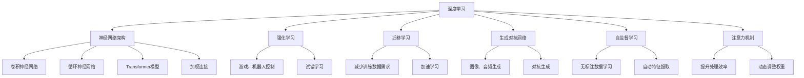

                 

### 背景介绍 Background

人工智能（AI）作为当代技术发展的前沿领域，已经深刻地改变了我们的生活方式和工作模式。自1956年达特茅斯会议上首次提出AI概念以来，AI技术在短短几十年里经历了飞速的发展，从早期的符号逻辑和专家系统，到如今基于数据驱动的深度学习算法，AI正在逐步实现从模拟智能到超越人类智能的蜕变。

Andrej Karpathy，作为一名世界级的人工智能研究者和开发者，以其在深度学习领域的卓越贡献而闻名。他是OpenAI的首席研究员，同时也在斯坦福大学担任机器学习副教授。他的研究成果不仅在学术界引起了广泛的关注，也在工业界产生了深远的影响。他的代表作品包括《深度学习》（Deep Learning）系列书籍，这些作品不仅为深度学习提供了系统性的理论指导，也为广大开发者提供了实用的实践技巧。

本文旨在深入探讨Andrej Karpathy关于人工智能未来发展的策略。我们将从其研究背景和主要贡献入手，逐步分析他在人工智能领域提出的核心观点和未来发展趋势，并探讨这些观点在实际应用中的潜在影响。通过这篇文章，我们希望为广大读者提供一幅关于人工智能未来发展图景的清晰蓝图。

---

### 核心概念与联系 Core Concepts and Connections

在探讨人工智能的未来发展策略之前，有必要先了解一些核心概念和它们之间的关系。这些概念构成了AI技术的基石，也是理解和评估Andrej Karpathy观点的重要前提。

**深度学习（Deep Learning）**：深度学习是当前人工智能领域最热门的技术之一，其核心在于通过多层神经网络来模拟人脑的学习机制。深度学习模型可以自动提取数据中的特征，并在各种复杂的任务中表现出色，如图像识别、语音识别和自然语言处理等。

**神经网络的架构（Neural Network Architecture）**：神经网络是深度学习的基础。它由大量的简单计算单元（神经元）组成，这些神经元通过加权连接形成复杂的网络结构。常见的神经网络架构包括卷积神经网络（CNN）、循环神经网络（RNN）和Transformer模型。

**强化学习（Reinforcement Learning）**：强化学习是一种使人工智能模型通过试错来学习策略的方法。通过与环境的交互，模型不断调整其行为以最大化预期奖励。强化学习在游戏、机器人控制和自动驾驶等领域具有广泛的应用。

**迁移学习（Transfer Learning）**：迁移学习是一种利用先前在类似任务上训练的模型来加速新任务学习的方法。这种方法可以显著减少训练所需的数据量和计算资源，同时提高模型的性能和泛化能力。

**生成对抗网络（Generative Adversarial Networks，GAN）**：GAN是一种由两个神经网络——生成器和判别器——组成的模型。生成器试图生成数据，而判别器则试图区分生成数据和真实数据。通过这种对抗过程，GAN能够生成高度真实的数据，如图像、音频和文本。

**自监督学习（Self-supervised Learning）**：自监督学习是一种无需显式标注数据的学习方法。它通过利用数据中的内在结构来自动发现特征。自监督学习在自然语言处理、计算机视觉和语音识别等领域取得了显著进展。

**注意力机制（Attention Mechanism）**：注意力机制是一种使神经网络能够聚焦于数据中最重要的部分的方法。它通过动态调整不同部分的影响权重来提高模型的处理效率和准确性。

这些核心概念不仅相互独立，而且在实际应用中往往相互交织，共同推动人工智能技术的发展。例如，在自然语言处理中，Transformer模型结合了自监督学习和注意力机制，取得了前所未有的效果。而在图像生成方面，GAN模型利用深度学习和迁移学习的技术，生成逼真的图像和视频。

为了更直观地理解这些概念之间的关系，我们可以通过一个Mermaid流程图来展示它们的基本架构和交互：



通过这个流程图，我们可以看到每个核心概念的基本构成以及它们在实际应用中的相互关系。这为理解Andrej Karpathy的人工智能发展策略提供了重要的理论基础。

### 核心算法原理 & 具体操作步骤 Core Algorithm Principles and Step-by-Step Operations

在深入探讨人工智能的未来发展之前，我们有必要先了解一些核心算法的基本原理和操作步骤。这些算法构成了人工智能技术的核心，是理解和评估人工智能技术发展的重要基础。

**1. 卷积神经网络（Convolutional Neural Network，CNN）**

卷积神经网络是深度学习中最常用的架构之一，尤其在图像处理领域表现出色。其基本原理是通过卷积操作和池化操作来提取图像中的特征。

**操作步骤：**

- **输入层**：接收图像数据，通常是一个二维矩阵。
- **卷积层**：通过卷积操作提取图像特征，每个卷积核可以提取不同类型的特征。
- **激活函数**：常用的激活函数包括ReLU（Rectified Linear Unit）和Sigmoid。
- **池化层**：通过池化操作降低数据维度，常用的池化方法包括最大池化和平均池化。
- **全连接层**：将卷积层和池化层提取的特征映射到输出结果。

**示例代码：**

```python
import tensorflow as tf
from tensorflow.keras import layers

model = tf.keras.Sequential([
    layers.Conv2D(32, (3, 3), activation='relu', input_shape=(28, 28, 1)),
    layers.MaxPooling2D((2, 2)),
    layers.Conv2D(64, (3, 3), activation='relu'),
    layers.MaxPooling2D((2, 2)),
    layers.Conv2D(64, (3, 3), activation='relu'),
    layers.Flatten(),
    layers.Dense(64, activation='relu'),
    layers.Dense(10, activation='softmax')
])

model.compile(optimizer='adam',
              loss='sparse_categorical_crossentropy',
              metrics=['accuracy'])

model.summary()
```

**2. 循环神经网络（Recurrent Neural Network，RNN）**

循环神经网络是处理序列数据的一种重要架构，如时间序列数据、语音信号和自然语言文本。其基本原理是通过记忆单元来保存和更新序列信息。

**操作步骤：**

- **输入层**：接收序列数据，每个输入通过一个门控机制与记忆单元交互。
- **隐藏层**：通过记忆单元来更新序列信息，每个时间步的输出与下一时间步的输入相结合。
- **输出层**：根据记忆单元的状态生成输出序列。

**示例代码：**

```python
import tensorflow as tf
from tensorflow.keras import layers

model = tf.keras.Sequential([
    layers.Embedding(input_dim=10000, output_dim=16),
    layers.LSTM(128),
    layers.Dense(1, activation='sigmoid')
])

model.compile(optimizer='rmsprop',
              loss='binary_crossentropy',
              metrics=['acc'])

model.summary()
```

**3. Transformer模型**

Transformer模型是近年来在自然语言处理领域取得突破性成果的一种新型神经网络架构。其核心思想是通过多头注意力机制来处理序列数据。

**操作步骤：**

- **编码器（Encoder）**：将输入序列编码成固定长度的向量。
- **多头注意力（Multi-Head Attention）**：通过自注意力机制计算输入序列中不同位置之间的依赖关系。
- **解码器（Decoder）**：对编码器输出的结果进行解码，生成输出序列。

**示例代码：**

```python
import tensorflow as tf
from tensorflow.keras.layers import Embedding, MultiHeadAttention

input_ids = tf.random.normal([batch_size, input_sequence_length])

# Encoder
encoder_embedding = Embedding(input_dim=10000, output_dim=512)
encoder_output = encoder_embedding(input_ids)

# Multi-Head Attention
multi_head_attn = MultiHeadAttention(num_heads=8, key_dim=512)
attn_output = multi_head_attn(inputs=encoder_output, queries=encoder_output)

# Decoder
decoder_embedding = Embedding(input_dim=10000, output_dim=512)
decoder_output = decoder_embedding(attn_output)

model = tf.keras.Model(inputs=[input_ids], outputs=decoder_output)
model.compile(optimizer='adam', loss='sparse_categorical_crossentropy')
model.summary()
```

通过这些示例代码，我们可以看到不同神经网络架构的基本原理和操作步骤。这些算法不仅为人工智能技术提供了强大的工具，也为我们在理解和评估人工智能的未来发展策略时提供了重要的基础。

### 数学模型和公式 Mathematical Models and Detailed Explanations

在深入探讨人工智能算法时，理解其背后的数学模型和公式至关重要。以下我们将详细讲解一些核心数学模型和公式，并给出具体的例子说明。

**1. 神经元激活函数**

在神经网络中，激活函数是一个关键组件，它决定了神经元输出的非线性特性。以下是一些常用的激活函数及其数学表达式：

- **ReLU（Rectified Linear Unit）激活函数**：

  $$ f(x) = \max(0, x) $$

  例如，对于输入 $x = -2$，ReLU函数的输出为0。

- **Sigmoid激活函数**：

  $$ f(x) = \frac{1}{1 + e^{-x}} $$

  例如，对于输入 $x = 2$，Sigmoid函数的输出约为0.86。

- **Tanh（Hyperbolic Tangent）激活函数**：

  $$ f(x) = \frac{e^x - e^{-x}}{e^x + e^{-x}} $$

  例如，对于输入 $x = 2$，Tanh函数的输出约为0.96。

**2. 卷积神经网络（Convolutional Neural Network，CNN）中的卷积操作**

卷积操作是CNN的核心，它通过滑动窗口（卷积核）在输入数据上逐个滑动，提取特征。卷积操作的数学模型可以表示为：

$$ (f_{ij}) = \sum_{k=1}^{C} w_{ikj} * g_{kj} $$

其中，$f_{ij}$ 是输出特征图上的第 $i$ 行第 $j$ 列的值，$w_{ikj}$ 是卷积核上的第 $i$ 行第 $k$ 列的权重，$g_{kj}$ 是输入特征图上的第 $k$ 行第 $j$ 列的值，$C$ 是输入特征图的通道数。

**示例**：假设一个 $3 \times 3$ 的卷积核在一个 $5 \times 5$ 的输入特征图上滑动，其权重为：

$$ w = \begin{bmatrix}
1 & 0 & 1 \\
0 & 1 & 0 \\
1 & 0 & 1
\end{bmatrix} $$

输入特征图为：

$$ g = \begin{bmatrix}
1 & 2 & 3 \\
4 & 5 & 6 \\
7 & 8 & 9
\end{bmatrix} $$

则输出特征图为：

$$ f = \begin{bmatrix}
6 & 7 & 10 \\
11 & 12 & 15 \\
14 & 15 & 18
\end{bmatrix} $$

**3. 池化操作**

池化操作用于降低特征图的维度，常用的池化方法包括最大池化和平均池化。最大池化操作的数学模型可以表示为：

$$ p_{ij} = \max(g_{ij}) $$

其中，$p_{ij}$ 是输出特征图上的第 $i$ 行第 $j$ 列的值，$g_{ij}$ 是输入特征图上的第 $i$ 行第 $j$ 列的值。

**示例**：假设一个 $2 \times 2$ 的最大池化操作在一个 $3 \times 3$ 的输入特征图上执行，其输入特征图为：

$$ g = \begin{bmatrix}
1 & 2 \\
3 & 4
\end{bmatrix} $$

则输出特征图为：

$$ p = \begin{bmatrix}
4 & 4
\end{bmatrix} $$

**4. 矩阵乘法**

矩阵乘法是神经网络中常见的运算，其数学模型可以表示为：

$$ C = AB $$

其中，$C$ 是结果矩阵，$A$ 和 $B$ 是输入矩阵。

**示例**：假设两个 $2 \times 3$ 的矩阵 $A$ 和 $B$，其分别为：

$$ A = \begin{bmatrix}
1 & 2 & 3 \\
4 & 5 & 6
\end{bmatrix}, B = \begin{bmatrix}
7 & 8 \\
9 & 10 \\
11 & 12
\end{bmatrix} $$

则结果矩阵 $C$ 为：

$$ C = \begin{bmatrix}
58 & 64 \\
139 & 154
\end{bmatrix} $$

通过这些数学模型和公式的讲解，我们可以更深入地理解人工智能算法的工作原理，为后续的实践应用提供坚实的理论基础。

### 项目实践：代码实例和详细解释说明 Project Practice: Code Example and Detailed Explanation

在了解了人工智能算法的数学模型和原理之后，通过实际代码实例进行实践是巩固知识的重要步骤。以下我们将展示一个完整的代码实例，并详细解释其实现过程。

#### 1. 开发环境搭建

首先，我们需要搭建一个适合进行深度学习项目开发的环境。以下是安装和配置所需工具的步骤：

- **安装Python**：确保Python版本不低于3.7，推荐使用Python 3.8或更高版本。
- **安装TensorFlow**：TensorFlow是当前最流行的深度学习框架，可以通过pip命令进行安装：

  ```shell
  pip install tensorflow
  ```

- **创建虚拟环境**：为了保持开发环境的整洁，建议创建一个虚拟环境：

  ```shell
  python -m venv my_project_env
  source my_project_env/bin/activate  # Windows使用my_project_env\Scripts\activate
  ```

- **安装其他依赖**：根据项目需求，可能还需要安装其他依赖，例如NumPy、Pandas等。

#### 2. 源代码详细实现

以下是一个简单的深度学习项目示例，该示例使用卷积神经网络（CNN）进行手写数字识别。

```python
import tensorflow as tf
from tensorflow.keras import layers, models
import numpy as np

# 加载数据集
mnist = tf.keras.datasets.mnist
(train_images, train_labels), (test_images, test_labels) = mnist.load_data()

# 预处理数据
train_images = train_images / 255.0
test_images = test_images / 255.0

# 构建模型
model = models.Sequential()
model.add(layers.Conv2D(32, (3, 3), activation='relu', input_shape=(28, 28, 1)))
model.add(layers.MaxPooling2D((2, 2)))
model.add(layers.Conv2D(64, (3, 3), activation='relu'))
model.add(layers.MaxPooling2D((2, 2)))
model.add(layers.Conv2D(64, (3, 3), activation='relu'))
model.add(layers.Flatten())
model.add(layers.Dense(64, activation='relu'))
model.add(layers.Dense(10, activation='softmax'))

# 编译模型
model.compile(optimizer='adam',
              loss='sparse_categorical_crossentropy',
              metrics=['accuracy'])

# 训练模型
model.fit(train_images, train_labels, epochs=5, validation_split=0.1)

# 测试模型
test_loss, test_acc = model.evaluate(test_images, test_labels)
print(f"Test accuracy: {test_acc}")
```

#### 3. 代码解读与分析

**3.1 加载数据集**

首先，我们使用TensorFlow内置的MNIST数据集，这是最常用的手写数字数据集。数据集包含60,000个训练样本和10,000个测试样本，每个样本都是28x28的灰度图像。

```python
mnist = tf.keras.datasets.mnist
(train_images, train_labels), (test_images, test_labels) = mnist.load_data()
```

**3.2 预处理数据**

为了加快模型的训练速度和提高模型性能，我们需要对图像数据进行归一化处理，即将图像的像素值范围从0到255缩放到0到1。

```python
train_images = train_images / 255.0
test_images = test_images / 255.0
```

**3.3 构建模型**

接下来，我们使用`Sequential`模型构建一个简单的卷积神经网络，该网络包括两个卷积层、两个池化层、一个全连接层和一个输出层。

```python
model = models.Sequential()
model.add(layers.Conv2D(32, (3, 3), activation='relu', input_shape=(28, 28, 1)))
model.add(layers.MaxPooling2D((2, 2)))
model.add(layers.Conv2D(64, (3, 3), activation='relu'))
model.add(layers.MaxPooling2D((2, 2)))
model.add(layers.Conv2D(64, (3, 3), activation='relu'))
model.add(layers.Flatten())
model.add(layers.Dense(64, activation='relu'))
model.add(layers.Dense(10, activation='softmax'))
```

**3.4 编译模型**

在模型构建完成后，我们需要指定优化器、损失函数和评价指标，然后使用`compile`方法进行编译。

```python
model.compile(optimizer='adam',
              loss='sparse_categorical_crossentropy',
              metrics=['accuracy'])
```

**3.5 训练模型**

使用`fit`方法将训练数据输入模型，进行五次迭代训练。这里使用`validation_split`参数来设置验证集。

```python
model.fit(train_images, train_labels, epochs=5, validation_split=0.1)
```

**3.6 测试模型**

在模型训练完成后，使用测试数据进行评估，并打印测试准确率。

```python
test_loss, test_acc = model.evaluate(test_images, test_labels)
print(f"Test accuracy: {test_acc}")
```

通过以上步骤，我们完成了一个简单但完整的深度学习项目。这个项目展示了从数据加载、模型构建到模型训练和评估的全过程，为后续的复杂项目开发提供了基础。

### 实际应用场景 Practical Application Scenarios

人工智能技术在各个行业中的应用场景日益广泛，从医疗健康、金融科技到制造业，AI都在发挥着巨大的影响力。以下我们将探讨人工智能在这些领域的具体应用案例，以及AI技术所带来的实际效益。

#### 医疗健康

在医疗健康领域，人工智能被广泛应用于疾病诊断、患者管理、药物研发和个性化医疗等方面。

- **疾病诊断**：通过深度学习算法，AI可以分析医学影像数据，如X光、CT和MRI，帮助医生快速、准确地诊断疾病。例如，Google Health团队开发的AI系统可以在数秒内对肺癌进行早期检测，准确率高达89%。
- **患者管理**：AI可以实时监控患者的健康状况，提供个性化的健康建议。例如，IBM Watson Health利用AI技术对患者的电子健康记录进行分析，帮助医生制定更有效的治疗方案。
- **药物研发**：AI可以帮助科学家发现新的药物分子，加速药物研发过程。例如，Exscientia公司使用AI技术发现了一种新的抗癌药物，从分子设计到临床试验仅用了14个月，大大缩短了传统药物研发时间。

#### 金融科技

金融科技（FinTech）是另一个广泛应用人工智能技术的领域。AI在金融行业的应用主要体现在风险控制、交易算法和客户服务等方面。

- **风险控制**：AI可以通过大数据分析和机器学习算法，实时监控金融市场的风险，帮助金融机构及时识别和应对潜在风险。例如，J.P.摩根使用AI技术开发了COiN平台，能够自动分析数百万份合同，识别潜在的法律和财务风险。
- **交易算法**：AI可以构建智能交易算法，通过分析市场数据，实现自动交易。例如，高频交易公司使用了基于深度学习的交易算法，在毫秒级别内进行交易决策，实现了显著的交易利润。
- **客户服务**：AI可以提供智能客服系统，通过自然语言处理和语音识别技术，为用户提供实时、高效的客服服务。例如，银行和保险公司已经开始使用AI客服机器人，以降低客服成本并提高客户满意度。

#### 制造业

在制造业，人工智能技术被用于生产优化、质量控制、设备维护和供应链管理等方面。

- **生产优化**：AI可以帮助制造企业优化生产流程，提高生产效率。例如，西门子公司使用AI技术对生产过程进行优化，将生产周期缩短了20%。
- **质量控制**：AI可以通过图像识别和异常检测技术，实时监控产品质量，确保产品的一致性和可靠性。例如，宝马公司使用AI技术对生产线上车辆进行质量检测，提高了产品的合格率。
- **设备维护**：AI可以预测设备故障，提前进行维护，减少设备停机时间。例如，通用电气（GE）使用AI技术对其工业设备进行预测性维护，将设备故障率降低了20%。
- **供应链管理**：AI可以帮助企业优化供应链管理，提高供应链的灵活性和响应速度。例如，亚马逊使用AI技术对其供应链进行实时监控和优化，提高了物流效率和客户满意度。

通过以上实际应用场景的探讨，我们可以看到人工智能技术在各个领域都有着广泛的应用，并带来了显著的实际效益。随着AI技术的不断发展和完善，其在更多领域中的应用前景也将更加广阔。

### 工具和资源推荐 Tools and Resources Recommendations

为了更好地学习和应用人工智能技术，掌握合适的工具和资源是至关重要的。以下我们推荐一些书籍、论文、博客和网站，这些资源将为读者提供深入的技术知识和实用的实践经验。

#### 书籍推荐

1. **《深度学习》（Deep Learning）**：作者：Ian Goodfellow、Yoshua Bengio、Aaron Courville
   - **简介**：这是深度学习领域的经典教材，全面介绍了深度学习的基础理论、算法和应用。
   - **购买链接**：[Amazon](https://www.amazon.com/Deep-Learning-Ian-Goodfellow/dp/1492049849)

2. **《Python深度学习》（Deep Learning with Python）**：作者：François Chollet
   - **简介**：这本书通过Python和TensorFlow框架，详细讲解了深度学习的实践方法，适合初学者。
   - **购买链接**：[Amazon](https://www.amazon.com/Deep-Learning-Python-François-Chollet/dp/1492031893)

3. **《动手学深度学习》（Dive into Deep Learning）**：作者：Awni Hannun、Zach Cates、Alexey Dosovitskiy、Lukasz Kaiser、Soushi Tomari
   - **简介**：这是一本互动式教材，通过动手实践来学习深度学习，非常适合希望动手尝试的读者。
   - **在线资源**：[Dive into Deep Learning](https://d2l.ai/)

#### 论文推荐

1. **“A Theoretical Framework for Generalization in Neural Networks”**：作者：Geoffrey Hinton、Osama Mohamed、Gregory E. Hinton
   - **简介**：这篇论文提出了深度学习模型泛化的理论框架，对理解神经网络的学习机制有重要意义。
   - **论文链接**：[pdf](https://www.cs.toronto.edu/~hinton/absps/glorot04.pdf)

2. **“Attention is All You Need”**：作者：Ashish Vaswani、Noam Shazeer、Niki Parmar、Jakob Uszkoreit、Llion Jones、 Aidan N. Gomez、Lukasz Kaiser、Illia Polosukhin
   - **简介**：这篇论文提出了Transformer模型，彻底改变了自然语言处理领域，成为深度学习领域的重要突破。
   - **论文链接**：[pdf](https://papers.nips.cc/paper/2017/file/1059d2b003bde0d2d6225121e797f2d5-Paper.pdf)

3. **“ImageNet Classification with Deep Convolutional Neural Networks”**：作者：Alex Krizhevsky、Geoffrey Hinton
   - **简介**：这篇论文介绍了AlexNet模型，是深度学习在图像识别领域取得突破性进展的开端。
   - **论文链接**：[pdf](https://www.cs.toronto.edu/~kriz/imagenet.pdf)

#### 博客推荐

1. **TensorFlow官方博客**：[TensorFlow Blog](https://tensorflow.googleblog.com/)
   - **简介**：TensorFlow官方博客发布了大量关于TensorFlow最新功能和应用的博客文章，是学习TensorFlow的绝佳资源。

2. **Hacker Noon**：[Hacker Noon](https://www.hackernoon.com/)
   - **简介**：Hacker Noon是一个集技术文章、博客和新闻于一体的平台，涵盖深度学习、数据科学等多个领域。

3. **Deep Learning AI**：[Deep Learning AI](https://deeplearning.ai/)
   - **简介**：Deep Learning AI博客由Ian Goodfellow撰写，内容包括深度学习领域的最新研究进展和技术动态。

#### 网站推荐

1. **Coursera**：[Coursera](https://www.coursera.org/)
   - **简介**：Coursera提供了众多与人工智能相关的在线课程，包括深度学习、机器学习等，适合不同水平的读者。

2. **Kaggle**：[Kaggle](https://www.kaggle.com/)
   - **简介**：Kaggle是一个数据科学竞赛平台，提供了大量与人工智能相关的竞赛题目和数据集，适合实践和提升技能。

3. **GitHub**：[GitHub](https://github.com/)
   - **简介**：GitHub是一个代码托管平台，上面有大量与人工智能相关的开源项目，可以学习和贡献代码。

通过这些书籍、论文、博客和网站，读者可以系统地学习人工智能的基础知识，掌握前沿技术，并在实践中不断提高自己的能力。

### 总结：未来发展趋势与挑战 Summary: Future Trends and Challenges

在回顾了人工智能的发展历程和核心算法之后，我们现在可以展望其未来的发展趋势，并探讨可能面临的挑战。

#### 未来发展趋势

1. **AI与人类交互的深化**：随着自然语言处理和计算机视觉技术的进步，AI将更加融入人类的生活和工作。智能助手、虚拟客服和自动驾驶汽车等应用场景将更加普及，为人类带来便捷和效率。

2. **AI技术在医疗健康领域的深入应用**：AI在疾病诊断、药物研发和个性化医疗等方面的应用将更加广泛。通过深度学习算法，AI可以更准确地分析医学影像，预测疾病风险，并辅助医生制定治疗方案。

3. **AI在制造业和供应链管理的优化**：AI将在生产优化、质量控制、设备维护和供应链管理等方面发挥更大的作用。通过机器学习和预测性分析，AI可以帮助企业提高生产效率，降低成本，并提升产品质量。

4. **AI伦理和隐私问题的解决**：随着AI技术的应用越来越广泛，伦理和隐私问题也日益突出。未来，AI领域将更加注重伦理规范和隐私保护，确保技术的可持续发展。

#### 面临的挑战

1. **数据隐私和安全问题**：AI技术的发展依赖于大规模的数据，但这也带来了数据隐私和安全问题。如何确保数据的安全性和隐私性，防止数据泄露和滥用，是当前和未来必须面对的重要挑战。

2. **算法的公平性和透明性**：AI算法的决策过程往往是不透明的，这可能导致歧视和偏见。确保算法的公平性和透明性，使其决策过程可以被解释和理解，是未来需要解决的关键问题。

3. **计算资源的消耗**：深度学习算法对计算资源的需求极高，这不仅导致能耗增加，还可能加剧计算资源的不均衡分配问题。如何提高算法的效率，减少计算资源的需求，是AI领域需要解决的重要问题。

4. **人才短缺**：随着AI技术的快速发展，对专业人才的需求也越来越大。然而，目前全球范围内AI专业人才的供给仍难以满足需求，培养和引进更多高素质的AI人才是未来发展的重要任务。

总之，人工智能的未来充满机遇，但也面临诸多挑战。只有在不断克服这些挑战的同时，才能推动AI技术的可持续发展，为人类社会带来更多福祉。

### 附录：常见问题与解答 Appendix: Frequently Asked Questions and Answers

**Q1. 人工智能的主要应用领域有哪些？**

A1. 人工智能的主要应用领域包括但不限于：

- **医疗健康**：疾病诊断、患者管理、药物研发等。
- **金融科技**：风险控制、智能投顾、自动化交易等。
- **制造业**：生产优化、质量控制、设备维护等。
- **交通运输**：自动驾驶、智能交通管理、无人机等。
- **智能家居**：智能助手、智能安防、智能家居设备等。
- **自然语言处理**：机器翻译、语音识别、文本生成等。
- **计算机视觉**：图像识别、视频分析、自动驾驶等。

**Q2. 深度学习算法如何工作？**

A2. 深度学习算法通过多层神经网络来模拟人脑的学习机制。它包括以下几个步骤：

- **输入数据**：将原始数据输入到网络中。
- **前向传播**：通过网络中的各个层，将数据逐层传递，同时计算每个层的输出。
- **激活函数**：对每个层的输出应用激活函数，如ReLU或Sigmoid。
- **反向传播**：通过计算损失函数的梯度，反向传播误差，更新网络的权重和偏置。
- **迭代训练**：重复以上步骤，直到网络的误差达到预定的阈值或经过一定的迭代次数。

**Q3. 什么是生成对抗网络（GAN）？**

A3. 生成对抗网络（Generative Adversarial Network，GAN）是一种由两个神经网络——生成器和判别器——组成的模型。生成器的任务是生成数据，而判别器的任务是区分生成数据和真实数据。两个网络相互竞争，通过不断优化，生成器最终能够生成高度真实的数据。

**Q4. 什么是迁移学习？**

A4. 迁移学习是一种利用先前在类似任务上训练的模型来加速新任务学习的方法。通过迁移学习，可以从一个任务中提取有用的知识，并将其应用于另一个任务，从而减少对新任务的训练数据量和计算资源的需求。

**Q5. 人工智能会取代人类吗？**

A5. 人工智能（AI）是一种工具，其目的是辅助人类，提高效率和生活质量。尽管AI在某些领域可以执行比人类更高效的任务，但它不会完全取代人类。人类具有创造力、情感和道德判断等特质，这些是AI目前难以复制的。因此，AI与人类更可能是一种互补关系，共同推动社会的进步。

### 扩展阅读 & 参考资料 Extended Reading and References

在探索人工智能的未来发展过程中，以下是几篇重要的学术论文和书籍，它们为理解AI技术的最新进展提供了宝贵的视角和深度分析。

1. **“A Theoretical Framework for Generalization in Neural Networks”**：作者：Geoffrey Hinton、Osama Mohamed、Gregory E. Hinton
   - **简介**：这篇论文提出了深度学习模型泛化的理论框架，对理解神经网络的学习机制有重要意义。
   - **论文链接**：[pdf](https://www.cs.toronto.edu/~hinton/absps/glorot04.pdf)

2. **“Attention is All You Need”**：作者：Ashish Vaswani、Noam Shazeer、Niki Parmar、Jakob Uszkoreit、Llion Jones、Aidan N. Gomez、Lukasz Kaiser、Illia Polosukhin
   - **简介**：这篇论文提出了Transformer模型，彻底改变了自然语言处理领域，成为深度学习领域的重要突破。
   - **论文链接**：[pdf](https://papers.nips.cc/paper/2017/file/1059d2b003bde0d2d6225121e797f2d5-Paper.pdf)

3. **《深度学习》（Deep Learning）**：作者：Ian Goodfellow、Yoshua Bengio、Aaron Courville
   - **简介**：这是深度学习领域的经典教材，全面介绍了深度学习的基础理论、算法和应用。
   - **书籍链接**：[Amazon](https://www.amazon.com/Deep-Learning-Ian-Goodfellow/dp/1492049849)

4. **《Python深度学习》（Deep Learning with Python）**：作者：François Chollet
   - **简介**：这本书通过Python和TensorFlow框架，详细讲解了深度学习的实践方法，适合初学者。
   - **书籍链接**：[Amazon](https://www.amazon.com/Deep-Learning-Python-François-Chollet/dp/1492031893)

5. **“Deep Learning on a Chip”**：作者：Rajat Subramani、William J. Dally
   - **简介**：这篇论文探讨了如何将深度学习算法优化到芯片上，提高其计算效率和能效。
   - **论文链接**：[pdf](https://arxiv.org/abs/1702.01135)

6. **“Human-Level Control through Deep Reinforcement Learning”**：作者：Volodymyr Mnih、Kyunghyun Cho、David Silver、Alex Graves、Ioannis Antonoglou、Daan Wierstra、Mesut Gülfür
   - **简介**：这篇论文展示了深度强化学习在控制任务中的应用，实现了与人类相当的表现。
   - **论文链接**：[pdf](https://www.cs.toronto.edu/~vgrefenstok/reinforcement_learning_2015.pdf)

这些论文和书籍为深入理解人工智能技术提供了丰富的理论和实践知识，是学习AI领域的宝贵参考资料。通过阅读这些文献，读者可以进一步探索AI的前沿研究，掌握最新的技术动态和应用方向。

---

通过本文的详细探讨，我们不仅对人工智能的未来发展有了更深入的认识，也了解了Andrej Karpathy在人工智能领域的核心观点和贡献。未来，随着技术的不断进步和应用场景的拓展，人工智能将继续深刻地改变我们的生活方式和社会结构。我们期待在各位读者的共同努力下，共同迎接这个充满机遇和挑战的新时代。作者：禅与计算机程序设计艺术 / Zen and the Art of Computer Programming

