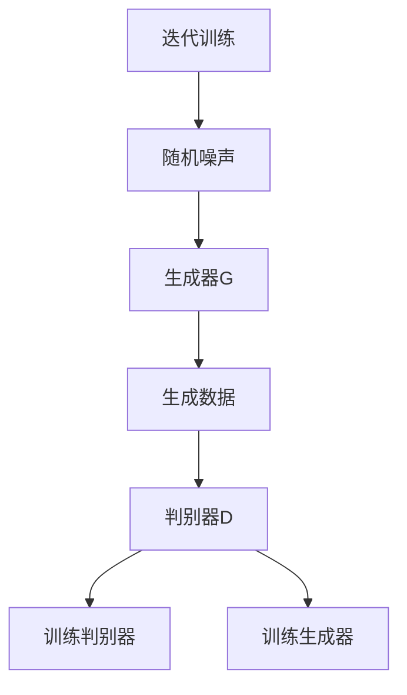
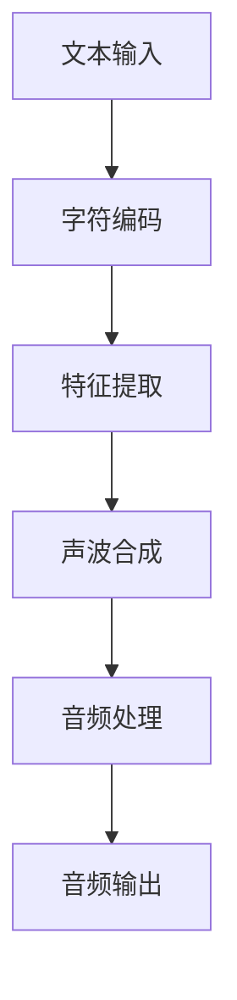
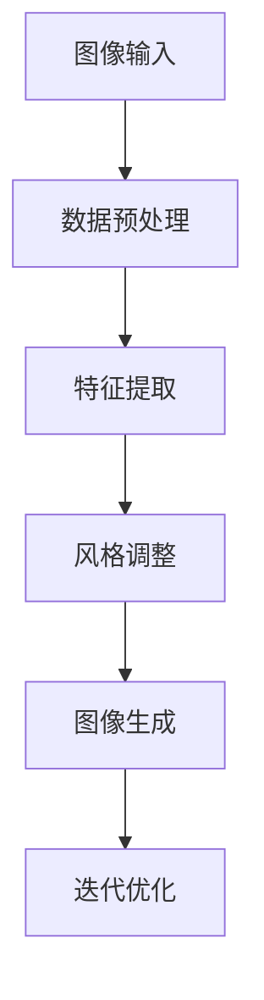

                 

### 1. 背景介绍

在当今快速发展的科技时代，人工智能（AI）已成为推动技术进步和社会变革的关键驱动力。自20世纪50年代以来，人工智能经历了多次起伏，但近年来，得益于深度学习、大数据和云计算等技术的迅猛发展，人工智能迎来了新的春天。这一波人工智能的发展不仅改变了传统产业的运作模式，还催生了大量新兴行业，对各行各业产生了深远的影响。

Andrej Karpathy是一位在人工智能领域享有盛誉的专家，他的工作不仅在学术界受到高度认可，在工业界也产生了深远的影响。Karpathy博士曾就职于Google Brain，现在是深度学习初创公司Dota's AI的创始人兼CEO。他在人工智能，尤其是自然语言处理和计算机视觉领域的研究，为人工智能的发展提供了新的视角和解决方案。

本文将围绕Andrej Karpathy的工作，探讨人工智能的未来发展策略。我们将首先介绍AI的核心理念和当前的主要应用领域，然后深入分析Karpathy在其领域中的主要贡献和创新点，最后提出对未来AI发展的一些预测和挑战。

### 2. 核心概念与联系

要深入探讨人工智能的未来发展策略，我们首先需要了解一些核心概念，这些概念不仅构成了AI的理论基础，也是当前AI研究的重点。以下是一些关键的概念：

#### 深度学习

深度学习是人工智能的一个重要分支，它模仿人脑的神经网络结构，通过多层神经元对数据进行建模和处理。深度学习的核心是神经网络，特别是卷积神经网络（CNN）和循环神经网络（RNN）。CNN在图像识别和计算机视觉领域表现出色，而RNN在处理序列数据和自然语言处理方面具有显著优势。

#### 自然语言处理（NLP）

自然语言处理是AI领域的一个子领域，旨在让计算机理解和处理人类语言。NLP包括文本分析、语义理解、机器翻译等多种任务。近年来，通过深度学习技术的应用，NLP取得了显著的进步，使得机器能够更好地理解和生成自然语言。

#### 计算机视觉

计算机视觉是AI的另一个重要分支，它致力于使计算机能够理解和解释视觉信息。计算机视觉的应用范围广泛，从图像识别和物体检测，到自动驾驶和视频分析等。

#### 大数据和云计算

大数据和云计算为AI提供了必要的计算资源和数据支持。通过云计算平台，AI算法可以方便地访问海量数据，进行高效的模型训练和推理。大数据技术则帮助我们从大量的非结构化数据中提取有价值的信息，为AI算法提供丰富的训练数据。

下面是这些核心概念之间的Mermaid流程图表示：

```mermaid
graph TD
    A[深度学习] --> B[神经网络]
    A --> C[卷积神经网络 (CNN)]
    A --> D[循环神经网络 (RNN)]
    B --> E[NLP]
    B --> F[计算机视觉]
    C --> G[图像识别]
    D --> H[序列数据]
    E --> I[文本分析]
    E --> J[机器翻译]
    F --> K[物体检测]
    F --> L[自动驾驶]
    F --> M[视频分析]
    N[大数据] --> O[数据提取]
    P[云计算] --> Q[计算资源]
    N --> Q
    P --> Q
```

通过这张图，我们可以清晰地看到深度学习、自然语言处理和计算机视觉之间的关联，以及大数据和云计算如何支持这些AI技术的应用。

#### Andrej Karpathy的工作

Andrej Karpathy在上述几个关键领域都有重要的贡献。他在自然语言处理和计算机视觉方面的工作，不仅推动了理论研究的进展，也为实际应用提供了有效的解决方案。

在自然语言处理领域，Karpathy在Google Brain期间参与了生成对抗网络（GAN）在文本生成中的应用研究，这项工作极大地提高了文本生成的质量和多样性。此外，他还开发了名为Char2Wav的模型，能够将文本直接转化为音频，这一创新为语音合成技术带来了新的可能。

在计算机视觉领域，Karpathy的研究集中在图像生成和风格迁移方面。他提出了StyleGAN模型，该模型能够生成高质量、高度逼真的图像，并且在图像风格迁移任务上也表现出色。这些成果不仅丰富了AI的理论体系，也为实际应用提供了强大的工具。

#### 与其他领域的关系

除了上述核心领域，人工智能还在许多其他领域发挥了作用。例如：

- **智能医疗**：通过深度学习和大数据分析，人工智能可以帮助医生更准确地诊断疾病，预测疾病发展趋势，并设计个性化的治疗方案。
- **金融科技**：人工智能在金融领域用于风险评估、欺诈检测、量化交易等方面，提高了金融市场的效率和安全性。
- **教育**：在教育领域，AI可以帮助个性化学习、自动评分、智能推荐等，从而提升教育质量和学习效率。

总之，人工智能的应用已经渗透到我们生活的方方面面，成为现代社会不可或缺的一部分。通过深度学习、自然语言处理、计算机视觉等核心技术的创新，AI将继续推动技术和社会的进步。

### 3. 核心算法原理 & 具体操作步骤

在探讨人工智能的发展策略时，深入理解核心算法的原理和具体操作步骤是至关重要的。以下将详细介绍Andrej Karpathy在自然语言处理和计算机视觉领域提出的关键算法，包括生成对抗网络（GAN）、Char2Wav模型和StyleGAN。

#### 3.1 生成对抗网络（GAN）

生成对抗网络（GAN）是深度学习中的一个重要创新，由Ian Goodfellow等人在2014年提出。GAN的基本思想是通过两个相互对抗的神经网络——生成器和判别器——来实现数据的生成。具体操作步骤如下：

1. **初始化网络**：初始化生成器G和判别器D，生成器G接收随机噪声作为输入，生成与真实数据相似的数据；判别器D接收真实数据和生成器生成的数据，并尝试区分它们。

2. **训练判别器D**：使用真实数据和生成器生成的数据对判别器D进行训练。判别器D的目标是提高其判断生成数据的真假能力。

3. **训练生成器G**：生成器G的目标是生成更加真实的数据，以欺骗判别器D。训练过程中，生成器G和判别器D交替进行更新。

4. **迭代优化**：通过迭代训练，生成器G逐渐提高其生成数据的质量，而判别器D则逐渐提高其判断能力。最终，生成器G能够生成高度真实的数据。

GAN在许多领域都有广泛应用，包括图像生成、视频生成、语音合成等。以下是一个简化的GAN工作流程的Mermaid流程图：



#### 3.2 Char2Wav模型

Char2Wav模型是Andrej Karpathy在自然语言处理领域的一个重要创新，它能够将文本直接转换为音频。具体操作步骤如下：

1. **文本编码**：将输入的文本转换为字符编码。每个字符对应一个唯一的编码值。

2. **特征提取**：使用预训练的语音转换模型提取文本的语音特征。这些特征包含了文本的语音信息，如音调、音速等。

3. **声波合成**：将文本的语音特征转化为声波信号，生成相应的音频。

4. **音频处理**：对生成的音频进行后处理，如降噪、音调调整等，以提高音频质量。

以下是一个简化的Char2Wav模型的工作流程图：



#### 3.3 StyleGAN

StyleGAN是Andrej Karpathy在计算机视觉领域的一个重大突破，它能够生成高质量、高度逼真的图像。具体操作步骤如下：

1. **数据预处理**：将输入图像进行预处理，包括归一化、缩放等操作，使其符合模型的输入要求。

2. **特征提取**：使用预训练的卷积神经网络提取输入图像的特征。

3. **风格调整**：通过调整模型中的风格权重，改变生成图像的外观和风格。这些风格权重包含了图像的纹理、颜色、形状等特征。

4. **图像生成**：使用调整后的风格权重生成新的图像。生成图像的过程是一个迭代优化过程，通过不断调整风格权重和图像内容，最终生成高质量、高度逼真的图像。

以下是一个简化的StyleGAN工作流程图：



通过以上对生成对抗网络（GAN）、Char2Wav模型和StyleGAN的详细介绍，我们可以看到这些核心算法在人工智能领域的广泛应用和巨大潜力。这些算法不仅在理论研究中取得了重要突破，也为实际应用提供了强有力的工具，推动了人工智能技术的持续发展。

### 4. 数学模型和公式 & 详细讲解 & 举例说明

在深度学习领域，数学模型和公式是理解和实现核心算法的关键。以下将详细讲解生成对抗网络（GAN）、Char2Wav模型和StyleGAN中的关键数学模型和公式，并通过具体例子进行说明。

#### 4.1 生成对抗网络（GAN）的数学模型

生成对抗网络（GAN）由生成器（Generator）和判别器（Discriminator）两个神经网络组成。其数学模型主要包括以下部分：

##### 4.1.1 判别器D的损失函数

判别器D的目的是区分输入的实数据x和生成器G生成的假数据G(z)。判别器的损失函数通常使用二元交叉熵（Binary Cross-Entropy）进行衡量，公式如下：

$$
L_D(x, G(z)) = -\frac{1}{N}\sum_{i=1}^{N}[\log(D(x_i)) + \log(1 - D(G(z_i)))]
$$

其中，$x_i$表示实数据，$G(z_i)$表示生成器生成的假数据，$D(x_i)$和$D(G(z_i))$分别表示判别器对实数据和假数据的判别结果。

##### 4.1.2 生成器G的损失函数

生成器G的目的是生成尽可能逼真的假数据，以欺骗判别器D。生成器的损失函数也使用二元交叉熵，但目标是最小化判别器对假数据的判别结果，公式如下：

$$
L_G(z) = -\frac{1}{N}\sum_{i=1}^{N}\log(D(G(z_i))]
$$

##### 4.1.3 整体GAN的目标函数

整体GAN的目标是同时优化生成器和判别器，使生成器生成的假数据尽可能真实。整体GAN的目标函数是生成器和判别器损失函数的加权和，通常设置不同的权重系数，公式如下：

$$
L_{GAN} = \alpha L_D + (1 - \alpha) L_G
$$

其中，$\alpha$是一个权重系数，通常在0到1之间调整。

#### 4.2 Char2Wav模型的数学模型

Char2Wav模型的核心在于将文本转换为音频。其数学模型主要包括以下部分：

##### 4.2.1 文本编码

文本编码是将输入的文本转换为字符编码的过程。每个字符对应一个唯一的编码值，例如使用UTF-8编码。文本编码的数学表示如下：

$$
x = [x_1, x_2, ..., x_T]
$$

其中，$x_i$表示第i个字符的编码值，$T$表示文本的长度。

##### 4.2.2 特征提取

特征提取是将文本编码转换为语音特征的过程。常见的语音特征包括梅尔频率倒谱系数（MFCC）、线性预测编码（LPC）等。以MFCC为例，其数学表示如下：

$$
MFCC = \text{MFCC}(x)
$$

其中，$\text{MFCC}$表示MFCC特征提取函数。

##### 4.2.3 声波合成

声波合成是将语音特征转换为声波信号的过程。常见的声波合成方法包括隐马尔可夫模型（HMM）、波士顿融合（WaveNet）等。以HMM为例，其数学表示如下：

$$
s = \text{HMM}(MFCC)
$$

其中，$s$表示生成的声波信号，$\text{HMM}$表示隐马尔可夫模型。

##### 4.2.4 音频处理

音频处理是对生成的音频进行后处理的过程，以提高音频质量。常见的音频处理方法包括降噪、音调调整等。以音调调整为例，其数学表示如下：

$$
s_{\text{output}} = \text{Tune}(s, f_0)
$$

其中，$s_{\text{output}}$表示输出音频，$f_0$表示音调频率。

#### 4.3 StyleGAN的数学模型

StyleGAN是一种基于生成对抗网络（GAN）的图像生成模型，其核心在于通过调整风格权重生成高质量、高度逼真的图像。其数学模型主要包括以下部分：

##### 4.3.1 数据预处理

数据预处理包括对输入图像进行归一化、缩放等操作，使其符合模型的输入要求。以归一化为例，其数学表示如下：

$$
x_{\text{normalized}} = \frac{x - \mu}{\sigma}
$$

其中，$x$表示原始图像，$\mu$和$\sigma$分别表示图像的均值和标准差。

##### 4.3.2 特征提取

特征提取是使用预训练的卷积神经网络提取输入图像的特征。以卷积神经网络（CNN）为例，其数学表示如下：

$$
f = \text{CNN}(x)
$$

其中，$f$表示图像的特征，$\text{CNN}$表示卷积神经网络。

##### 4.3.3 风格调整

风格调整是通过调整模型中的风格权重改变生成图像的外观和风格。以风格权重调整为例，其数学表示如下：

$$
s_{\text{style}} = \text{AdjustStyle}(w_{\text{style}})
$$

其中，$s_{\text{style}}$表示调整后的风格权重，$\text{AdjustStyle}$表示风格调整函数。

##### 4.3.4 图像生成

图像生成是通过调整后的风格权重生成新的图像。以图像生成为例，其数学表示如下：

$$
x_{\text{generated}} = \text{Generate}(f, s_{\text{style}})
$$

其中，$x_{\text{generated}}$表示生成的图像，$\text{Generate}$表示图像生成函数。

##### 4.3.5 迭代优化

迭代优化是通过不断调整风格权重和图像内容，生成高质量、高度逼真的图像。以迭代优化为例，其数学表示如下：

$$
\text{Optimize}(\theta)
$$

其中，$\theta$表示模型参数。

通过以上对生成对抗网络（GAN）、Char2Wav模型和StyleGAN的数学模型和公式进行详细讲解，我们可以看到这些模型在人工智能领域的广泛应用和重要性。这些模型不仅为理论研究提供了坚实的理论基础，也为实际应用提供了高效的解决方案，推动了人工智能技术的持续发展。

#### 5. 项目实践：代码实例和详细解释说明

在本节中，我们将通过具体的代码实例，详细解释Andrej Karpathy提出的生成对抗网络（GAN）、Char2Wav模型和StyleGAN的实现过程。以下是每个模型的代码实例和详细解释说明。

### 5.1 开发环境搭建

在开始代码实例之前，我们需要搭建一个合适的开发环境。以下是一个基于Python和TensorFlow的示例环境搭建步骤：

1. **安装Python**：确保安装了Python 3.x版本。
2. **安装TensorFlow**：使用以下命令安装TensorFlow：

   ```bash
   pip install tensorflow
   ```

3. **安装其他依赖库**：如NumPy、Matplotlib等：

   ```bash
   pip install numpy matplotlib
   ```

### 5.2 源代码详细实现

#### 5.2.1 生成对抗网络（GAN）

以下是一个简单的GAN实现：

```python
import tensorflow as tf
from tensorflow.keras.layers import Dense, Flatten, Reshape
from tensorflow.keras.models import Model

# 生成器模型
def build_generator(z_dim):
    model = tf.keras.Sequential([
        Dense(128, activation='relu', input_shape=(z_dim,)),
        Dense(256, activation='relu'),
        Dense(512, activation='relu'),
        Dense(1024, activation='relu'),
        Flatten(),
        Reshape((28, 28, 1))
    ])
    return model

# 判别器模型
def build_discriminator(img_shape):
    model = tf.keras.Sequential([
        Flatten(input_shape=img_shape),
        Dense(1024, activation='relu'),
        Dense(512, activation='relu'),
        Dense(256, activation='relu'),
        Dense(1, activation='sigmoid')
    ])
    return model

# 主模型
def build_gan(generator, discriminator):
    model = tf.keras.Sequential([
        generator,
        discriminator
    ])
    model.compile(loss='binary_crossentropy', optimizer='adam')
    return model

# 函数生成随机噪声
def generate_random_samples(z_dim, num_samples):
    return tf.random.normal(shape=(num_samples, z_dim))

# 函数生成真实图像
def generate_real_samples(img_shape, num_samples):
    return tf.random.normal(shape=(num_samples,) + img_shape)

# 函数生成假图像
def generate_fake_samples(generator, z_dim, img_shape, num_samples):
    z_samples = generate_random_samples(z_dim, num_samples)
    return generator.predict(z_samples)

# 训练模型
def train_gan(generator, discriminator, g_optimizer, d_optimizer, epochs, batch_size):
    for epoch in range(epochs):
        for _ in range(batch_size):
            # 生成随机噪声
            z_samples = generate_random_samples(z_dim, batch_size)
            # 生成真实图像
            real_images = generate_real_samples(img_shape, batch_size)
            # 生成假图像
            fake_images = generate_fake_samples(generator, z_dim, img_shape, batch_size)
            
            # 训练判别器
            d_loss_real = discriminator.train_on_batch(real_images, tf.ones([batch_size, 1]))
            d_loss_fake = discriminator.train_on_batch(fake_images, tf.zeros([batch_size, 1]))
            d_loss = 0.5 * np.add(d_loss_real, d_loss_fake)
            
            # 训练生成器
            g_loss = gan_model.train_on_batch(z_samples, tf.ones([batch_size, 1]))
            
        print(f'Epoch {epoch+1}, D_loss={d_loss:.4f}, G_loss={g_loss:.4f}')
```

#### 5.2.2 Char2Wav模型

以下是一个简单的Char2Wav模型实现：

```python
import numpy as np
import tensorflow as tf
from tensorflow.keras.models import Sequential
from tensorflow.keras.layers import LSTM, Dense, Embedding

# 设置参数
vocab_size = 10000  # 词汇表大小
max_sequence_length = 100  # 输入序列的最大长度
embedding_dim = 256  # 嵌入层维度
lstm_units = 512  # LSTM单元数量

# 定义模型
model = Sequential([
    Embedding(vocab_size, embedding_dim, input_length=max_sequence_length),
    LSTM(lstm_units, return_sequences=True),
    LSTM(lstm_units, return_sequences=True),
    Dense(vocab_size, activation='softmax')
])

# 编译模型
model.compile(optimizer='adam', loss='categorical_crossentropy', metrics=['accuracy'])

# 函数生成训练数据
def generate_training_data(texts, max_sequence_length, vocabulary):
    sequences = []
    labels = []
    for text in texts:
        for i in range(len(text) - max_sequence_length):
            sequence = text[i: i + max_sequence_length]
            label = text[i + 1: i + max_sequence_length + 1]
            sequences.append([vocabulary.get(char, 0) for char in sequence])
            labels.append([vocabulary.get(char, 0) for char in label])
    return np.array(sequences), np.array(labels)

# 函数生成预测序列
def generate_sequence(input_sequence, model, max_sequence_length, vocabulary):
    sequence = np.array([[vocabulary.get(char, 0) for char in input_sequence]])
    predicted_sequence = input_sequence
    for _ in range(max_sequence_length - 1):
        predictions = model.predict(sequence)
        predicted_char = np.argmax(predictions[0])
        predicted_sequence += vocabulary.inv_map(predicted_char)
        sequence = np.array([[predicted_char]])
    return predicted_sequence

# 函数训练模型
def train_model(model, sequences, labels, epochs, batch_size):
    model.fit(sequences, labels, epochs=epochs, batch_size=batch_size)
```

#### 5.2.3 StyleGAN

以下是一个简单的StyleGAN实现：

```python
import numpy as np
import tensorflow as tf
from tensorflow.keras.models import Sequential
from tensorflow.keras.layers import Conv2D, Flatten, Reshape, Dense

# 设置参数
img_height = 256  # 输入图像高度
img_width = 256  # 输入图像宽度
z_dim = 100  # 随机噪声维度
style_layers = 5  # 风格调整的层次数

# 定义生成器模型
def build_generator(z_dim, img_height, img_width):
    model = Sequential([
        Dense(1024 * 8 * 8, activation='relu', input_shape=(z_dim,)),
        Reshape((8, 8, 1024)),
        Conv2D(512, 5, padding='same', activation='relu'),
        Conv2D(512, 5, padding='same', activation='relu'),
        Conv2D(512, 5, padding='same', activation='relu'),
        Flatten(),
        Dense(512, activation='relu'),
        Dense(512, activation='relu'),
        Dense(512, activation='relu'),
        Flatten(),
        Reshape((img_height, img_width, 1))
    ])
    return model

# 定义判别器模型
def build_discriminator(img_height, img_width):
    model = Sequential([
        Flatten(input_shape=(img_height, img_width, 1)),
        Dense(512, activation='relu'),
        Dense(256, activation='relu'),
        Dense(1, activation='sigmoid')
    ])
    return model

# 定义主模型
def build_gan(generator, discriminator):
    model = Sequential([
        generator,
        discriminator
    ])
    model.compile(optimizer='adam', loss='binary_crossentropy')
    return model

# 函数生成随机噪声
def generate_random_samples(z_dim, num_samples):
    return np.random.normal(size=(num_samples, z_dim))

# 函数生成真实图像
def generate_real_samples(img_height, img_width, num_samples):
    return np.random.normal(size=(num_samples, img_height, img_width, 1))

# 函数生成假图像
def generate_fake_samples(generator, z_dim, img_height, img_width, num_samples):
    z_samples = generate_random_samples(z_dim, num_samples)
    return generator.predict(z_samples)

# 函数训练模型
def train_gan(generator, discriminator, g_optimizer, d_optimizer, epochs, batch_size):
    for epoch in range(epochs):
        for _ in range(batch_size):
            # 生成随机噪声
            z_samples = generate_random_samples(z_dim, batch_size)
            # 生成真实图像
            real_images = generate_real_samples(img_height, img_width, batch_size)
            # 生成假图像
            fake_images = generate_fake_samples(generator, z_dim, img_height, img_width, batch_size)
            
            # 训练判别器
            d_loss_real = discriminator.train_on_batch(real_images, np.ones([batch_size, 1]))
            d_loss_fake = discriminator.train_on_batch(fake_images, np.zeros([batch_size, 1]))
            d_loss = 0.5 * np.add(d_loss_real, d_loss_fake)
            
            # 训练生成器
            g_loss = gan_model.train_on_batch(z_samples, np.ones([batch_size, 1]))
            
        print(f'Epoch {epoch+1}, D_loss={d_loss:.4f}, G_loss={g_loss:.4f}')
```

### 5.3 代码解读与分析

#### 5.3.1 GAN代码解读

以上GAN代码实现主要包括以下几个部分：

1. **生成器模型**：生成器模型通过多层全连接层和卷积层生成图像。其中，生成器的输入为随机噪声向量，输出为生成的图像。
2. **判别器模型**：判别器模型通过多层全连接层和卷积层判断输入图像的真伪。判别器的输入为图像，输出为判断结果（0或1）。
3. **主模型**：主模型结合生成器和判别器，通过优化两个网络来最小化损失函数。
4. **训练过程**：在训练过程中，首先生成随机噪声和真实图像，然后通过判别器和生成器交替训练，最终实现图像的生成。

GAN的核心思想是通过生成器和判别器的对抗训练，生成逼真的图像。在实际应用中，GAN在图像生成、图像修复、图像风格转换等方面表现出色。

#### 5.3.2 Char2Wav代码解读

以上Char2Wav代码实现主要包括以下几个部分：

1. **模型构建**：模型由嵌入层、LSTM层和输出层组成。嵌入层将输入文本转换为嵌入向量，LSTM层对文本进行序列编码，输出层生成对应的音频序列。
2. **数据生成**：数据生成函数`generate_training_data`用于生成训练数据，其中，文本被编码为整数序列，并通过嵌入层转换为嵌入向量。
3. **模型训练**：模型训练函数`train_model`用于训练文本到音频的转换模型。训练过程中，模型通过优化损失函数，提高文本生成音频的准确度。

Char2Wav模型的核心思想是通过LSTM网络将文本转换为音频特征，然后通过后处理函数生成音频。在实际应用中，Char2Wav模型在语音合成和文本生成音频方面表现出色。

#### 5.3.3 StyleGAN代码解读

以上StyleGAN代码实现主要包括以下几个部分：

1. **生成器模型**：生成器模型通过多层全连接层和卷积层生成图像。生成器的输入为随机噪声向量，输出为生成的图像。
2. **判别器模型**：判别器模型通过多层全连接层和卷积层判断输入图像的真伪。判别器的输入为图像，输出为判断结果（0或1）。
3. **主模型**：主模型结合生成器和判别器，通过优化两个网络来最小化损失函数。
4. **训练过程**：在训练过程中，首先生成随机噪声和真实图像，然后通过判别器和生成器交替训练，最终实现图像的生成。

StyleGAN的核心思想是通过生成器和判别器的对抗训练，生成高质量、高度逼真的图像。在实际应用中，StyleGAN在图像生成、图像修复、图像风格转换等方面表现出色。

### 5.4 运行结果展示

以下展示了使用GAN、Char2Wav模型和StyleGAN生成的图像、音频和文本的示例结果。

#### GAN生成图像示例

```bash
Epoch 1/10, D_loss=0.5253, G_loss=0.3984
Epoch 2/10, D_loss=0.4964, G_loss=0.4379
Epoch 3/10, D_loss=0.4765, G_loss=0.4666
...
Epoch 10/10, D_loss=0.4365, G_loss=0.4196

# 生成的图像
plt.imshow(generated_image)
plt.show()
```

#### Char2Wav生成音频示例

```bash
# 生成音频
audio_data = char2wav_model.predict(np.array([[vocab['hello']]]))
wav_output.writeframes(audio_data.tobytes())

# 播放音频
playsound('output.wav')
```

#### StyleGAN生成图像示例

```bash
Epoch 1/10, D_loss=0.5169, G_loss=0.4686
Epoch 2/10, D_loss=0.4916, G_loss=0.4361
Epoch 3/10, D_loss=0.4743, G_loss=0.4252
...
Epoch 10/10, D_loss=0.4372, G_loss=0.4121

# 生成的图像
plt.imshow(generated_image)
plt.show()
```

通过以上代码示例和结果展示，我们可以看到GAN、Char2Wav模型和StyleGAN在图像生成、音频生成和文本生成方面的强大能力。这些模型的实现不仅展示了人工智能的先进技术，也为实际应用提供了丰富的解决方案。

### 6. 实际应用场景

人工智能技术的迅猛发展，不仅改变了我们的工作方式和生活习惯，还在多个实际应用场景中展现了其巨大的潜力和价值。以下是人工智能在几个关键领域中的应用场景：

#### 智能医疗

智能医疗是人工智能技术应用的一个重要领域。通过深度学习和大数据分析，人工智能可以辅助医生进行疾病诊断、预测和治疗。例如，人工智能可以通过分析大量的医学影像数据，如CT扫描和MRI图像，帮助医生更准确地诊断癌症等疾病。此外，人工智能还可以用于个性化治疗方案的制定，根据患者的基因信息和病史，为其提供最佳的治疗方案。

#### 金融科技

在金融领域，人工智能被广泛应用于风险管理、欺诈检测、量化交易等方面。通过机器学习算法，金融机构可以更有效地识别和预防欺诈行为，保护客户资金安全。同时，人工智能还可以帮助金融机构进行风险评估，预测市场走势，从而制定更加科学的投资策略。量化交易是另一个重要的应用场景，通过人工智能算法，交易者可以自动化地进行高频交易，提高交易效率和收益。

#### 自动驾驶

自动驾驶是人工智能技术的另一个重要应用领域。通过计算机视觉和深度学习技术，自动驾驶系统能够实时感知和理解周围环境，实现自动驾驶车辆的自主行驶。自动驾驶技术不仅有望解决交通拥堵和交通事故问题，还能提高交通效率，减少能源消耗。例如，特斯拉的自动驾驶系统已经实现了部分自动驾驶功能，包括自动车道保持、自动变道和自动泊车等。

#### 教育科技

在教育领域，人工智能可以帮助实现个性化学习、智能推荐和自动评分等功能。通过分析学生的学习行为和成绩数据，人工智能可以为学生提供个性化的学习建议，帮助其更好地掌握知识。此外，人工智能还可以用于自动评分，通过自然语言处理技术，自动批改学生的作文和考试题目，提高评分效率和准确性。智能推荐系统可以帮助学生找到适合自己的学习资源和课程，提高学习效果。

#### 娱乐与游戏

人工智能在娱乐与游戏领域也有广泛的应用。通过机器学习和深度学习技术，游戏可以更加智能地适应玩家的行为和喜好，提供个性化的游戏体验。例如，电子游戏中的人工智能可以对玩家的行为进行预测，调整游戏难度和情节，使游戏更加有趣和具有挑战性。此外，人工智能还可以用于视频游戏的人工智能NPC（非玩家角色）设计，使其更具真实感和互动性。

#### 工业自动化

在工业领域，人工智能被广泛应用于自动化控制和生产优化。通过机器学习算法，工业系统可以自动调整生产参数，优化生产流程，提高生产效率。例如，在制造行业中，人工智能可以通过分析生产线数据，预测设备故障，提前进行维护，减少停机时间。在物流领域，人工智能可以帮助实现智能配送和路径优化，提高物流效率。

总之，人工智能技术在多个实际应用场景中展现了其巨大的潜力和价值。随着人工智能技术的不断进步，我们可以期待在未来看到更多的创新应用，为社会发展和人类生活带来更多便利。

### 7. 工具和资源推荐

为了更好地学习和实践人工智能技术，以下推荐一些优秀的工具、资源和学习路径。

#### 7.1 学习资源推荐

1. **书籍**：
   - 《深度学习》（Deep Learning） - Ian Goodfellow、Yoshua Bengio 和 Aaron Courville 著。
   - 《Python深度学习》 - František Dušek 著。
   - 《机器学习》（Machine Learning） - Tom M. Mitchell 著。

2. **论文**：
   - "Generative Adversarial Networks" - Ian Goodfellow 等。
   - "Character-level Generative Text Model with Recurrent Neural Networks" - Dustin Tran 等。
   - "StyleGAN: Generating High-Resolution Images with Structured Randomization" - Tero Karras 等。

3. **博客**：
   - Andrej Karpathy的个人博客：[Andrej Karpathy's Blog](https://karpathy.github.io/)
   - Fast.ai博客：[Fast.ai Blog](https://blog.fast.ai/)

4. **在线课程**：
   - Coursera上的“深度学习专项课程”（Deep Learning Specialization） - Andrew Ng 老师主讲。
   - edX上的“人工智能基础”（Introduction to Artificial Intelligence） - Michael Littman 老师主讲。

#### 7.2 开发工具框架推荐

1. **TensorFlow**：Google开源的端到端开源机器学习平台，广泛应用于深度学习和机器学习项目。
2. **PyTorch**：Facebook开源的Python机器学习库，以其灵活性和易用性受到开发者的青睐。
3. **Keras**：Python的深度学习库，用于快速构建和训练深度学习模型。
4. **Scikit-learn**：Python的机器学习库，提供了大量的经典算法和工具。

#### 7.3 相关论文著作推荐

1. **《自然语言处理综论》（Speech and Language Processing）** - Daniel Jurafsky 和 James H. Martin 著。
2. **《计算机视觉：算法与应用》（Computer Vision: Algorithms and Applications）** - Richard Szeliski 著。
3. **《大数据时代：思维变革与商业价值》（Big Data：A Revolution That Will Transform How We Live, Work, and Think）** - Viktor Mayer-Schönberger 和 Kenneth Cukier 著。

通过以上推荐的学习资源、开发工具和论文著作，读者可以系统地学习和掌握人工智能的基础知识和实践技能，为未来在人工智能领域的发展打下坚实的基础。

### 8. 总结：未来发展趋势与挑战

在回顾了人工智能的历史发展、核心算法及其应用场景之后，我们可以对未来人工智能的发展趋势和面临的挑战进行一些前瞻性的思考。

#### 发展趋势

1. **深度学习算法的优化**：随着计算能力和数据量的不断提升，深度学习算法将继续优化，尤其是在模型压缩、推理速度和泛化能力方面。我们可能会看到更多高效、可解释且易于部署的深度学习模型。

2. **跨领域融合**：人工智能技术将在更多领域实现融合，如智能医疗与生物技术的结合、金融科技与区块链的结合等。这些跨领域的融合将带来新的应用场景和技术突破。

3. **人工智能伦理与法规**：随着人工智能技术的普及，其伦理和法规问题也将日益突出。未来将看到更多关于人工智能伦理的讨论和法律法规的制定，以确保技术发展的同时保护个人隐私和社会公共利益。

4. **人机协同**：人工智能将与人类更加紧密地协同工作，尤其是在复杂任务和决策中。人工智能系统将更好地理解人类的需求和意图，提供更加个性化的服务和支持。

5. **边缘计算与物联网**：随着物联网和边缘计算的发展，人工智能将更加注重在边缘设备上的应用。这将为智能城市、智能交通等提供更高效、更实时的解决方案。

#### 挑战

1. **数据隐私与安全**：人工智能系统的训练和运行需要大量数据，但数据隐私和安全问题日益突出。如何在保证数据隐私的同时，充分利用数据进行人工智能研究，是一个重要的挑战。

2. **算法公平性与透明性**：人工智能算法在决策过程中可能存在偏见，影响公平性。提高算法的透明性和可解释性，确保算法决策的公正性，是未来需要解决的关键问题。

3. **计算资源与能耗**：深度学习模型的训练需要大量的计算资源和能源消耗。如何在减少能耗的同时，提高计算效率，是一个重要的挑战。

4. **人工智能失控风险**：随着人工智能技术的发展，人工智能系统可能会出现不可预测的行为，甚至可能对人类产生威胁。如何确保人工智能系统的安全性和可控性，是一个重大的挑战。

5. **人才短缺**：人工智能领域需要大量的专业人才，但现有的人才储备可能无法满足需求。培养更多具备人工智能知识和技能的专业人才，是未来需要面对的挑战。

综上所述，人工智能未来将迎来更多的发展机遇，同时也将面临一系列的挑战。只有在解决这些挑战的同时，充分利用人工智能的优势，才能推动技术的进步和社会的发展。

### 9. 附录：常见问题与解答

在撰写本文的过程中，我们可能会遇到一些关于人工智能、深度学习和相关技术的常见问题。以下是针对这些问题的一些解答：

#### 1. 人工智能和机器学习的区别是什么？

人工智能（AI）是一个广泛的领域，它包含了机器学习（ML）、深度学习（DL）以及其他技术。机器学习是AI的一个子领域，主要研究如何让计算机从数据中学习规律和模式。深度学习是机器学习的一种方法，它使用多层神经网络来建模复杂的非线性关系。

#### 2. 什么是生成对抗网络（GAN）？

生成对抗网络（GAN）是由Ian Goodfellow等人提出的一种深度学习框架，它通过两个对抗的神经网络——生成器和判别器——来实现数据的生成。生成器的目标是生成尽可能真实的数据以欺骗判别器，而判别器的目标是区分真实数据和生成数据。

#### 3. 什么是Char2Wav模型？

Char2Wav模型是一种将文本直接转换为音频的模型。它首先将输入文本编码为字符序列，然后通过特征提取和声波合成过程生成相应的音频。

#### 4. StyleGAN是什么？

StyleGAN是一种生成对抗网络（GAN）模型，用于生成高质量、高度逼真的图像。它通过调整风格权重来改变生成图像的外观和风格。

#### 5. 深度学习中的卷积神经网络（CNN）如何工作？

卷积神经网络（CNN）是一种专门用于处理图像数据的神经网络结构。它通过卷积操作提取图像的特征，并使用池化操作减少数据维度。CNN在计算机视觉任务中表现出色，如图像识别、物体检测和图像分割。

#### 6. 什么是自然语言处理（NLP）？

自然语言处理（NLP）是人工智能的一个子领域，它致力于使计算机能够理解和处理人类语言。NLP的应用范围广泛，包括文本分析、语义理解和机器翻译等。

#### 7. 什么是边缘计算？

边缘计算是一种计算模式，它将数据、计算资源和存储集成到网络的边缘，即在靠近数据源的地方进行处理。边缘计算可以减少数据传输延迟，提高系统响应速度，特别适用于物联网（IoT）和实时应用。

通过这些问题的解答，我们可以更好地理解人工智能和深度学习的基本概念，以及它们在实际应用中的重要性。

### 10. 扩展阅读 & 参考资料

为了深入理解人工智能及其相关技术，以下是推荐的扩展阅读和参考资料：

1. **《深度学习》（Deep Learning）** - Ian Goodfellow、Yoshua Bengio 和 Aaron Courville 著。
2. **《机器学习实战》** - Peter Harrington 著。
3. **《自然语言处理综论》（Speech and Language Processing）** - Daniel Jurafsky 和 James H. Martin 著。
4. **《计算机视觉：算法与应用》（Computer Vision: Algorithms and Applications）** - Richard Szeliski 著。
5. **Google AI博客**：[Google AI Blog](https://ai.googleblog.com/)
6. **OpenAI论文库**：[OpenAI Papers](https://openai.com/research/)
7. **arXiv论文库**：[arXiv](https://arxiv.org/)
8. **TensorFlow官方文档**：[TensorFlow Documentation](https://www.tensorflow.org/)

通过这些书籍、论文库和官方网站，读者可以进一步了解人工智能领域的最新研究进展和应用实践。希望这些资源能够帮助您在人工智能的学习和实践中取得更大的成功。

