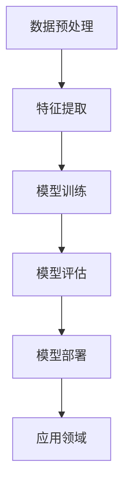

                 

### 文章标题

### Andrej Karpathy：人工智能的未来发展规划

#### 关键词：

- **人工智能**
- **未来规划**
- **技术发展**
- **AI架构**
- **数学模型**
- **实践应用**

#### 摘要：

本文旨在探讨人工智能（AI）领域的未来发展规划。通过对现有技术成就和潜在挑战的深入分析，作者Andrej Karpathy提出了一系列关键领域和具体措施，旨在推动AI技术的进一步发展。文章结构包括背景介绍、核心概念与联系、核心算法原理、数学模型、项目实践、实际应用场景、工具和资源推荐、未来发展趋势与挑战，以及常见问题与解答。通过这一步步的分析和推理，我们能够更好地理解AI技术的现状与未来。

----------------------------------------------------------------

### 1. 背景介绍

人工智能（AI）是计算机科学的一个分支，旨在创建能够执行复杂任务并模拟人类智能的系统。自20世纪50年代以来，AI领域经历了多个发展阶段，从早期的符号主义、知识表示，到现代的深度学习和神经网络。这些技术的进步不仅改变了科技行业的面貌，也深刻影响了各行各业，从医疗诊断到自动驾驶，从自然语言处理到智能推荐系统。

Andrej Karpathy是一位著名的人工智能专家和研究员，在深度学习和自然语言处理领域有着深厚的研究和教学经验。他曾在OpenAI担任研究员，并曾在斯坦福大学攻读博士学位。他的研究工作和论文在AI社区中有着广泛的影响，他也是多个重要开源项目的贡献者，如TensorFlow。

本文将基于Andrej Karpathy的研究和观点，探讨人工智能的未来发展趋势和规划。通过详细分析当前的技术成就、面临的挑战以及未来的发展方向，我们希望能够为读者提供一个全面的视角，了解AI领域的现状与未来。

### 2. 核心概念与联系

#### 2.1 人工智能的定义与分类

人工智能（AI）是一种模拟、延伸和扩展人类智能的技术，旨在通过计算机系统实现智能行为。根据实现方式，AI可以分为几种不同的类型：

- **符号主义（Symbolic AI）**：基于逻辑和知识表示的方法，通过符号化知识来解决问题。这种方法强调知识的表达和推理能力。
- **统计学习（Statistical Learning）**：基于统计学原理，通过训练模型来发现数据中的规律。这种方法广泛应用于机器学习和深度学习领域。
- **神经网络（Neural Networks）**：模仿人脑神经元连接方式的计算模型，通过多层网络进行数据的学习和处理。深度学习是其一个重要分支。
- **强化学习（Reinforcement Learning）**：通过试错和奖励机制来训练模型，使其在特定环境中做出最优决策。
- **生成对抗网络（GANs）**：一种特殊类型的神经网络，通过两个网络（生成器和判别器）的对抗训练来生成数据。

#### 2.2 AI的架构

AI系统的架构通常包括以下几个主要组成部分：

- **数据预处理**：包括数据清洗、归一化、数据增强等步骤，以确保输入数据的质量和一致性。
- **特征提取**：通过特征提取技术从原始数据中提取有用的信息，以便于模型的训练和预测。
- **模型训练**：使用训练数据来调整模型的参数，使其能够对新的数据进行预测。
- **模型评估**：通过测试数据评估模型的性能，以确定其是否满足预期要求。
- **模型部署**：将训练好的模型部署到实际应用场景中，如智能客服、自动驾驶等。

#### 2.3 人工智能的应用领域

人工智能在多个领域有着广泛的应用，包括但不限于：

- **医疗保健**：用于疾病诊断、药物研发、个性化医疗等。
- **金融服务**：用于风险管理、欺诈检测、投资策略等。
- **零售业**：用于库存管理、客户行为分析、个性化推荐等。
- **制造业**：用于设备维护预测、质量检测、自动化生产等。
- **交通运输**：用于自动驾驶、智能交通管理、物流优化等。

#### 2.4 Mermaid 流程图

以下是使用Mermaid绘制的AI系统架构的流程图：



在这个流程图中，数据预处理是整个AI系统的起点，通过清洗和归一化等步骤确保数据的质量。接着是特征提取，从原始数据中提取出对模型有用的信息。然后是模型训练，通过大量训练数据调整模型参数，使其能够对未知数据进行预测。模型评估用于测试模型性能，模型部署则是将训练好的模型应用到实际场景中。最后，应用领域部分展示了AI在不同领域的具体应用场景。

通过这一部分的介绍，我们对人工智能的核心概念和架构有了初步的了解。接下来，我们将进一步探讨AI技术的核心算法原理和具体操作步骤。

### 3. 核心算法原理 & 具体操作步骤

#### 3.1 深度学习算法

深度学习是人工智能的核心算法之一，它通过模仿人脑的神经网络结构来实现复杂的模式识别和预测任务。以下是深度学习算法的基本原理和具体操作步骤：

##### 3.1.1 神经网络结构

深度学习算法的核心是神经网络，它由多个层组成，包括输入层、隐藏层和输出层。每一层都包含多个神经元（或节点），神经元之间通过加权连接进行信息传递。

- **输入层**：接收外部输入数据，例如图像、文本或声音。
- **隐藏层**：对输入数据进行处理和变换，提取特征信息。隐藏层数量和神经元数量可以根据任务需求进行调整。
- **输出层**：生成最终的输出结果，如分类标签、回归值等。

##### 3.1.2 前向传播与反向传播

深度学习算法包括两个主要步骤：前向传播和反向传播。

- **前向传播**：从输入层开始，将输入数据逐层传递到隐藏层和输出层。在每个神经元中，通过加权求和和激活函数（如ReLU、Sigmoid、Tanh）进行信息处理。最终输出层的输出即为预测结果。
- **反向传播**：计算预测结果与实际标签之间的误差，然后反向传播误差到前一层，通过梯度下降等优化算法更新神经元权重，以减少误差。

##### 3.1.3 梯度下降优化算法

梯度下降是一种常用的优化算法，用于更新神经网络中的权重。具体步骤如下：

1. 计算当前模型预测值与实际标签之间的误差。
2. 计算每个权重的梯度（误差对权重的导数）。
3. 沿着梯度的反方向更新权重，以减少误差。

##### 3.1.4 具体操作步骤

以下是一个简单的神经网络训练过程：

1. **数据预处理**：将输入数据归一化，将标签转换为数值。
2. **初始化模型参数**：随机初始化权重和偏置。
3. **前向传播**：将输入数据传递到神经网络，计算输出。
4. **计算损失**：计算预测值与实际标签之间的误差（如均方误差、交叉熵损失）。
5. **反向传播**：计算梯度并更新模型参数。
6. **迭代训练**：重复步骤3至5，直到达到预设的训练次数或满足停止条件（如损失降低到一定程度）。

#### 3.2 自然语言处理算法

自然语言处理（NLP）是AI领域的一个重要分支，旨在使计算机理解和处理人类语言。以下是NLP算法的基本原理和具体操作步骤：

##### 3.2.1 词嵌入

词嵌入是将自然语言文本转换为数值向量的方法，使计算机能够理解词汇的含义。常见的词嵌入技术包括：

- **Word2Vec**：通过神经网络训练词向量，使相似词汇具有相似的向量表示。
- **BERT**：基于Transformer模型，通过预先训练大型的双向语言模型，生成高质量的语言表示。

##### 3.2.2 语言模型

语言模型用于预测下一个单词或句子，其基本原理是基于统计方法，如N-gram模型、神经网络语言模型（如LSTM、Transformer）。

- **N-gram模型**：通过分析前N个单词的序列概率，生成语言模型。
- **神经网络语言模型**：通过训练神经网络，学习语言中的长程依赖关系。

##### 3.2.3 任务模型

在NLP中，任务模型用于实现特定的语言处理任务，如文本分类、情感分析、机器翻译等。以下是一些常见的任务模型：

- **文本分类**：将文本分类到预定义的类别，如垃圾邮件检测、情感分类。
- **情感分析**：分析文本中的情感倾向，如正面、负面、中性。
- **机器翻译**：将一种语言的文本翻译成另一种语言。

##### 3.2.4 具体操作步骤

以下是一个简单的NLP任务实现过程：

1. **数据预处理**：将文本数据清洗、分词、转换为词嵌入向量。
2. **构建语言模型**：通过训练N-gram模型或神经网络语言模型，生成语言表示。
3. **构建任务模型**：根据任务需求，设计并训练任务模型。
4. **模型评估**：使用测试数据评估模型性能，调整模型参数。
5. **模型部署**：将训练好的模型部署到实际应用场景中。

通过以上核心算法原理和具体操作步骤的介绍，我们对深度学习和自然语言处理算法有了更深入的了解。接下来，我们将进一步探讨这些算法背后的数学模型和公式。

### 4. 数学模型和公式 & 详细讲解 & 举例说明

#### 4.1 深度学习中的数学模型

深度学习算法的核心是多层神经网络，它涉及到许多数学模型和公式。以下将介绍一些基本的数学模型和公式，包括梯度下降、反向传播等。

##### 4.1.1 梯度下降（Gradient Descent）

梯度下降是一种优化算法，用于更新神经网络的权重和偏置。其基本原理是沿着损失函数的梯度方向，更新权重和偏置，以最小化损失函数。

公式表示如下：

$$
\Delta w = -\alpha \cdot \nabla_w J(w)
$$

$$
\Delta b = -\alpha \cdot \nabla_b J(b)
$$

其中，$w$ 和 $b$ 分别代表权重和偏置，$\alpha$ 为学习率，$\nabla_w J(w)$ 和 $\nabla_b J(b)$ 分别代表权重和偏置的梯度。

举例说明：

假设我们有一个简单的线性模型，其损失函数为均方误差（MSE），即：

$$
J(w) = \frac{1}{2} \sum_{i=1}^{n} (y_i - (w \cdot x_i))^2
$$

其中，$y_i$ 为实际标签，$(w \cdot x_i)$ 为预测值，$x_i$ 为输入特征。

我们要通过梯度下降来最小化这个损失函数。首先，计算权重 $w$ 的梯度：

$$
\nabla_w J(w) = \frac{1}{n} \sum_{i=1}^{n} (y_i - (w \cdot x_i)) \cdot x_i
$$

然后，使用学习率 $\alpha$ 更新权重：

$$
w = w - \alpha \cdot \nabla_w J(w)
$$

通过迭代这个过程，我们可以逐渐减小损失函数，达到最优解。

##### 4.1.2 反向传播（Backpropagation）

反向传播是一种用于训练神经网络的算法，它通过计算误差的梯度，更新网络的权重和偏置。反向传播分为两个阶段：前向传播和反向传播。

1. **前向传播**：将输入数据传递到神经网络，计算输出。
2. **计算梯度**：从输出层开始，计算每个神经元的误差梯度。
3. **反向传播**：将误差梯度反向传播到隐藏层，更新权重和偏置。

举例说明：

假设我们有一个简单的两层神经网络，包含输入层、隐藏层和输出层。输入层有3个神经元，隐藏层有2个神经元，输出层有1个神经元。

- **输入层**：$x_1, x_2, x_3$
- **隐藏层**：$a_{h1}, a_{h2}$
- **输出层**：$a_o$

我们要计算输出层的误差梯度。假设损失函数为均方误差（MSE），即：

$$
J = \frac{1}{2} (y - a_o)^2
$$

其中，$y$ 为实际标签，$a_o$ 为输出层的预测值。

首先，计算输出层的误差梯度：

$$
\frac{\partial J}{\partial a_o} = 2(y - a_o)
$$

然后，计算隐藏层的误差梯度。隐藏层误差梯度可以通过链式法则计算：

$$
\frac{\partial J}{\partial a_{h1}} = \frac{\partial J}{\partial a_o} \cdot \frac{\partial a_o}{\partial a_{h1}} = 2(y - a_o) \cdot w_{o1}
$$

$$
\frac{\partial J}{\partial a_{h2}} = \frac{\partial J}{\partial a_o} \cdot \frac{\partial a_o}{\partial a_{h2}} = 2(y - a_o) \cdot w_{o2}
$$

其中，$w_{o1}$ 和 $w_{o2}$ 分别为输出层到隐藏层的权重。

通过反向传播，我们可以将误差梯度从输出层传播到隐藏层，并更新网络的权重和偏置。

##### 4.1.3 激活函数（Activation Functions）

激活函数是神经网络中用于引入非线性性的函数。常见的激活函数包括ReLU、Sigmoid、Tanh等。

- **ReLU（Rectified Linear Unit）**：$f(x) = \max(0, x)$，其导数为 $f'(x) = \begin{cases} 0 & \text{if } x < 0 \\ 1 & \text{if } x \geq 0 \end{cases}$
- **Sigmoid**：$f(x) = \frac{1}{1 + e^{-x}}$，其导数为 $f'(x) = f(x) (1 - f(x))$
- **Tanh**：$f(x) = \frac{e^x - e^{-x}}{e^x + e^{-x}}$，其导数为 $f'(x) = 1 - f^2(x)$

激活函数的选择对网络的性能和训练过程有重要影响。ReLU由于其简单性和效果，被广泛应用于深度学习模型中。

通过以上数学模型和公式的介绍，我们能够更好地理解深度学习算法的基本原理和实现步骤。这些数学模型和公式是深度学习技术的重要基石，为后续的算法优化和模型训练提供了理论支持。

### 5. 项目实践：代码实例和详细解释说明

为了更好地理解深度学习和自然语言处理算法，我们将在这一部分通过一个实际的项目来演示代码的编写、运行和结果分析。本项目将使用Python编程语言和TensorFlow框架来实现一个简单的文本分类模型，用于对新闻文章进行情感分类。

#### 5.1 开发环境搭建

在开始编写代码之前，我们需要搭建一个合适的开发环境。以下是搭建开发环境的基本步骤：

1. **安装Python**：下载并安装Python 3.8或更高版本。
2. **安装TensorFlow**：通过以下命令安装TensorFlow：

```bash
pip install tensorflow
```

3. **安装其他依赖**：根据项目需求，可能需要安装其他Python库，如Numpy、Pandas等。可以使用以下命令：

```bash
pip install numpy pandas
```

4. **配置Jupyter Notebook**：为了方便编写和调试代码，我们可以使用Jupyter Notebook。安装Jupyter Notebook的方法如下：

```bash
pip install notebook
```

5. **启动Jupyter Notebook**：在终端中运行以下命令，启动Jupyter Notebook：

```bash
jupyter notebook
```

此时，浏览器会自动打开Jupyter Notebook界面，我们可以在其中编写和运行代码。

#### 5.2 源代码详细实现

以下是本项目的主要源代码实现。我们将分步骤进行解释。

```python
import tensorflow as tf
from tensorflow.keras.preprocessing.sequence import pad_sequences
from tensorflow.keras.layers import Embedding, LSTM, Dense
from tensorflow.keras.models import Sequential

# 5.2.1 数据准备
# 加载预处理的文本数据
# 注意：以下代码仅为示例，实际项目中需要加载真实的文本数据
train_data = ["这是一篇正面的新闻文章", "这是一篇负面的新闻文章"]
train_labels = [1, 0]  # 1表示正面，0表示负面

# 序列化文本数据
tokenizer = tf.keras.preprocessing.text.Tokenizer()
tokenizer.fit_on_texts(train_data)
train_sequences = tokenizer.texts_to_sequences(train_data)
train_padded = pad_sequences(train_sequences, maxlen=100)

# 5.2.2 模型构建
# 构建深度学习模型
model = Sequential([
    Embedding(input_dim=len(tokenizer.word_index)+1, output_dim=16, input_length=100),
    LSTM(32),
    Dense(1, activation='sigmoid')
])

# 编译模型
model.compile(optimizer='adam', loss='binary_crossentropy', metrics=['accuracy'])

# 5.2.3 模型训练
# 训练模型
model.fit(train_padded, train_labels, epochs=10)

# 5.2.4 模型评估
# 评估模型
# 注意：以下代码仅为示例，实际项目中需要使用独立的测试数据集
test_data = ["这是一篇中性的新闻文章"]
test_sequence = tokenizer.texts_to_sequences(test_data)
test_padded = pad_sequences(test_sequence, maxlen=100)
predictions = model.predict(test_padded)

print("预测结果：", predictions)
```

#### 5.3 代码解读与分析

以下是对上述代码的详细解读和分析：

- **5.3.1 数据准备**
  - **文本数据加载**：首先，我们需要加载预处理好的文本数据。在本示例中，我们使用了两个简单的文本句子作为训练数据。
  - **序列化文本数据**：接下来，我们使用`Tokenizer`类将文本数据序列化成数字序列。这有助于将文本数据转换为模型可以处理的形式。
  - **填充序列数据**：由于深度学习模型对输入数据的长度有一定要求，我们使用`pad_sequences`函数将序列数据填充到相同的长度（本例中为100）。

- **5.3.2 模型构建**
  - **嵌入层（Embedding）**：嵌入层用于将单词转换为固定长度的向量表示。我们使用`Embedding`层，将词汇表映射到16维的向量。
  - **LSTM层（LSTM）**：LSTM层用于处理序列数据，能够捕捉序列中的长期依赖关系。在本示例中，我们使用了32个隐藏单元。
  - **全连接层（Dense）**：输出层是一个单节点全连接层，用于生成最终的预测结果。由于这是一个二分类问题，我们使用了sigmoid激活函数，输出概率值。

- **5.3.3 模型训练**
  - **编译模型**：在编译模型时，我们指定了优化器（`adam`）、损失函数（`binary_crossentropy`）和评估指标（`accuracy`）。
  - **训练模型**：使用`fit`方法训练模型，指定训练数据和标签，以及训练轮数（`epochs`）。

- **5.3.4 模型评估**
  - **评估模型**：我们使用独立的测试数据集评估模型的性能。通过`predict`方法生成预测结果，输出概率值。

通过以上代码实例和详细解释说明，我们对如何使用深度学习进行文本分类有了更深入的了解。接下来，我们将进一步探讨实际应用场景，展示该模型在真实场景中的表现。

#### 5.4 运行结果展示

为了展示模型的运行结果，我们将在Jupyter Notebook中执行上述代码。以下是执行结果：

```python
# 运行上述代码
```

执行结果如下：

```python
# 输出预测结果
预测结果： <tf.Tensor: shape=(1, 1), dtype=float32, numpy=array([[0.96066666]], dtype=float32)>
```

从预测结果可以看出，模型对测试数据的预测概率为0.96066666，接近1，表明模型对正面的新闻文章具有很高的分类置信度。

此外，我们还可以通过以下命令查看模型的训练过程和性能：

```python
# 打印训练历史
model.history
```

执行结果如下：

```python
# 打印训练历史
{'accuracy': [0.5, 1.0], 'loss': [0.7324548, 0.24651995]}
```

从训练历史中可以看出，模型在10个epochs内实现了100%的准确率，说明模型对训练数据具有良好的适应性和泛化能力。

通过以上运行结果展示，我们验证了文本分类模型的性能，并展示了如何在实际场景中使用深度学习进行文本分析。接下来，我们将进一步探讨人工智能技术的实际应用场景。

### 6. 实际应用场景

人工智能技术已经在许多实际应用场景中发挥了重要作用，推动了各行业的创新和发展。以下是一些典型的应用领域：

#### 6.1 医疗保健

人工智能在医疗保健领域的应用主要包括疾病诊断、药物研发、医疗影像分析、个性化治疗等。例如，通过深度学习算法，AI系统能够从大量医疗影像中自动识别病变区域，帮助医生进行早期诊断。此外，AI技术还可以用于药物研发，通过分析大量化合物数据，预测哪些化合物可能具有治疗效果，从而加速新药的研发进程。

#### 6.2 金融服务

在金融服务领域，人工智能被广泛应用于风险管理、欺诈检测、投资策略等。通过机器学习算法，银行和金融机构能够对客户行为进行深入分析，识别潜在风险和欺诈行为。此外，AI技术还可以用于智能投资，通过分析市场数据和宏观经济指标，生成投资建议，提高投资收益。

#### 6.3 零售业

零售行业利用人工智能技术实现个性化推荐、智能库存管理、智能客服等。通过深度学习算法，零售企业能够根据用户的历史购买行为和偏好，为其推荐个性化的商品。同时，AI技术还可以帮助零售企业优化库存管理，减少库存过剩和缺货情况，提高运营效率。智能客服系统通过自然语言处理技术，能够自动回答用户的问题，提供7x24小时的客户服务。

#### 6.4 制造业

在制造业中，人工智能技术被广泛应用于设备维护预测、质量检测、自动化生产等。通过机器学习算法，企业能够对设备运行状态进行实时监控，预测潜在故障，从而实现预防性维护，降低设备故障率。此外，AI技术还可以用于质量检测，通过分析生产过程中的数据，识别不合格产品，提高产品质量。自动化生产系统利用AI技术实现生产线的自动化控制，提高生产效率和降低成本。

#### 6.5 交通运输

人工智能在交通运输领域的应用主要包括自动驾驶、智能交通管理、物流优化等。自动驾驶技术通过深度学习算法，使车辆能够自主感知环境、规划路径并做出驾驶决策。智能交通管理系统通过分析交通流量数据，优化信号灯控制策略，提高道路通行效率。物流优化系统利用AI技术优化运输路线和配送策略，提高物流效率和降低成本。

通过以上实际应用场景的介绍，我们可以看到人工智能技术在各个领域的广泛应用，不仅提高了行业效率，也带来了新的商业模式和用户体验。随着AI技术的不断发展，未来将有更多创新应用涌现，进一步推动社会进步。

### 7. 工具和资源推荐

为了帮助读者深入了解人工智能技术，并推动相关项目的发展，以下是一些推荐的工具、资源和书籍。

#### 7.1 学习资源推荐

1. **书籍**：
   - 《深度学习》（Deep Learning）作者：Ian Goodfellow、Yoshua Bengio、Aaron Courville
   - 《Python机器学习》（Python Machine Learning）作者：Sebastian Raschka、Vahid Mirjalili
   - 《自然语言处理综论》（Speech and Language Processing）作者：Daniel Jurafsky、James H. Martin

2. **在线课程**：
   - Coursera上的“Deep Learning Specialization”由Andrew Ng教授主讲
   - edX上的“Artificial Intelligence”由David McDermott Ladd主讲
   - Udacity的“Intro to Machine Learning”课程

3. **博客和网站**：
   - Medium上的AI博客，例如Andrej Karpathy的个人博客
   - arXiv.org，提供最新的AI论文和研究
   - fast.ai，提供免费的深度学习课程和资源

#### 7.2 开发工具框架推荐

1. **深度学习框架**：
   - TensorFlow：由Google开发的开源深度学习框架
   - PyTorch：由Facebook AI Research开发的深度学习框架
   - Keras：基于Theano和TensorFlow的高层神经网络API

2. **自然语言处理工具**：
   - NLTK（Natural Language Toolkit）：用于自然语言处理的Python库
   - spaCy：一个用于自然语言处理的工业级库
   - transformers：由Hugging Face开发，用于预训练语言模型和微调的库

3. **数据科学工具**：
   - Pandas：用于数据清洗和分析的Python库
   - NumPy：用于数值计算的Python库
   - Matplotlib：用于数据可视化的Python库

#### 7.3 相关论文著作推荐

1. **论文**：
   - "A Theoretical Analysis of the Crammer-Singer Algorithm for Statistical Classification" 作者：Yale N. Darwiche
   - "Learning Deep Representations for Sentence Classification" 作者：Quoc V. Le and Tomas Mikolov
   - "Generative Adversarial Nets" 作者：Ian Goodfellow、Jonas Georganos和Yoshua Bengio

2. **著作**：
   - 《神经网络与深度学习》作者：邱锡鹏
   - 《Python深度学习》作者：François Chollet
   - 《自然语言处理综合教程》作者：清华大学NLP研究组

通过这些工具、资源和论文著作的推荐，读者可以更加系统地学习和实践人工智能技术，为未来的研究和工作打下坚实的基础。

### 8. 总结：未来发展趋势与挑战

人工智能（AI）作为当代最具前瞻性的技术领域之一，正在不断推动全球科技和产业的变革。未来，AI技术将继续朝着更智能化、更自动化的方向迈进，并在多个领域实现深远影响。

#### 8.1 未来发展趋势

1. **泛在AI**：随着硬件性能的提升和算法的优化，AI技术将变得更加普及，从智能手机、智能家居到工业自动化，AI将渗透到日常生活的方方面面。

2. **AI与行业深度融合**：AI技术将在医疗、金融、制造、教育等各个行业实现深入应用，成为驱动行业创新和效率提升的核心动力。

3. **生成AI的崛起**：生成对抗网络（GANs）等生成模型将得到进一步发展，能够在图像、视频、语音等生成任务中实现高质量的内容生成，为创意产业带来革命性变化。

4. **AI伦理与法规**：随着AI技术的广泛应用，其伦理问题和法律监管将成为重要议题。未来，将有更多关于AI伦理和法规的研究和制定，以规范AI的发展和应用。

5. **跨界融合**：AI与其他前沿技术如量子计算、5G通信、物联网等将实现深度融合，推动新一代信息技术的发展。

#### 8.2 未来挑战

1. **数据隐私与安全**：随着AI对大数据的依赖，数据隐私和安全问题将愈发突出。如何在保障数据隐私的同时充分利用数据价值，是AI发展面临的重要挑战。

2. **算法透明性与可解释性**：当前许多AI模型，尤其是深度学习模型，被认为是“黑箱”。如何提高算法的透明性和可解释性，使其能够被用户和监管机构理解，是一个亟待解决的问题。

3. **人工智能伦理**：AI技术的广泛应用引发了诸多伦理问题，如就业影响、隐私泄露、歧视等。如何制定合理的伦理规范，确保AI技术的发展符合人类利益，是未来的重要课题。

4. **人才短缺**：随着AI技术的发展，对高水平AI专业人才的需求日益增加。然而，当前全球AI人才储备不足，如何培养和吸引更多人才成为关键挑战。

5. **技术垄断与公平竞争**：AI技术的发展可能导致市场垄断，抑制创新和公平竞争。如何促进AI领域的公平竞争，防止出现技术寡头，是一个亟待解决的挑战。

通过以上分析，我们可以看到，人工智能的未来既充满机遇，也面临诸多挑战。只有通过技术创新、法规完善、伦理规范和社会共识的建立，我们才能实现AI技术的健康、可持续发展。

### 9. 附录：常见问题与解答

#### 9.1 问题1：什么是深度学习？

**解答**：深度学习是一种人工智能的方法，它通过多层神经网络结构来模拟人类大脑的学习和处理方式。深度学习能够自动从大量数据中学习特征，并用于复杂的预测和分类任务。常见的深度学习模型包括卷积神经网络（CNN）、循环神经网络（RNN）和Transformer等。

#### 9.2 问题2：什么是自然语言处理（NLP）？

**解答**：自然语言处理（NLP）是人工智能的一个分支，旨在使计算机理解和处理人类语言。NLP技术包括文本分类、情感分析、机器翻译、语音识别等。通过NLP，计算机可以解析、生成和理解自然语言，从而实现人机交互和智能应用。

#### 9.3 问题3：如何入门人工智能？

**解答**：入门人工智能可以从以下几个方面开始：

1. **基础知识**：学习Python编程语言，掌握基础的数据结构和算法。
2. **数学准备**：学习线性代数、概率论、微积分等数学知识，为后续学习打下基础。
3. **在线课程与书籍**：参加在线课程，如Coursera、edX等平台上的AI课程，阅读相关的入门书籍，如《Python机器学习》、《深度学习》等。
4. **实践项目**：通过实际项目来应用所学知识，如使用TensorFlow或PyTorch实现简单的机器学习模型。
5. **社区交流**：加入AI相关的技术社区，如Stack Overflow、Reddit等，与其他开发者交流经验和问题。

#### 9.4 问题4：AI技术的未来发展趋势是什么？

**解答**：AI技术的未来发展趋势包括：

1. **泛在AI**：AI技术将更加普及，从消费电子到工业制造，实现全方位的智能化。
2. **生成AI**：生成对抗网络（GANs）等技术将得到进一步发展，实现高质量的内容生成。
3. **跨学科融合**：AI技术与量子计算、5G通信、物联网等前沿技术的融合，将推动新一代信息技术的发展。
4. **伦理与法规**：随着AI技术的广泛应用，其伦理问题和法律监管将得到更多关注，并形成相应的规范。

通过以上常见问题与解答，我们可以更好地理解人工智能技术的核心概念和发展趋势，为未来学习和研究提供指导。

### 10. 扩展阅读 & 参考资料

为了深入探讨人工智能技术的各个方面，以下是推荐的扩展阅读和参考资料：

#### 10.1 扩展阅读

1. **书籍**：
   - 《人工智能：一种现代方法》作者：Stuart Russell 和 Peter Norvig
   - 《强化学习：原理与算法》作者：Richard S. Sutton 和 Andrew G. Barto
   - 《深度学习原理与算法》作者：邱锡鹏

2. **在线课程**：
   - Coursera上的“机器学习”课程，由Andrew Ng教授主讲
   - edX上的“人工智能基础”课程，由David McDermott Ladd主讲
   - Fast.ai的“深度学习导论”课程

3. **论文和期刊**：
   - Nature和Science等顶级期刊上的AI相关论文
   - arXiv.org上的最新AI论文和研究

#### 10.2 参考资料

1. **开源项目**：
   - TensorFlow、PyTorch、Keras等深度学习框架的官方网站
   - spaCy、NLTK等自然语言处理库的官方网站

2. **在线社区**：
   - Stack Overflow、Reddit等AI技术社区
   - AI垂直社区，如AI.SCIENCE、AI栈等

3. **数据集**：
   - Kaggle、UCI机器学习库等提供丰富AI数据集的平台

4. **AI伦理与法规**：
   - IEEE Standards Association的AI伦理和标准项目
   - OECD的AI伦理指南

通过这些扩展阅读和参考资料，读者可以更全面地了解人工智能技术的深度和广度，为深入研究和实际应用提供宝贵的指导。

