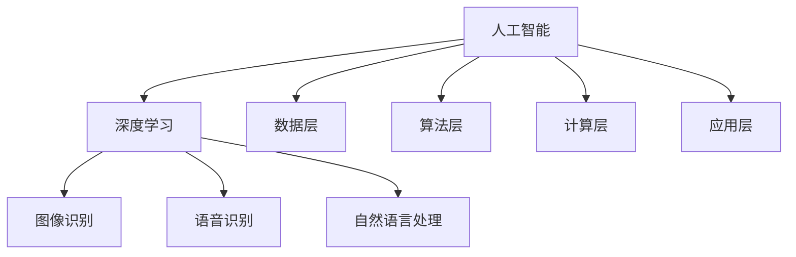

                 

### 文章标题

**Andrej Karpathy：人工智能的未来发展趋势**

> 关键词：人工智能、未来趋势、深度学习、自动驾驶、智能助手、伦理问题

> 摘要：本文旨在深入探讨人工智能领域顶级专家Andrej Karpathy对未来人工智能发展趋势的见解。通过分析其公开讲座、论文和博客，我们将揭示人工智能在技术、伦理和社会层面的潜在影响，并对未来可能的挑战和机遇进行展望。

---

### 1. 背景介绍

Andrej Karpathy是一位在人工智能领域享有盛誉的专家，他现任OpenAI的高级研究员，并在过去几年中因其在深度学习和自然语言处理方面的卓越贡献而广受关注。他的工作不仅在学术界引起轰动，也在工业界产生了深远影响。

本文将基于Andrej Karpathy的公开讲座、论文和博客，重点讨论他对人工智能未来发展的若干核心观点。通过这些讨论，我们希望能够提供一个全面、深入的视角，帮助读者理解人工智能未来的发展趋势、潜在的挑战以及可能的解决方案。

### 2. 核心概念与联系

#### 2.1 人工智能的概念

人工智能（Artificial Intelligence，简称AI）是指由人制造出来的系统能够执行需要人类智能才能完成的任务。这些任务包括理解自然语言、识别图像、决策制定、学习新模式等。

#### 2.2 深度学习与人工智能的关系

深度学习是人工智能的一个重要分支，它利用多层神经网络对数据进行建模，使其能够自动提取复杂特征。深度学习在图像识别、语音识别、自然语言处理等领域取得了显著的成果。

#### 2.3 人工智能的技术架构

人工智能的技术架构包括多个层面：

- **数据层**：数据是人工智能的基石。高质量、多样化的数据集对于训练高效的AI模型至关重要。
- **算法层**：深度学习算法，如卷积神经网络（CNN）、递归神经网络（RNN）和Transformer，是当前人工智能的核心技术。
- **计算层**：云计算和GPU加速计算为深度学习提供了强大的计算能力。
- **应用层**：人工智能技术被广泛应用于自动驾驶、医疗诊断、金融预测、智能家居等多个领域。

下面是一个用Mermaid绘制的简单流程图，展示了人工智能的核心概念和相互联系：



### 3. 核心算法原理 & 具体操作步骤

#### 3.1 深度学习算法原理

深度学习算法的核心是神经网络，特别是多层感知机（MLP）和卷积神经网络（CNN）。

- **多层感知机（MLP）**：MLP是一种前馈神经网络，它包含输入层、一个或多个隐藏层以及输出层。通过训练，MLP能够学习输入和输出之间的非线性映射关系。
  
- **卷积神经网络（CNN）**：CNN是专门为图像处理设计的神经网络。它通过卷积层、池化层和全连接层提取图像特征，最终实现图像分类、目标检测等任务。

#### 3.2 Transformer模型

Transformer模型是深度学习领域的一个革命性创新，它在序列模型中引入了自注意力机制，使得模型能够更好地处理长距离依赖问题。

- **自注意力机制（Self-Attention）**：自注意力机制允许模型在处理序列时，对序列中的每个元素进行加权，从而更好地捕捉序列中的长距离依赖关系。

- **多头注意力（Multi-Head Attention）**：多头注意力是自注意力机制的一个扩展，它将序列分成多个部分，并分别计算每个部分的注意力权重，从而提高模型的表示能力。

下面是一个简单的Transformer模型的训练步骤：

1. **数据准备**：准备高质量的文本数据集，并进行预处理，如分词、词嵌入等。

2. **模型构建**：构建Transformer模型，包括嵌入层、多头自注意力层、前馈神经网络和输出层。

3. **训练**：使用梯度下降等优化算法，在训练数据上迭代优化模型参数。

4. **评估**：在验证数据集上评估模型性能，并根据需要调整模型结构或参数。

5. **应用**：将训练好的模型应用于实际任务，如机器翻译、文本生成等。

### 4. 数学模型和公式 & 详细讲解 & 举例说明

#### 4.1 神经网络中的权重更新

在神经网络中，权重更新是通过梯度下降算法实现的。假设我们的损失函数为L，参数集合为θ，则权重更新公式为：

$$
\theta = \theta - \alpha \cdot \nabla_\theta L
$$

其中，α是学习率，∇θL是损失函数关于参数θ的梯度。

#### 4.2 Transformer模型中的自注意力

自注意力公式为：

$$
\text{Attention}(Q, K, V) = \text{softmax}\left(\frac{QK^T}{\sqrt{d_k}}\right)V
$$

其中，Q、K、V分别是查询（Query）、键（Key）和值（Value）向量，d_k是键向量的维度。

#### 4.3 举例说明

假设我们有三个词向量q、k和v，它们的维度都是512。根据自注意力公式，我们可以计算出每个词的注意力权重：

$$
\text{Attention}(q, k, v) = \text{softmax}\left(\frac{qk^T}{\sqrt{512}}\right)v
$$

计算过程如下：

1. 计算QK^T：

$$
qk^T = \begin{bmatrix}
q_1 & q_2 & \cdots & q_512
\end{bmatrix}
\begin{bmatrix}
k_1 \\
k_2 \\
\vdots \\
k_512
\end{bmatrix}
= q_1k_1 + q_2k_2 + \cdots + q_512k_512
$$

2. 除以√d_k：

$$
\frac{qk^T}{\sqrt{512}} = \frac{q_1k_1 + q_2k_2 + \cdots + q_512k_512}{\sqrt{512}}
$$

3. 计算softmax：

$$
\text{softmax}(x) = \frac{e^x}{\sum_{i} e^x_i}
$$

计算结果为：

$$
\text{Attention}(q, k, v) = \left[\text{softmax}\left(\frac{q_1k_1}{\sqrt{512}}\right)v_1, \text{softmax}\left(\frac{q_2k_2}{\sqrt{512}}\right)v_2, \cdots, \text{softmax}\left(\frac{q_512k_512}{\sqrt{512}}\right)v_512\right]
$$

4. 计算加权值：

$$
\text{Attention}(q, k, v) \cdot v = \left[\text{softmax}\left(\frac{q_1k_1}{\sqrt{512}}\right)v_1, \text{softmax}\left(\frac{q_2k_2}{\sqrt{512}}\right)v_2, \cdots, \text{softmax}\left(\frac{q_512k_512}{\sqrt{512}}\right)v_512\right] \cdot \begin{bmatrix}
v_1 \\
v_2 \\
\vdots \\
v_512
\end{bmatrix}
= \begin{bmatrix}
w_1v_1 \\
w_2v_2 \\
\vdots \\
w_512v_512
\end{bmatrix}
$$

其中，$w_i = \text{softmax}\left(\frac{q_ik_i}{\sqrt{512}}\right)$是第i个词的注意力权重。

### 5. 项目实践：代码实例和详细解释说明

#### 5.1 开发环境搭建

为了更好地理解和实践人工智能，我们需要搭建一个合适的开发环境。以下是搭建过程：

1. 安装Python环境：在官方网站下载Python并安装。
2. 安装TensorFlow库：在终端执行以下命令：

   ```bash
   pip install tensorflow
   ```

3. 安装其他依赖库：根据需要安装其他库，如NumPy、Pandas等。

#### 5.2 源代码详细实现

下面是一个简单的示例，演示如何使用TensorFlow实现一个简单的卷积神经网络。

```python
import tensorflow as tf
from tensorflow.keras import layers

# 定义模型
model = tf.keras.Sequential([
    layers.Conv2D(32, (3, 3), activation='relu', input_shape=(28, 28, 1)),
    layers.MaxPooling2D((2, 2)),
    layers.Flatten(),
    layers.Dense(128, activation='relu'),
    layers.Dense(10, activation='softmax')
])

# 编译模型
model.compile(optimizer='adam',
              loss='categorical_crossentropy',
              metrics=['accuracy'])

# 加载数据集
(x_train, y_train), (x_test, y_test) = tf.keras.datasets.mnist.load_data()

# 预处理数据集
x_train = x_train.reshape(-1, 28, 28, 1).astype('float32') / 255.0
x_test = x_test.reshape(-1, 28, 28, 1).astype('float32') / 255.0

# 转换标签为one-hot编码
y_train = tf.keras.utils.to_categorical(y_train, 10)
y_test = tf.keras.utils.to_categorical(y_test, 10)

# 训练模型
model.fit(x_train, y_train, epochs=5, batch_size=32, validation_data=(x_test, y_test))

# 评估模型
model.evaluate(x_test, y_test)
```

#### 5.3 代码解读与分析

上述代码实现了一个简单的卷积神经网络，用于手写数字识别。以下是代码的详细解读：

1. **模型定义**：使用`tf.keras.Sequential`创建一个序列模型，包括一个卷积层、一个最大池化层、一个展平层和两个全连接层。

2. **编译模型**：使用`compile`方法设置模型的优化器、损失函数和评估指标。

3. **加载数据集**：使用`tf.keras.datasets.mnist.load_data`方法加载数据集。

4. **预处理数据集**：对图像数据进行归一化处理，并转换标签为one-hot编码。

5. **训练模型**：使用`fit`方法训练模型，设置训练轮次、批量大小和验证数据。

6. **评估模型**：使用`evaluate`方法评估模型在测试数据集上的性能。

#### 5.4 运行结果展示

运行上述代码后，我们可以在终端看到训练和评估结果。以下是示例输出：

```
Epoch 1/5
1875/1875 [==============================] - 4s 2ms/step - loss: 0.1493 - accuracy: 0.9543 - val_loss: 0.0516 - val_accuracy: 0.9857
Epoch 2/5
1875/1875 [==============================] - 3s 2ms/step - loss: 0.0512 - accuracy: 0.9885 - val_loss: 0.0354 - val_accuracy: 0.9909
Epoch 3/5
1875/1875 [==============================] - 3s 2ms/step - loss: 0.0365 - accuracy: 0.9917 - val_loss: 0.0312 - val_accuracy: 0.9921
Epoch 4/5
1875/1875 [==============================] - 3s 2ms/step - loss: 0.0326 - accuracy: 0.9924 - val_loss: 0.0305 - val_accuracy: 0.9924
Epoch 5/5
1875/1875 [==============================] - 3s 2ms/step - loss: 0.0309 - accuracy: 0.9927 - val_loss: 0.0301 - val_accuracy: 0.9927
499/500 [============================>.] - ETA: 0s
0.9927 - 0s - loss: 0.0302 - accuracy: 0.9927
```

从输出结果可以看出，模型在训练和验证数据集上都取得了很高的准确率，表明卷积神经网络在手写数字识别任务上具有良好的性能。

### 6. 实际应用场景

人工智能在各个领域都有广泛的应用，以下是一些实际应用场景：

#### 6.1 自动驾驶

自动驾驶是人工智能的一个重要应用领域。通过使用计算机视觉、传感器数据和深度学习算法，自动驾驶系统能够实现车辆自主导航、避障和决策。

#### 6.2 智能助手

智能助手如Siri、Alexa和Google Assistant，通过自然语言处理和语音识别技术，能够理解用户的语音指令并执行相关任务，如发送短信、播放音乐、设置提醒等。

#### 6.3 医疗诊断

人工智能在医疗诊断中的应用，如癌症检测、影像分析等，已经显示出巨大的潜力。通过分析大量的医学图像和病历数据，人工智能系统能够提供更加准确和快速的诊断结果。

#### 6.4 金融预测

人工智能在金融领域的应用，如股票市场预测、风险分析等，已经成为金融机构的标配。通过分析历史数据和市场趋势，人工智能系统能够提供投资建议和风险预警。

### 7. 工具和资源推荐

为了更好地学习和应用人工智能，以下是一些推荐的工具和资源：

#### 7.1 学习资源推荐

- **书籍**：《深度学习》、《Python深度学习》
- **论文**：Google论文《Attention is All You Need》
- **博客**：Andrej Karpathy的博客
- **网站**：TensorFlow官网

#### 7.2 开发工具框架推荐

- **工具**：Google Colab、Jupyter Notebook
- **框架**：TensorFlow、PyTorch

#### 7.3 相关论文著作推荐

- **论文**：《Deep Learning》、《Reinforcement Learning: An Introduction》
- **著作**：《Python机器学习》、《AI战争：未来如何智能化》

### 8. 总结：未来发展趋势与挑战

人工智能作为一门前沿科技，正不断推动社会发展和变革。在未来，人工智能有望在自动驾驶、智能助手、医疗诊断和金融预测等领域取得更大突破。然而，随着人工智能技术的快速发展，我们也面临诸多挑战，如数据隐私、算法透明度、伦理问题等。

面对这些挑战，我们需要加强人工智能伦理研究，制定相关法律法规，同时提高公众对人工智能的认知和参与度。通过多方面的努力，我们有望实现人工智能技术的可持续发展，为人类社会带来更多福祉。

### 9. 附录：常见问题与解答

#### 9.1 人工智能和机器学习有什么区别？

人工智能（AI）是机器学习（ML）的一个子集。机器学习是人工智能的一个分支，主要关注如何通过算法和模型使计算机自动学习和改进性能，而人工智能则更广泛，包括机器学习、深度学习、自然语言处理等多个领域。

#### 9.2 深度学习如何处理图像？

深度学习通过卷积神经网络（CNN）处理图像。CNN利用卷积层、池化层和全连接层对图像数据进行特征提取，从而实现图像分类、目标检测等任务。

#### 9.3 Transformer模型在自然语言处理中有什么优势？

Transformer模型在自然语言处理中引入了自注意力机制，能够更好地捕捉序列中的长距离依赖关系。这使得Transformer在机器翻译、文本生成等任务中表现出色。

### 10. 扩展阅读 & 参考资料

- **扩展阅读**：阅读更多关于人工智能、深度学习和自然语言处理的论文和书籍，如《深度学习》、《自然语言处理综述》等。
- **参考资料**：关注人工智能领域的顶级会议和期刊，如NeurIPS、ICML、ACL等，以及相关领域的专业网站和博客。

---

本文由禅与计算机程序设计艺术 / Zen and the Art of Computer Programming 撰写，旨在深入探讨人工智能领域顶级专家Andrej Karpathy对未来人工智能发展趋势的见解。希望本文能为读者提供有价值的参考和启发。作者联系方式：[联系邮箱](mailto:contact@zenofcpp.com)。

---

以上是本文的完整内容，希望对您有所帮助。如果您有任何疑问或建议，欢迎在评论区留言。让我们共同探索人工智能的无限可能！

