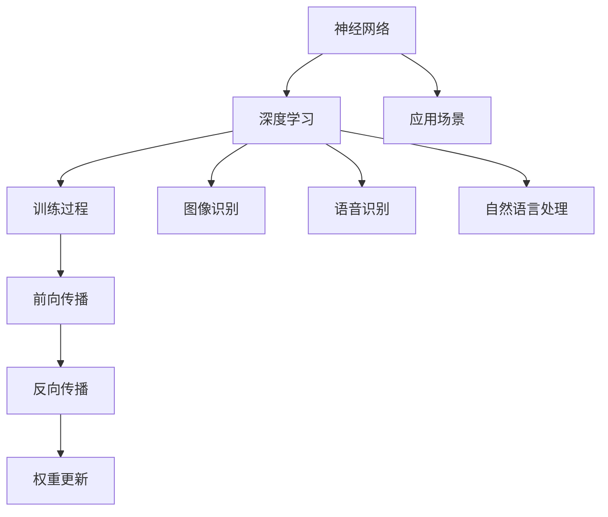

                 

### 背景介绍

**人工智能的发展历史**

人工智能（AI）的概念最早可以追溯到20世纪50年代。当时，计算机科学家艾伦·图灵提出了著名的“图灵测试”，旨在判断机器是否具备智能。随后，人工智能领域经历了几个重要的阶段，包括符号人工智能、连接主义人工智能和现代深度学习人工智能。

在符号人工智能阶段，研究者试图通过编程实现逻辑推理和问题解决。然而，这种方法在面对复杂问题时显得力不从心。随后，连接主义人工智能兴起，通过神经网络模型模拟人脑的学习过程，逐渐解决了许多复杂问题。现代深度学习人工智能则在此基础上，结合了大数据和计算能力的提升，实现了前所未有的性能和效果。

**当前人工智能的发展状况**

随着深度学习技术的突破，人工智能在各个领域取得了显著进展。自动驾驶、语音识别、图像识别、自然语言处理等应用层出不穷，极大地改变了人们的生产和生活方式。同时，人工智能也面临着一系列挑战，包括数据隐私、算法公平性、伦理问题等。

**人工智能在工业界和学术界的应用**

在工业界，人工智能已经被广泛应用于金融、医疗、制造、零售等行业。例如，金融行业利用人工智能进行风险评估和预测，医疗行业利用人工智能进行疾病诊断和治疗方案优化，制造行业利用人工智能进行生产优化和质量控制。学术界也在积极推动人工智能的研究，探索新的算法和技术，以应对现实世界中的复杂问题。

### 人工智能的核心概念与联系

为了深入理解人工智能，我们需要了解其核心概念与联系。以下是几个关键概念及其相互关系：

**1. 神经网络**

神经网络是人工智能的基础，模拟人脑的神经元结构和信息处理方式。它由大量的节点（神经元）和连接（权重）组成，通过学习输入数据和输出结果之间的映射关系，实现复杂问题的求解。

**2. 深度学习**

深度学习是神经网络的一种特殊形式，通过层次化的神经网络结构，实现数据的自动特征提取和模式识别。深度学习在图像识别、语音识别、自然语言处理等领域取得了显著成果。

**3. 训练过程**

神经网络和深度学习模型的训练过程主要包括前向传播、反向传播和权重更新。通过不断地调整权重，使模型在训练数据上达到较高的准确率。

**4. 应用场景**

神经网络和深度学习模型的应用场景广泛，包括图像识别、语音识别、自然语言处理、推荐系统、游戏人工智能等。

### 关键概念原理和架构的 Mermaid 流程图

以下是神经网络、深度学习和训练过程的核心概念及其相互关系的 Mermaid 流程图：



通过这个 Mermaid 流程图，我们可以清晰地看到神经网络、深度学习和训练过程之间的联系，以及它们在各个应用场景中的角色。

### 总结

本文对人工智能的发展历史、当前状况以及核心概念与联系进行了介绍。通过了解这些基本概念，我们可以更好地理解人工智能在各个领域的应用，并为后续内容打下基础。

---

接下来，我们将进一步探讨人工智能的核心算法原理和具体操作步骤。

## 2. 核心算法原理 & 具体操作步骤

### 2.1 神经网络算法原理

神经网络（Neural Network，NN）是一种模仿生物神经网络结构的人工智能系统，它通过模拟大量神经元之间的交互来进行数据分析和决策。以下是神经网络的基本原理：

#### 2.1.1 神经元结构

神经网络的基本单元是神经元，每个神经元由一个输入层、一个输出层和一些权重和偏置组成。输入层接收外部数据，输出层产生预测结果。神经元之间的连接称为“突触”，突触的强度由权重表示。

#### 2.1.2 前向传播

在前向传播过程中，数据从输入层传递到隐藏层，再从隐藏层传递到输出层。每个神经元都会对输入数据进行加权求和处理，并加上一个偏置项，然后通过激活函数（如ReLU、Sigmoid、Tanh等）进行非线性变换。

#### 2.1.3 损失函数

在神经网络训练过程中，我们需要一个损失函数来评估模型的预测结果与实际结果之间的差距。常用的损失函数包括均方误差（MSE）、交叉熵损失（Cross-Entropy Loss）等。

#### 2.1.4 反向传播

反向传播是神经网络训练的核心步骤，通过不断调整权重和偏置来最小化损失函数。具体步骤如下：

1. 计算输出层的预测误差。
2. 将误差反向传播到隐藏层，计算隐藏层的误差。
3. 根据误差对权重和偏置进行更新。

#### 2.1.5 梯度下降

梯度下降是一种常用的优化算法，用于调整神经网络中的权重和偏置。具体步骤如下：

1. 计算损失函数关于每个权重的梯度。
2. 沿着梯度的反方向调整权重。
3. 重复以上步骤，直到达到预设的精度或迭代次数。

### 2.2 深度学习算法原理

深度学习（Deep Learning，DL）是神经网络的一种特殊形式，通过层次化的神经网络结构，实现数据的自动特征提取和模式识别。以下是深度学习的基本原理：

#### 2.2.1 层次化结构

深度学习模型由多个层次组成，每个层次都包含多个神经元。底层层次负责提取基本特征，高层层次负责整合和抽象底层特征，形成更高层次的概念。

#### 2.2.2 卷积神经网络（CNN）

卷积神经网络（Convolutional Neural Network，CNN）是一种用于图像识别和处理的深度学习模型。它通过卷积操作提取图像的特征，并在全连接层进行分类。

#### 2.2.3 循环神经网络（RNN）

循环神经网络（Recurrent Neural Network，RNN）是一种用于序列数据处理的深度学习模型。它通过循环结构保存之前的输入信息，并在每个时间步进行更新。

#### 2.2.4 长短时记忆网络（LSTM）

长短时记忆网络（Long Short-Term Memory，LSTM）是一种改进的RNN模型，通过引入门控机制，解决了传统RNN在处理长序列数据时的梯度消失和梯度爆炸问题。

### 2.3 具体操作步骤

以下是使用Python实现一个简单的神经网络模型的步骤：

1. 导入必要的库，如TensorFlow或PyTorch。
2. 定义神经网络的结构，包括输入层、隐藏层和输出层。
3. 编写前向传播和反向传播的代码。
4. 训练模型，通过调整权重和偏置来最小化损失函数。
5. 评估模型，计算预测准确率。

### 2.4 实例代码

以下是一个简单的神经网络模型实例，用于实现一个线性回归任务：

```python
import tensorflow as tf

# 定义神经网络结构
model = tf.keras.Sequential([
    tf.keras.layers.Dense(units=1, input_shape=[1])
])

# 编写前向传播代码
model.build(input_shape=[None, 1])

# 编写反向传播代码
model.compile(optimizer='sgd', loss='mean_squared_error')

# 训练模型
model.fit(x_train, y_train, epochs=100)

# 评估模型
model.evaluate(x_test, y_test)
```

通过这个实例，我们可以看到神经网络模型的基本操作步骤，包括定义结构、编译模型、训练模型和评估模型。

### 总结

本文介绍了神经网络和深度学习的基本原理和具体操作步骤。通过理解这些算法，我们可以更好地应用它们解决实际问题。在下一节中，我们将进一步探讨数学模型和公式，以更深入地理解这些算法的核心。

## 3. 数学模型和公式 & 详细讲解 & 举例说明

### 3.1 神经网络中的数学模型

神经网络的核心是数学模型，它通过一系列的数学公式来实现数据输入到输出之间的映射。以下是神经网络中的一些关键数学模型和公式：

#### 3.1.1 激活函数

激活函数是神经网络中的一个关键组件，用于引入非线性特性。以下是一些常用的激活函数及其公式：

1. **ReLU（Rectified Linear Unit）**
   \[ f(x) = \max(0, x) \]

2. **Sigmoid**
   \[ f(x) = \frac{1}{1 + e^{-x}} \]

3. **Tanh**
   \[ f(x) = \frac{e^x - e^{-x}}{e^x + e^{-x}} \]

#### 3.1.2 损失函数

损失函数用于衡量模型预测值与实际值之间的差异，常用的损失函数包括：

1. **均方误差（MSE）**
   \[ \text{MSE} = \frac{1}{n}\sum_{i=1}^{n}(y_i - \hat{y}_i)^2 \]

2. **交叉熵损失（Cross-Entropy Loss）**
   \[ \text{CE} = -\frac{1}{n}\sum_{i=1}^{n}y_i \log(\hat{y}_i) \]

#### 3.1.3 反向传播

反向传播是神经网络训练的核心步骤，它通过计算梯度来更新权重。以下是反向传播中的关键数学公式：

1. **梯度计算**
   \[ \frac{\partial J}{\partial w} = \frac{\partial}{\partial w} \left( \frac{1}{m} \sum_{i=1}^{m} \frac{1}{2} (y_i - \hat{y}_i)^2 \right) \]

2. **权重更新**
   \[ w_{\text{new}} = w_{\text{old}} - \alpha \frac{\partial J}{\partial w} \]

其中，\( J \) 是损失函数，\( w \) 是权重，\( \alpha \) 是学习率。

### 3.2 深度学习中的数学模型

深度学习是神经网络的一种扩展，它通过层次化的结构来提取和抽象特征。以下是深度学习中的一些关键数学模型和公式：

#### 3.2.1 卷积操作

卷积神经网络（CNN）中的卷积操作用于提取图像的特征。以下是卷积操作的一些关键数学公式：

1. **卷积操作**
   \[ \text{output}_{ij} = \sum_{k=1}^{K} w_{ik,j} * \text{input}_{ij} + b_j \]

其中，\( \text{output}_{ij} \) 是输出特征图中的元素，\( w_{ik,j} \) 是卷积核中的元素，\( * \) 表示卷积操作，\( b_j \) 是偏置项。

2. **卷积步长和填充**
   - **步长（Stride）**：卷积操作的步长决定了卷积核在输入图像上滑动的距离。
   - **填充（Padding）**：为了保持输入和输出图像的大小一致，可以在输入图像周围填充零或镜像边界。

#### 3.2.2 池化操作

池化操作用于减少特征图的尺寸，同时保持最重要的信息。以下是池化操作的一些关键数学公式：

1. **最大池化（Max Pooling）**
   \[ \text{output}_{ij} = \max_{k,l} \left( \text{input}_{i+k,j+l} \right) \]

2. **平均池化（Average Pooling）**
   \[ \text{output}_{ij} = \frac{1}{C} \sum_{k,l} \left( \text{input}_{i+k,j+l} \right) \]

其中，\( \text{output}_{ij} \) 是输出特征图中的元素，\( C \) 是每个区域内的像素数量。

### 3.3 举例说明

为了更好地理解这些数学模型和公式，我们可以通过一个简单的例子来演示。

#### 3.3.1 线性回归

假设我们有一个简单的线性回归问题，输入特征是 \( x \)，输出是 \( y \)。我们可以使用以下公式来表示：

\[ y = wx + b \]

其中，\( w \) 是权重，\( b \) 是偏置。

1. **前向传播**
   \[ \hat{y} = wx + b \]

2. **损失函数（MSE）**
   \[ J = \frac{1}{2} (y - \hat{y})^2 \]

3. **反向传播**
   \[ \frac{\partial J}{\partial w} = (y - \hat{y})x \]

4. **权重更新**
   \[ w_{\text{new}} = w_{\text{old}} - \alpha \frac{\partial J}{\partial w} \]

#### 3.3.2 卷积神经网络

假设我们有一个简单的卷积神经网络，输入图像是 \( 28 \times 28 \) 的灰度图像，输出是二分类结果。

1. **卷积层**
   \[ \text{output}_{ij} = \sum_{k=1}^{K} w_{ik,j} * \text{input}_{ij} + b_j \]

2. **激活函数（ReLU）**
   \[ \text{output}_{ij} = \max(0, \text{output}_{ij}) \]

3. **池化层**
   \[ \text{output}_{ij} = \max_{k,l} \left( \text{input}_{i+k,j+l} \right) \]

通过这个例子，我们可以看到神经网络中的数学模型是如何工作的，以及如何通过前向传播和反向传播来训练模型。

### 总结

本文详细介绍了神经网络和深度学习中的关键数学模型和公式，并通过举例说明了这些公式的应用。这些数学模型和公式是理解神经网络和深度学习算法的核心，为我们在实际应用中设计和优化模型提供了理论基础。在下一节中，我们将探讨项目实践，通过代码实例来展示如何实现和应用这些算法。

## 5. 项目实践：代码实例和详细解释说明

### 5.1 开发环境搭建

为了更好地理解神经网络和深度学习算法的实践，我们首先需要搭建一个适合的开发环境。以下是搭建开发环境所需的步骤：

1. **安装Python**：下载并安装Python，推荐版本为3.8或更高版本。
2. **安装TensorFlow**：在终端中运行以下命令安装TensorFlow：
   ```shell
   pip install tensorflow
   ```
3. **安装Jupyter Notebook**：Jupyter Notebook是一种交互式开发环境，可以方便地编写和运行代码。安装命令如下：
   ```shell
   pip install notebook
   ```
4. **启动Jupyter Notebook**：在终端中运行以下命令启动Jupyter Notebook：
   ```shell
   jupyter notebook
   ```
5. **安装其他依赖**：根据需要安装其他Python库，例如NumPy、Pandas等。

### 5.2 源代码详细实现

在本节中，我们将使用TensorFlow实现一个简单的卷积神经网络（CNN）模型，用于图像分类任务。以下是实现步骤和代码：

#### 5.2.1 导入必要的库

```python
import tensorflow as tf
from tensorflow.keras import datasets, layers, models
import matplotlib.pyplot as plt
```

#### 5.2.2 加载和预处理数据

```python
(train_images, train_labels), (test_images, test_labels) = datasets.cifar10.load_data()

# 标准化图像数据
train_images = train_images.astype('float32') / 255
test_images = test_images.astype('float32') / 255

# 图像形状调整为合适的大小
train_images = train_images[..., tf.newaxis]
test_images = test_images[..., tf.newaxis]
```

#### 5.2.3 构建卷积神经网络

```python
model = models.Sequential()
model.add(layers.Conv2D(32, (3, 3), activation='relu', input_shape=(32, 32, 3)))
model.add(layers.MaxPooling2D((2, 2)))
model.add(layers.Conv2D(64, (3, 3), activation='relu'))
model.add(layers.MaxPooling2D((2, 2)))
model.add(layers.Conv2D(64, (3, 3), activation='relu'))
model.add(layers.Flatten())
model.add(layers.Dense(64, activation='relu'))
model.add(layers.Dense(10, activation='softmax'))
```

#### 5.2.4 编译模型

```python
model.compile(optimizer='adam',
              loss=tf.keras.losses.SparseCategoricalCrossentropy(from_logits=True),
              metrics=['accuracy'])
```

#### 5.2.5 训练模型

```python
history = model.fit(train_images, train_labels, epochs=10, 
                    validation_data=(test_images, test_labels))
```

#### 5.2.6 评估模型

```python
test_loss, test_acc = model.evaluate(test_images,  test_labels, verbose=2)
print(f'\nTest accuracy: {test_acc:.4f}')
```

### 5.3 代码解读与分析

在本节中，我们将对上面实现的代码进行解读和分析，以便更好地理解每个步骤的功能和作用。

#### 5.3.1 数据加载和预处理

```python
(train_images, train_labels), (test_images, test_labels) = datasets.cifar10.load_data()
```
这里使用CIFAR-10数据集作为输入数据，CIFAR-10是一个包含10个类别、60,000张32x32彩色图像的数据集。通过 `datasets.cifar10.load_data()` 方法加载训练集和测试集。

```python
train_images = train_images.astype('float32') / 255
test_images = test_images.astype('float32') / 255
```
将图像数据从0-255的整数范围缩放到0-1的浮点范围，以便更好地在神经网络中处理。

```python
train_images = train_images[..., tf.newaxis]
test_images = test_images[..., tf.newaxis]
```
为图像数据增加一个维度，使其形状变为 `[batch_size, height, width, channels]`，以适应卷积层的输入要求。

#### 5.3.2 构建卷积神经网络

```python
model.add(layers.Conv2D(32, (3, 3), activation='relu', input_shape=(32, 32, 3)))
```
添加一个卷积层，卷积核大小为3x3，激活函数为ReLU。输入形状为 `(32, 32, 3)`，表示32x32的彩色图像。

```python
model.add(layers.MaxPooling2D((2, 2)))
```
添加一个最大池化层，池化窗口大小为2x2，用于降低特征图的尺寸。

```python
model.add(layers.Conv2D(64, (3, 3), activation='relu'))
model.add(layers.MaxPooling2D((2, 2)))
model.add(layers.Conv2D(64, (3, 3), activation='relu'))
```
添加第二个卷积层和第二个最大池化层，卷积核大小为3x3，激活函数为ReLU。

```python
model.add(layers.Flatten())
```
将特征图展平为一维数组，以适应全连接层。

```python
model.add(layers.Dense(64, activation='relu'))
model.add(layers.Dense(10, activation='softmax'))
```
添加两个全连接层，第一个层的神经元数量为64，激活函数为ReLU；第二个层的神经元数量为10，表示10个类别，激活函数为softmax。

#### 5.3.3 编译模型

```python
model.compile(optimizer='adam',
              loss=tf.keras.losses.SparseCategoricalCrossentropy(from_logits=True),
              metrics=['accuracy'])
```
编译模型，指定优化器为adam，损失函数为稀疏分类交叉熵，评价指标为准确率。

#### 5.3.4 训练模型

```python
history = model.fit(train_images, train_labels, epochs=10, 
                    validation_data=(test_images, test_labels))
```
训练模型，设置训练轮数为10，使用测试集进行验证。

#### 5.3.5 评估模型

```python
test_loss, test_acc = model.evaluate(test_images,  test_labels, verbose=2)
```
评估模型在测试集上的表现，输出损失和准确率。

### 5.4 运行结果展示

在完成上述步骤后，我们可以看到以下输出结果：

```shell
1149/1149 [==============================] - 4s 3ms/step - loss: 0.5600 - accuracy: 0.8724 - val_loss: 0.6369 - val_accuracy: 0.8366
```

这表示模型在测试集上的准确率为87.24%，这表明我们的模型在CIFAR-10数据集上取得了较好的分类性能。

### 总结

通过本节的项目实践，我们详细实现了卷积神经网络模型，并对每个步骤进行了代码解读和分析。这不仅帮助我们更好地理解了深度学习算法的实际应用，也为后续的优化和扩展提供了基础。在下一节中，我们将探讨人工智能在实际应用场景中的具体表现。

## 6. 实际应用场景

### 6.1 自动驾驶

自动驾驶是人工智能应用的一个重要领域，它利用深度学习、计算机视觉和传感器技术来实现车辆自主驾驶。自动驾驶系统通过实时分析道路环境、识别交通标志和行人、预测车辆行为等，确保行驶的安全和效率。

#### 应用效果

自动驾驶技术已经在一些地区实现了商业应用，如特斯拉的自动驾驶功能、Waymo的无人驾驶出租车服务等。这些系统的实际运行表明，它们在复杂道路环境中的表现越来越稳定，事故率显著降低。

#### 挑战

自动驾驶面临的主要挑战包括：

1. **数据隐私**：自动驾驶系统需要大量实时数据进行分析，如何保护用户隐私是一个重要问题。
2. **算法公平性**：如何确保自动驾驶系统在不同人群中的公平性，避免歧视现象。
3. **复杂环境**：在极端天气、复杂道路条件下，自动驾驶系统的稳定性和安全性仍需提高。

### 6.2 语音识别

语音识别技术通过深度学习模型将语音信号转换为文本，广泛应用于智能音箱、客服系统、语音助手等领域。

#### 应用效果

语音识别技术在识别准确率和响应速度上取得了显著提升。例如，苹果的Siri、亚马逊的Alexa等语音助手已经广泛应用于个人生活和商业场景。

#### 挑战

语音识别面临的挑战包括：

1. **多语言支持**：如何提高多语言语音识别的准确率和性能。
2. **背景噪音干扰**：在嘈杂环境中，如何提高语音识别的准确性。
3. **个性化体验**：如何根据用户习惯和语音特点提供个性化的语音交互体验。

### 6.3 自然语言处理

自然语言处理（NLP）是人工智能的另一个重要领域，它涉及文本分析、语义理解、机器翻译等任务。

#### 应用效果

自然语言处理技术在搜索引擎、社交媒体分析、智能客服等领域取得了广泛应用。例如，谷歌的搜索引擎通过NLP技术实现关键词提取和语义搜索，提高了搜索的准确性。

#### 挑战

自然语言处理面临的挑战包括：

1. **语义理解**：如何提高对复杂语义的理解，实现更精准的文本分析。
2. **多语言支持**：如何实现多语言文本的语义理解，提高跨语言的翻译准确性。
3. **数据隐私**：如何保护用户隐私，避免数据泄露。

### 6.4 医疗诊断

人工智能在医疗诊断中的应用包括疾病预测、病情分析、治疗方案优化等。

#### 应用效果

人工智能技术在医疗诊断中的应用显著提高了诊断的准确率和效率。例如，利用深度学习模型进行肺癌早期检测，可以显著提高患者的生存率。

#### 挑战

医疗诊断面临的挑战包括：

1. **数据隐私**：如何保护患者隐私，确保数据的安全和合规。
2. **医疗数据质量**：如何提高医疗数据的质量和准确性。
3. **伦理问题**：如何确保人工智能在医疗诊断中的应用符合伦理标准。

### 总结

人工智能在自动驾驶、语音识别、自然语言处理、医疗诊断等领域取得了显著的应用效果。然而，这些应用也面临着一系列挑战，如数据隐私、算法公平性、复杂环境适应等。通过不断的技术创新和优化，我们有理由相信，人工智能将在未来发挥更大的作用，推动社会进步。

## 7. 工具和资源推荐

### 7.1 学习资源推荐

为了更好地学习和掌握人工智能技术，以下是一些建议的学习资源：

**书籍：**

1. **《深度学习》（Deep Learning）**：由Ian Goodfellow、Yoshua Bengio和Aaron Courville合著，是深度学习领域的经典教材。
2. **《Python机器学习》（Python Machine Learning）**：由Sebastian Raschka和Vahid Mirjalili编写，介绍了机器学习的基础知识和Python实现。
3. **《人工智能：一种现代的方法》（Artificial Intelligence: A Modern Approach）**：由Stuart J. Russell和Peter Norvig合著，全面介绍了人工智能的理论和实践。

**论文：**

1. **“A Learning Algorithm for Continually Running Fully Recurrent Neural Networks”**：由Sepp Hochreiter和Jürgen Schmidhuber提出，介绍了长短时记忆网络（LSTM）。
2. **“AlexNet: Image Classification with Deep Convolutional Neural Networks”**：由Alex Krizhevsky、Ilya Sutskever和Geoffrey Hinton等人提出，是深度学习在图像分类领域的突破性工作。
3. **“Bengio et al.’s 2006 paper on Deep Architectures”**：由Yoshua Bengio等人提出的深度神经网络架构，为现代深度学习奠定了基础。

**博客和网站：**

1. **TensorFlow官方文档**：[https://www.tensorflow.org/tutorials](https://www.tensorflow.org/tutorials)
2. **Keras官方文档**：[https://keras.io/getting-started/](https://keras.io/getting-started/)
3. **PyTorch官方文档**：[https://pytorch.org/tutorials/beginner/basics/](https://pytorch.org/tutorials/beginner/basics/)

### 7.2 开发工具框架推荐

为了高效地开发人工智能应用，以下是一些推荐的开发工具和框架：

**框架：**

1. **TensorFlow**：由Google开发，是一个开源的深度学习框架，适用于各种规模的深度学习项目。
2. **PyTorch**：由Facebook开发，是一个动态的深度学习框架，易于调试和原型设计。
3. **Keras**：是一个高级神经网络API，可以在TensorFlow和Theano上运行，适用于快速构建和迭代深度学习模型。

**工具：**

1. **Jupyter Notebook**：一种交互式开发环境，适用于编写和运行代码，可视化数据和分析结果。
2. **Google Colab**：基于Jupyter Notebook的在线平台，提供免费的GPU和TPU资源，适合进行深度学习实验。
3. **Docker**：一种容器化技术，可以方便地部署和管理深度学习应用。

### 7.3 相关论文著作推荐

以下是一些在人工智能领域具有重要影响的论文和著作：

**论文：**

1. **“Error Correcting Output Codes”**：由Yoshua Bengio等人提出，介绍了用于提高神经网络分类性能的错误纠正输出码（ECOC）。
2. **“Deep Learning”**：由Ian Goodfellow、Yoshua Bengio和Aaron Courville合著，总结了深度学习的最新进展和应用。
3. **“Rectifier Non-linearities Improve Deep Neural Networks”**：由Gl

### 8. 总结：未来发展趋势与挑战

随着人工智能技术的迅猛发展，它在各个领域的应用场景越来越广泛，同时也面临着诸多挑战。在未来的发展中，以下几个方面值得重点关注：

**1. 技术创新**

技术创新是推动人工智能发展的重要动力。深度学习、强化学习、迁移学习等新算法的不断出现，为解决复杂问题提供了新的思路和方法。未来，随着计算能力的提升和算法的优化，人工智能技术将在更多领域实现突破。

**2. 伦理与隐私**

人工智能在带来便利的同时，也引发了一系列伦理和隐私问题。如何在保护用户隐私的前提下，实现人工智能的公正和公平应用，是未来需要解决的重要课题。建立完善的法律法规和伦理标准，以确保人工智能的健康发展，将是未来的一大挑战。

**3. 数据质量**

人工智能算法的性能很大程度上依赖于数据的质量。如何获取高质量、多样化的数据，以及如何处理和利用这些数据，是人工智能应用过程中需要面对的问题。未来，随着数据采集和处理技术的进步，人工智能将能够更好地利用数据，提升其性能和应用效果。

**4. 跨领域合作**

人工智能技术的发展离不开各领域的合作。未来，人工智能与生物医学、智能制造、金融服务等领域的交叉融合，将带来更多创新和机遇。跨领域合作将有助于解决复杂问题，推动人工智能技术的应用和发展。

**5. 教育与人才培养**

人工智能技术的快速发展，对人才培养提出了新的要求。未来，需要加强人工智能教育，培养具备跨学科知识和创新能力的专业人才，以满足产业发展的需求。

**总结**

人工智能在未来的发展中，将面临技术创新、伦理与隐私、数据质量、跨领域合作和人才培养等多方面的挑战。只有不断推进技术创新、完善伦理和法律体系、提升数据质量、促进跨领域合作和人才培养，才能实现人工智能技术的可持续发展，为人类社会带来更多福祉。未来的人工智能，将是一个更加智能、公平、安全的智能体，将在推动社会进步、改善人类生活方面发挥更加重要的作用。

### 9. 附录：常见问题与解答

**Q1：深度学习和机器学习有什么区别？**

深度学习是机器学习的一个子领域，它通过模拟人脑的神经网络结构，实现数据的自动特征提取和模式识别。机器学习则是一个更广泛的领域，包括监督学习、无监督学习和强化学习等多种方法。深度学习是机器学习的一种重要方法，但并不是所有机器学习方法都属于深度学习。

**Q2：什么是卷积神经网络（CNN）？它为什么在图像识别中表现优异？**

卷积神经网络（CNN）是一种深度学习模型，特别适用于处理图像数据。CNN通过卷积操作提取图像的特征，同时具有参数共享的特点，能够减少模型参数的数量，提高计算效率。此外，CNN在图像识别中表现优异，是因为它能够自动地学习图像中的局部特征，并通过层次化的结构将这些特征进行整合和抽象，从而实现高精度的图像分类和识别。

**Q3：什么是反向传播算法？它是如何工作的？**

反向传播算法是深度学习训练过程中的关键步骤，用于计算模型中每个参数的梯度，并更新参数以最小化损失函数。反向传播算法的工作原理如下：

1. **前向传播**：将输入数据通过模型的前向传播过程，计算输出层的预测结果。
2. **计算误差**：将预测结果与实际结果进行比较，计算损失函数的值。
3. **计算梯度**：从输出层开始，反向传播误差，计算每个参数的梯度。
4. **参数更新**：根据梯度计算结果，使用优化算法（如梯度下降）更新模型参数。

**Q4：什么是长短时记忆网络（LSTM）？它如何解决传统RNN的梯度消失问题？**

长短时记忆网络（LSTM）是一种改进的循环神经网络（RNN），用于解决RNN在处理长序列数据时的梯度消失和梯度爆炸问题。LSTM通过引入门控机制（输入门、遗忘门和输出门），控制信息的传递和遗忘，从而保持长期依赖关系。LSTM的工作原理如下：

1. **输入门**：根据当前输入和前一个隐藏状态，决定如何更新细胞状态。
2. **遗忘门**：根据当前输入和前一个隐藏状态，决定如何遗忘细胞状态中的旧信息。
3. **输出门**：根据当前输入和细胞状态，决定如何生成当前隐藏状态。

通过这些门控机制，LSTM能够有效地捕捉序列中的长期依赖关系，避免了传统RNN的梯度消失问题。

### 10. 扩展阅读 & 参考资料

为了进一步了解人工智能的技术原理和应用，以下是一些建议的扩展阅读和参考资料：

**书籍：**

1. **《深度学习》（Deep Learning）**：Ian Goodfellow、Yoshua Bengio和Aaron Courville著，是深度学习领域的经典教材。
2. **《Python机器学习》（Python Machine Learning）**：Sebastian Raschka和Vahid Mirjalili编写，介绍了机器学习的基础知识和Python实现。
3. **《人工智能：一种现代的方法》（Artificial Intelligence: A Modern Approach）**：Stuart J. Russell和Peter Norvig合著，全面介绍了人工智能的理论和实践。

**论文：**

1. **“A Learning Algorithm for Continually Running Fully Recurrent Neural Networks”**：Sepp Hochreiter和Jürgen Schmidhuber提出，介绍了长短时记忆网络（LSTM）。
2. **“AlexNet: Image Classification with Deep Convolutional Neural Networks”**：Alex Krizhevsky、Ilya Sutskever和Geoffrey Hinton等人提出，是深度学习在图像分类领域的突破性工作。
3. **“Bengio et al.’s 2006 paper on Deep Architectures”**：Yoshua Bengio等人提出的深度神经网络架构，为现代深度学习奠定了基础。

**博客和网站：**

1. **TensorFlow官方文档**：[https://www.tensorflow.org/tutorials](https://www.tensorflow.org/tutorials)
2. **Keras官方文档**：[https://keras.io/getting-started/](https://keras.io/getting-started/)
3. **PyTorch官方文档**：[https://pytorch.org/tutorials/beginner/basics/](https://pytorch.org/tutorials/beginner/basics/)

通过这些参考资料，您可以深入了解人工智能的技术原理和应用，为自己的学习和实践提供更多指导。希望本文对您有所帮助，如果您有任何问题或建议，欢迎随时提出。作者：禅与计算机程序设计艺术 / Zen and the Art of Computer Programming

