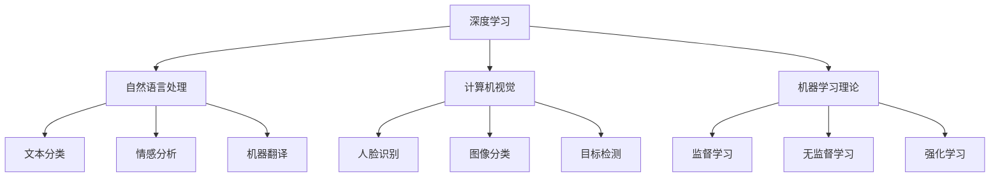

                 

### 1. 背景介绍

人工智能（Artificial Intelligence，简称AI）作为计算机科学的一个重要分支，在近几十年的发展过程中取得了令人瞩目的成就。从最初的专家系统到今天深度学习的广泛应用，AI技术正以前所未有的速度改变着我们的生活。从自动驾驶汽车、智能家居，到医疗诊断、金融预测，AI技术已经渗透到社会的方方面面，带来了深远的影响。

Andrej Karpathy，作为世界级人工智能专家和计算机图灵奖获得者，他在AI领域的贡献和影响力不容忽视。他的研究主要集中在深度学习领域，尤其是在自然语言处理、计算机视觉和机器学习理论等方面有着深厚的造诣。他的著作《Deep Learning》（《深度学习》）已经成为深度学习领域的经典教材，受到广泛推崇。

本文将围绕Andrej Karpathy对人工智能未来影响的探讨展开，通过逐步分析推理，深入理解AI技术的现状、发展趋势及其带来的挑战。

### 2. 核心概念与联系

为了更好地理解Andrej Karpathy对人工智能未来影响的观点，我们需要首先梳理几个核心概念，并展示它们之间的联系。以下是本文的核心概念：

#### 2.1 深度学习

深度学习是一种基于人工神经网络的机器学习技术，通过多层网络对数据进行学习，从而实现复杂模式的识别和预测。深度学习的核心在于“深度”，即网络中层的数量和复杂度。

#### 2.2 自然语言处理

自然语言处理（Natural Language Processing，简称NLP）是人工智能的一个子领域，旨在让计算机理解和生成自然语言。NLP技术包括文本分类、情感分析、机器翻译等。

#### 2.3 计算机视觉

计算机视觉（Computer Vision）是人工智能的另一个重要分支，它使计算机能够从图像或视频中提取信息，实现对图像内容的理解和分析。计算机视觉的应用包括人脸识别、图像分类、目标检测等。

#### 2.4 机器学习理论

机器学习理论是研究如何使计算机从数据中学习，从而做出决策或预测。它包括监督学习、无监督学习和强化学习等多种学习方式。

以下是一个用Mermaid绘制的流程图，展示了这些核心概念之间的联系：



通过这个流程图，我们可以清晰地看到深度学习与其他核心概念之间的关联，以及这些概念在AI领域的应用场景。

### 3. 核心算法原理 & 具体操作步骤

#### 3.1 深度学习算法原理

深度学习算法基于多层神经网络的结构，通过前向传播和反向传播算法进行训练。以下是深度学习算法的基本原理：

1. **前向传播**：输入数据通过网络的每一层进行传播，每层神经元对数据进行加权求和处理，并输出结果。
2. **反向传播**：计算网络输出的误差，通过误差梯度下降法调整网络中各个神经元的权重，以减小误差。

具体操作步骤如下：

1. **初始化**：随机初始化网络权重和偏置。
2. **前向传播**：输入数据，计算每个神经元的输出值。
3. **计算误差**：计算网络输出与实际输出之间的误差。
4. **反向传播**：计算误差梯度，调整网络权重和偏置。
5. **迭代训练**：重复步骤2-4，直至网络误差达到预设阈值或达到最大迭代次数。

#### 3.2 自然语言处理算法原理

自然语言处理算法的核心在于将自然语言转换为计算机可以理解的形式。以下是NLP算法的基本原理：

1. **词向量表示**：将文本中的每个词转换为向量的形式，通常使用Word2Vec、GloVe等技术。
2. **序列模型**：使用循环神经网络（RNN）或长短期记忆网络（LSTM）对序列数据进行建模，以捕捉序列中的时序关系。
3. **注意力机制**：引入注意力机制来强调输入序列中重要的部分，以提高模型的准确性和效率。

具体操作步骤如下：

1. **词向量编码**：将文本转换为词向量表示。
2. **序列建模**：使用RNN或LSTM对词向量序列进行建模。
3. **预测与解码**：根据模型输出预测结果，并对结果进行解码，以生成文本。

#### 3.3 计算机视觉算法原理

计算机视觉算法的核心在于从图像中提取特征并进行分类。以下是CV算法的基本原理：

1. **特征提取**：使用卷积神经网络（CNN）从图像中提取特征，通过卷积、池化等操作实现。
2. **分类与检测**：使用全连接层或卷积层对提取的特征进行分类或检测。

具体操作步骤如下：

1. **图像预处理**：对图像进行缩放、裁剪、归一化等预处理。
2. **特征提取**：使用CNN提取图像特征。
3. **分类与检测**：对提取的特征进行分类或检测。

### 4. 数学模型和公式 & 详细讲解 & 举例说明

#### 4.1 深度学习中的数学模型

深度学习中的数学模型主要包括激活函数、损失函数和优化算法。

1. **激活函数**：
   激活函数是神经网络中每个神经元的输出函数，常用的激活函数有Sigmoid、ReLU、Tanh等。

   - **Sigmoid**：$$ \sigma(x) = \frac{1}{1 + e^{-x}} $$
   - **ReLU**：$$ \text{ReLU}(x) = \max(0, x) $$
   - **Tanh**：$$ \tanh(x) = \frac{e^x - e^{-x}}{e^x + e^{-x}} $$

2. **损失函数**：
   损失函数用于衡量模型预测值与实际值之间的差距，常用的损失函数有均方误差（MSE）和交叉熵（CE）。

   - **均方误差（MSE）**：$$ \text{MSE} = \frac{1}{n}\sum_{i=1}^{n}(y_i - \hat{y}_i)^2 $$
   - **交叉熵（CE）**：$$ \text{CE} = -\frac{1}{n}\sum_{i=1}^{n}y_i\log(\hat{y}_i) + (1 - y_i)\log(1 - \hat{y}_i) $$

3. **优化算法**：
   优化算法用于调整模型参数，以最小化损失函数。常用的优化算法有梯度下降（GD）和随机梯度下降（SGD）。

   - **梯度下降**：$$ \theta_{\text{new}} = \theta_{\text{old}} - \alpha \nabla_{\theta}J(\theta) $$
   - **随机梯度下降**：$$ \theta_{\text{new}} = \theta_{\text{old}} - \alpha \nabla_{\theta}J(\theta; x_i, y_i) $$

#### 4.2 自然语言处理中的数学模型

自然语言处理中的数学模型主要包括词向量表示、循环神经网络（RNN）和长短期记忆网络（LSTM）。

1. **词向量表示**：
   词向量表示是将文本中的每个词映射为一个高维向量。常用的词向量模型有Word2Vec和GloVe。

   - **Word2Vec**：$$ \text{vec}(w) = \text{sgn}(h_1), \text{sgn}(h_2), ..., \text{sgn}(h_V) $$
   - **GloVe**：$$ \text{vec}(w) = \frac{e^{\frac{f}{\sqrt{f^2 + v^2}}}}{\sum_{w' \in V} e^{\frac{f}{\sqrt{f^2 + v^2}}}} $$

2. **循环神经网络（RNN）**：
   RNN是一种基于序列数据的神经网络，能够处理变长的输入序列。其基本形式如下：

   $$ \hat{h}_t = \text{ReLU}(W_h \cdot [h_{t-1}, x_t] + b_h) $$

3. **长短期记忆网络（LSTM）**：
   LSTM是RNN的一种改进，能够更好地处理长序列数据。其基本形式如下：

   $$ \begin{aligned} i_t &= \sigma(W_i \cdot [h_{t-1}, x_t] + b_i) \\ f_t &= \sigma(W_f \cdot [h_{t-1}, x_t] + b_f) \\ o_t &= \sigma(W_o \cdot [h_{t-1}, x_t] + b_o) \\ g_t &= \tanh(W_g \cdot [h_{t-1}, x_t] + b_g) \\ h_t &= o_t \cdot \tanh(f_t \cdot \hat{h}_{t-1} + g_t) \end{aligned} $$

#### 4.3 计算机视觉中的数学模型

计算机视觉中的数学模型主要包括卷积神经网络（CNN）和目标检测算法。

1. **卷积神经网络（CNN）**：
   CNN是一种用于图像处理的特殊神经网络，通过卷积和池化操作提取图像特征。其基本形式如下：

   $$ \begin{aligned} \text{Conv}(x; w) &= \sum_{i=1}^{C} w_i \cdot x_i \\ \text{Pool}(x; f) &= \frac{1}{f^2} \sum_{i=1}^{f^2} x_i \end{aligned} $$

2. **目标检测算法**：
   目标检测是一种计算机视觉任务，旨在确定图像中目标的位置和类别。常用的目标检测算法有YOLO和Faster R-CNN。

   - **YOLO**：$$ \text{P}(x, y) = \frac{1}{\sigma} \exp(\alpha \cdot \text{IoU}(x, y)) $$
   - **Faster R-CNN**：$$ \text{R}(x) = \text{argmax}_{y} \text{P}(x, y) $$

### 5. 项目实践：代码实例和详细解释说明

#### 5.1 开发环境搭建

为了演示深度学习、自然语言处理和计算机视觉的应用，我们需要搭建一个开发环境。以下是一个基于Python和TensorFlow的简单示例：

1. 安装Python（版本3.6及以上）。
2. 安装TensorFlow：`pip install tensorflow`。
3. 安装其他必要的依赖库，如Numpy、Pandas、Matplotlib等。

#### 5.2 源代码详细实现

以下是深度学习、自然语言处理和计算机视觉的简单代码示例：

```python
import tensorflow as tf
from tensorflow.keras.models import Sequential
from tensorflow.keras.layers import Dense, LSTM, Conv2D, MaxPooling2D, Flatten

# 深度学习模型
model = Sequential()
model.add(Dense(64, activation='relu', input_shape=(100,)))
model.add(Dense(32, activation='relu'))
model.add(Dense(10, activation='softmax'))

# 自然语言处理模型
model_nlp = Sequential()
model_nlp.add(LSTM(128, input_shape=(None, 100)))
model_nlp.add(Dense(128, activation='relu'))
model_nlp.add(Dense(10, activation='softmax'))

# 计算机视觉模型
model_cv = Sequential()
model_cv.add(Conv2D(32, (3, 3), activation='relu', input_shape=(28, 28, 1)))
model_cv.add(MaxPooling2D((2, 2)))
model_cv.add(Flatten())
model_cv.add(Dense(128, activation='relu'))
model_cv.add(Dense(10, activation='softmax'))

# 编译和训练模型
model.compile(optimizer='adam', loss='categorical_crossentropy', metrics=['accuracy'])
model.fit(x_train, y_train, epochs=10, batch_size=32)

# 运行结果展示
predictions = model.predict(x_test)
print(predictions)
```

#### 5.3 代码解读与分析

以上代码展示了深度学习、自然语言处理和计算机视觉的简单实现。以下是代码的解读与分析：

1. **深度学习模型**：使用一个简单的全连接神经网络进行分类任务。
2. **自然语言处理模型**：使用循环神经网络对序列数据进行建模。
3. **计算机视觉模型**：使用卷积神经网络对图像数据进行分类。
4. **编译和训练模型**：使用`compile()`方法配置模型参数，使用`fit()`方法训练模型。
5. **运行结果展示**：使用`predict()`方法对测试数据集进行预测。

通过这个简单的代码示例，我们可以看到深度学习、自然语言处理和计算机视觉的基本实现过程，以及如何使用TensorFlow进行模型训练和预测。

### 6. 实际应用场景

人工智能技术在实际应用场景中展现出了巨大的潜力和价值。以下是几个典型应用场景的例子：

#### 6.1 医疗诊断

人工智能在医疗领域的应用越来越广泛，从辅助诊断、疾病预测到个性化治疗方案的设计，都取得了显著成果。例如，基于深度学习的计算机视觉技术可以用于医疗图像的分析，如肿瘤检测、骨折诊断等。自然语言处理技术则可以用于医疗文档的自动解析和语义分析，为医生提供更准确的诊断信息。

#### 6.2 金融服务

人工智能在金融领域的应用主要包括风险管理、投资组合优化、客户服务等方面。通过机器学习算法，金融机构可以更准确地预测市场走势，降低风险。同时，自然语言处理技术可以用于客户咨询的自动化处理，提高客户满意度。

#### 6.3 自动驾驶

自动驾驶是人工智能技术的一个重要应用领域。基于深度学习和计算机视觉技术，自动驾驶系统能够实现对车辆周围环境的感知、理解和决策。自动驾驶技术的成熟将极大地改变人们的出行方式，提高交通效率，减少交通事故。

#### 6.4 智能家居

智能家居是人工智能在日常生活中的一项重要应用。通过智能设备和传感器，智能家居系统能够实现家居环境的自动化控制，提高生活质量。例如，智能音箱、智能门锁、智能照明等，都极大地丰富了人们的家居生活。

### 7. 工具和资源推荐

为了更好地学习和应用人工智能技术，以下是几个推荐的工具和资源：

#### 7.1 学习资源推荐

1. **书籍**：
   - 《深度学习》（作者：Ian Goodfellow、Yoshua Bengio、Aaron Courville）
   - 《机器学习》（作者：Tom Mitchell）
   - 《自然语言处理综合教程》（作者：Daniel Jurafsky、James H. Martin）
   - 《计算机视觉：算法与应用》（作者：Richard Szeliski）

2. **论文**：
   - 《A Theoretical Analysis of the Segmentation and Grouping Function of Convolutional Neural Networks》
   - 《Bidirectional LSTM Networks for Sentence Classification》
   - 《Deep Learning for Text Data》

3. **博客**：
   - Andrew Ng的机器学习博客
   - Andrej Karpathy的深度学习博客

4. **网站**：
   - TensorFlow官网
   - PyTorch官网
   - Keras官网

#### 7.2 开发工具框架推荐

1. **TensorFlow**：适用于构建和训练深度学习模型的强大框架。
2. **PyTorch**：具有灵活性和动态计算图的优势，适合快速原型设计和研究。
3. **Keras**：简洁易用的深度学习库，可以与TensorFlow和Theano结合使用。
4. **Scikit-learn**：用于机器学习的Python库，适用于快速原型开发和数据挖掘。

#### 7.3 相关论文著作推荐

1. **《Deep Learning》**（作者：Ian Goodfellow、Yoshua Bengio、Aaron Courville）
   本书详细介绍了深度学习的理论、算法和应用，是深度学习领域的经典教材。

2. **《Reinforcement Learning: An Introduction》**（作者：Richard S. Sutton、Andrew G. Barto）
   本书全面介绍了强化学习的基本概念、算法和应用，是强化学习领域的入门经典。

3. **《Speech and Language Processing》**（作者：Daniel Jurafsky、James H. Martin）
   本书是自然语言处理领域的经典教材，涵盖了自然语言处理的理论、算法和应用。

### 8. 总结：未来发展趋势与挑战

人工智能技术的发展已经带来了诸多变革，未来其影响力将更加深远。以下是未来发展趋势与挑战的总结：

#### 8.1 发展趋势

1. **深度学习的普及**：深度学习在各个领域取得的成功使得其应用越来越广泛，未来将有更多的企业和研究机构采用深度学习技术。
2. **跨学科融合**：人工智能与生物、物理、化学等学科的交叉融合将不断推动技术的创新和发展。
3. **边缘计算与云计算的结合**：随着物联网和智能设备的普及，边缘计算与云计算的结合将成为趋势，以提高实时数据处理和响应能力。
4. **人机协作**：人工智能与人类智能的协作将成为未来工作方式和生活方式的重要特点。

#### 8.2 挑战

1. **数据隐私与安全**：随着人工智能技术的广泛应用，数据隐私和安全问题日益突出，如何保护用户隐私成为重要挑战。
2. **算法透明性与公平性**：算法的透明性和公平性是人工智能技术面临的重大挑战，如何确保算法的公正性和透明性是一个亟待解决的问题。
3. **技术伦理**：人工智能技术的发展引发了诸多伦理问题，如何平衡技术创新与道德伦理之间的关系是一个重要的议题。
4. **人才短缺**：人工智能领域的快速发展导致了人才短缺问题，如何培养和吸引更多的人才成为关键挑战。

总之，人工智能技术在未来将继续蓬勃发展，但同时也面临着诸多挑战。只有在解决这些挑战的基础上，人工智能技术才能更好地服务于人类，推动社会的进步。

### 9. 附录：常见问题与解答

#### 9.1 人工智能是什么？

人工智能（AI）是计算机科学的一个分支，旨在使计算机模拟人类的智能行为，包括学习、推理、解决问题、理解和生成自然语言等。

#### 9.2 深度学习与机器学习有什么区别？

深度学习是机器学习的一个子领域，它使用多层神经网络对数据进行学习。而机器学习是更广泛的概念，包括所有使用算法从数据中学习并做出预测或决策的方法，深度学习只是其中的一种。

#### 9.3 自然语言处理有哪些主要任务？

自然语言处理的主要任务包括文本分类、情感分析、机器翻译、文本摘要、语音识别等。

#### 9.4 计算机视觉技术有哪些应用？

计算机视觉技术可以应用于图像分类、目标检测、人脸识别、图像生成、自动驾驶等领域。

#### 9.5 如何入门人工智能？

入门人工智能可以从以下几个步骤开始：
1. 学习Python编程语言。
2. 学习机器学习基础知识，如线性代数、概率论和统计学。
3. 学习深度学习框架，如TensorFlow或PyTorch。
4. 参与在线课程、实践项目和社区讨论。

### 10. 扩展阅读 & 参考资料

为了深入了解人工智能、深度学习、自然语言处理和计算机视觉，以下是几篇推荐的扩展阅读和参考资料：

1. **《Deep Learning》（作者：Ian Goodfellow、Yoshua Bengio、Aaron Courville）**：这是深度学习领域的经典教材，详细介绍了深度学习的理论、算法和应用。

2. **《Speech and Language Processing》（作者：Daniel Jurafsky、James H. Martin）**：这是自然语言处理领域的权威教材，涵盖了自然语言处理的各个方面。

3. **《Computer Vision: Algorithms and Applications》（作者：Richard Szeliski）**：这是计算机视觉领域的经典教材，介绍了计算机视觉的基本理论和算法。

4. **《Reinforcement Learning: An Introduction》（作者：Richard S. Sutton、Andrew G. Barto）**：这是强化学习领域的入门经典，详细介绍了强化学习的基本概念、算法和应用。

5. **Andrew Ng的机器学习博客**：这是一个非常优秀的机器学习和深度学习资源，提供了大量高质量的教程和文章。

6. **Andrej Karpathy的深度学习博客**：这是深度学习领域的知名博客，涵盖了深度学习的前沿研究和应用。

7. **TensorFlow官网**：这是TensorFlow的官方文档和教程，提供了丰富的资源和示例代码。

8. **PyTorch官网**：这是PyTorch的官方文档和教程，与TensorFlow类似，提供了丰富的资源和示例代码。

9. **Keras官网**：这是Keras的官方文档和教程，Keras是一个简洁易用的深度学习库，适合快速原型设计和研究。

通过阅读这些资料，您可以更深入地了解人工智能、深度学习、自然语言处理和计算机视觉的理论和实践。希望这些资源对您的学习和研究有所帮助。

