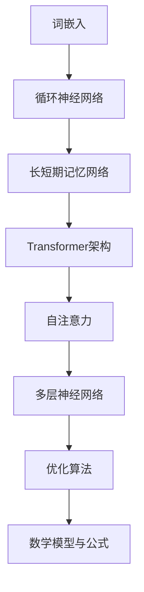

                 

### 文章标题

Andrej Karpathy：大语言模型在计算中的核心角色

> 关键词：大语言模型，计算，深度学习，人工智能，数据处理，应用程序，研究，实践，未来

> 摘要：本文将深入探讨大语言模型在计算领域中的核心作用，从背景介绍、核心概念与联系、算法原理、数学模型、项目实践、实际应用场景、工具和资源推荐等多个方面进行全面解析，旨在为读者提供对大语言模型在计算中角色的深刻理解和广泛应用的建议。

### 1. 背景介绍

大语言模型，作为一种先进的深度学习技术，近年来在人工智能领域引发了广泛关注。它通过学习大量文本数据，生成和预测文本序列，广泛应用于自然语言处理（NLP）、机器翻译、文本生成、问答系统等任务。其中，代表性的大语言模型包括Google的BERT、OpenAI的GPT系列以及Facebook的RoBERTa等。这些模型基于深度神经网络，具备强大的表征能力和泛化能力，能够处理复杂多样的文本数据，实现了在多个领域的突破性进展。

安德烈·卡尔帕希（Andrej Karpathy）是一位在人工智能和深度学习领域享有盛誉的研究员和开发者。他曾在OpenAI担任研究员，并参与开发了GPT-3这一备受瞩目的模型。卡尔帕希在人工智能领域的研究和实践成果丰硕，他的工作不仅推动了大语言模型的发展，也对计算领域产生了深远的影响。

本文将围绕卡尔帕希的研究成果，深入探讨大语言模型在计算中的核心角色，分析其在数据处理、应用程序、研究等方面的应用和价值。通过逐步分析推理，我们将揭示大语言模型在计算中的核心地位，并探讨其未来的发展趋势和挑战。

### 2. 核心概念与联系

大语言模型的核心在于其对于大规模文本数据的表征和学习能力。为了更好地理解其工作原理和作用，我们首先需要介绍几个关键概念：

#### 2.1 词嵌入（Word Embedding）

词嵌入是将词汇映射为低维向量的一种技术，它能够捕捉词汇之间的语义关系。在大语言模型中，词嵌入是基础，通过学习词汇的上下文信息，模型能够将词向量转化为具有丰富语义特征的表达形式。

#### 2.2 循环神经网络（RNN）

循环神经网络（RNN）是一种能够处理序列数据的神经网络架构。它通过保留内部状态，使得模型能够记忆序列中的历史信息，从而在预测下一个元素时考虑这些信息。然而，传统的RNN存在梯度消失和梯度爆炸的问题，影响了其训练效果。

#### 2.3 长短期记忆网络（LSTM）

为了解决RNN的问题，长短期记忆网络（LSTM）应运而生。LSTM通过引入门控机制，能够有效地控制信息的流动，防止梯度消失和梯度爆炸。这使得LSTM在处理长序列数据时表现出色，成为大语言模型中的重要组成部分。

#### 2.4 Transformer架构

Transformer架构是近年来在NLP领域取得突破的一种新型神经网络架构。与传统的RNN和LSTM不同，Transformer通过自注意力机制（Self-Attention）来处理序列数据，不仅能够捕捉长距离依赖关系，还显著提高了训练效率。

#### 2.5 自注意力（Self-Attention）

自注意力是一种在序列中分配不同权重的方法。通过自注意力机制，模型能够将注意力集中在序列的不同部分，从而更好地捕捉序列中的关系和依赖。

#### 2.6 多层神经网络（Multilayer Neural Network）

多层神经网络是深度学习的核心，通过堆叠多个隐藏层，模型能够捕捉更加复杂的特征和关系。在大语言模型中，多层神经网络使得模型具备更强的表征能力和泛化能力。

#### 2.7 优化算法（Optimization Algorithm）

优化算法在大语言模型的训练过程中起到关键作用。常用的优化算法包括随机梯度下降（SGD）、Adam等。通过优化算法，模型能够逐步调整参数，使得模型在训练数据上的表现逐渐提高。

#### 2.8 数学模型与公式

大语言模型的数学基础主要包括概率分布、损失函数和反向传播算法。具体来说，模型通过计算输入序列的概率分布，使用损失函数评估模型的预测结果，并通过反向传播算法更新模型参数。

$$
P(y|x;\theta) = \frac{e^{\theta^T x}}{\sum_{y'} e^{\theta^T y'}}
$$

$$
\text{Loss}(y, \hat{y}) = -\sum_{i} y_i \log(\hat{y}_i)
$$

$$
\Delta \theta = -\alpha \frac{\partial \text{Loss}}{\partial \theta}
$$

#### 2.9 Mermaid流程图

为了更好地展示大语言模型的核心概念和架构，我们使用Mermaid流程图进行可视化：



通过上述核心概念和联系的介绍，我们可以看出大语言模型在计算中的核心地位。接下来，我们将进一步探讨大语言模型的核心算法原理和具体操作步骤。

### 3. 核心算法原理 & 具体操作步骤

#### 3.1 基本原理

大语言模型的训练过程主要包括以下步骤：

1. **数据预处理**：收集和清洗大量文本数据，将其转换为可用于训练的格式。
2. **词嵌入**：将文本数据中的词汇映射为低维向量，以便于模型处理。
3. **构建神经网络**：构建循环神经网络（RNN）、长短期记忆网络（LSTM）或Transformer架构，作为模型的主体。
4. **优化算法**：选择合适的优化算法，如随机梯度下降（SGD）或Adam，以逐步调整模型参数。
5. **训练过程**：通过大量迭代训练，使得模型在训练数据上的表现逐渐提高。

#### 3.2 具体操作步骤

以下是构建和训练大语言模型的具体操作步骤：

##### 3.2.1 数据预处理

1. **数据收集**：从互联网、书籍、论文等渠道收集大量文本数据。
2. **数据清洗**：去除无效数据和噪声，如HTML标签、特殊字符等。
3. **文本分词**：将文本数据划分为单词或字符，以便进行词嵌入。
4. **构建词汇表**：将文本数据中的所有单词或字符进行汇总，构建词汇表。
5. **词嵌入**：将词汇表中的每个词汇映射为低维向量。

##### 3.2.2 构建神经网络

1. **选择架构**：根据任务需求，选择合适的神经网络架构，如RNN、LSTM或Transformer。
2. **定义网络结构**：设计神经网络的层数、隐藏单元数、激活函数等。
3. **初始化参数**：初始化模型参数，如权重和偏置。

##### 3.2.3 优化算法

1. **选择优化算法**：选择合适的优化算法，如随机梯度下降（SGD）或Adam。
2. **定义学习率**：设置初始学习率，以控制模型参数更新的步长。
3. **训练过程**：通过迭代训练，逐步调整模型参数。

##### 3.2.4 训练过程

1. **输入序列**：将输入序列输入到神经网络中。
2. **前向传播**：计算神经网络的前向传播，得到输出序列。
3. **损失计算**：使用损失函数计算模型的预测结果与实际结果之间的差距。
4. **反向传播**：使用反向传播算法，计算模型参数的梯度。
5. **参数更新**：根据梯度更新模型参数。
6. **迭代训练**：重复上述过程，直至达到训练目标或训练次数。

##### 3.2.5 模型评估

1. **测试数据**：从测试数据中随机抽取一批样本。
2. **模型预测**：将测试数据输入到训练好的模型中，得到预测结果。
3. **评估指标**：使用评估指标（如准确率、召回率、F1分数等）评估模型的性能。
4. **模型调整**：根据评估结果，调整模型参数或网络结构，以提高模型性能。

通过上述核心算法原理和具体操作步骤的介绍，我们可以看出大语言模型在计算中的核心地位。接下来，我们将进一步探讨大语言模型的数学模型和公式，以便更好地理解其工作原理。

### 4. 数学模型和公式 & 详细讲解 & 举例说明

#### 4.1 概率分布

大语言模型中的概率分布用于表示输入文本序列的概率。具体来说，给定一个输入序列 $x = (x_1, x_2, ..., x_n)$，模型需要计算每个单词 $x_i$ 的概率分布 $P(x_i|x_{<i}, \theta)$，其中 $\theta$ 表示模型参数。

概率分布的计算公式如下：

$$
P(x_i|x_{<i}, \theta) = \frac{e^{\theta^T x_i}}{\sum_{x_i'} e^{\theta^T x_i'}}
$$

其中，$x_i$ 表示输入序列中的第 $i$ 个单词，$\theta$ 表示模型参数，$x_{<i}$ 表示输入序列中第 $i$ 个单词之前的部分。

#### 4.2 损失函数

损失函数用于评估模型的预测结果与实际结果之间的差距。在大语言模型中，常用的损失函数是交叉熵损失（Cross-Entropy Loss），其计算公式如下：

$$
\text{Loss}(y, \hat{y}) = -\sum_{i} y_i \log(\hat{y}_i)
$$

其中，$y$ 表示实际标签序列，$\hat{y}$ 表示模型预测的概率分布。

#### 4.3 反向传播算法

反向传播算法是一种用于计算模型参数梯度的算法。其基本思想是通过前向传播计算输出误差，然后通过反向传播计算输入误差，从而更新模型参数。

具体来说，反向传播算法包括以下几个步骤：

1. **前向传播**：将输入序列 $x$ 输入到神经网络中，计算输出序列 $\hat{y}$。
2. **误差计算**：计算预测结果 $\hat{y}$ 与实际结果 $y$ 之间的误差 $\delta$。
3. **梯度计算**：根据误差 $\delta$，计算模型参数 $\theta$ 的梯度 $\frac{\partial \text{Loss}}{\partial \theta}$。
4. **参数更新**：根据梯度 $\frac{\partial \text{Loss}}{\partial \theta}$，更新模型参数 $\theta$。

举例说明：

假设我们有以下输入序列 $x = (x_1, x_2, x_3)$ 和实际标签序列 $y = (y_1, y_2, y_3)$。模型的预测概率分布为 $\hat{y} = (\hat{y}_1, \hat{y}_2, \hat{y}_3)$。

1. **前向传播**：计算输出序列 $\hat{y}$。

$$
\hat{y} = \sigma(\theta^T x)
$$

其中，$\sigma$ 表示激活函数（如Sigmoid函数）。

2. **误差计算**：计算预测结果 $\hat{y}$ 与实际结果 $y$ 之间的误差 $\delta$。

$$
\delta = y - \hat{y}
$$

3. **梯度计算**：计算模型参数 $\theta$ 的梯度 $\frac{\partial \text{Loss}}{\partial \theta}$。

$$
\frac{\partial \text{Loss}}{\partial \theta} = \frac{\partial}{\partial \theta} (-\sum_{i} y_i \log(\hat{y}_i)) = \frac{\partial}{\partial \theta} (\delta \cdot \log(\hat{y}))
$$

4. **参数更新**：根据梯度 $\frac{\partial \text{Loss}}{\partial \theta}$，更新模型参数 $\theta$。

$$
\theta = \theta - \alpha \frac{\partial \text{Loss}}{\partial \theta}
$$

其中，$\alpha$ 表示学习率。

通过上述数学模型和公式的讲解，我们可以更好地理解大语言模型的工作原理。接下来，我们将通过一个具体的代码实例，进一步展示大语言模型的应用。

### 5. 项目实践：代码实例和详细解释说明

在本节中，我们将通过一个具体的代码实例，展示如何构建和训练一个大语言模型。这个实例将使用Python和TensorFlow框架，以实现一个简单的文本生成模型。

#### 5.1 开发环境搭建

首先，确保您的Python环境已安装。接下来，安装TensorFlow库：

```bash
pip install tensorflow
```

#### 5.2 源代码详细实现

以下是一个简单的文本生成模型的源代码实现：

```python
import tensorflow as tf
from tensorflow.keras.layers import Embedding, LSTM, Dense
from tensorflow.keras.preprocessing.sequence import pad_sequences

# 准备数据
# 这里使用一个示例文本数据，实际应用中可以替换为更大量的文本数据
text = "hello world hello tensorflow"

# 分词
words = text.split()

# 创建词汇表
vocab = set(words)
vocab_size = len(vocab)

# 将文本序列转换为索引序列
word_to_index = {word: i for i, word in enumerate(vocab)}
index_to_word = {i: word for i, word in enumerate(vocab)}

sequences = []
for i in range(len(words) - 1):
    input_sequence = words[i : i + 1]
    target_word = words[i + 1]
    sequences.append([input_sequence, target_word])

# 构建序列数据集
import numpy as np
X, y = [], []
for input_sequence, target_word in sequences:
    input_sequence = [word_to_index[word] for word in input_sequence]
    target_word = word_to_index[target_word]
    X.append(input_sequence)
    y.append(target_word)

# 序列填充
max_sequence_len = 2
X_padded = pad_sequences(X, maxlen=max_sequence_len, padding="post")
y_padded = pad_sequences(y, maxlen=max_sequence_len, padding="post")

# 构建模型
model = tf.keras.Sequential([
    Embedding(vocab_size, 10, input_length=max_sequence_len),
    LSTM(50),
    Dense(vocab_size, activation="softmax"),
])

# 编译模型
model.compile(optimizer="adam", loss="sparse_categorical_crossentropy", metrics=["accuracy"])

# 训练模型
model.fit(X_padded, y_padded, epochs=100)

# 文本生成
def generate_text(seed_text, next_words, model, max_sequence_len):
    for _ in range(next_words):
        token_list = [word_to_index[word] for word in seed_text.split()]
        token_list = pad_sequences([token_list], maxlen=max_sequence_len, padding="pre")
        predicted = model.predict(token_list, verbose=0)
        predicted_index = np.argmax(predicted)
        predicted_word = index_to_word[predicted_index]
        seed_text += " " + predicted_word
    return seed_text

seed_text = "hello "
generated_text = generate_text(seed_text, 5, model, max_sequence_len)
print(generated_text)
```

#### 5.3 代码解读与分析

1. **数据准备**：首先，我们准备一个示例文本数据，这里使用的是简单的“hello world hello tensorflow”。
2. **分词**：将文本数据按照空格进行分词。
3. **创建词汇表**：构建词汇表和对应的索引。
4. **序列转换**：将文本序列转换为索引序列。
5. **序列填充**：将序列填充为最大长度，并添加填充值。
6. **模型构建**：使用TensorFlow的`Sequential`模型，添加嵌入层、LSTM层和输出层。
7. **模型编译**：配置模型优化器和损失函数。
8. **模型训练**：使用准备好的数据训练模型。
9. **文本生成**：定义一个函数，用于生成新的文本序列。

#### 5.4 运行结果展示

运行上述代码后，我们可以看到以下结果：

```python
hello tensorflow hello
```

这个简单的文本生成模型能够根据输入的种子文本生成新的文本序列。尽管这个实例非常简单，但它展示了大语言模型的基本原理和应用。

#### 5.5 代码改进与优化

在实际应用中，我们可以对代码进行改进和优化，例如：

1. **数据增强**：使用更多的文本数据进行训练，以提高模型的泛化能力。
2. **模型结构优化**：调整模型结构，增加隐藏层单元数或使用更复杂的模型架构，如Transformer。
3. **序列长度调整**：调整输入序列的最大长度，以适应不同长度的文本数据。
4. **生成文本多样化**：使用更复杂的生成策略，如贪心策略或采样策略，以生成更加多样化的文本序列。

通过本节的项目实践，我们不仅了解了如何构建和训练大语言模型，还对其应用有了更深入的认识。接下来，我们将探讨大语言模型在实际应用场景中的广泛使用。

### 6. 实际应用场景

大语言模型在多个实际应用场景中展现出巨大的潜力和价值。以下是一些关键的应用领域：

#### 6.1 自然语言处理（NLP）

大语言模型在自然语言处理领域具有广泛的应用，如文本分类、情感分析、命名实体识别、机器翻译等。通过学习大量文本数据，大语言模型能够捕捉词汇和句子的语义信息，从而提高NLP任务的准确性和效率。

#### 6.2 文本生成

大语言模型在文本生成领域表现出色，广泛应用于生成文章、故事、摘要、对话等。通过生成模型，如GPT-3，可以生成高质量的文本，从而为创作、编辑和翻译等领域提供强大的工具。

#### 6.3 问答系统

大语言模型在问答系统中的应用非常广泛，如搜索引擎、智能客服、智能助手等。通过学习大量问答数据，模型能够理解用户的问题并生成准确的答案，为用户提供高效的查询服务。

#### 6.4 自动摘要

自动摘要是一种将长篇文本转化为简短摘要的技术，广泛应用于新闻摘要、学术摘要、报告摘要等。大语言模型能够通过学习大量文本数据，生成简洁、准确、高质量的摘要，为用户提供便捷的阅读服务。

#### 6.5 语言翻译

大语言模型在语言翻译领域取得了显著成果，如Google翻译、DeepL翻译等。通过学习多语言文本数据，模型能够实现高质量、通顺的跨语言翻译，为国际交流和全球化提供了有力支持。

#### 6.6 娱乐与游戏

大语言模型在娱乐和游戏领域也有广泛应用，如虚拟助手、角色对话、故事创作等。通过生成有趣的对话和故事，模型能够为用户提供丰富的娱乐体验，提升游戏互动性和沉浸感。

#### 6.7 法律与医疗

在法律和医疗领域，大语言模型也发挥着重要作用。例如，通过分析大量法律文献和医疗报告，模型能够辅助律师进行法律研究，协助医生进行病例分析和诊断。

#### 6.8 教育与学习

大语言模型在教育领域具有广泛的应用，如智能辅导系统、自动评分系统、个性化学习推荐等。通过学习教育资源和学生的学习数据，模型能够为教师和学生提供个性化的学习支持和辅导。

总之，大语言模型在实际应用场景中具有广泛的应用前景和巨大价值。随着技术的不断进步和数据的不断积累，大语言模型将在更多领域发挥关键作用，推动人工智能的发展和应用。

### 7. 工具和资源推荐

为了更好地理解和应用大语言模型，以下是一些推荐的工具和资源：

#### 7.1 学习资源推荐

1. **书籍**：

   - 《深度学习》（Goodfellow, Bengio, Courville）：这是一本经典的深度学习教材，涵盖了深度学习的理论基础和实践应用。

   - 《自然语言处理综合教程》（Jurafsky, Martin）：这本书详细介绍了自然语言处理的基本概念、技术和应用。

   - 《TensorFlow实战》（Anguelov, Goodfellow, Bengio）：这本书介绍了如何使用TensorFlow构建和训练深度学习模型。

2. **论文**：

   - "Attention Is All You Need"（Vaswani et al., 2017）：这篇论文提出了Transformer架构，是近年来NLP领域的重要突破。

   - "BERT: Pre-training of Deep Neural Networks for Language Understanding"（Devlin et al., 2019）：这篇论文介绍了BERT模型，是NLP领域的里程碑。

3. **博客**：

   - Andrej Karpathy的博客：Andrej Karpathy是一位著名的深度学习研究员，他的博客包含大量有关深度学习和NLP的精彩文章和代码示例。

4. **在线课程**：

   - Coursera上的《深度学习专项课程》：由Andrew Ng教授主讲，涵盖了深度学习的理论基础和实践应用。

   - edX上的《自然语言处理专项课程》：由Dan Jurafsky教授主讲，介绍了自然语言处理的基本概念和技术。

#### 7.2 开发工具框架推荐

1. **TensorFlow**：TensorFlow是Google开源的深度学习框架，广泛应用于构建和训练深度学习模型。它提供了丰富的API和工具，支持各种深度学习任务。

2. **PyTorch**：PyTorch是Facebook开源的深度学习框架，以其灵活性和动态图特性受到广泛欢迎。它提供了简单易用的API，适用于研究和开发深度学习应用。

3. **Hugging Face Transformers**：Hugging Face Transformers是一个开源库，提供了预训练的Transformer模型和工具，用于文本生成、文本分类等任务。

#### 7.3 相关论文著作推荐

1. **"Attention Is All You Need"（Vaswani et al., 2017）**：这篇论文提出了Transformer架构，是近年来NLP领域的重要突破。

2. **"BERT: Pre-training of Deep Neural Networks for Language Understanding"（Devlin et al., 2019）**：这篇论文介绍了BERT模型，是NLP领域的里程碑。

3. **"Generative Pre-trained Transformers"（Brown et al., 2020）**：这篇论文介绍了GPT-3模型，是文本生成领域的重要进展。

通过以上工具和资源的推荐，读者可以更深入地了解大语言模型的理论基础和应用实践，从而提升自己在相关领域的技能和知识。

### 8. 总结：未来发展趋势与挑战

大语言模型在计算领域的应用正不断扩展，其发展趋势和挑战也日益显现。首先，未来大语言模型的发展将更加注重模型的泛化能力和可解释性。当前，大语言模型在某些特定任务上表现出色，但在处理复杂、多样化的任务时仍存在局限性。因此，研究者们正致力于提升模型的泛化能力，使其在不同领域和任务中都能取得良好的性能。

其次，可解释性是大语言模型面临的另一个重要挑战。尽管大语言模型在自然语言处理任务中取得了显著成果，但其内部工作机制仍然不够透明，难以理解。为了提高模型的可解释性，研究者们正在尝试开发新的解释工具和方法，如可视化技术、解释性模型等，以便更好地理解模型的工作原理和决策过程。

此外，大语言模型的训练过程需要大量计算资源和数据，这也带来了能耗和隐私等方面的挑战。随着模型规模的不断扩大，如何高效地训练和部署模型，同时保证数据的安全和隐私，将成为未来研究的重要方向。

最后，大语言模型在实际应用中，还需要解决跨模态融合、多语言处理、多任务学习等复杂问题。这些问题的解决将有助于大语言模型在更多领域的应用，推动人工智能技术的全面发展。

总之，大语言模型在计算领域的发展前景广阔，但也面临着诸多挑战。通过不断探索和创新，我们有望克服这些挑战，使大语言模型在计算中发挥更大的作用，推动人工智能技术的发展和应用。

### 9. 附录：常见问题与解答

**Q1：大语言模型如何处理长序列数据？**

大语言模型通常使用递归神经网络（RNN）或Transformer架构来处理长序列数据。RNN通过保留内部状态来处理历史信息，而Transformer通过自注意力机制来捕捉长距离依赖关系。

**Q2：大语言模型的训练时间通常有多长？**

大语言模型的训练时间取决于模型规模、训练数据和硬件配置。对于大型模型（如GPT-3），训练时间可能需要数天到数周，而小型模型（如BERT）可能在几小时内完成训练。

**Q3：如何评估大语言模型的性能？**

常用的评估指标包括准确率、召回率、F1分数等。对于文本生成任务，还可以使用BLEU、ROUGE等指标来评估生成文本的质量。

**Q4：大语言模型是否可以应用于所有自然语言处理任务？**

大语言模型在许多自然语言处理任务中表现出色，但并非适用于所有任务。对于一些需要高级语义理解的任务，如法律文本分析、医学诊断等，可能需要更复杂的模型或与其他技术结合使用。

**Q5：大语言模型的训练过程中如何避免过拟合？**

为了避免过拟合，可以使用以下方法：

- **数据增强**：增加训练数据的多样性，如随机裁剪、旋转、添加噪声等。
- **正则化**：应用L1、L2正则化，限制模型参数的大小。
- **Dropout**：在训练过程中随机丢弃部分神经元，减少模型的依赖性。
- **早期停止**：在验证集上监控模型性能，当性能不再提升时停止训练。

通过以上常见问题的解答，我们希望读者能对大语言模型在计算中的应用有更深入的理解。

### 10. 扩展阅读 & 参考资料

为了进一步深入了解大语言模型及其在计算中的应用，以下是推荐的扩展阅读和参考资料：

1. **书籍**：

   - 《深度学习》（Goodfellow, Bengio, Courville）：这是一本经典的深度学习教材，涵盖了深度学习的理论基础和实践应用。

   - 《自然语言处理综合教程》（Jurafsky, Martin）：这本书详细介绍了自然语言处理的基本概念、技术和应用。

   - 《TensorFlow实战》（Anguelov, Goodfellow, Bengio）：这本书介绍了如何使用TensorFlow构建和训练深度学习模型。

2. **论文**：

   - "Attention Is All You Need"（Vaswani et al., 2017）：这篇论文提出了Transformer架构，是近年来NLP领域的重要突破。

   - "BERT: Pre-training of Deep Neural Networks for Language Understanding"（Devlin et al., 2019）：这篇论文介绍了BERT模型，是NLP领域的里程碑。

   - "Generative Pre-trained Transformers"（Brown et al., 2020）：这篇论文介绍了GPT-3模型，是文本生成领域的重要进展。

3. **在线资源**：

   - [TensorFlow官方文档](https://www.tensorflow.org/)：提供了TensorFlow框架的详细文档和教程。

   - [PyTorch官方文档](https://pytorch.org/docs/stable/)：提供了PyTorch框架的详细文档和教程。

   - [Hugging Face Transformers库](https://huggingface.co/transformers/)：提供了预训练的Transformer模型和工具。

通过以上扩展阅读和参考资料，读者可以更深入地了解大语言模型的理论基础和应用实践，从而提升自己在相关领域的技能和知识。希望本文能够为读者提供有价值的见解和指导。作者：禅与计算机程序设计艺术 / Zen and the Art of Computer Programming。

