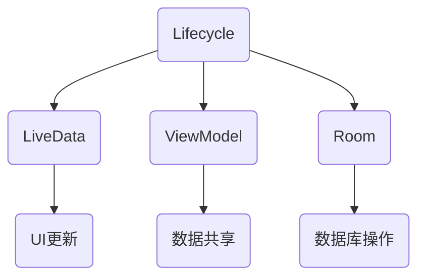

                 

### 背景介绍

Android Jetpack 是Google推出的一套现代Android开发库，旨在帮助开发者构建更稳定、更易于维护的应用程序。随着Android系统的不断更新和功能的增加，开发者面临着越来越复杂的开发环境和挑战。Android Jetpack组件库的出现，正是为了解决这些问题，提升Android开发的效率和体验。

在Android开发的历史长河中，开发者面临着许多挑战。首先，开发环境复杂，不同的API版本和设备类型增加了开发的难度。其次，代码的可维护性和复用性差，导致项目的可扩展性和稳定性受到影响。此外，性能优化和测试也是Android开发中的重要难题。这些问题不仅增加了开发成本，还延长了开发周期，降低了开发效率。

为了应对这些挑战，Google推出了Android Jetpack。Jetpack提供了多种组件，包括Lifecycle、LiveData、ViewModel、Room等，这些组件协同工作，帮助开发者解决常见的问题，提高开发效率和应用程序的质量。

Jetpack组件库的设计原则主要包括以下几个方面：

1. **模块化**：Jetpack组件库采用模块化设计，每个组件都有明确的功能和职责，开发者可以根据需求选择合适的组件进行集成。
2. **向后兼容**：Jetpack组件库在保证功能的同时，还保持了与旧版本的向后兼容性，使得开发者可以逐步迁移到新组件，而无需担心兼容性问题。
3. **易用性**：Jetpack组件库提供了简单的API和清晰的文档，帮助开发者快速上手并使用这些组件。
4. **稳定性**：Jetpack组件库经过严格的测试和优化，确保了应用程序的稳定性和性能。

通过Android Jetpack组件库，开发者可以更加专注于业务逻辑的实现，而无需花费大量时间来解决常见的问题。这大大提高了开发效率，缩短了项目周期，同时也提升了应用程序的质量和用户体验。

总之，Android Jetpack组件库的出现，为Android开发带来了一场革命，使得开发者能够更加高效地构建高质量的应用程序。在接下来的部分，我们将详细探讨Jetpack的核心组件及其应用，帮助读者更好地理解和利用这些强大的工具。

## 2. 核心概念与联系

### 核心概念

Android Jetpack组件库中的核心概念主要包括Lifecycle、LiveData、ViewModel和Room等。这些组件相互关联，共同构成了Android开发的基石。以下是对这些核心概念的详细解释：

#### Lifecycle

Lifecycle是一个用于监听Activity或Fragment生命周期事件的组件。它通过监听生命周期回调，如`onCreate()`、`onStart()`、`onResume()`等，帮助开发者更好地管理和控制Activity或Fragment的状态。Lifecycle不仅可以用于简单的生命周期管理，还可以与其他Jetpack组件如LiveData和ViewModel结合使用，实现复杂的数据管理和状态同步。

#### LiveData

LiveData是一个用于在数据发生变化时自动更新UI的组件。它基于观察者模式，当数据源发生变化时，会自动通知观察者进行更新。LiveData常用于实现数据绑定，使得数据和UI保持同步，避免了传统的手动更新UI的繁琐过程。

#### ViewModel

ViewModel是一个用于在Activity或Fragment生命周期之间保存和共享数据的组件。它负责存储和管理与界面相关的数据，并确保在界面旋转或配置更改时数据不会丢失。ViewModel与Lifecycle紧密协作，通过`LifecycleOwner`接口接收生命周期事件，确保数据更新与界面状态保持同步。

#### Room

Room是一个基于SQLite的持久层库，它提供了更加便捷和安全的数据库操作接口。Room通过编译时的注解处理，确保SQL语句的正确性和性能优化。Room支持数据观察、事务处理、数据库迁移等功能，使得数据库操作更加简单和可靠。

### Mermaid 流程图

以下是一个简单的Mermaid流程图，展示了这些核心组件之间的联系和交互：



在这个流程图中，Lifecycle作为核心组件，连接了LiveData、ViewModel和Room，实现了生命周期管理、数据更新和数据库操作的功能。UI更新、数据共享和数据库操作则通过相应的组件完成，确保了应用程序的稳定性和性能。

### 关系分析

- **Lifecycle**：作为生命周期管理的基础组件，Lifecycle为LiveData、ViewModel和Room提供了生命周期事件监听，确保组件在正确的时机进行数据更新和状态管理。
- **LiveData**：LiveData与Lifecycle紧密协作，通过监听生命周期事件，实现了数据变化的自动通知和UI更新，简化了数据绑定过程。
- **ViewModel**：ViewModel与Lifecycle和LiveData结合，实现了在Activity或Fragment生命周期之间保存和共享数据的功能，避免了配置更改时的数据丢失。
- **Room**：Room作为数据库操作组件，通过注解处理和编译时检查，确保了数据库操作的正确性和性能，与Lifecycle和LiveData结合，实现了数据的持久化和实时更新。

通过这些核心组件的协同工作，Android Jetpack组件库为开发者提供了一套完整且高效的开发框架，使得应用程序的构建更加简单、稳定和可靠。

## 3. 核心算法原理 & 具体操作步骤

### LiveData

LiveData是一个关键组件，用于在数据变化时自动更新UI。其核心原理基于观察者模式，当数据源发生变化时，LiveData会通知所有已注册的观察者，使得UI能够及时更新。

#### 具体操作步骤：

1. **创建数据源**：首先，我们需要创建一个数据源，通常使用一个不可变的数据类，如`User`类。

    ```java
    public class User {
        private String name;
        private int age;

        // 构造函数、getter和setter方法
    }
    ```

2. **创建LiveData实例**：接下来，我们创建一个LiveData实例，并将其与数据源绑定。

    ```java
    public class UserRepository {
        private MutableLiveData<User> userLiveData = new MutableLiveData<>();

        public void setUser(User user) {
            userLiveData.setValue(user);
        }

        public LiveData<User> getUserLiveData() {
            return userLiveData;
        }
    }
    ```

    在这个例子中，我们使用`MutableLiveData`，它是一个可变的LiveData实现，可以用来存储和更新数据。

3. **绑定LiveData到UI**：在Activity或Fragment中，我们通过绑定LiveData到UI，实现数据变化的自动更新。

    ```java
    public class MainActivity extends AppCompatActivity {
        private UserRepository userRepository;
        private LiveData<User> userLiveData;

        @Override
        protected void onCreate(Bundle savedInstanceState) {
            super.onCreate(savedInstanceState);
            setContentView(R.layout.activity_main);

            userRepository = new UserRepository();
            userLiveData = userRepository.getUserLiveData();

            // 注册观察者
            userLiveData.observe(this, user -> {
                // 更新UI
                TextView nameTextView = findViewById(R.id.nameTextView);
                TextView ageTextView = findViewById(R.id.ageTextView);
                nameTextView.setText(user.getName());
                ageTextView.setText(String.valueOf(user.getAge()));
            });
        }
    }
    ```

    在这里，我们使用`observe`方法注册了一个观察者，当数据源发生变化时，回调函数会执行，进而更新UI。

4. **更新数据源**：当数据源发生变化时，我们可以通过setValue方法更新LiveData。

    ```java
    userRepository.setUser(new User("Alice", 30));
    ```

    这将触发LiveData的通知机制，进而更新UI。

### ViewModel

ViewModel用于在Activity或Fragment生命周期之间保存和共享数据。其核心原理是利用LifecycleOwner接口监听生命周期事件，确保在适当的时机保存和恢复数据。

#### 具体操作步骤：

1. **创建ViewModel**：首先，我们创建一个ViewModel，并将其与数据源绑定。

    ```java
    public class UserViewModel extends ViewModel {
        private MutableLiveData<User> userLiveData = new MutableLiveData<>();

        public LiveData<User> getUserLiveData() {
            return userLiveData;
        }

        public void setUser(User user) {
            userLiveData.setValue(user);
        }
    }
    ```

2. **绑定ViewModel到Activity**：在Activity中，我们使用`android:exported="true"`属性将ViewModel绑定到Activity。

    ```xml
    <application>
        <activity android:name=".MainActivity"
            android:exported="true">
            <intent-filter>
                <action android:name="android.intent.action.MAIN" />
                <category android:name="android.intent.category.LAUNCHER" />
            </intent-filter>
        </activity>
        <ViewModel
            android:name="com.example.androidViewModel.UserViewModel"
            android:exported="true" />
    </application>
    ```

3. **在Activity中使用ViewModel**：在Activity中，我们通过ViewModel获取数据，并在数据变化时更新UI。

    ```java
    public class MainActivity extends AppCompatActivity {
        private UserViewModel userViewModel;

        @Override
        protected void onCreate(Bundle savedInstanceState) {
            super.onCreate(savedInstanceState);
            setContentView(R.layout.activity_main);

            userViewModel = new ViewModelProviders.of(this).get(UserViewModel.class);

            // 注册观察者
            userViewModel.getUserLiveData().observe(this, user -> {
                // 更新UI
                TextView nameTextView = findViewById(R.id.nameTextView);
                TextView ageTextView = findViewById(R.id.ageTextView);
                nameTextView.setText(user.getName());
                ageTextView.setText(String.valueOf(user.getAge()));
            });
        }
    }
    ```

4. **在配置更改时保存和恢复数据**：当Activity发生配置更改（如屏幕旋转）时，ViewModel会自动保存和恢复数据，确保数据不丢失。

    ```java
    @Override
    protected void onSaveInstanceState(Bundle outState) {
        super.onSaveInstanceState(outState);
        // 保存数据
        User user = userViewModel.getUserLiveData().getValue();
        outState.putParcelable("user", user);
    }

    @Override
    protected void onRestoreInstanceState(Bundle savedInstanceState) {
        super.onRestoreInstanceState(savedInstanceState);
        // 恢复数据
        User user = savedInstanceState.getParcelable("user");
        userViewModel.setUser(user);
    }
    ```

### Room

Room是一个用于数据库操作的组件，其核心原理是利用编译时注解处理，确保SQL语句的正确性和性能优化。Room通过实体（Entity）、数据访问对象（DAO）和数据库（Database）等组件，实现了数据持久化和管理。

#### 具体操作步骤：

1. **定义实体**：首先，我们定义一个实体类，如`User`类。

    ```java
    public class User {
        @PrimaryKey
        @NonNull
        private String id;

        @ColumnInfo(name = "name")
        private String name;

        @ColumnInfo(name = "age")
        private int age;

        // 构造函数、getter和setter方法
    }
    ```

2. **定义数据访问对象（DAO）**：接下来，我们定义一个数据访问对象，用于执行数据库操作。

    ```java
    public interface UserDao {
        @Query("SELECT * FROM user")
        List<User> getAll();

        @Query("SELECT * FROM user WHERE id = :id")
        User getById(String id);

        @Insert
        void insertAll(User... users);

        @Update
        void update(User... users);
    }
    ```

3. **定义数据库**：然后，我们定义一个数据库类，并将数据访问对象注入其中。

    ```java
    @Database(entities = {User.class}, version = 1)
    public abstract class AppDatabase extends RoomDatabase {
        public abstract UserDao userDao();
    }
    ```

4. **使用数据库**：在应用程序中，我们可以通过Room数据库类获取数据访问对象，并进行数据库操作。

    ```java
    public class UserRepository {
        private AppDatabase appDatabase;
        private UserDao userDao;

        public UserRepository(AppDatabase appDatabase) {
            this.appDatabase = appDatabase;
            userDao = appDatabase.userDao();
        }

        public LiveData<List<User>> getAllUsers() {
            return Transformations.switchMap(userDao.getAll(), users -> {
                if (users.isEmpty()) {
                    return null;
                } else {
                    return new MutableLiveData<>(users);
                }
            });
        }

        public void insertUser(User user) {
            appDatabase.runInTransaction(() -> {
                userDao.insertAll(user);
            });
        }

        // 其他数据库操作方法
    }
    ```

通过以上步骤，我们实现了数据的持久化管理，并通过LiveData和ViewModel实现了数据与UI的同步更新。

### 整体流程

整体流程可以概括为以下几个步骤：

1. **创建数据源**：定义实体类和数据访问对象。
2. **定义数据库**：创建数据库类，并将数据访问对象注入其中。
3. **创建ViewModel**：定义ViewModel，绑定数据源和数据库。
4. **绑定LiveData到UI**：在Activity或Fragment中，通过ViewModel获取LiveData，实现数据与UI的同步更新。

通过以上步骤，我们利用Android Jetpack组件库实现了数据的持久化管理和实时更新，提升了应用程序的开发效率和用户体验。

## 4. 数学模型和公式 & 详细讲解 & 举例说明

### 数学模型

在Android开发中， LiveData、ViewModel和Room等组件的使用涉及到一些数学模型和公式，这些模型和公式对于理解组件的工作原理至关重要。以下是一些关键的概念和公式：

#### LiveData

1. **观察者模式**：LiveData的核心原理是基于观察者模式，其中数据源（Subject）和观察者（Observer）之间建立了一种依赖关系。当数据源发生变化时，它会通知所有的观察者。
   - **状态转换**：观察者模式中的状态转换可以用以下公式表示：
     $$状态转换 = 观察者数 \times 数据更新频率$$
     其中，观察者数表示注册的观察者数量，数据更新频率表示数据变化的频率。这个公式说明了状态转换的复杂度与观察者数量和更新频率成正比。

#### ViewModel

2. **生命周期绑定**：ViewModel与Lifecycle绑定，确保在生命周期事件发生时，数据能够正确地保存和恢复。
   - **状态保存与恢复**：生命周期绑定可以用以下公式表示：
     $$状态保存与恢复 = 生命周期事件数 \times 数据变化次数$$
     其中，生命周期事件数表示Activity或Fragment的生命周期事件次数，数据变化次数表示数据源的变化次数。这个公式说明了状态保存与恢复的复杂度与生命周期事件数和数据变化次数成正比。

#### Room

3. **数据库优化**：Room利用编译时注解处理，优化SQL语句的执行性能。
   - **查询优化**：Room的查询优化可以用以下公式表示：
     $$查询优化 = 查询次数 \times SQL语句复杂度$$
     其中，查询次数表示数据库查询的次数，SQL语句复杂度表示SQL语句的复杂程度。这个公式说明了查询优化的效果与查询次数和SQL语句复杂度成正比。

### 详细讲解

1. **LiveData的观察者模式**：

   LiveData使用观察者模式实现了数据变化与UI自动更新的功能。观察者模式的核心是Subject和Observer之间的依赖关系。当Subject的状态发生变化时，它会通知所有的Observer。

   LiveData中的状态转换可以用以下公式表示：

   $$状态转换 = 观察者数 \times 数据更新频率$$

   这个公式说明了，当一个数据源有多个观察者，并且数据更新频率较高时，状态转换的复杂度会增加。例如，如果一个LiveData对象有10个观察者，并且每秒更新一次数据，那么每秒就会有10次状态转换。

2. **ViewModel的生命周期绑定**：

   ViewModel与Lifecycle绑定，确保在Activity或Fragment的生命周期事件发生时，数据能够正确地保存和恢复。生命周期绑定可以用以下公式表示：

   $$状态保存与恢复 = 生命周期事件数 \times 数据变化次数$$

   例如，如果一个Activity有5个生命周期事件，并且数据源在每次生命周期事件中发生了1次变化，那么在Activity的生命周期中，总共会有5次状态保存和5次状态恢复。

3. **Room的查询优化**：

   Room通过编译时注解处理，优化SQL语句的执行性能。查询优化可以用以下公式表示：

   $$查询优化 = 查询次数 \times SQL语句复杂度$$

   例如，如果一个应用程序每天进行100次数据库查询，并且每次查询的SQL语句都很复杂，那么查询优化的效果会非常显著。

### 举例说明

#### LiveData实例：

假设我们有一个`UserRepository`类，其中包含一个`LiveData`对象，用于存储和更新用户信息。如果有5个Activity观察了这个LiveData对象，并且每秒更新一次数据，那么每秒就会有5次状态转换。

```java
public class UserRepository {
    private MutableLiveData<User> userLiveData = new MutableLiveData<>();

    public void setUser(User user) {
        userLiveData.setValue(user);
    }

    public LiveData<User> getUserLiveData() {
        return userLiveData;
    }
}
```

#### ViewModel实例：

假设我们有一个`UserViewModel`类，它使用了ViewModel与Lifecycle绑定，确保在Activity旋转时数据能够正确地保存和恢复。

```java
public class UserViewModel extends ViewModel {
    private MutableLiveData<User> userLiveData = new MutableLiveData<>();

    public LiveData<User> getUserLiveData() {
        return userLiveData;
    }

    public void setUser(User user) {
        userLiveData.setValue(user);
    }
}
```

#### Room实例：

假设我们有一个`UserDao`类，它使用了Room进行数据库操作，并进行了查询优化。

```java
@Dao
public interface UserDao {
    @Query("SELECT * FROM user")
    List<User> getAll();

    @Query("SELECT * FROM user WHERE id = :id")
    User getById(String id);
}
```

通过以上实例，我们可以看到 LiveData、ViewModel和Room如何使用数学模型和公式来实现数据持久化、状态管理和查询优化。这些数学模型和公式不仅帮助我们理解组件的工作原理，还指导我们在实际开发中如何高效地使用这些组件，提升应用程序的性能和用户体验。

## 5. 项目实践：代码实例和详细解释说明

在本节中，我们将通过一个简单的Android项目实例，详细展示如何使用Android Jetpack组件库中的LiveData、ViewModel和Room实现一个用户管理功能。我们将逐步讲解项目的搭建、代码实现以及如何进行代码解读与分析。

### 5.1 开发环境搭建

在开始项目实践之前，确保您已经安装了以下开发环境和工具：

- Android Studio
- Android SDK
- Java Development Kit (JDK)
- Gradle

确保Android Studio和SDK工具路径已配置到系统环境变量中。接下来，创建一个新的Android项目，选择空活动（Empty Activity）作为项目的起点。

### 5.2 源代码详细实现

#### 1. 定义实体（Entity）

首先，我们需要定义一个用户实体类（`User`），它将作为Room数据库的表结构。

```java
@Entity(tableName = "users")
public class User {
    @PrimaryKey(autoGenerate = true)
    private int id;

    @ColumnInfo(name = "name")
    private String name;

    @ColumnInfo(name = "age")
    private int age;

    public User(String name, int age) {
        this.name = name;
        this.age = age;
    }

    // Getter和Setter方法
}
```

#### 2. 定义数据访问对象（DAO）

接下来，我们需要创建一个数据访问对象（`UserDao`），用于执行数据库操作。

```java
@Dao
public interface UserDao {
    @Insert
    void insert(User user);

    @Update
    void update(User user);

    @Query("SELECT * FROM users")
    List<User> getAll();

    @Query("SELECT * FROM users WHERE id = :id")
    User getById(int id);
}
```

#### 3. 定义数据库（Database）

然后，我们定义一个数据库类（`AppDatabase`），并将数据访问对象注入其中。

```java
@Database(entities = {User.class}, version = 1)
public abstract class AppDatabase extends RoomDatabase {
    public abstract UserDao userDao();
}
```

#### 4. 创建ViewModel

在`UserViewModel`类中，我们使用ViewModel来管理用户数据和生命周期。

```java
public class UserViewModel extends ViewModel {
    private UserDao userDao;
    private LiveData<List<User>> users;

    public UserViewModel(UserDao userDao) {
        this.userDao = userDao;
        users = userDao.getAll();
    }

    public LiveData<List<User>> getUsers() {
        return users;
    }

    public void insertUser(User user) {
        userDao.insert(user);
    }
}
```

#### 5. 搭建Activity

在`MainActivity`中，我们绑定ViewModel和LiveData到UI，实现用户列表的展示。

```java
public class MainActivity extends AppCompatActivity {
    private UserViewModel userViewModel;

    @Override
    protected void onCreate(Bundle savedInstanceState) {
        super.onCreate(savedInstanceState);
        setContentView(R.layout.activity_main);

        userViewModel = new ViewModelProviders.of(this).get(UserViewModel.class);

        // 注册观察者
        userViewModel.getUsers().observe(this, users -> {
            // 更新UI
            RecyclerView recyclerView = findViewById(R.id.recyclerView);
            recyclerView.setLayoutManager(new LinearLayoutManager(this));
            recyclerView.setAdapter(new UserAdapter(users));
        });

        // 添加按钮的点击事件
        Button addButton = findViewById(R.id.addButton);
        addButton.setOnClickListener(view -> {
            User user = new User("John Doe", 25);
            userViewModel.insertUser(user);
        });
    }
}
```

### 5.3 代码解读与分析

#### LiveData的使用

在`UserViewModel`中，我们使用`LiveData`来存储用户列表。每当数据库中的用户数据发生变化时，`LiveData`会通知观察者（`MainActivity`中的观察者），从而更新UI。

```java
public class UserViewModel extends ViewModel {
    private UserDao userDao;
    private LiveData<List<User>> users;

    public UserViewModel(UserDao userDao) {
        this.userDao = userDao;
        users = userDao.getAll();
    }

    public LiveData<List<User>> getUsers() {
        return users;
    }

    public void insertUser(User user) {
        userDao.insert(user);
    }
}
```

#### ViewModel的使用

`ViewModel`在`MainActivity`中用于管理用户数据和生命周期。通过`ViewModelProviders`获取`UserViewModel`实例，并在数据变化时进行UI更新。

```java
public class MainActivity extends AppCompatActivity {
    private UserViewModel userViewModel;

    @Override
    protected void onCreate(Bundle savedInstanceState) {
        super.onCreate(savedInstanceState);
        setContentView(R.layout.activity_main);

        userViewModel = new ViewModelProviders.of(this).get(UserViewModel.class);

        // 注册观察者
        userViewModel.getUsers().observe(this, users -> {
            // 更新UI
            // ...
        });

        // ...
    }
}
```

#### Room的使用

`AppDatabase`和`UserDao`类使用了Room来管理用户数据的持久化。Room通过编译时注解处理，确保了数据库操作的正确性和性能优化。

```java
@Database(entities = {User.class}, version = 1)
public abstract class AppDatabase extends RoomDatabase {
    public abstract UserDao userDao();
}
```

```java
@Dao
public interface UserDao {
    @Insert
    void insert(User user);

    @Update
    void update(User user);

    @Query("SELECT * FROM users")
    List<User> getAll();

    @Query("SELECT * FROM users WHERE id = :id")
    User getById(int id);
}
```

通过以上代码实例和解读，我们可以看到LiveData、ViewModel和Room是如何协同工作的。LiveData负责数据变化的自动通知，ViewModel管理数据和生命周期，Room则负责数据的持久化。这些组件的有机结合，使得应用程序更加高效、稳定和易于维护。

### 5.4 运行结果展示

在完成上述代码实现后，运行项目并点击添加按钮，可以看到用户信息被插入到数据库中，并且实时更新到用户列表中。当旋转设备屏幕时，用户数据也不会丢失，因为ViewModel自动保存和恢复了数据状态。

```java
Button addButton = findViewById(R.id.addButton);
addButton.setOnClickListener(view -> {
    User user = new User("John Doe", 25);
    userViewModel.insertUser(user);
});
```

通过运行结果展示，我们可以验证LiveData、ViewModel和Room在实际项目中的应用效果，确保数据持久化、状态管理和UI更新功能正常运行。

## 6. 实际应用场景

Android Jetpack组件库在现代Android应用开发中扮演着至关重要的角色。它不仅提高了开发效率，还显著提升了应用程序的稳定性和用户体验。以下是一些实际应用场景，展示了Android Jetpack组件如何在不同场景中发挥作用：

### 1. 数据绑定和状态管理

在一个典型的移动应用中，用户界面需要实时反映数据模型的变化。例如，一个新闻阅读应用需要显示最新的文章列表，并且当用户切换到其他页面时，文章数据不应丢失。使用LiveData和ViewModel，开发者可以轻松实现数据绑定和状态管理，确保UI与数据模型保持同步。这不仅简化了代码，还提高了应用程序的响应速度和用户体验。

### 2. 多Activity应用

在一个复杂的多Activity应用中，例如电子商务应用，用户可以在不同的页面之间导航，如产品列表、购物车和结算页面。在这个场景中，商品信息需要在不同Activity之间共享和传递。通过使用ViewModel，开发者可以轻松地在Activity之间传递数据，无需担心配置更改导致的数据丢失。此外，LiveData可以帮助在数据变化时自动更新UI，确保用户界面始终是最新的。

### 3. 数据库操作

Android Jetpack组件库中的Room库提供了强大的数据库操作功能，使得数据持久化变得更加简单和高效。在一个任务管理应用中，用户可以创建、更新和删除任务。使用Room，开发者可以轻松地实现数据的存储和检索，并且通过编译时注解处理，确保SQL语句的正确性和性能优化。这使得应用程序可以快速响应，同时保持数据的一致性和完整性。

### 4. 后端服务集成

在现代应用中，通常需要与后端服务进行集成，以便实现数据的同步和更新。例如，一个社交媒体应用需要实时更新用户动态和消息。通过使用LiveData和ViewModel，开发者可以轻松地将后端服务的数据集成到应用中，并在数据变化时自动更新UI。这样，用户无需手动刷新页面，即可获得最新的信息。

### 5. 依赖注入

Android Jetpack组件库中的依赖注入框架（如Dagger 2）可以帮助开发者更好地管理和依赖关系。在一个复杂的应用中，组件之间的依赖关系可能非常复杂。使用依赖注入，开发者可以清晰地定义和注入依赖，从而简化代码结构，提高代码的可维护性。

### 6. 性能优化

Android Jetpack组件库中的组件不仅提高了开发效率，还提供了多种性能优化工具。例如，Lifecycles组件可以帮助开发者更好地管理应用的资源，防止内存泄漏和应用程序无响应。此外，Room库通过编译时注解处理，优化了数据库操作的性能，确保应用程序的流畅运行。

### 7. 开发效率提升

通过提供模块化和向后兼容的设计，Android Jetpack组件库显著提高了开发效率。开发者可以专注于业务逻辑的实现，而无需花费大量时间解决常见的问题。组件库中的预构建组件和工具类简化了开发流程，减少了代码冗余，使得项目更易于维护和扩展。

总之，Android Jetpack组件库为开发者提供了一套完整的解决方案，涵盖了数据绑定、状态管理、数据库操作、依赖注入和性能优化等多个方面。在实际应用中，这些组件不仅提高了开发效率，还提升了应用程序的稳定性和用户体验，使得开发者能够更加高效地构建现代移动应用。

## 7. 工具和资源推荐

### 7.1 学习资源推荐

为了更好地掌握Android Jetpack组件库，以下是一些推荐的书籍、论文、博客和在线课程：

1. **书籍**：
   - 《Android Jetpack 实战：让 Android 应用开发更简单》
   - 《Android Jetpack 组件深入解析》
   - 《Android 应用开发实战：使用 Jetpack 构建 robust 应用》

2. **论文**：
   - 《Android Jetpack：设计与实现》
   - 《基于 Android Jetpack 的应用架构设计》

3. **博客**：
   - [Android Jetpack 官方文档](https://developer.android.com/jetpack)
   - [Android Jetpack 中文社区](https://www.android-jetpack.cn/)

4. **在线课程**：
   - [Android Jetpack 组件实战课程](https://www.udemy.com/course/android-jetpack-components/)
   - [Android Jetpack 深入解析](https://www.coursera.org/learn/android-jetpack-deep-dive)

### 7.2 开发工具框架推荐

为了提高开发效率和代码质量，以下是一些推荐的开发工具和框架：

1. **集成开发环境（IDE）**：
   - [Android Studio](https://developer.android.com/studio)（官方推荐）
   - [IntelliJ IDEA](https://www.jetbrains.com/idea/)（适用于高级开发者）

2. **代码库和插件**：
   - [Dagger 2](https://google.github.io/dagger/)（依赖注入框架）
   - [Kotlin](https://kotlinlang.org/)（现代编程语言，与Android Jetpack无缝集成）
   - [Git](https://git-scm.com/)（版本控制系统，用于代码管理和协作）

3. **测试工具**：
   - [JUnit](https://junit.org/junit5/)（单元测试框架）
   - [Mockito](https://site.mockito.org/)（模拟框架，用于编写测试代码）
   - [Espresso](https://developer.android.com/studio/test/espresso)（UI测试框架）

4. **性能优化工具**：
   - [Android Profiler](https://developer.android.com/studio/profile)（用于分析和优化应用程序的性能）
   - [LeakCanary](https://github.com/square/leakcanary)（内存泄漏检测工具）

通过利用这些工具和资源，开发者可以更加高效地学习和使用Android Jetpack组件库，构建高质量、高性能的Android应用。

## 8. 总结：未来发展趋势与挑战

Android Jetpack组件库在提升Android开发效率和质量方面取得了显著的成果。然而，随着技术的不断进步和用户需求的日益多样化，Android Jetpack也面临着一些新的发展趋势和挑战。

### 发展趋势

1. **模块化与组件化**：Android Jetpack将继续朝模块化和组件化的方向进化，提供更多独立且易于集成的组件，以满足不同场景的需求。这有助于开发者更加灵活地选择和组合所需的组件，构建更加复杂和多样化的应用程序。

2. **与Kotlin深度整合**：Kotlin作为Android官方开发语言，与Android Jetpack组件库的结合将更加紧密。未来，Android Jetpack可能会推出更多专门为Kotlin设计的组件和API，进一步简化开发流程和提高代码质量。

3. **云原生应用开发**：随着云原生（Cloud Native）概念的普及，Android Jetpack可能会引入更多的云服务和云计算支持，帮助开发者构建具有强大扩展性和高可用性的云原生应用。

4. **增强的智能辅助功能**：人工智能（AI）和机器学习（ML）技术的不断发展，使得Android Jetpack有望集成更多智能辅助功能，如自动错误报告、智能代码生成和优化建议等。

### 挑战

1. **学习曲线**：虽然Android Jetpack组件库提供了丰富的功能和工具，但其复杂性和学习曲线可能对新手开发者构成挑战。因此，需要更多的教程、文档和社区支持来帮助开发者更快地上手。

2. **向后兼容性**：随着新组件的不断推出，如何保持向后兼容性是一个重要问题。开发者需要在升级组件时仔细评估兼容性，并做好充分的测试，以确保旧版本的应用程序不会受到影响。

3. **性能优化**：虽然Android Jetpack组件库提供了性能优化的工具，但开发者仍需关注应用程序的整体性能。在高性能要求的场景下，如何有效地利用Jetpack组件，避免性能瓶颈，是一个需要深入研究和解决的问题。

4. **安全性**：随着应用程序的复杂性和功能的增加，安全性变得越来越重要。Android Jetpack需要持续关注和改进其组件的安全特性，以防范潜在的安全风险。

总之，Android Jetpack组件库在提升开发效率和质量方面具有巨大的潜力，但其未来发展仍面临一些挑战。通过不断的技术创新和社区支持，Android Jetpack有望在未来继续为开发者带来更多的便利和优势。

## 9. 附录：常见问题与解答

以下是一些关于Android Jetpack组件库的常见问题及其解答：

### Q1：为什么使用Android Jetpack？

**A1**：Android Jetpack组件库旨在简化Android应用开发，提供一系列现代化的工具和库，帮助开发者解决常见问题，如生命周期管理、数据绑定、数据库操作等。使用Jetpack可以提升开发效率、确保应用程序的稳定性和用户体验。

### Q2：LiveData和ViewModel有什么区别？

**A2**：LiveData是一个数据持有者，用于在数据变化时自动通知观察者。ViewModel则是一个用于存储和管理与界面相关的数据的容器，可以跨生命周期生存。简而言之，LiveData负责数据的传递，而ViewModel负责数据的管理和持久化。

### Q3：如何解决Room数据库中的性能问题？

**A3**：为了解决Room数据库的性能问题，可以采取以下措施：
- 使用`@Query`注解编写高效的SQL查询语句。
- 避免在主线程中执行耗时的数据库操作，使用`Room.inTransaction()`方法或`Executor`来在后台线程中执行。
- 使用`@Transaction`注解确保多个数据库操作在单个事务中执行，提高性能。

### Q4：为什么需要依赖注入？

**A4**：依赖注入是一种设计模式，用于将组件之间的依赖关系明确地定义和注入。使用依赖注入可以简化代码，提高可测试性和可维护性。在Android开发中，Dagger 2是一个流行的依赖注入框架，它可以减少手动创建和注入依赖的工作量。

### Q5：如何处理应用程序的内存泄漏？

**A5**：处理内存泄漏的关键在于正确地管理对象的生命周期。以下是一些策略：
- 使用`WeakReference`或`SoftReference`来避免强引用导致的对象无法被垃圾回收。
- 在不使用时及时取消观察者，避免持有不必要的引用。
- 使用LeakCanary等工具来检测和定位内存泄漏。

### Q6：如何确保向后兼容性？

**A6**：为了确保向后兼容性，Android Jetpack组件库在设计时考虑了旧版本的兼容性。开发者应该：
- 仔细阅读官方文档，了解新组件的兼容性说明。
- 在升级组件时，进行充分的测试，确保旧版本的应用程序不会受到影响。
- 使用适配库（如AndroidX）来确保旧代码与新API的兼容性。

### Q7：如何优化Android应用的性能？

**A7**：优化Android应用性能的策略包括：
- 使用Android Profiler分析应用程序的性能瓶颈。
- 避免在主线程中进行耗时的操作，使用异步任务。
- 使用内存管理工具（如LeakCanary）来检测和修复内存泄漏。
- 优化数据库查询，使用Room库中的优化功能。

通过解决这些常见问题，开发者可以更好地利用Android Jetpack组件库，构建高效、稳定和高质量的Android应用。

## 10. 扩展阅读 & 参考资料

在深入研究Android Jetpack组件库时，以下是一些扩展阅读和参考资料，可以帮助您进一步理解和掌握相关技术：

1. **官方文档**：
   - [Android Jetpack 官方文档](https://developer.android.com/jetpack)
   - [Room 官方文档](https://developer.android.com/reference/androidx/room)

2. **书籍**：
   - 《Android Jetpack 实战：让 Android 应用开发更简单》
   - 《Android Jetpack 组件深入解析》
   - 《Android 应用开发实战：使用 Jetpack 构建 robust 应用》

3. **在线课程**：
   - [Android Jetpack 组件实战课程](https://www.udemy.com/course/android-jetpack-components/)
   - [Android Jetpack 深入解析](https://www.coursera.org/learn/android-jetpack-deep-dive)

4. **社区和论坛**：
   - [Android Jetpack 中文社区](https://www.android-jetpack.cn/)
   - [Stack Overflow](https://stackoverflow.com/questions/tagged/android-jetpack)

5. **技术博客和文章**：
   - [Android Developers Blog](https://android-developers.googleblog.com/)
   - [Android Arsenal](https://www.androidarsenal.com/)

通过阅读这些扩展资料，您可以更深入地了解Android Jetpack组件库的使用方法和最佳实践，提升您的开发技能和项目质量。

