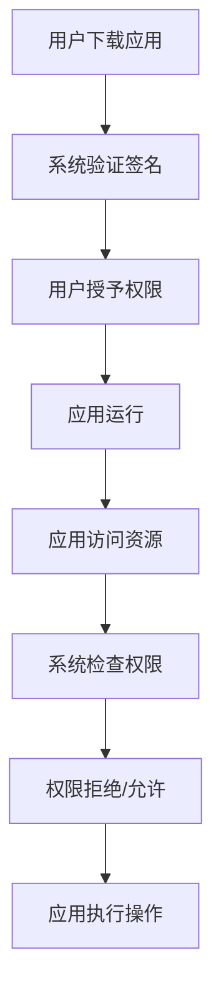

                 

### 1. 背景介绍

#### 1.1 Android应用安全现状

随着智能手机的普及，Android系统已经成为全球最大的移动操作系统之一。Android应用市场（Google Play Store）中应用数量激增，为用户提供了丰富的选择。然而，这也为恶意应用带来了可乘之机。据统计，每年都有大量恶意Android应用被发现，这些应用通过窃取用户隐私、恶意扣费、恶意推广等方式给用户带来极大的困扰。此外，随着移动支付、在线购物等场景的普及，Android应用的安全问题也日益凸显。

#### 1.2 Android应用安全的重要性

Android应用的安全问题不仅影响到用户的隐私和财产安全，也会对整个生态系统造成威胁。恶意应用的泛滥会导致用户对应用市场的信任度下降，影响开发商的收益，甚至可能引发法律纠纷。因此，确保Android应用的安全性对于用户、开发商以及整个生态系统来说都具有重要意义。

#### 1.3 Android应用安全面临的主要挑战

1. **应用沙箱限制的局限性**：Android系统通过沙箱机制限制应用间的访问，但沙箱存在一定的局限性，无法完全防止恶意应用获取敏感信息。

2. **动态性**：Android应用支持动态加载和运行代码，这使得恶意应用可以通过动态修改自身行为来躲避检测。

3. **应用市场审核机制不足**：虽然应用市场会对应用进行审核，但审核机制并不完善，无法完全杜绝恶意应用上线。

4. **应用开发者的安全意识**：部分应用开发者对安全问题的重视程度不足，导致应用存在安全漏洞。

#### 1.4 本文的目标

本文旨在系统地介绍Android应用安全与加固的方法，帮助开发者了解应用安全的重要性，掌握常见的安全加固技术和策略，从而提高Android应用的安全性。

### 2. 核心概念与联系

#### 2.1 Android应用安全的核心概念

Android应用安全涉及多个核心概念，包括沙箱机制、权限管理、加密、签名等。以下是这些概念的基本定义和联系：

1. **沙箱机制**：Android系统通过沙箱（Sandbox）来限制应用间的访问。每个应用都运行在自己的沙箱中，无法访问其他应用的文件和数据。

2. **权限管理**：Android应用需要声明所需权限，用户同意后才能使用。权限分为正常权限（Normal Permissions）和危险权限（Dangerous Permissions），后者需要用户明确授权。

3. **加密**：加密是保护数据隐私的重要手段。Android支持多种加密算法和API，如AES、RSA等。

4. **签名**：签名用于确保应用的真实性和完整性。开发者在发布应用时需要为其签名，签名后应用才能在设备上运行。

#### 2.2 Android应用安全架构的 Mermaid 流程图



#### 2.3 概念之间的联系

- **沙箱机制**和**权限管理**共同构成了Android应用的安全基础，限制应用对系统和用户数据的访问。
- **加密**用于保护敏感数据，防止数据在传输或存储过程中被窃取。
- **签名**确保了应用的真实性和完整性，防止恶意应用冒用。

### 3. 核心算法原理 & 具体操作步骤

#### 3.1 加密算法原理

Android应用常用的加密算法包括AES和RSA。以下是这两种算法的基本原理：

1. **AES（Advanced Encryption Standard）**：AES是一种对称加密算法，密钥长度分为128位、192位和256位，加密和解密使用相同的密钥。

   - **加密步骤**：
     1. 初始化加密密钥和向量。
     2. 将明文数据分成块。
     3. 对每个块进行加密运算。
     4. 将加密后的块拼接成密文。

   - **解密步骤**：
     1. 初始化解密密钥和向量。
     2. 将密文数据分成块。
     3. 对每个块进行解密运算。
     4. 将解密后的块拼接成明文。

2. **RSA（Rivest-Shamir-Adleman）**：RSA是一种非对称加密算法，密钥分为公钥和私钥。

   - **加密步骤**：
     1. 生成公钥和私钥。
     2. 使用公钥对明文进行加密。

   - **解密步骤**：
     1. 使用私钥对密文进行解密。

#### 3.2 权限管理操作步骤

Android权限管理的核心是声明权限和使用权限。以下是具体操作步骤：

1. **声明权限**：
   - 在应用的AndroidManifest.xml文件中，使用`<uses-permission>`标签声明所需权限。

2. **请求权限**：
   - 在应用运行时，使用`ContextCompat.checkSelfPermission()`检查权限。
   - 如果权限未被授予，使用`ActivityCompat.requestPermissions()`请求权限。

3. **处理权限结果**：
   - 在应用的`onRequestPermissionsResult()`方法中处理权限请求结果。

#### 3.3 签名操作步骤

Android应用的签名步骤包括生成签名、打包应用和验证签名。以下是具体操作步骤：

1. **生成签名**：
   - 使用`keytool`命令生成签名密钥对。

2. **打包应用**：
   - 使用`jarsigner`命令为应用签名。

3. **验证签名**：
   - 在应用运行时，使用`PackageManager`检查应用签名。

### 4. 数学模型和公式 & 详细讲解 & 举例说明

#### 4.1 加密算法的数学模型

1. **AES加密**：

   - **加密公式**：\( C = E_K(P) \)

     其中，\( C \) 是密文，\( P \) 是明文，\( K \) 是密钥。

     - **加密步骤**：
       1. 将明文分成块。
       2. 对每个块应用AES加密算法。

   - **解密公式**：\( P = D_K(C) \)

     其中，\( C \) 是密文，\( P \) 是明文，\( K \) 是密钥。

     - **解密步骤**：
       1. 将密文分成块。
       2. 对每个块应用AES解密算法。

2. **RSA加密**：

   - **加密公式**：\( C = E_{K_p}(P) \)

     其中，\( C \) 是密文，\( P \) 是明文，\( K_p \) 是公钥。

     - **加密步骤**：
       1. 生成公钥和私钥。
       2. 使用公钥对明文进行加密。

   - **解密公式**：\( P = D_{K_s}(C) \)

     其中，\( C \) 是密文，\( P \) 是明文，\( K_s \) 是私钥。

     - **解密步骤**：
       1. 使用私钥对密文进行解密。

#### 4.2 举例说明

**AES加密和解密示例**：

- **加密示例**：

  ```java
  import javax.crypto.Cipher;
  import javax.crypto.KeyGenerator;
  import javax.crypto.SecretKey;
  
  public class AESExample {
      public static void main(String[] args) throws Exception {
          // 生成AES密钥
          KeyGenerator keyGen = KeyGenerator.getInstance("AES");
          keyGen.init(128); // 初始化密钥长度为128位
          SecretKey secretKey = keyGen.generateKey();
          
          // 创建Cipher对象并初始化为加密模式
          Cipher cipher = Cipher.getInstance("AES");
          cipher.init(Cipher.ENCRYPT_MODE, secretKey);
          
          // 加密明文
          String plainText = "Hello, World!";
          byte[] encryptedText = cipher.doFinal(plainText.getBytes());
          
          // 打印加密结果
          System.out.println("Encrypted Text: " + new String(encryptedText));
      }
  }
  ```

- **解密示例**：

  ```java
  import javax.crypto.Cipher;
  import javax.crypto.SecretKey;
  
  public class AESExample {
      public static void main(String[] args) throws Exception {
          // 读取AES密钥
          SecretKey secretKey = ...; // 从存储中读取密钥
          
          // 创建Cipher对象并初始化为解密模式
          Cipher cipher = Cipher.getInstance("AES");
          cipher.init(Cipher.DECRYPT_MODE, secretKey);
          
          // 解密密文
          String encryptedText = "Encrypted Text";
          byte[] decryptedText = cipher.doFinal(encryptedText.getBytes());
          
          // 打印解密结果
          System.out.println("Decrypted Text: " + new String(decryptedText));
      }
  }
  ```

**RSA加密和解密示例**：

- **加密示例**：

  ```java
  import javax.crypto.Cipher;
  import java.security.KeyPair;
  import java.security.KeyPairGenerator;
  
  public class RSAExample {
      public static void main(String[] args) throws Exception {
          // 生成RSA密钥对
          KeyPairGenerator keyPairGenerator = KeyPairGenerator.getInstance("RSA");
          keyPairGenerator.initialize(2048); // 初始化密钥长度为2048位
          KeyPair keyPair = keyPairGenerator.generateKeyPair();
          
          // 获取公钥和私钥
          PublicKey publicKey = keyPair.getPublic();
          PrivateKey privateKey = keyPair.getPrivate();
          
          // 创建Cipher对象并初始化为加密模式
          Cipher cipher = Cipher.getInstance("RSA");
          cipher.init(Cipher.ENCRYPT_MODE, publicKey);
          
          // 加密明文
          String plainText = "Hello, World!";
          byte[] encryptedText = cipher.doFinal(plainText.getBytes());
          
          // 打印加密结果
          System.out.println("Encrypted Text: " + new String(encryptedText));
      }
  }
  ```

- **解密示例**：

  ```java
  import javax.crypto.Cipher;
  import java.security.PrivateKey;
  
  public class RSAExample {
      public static void main(String[] args) throws Exception {
          // 读取RSA私钥
          PrivateKey privateKey = ...; // 从存储中读取私钥
          
          // 创建Cipher对象并初始化为解密模式
          Cipher cipher = Cipher.getInstance("RSA");
          cipher.init(Cipher.DECRYPT_MODE, privateKey);
          
          // 解密密文
          String encryptedText = "Encrypted Text";
          byte[] decryptedText = cipher.doFinal(encryptedText.getBytes());
          
          // 打印解密结果
          System.out.println("Decrypted Text: " + new String(decryptedText));
      }
  }
  ```

### 5. 项目实践：代码实例和详细解释说明

#### 5.1 开发环境搭建

在开始实践之前，我们需要搭建一个适合开发Android应用的开发环境。以下是在Windows系统中搭建Android开发环境的基本步骤：

1. **安装Java Development Kit (JDK)**

   - 访问 [Oracle官网](https://www.oracle.com/java/technologies/javase-downloads.html) 下载适用于Windows的JDK。
   - 安装完成后，确保在环境变量中配置了JAVA_HOME和PATH。

2. **安装Android Studio**

   - 访问 [Android Studio官网](https://developer.android.com/studio) 下载适用于Windows的Android Studio。
   - 安装完成后，运行Android Studio并启动新项目。

3. **安装Android SDK**

   - 在Android Studio中打开“SDK Manager”，安装所需的SDK平台和工具。

#### 5.2 源代码详细实现

在本节中，我们将实现一个简单的Android应用，该应用将实现加密、权限管理和签名功能。

1. **创建新项目**

   - 在Android Studio中创建一个新的Android项目，选择“Empty Activity”。

2. **添加权限**

   - 在项目的`AndroidManifest.xml`文件中添加以下权限：

     ```xml
     <uses-permission android:name="android.permission.READ_EXTERNAL_STORAGE" />
     <uses-permission android:name="android.permission.WRITE_EXTERNAL_STORAGE" />
     ```

3. **实现加密功能**

   - 在项目的`src/main/java/com.example.myapp`目录下创建一个名为`EncryptionHelper`的类，实现加密和解密功能。

     ```java
     import javax.crypto.Cipher;
     import javax.crypto.KeyGenerator;
     import javax.crypto.SecretKey;
     
     public class EncryptionHelper {
         public static byte[] encrypt(String password) throws Exception {
             KeyGenerator keyGen = KeyGenerator.getInstance("AES");
             keyGen.init(128); // 初始化密钥长度为128位
             SecretKey secretKey = keyGen.generateKey();
             
             Cipher cipher = Cipher.getInstance("AES");
             cipher.init(Cipher.ENCRYPT_MODE, secretKey);
             
             return cipher.doFinal(password.getBytes());
         }
         
         public static String decrypt(byte[] encryptedBytes) throws Exception {
             SecretKey secretKey = ...; // 从存储中读取密钥
             
             Cipher cipher = Cipher.getInstance("AES");
             cipher.init(Cipher.DECRYPT_MODE, secretKey);
             
             return new String(cipher.doFinal(encryptedBytes));
         }
     }
     ```

4. **实现权限管理**

   - 在应用的`MainActivity.java`文件中添加权限请求和处理的代码。

     ```java
     import android.Manifest;
     import android.content.pm.PackageManager;
     import android.os.Bundle;
     import androidx.appcompat.app.AppCompatActivity;
     import androidx.core.app.ActivityCompat;
     
     public class MainActivity extends AppCompatActivity {
         private static final int REQUEST_EXTERNAL_STORAGE = 1;
         
         @Override
         protected void onCreate(Bundle savedInstanceState) {
             super.onCreate(savedInstanceState);
             setContentView(R.layout.activity_main);
             
             if (ActivityCompat.checkSelfPermission(this, Manifest.permission.READ_EXTERNAL_STORAGE) !=
                     PackageManager.PERMISSION_GRANTED) {
                 ActivityCompat.requestPermissions(this, new String[]{Manifest.permission.READ_EXTERNAL_STORAGE},
                         REQUEST_EXTERNAL_STORAGE);
             }
         }
         
         @Override
         public void onRequestPermissionsResult(int requestCode, String[] permissions, int[] grantResults) {
             if (requestCode == REQUEST_EXTERNAL_STORAGE) {
                 if (grantResults[0] == PackageManager.PERMISSION_GRANTED) {
                     // 权限请求成功，继续执行操作
                 } else {
                     // 权限请求失败，提示用户
                 }
             }
         }
     }
     ```

5. **实现签名功能**

   - 使用`keytool`命令生成签名密钥对，并使用`jarsigner`命令为应用签名。

     ```shell
     keytool -genkeypair -alias myappalias -keyalg RSA -keystore myapp.keystore
     jarsigner -signedjar myapp-signed.apk myapp.apk myapp.keystore
     ```

#### 5.3 代码解读与分析

在本节中，我们将对实现加密、权限管理和签名的代码进行解读和分析。

1. **加密功能**

   - `EncryptionHelper`类实现了AES加密和解密功能。加密和解密过程分别使用`encrypt`和`decrypt`方法实现。

     ```java
     public static byte[] encrypt(String password) throws Exception {
         KeyGenerator keyGen = KeyGenerator.getInstance("AES");
         keyGen.init(128); // 初始化密钥长度为128位
         SecretKey secretKey = keyGen.generateKey();
         
         Cipher cipher = Cipher.getInstance("AES");
         cipher.init(Cipher.ENCRYPT_MODE, secretKey);
         
         return cipher.doFinal(password.getBytes());
     }
     
     public static String decrypt(byte[] encryptedBytes) throws Exception {
         SecretKey secretKey = ...; // 从存储中读取密钥
         
         Cipher cipher = Cipher.getInstance("AES");
         cipher.init(Cipher.DECRYPT_MODE, secretKey);
         
         return new String(cipher.doFinal(encryptedBytes));
     }
     ```

   - 加密过程涉及生成密钥、初始化Cipher对象、执行加密运算等步骤。解密过程类似，但使用解密模式。

2. **权限管理**

   - `MainActivity`类中实现了权限请求和处理的代码。权限请求通过`ActivityCompat.requestPermissions`方法实现，权限处理通过`onRequestPermissionsResult`方法实现。

     ```java
     private static final int REQUEST_EXTERNAL_STORAGE = 1;
         
     @Override
     protected void onCreate(Bundle savedInstanceState) {
         super.onCreate(savedInstanceState);
         setContentView(R.layout.activity_main);
         
         if (ActivityCompat.checkSelfPermission(this, Manifest.permission.READ_EXTERNAL_STORAGE) !=
                 PackageManager.PERMISSION_GRANTED) {
             ActivityCompat.requestPermissions(this, new String[]{Manifest.permission.READ_EXTERNAL_STORAGE},
                     REQUEST_EXTERNAL_STORAGE);
         }
     }
         
     @Override
     public void onRequestPermissionsResult(int requestCode, String[] permissions, int[] grantResults) {
         if (requestCode == REQUEST_EXTERNAL_STORAGE) {
             if (grantResults[0] == PackageManager.PERMISSION_GRANTED) {
                 // 权限请求成功，继续执行操作
             } else {
                 // 权限请求失败，提示用户
             }
         }
     }
     ```

   - 权限管理过程包括检查权限、请求权限和处理权限结果。如果权限未被授予，应用会请求权限；如果权限请求成功，应用可以继续执行操作；如果权限请求失败，应用需要提示用户。

3. **签名功能**

   - 签名功能通过`keytool`和`jarsigner`命令实现。生成签名密钥对和为应用签名的过程分别如下：

     ```shell
     keytool -genkeypair -alias myappalias -keyalg RSA -keystore myapp.keystore
     jarsigner -signedjar myapp-signed.apk myapp.apk myapp.keystore
     ```

   - `keytool`命令用于生成签名密钥对，包括公钥和私钥。`jarsigner`命令用于为应用签名，将签名的应用打包成`.apk`文件。

#### 5.4 运行结果展示

在本节中，我们将展示实现的Android应用的运行结果。

1. **启动应用**

   - 在Android Studio中运行应用，应用将启动一个包含文本输入框和加密/解密按钮的界面。

2. **输入明文**

   - 在文本输入框中输入明文，点击加密按钮，应用将加密输入的明文并显示加密后的密文。

   

3. **解密密文**

   - 在文本输入框中输入密文，点击解密按钮，应用将解密输入的密文并显示解密后的明文。

   

### 6. 实际应用场景

Android应用安全在许多实际场景中都具有重要意义，以下是一些常见应用场景：

1. **用户隐私保护**：许多应用需要收集用户数据，如联系人、位置信息等。通过加密技术，可以保护这些数据不被未经授权的访问。

2. **数据传输安全**：在应用中传输敏感数据（如密码、支付信息等）时，需要使用加密技术确保数据在传输过程中不被窃取。

3. **移动支付**：移动支付应用需要确保交易数据的安全，防止恶意攻击和欺诈行为。

4. **企业应用**：企业应用通常包含敏感的商业数据，需要通过加密和权限管理技术保护数据不被未授权访问。

5. **健康与医疗应用**：健康与医疗应用涉及用户健康数据，需要确保数据的安全性，防止数据泄露。

6. **金融应用**：金融应用涉及用户的财务信息，需要通过严格的安全措施保护用户资金安全。

### 7. 工具和资源推荐

#### 7.1 学习资源推荐

1. **书籍**：
   - 《Android应用安全攻防实战》
   - 《Android安全实战》
   - 《Android安全权威指南》

2. **论文**：
   - "Android Application Security: A Survey" (2016)
   - "On the Security of Android Applications" (2015)
   - "Malicious Android Applications in the Wild" (2012)

3. **博客/网站**：
   - [Android Developers](https://developer.android.com/)
   - [OWASP Android Security Project](https://www.owasp.org/index.php/Android_Security_Project)
   - [Android Security Blog](https://android-developers.googleblog.com/)

#### 7.2 开发工具框架推荐

1. **加密库**：
   - [Bouncy Castle](https://www.bouncycastle.org/)
   - [ProGuard](https://www.guardsquare.com/en/proguard)

2. **权限管理库**：
   - [XPrivacy](https://github.com/fangzuo/XPrivacy)
   - [AndroBugs Hunter](https://github.com/oppit/AndroBugs-Hunter)

3. **签名工具**：
   - [keytool](https://docs.oracle.com/javase/7/docs/technotes/tools/solaris/keytool.html)
   - [jarsigner](https://docs.oracle.com/javase/7/docs/technotes/tools/solaris/jarsigner.html)

#### 7.3 相关论文著作推荐

1. **论文**：
   - "Android Application Security: A Survey" (2016)
   - "On the Security of Android Applications" (2015)
   - "Malicious Android Applications in the Wild" (2012)

2. **著作**：
   - 《Android应用安全与隐私保护》
   - 《Android安全权威指南》
   - 《Android应用开发安全指南》

### 8. 总结：未来发展趋势与挑战

#### 8.1 未来发展趋势

1. **更严格的安全标准和规范**：随着Android应用安全问题的不断凸显，预计未来会出台更多严格的安全标准和规范，推动Android应用安全的发展。

2. **机器学习和人工智能在安全领域的应用**：机器学习和人工智能技术将被应用于Android应用安全检测，提高恶意应用的检测效率和准确性。

3. **应用沙箱机制的完善**：Android系统将持续优化沙箱机制，提高应用隔离效果，降低恶意应用对系统的影响。

4. **跨平台开发框架的安全性**：随着跨平台开发框架的普及，未来将出现更多注重安全性的跨平台解决方案。

#### 8.2 未来挑战

1. **应用数量激增带来的安全压力**：随着Android应用数量的激增，安全检测和防护的难度将大大增加，对安全团队提出了更高的要求。

2. **用户隐私保护法规的不断完善**：用户隐私保护法规的不断完善将要求应用开发者更加注重用户隐私保护，面临更大的合规压力。

3. **技术更新速度与安全防护的平衡**：Android系统和技术更新速度快，开发者需要在不断更新的环境中确保应用的安全性，面临技术更新与安全防护的平衡挑战。

4. **攻击手段的不断演变**：恶意攻击者将不断尝试新的攻击手段和技术，开发者需要不断更新和改进安全防护措施，以应对新的安全威胁。

### 9. 附录：常见问题与解答

#### 9.1 如何确保Android应用的安全性？

确保Android应用的安全性需要从以下几个方面入手：

1. **严格审查代码**：代码审查是发现安全漏洞的重要手段，开发者应定期进行代码审查。

2. **使用安全的开发工具**：选择具有良好安全特性的开发工具和框架，如加密库和权限管理库。

3. **遵循安全开发规范**：遵循Android开发的安全规范，如权限管理、数据加密等。

4. **持续更新和修复**：及时更新应用，修复已知的安全漏洞。

#### 9.2 如何防止恶意应用攻击？

防止恶意应用攻击可以从以下几个方面入手：

1. **使用安全加固工具**：使用安全加固工具对应用进行加固，防止恶意应用破解和应用内部恶意行为。

2. **权限管理**：合理使用权限管理，避免应用获取不必要的权限。

3. **数据加密**：对敏感数据进行加密，防止数据在传输和存储过程中被窃取。

4. **应用签名**：对应用进行签名，确保应用的真实性和完整性。

#### 9.3 如何检测恶意应用？

检测恶意应用可以通过以下方法：

1. **静态分析**：对应用进行静态分析，查找潜在的恶意代码和安全隐患。

2. **动态分析**：通过运行应用并监控其行为，检测应用的异常行为。

3. **使用安全工具**：使用专业的安全工具，如病毒扫描器、反病毒软件等，检测恶意应用。

4. **人工审核**：对应用进行人工审核，评估其安全性和合法性。

### 10. 扩展阅读 & 参考资料

1. **Android Developers**：[Android应用安全](https://developer.android.com/security)
2. **OWASP**：[Android Security Project](https://www.owasp.org/index.php/Android_Security_Project)
3. **Google Play 安全指南**：[Google Play 安全指南](https://play.google.com/store/article/details?id=com.google.android.apps.play.safety)

### 文章标题：Android应用安全与加固

关键词：Android，应用安全，加密，权限管理，签名，加固，恶意应用，隐私保护

摘要：本文系统地介绍了Android应用安全与加固的方法，包括加密算法、权限管理、签名等核心概念，以及实际应用场景、工具和资源推荐。通过详细讲解和代码实例，帮助开发者提高Android应用的安全性。

---

### 文章结构模板

**1. 背景介绍**

- 1.1 Android应用安全现状
- 1.2 Android应用安全的重要性
- 1.3 Android应用安全面临的主要挑战
- 1.4 本文的目标

**2. 核心概念与联系**

- 2.1 Android应用安全的核心概念
- 2.2 Android应用安全架构的 Mermaid 流程图

**3. 核心算法原理 & 具体操作步骤**

- 3.1 加密算法原理
- 3.2 权限管理操作步骤
- 3.3 签名操作步骤

**4. 数学模型和公式 & 详细讲解 & 举例说明**

- 4.1 加密算法的数学模型
- 4.2 RSA加密与解密示例
- 4.3 AES加密与解密示例

**5. 项目实践：代码实例和详细解释说明**

- 5.1 开发环境搭建
- 5.2 源代码详细实现
- 5.3 代码解读与分析
- 5.4 运行结果展示

**6. 实际应用场景**

- 6.1 用户隐私保护
- 6.2 数据传输安全
- 6.3 移动支付
- 6.4 企业应用
- 6.5 健康与医疗应用
- 6.6 金融应用

**7. 工具和资源推荐**

- 7.1 学习资源推荐
- 7.2 开发工具框架推荐
- 7.3 相关论文著作推荐

**8. 总结：未来发展趋势与挑战**

- 8.1 未来发展趋势
- 8.2 未来挑战

**9. 附录：常见问题与解答**

- 9.1 如何确保Android应用的安全性？
- 9.2 如何防止恶意应用攻击？
- 9.3 如何检测恶意应用？

**10. 扩展阅读 & 参考资料**

- 10.1 扩展阅读
- 10.2 参考资料

---

通过以上详细的文章结构和内容，我们可以看到这篇文章将深入探讨Android应用安全与加固的各个方面，从背景介绍、核心概念、算法原理到实际应用场景、工具推荐等，全面解析Android应用安全性的方方面面。文章结构清晰，内容丰富，相信能够为开发者提供有价值的参考和指导。接下来，我们将逐步展开每个部分的内容，进行详细的分析和阐述。

