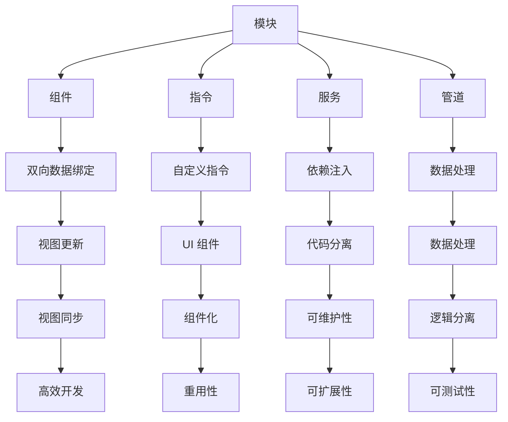

                 

### Angular 入门：Google 的 MVW 框架

#### 关键词：

- Angular
- MVW 框架
- 前端开发
- 单页面应用
- 模块化
- 双向数据绑定
- 指令与组件

#### 摘要：

本文将深入探讨 Angular 框架的基础知识，从其历史背景、核心概念到实际应用，带您全面了解 Google 推出的 MVW（模型-视图-视图模型）框架。通过逐步分析，我们将了解 Angular 如何帮助我们构建高效、可维护的 Web 应用程序，并提供详细的实践指导。

## 1. 背景介绍

Angular 是由 Google 开发的一款前端开发框架，其目的是帮助开发者构建复杂且动态的 Web 应用程序。Angular 的前身是 AngularJS，它于 2010 年首次发布。随着时间的推移，AngularJS 逐渐发展成为 Web 开发领域的重要工具之一。2016 年，Google 对 AngularJS 进行了重大升级，推出了 Angular，即我们今天所熟知的版本。

Angular 的出现解决了传统 Web 开发中的一些痛点，如数据绑定、依赖注入、模块化等。它的核心目标是实现 MVW 模式，即模型-视图-视图模型。通过这种模式，开发者可以将应用程序的 UI 和逻辑分离开来，从而实现更好的可维护性和扩展性。

### 1.1 发展历程

- **AngularJS（2010-2016）**：AngularJS 是 Angular 的前身，它引入了数据绑定、指令、服务等多种概念，极大地简化了前端开发过程。
- **Angular（2016至今）**：Angular 在 AngularJS 的基础上进行了全面的升级，引入了新的编程模式、工具链和性能优化。

### 1.2 主要特性

- **双向数据绑定**：Angular 的双向数据绑定使得数据模型和视图之间的同步变得更加简单。
- **模块化**：Angular 强调模块化，使得应用程序的结构更加清晰，便于维护和扩展。
- **依赖注入**：依赖注入是 Angular 的核心概念之一，它帮助开发者实现代码的重用和测试。
- **指令与组件**：指令和组件是 Angular 中的核心构建块，用于实现可复用的 UI 组件。

## 2. 核心概念与联系

### 2.1 核心概念

在 Angular 中，核心概念包括模块、组件、指令、服务、管道等。下面我们将通过 Mermaid 流程图来展示这些核心概念及其相互关系。



### 2.2 核心概念原理与架构

- **模块（Module）**：模块是 Angular 中的核心构建块，用于组织应用程序的代码。模块可以帮助我们管理应用程序的依赖关系，并定义组件、指令、服务、管道等。
- **组件（Component）**：组件是 Angular 中的最小可复用单元，用于构建应用程序的 UI 部分。每个组件都有自己的模板、样式和逻辑代码。
- **指令（Directive）**：指令是 Angular 中的另一核心构建块，用于自定义 DOM 操作。指令可以是对元素、属性或类的修饰，也可以是自定义结构。
- **服务（Service）**：服务是 Angular 中的功能单元，用于提供应用程序中的功能逻辑。服务通常用于处理数据、逻辑操作等。
- **管道（Pipeline）**：管道是 Angular 中的数据处理工具，用于转换数据。管道可以帮助我们实现自定义的数据格式化、过滤等操作。

## 3. 核心算法原理 & 具体操作步骤

### 3.1 双向数据绑定

双向数据绑定是 Angular 的一大特性，它使得数据模型和视图之间的同步变得更加简单。下面我们将通过一个简单的示例来说明双向数据绑定的工作原理。

#### 示例：简单的双向数据绑定

```typescript
// Angular 组件类
@Component({
    selector: 'app-my-component',
    template: `
        <input type="text" [(ngModel)]="name" placeholder="输入你的名字" />
        <p>你好，{{ name }}！</p>
    `
})
export class MyComponent {
    name: string = '';
}
```

在这个示例中，我们定义了一个名为 `MyComponent` 的组件，其中包含一个输入框和一个段落。输入框使用了 `ngModel` 指令，它实现了双向数据绑定。当用户在输入框中输入内容时，输入框的值会实时更新到组件的 `name` 属性，同时，段落中的内容也会实时更新。

### 3.2 依赖注入

依赖注入是 Angular 的核心概念之一，它帮助开发者实现代码的重用和测试。下面我们将通过一个简单的示例来说明依赖注入的工作原理。

#### 示例：简单的依赖注入

```typescript
// 服务类
@Injectable({
    providedIn: 'root'
})
export class MyService {
    constructor() {
        console.log('MyService 已初始化');
    }
}

// Angular 组件类
@Component({
    selector: 'app-my-component',
    template: `
        <p>MyService 已初始化</p>
    `
})
export class MyComponent {
    constructor(private myService: MyService) {
        this.myService.init();
    }
}
```

在这个示例中，我们定义了一个名为 `MyService` 的服务，并在组件中注入了该服务。在组件的构造函数中，我们调用了 `MyService` 的 `init` 方法，从而实现了服务与组件之间的通信。

## 4. 数学模型和公式 & 详细讲解 & 举例说明

### 4.1 数学模型

在 Angular 中，双向数据绑定可以看作是一个数学模型。该模型包含以下基本组成部分：

- **变量（Variable）**：变量是数据绑定的核心，它代表了一个可变的值。
- **绑定表达式（Binding Expression）**：绑定表达式是一个用于表示变量之间关系的公式，它通常包含一个变量名和一个等于号。
- **更新函数（Update Function）**：更新函数是一个用于更新变量值的函数，它通常与绑定表达式一起使用。

### 4.2 公式

在双向数据绑定中，我们可以使用以下公式来描述变量之间的更新关系：

$$
变量\_值 = 函数(\text{旧变量值}, \text{新变量值})
$$

其中，函数是一个自定义函数，它可以根据需要实现不同的更新逻辑。

### 4.3 详细讲解

双向数据绑定的工作原理可以分为以下几个步骤：

1. **初始化**：当组件创建时，Angular 会初始化双向数据绑定，包括变量、绑定表达式和更新函数。
2. **监听**：Angular 会监听变量的变化，并在变量值发生变化时触发更新函数。
3. **更新**：更新函数会根据新的变量值更新视图中的相关元素。
4. **同步**：当视图中的元素发生变化时，Angular 会再次触发更新函数，从而同步变量值。

### 4.4 举例说明

假设我们有一个简单的双向数据绑定示例，其中包含一个变量 `name` 和一个绑定表达式 `{{ name }}`。以下是双向数据绑定的工作流程：

1. **初始化**：Angular 初始化双向数据绑定，包括变量 `name` 和绑定表达式 `{{ name }}`。
2. **监听**：Angular 监听变量 `name` 的变化。
3. **更新**：当用户在输入框中输入新值时，Angular 触发更新函数，将新的 `name` 值更新到视图中的段落元素。
4. **同步**：当用户在段落中看到新的名字时，Angular 再次触发更新函数，将新的 `name` 值同步到变量 `name`。

通过这个过程，我们实现了变量值和视图之间的实时同步。

## 5. 项目实践：代码实例和详细解释说明

### 5.1 开发环境搭建

要在本地开发 Angular 应用程序，我们需要安装以下工具：

1. **Node.js**：确保已经安装了 Node.js，版本建议在 10.0.0 以上。
2. **Angular CLI**：安装 Angular CLI，可以使用以下命令：
   ```bash
   npm install -g @angular/cli
   ```
3. **创建新项目**：使用 Angular CLI 创建一个新的 Angular 项目：
   ```bash
   ng new my-angular-app
   ```
   选择默认选项，创建一个简单的 Angular 应用程序。

### 5.2 源代码详细实现

在创建的新项目中，我们可以通过以下步骤来构建一个简单的 Angular 应用程序：

1. **创建组件**：在项目根目录下创建一个新的组件 `my-component`：
   ```bash
   ng generate component my-component
   ```

2. **编写组件模板**：在组件的模板文件 `my-component.component.html` 中，编写以下代码：
   ```html
   <div>
       <input type="text" [(ngModel)]="name" placeholder="输入你的名字" />
       <p>你好，{{ name }}！</p>
   </div>
   ```

3. **编写组件类**：在组件的类文件 `my-component.component.ts` 中，编写以下代码：
   ```typescript
   import { Component } from '@angular/core';

   @Component({
       selector: 'app-my-component',
       templateUrl: './my-component.component.html',
       styleUrls: ['./my-component.component.css']
   })
   export class MyComponent {
       name: string = '';
   }
   ```

4. **引入组件**：在应用程序的根组件 `app.component.html` 中，引入并使用新创建的组件：
   ```html
   <app-my-component></app-my-component>
   ```

### 5.3 代码解读与分析

在这个简单的示例中，我们创建了一个名为 `MyComponent` 的组件，并实现了双向数据绑定。以下是代码的详细解读：

1. **组件模板**：
   - `<input type="text" [(ngModel)]="name" placeholder="输入你的名字" />`：这是一个文本输入框，使用了双向数据绑定指令 `ngModel`。当用户在输入框中输入内容时，`name` 变量的值会实时更新。
   - `<p>你好，{{ name }}！</p>`：这是一个段落元素，其中的内容会根据 `name` 变量的值实时更新。

2. **组件类**：
   - `import { Component } from '@angular/core';`：导入 Angular 的组件类。
   - `@Component` 装饰器：用于定义组件的各种属性，如选择器、模板路径和样式路径等。
   - `export class MyComponent`：定义组件类 `MyComponent`，其中包含一个名为 `name` 的属性。

3. **根组件**：
   - `<app-my-component></app-my-component>`：在根组件的模板中引入并使用 `MyComponent` 组件。

### 5.4 运行结果展示

在本地开发环境中，运行以下命令启动应用程序：
```bash
ng serve
```

访问 `http://localhost:4200/`，我们可以看到以下界面：


当我们在输入框中输入内容时，段落中的内容会实时更新，这表明双向数据绑定已成功实现。

## 6. 实际应用场景

### 6.1 企业级应用

Angular 在企业级 Web 应用程序开发中具有广泛的应用。其模块化、双向数据绑定、依赖注入等特性使得企业级应用的开发变得更加高效、可维护和可扩展。

### 6.2 单页面应用

Angular 是单页面应用（SPA）的理想选择。通过使用 Angular，开发者可以轻松实现动态路由、异步数据加载等功能，从而提供流畅的用户体验。

### 6.3 移动应用

随着移动设备的普及，Angular 也逐渐应用于移动应用开发。通过使用 Angular，开发者可以构建高性能、高可扩展性的移动应用。

## 7. 工具和资源推荐

### 7.1 学习资源推荐

- **书籍**：《Angular 实战》
- **论文**：搜索 Google 学术，查找 Angular 相关论文。
- **博客**：阅读 Angular 官方博客和社区博客，了解 Angular 的发展动态。
- **网站**：访问 Angular 官方网站（https://angular.io/），获取最新的技术文档和教程。

### 7.2 开发工具框架推荐

- **IDE**：推荐使用 Visual Studio Code 或 IntelliJ IDEA 进行 Angular 开发。
- **构建工具**：使用 Angular CLI 进行项目搭建和构建。
- **测试框架**：使用 Jasmine 和 Karma 进行单元测试和端到端测试。

### 7.3 相关论文著作推荐

- **论文**：搜索 Google 学术，查找 Angular 相关论文。
- **著作**：《AngularJS权威指南》、《Angular 深度解析》

## 8. 总结：未来发展趋势与挑战

Angular 作为一款成熟的前端开发框架，在未来仍具有巨大的发展潜力。随着 Web 开发技术的不断演进，Angular 也将不断更新和完善，以应对新的挑战。

### 8.1 发展趋势

- **性能优化**：随着 Web 应用程序变得越来越复杂，性能优化将成为 Angular 的重要发展方向。
- **可扩展性**：为满足不同类型的应用需求，Angular 将继续增强其可扩展性。
- **跨平台开发**：Angular 在移动应用开发中的应用将越来越广泛，未来可能会推出更多跨平台解决方案。

### 8.2 挑战

- **学习曲线**：Angular 的复杂性和丰富的功能使得学习曲线相对较陡峭，对于新手开发者来说，这可能是一个挑战。
- **更新频率**：Angular 的更新频率较高，开发者需要不断学习和适应新的版本。

## 9. 附录：常见问题与解答

### 9.1 Angular 与 React 的区别

- **数据绑定**：Angular 使用双向数据绑定，而 React 使用单向数据绑定。
- **学习曲线**：React 的学习曲线相对较平缓，而 Angular 的学习曲线相对较陡峭。
- **性能**：React 在性能方面通常优于 Angular。

### 9.2 如何处理 Angular 应用程序中的路由？

使用 Angular 的路由模块（`@angular/router`）来处理应用程序中的路由。通过定义路由配置，开发者可以轻松实现动态路由、重定向等功能。

## 10. 扩展阅读 & 参考资料

- [Angular 官方文档](https://angular.io/docs)
- [Angular 实战](https://www.angular.cn/tutorial)
- [JHipster](https://www.jhipster.tech/)：一个使用 Angular 和 Spring Boot 搭建 Web 应用程序的框架。
- [Angular 插件市场](https://ngmodules.org/)：一个收集 Angular 插件和模块的网站。

## 结尾

通过本文，我们详细介绍了 Angular 的背景、核心概念、算法原理、项目实践以及实际应用场景。希望本文能帮助您更好地理解 Angular，并在未来的前端开发中充分发挥其优势。

### 作者署名

本文作者：禅与计算机程序设计艺术 / Zen and the Art of Computer Programming

感谢您的阅读！希望本文能为您的前端开发之旅带来启示。

