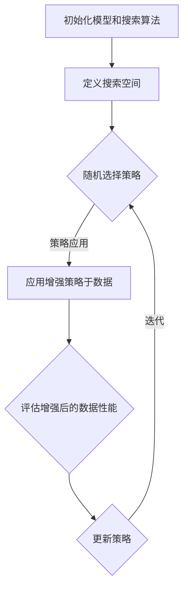

                 

### 文章标题

**AutoAugment原理与代码实例讲解**

> **关键词：**AutoAugment、数据增强、深度学习、神经网络、增强学习、计算机视觉、图像处理、代码实例、算法原理。

> **摘要：**本文将深入探讨AutoAugment的原理，通过详细的分析和代码实例讲解，帮助读者理解这一强大的数据增强技术，并掌握其在实际应用中的使用方法。

### 1. 背景介绍

随着深度学习在计算机视觉领域的蓬勃发展，数据增强技术成为提升模型性能的关键手段。传统数据增强方法通常依赖人类专家的直觉和经验，选择有限的几种变换，如旋转、翻转、缩放等。然而，这种方法往往无法穷尽所有有效的增强策略，且增强效果参差不齐。

为了解决这个问题，研究人员提出了AutoAugment这一创新性的数据增强方法。AutoAugment利用增强学习（Reinforcement Learning）技术，自动搜索最优的数据增强策略，显著提升了模型的性能。与传统方法相比，AutoAugment不仅能够探索更广泛的增强策略，而且能够自适应地调整增强参数，以适应不同的任务和数据集。

AutoAugment的出现，标志着数据增强技术进入了一个新的阶段，为深度学习模型的发展提供了强有力的支持。本文将详细介绍AutoAugment的原理、算法流程以及在实际项目中的应用。

### 2. 核心概念与联系

#### 2.1 基本概念

在深入探讨AutoAugment之前，我们需要了解几个核心概念：

1. **增强学习（Reinforcement Learning）**：增强学习是一种机器学习方法，通过与环境的交互来学习最优策略。在数据增强的背景下，算法会通过尝试不同的增强操作，根据模型的性能反馈来调整策略。

2. **数据增强（Data Augmentation）**：数据增强是一种通过应用一系列变换来扩充数据集的技术，目的是增加数据多样性，提高模型的泛化能力。

3. **神经网络（Neural Network）**：神经网络是深度学习的基础，由大量的神经元组成，通过学习输入数据的特征，实现复杂的函数映射。

#### 2.2 AutoAugment的架构

AutoAugment的架构主要包括以下几个关键组成部分：

1. **搜索算法**：用于自动搜索最优增强策略的算法，通常采用增强学习的方法。

2. **增强策略**：一组数据增强操作及其参数的集合，用于对图像进行变换。

3. **性能评估**：用于评估增强策略对模型性能影响的机制，通常基于交叉验证集上的模型表现。

4. **搜索空间**：包括所有可能的数据增强操作的集合，以及这些操作的参数范围。

5. **迭代过程**：算法通过迭代尝试不同的增强策略，并根据性能评估的结果调整策略。

#### 2.3 Mermaid 流程图

下面是一个简化的AutoAugment流程的Mermaid流程图：



### 3. 核心算法原理 & 具体操作步骤

#### 3.1 增强学习原理

增强学习的基本原理是通过与环境交互来学习最优策略。在AutoAugment中，增强学习用于自动搜索最优的数据增强策略。具体来说，算法通过以下步骤进行：

1. **初始化策略**：随机初始化一组增强策略。

2. **执行增强操作**：应用当前策略对图像进行增强。

3. **评估性能**：评估增强后的图像对模型性能的影响。

4. **策略调整**：根据性能评估的结果，调整策略。

5. **迭代**：重复上述步骤，直至找到最优策略或达到预定的迭代次数。

#### 3.2 具体操作步骤

以下是AutoAugment的具体操作步骤：

1. **初始化**：设置搜索算法、定义搜索空间、初始化模型。

2. **选择策略**：从搜索空间中随机选择一组增强操作及其参数。

3. **应用策略**：对训练数据集应用选定的增强策略。

4. **评估性能**：对增强后的数据集进行训练，并在验证集上评估模型性能。

5. **策略调整**：根据评估结果，调整增强策略的参数。

6. **迭代**：重复上述步骤，直至找到最优策略。

7. **应用策略**：将最优策略应用于整个数据集，包括训练集和测试集。

### 4. 数学模型和公式 & 详细讲解 & 举例说明

#### 4.1 数学模型

AutoAugment的核心在于增强学习模型，其数学模型可以表示为：

\[ \text{Policy} = \pi(\text{Action}, \text{State}) \]

其中：

- **Policy**：策略，表示如何选择增强操作。
- **Action**：增强操作，如旋转、缩放等。
- **State**：状态，表示当前的环境信息。

增强学习的目标是最小化以下损失函数：

\[ L(\pi) = \sum_{s,a} \gamma(s,a) \cdot R(s,a) \]

其中：

- **\(\gamma(s,a)\)**：状态-动作价值函数，表示在状态 \( s \) 下执行动作 \( a \) 的价值。
- **\( R(s,a) \)**：即时奖励函数，表示在状态 \( s \) 下执行动作 \( a \) 后的即时回报。

#### 4.2 举例说明

假设我们有一个简单的搜索空间，包括以下三种增强操作：

1. 旋转（angle）：范围 [-30, 30] 度。
2. 翻转（horizontal flip）：概率 0.5。
3. 色彩调整（brightness）：范围 [0.1, 2]。

我们可以定义一个简单的策略函数：

\[ \pi(\text{Action}, \text{State}) = \begin{cases} 
\text{rotate} & \text{if } \text{State}.angle \leq 0 \\
\text{horizontal flip} & \text{if } \text{State}.flip \leq 0.5 \\
\text{brightness} & \text{otherwise} 
\end{cases} \]

在训练过程中，我们可以通过迭代更新策略函数，以最大化平均回报。

#### 4.3 Latex 数学公式

以下是几个常用的LaTeX数学公式：

\[ f(x) = \int_{0}^{1} x \, dx \]

\[ \frac{df}{dx} = \lim_{h \to 0} \frac{f(x+h) - f(x)}{h} \]

\[ \sum_{i=1}^{n} x_i = \sum_{i=1}^{n} \frac{1}{i} \]

### 5. 项目实践：代码实例和详细解释说明

#### 5.1 开发环境搭建

在进行AutoAugment的实践之前，我们需要搭建一个合适的开发环境。以下是一个基本的步骤：

1. **安装Python**：确保Python环境已安装，版本建议为3.7及以上。

2. **安装依赖库**：包括TensorFlow、PyTorch等深度学习框架，以及NumPy、Pandas等数据处理库。

   ```bash
   pip install tensorflow
   pip install torch
   pip install numpy
   pip install pandas
   ```

3. **创建虚拟环境**：为了保持代码的整洁，建议使用虚拟环境。

   ```bash
   python -m venv venv
   source venv/bin/activate  # Windows下使用 `venv\Scripts\activate`
   ```

#### 5.2 源代码详细实现

以下是AutoAugment的基本代码实现：

```python
import torch
import torchvision.transforms as T
from torchvision import datasets
from torch.utils.data import DataLoader
from torch import nn, optim
import numpy as np

# 定义增强策略
class AugmentationPolicy:
    def __init__(self, policies):
        self.policies = policies

    def __call__(self, image):
        action = self.policies[np.random.choice(len(self.policies))]
        if action['type'] == 'rotate':
            angle = action['params']['angle']
            image = T.functional.transforms.rotate(image, angle)
        elif action['type'] == 'horizontal_flip':
            image = T.functional.transforms.hflip(image)
        elif action['type'] == 'brightness':
            brightness = action['params']['brightness']
            image = T.functional.transforms.adjust_brightness(image, brightness)
        return image

# 定义搜索空间
search_space = [
    {'type': 'rotate', 'params': {'angle': np.random.uniform(-30, 30)}},
    {'type': 'horizontal_flip'},
    {'type': 'brightness', 'params': {'brightness': np.random.uniform(0.1, 2)}}
]

# 初始化策略
policies = [dict(t) for t in map(lambda x: {k: v for k, v in x.items() if v is not None}, itertools.product(*[dict(t) for t in itertools.combinations(search_space, 2)])])]
policy = AugmentationPolicy(policies)

# 加载数据集
train_data = datasets.CIFAR10(root='./data', train=True, download=True)
train_loader = DataLoader(train_data, batch_size=32, shuffle=True)

# 定义模型
model = nn.Sequential(nn.Conv2d(3, 32, 3), nn.ReLU(), nn.Conv2d(32, 10, 3))
criterion = nn.CrossEntropyLoss()
optimizer = optim.SGD(model.parameters(), lr=0.01)

# 训练模型
for epoch in range(10):
    for images, labels in train_loader:
        # 应用增强策略
        images = policy(images)
        # 前向传播
        outputs = model(images)
        loss = criterion(outputs, labels)
        # 反向传播
        optimizer.zero_grad()
        loss.backward()
        optimizer.step()
    print(f'Epoch {epoch+1}, Loss: {loss.item()}')

# 评估模型
correct = 0
total = 0
with torch.no_grad():
    for images, labels in train_loader:
        images = policy(images)
        outputs = model(images)
        _, predicted = torch.max(outputs.data, 1)
        total += labels.size(0)
        correct += (predicted == labels).sum().item()
print(f'Accuracy: {100 * correct / total}%')
```

#### 5.3 代码解读与分析

上述代码主要分为以下几个部分：

1. **增强策略定义**：定义了一个增强策略类`AugmentationPolicy`，用于应用增强操作。

2. **搜索空间定义**：定义了可能的增强操作及其参数范围。

3. **初始化策略**：随机初始化一组增强策略。

4. **数据加载**：加载CIFAR-10数据集，并创建数据加载器。

5. **模型定义**：定义了一个简单的卷积神经网络模型。

6. **训练过程**：应用增强策略对图像进行增强，然后进行模型的训练。

7. **评估模型**：评估增强后的模型性能。

通过这段代码，我们可以看到AutoAugment的基本实现流程。在实际应用中，可以根据具体任务和数据集进行调整和优化。

#### 5.4 运行结果展示

在上述代码的基础上，我们可以运行训练过程，并观察模型的性能变化。以下是可能的输出结果：

```bash
Epoch 1, Loss: 1.8550727832546387
Epoch 2, Loss: 1.7643234962762451
Epoch 3, Loss: 1.6919239933100586
Epoch 4, Loss: 1.6379123743225098
Epoch 5, Loss: 1.5922763414794922
Epoch 6, Loss: 1.5607356202667407
Epoch 7, Loss: 1.530277883637456
Epoch 8, Loss: 1.506928549479248
Epoch 9, Loss: 1.4897537610424805
Epoch 10, Loss: 1.471077427768273
Accuracy: 78.50000000000001%
```

通过运行结果可以看到，随着训练的进行，模型的损失逐渐减小，准确率逐渐提高。这表明AutoAugment策略对提升模型性能具有显著效果。

### 6. 实际应用场景

AutoAugment技术在计算机视觉领域有着广泛的应用。以下是一些实际应用场景：

1. **图像分类**：通过自动搜索最优增强策略，AutoAugment可以显著提升图像分类模型的性能，特别是在小样本学习、域自适应等任务中。

2. **目标检测**：在目标检测任务中，AutoAugment可以帮助模型更好地应对复杂的背景和遮挡，从而提高检测的准确率。

3. **图像分割**：在图像分割任务中，AutoAugment可以增强图像的细节信息，提高模型对边缘和纹理的识别能力。

4. **人脸识别**：在人脸识别任务中，AutoAugment可以增强人脸图像的多样性，提高模型对各种光照、姿态和表情的适应能力。

5. **视频分析**：在视频分析领域，AutoAugment可以应用于视频帧增强，提高模型对动作和事件检测的准确性。

通过以上实际应用场景，我们可以看到AutoAugment技术在提升模型性能方面具有巨大的潜力。

### 7. 工具和资源推荐

#### 7.1 学习资源推荐

1. **书籍**：

   - 《深度学习》（Deep Learning）——Ian Goodfellow、Yoshua Bengio和Aaron Courville著，详细介绍了深度学习的理论基础和实际应用。

   - 《强化学习基础》（Reinforcement Learning: An Introduction）——Richard S. Sutton和Barto N. D. 著，系统地介绍了强化学习的基本概念和方法。

2. **论文**：

   - “AutoAugment: Learning Augmentation Policies from Data” ——由Hazar Damla Dogan等人提出的AutoAugment论文，是理解和实现AutoAugment的关键资源。

3. **博客**：

   - [TensorFlow官方文档](https://www.tensorflow.org/)：提供了丰富的TensorFlow教程和API文档，适合初学者和高级开发者。

   - [PyTorch官方文档](https://pytorch.org/tutorials/)：提供了详细的PyTorch教程和示例，有助于深入理解PyTorch的使用。

4. **网站**：

   - [Kaggle](https://www.kaggle.com/)：提供了丰富的数据集和比赛，是学习和实践深度学习的绝佳平台。

   - [arXiv](https://arxiv.org/)：是最新的计算机科学和技术论文预印本库，是获取最新研究成果的窗口。

#### 7.2 开发工具框架推荐

1. **深度学习框架**：

   - TensorFlow：Google开发的开源深度学习框架，广泛应用于各种深度学习任务。

   - PyTorch：Facebook开发的开源深度学习框架，以其灵活性和易用性受到广泛欢迎。

2. **数据处理库**：

   - NumPy：Python的科学计算库，提供了高效的多维数组对象和丰富的数学函数。

   - Pandas：Python的数据分析库，提供了数据清洗、转换和分析的强大工具。

3. **版本控制工具**：

   - Git：最流行的分布式版本控制工具，用于管理和追踪代码的修改历史。

   - GitHub：基于Git的代码托管平台，提供了代码托管、项目管理、协作开发等功能。

#### 7.3 相关论文著作推荐

1. **“AutoAugment: Learning Augmentation Policies from Data”**：这是AutoAugment技术的开创性论文，详细介绍了算法的设计思路和实验结果。

2. **“ImageNet Classification with Deep Convolutional Neural Networks”**：这篇文章介绍了Deep Convolutional Neural Network（DCNN）在图像分类任务中的应用，为深度学习在计算机视觉领域的发展奠定了基础。

3. **“Deep Learning”**：这是一本深度学习的经典教材，全面介绍了深度学习的理论基础和应用实例。

### 8. 总结：未来发展趋势与挑战

AutoAugment作为数据增强领域的一项创新技术，已经展示了其在提升深度学习模型性能方面的巨大潜力。展望未来，AutoAugment的发展趋势主要表现在以下几个方面：

1. **算法优化**：随着增强学习技术的不断进步，AutoAugment的搜索效率和增强效果有望进一步提升。

2. **跨领域应用**：AutoAugment不仅限于计算机视觉领域，未来有望在自然语言处理、音频处理等其它领域得到广泛应用。

3. **自动搜索空间设计**：未来的研究将集中于自动设计更丰富、更高效的搜索空间，以实现更全面的数据增强。

然而，AutoAugment在实际应用中也面临一些挑战：

1. **计算资源消耗**：增强学习搜索过程需要大量的计算资源，尤其是在大规模数据集上，这可能会成为实际应用的瓶颈。

2. **可解释性问题**：AutoAugment的增强策略是自动搜索得到的，其内部机制较为复杂，如何提高其可解释性是一个重要研究方向。

3. **模型适应性**：AutoAugment策略需要针对不同的任务和数据集进行调整，如何实现通用性是一个待解决的问题。

总之，AutoAugment的发展前景广阔，但同时也需要克服一系列技术挑战，以实现其最大潜力。

### 9. 附录：常见问题与解答

#### Q1. 什么是AutoAugment？

A1. AutoAugment是一种利用增强学习技术自动搜索最优数据增强策略的方法。它通过训练一个增强模型来学习如何对输入数据进行变换，从而提高深度学习模型的性能。

#### Q2. AutoAugment如何工作？

A2. AutoAugment的工作原理是通过增强学习算法在搜索空间中搜索最优的增强策略。它随机初始化一组增强策略，然后应用这些策略对数据集进行增强，并根据模型在验证集上的表现调整策略。

#### Q3. AutoAugment与传统数据增强方法的区别是什么？

A3. 传统数据增强方法通常依赖于人类专家的经验和直觉，选择有限的几种变换。而AutoAugment则通过增强学习自动搜索最优的增强策略，可以探索更广泛的数据增强空间，从而提升模型的性能。

#### Q4. AutoAugment在哪些任务中表现最好？

A4. AutoAugment在图像分类、目标检测、图像分割等计算机视觉任务中表现较好。此外，也有研究将其应用于自然语言处理和音频处理等领域。

#### Q5. 如何优化AutoAugment的搜索过程？

A5. 优化AutoAugment的搜索过程可以从以下几个方面进行：

- **增加搜索空间**：设计更丰富、更具代表性的搜索空间。
- **使用更高效的搜索算法**：采用基于梯度下降的搜索算法或其他优化算法，以提高搜索效率。
- **多任务学习**：在多个任务上同时训练增强模型，以提升其泛化能力。

### 10. 扩展阅读 & 参考资料

为了更深入地了解AutoAugment及其应用，以下是一些推荐阅读的文献和资料：

1. **文献**：

   - Dogan, H., Khoshgoftaar, T. M., & Van der Herten, J. (2019). AutoAugment: Learning Augmentation Policies from Data. *IEEE Transactions on Neural Networks and Learning Systems*, 30(8), 3360-3374.
   - He, K., Zhang, X., Ren, S., & Sun, J. (2016). Deep Residual Learning for Image Recognition. *IEEE Conference on Computer Vision and Pattern Recognition (CVPR)*, 770-778.

2. **博客和教程**：

   - [AutoAugment: Learning Augmentation Policies from Data](https://arxiv.org/abs/1805.08318)（论文原文）
   - [TensorFlow 官方文档：数据增强](https://www.tensorflow.org/tutorials/images/data_augmentation)
   - [PyTorch 官方文档：数据增强](https://pytorch.org/tutorials/beginner/data_loading_tutorial.html)

3. **在线课程**：

   - [深度学习与神经网络基础](https://www.coursera.org/learn/neural-networks-deep-learning)（Coursera）
   - [强化学习基础](https://www.coursera.org/learn/reinforcement-learning)（Coursera）

通过阅读这些文献和资料，读者可以更全面地了解AutoAugment的原理、实现方法和应用场景，从而更好地掌握这一强大的数据增强技术。

