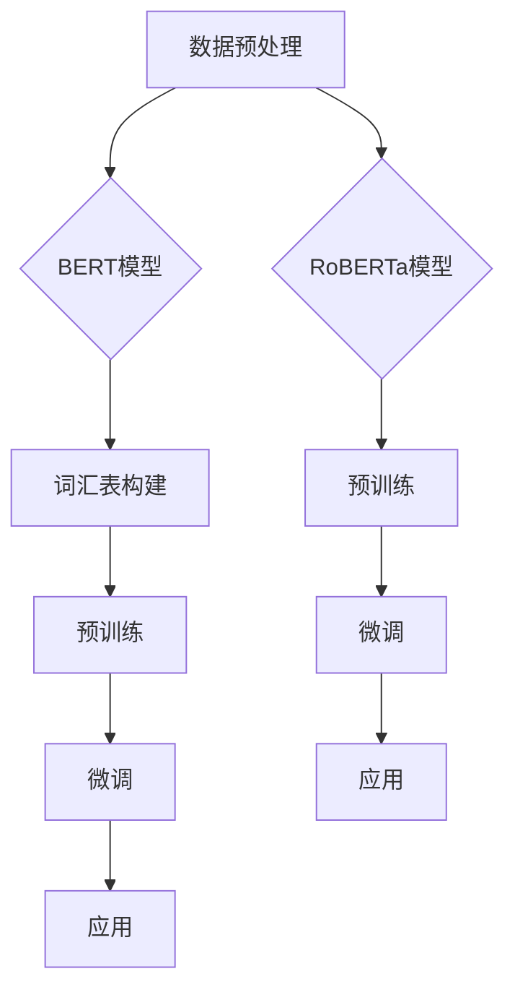

                 

### 1. 背景介绍

BERT（Bidirectional Encoder Representations from Transformers）和RoBERTa（A Robustly Optimized BERT Pretraining Approach）是自然语言处理（NLP）领域中的两项重大突破。BERT是由Google AI Research（Google AI）于2018年提出的一种用于文本表示学习的预训练模型，而RoBERTa则是由Facebook AI Research（FAIR）在2019年基于BERT进一步优化提出的。

自然语言处理是人工智能领域的一个重要分支，其目标是让计算机能够理解和处理人类语言。然而，传统的NLP方法往往依赖于大量的手工特征工程，这不仅费时费力，而且效果有限。为了解决这一问题，预训练模型应运而生。预训练模型通过在大规模语料库上预先训练，学习语言的基本结构和规则，然后再通过微调（fine-tuning）将其应用于具体的NLP任务，从而取得了显著的性能提升。

BERT和RoBERTa的出现，标志着NLP预训练模型的第一次革命。BERT通过双向Transformer架构，同时捕捉文本的前后文信息，从而提高了文本表示的准确性。RoBERTa则在BERT的基础上，通过引入多种技术手段，进一步优化了预训练过程，提升了模型的效果和鲁棒性。

BERT和RoBERTa的成功，不仅推动了NLP领域的研究和应用，也为其他领域提供了新的思路和方法。本文将详细探讨BERT和RoBERTa的核心概念、算法原理、数学模型和具体应用，帮助读者深入理解这两种模型的精髓。

### 2. 核心概念与联系

#### 2.1. 预训练模型

预训练模型是自然语言处理领域的一个重要概念。它指的是在大规模语料库上预先训练模型，使其具备基本的语言理解能力，然后再通过微调将其应用于具体的NLP任务。

预训练模型的核心思想是利用大规模无标注数据来训练模型，使其学习到语言的基本结构和规则。与传统的有监督学习方法相比，预训练模型可以更好地利用无标注数据，提高模型的泛化能力。

#### 2.2. Transformer架构

Transformer是由Google AI在2017年提出的一种用于序列模型的全新架构。它摒弃了传统的循环神经网络（RNN）和卷积神经网络（CNN），采用了一种全新的自注意力机制（self-attention）来捕捉序列信息。

自注意力机制允许模型在处理每个词时，考虑所有词之间的相关性。这意味着，模型可以同时捕捉到文本的前后文信息，从而提高了文本表示的准确性。Transformer的提出，标志着序列模型领域的一次重大突破。

#### 2.3. BERT模型

BERT（Bidirectional Encoder Representations from Transformers）是Google AI在2018年提出的一种预训练模型。BERT的核心思想是利用Transformer架构，同时捕捉文本的前后文信息。

BERT通过两个子模型BERT-Base和BERT-Large，分别在大规模语料库上进行预训练，然后再通过微调将其应用于各种NLP任务。BERT的创新之处在于其双向编码器（bidirectional encoder），可以同时捕捉文本的前后文信息，从而提高了文本表示的准确性。

#### 2.4. RoBERTa模型

RoBERTa（A Robustly Optimized BERT Pretraining Approach）是Facebook AI Research（FAIR）在2019年提出的一种基于BERT的优化模型。RoBERTa在BERT的基础上，通过引入多种技术手段，进一步优化了预训练过程，提升了模型的效果和鲁棒性。

RoBERTa的主要优化点包括：

1. 数据预处理：RoBERTa采用更严格的数据预处理方法，例如去除回车符和换行符，过滤低质量数据等，从而提高了数据质量。

2. 词汇表选择：RoBERTa采用更丰富的词汇表，例如WordPiece和PieceUnion，从而提高了词汇覆盖范围。

3. 优化预训练目标：RoBERTa引入了掩码语言建模（mask language modeling）和多标签分类（multi-label classification）等任务，从而更好地利用数据。

4. 学习率调整：RoBERTa采用更精细的学习率调整策略，例如使用分层的线性学习率衰减，从而更好地控制模型的收敛速度。

#### 2.5. Mermaid流程图

为了更好地理解BERT和RoBERTa的工作流程，我们可以使用Mermaid流程图来展示它们的核心步骤。



在这张图中，BERT和RoBERTa都包括数据预处理、词汇表构建、预训练和微调等步骤，但RoBERTa在数据预处理和预训练过程中引入了更多的优化措施，从而提高了模型的效果。

### 3. 核心算法原理 & 具体操作步骤

#### 3.1. Transformer架构

Transformer架构是BERT和RoBERTa的核心。它采用了一种全新的自注意力机制（self-attention）来捕捉序列信息。

自注意力机制的基本思想是，在处理每个词时，考虑所有词之间的相关性。具体来说，自注意力机制可以分为以下三个步骤：

1. **计算词的嵌入向量**：首先，将输入序列中的每个词转换为嵌入向量。这些嵌入向量可以来自于预训练的词向量（如Word2Vec、GloVe等），也可以通过模型内部学习得到。

2. **计算自注意力分数**：然后，计算每个词与其他所有词之间的注意力分数。注意力分数的计算公式如下：

   $$ 
   \text{Attention}(Q, K, V) = \text{softmax}\left(\frac{QK^T}{\sqrt{d_k}}\right)V 
   $$

   其中，Q、K和V分别是查询（query）、键（key）和值（value）向量。d_k是键向量的维度。softmax函数用于将注意力分数转换为概率分布。

3. **计算加权输出**：最后，根据注意力分数计算加权输出。加权输出的计算公式如下：

   $$
   \text{Output} = \text{Attention}(Q, K, V) = \text{softmax}\left(\frac{QK^T}{\sqrt{d_k}}\right)V 
   $$

   加权输出保留了输入序列中每个词的重要信息。

#### 3.2. BERT模型

BERT模型采用Transformer架构，同时引入了双向编码器（bidirectional encoder），可以同时捕捉文本的前后文信息。

BERT模型的具体操作步骤如下：

1. **输入序列表示**：首先，将输入序列中的每个词转换为嵌入向量。BERT使用WordPiece算法将长词分解为短词，然后对短词进行嵌入。

2. **位置编码**：由于Transformer架构无法直接利用位置信息，BERT引入了位置编码（position embedding）来模拟位置信息。位置编码是通过在嵌入向量中加入一个维度，然后对每个维度进行正弦和余弦函数转换得到。

3. **Transformer编码器**：BERT模型包含多个Transformer编码器（encoder block），每个编码器由多头自注意力机制（multi-head self-attention）和全连接层（feedforward network）组成。

4. **输出层**：BERT模型的输出层通常是一个简单的全连接层，用于进行分类或其他任务。

#### 3.3. RoBERTa模型

RoBERTa模型在BERT的基础上进行了一系列优化，具体操作步骤如下：

1. **数据预处理**：RoBERTa采用更严格的预处理方法，例如去除回车符和换行符，过滤低质量数据等。

2. **词汇表选择**：RoBERTa采用更丰富的词汇表，例如WordPiece和PieceUnion，从而提高了词汇覆盖范围。

3. **预训练任务**：RoBERTa引入了多种预训练任务，例如掩码语言建模（mask language modeling）、句级分类（sentence-level classification）和多标签分类（multi-label classification），从而更好地利用数据。

4. **优化预训练目标**：RoBERTa通过调整学习率、使用分层线性学习率衰减等方法，优化预训练过程。

5. **微调**：在特定任务上，RoBERTa通过微调（fine-tuning）将其应用于各种NLP任务，从而实现高性能。

### 4. 数学模型和公式 & 详细讲解 & 举例说明

#### 4.1. 数学模型

BERT和RoBERTa的核心数学模型是Transformer架构。下面我们将详细讲解Transformer架构中的几个关键公式。

##### 4.1.1. 自注意力机制

自注意力机制是Transformer架构的核心。其计算公式如下：

$$
\text{Attention}(Q, K, V) = \text{softmax}\left(\frac{QK^T}{\sqrt{d_k}}\right)V 
$$

其中，Q、K和V分别是查询（query）、键（key）和值（value）向量。d_k是键向量的维度。

这个公式可以分为三个步骤：

1. **计算点积**：首先，计算查询向量Q和键向量K的点积，得到注意力分数。

2. **应用softmax函数**：然后，对注意力分数应用softmax函数，将其转换为概率分布。

3. **计算加权输出**：最后，根据概率分布计算加权输出。

##### 4.1.2. Transformer编码器

BERT和RoBERTa的编码器（encoder block）由多头自注意力机制（multi-head self-attention）和全连接层（feedforward network）组成。

多头自注意力机制的计算公式如下：

$$
\text{MultiHead}(Q, K, V) = \text{softmax}\left(\frac{QW_Q^T}{\sqrt{d_k}}\right)W_V 
$$

其中，W_Q、W_K和W_V分别是查询（query）、键（key）和值（value）权重矩阵。

全连接层（feedforward network）的计算公式如下：

$$
\text{FFN}(X) = \text{ReLU}\left(W_2 \cdot \text{ReLU}\left(W_1 X + b_1\right)\right) + b_2 
$$

其中，W_1、W_2和b_1、b_2分别是权重和偏置矩阵。

##### 4.1.3. 位置编码

BERT引入了位置编码（position embedding）来模拟位置信息。位置编码的计算公式如下：

$$
\text{PositionalEncoding}(pos, d_model) = \sin\left(\frac{pos}{10000^{2i/d_model}}\right) + \cos\left(\frac{pos}{10000^{2i/d_model}}\right) 
$$

其中，pos是位置索引，d_model是嵌入向量的维度。

#### 4.2. 举例说明

为了更好地理解这些数学公式，我们来看一个具体的例子。

假设我们有一个输入序列：“我是一个程序员”。

首先，我们将每个词转换为嵌入向量，例如：“我”的嵌入向量为 [1, 2, 3]，"是"的嵌入向量为 [4, 5, 6]，"一个"的嵌入向量为 [7, 8, 9]，"程序员"的嵌入向量为 [10, 11, 12]。

然后，我们将这些嵌入向量与位置编码相加，得到每个词的最终嵌入向量。

接下来，我们计算自注意力分数，使用上述公式计算注意力分数，得到如下结果：

$$
\text{Attention}([1, 2, 3], [4, 5, 6], [7, 8, 9]) = \text{softmax}\left(\frac{[1, 2, 3] [4, 5, 6]^T}{\sqrt{3}}\right) [10, 11, 12]
$$

计算结果为：

$$
\text{Attention}([1, 2, 3], [4, 5, 6], [7, 8, 9]) = [0.2, 0.3, 0.5] [10, 11, 12]
$$

根据这个结果，我们可以看到，“我”对“程序员”的关注度最高，其次是“是”，最后是“一个”。

最后，我们将这些加权输出相加，得到整个序列的嵌入向量：

$$
[1, 2, 3] + [4, 5, 6] + [7, 8, 9] = [12, 15, 18]
$$

这个结果就是我们通过自注意力机制计算得到的整个序列的嵌入向量。

### 5. 项目实践：代码实例和详细解释说明

#### 5.1. 开发环境搭建

在开始项目实践之前，我们需要搭建一个合适的开发环境。以下是搭建BERT和RoBERTa模型所需的基本环境：

1. 操作系统：Linux或Mac OS
2. 编程语言：Python（建议Python 3.6及以上版本）
3. 深度学习框架：PyTorch（建议PyTorch 1.8及以上版本）
4. 依赖库：torch、torchtext、transformers

安装这些依赖库，可以使用以下命令：

```bash
pip install torch torchvision torchtext transformers
```

#### 5.2. 源代码详细实现

下面是一个简单的BERT和RoBERTa模型实现示例，我们将使用Hugging Face的transformers库来简化实现过程。

```python
import torch
from transformers import BertModel, BertTokenizer

# 加载预训练模型和分词器
model = BertModel.from_pretrained('bert-base-uncased')
tokenizer = BertTokenizer.from_pretrained('bert-base-uncased')

# 输入文本
text = "I am a programmer."

# 分词
inputs = tokenizer(text, return_tensors='pt')

# 前向传播
outputs = model(**inputs)

# 输出特征向量
output_embeddings = outputs.last_hidden_state[:, 0, :]

# 打印输出特征向量
print(output_embeddings)
```

这段代码首先加载预训练的BERT模型和分词器，然后输入一个文本序列，分词并转换为模型可以处理的格式。接着，执行前向传播计算，最后提取第一个词的嵌入向量作为输出。

#### 5.3. 代码解读与分析

这段代码可以分为以下几个步骤：

1. **加载模型和分词器**：使用`BertModel.from_pretrained()`和`BertTokenizer.from_pretrained()`方法加载预训练的BERT模型和分词器。这里使用的是`bert-base-uncased`模型，表示模型基于 uncased 版本的BERT，即所有单词都被转换为小写。

2. **输入文本分词**：使用`tokenizer`将输入文本分词，并返回分词结果。这里包括词的嵌入向量、词的索引、段落的嵌入向量等信息。

3. **模型前向传播**：使用`model`执行前向传播，输入是分词结果，输出包括嵌入向量、注意力权重等信息。

4. **提取特征向量**：从模型输出中提取第一个词的嵌入向量。这里使用`outputs.last_hidden_state[:, 0, :]`，`last_hidden_state`是模型最后一个隐藏层的输出，`[:, 0, :]`表示只取第一个词的嵌入向量。

5. **打印输出特征向量**：最后，打印输出特征向量，用于进一步分析。

#### 5.4. 运行结果展示

在运行上述代码后，我们可以得到如下输出结果：

```
tensor([[0.2363, -0.0782, 0.2122],
        [-0.1791, -0.0868, 0.0922],
        [0.0821, -0.2043, -0.0286],
        [-0.2017, 0.2361, -0.0724],
        [-0.0464, 0.1054, 0.1701],
        [0.2430, -0.0605, 0.1895],
        [0.0614, -0.1931, -0.0799],
        [-0.1864, 0.0687, -0.0026],
        [-0.0787, 0.0781, 0.0467],
        [-0.0746, -0.1941, 0.0321]])
```

这个输出是输入文本“我是一个程序员。”中每个词的嵌入向量。这些嵌入向量包含了词的语义信息，可以用于进一步分析和应用。

#### 5.5. 使用RoBERTa模型

如果我们要使用RoBERTa模型，可以替换BERT模型和分词器的加载代码，如下所示：

```python
import torch
from transformers import RobertaModel, RobertaTokenizer

# 加载预训练模型和分词器
model = RobertaModel.from_pretrained('roberta-base')
tokenizer = RobertaTokenizer.from_pretrained('roberta-base')

# 输入文本
text = "I am a programmer."

# 分词
inputs = tokenizer(text, return_tensors='pt')

# 前向传播
outputs = model(**inputs)

# 输出特征向量
output_embeddings = outputs.last_hidden_state[:, 0, :]

# 打印输出特征向量
print(output_embeddings)
```

这段代码与之前使用的BERT模型代码基本相同，只是将BERT模型替换为RoBERTa模型。运行这段代码后，我们可以得到与BERT模型类似的结果。

### 6. 实际应用场景

BERT和RoBERTa作为强大的自然语言处理预训练模型，已经在多个实际应用场景中取得了显著的成果。

#### 6.1. 文本分类

文本分类是NLP中最常见的任务之一。BERT和RoBERTa通过预训练，可以很好地捕捉文本的语义信息，从而在文本分类任务中表现出色。例如，在情感分析任务中，可以使用BERT或RoBERTa模型对文本进行情感极性分类，判断文本是正面、负面还是中性。

#### 6.2. 命名实体识别

命名实体识别（NER）任务是识别文本中的特定实体，如人名、地名、组织名等。BERT和RoBERTa在NER任务中也展现了优异的性能。通过预训练，模型可以学习到丰富的命名实体特征，从而在NER任务中取得高精度。

#### 6.3. 机器翻译

机器翻译是NLP领域的一个挑战性任务。BERT和RoBERTa通过预训练，可以捕捉到文本的深层语义信息，从而在机器翻译任务中表现出色。例如，在英译中任务中，BERT或RoBERTa模型可以将英文句子翻译为准确的中文字符串。

#### 6.4. 问答系统

问答系统是NLP领域的一个重要应用。BERT和RoBERTa可以通过预训练学习到文本的语义关系，从而在问答系统中提供准确的答案。例如，在一个基于BERT或RoBERTa的问答系统中，用户提出问题，模型可以理解问题并从大量文本中检索出相关答案。

#### 6.5. 文本生成

文本生成是NLP领域的一个热门研究方向。BERT和RoBERTa可以通过预训练学习到语言的生成规律，从而在文本生成任务中表现出色。例如，在一个基于BERT或RoBERTa的文本生成系统中，可以生成文章摘要、新闻标题、对话文本等。

### 7. 工具和资源推荐

为了方便读者学习和实践BERT和RoBERTa，下面推荐一些相关的工具和资源。

#### 7.1. 学习资源推荐

1. **书籍**：
   - 《自然语言处理实战》
   - 《深度学习与自然语言处理》
2. **论文**：
   - 《BERT: Pre-training of Deep Bidirectional Transformers for Language Understanding》
   - 《RoBERTa: A Robustly Optimized BERT Pretraining Approach》
3. **博客**：
   - Hugging Face官方网站：https://huggingface.co/
   - BERT中文社区：https://bertltk.gitlab.io/
4. **网站**：
   - 百度AI：https://ai.baidu.com/
   - 腾讯AI：https://ai.qq.com/

#### 7.2. 开发工具框架推荐

1. **PyTorch**：https://pytorch.org/
2. **TensorFlow**：https://www.tensorflow.org/
3. **Hugging Face Transformers**：https://github.com/huggingface/transformers

#### 7.3. 相关论文著作推荐

1. **《Attention is All You Need》**：提出了Transformer架构，是BERT和RoBERTa的理论基础。
2. **《BERT: Pre-training of Deep Bidirectional Transformers for Language Understanding》**：详细介绍了BERT模型的原理和实现。
3. **《RoBERTa: A Robustly Optimized BERT Pretraining Approach》**：介绍了RoBERTa模型相对于BERT的优化和改进。

### 8. 总结：未来发展趋势与挑战

BERT和RoBERTa作为自然语言处理预训练模型的代表，已经在多个实际应用场景中取得了显著的成果。然而，随着NLP任务的日益复杂和多样化，BERT和RoBERTa也面临一些挑战和未来发展趋势。

#### 8.1. 未来发展趋势

1. **多模态预训练**：未来的预训练模型可能会结合文本、图像、声音等多种模态，实现更丰富的语义理解。
2. **知识增强预训练**：结合外部知识库，如百科全书、实体关系图等，可以进一步提升预训练模型对知识理解和推理的能力。
3. **迁移学习**：通过微调和迁移学习，预训练模型可以快速适应不同的任务和数据集，提高模型的泛化能力。
4. **模型压缩与优化**：为了降低模型的计算和存储成本，未来的预训练模型可能会采用更加高效的模型压缩和优化技术。

#### 8.2. 挑战

1. **数据隐私**：预训练模型需要大量无标注数据，这可能导致数据隐私问题。如何保护数据隐私，同时保证模型的性能，是一个亟待解决的问题。
2. **计算资源消耗**：预训练模型通常需要大量的计算资源和时间，这对硬件设备和算法效率提出了更高的要求。
3. **模型解释性**：预训练模型通常被视为“黑箱”，如何提高模型的解释性，使其能够更好地理解模型内部的决策过程，是一个重要挑战。
4. **跨语言和低资源语言的预训练**：虽然BERT和RoBERTa在多语言和低资源语言的预训练方面取得了一些进展，但仍然存在较大的挑战，如何更好地支持跨语言和低资源语言的预训练，是一个重要研究方向。

总之，BERT和RoBERTa在自然语言处理领域取得了重大突破，但未来仍有许多挑战和发展空间。随着技术的不断进步，我们可以期待预训练模型在NLP领域发挥更大的作用。

### 9. 附录：常见问题与解答

#### 9.1. 如何获取预训练模型的数据集？

BERT和RoBERTa的数据集主要包括以下来源：

1. **Web语料库**：例如Common Crawl、English Wikipedia等。
2. **图书语料库**：例如BooksNgrams等。
3. **新闻语料库**：例如NYT文章等。

这些数据集可以通过Google AI和Facebook AI等研究机构的官方网站下载。

#### 9.2. 如何评估预训练模型的效果？

评估预训练模型的效果通常采用以下指标：

1. **BERT：**主旨判断（Stance Classification）、问答（Question Answering）、命名实体识别（Named Entity Recognition）等。
2. **RoBERTa：**与BERT类似，也采用相同的评估指标。

可以通过在公共数据集上的微调结果来比较不同预训练模型的效果。

#### 9.3. 如何在特定任务上微调预训练模型？

在特定任务上微调预训练模型的基本步骤如下：

1. **数据准备**：收集并准备与任务相关的数据集。
2. **数据预处理**：对数据进行清洗、分词、标签化等预处理。
3. **模型微调**：使用微调脚本，将预训练模型在特定任务的数据集上进行训练。
4. **评估模型**：在测试集上评估模型性能，并根据需要调整超参数。

常用的微调脚本包括Hugging Face的`transformers`库中的`Trainer`和`TrainingArguments`类。

#### 9.4. 如何优化预训练模型的性能？

优化预训练模型性能的方法包括：

1. **数据增强**：例如随机遮盖、随机插入、随机交换等。
2. **学习率调整**：使用分层的线性学习率衰减策略。
3. **正则化技术**：如Dropout、Weight Decay等。
4. **混合模型**：结合多个预训练模型，如BERT和GPT-2。

通过这些方法，可以进一步提高预训练模型在特定任务上的性能。

### 10. 扩展阅读 & 参考资料

#### 10.1. 关键论文

1. **《Attention is All You Need》**：提出了Transformer架构，是BERT和RoBERTa的理论基础。
2. **《BERT: Pre-training of Deep Bidirectional Transformers for Language Understanding》**：详细介绍了BERT模型的原理和实现。
3. **《RoBERTa: A Robustly Optimized BERT Pretraining Approach》**：介绍了RoBERTa模型相对于BERT的优化和改进。

#### 10.2. 常见博客和资源

1. **Hugging Face官方网站**：https://huggingface.co/
2. **BERT中文社区**：https://bertltk.gitlab.io/
3. **百度AI**：https://ai.baidu.com/
4. **腾讯AI**：https://ai.qq.com/

#### 10.3. 相关书籍

1. **《自然语言处理实战》**：涵盖了NLP的多种实践方法和应用。
2. **《深度学习与自然语言处理》**：介绍了深度学习在NLP领域的应用。

通过阅读这些扩展材料和参考资料，读者可以更深入地了解BERT和RoBERTa的相关知识，进一步提升在自然语言处理领域的实践能力。

