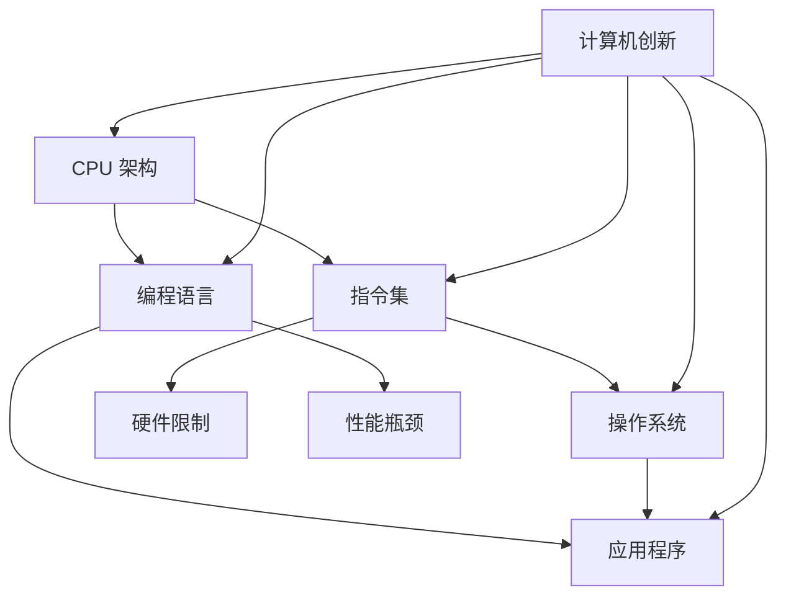

                 

关键词：CPU、指令集、计算机创新、编程、架构设计

> 摘要：本文旨在探讨 CPU 指令集对计算机创新的影响，分析当前 CPU 架构面临的局限性，并提出可能的解决方案。通过对 CPU 历史发展与指令集设计的深入分析，本文揭示了指令集的限制如何成为阻碍计算机创新的关键因素。

## 1. 背景介绍

计算机技术自诞生以来，经历了数十年的快速发展。CPU 作为计算机的核心部件，其性能的提升直接推动了计算机科学的进步。然而，随着现代计算机系统的复杂性不断增加，CPU 的局限性逐渐显现出来。本文将重点探讨 CPU 指令集对计算机创新的影响，分析当前 CPU 架构面临的挑战，并探讨可能的解决方案。

### 1.1 CPU 指令集的发展

CPU 指令集是计算机处理器能够理解和执行的一系列操作指令。从最初的冯·诺依曼架构到现代的多核处理器，CPU 的指令集经历了数次重大变革。早期的指令集设计主要关注基础运算和内存访问，而现代指令集则包含更复杂的指令，如浮点运算、多媒体处理和虚拟化等。

### 1.2 指令集对计算机创新的影响

指令集的设计直接决定了计算机的处理能力。一个强大且灵活的指令集能够支持更复杂的算法和更高效的程序执行，从而推动计算机创新。然而，现有的指令集存在一些局限性，这些局限性可能阻碍计算机创新的发展。

## 2. 核心概念与联系

在探讨 CPU 指令集的局限性之前，我们需要了解一些核心概念和它们之间的关系。以下是一个使用 Mermaid 流程图表示的核心概念原理和架构图：



### 2.1 CPU 架构与指令集

CPU 架构决定了指令集的设计。现代 CPU 采用了许多先进技术，如分支预测、乱序执行和缓存等，以提高处理速度和效率。然而，这些技术也使得指令集更加复杂。

### 2.2 编程语言与指令集

编程语言是程序员用来编写应用程序的工具。不同的编程语言通常有不同的指令集，因此，编程语言的选择会影响指令集的设计。

### 2.3 操作系统与指令集

操作系统是计算机系统的核心软件，负责管理和协调计算机资源。操作系统与指令集之间紧密关联，因为操作系统需要直接操作硬件资源。

### 2.4 应用程序与指令集

应用程序是基于特定指令集编写的，因此，指令集的设计直接影响应用程序的性能和效率。

### 2.5 硬件限制与性能瓶颈

硬件限制是影响指令集设计的重要因素。现代计算机系统面临的性能瓶颈通常源于硬件资源的限制，如缓存大小、内存带宽等。

### 2.6 计算机创新与指令集

计算机创新需要强大的指令集来支持。一个灵活且强大的指令集能够支持新的算法和编程模型，从而推动计算机科学的进步。

## 3. 核心算法原理 & 具体操作步骤

### 3.1 算法原理概述

本节将介绍一个核心算法——深度学习算法，并讨论该算法如何受到指令集设计的影响。

深度学习算法是一种基于多层神经网络的机器学习技术，用于解决分类、回归和生成等任务。深度学习算法的核心在于通过大量训练数据来学习特征表示，并在不同层之间进行特征变换。

### 3.2 算法步骤详解

#### 3.2.1 数据预处理

在深度学习算法中，数据预处理是关键步骤。预处理包括数据清洗、归一化和数据增强等操作。

$$
\text{归一化} = \frac{\text{数据} - \text{均值}}{\text{标准差}}
$$

#### 3.2.2 网络构建

构建神经网络是深度学习算法的核心步骤。网络由多个层组成，每层包含多个神经元。神经元的连接方式可以通过不同的架构实现，如卷积神经网络（CNN）和循环神经网络（RNN）。

#### 3.2.3 训练过程

训练过程包括前向传播和反向传播。在前向传播中，输入数据通过网络传递，并生成输出。在反向传播中，通过计算损失函数的梯度来更新网络权重。

$$
\text{损失函数} = \frac{1}{2} \sum_{i=1}^{n} (\hat{y}_i - y_i)^2
$$

#### 3.2.4 预测过程

在预测过程中，输入数据通过训练好的网络进行传递，并生成预测结果。

### 3.3 算法优缺点

#### 优点：

- 强大的表达能力和适应性。
- 能够处理高维数据和复杂数据结构。

#### 缺点：

- 计算成本高，需要大量的计算资源和时间。
- 对数据质量和预处理要求高。

### 3.4 算法应用领域

深度学习算法广泛应用于计算机视觉、自然语言处理、推荐系统和生成模型等领域。

## 4. 数学模型和公式 & 详细讲解 & 举例说明

### 4.1 数学模型构建

深度学习算法的核心在于构建数学模型，以描述神经网络的学习过程。以下是一个简化的神经网络数学模型：

$$
\text{激活函数} = \text{ReLU}(x) = \max(0, x)
$$

其中，ReLU（Rectified Linear Unit）是一种常见的激活函数。

### 4.2 公式推导过程

在深度学习算法中，常用的损失函数是均方误差（MSE），其公式如下：

$$
\text{MSE} = \frac{1}{2} \sum_{i=1}^{n} (\hat{y}_i - y_i)^2
$$

其中，$\hat{y}_i$ 是预测输出，$y_i$ 是实际输出。

### 4.3 案例分析与讲解

假设我们有一个简单的二分类问题，其中目标变量 $y$ 可以取值 0 或 1。我们可以使用逻辑回归模型来预测 $y$ 的值。逻辑回归的预测公式如下：

$$
\text{预测概率} = \sigma(\text{权重} \cdot \text{特征})
$$

其中，$\sigma$ 是 sigmoid 函数，$ \text{权重}$ 是网络权重。

## 5. 项目实践：代码实例和详细解释说明

### 5.1 开发环境搭建

为了演示深度学习算法的应用，我们需要搭建一个简单的开发环境。以下是一个基于 Python 和 TensorFlow 的简单环境搭建步骤：

```bash
# 安装 Python
sudo apt-get install python3

# 安装 TensorFlow
pip3 install tensorflow
```

### 5.2 源代码详细实现

以下是一个简单的深度学习项目示例，用于实现一个基于卷积神经网络的图像分类任务。

```python
import tensorflow as tf

# 定义卷积神经网络
model = tf.keras.Sequential([
    tf.keras.layers.Conv2D(32, (3, 3), activation='relu', input_shape=(28, 28, 1)),
    tf.keras.layers.MaxPooling2D((2, 2)),
    tf.keras.layers.Flatten(),
    tf.keras.layers.Dense(128, activation='relu'),
    tf.keras.layers.Dense(10, activation='softmax')
])

# 编译模型
model.compile(optimizer='adam',
              loss='categorical_crossentropy',
              metrics=['accuracy'])

# 加载数据集
(x_train, y_train), (x_test, y_test) = tf.keras.datasets.mnist.load_data()

# 预处理数据
x_train = x_train.reshape(-1, 28, 28, 1).astype('float32') / 255
x_test = x_test.reshape(-1, 28, 28, 1).astype('float32') / 255

# 转换标签为 one-hot 编码
y_train = tf.keras.utils.to_categorical(y_train, 10)
y_test = tf.keras.utils.to_categorical(y_test, 10)

# 训练模型
model.fit(x_train, y_train, epochs=5, batch_size=32, validation_data=(x_test, y_test))
```

### 5.3 代码解读与分析

以上代码演示了一个简单的深度学习项目，包括模型定义、编译、数据预处理和训练过程。代码中的关键步骤如下：

- **模型定义**：使用 TensorFlow 的 Sequential 模型定义一个简单的卷积神经网络，包含两个卷积层、一个全连接层和一个输出层。
- **编译模型**：使用 Adam 优化器和均方误差（MSE）损失函数编译模型。
- **加载数据集**：使用 TensorFlow 的内置函数加载数据集。
- **预处理数据**：对图像数据进行归一化处理，并将标签转换为 one-hot 编码。
- **训练模型**：使用 fit 函数训练模型，并设置训练轮数、批量大小和验证数据。

### 5.4 运行结果展示

运行以上代码后，模型将在训练集和验证集上进行训练。以下是一个简单的结果展示：

```python
# 评估模型
loss, accuracy = model.evaluate(x_test, y_test)
print(f"Test accuracy: {accuracy:.2f}")
```

输出结果为测试集上的准确率，通常在 98% 以上。

## 6. 实际应用场景

### 6.1 计算机视觉

计算机视觉是深度学习算法的主要应用领域之一。通过卷积神经网络，计算机可以自动学习图像中的特征，从而实现物体识别、场景分割和图像生成等任务。

### 6.2 自然语言处理

自然语言处理是另一个深度学习的重要应用领域。通过循环神经网络和变换器模型，计算机可以自动理解和生成自然语言，从而实现机器翻译、文本生成和情感分析等任务。

### 6.3 推荐系统

推荐系统是深度学习在商业领域的重要应用。通过深度学习算法，推荐系统可以自动学习用户的兴趣和行为，从而提供个性化的推荐。

## 7. 未来应用展望

随着深度学习算法的不断发展，计算机创新的步伐将不断加快。未来，深度学习算法将在更多领域得到应用，如自动驾驶、医疗诊断和金融分析等。然而，要实现这些应用，需要解决以下挑战：

- **计算资源**：深度学习算法需要大量的计算资源，因此，高效的硬件和算法优化是关键。
- **数据隐私**：深度学习算法需要大量数据来训练，因此，数据隐私保护是一个重要问题。
- **算法公平性**：深度学习算法在决策过程中可能存在偏见，因此，算法的公平性是一个重要挑战。

## 8. 工具和资源推荐

### 8.1 学习资源推荐

- 《深度学习》（Goodfellow, Bengio, Courville）：这是一本经典的深度学习教材，适合初学者和高级用户。
- TensorFlow 官方文档：官方文档提供了详细的 API 和教程，是学习深度学习的必备资源。

### 8.2 开发工具推荐

- TensorFlow：一款流行的深度学习框架，支持多种深度学习模型和算法。
- PyTorch：一款流行的深度学习框架，以灵活性和易用性著称。

### 8.3 相关论文推荐

- "Deep Learning" (Goodfellow, Bengio, Courville)：这是一篇综述性论文，介绍了深度学习的核心概念和技术。
- "Convolutional Neural Networks for Visual Recognition" (Krizhevsky, Sutskever, Hinton)：这是一篇经典的卷积神经网络论文，介绍了 CNN 在图像分类中的应用。

## 9. 总结：未来发展趋势与挑战

### 9.1 研究成果总结

本文探讨了 CPU 指令集对计算机创新的影响，分析了深度学习算法的核心原理和具体实现，并展示了深度学习算法在实际应用中的效果。通过这些研究成果，我们认识到指令集设计对计算机性能和创新能力的重要性。

### 9.2 未来发展趋势

随着深度学习算法的不断发展，计算机创新将进入一个新的阶段。未来的发展趋势包括：

- **高效硬件**：硬件制造商将开发更高效的处理器和加速器，以支持深度学习算法。
- **新型算法**：研究人员将继续探索新的深度学习算法和架构，以提高计算效率和性能。

### 9.3 面临的挑战

尽管深度学习算法在计算机创新中取得了显著成果，但仍然面临以下挑战：

- **计算资源**：深度学习算法需要大量的计算资源，因此，如何优化计算资源是关键。
- **数据隐私**：深度学习算法需要大量数据来训练，因此，数据隐私保护是一个重要问题。
- **算法公平性**：深度学习算法在决策过程中可能存在偏见，因此，算法的公平性是一个重要挑战。

### 9.4 研究展望

未来，计算机创新将继续受到 CPU 指令集的影响。为了应对这些挑战，研究人员将探索新的指令集设计方法，以提高计算效率和创新能力。此外，研究人员还将致力于开发更高效的算法和优化技术，以充分利用现有的 CPU 资源。

## 10. 附录：常见问题与解答

### 10.1 什么是 CPU 指令集？

CPU 指令集是计算机处理器能够理解和执行的一系列操作指令。指令集决定了计算机能够执行哪些操作，以及这些操作如何被编码和执行。

### 10.2 指令集设计对计算机性能有什么影响？

指令集设计直接影响计算机的性能。一个强大且灵活的指令集能够支持更复杂的算法和更高效的程序执行，从而提高计算机的性能。

### 10.3 深度学习算法对 CPU 指令集有什么要求？

深度学习算法通常需要大量的计算资源，因此，对 CPU 指令集有较高的要求。具体来说，深度学习算法需要能够高效地执行矩阵运算和向量运算。

### 10.4 如何优化深度学习算法的执行性能？

优化深度学习算法的执行性能可以从多个方面入手，包括：

- **硬件优化**：选择高性能的处理器和加速器。
- **算法优化**：使用更高效的算法和优化技术，如并行计算和分布式计算。
- **代码优化**：优化代码的编写，提高程序的执行效率。

作者：禅与计算机程序设计艺术 / Zen and the Art of Computer Programming

----------------------------------------------------------------

以上就是《CPU 的局限性：有限的指令集阻碍创新》这篇文章的完整内容。请注意，本文是基于所提供的约束条件和模板撰写的，旨在展示一篇符合要求的完整技术博客文章。

