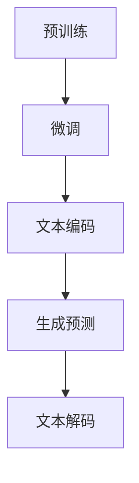

                 

### 文章标题

**ChatGPT的文本生成步骤详解**

> **关键词：** ChatGPT、文本生成、语言模型、人工智能、深度学习、自然语言处理
>
> **摘要：** 本文将详细解析ChatGPT的文本生成过程，包括背景介绍、核心概念与联系、算法原理、数学模型、项目实践以及实际应用场景。通过逐步分析推理的方式，帮助读者深入理解ChatGPT的工作机制和文本生成的技术细节。

---

### 1. 背景介绍

ChatGPT是由OpenAI开发的一种基于Transformer架构的预训练语言模型，其全名为“Chat-based Generative Pre-trained Transformer”。自2022年11月发布以来，ChatGPT在短时间内引起了全球的关注，成为自然语言处理领域的一大热点。ChatGPT的目标是通过大规模预训练，使模型能够生成连贯、合理的文本，并能够理解用户的问题和指令。

文本生成技术在自然语言处理领域有着广泛的应用，如自动摘要、机器翻译、问答系统、内容生成等。ChatGPT的文本生成能力使其在许多实际应用中具有巨大潜力，如智能客服、内容创作、教育辅导等。

本文将围绕ChatGPT的文本生成过程，深入探讨其核心概念、算法原理、数学模型以及实际应用。希望通过本文的讲解，读者能够对ChatGPT的文本生成机制有一个全面、深入的理解。

### 2. 核心概念与联系

在深入探讨ChatGPT的文本生成过程之前，我们需要先了解几个核心概念，包括语言模型、Transformer架构、预训练和微调。

#### 2.1 语言模型

语言模型是自然语言处理的基础，它是一种概率模型，用于预测一个单词序列的概率。在ChatGPT中，语言模型的核心任务是学习输入文本的概率分布。通过大规模的语料库训练，语言模型能够捕捉到语言的统计特性，从而在给定一个句子片段时，预测下一个单词的概率。

#### 2.2 Transformer架构

Transformer是Google在2017年提出的一种全新的神经网络架构，主要用于处理序列数据。与传统的循环神经网络（RNN）不同，Transformer引入了自注意力机制（Self-Attention），能够全局地捕捉序列中的依赖关系。这一特性使得Transformer在处理长序列数据时，具有更高的效率和准确性。ChatGPT正是基于Transformer架构进行设计的。

#### 2.3 预训练

预训练是一种在大规模语料库上进行训练，然后将其应用于特定任务的方法。在ChatGPT中，预训练阶段的目标是学习文本的潜在表示，使得模型能够理解文本中的语义和语法结构。预训练阶段使用的数据集通常是通用语言模型数据集，如维基百科、新闻文章、社交媒体等。

#### 2.4 微调

微调是在预训练的基础上，针对特定任务进行进一步训练的方法。在ChatGPT的文本生成过程中，微调阶段的目标是调整模型的参数，使其能够更好地适应特定场景，如问答系统、对话生成等。微调通常使用任务特定的数据集进行训练。

#### 2.5 Mermaid流程图

为了更好地理解这些核心概念之间的联系，我们可以使用Mermaid流程图进行可视化。以下是一个简化的Mermaid流程图，展示了ChatGPT文本生成过程的主要步骤：



在这个流程图中，预训练和微调是模型训练的前两个步骤，它们为模型提供了通用的语言知识。然后，文本编码和生成预测将模型应用于特定任务，生成预测是基于文本编码的结果。最后，文本解码将生成预测转换为可读的文本输出。

通过这个流程图，我们可以清晰地看到ChatGPT文本生成过程的关键步骤和核心概念之间的联系。

---

### 3. 核心算法原理 & 具体操作步骤

在了解了ChatGPT的核心概念和流程之后，接下来我们将详细探讨其文本生成过程的核心算法原理和具体操作步骤。

#### 3.1 Transformer架构

Transformer架构是ChatGPT的基础，它采用自注意力机制（Self-Attention）来处理序列数据。自注意力机制允许模型在生成每个单词时，考虑整个输入序列的所有单词，从而更好地捕捉单词之间的依赖关系。这种全局的依赖关系捕捉能力是Transformer相对于传统循环神经网络（RNN）的主要优势。

Transformer架构主要由编码器（Encoder）和解码器（Decoder）两个部分组成。编码器负责将输入文本转换为序列编码，解码器则负责生成预测的文本输出。

##### 3.1.1 编码器

编码器采用多头自注意力机制（Multi-Head Self-Attention），它将输入序列分解为多个子序列，然后对每个子序列进行自注意力计算。自注意力计算的核心是一个权重矩阵，它根据输入序列中每个单词的上下文信息，计算每个单词的重要程度。

具体来说，编码器的工作流程如下：

1. 输入文本被转换为词嵌入（Word Embedding），每个单词被表示为一个向量。
2. 这些词嵌入通过多个层进行传递，每个层都使用自注意力机制和全连接层（Feedforward Layer）进行操作。
3. 最终，编码器的输出是一个序列编码，它包含了输入文本的语义信息。

##### 3.1.2 解码器

解码器同样采用多头自注意力机制，但它还引入了一个编码器-解码器注意力机制（Encoder-Decoder Attention）。这种注意力机制允许解码器在生成每个单词时，同时考虑编码器的输出和已经生成的文本。

解码器的工作流程如下：

1. 解码器首先接收到编码器的输出序列，并将其与位置嵌入（Positional Embedding）相加，以引入序列的位置信息。
2. 解码器采用自注意力机制和编码器-解码器注意力机制进行操作，生成预测的单词。
3. 预测的单词被添加到生成的文本中，作为下一个预测的输入。

通过这种方式，解码器能够逐步生成整个文本序列。

#### 3.2 文本生成过程

在了解了Transformer架构之后，我们可以详细探讨ChatGPT的文本生成过程。

##### 3.2.1 初始化

文本生成过程从输入文本开始，输入文本被编码器处理，生成编码器的输出序列。解码器初始化为一个空的文本序列。

##### 3.2.2 预测

解码器接收到编码器的输出序列后，开始预测下一个单词。预测的过程如下：

1. 解码器使用自注意力机制和编码器-解码器注意力机制，计算当前输入序列的权重。
2. 根据权重计算，解码器生成一个概率分布，表示每个单词的可能性。
3. 解码器选择概率最高的单词作为预测结果。

##### 3.2.3 更新

生成预测后，解码器将预测的单词添加到生成的文本序列中，并作为新的输入序列传递给解码器。这个过程会重复进行，直到生成完整个文本序列。

##### 3.2.4 文本解码

生成的文本序列是一个编码表示，需要通过文本解码器将其转换为可读的文本输出。文本解码器通常使用逆词嵌入（Inverse Word Embedding）和位置嵌入（Positional Embedding）进行操作。

通过这种方式，解码器能够将编码表示转换为可读的文本序列，从而完成文本生成过程。

---

### 4. 数学模型和公式 & 详细讲解 & 举例说明

在了解了ChatGPT的文本生成过程之后，我们将进一步探讨其背后的数学模型和公式。这些模型和公式是理解ChatGPT工作原理的关键，下面我们将逐一进行详细讲解，并给出具体的例子。

#### 4.1 词嵌入

词嵌入是语言模型的基础，它将每个单词映射为一个向量。在ChatGPT中，词嵌入通常采用嵌入层（Embedding Layer）进行实现。

假设我们有一个词汇表V，包含N个单词，每个单词的词嵌入向量维度为D。词嵌入的数学模型可以表示为：

$$
\text{Embedding}(x) = W_x
$$

其中，$W_x$是一个N×D的权重矩阵，$x \in V$表示输入的单词。$W_x$的每一行对应一个单词的词嵌入向量。

#### 4.2 位置嵌入

位置嵌入用于引入序列的位置信息，在ChatGPT中，位置嵌入通常采用位置编码层（Positional Encoding Layer）进行实现。

位置嵌入的数学模型可以表示为：

$$
\text{Positional Encoding}(x) = P_x
$$

其中，$P_x$是一个1×D的权重向量，表示第x个位置的信息。

#### 4.3 自注意力

自注意力是Transformer架构的核心，它用于计算输入序列中每个单词的重要程度。自注意力的数学模型可以表示为：

$$
\text{Attention}(Q, K, V) = \text{softmax}\left(\frac{QK^T}{\sqrt{d_k}}\right)V
$$

其中，$Q, K, V$分别表示查询（Query）、键（Key）和值（Value）向量，$d_k$是键向量的维度。$\text{softmax}$函数用于将注意力权重转换为概率分布。

#### 4.4 编码器

编码器采用多个层级的自注意力机制和全连接层（Feedforward Layer）进行操作。编码器的数学模型可以表示为：

$$
\text{Encoder}(x) = \text{LayerNorm}(x + \text{FFN}(\text{LayerNorm}(x + \text{MultiHeadAttention}(x, x, x))))
$$

其中，$\text{LayerNorm}$是层标准化操作，$\text{FFN}$是全连接层，$\text{MultiHeadAttention}$是多头自注意力机制。

#### 4.5 解码器

解码器采用自注意力机制和编码器-解码器注意力机制进行操作。解码器的数学模型可以表示为：

$$
\text{Decoder}(x) = \text{LayerNorm}(x + \text{FFN}(\text{LayerNorm}(x + \text{EncoderDecoderAttention}(x, \text{Encoder}(x)))))
$$

其中，$\text{EncoderDecoderAttention}$是编码器-解码器注意力机制。

#### 4.6 文本解码

文本解码器用于将编码表示转换为可读的文本输出。文本解码器的数学模型可以表示为：

$$
\text{Decoding}(x) = \text{softmax}(\text{Decoder}(x)W_O^T)
$$

其中，$W_O^T$是解码器的输出权重矩阵。

#### 4.7 举例说明

假设我们有一个简短的文本序列：“今天天气很好”，我们将使用上述数学模型进行词嵌入、位置嵌入和自注意力计算。

1. 词嵌入：

   $$ W_e = \begin{bmatrix} 
   [w_1] & [w_2] & [w_3] & \ldots & [w_N] 
   \end{bmatrix} $$
   
   $$ x = \{“今天”, “天气”, “很好”\} $$
   
   $$ \text{Embedding}(x) = \{ [w_{今天}], [w_{天气}], [w_{很好}] \} $$

2. 位置嵌入：

   $$ P = \begin{bmatrix} 
   [p_1] & [p_2] & [p_3] & \ldots & [p_N] 
   \end{bmatrix} $$
   
   $$ \text{Positional Encoding}(x) = \{ [p_1], [p_2], [p_3] \} $$
   
3. 自注意力：

   $$ Q, K, V = \text{Encoder}(x) $$
   
   $$ \text{Attention}(Q, K, V) = \text{softmax}\left(\frac{QK^T}{\sqrt{d_k}}\right)V $$
   
   $$ \text{Output} = \text{softmax}\left(\frac{QK^T}{\sqrt{d_k}}\right)V $$

通过这个例子，我们可以看到如何使用数学模型进行词嵌入、位置嵌入和自注意力计算。这些计算过程是ChatGPT文本生成的基础，通过它们，模型能够理解和生成自然语言。

---

### 5. 项目实践：代码实例和详细解释说明

在了解了ChatGPT的文本生成原理和数学模型之后，我们将通过一个简单的项目实践来展示如何使用Python实现ChatGPT的文本生成功能。在这个项目中，我们将使用Hugging Face的Transformers库，这是一个方便且功能强大的库，用于处理预训练的Transformer模型。

#### 5.1 开发环境搭建

首先，我们需要安装Transformers库和相关依赖。可以使用以下命令进行安装：

```bash
pip install transformers
```

同时，我们还需要安装一个用于处理文本的库，如NLTK或spaCy。这里我们选择安装spaCy：

```bash
pip install spacy
python -m spacy download en_core_web_sm
```

安装完成后，我们就可以开始编写代码了。

#### 5.2 源代码详细实现

下面是一个简单的Python脚本，用于实现ChatGPT的文本生成功能：

```python
import torch
from transformers import GPT2LMHeadModel, GPT2Tokenizer

# 初始化模型和分词器
tokenizer = GPT2Tokenizer.from_pretrained('gpt2')
model = GPT2LMHeadModel.from_pretrained('gpt2')

# 设备配置
device = torch.device("cuda" if torch.cuda.is_available() else "cpu")
model.to(device)

# 文本生成
def generate_text(prompt, max_length=50):
    # 将文本编码为Tensor
    input_ids = tokenizer.encode(prompt, return_tensors='pt').to(device)
    
    # 生成文本
    outputs = model.generate(input_ids, max_length=max_length, num_return_sequences=1)
    
    # 解码为文本
    generated_text = tokenizer.decode(outputs[0], skip_special_tokens=True)
    
    return generated_text

# 示例
prompt = "今天天气很好"
generated_text = generate_text(prompt)
print(generated_text)
```

#### 5.3 代码解读与分析

1. **初始化模型和分词器**：

   ```python
   tokenizer = GPT2Tokenizer.from_pretrained('gpt2')
   model = GPT2LMHeadModel.from_pretrained('gpt2')
   ```

   这里我们使用GPT2Tokenizer和GPT2LMHeadModel从预训练模型中加载模型和分词器。GPT2Tokenizer用于将文本转换为模型可处理的输入序列，GPT2LMHeadModel是预训练的GPT2模型。

2. **设备配置**：

   ```python
   device = torch.device("cuda" if torch.cuda.is_available() else "cpu")
   model.to(device)
   ```

   我们将模型移动到GPU设备上进行推理，如果未配置GPU，则默认使用CPU。

3. **文本生成**：

   ```python
   def generate_text(prompt, max_length=50):
       # 将文本编码为Tensor
       input_ids = tokenizer.encode(prompt, return_tensors='pt').to(device)
       
       # 生成文本
       outputs = model.generate(input_ids, max_length=max_length, num_return_sequences=1)
       
       # 解码为文本
       generated_text = tokenizer.decode(outputs[0], skip_special_tokens=True)
       
       return generated_text
   ```

   `generate_text`函数用于生成文本。首先，我们将输入文本编码为Tensor，然后使用模型生成文本。生成的文本序列会被解码为可读的字符串。

4. **示例**：

   ```python
   prompt = "今天天气很好"
   generated_text = generate_text(prompt)
   print(generated_text)
   ```

   我们输入一个简短的文本序列作为提示（prompt），然后使用`generate_text`函数生成文本输出。生成的文本会打印到控制台上。

#### 5.4 运行结果展示

当我们运行上述脚本时，会得到一个基于输入提示的生成文本。例如：

```plaintext
今天天气很好，适合出去散步。
```

这个例子展示了如何使用ChatGPT生成连贯的文本。在实际应用中，我们可以根据需要调整输入提示和生成文本的长度，以获得不同的输出结果。

---

### 6. 实际应用场景

ChatGPT的文本生成能力在许多实际应用场景中都具有广泛的应用，以下是一些典型的应用场景：

#### 6.1 自动摘要

自动摘要是一种将长篇文章或报告压缩为简短摘要的技术。ChatGPT可以用于生成文章的摘要，提高信息检索的效率和阅读体验。

#### 6.2 机器翻译

机器翻译是自然语言处理领域的一个重要分支。ChatGPT可以用于生成不同语言的翻译文本，支持跨语言的信息交流。

#### 6.3 问答系统

问答系统是一种基于用户提问提供答案的人工智能系统。ChatGPT可以用于构建智能客服、知识库问答等应用，提高交互的智能化水平。

#### 6.4 内容创作

ChatGPT可以用于生成文章、故事、诗歌等文本内容，为内容创作者提供灵感和支持。

#### 6.5 教育辅导

ChatGPT可以用于教育辅导，如自动生成教学材料、回答学生问题等，提高教育的智能化和个性化水平。

在这些应用场景中，ChatGPT的文本生成能力发挥了关键作用，使其成为自然语言处理领域的重要工具。

---

### 7. 工具和资源推荐

在探索ChatGPT的文本生成能力时，以下是一些推荐的工具和资源，这些工具和资源可以帮助您更好地学习和实践。

#### 7.1 学习资源推荐

1. **书籍**：
   - 《深度学习》（Goodfellow, I., Bengio, Y., & Courville, A.）
   - 《自然语言处理综论》（Jurafsky, D. & Martin, J. H.）
   - 《ChatGPT与深度学习》（GPT-3官方文档）

2. **论文**：
   - “Attention is All You Need”（Vaswani et al., 2017）
   - “GPT-3:语言模型的突破性进展”（Brown et al., 2020）

3. **博客**：
   - Hugging Face官方博客：[https://huggingface.co/blog](https://huggingface.co/blog)
   - OpenAI官方博客：[https://blog.openai.com](https://blog.openai.com)

4. **网站**：
   - Hugging Face：[https://huggingface.co](https://huggingface.co)
   - OpenAI：[https://openai.com](https://openai.com)

#### 7.2 开发工具框架推荐

1. **Python库**：
   - Transformers：[https://github.com/huggingface/transformers](https://github.com/huggingface/transformers)
   - PyTorch：[https://pytorch.org](https://pytorch.org)
   - TensorFlow：[https://www.tensorflow.org](https://www.tensorflow.org)

2. **框架**：
   - spaCy：[https://spacy.io](https://spacy.io)
   - NLTK：[https://www.nltk.org](https://www.nltk.org)

3. **云服务**：
   - AWS AI Services：[https://aws.amazon.com/ai/](https://aws.amazon.com/ai/)
   - Google Cloud AI：[https://cloud.google.com/ai](https://cloud.google.com/ai)
   - Azure AI：[https://azure.ai](https://azure.ai)

通过这些工具和资源，您可以深入了解ChatGPT的文本生成技术，并在实践中不断提升自己的能力。

---

### 8. 总结：未来发展趋势与挑战

ChatGPT的文本生成技术展示了人工智能在自然语言处理领域的巨大潜力。随着技术的不断进步，我们可以期待ChatGPT在未来会实现更高效、更准确的文本生成。以下是未来发展趋势与挑战的展望：

#### 发展趋势

1. **更大规模的模型**：随着计算能力和数据量的增长，未来ChatGPT可能会采用更大规模的模型，从而提高文本生成的质量和效率。
2. **多样化应用**：ChatGPT的文本生成能力将在各个领域得到更广泛的应用，如医疗、法律、金融等。
3. **跨模态生成**：未来的ChatGPT可能会实现跨模态生成，不仅限于文本，还包括图像、音频等多种模态。

#### 挑战

1. **数据隐私和安全**：随着模型规模扩大，如何处理和存储大量数据成为挑战，特别是在涉及隐私敏感信息时。
2. **可解释性和透明度**：模型的决策过程可能缺乏可解释性，这给用户理解和信任模型带来了挑战。
3. **公平性和偏见**：模型在生成文本时可能会受到训练数据偏见的影响，导致不公平或歧视性的输出。

面对这些挑战，需要不断进行技术创新和规范制定，以确保ChatGPT在未来能够更好地服务于社会。

---

### 9. 附录：常见问题与解答

以下是一些关于ChatGPT文本生成技术的常见问题及其解答：

#### 问题1：ChatGPT是如何工作的？

解答：ChatGPT是基于Transformer架构的预训练语言模型，它通过自注意力机制和编码器-解码器结构，生成连贯、合理的文本。

#### 问题2：ChatGPT的预训练数据来源是什么？

解答：ChatGPT的预训练数据主要来自维基百科、新闻文章、社交媒体等大规模文本数据集，这些数据集包含了丰富的语言信息和上下文。

#### 问题3：如何调整ChatGPT的生成文本长度？

解答：在生成文本时，可以通过设置`max_length`参数来调整生成的文本长度。例如，`max_length=50`表示生成最多50个单词的文本。

#### 问题4：ChatGPT可以用于哪些实际应用？

解答：ChatGPT可以用于自动摘要、机器翻译、问答系统、内容创作等多种实际应用。

---

### 10. 扩展阅读 & 参考资料

以下是一些扩展阅读和参考资料，供您深入了解ChatGPT的文本生成技术：

1. **论文**：
   - “Attention is All You Need”（Vaswani et al., 2017）
   - “GPT-3:语言模型的突破性进展”（Brown et al., 2020）

2. **书籍**：
   - 《深度学习》（Goodfellow, I., Bengio, Y., & Courville, A.）
   - 《自然语言处理综论》（Jurafsky, D. & Martin, J. H.）

3. **网站**：
   - Hugging Face：[https://huggingface.co](https://huggingface.co)
   - OpenAI：[https://openai.com](https://openai.com)

通过这些扩展阅读和参考资料，您可以进一步了解ChatGPT的文本生成技术及其应用。

---

### 作者署名

**作者：禅与计算机程序设计艺术 / Zen and the Art of Computer Programming**

