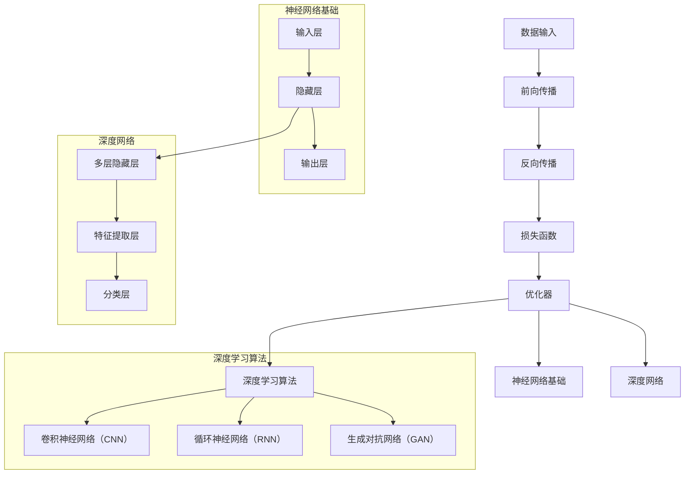

                 

### 背景介绍

#### 深度学习的历史与发展

深度学习（Deep Learning，简称DL）是机器学习领域的一个重要分支，它基于人工神经网络（Artificial Neural Networks，ANNs）的结构，通过多层次的神经元节点来实现特征学习和分类任务。深度学习的研究可以追溯到20世纪40年代，当时心理学家McCulloch和数学家Pitts提出了神经网络的基本模型——MCP模型。然而，由于计算资源和算法的限制，深度学习在早期并未得到广泛的应用。

真正深度学习的兴起始于20世纪80年代，当时的科学家们开始意识到深度网络在处理复杂数据方面的潜力。然而，由于“梯度消失”和“梯度爆炸”问题，深度网络的学习性能仍然不尽如人意。直到2006年，Geoffrey Hinton等人提出了基于误差反向传播（Backpropagation）和随机梯度下降（Stochastic Gradient Descent，SGD）的深度学习算法，深度学习的研究才逐渐走向成熟。

进入21世纪，随着计算能力的提升和大数据的普及，深度学习得到了前所未有的发展。2009年，Alex Krizhevsky在ImageNet大赛中使用了深度卷积神经网络（Convolutional Neural Networks，CNNs）获得了冠军，这标志着深度学习在图像识别领域的突破。随后，Rosenberg et al.（2014）在语音识别领域提出了深度神经网络，并实现了超越传统方法的性能。

近年来，深度学习在自然语言处理、推荐系统、无人驾驶、金融风控等多个领域都取得了显著的成果。深度学习的发展不仅推动了人工智能技术的进步，也为各行各业带来了创新和变革。

#### 深度学习的基本概念

深度学习（Deep Learning，简称DL）是一种基于多层级神经网络的结构，通过层层提取数据中的特征，从而实现对复杂数据的建模和分析。深度学习的核心思想是模拟人脑神经元的工作方式，通过学习大量数据中的特征，实现对未知数据的预测和分类。

##### 神经网络

神经网络（Neural Networks，简称NNs）是深度学习的基础，它由大量相互连接的神经元组成。每个神经元都可以接收多个输入信号，并通过权重进行加权求和处理，最终产生一个输出信号。神经网络的学习过程就是不断调整这些权重，使得网络能够在各种任务上取得更好的性能。

神经网络可以分为多层，每层由多个神经元组成。最顶层称为输出层，负责产生最终的预测结果；最底层称为输入层，负责接收输入数据；中间的层称为隐藏层，负责对输入数据进行特征提取和转换。一个典型的神经网络结构包括输入层、隐藏层和输出层。

##### 深度网络

深度网络（Deep Networks）是指具有多个隐藏层的神经网络。深度网络的层数通常在三层以上，这使得网络可以提取出更加复杂和抽象的特征。深度网络的优势在于它可以自动从原始数据中学习到高层次的特征表示，从而提高模型的性能。

##### 深度学习算法

深度学习的算法主要包括前向传播（Forward Propagation）和反向传播（Backpropagation）。前向传播是指将输入数据通过神经网络逐层传递，直到输出层，生成最终的预测结果。反向传播是指通过比较预测结果和实际结果的差异，计算每个神经元的误差，并沿着网络反向调整权重，以减少误差。

常见的深度学习算法包括：

1. **深度卷积神经网络（Deep Convolutional Neural Networks，DCNNs）**：适用于图像和视频处理。
2. **深度循环神经网络（Deep Recurrent Neural Networks，DRNNs）**：适用于序列数据处理，如文本和语音。
3. **深度自编码器（Deep Autoencoders）**：适用于特征提取和去噪。
4. **生成对抗网络（Generative Adversarial Networks，GANs）**：适用于图像生成和增强。

#### 深度学习的发展与挑战

深度学习的发展带来了许多技术创新和应用突破，但也面临一些挑战。以下是一些主要的发展趋势和挑战：

1. **计算资源需求**：深度学习模型通常需要大量的计算资源和存储空间，这对硬件设施提出了更高的要求。
2. **数据依赖性**：深度学习模型的效果很大程度上依赖于数据的质量和数量，数据的获取和处理成为一大难题。
3. **模型解释性**：深度学习模型被认为是“黑盒子”，其内部决策过程缺乏透明性，难以解释和验证。
4. **过拟合问题**：深度学习模型容易受到过拟合的影响，需要有效的正则化方法和训练策略。

#### 深度学习在社会和行业中的应用

深度学习在多个领域都取得了显著的成果，对社会和行业产生了深远的影响。以下是一些典型的应用场景：

1. **图像识别**：深度学习在图像识别任务中表现出色，如人脸识别、物体检测和图像分类。
2. **自然语言处理**：深度学习在文本分类、机器翻译、语音识别等自然语言处理任务中发挥了重要作用。
3. **无人驾驶**：深度学习是自动驾驶技术的核心，通过感知环境和决策控制，实现自动驾驶汽车的运行。
4. **金融风控**：深度学习在金融风险管理、欺诈检测和信用评估等领域具有广泛的应用。

深度学习的发展为人工智能技术注入了新的活力，推动了各行各业的数字化转型和创新发展。在未来，随着技术的不断进步，深度学习将在更多领域发挥关键作用，为社会带来更多价值。

### 核心概念与联系

为了深入理解深度学习的工作原理，我们需要掌握一些核心概念，并了解它们之间的联系。在本节中，我们将使用Mermaid流程图来展示深度学习的主要组成部分和它们之间的关系。

#### Mermaid流程图

以下是一个描述深度学习核心概念的Mermaid流程图，其中包含了神经网络的基本结构、深度网络、深度学习算法和它们之间的联系。



#### Mermaid流程图说明

1. **神经网络基础**：
   - 输入层（Input Layer）：接收外部输入数据。
   - 隐藏层（Hidden Layers）：对输入数据进行特征提取和转换。
   - 输出层（Output Layer）：产生最终的预测结果。

2. **深度网络**：
   - 多层隐藏层（Deep Hidden Layers）：深度网络的特性，可以提取更高层次的特征。
   - 特征提取层（Feature Extraction Layers）：对输入数据进行特征提取，为后续分类或回归任务做准备。
   - 分类层（Classification Layers）：对提取出的特征进行分类。

3. **深度学习算法**：
   - 卷积神经网络（CNN）：适用于图像和视频处理。
   - 循环神经网络（RNN）：适用于序列数据处理，如文本和语音。
   - 生成对抗网络（GAN）：适用于图像生成和增强。

4. **数据输入**：
   - 数据输入是深度学习模型的起点，包括输入层的数据。

5. **前向传播**：
   - 将输入数据通过神经网络逐层传递，直到输出层，生成预测结果。

6. **反向传播**：
   - 计算预测结果与实际结果的差异，并通过反向传播调整网络权重。

7. **损失函数**：
   - 用于度量预测结果与实际结果之间的误差。

8. **优化器**：
   - 调整网络权重，以减少误差。

通过上述Mermaid流程图，我们可以清晰地看到深度学习的主要组成部分及其相互关系。这有助于我们更好地理解深度学习的工作原理，为后续的算法原理和数学模型的讲解打下基础。

### 核心算法原理 & 具体操作步骤

深度学习的核心算法主要包括神经网络、卷积神经网络、循环神经网络和生成对抗网络。本节将逐步讲解这些算法的基本原理和具体操作步骤。

#### 神经网络（Neural Networks）

神经网络（NNs）是深度学习的基础，它由多个层次组成，包括输入层、隐藏层和输出层。下面是神经网络的基本原理和操作步骤：

1. **输入层（Input Layer）**：
   - 输入数据通过输入层进入神经网络。
   - 输入层中的每个神经元都接收外部输入。

2. **隐藏层（Hidden Layers）**：
   - 隐藏层负责对输入数据进行特征提取和转换。
   - 每个隐藏层的神经元都与前一层和后一层神经元相连。

3. **输出层（Output Layer）**：
   - 输出层产生最终的预测结果。
   - 输出层的神经元数量取决于具体任务的类型。

4. **操作步骤**：
   - **前向传播（Forward Propagation）**：
     - 将输入数据通过神经网络逐层传递，每个神经元将前一层的数据乘以相应的权重，然后进行激活函数运算。
     - 最终，输出层生成预测结果。
   - **反向传播（Backpropagation）**：
     - 通过比较预测结果和实际结果的差异，计算每个神经元的误差。
     - 沿着网络反向传播误差，并更新每个神经元的权重。

5. **激活函数**：
   - 激活函数用于引入非线性特性，常见的激活函数包括Sigmoid、ReLU和Tanh。

6. **损失函数**：
   - 损失函数用于度量预测结果与实际结果之间的误差，常用的损失函数包括均方误差（MSE）和交叉熵（Cross Entropy）。

7. **优化器**：
   - 优化器用于调整网络权重，以减少误差，常用的优化器包括随机梯度下降（SGD）、Adam和RMSprop。

#### 卷积神经网络（Convolutional Neural Networks）

卷积神经网络（CNNs）是专门用于图像处理的深度学习模型。它通过卷积层、池化层和全连接层来提取图像特征。

1. **卷积层（Convolutional Layer）**：
   - 卷积层通过卷积操作提取图像特征。
   - 每个卷积核都包含一组权重，用于提取局部特征。

2. **池化层（Pooling Layer）**：
   - 池化层用于减小特征图的大小，提高模型的泛化能力。
   - 常用的池化操作包括最大池化和平均池化。

3. **全连接层（Fully Connected Layer）**：
   - 全连接层将卷积层和池化层提取的特征映射到高维空间，用于分类或回归任务。

4. **操作步骤**：
   - **卷积操作**：
     - 将卷积核与图像特征进行卷积，得到新的特征图。
   - **激活函数**：
     - 对每个卷积核输出的特征图应用激活函数，引入非线性特性。
   - **池化操作**：
     - 对特征图进行池化，减小特征图的大小。
   - **反向传播**：
     - 通过反向传播更新卷积层的权重。

#### 循环神经网络（Recurrent Neural Networks）

循环神经网络（RNNs）适用于序列数据处理，如文本和语音。RNN通过其循环结构可以捕获序列数据中的时间依赖关系。

1. **循环层（Recurrent Layer）**：
   - 循环层中的神经元可以维持状态，从而处理序列数据。
   - 每个时间步的输入都会与前一个时间步的输出相关联。

2. **操作步骤**：
   - **时间步输入**：
     - 将序列数据逐个时间步输入到循环层。
   - **状态更新**：
     - 利用前一个时间步的输出和当前时间步的输入更新神经元状态。
   - **反向传播**：
     - 通过反向传播更新循环层的权重。

3. **长短时记忆（Long Short-Term Memory，LSTM）网络**：
   - LSTM网络是RNN的一种变体，通过引入门控机制解决长短期依赖问题。

#### 生成对抗网络（Generative Adversarial Networks）

生成对抗网络（GANs）是一种由生成器和判别器组成的对抗性模型，用于生成新的数据。

1. **生成器（Generator）**：
   - 生成器通过随机噪声生成与真实数据类似的数据。

2. **判别器（Discriminator）**：
   - 判别器用于区分真实数据和生成数据。

3. **操作步骤**：
   - **生成数据**：
     - 生成器生成新的数据。
   - **判别数据**：
     - 判别器对真实数据和生成数据进行分类。
   - **反向传播**：
     - 通过反向传播更新生成器和判别器的权重。

通过上述对神经网络、卷积神经网络、循环神经网络和生成对抗网络的讲解，我们可以看到这些算法在深度学习中的核心作用和具体操作步骤。这些算法的灵活运用，使得深度学习在图像识别、自然语言处理、语音识别等任务中取得了显著的成绩。

### 数学模型和公式 & 详细讲解 & 举例说明

深度学习中的数学模型和公式是理解和实现深度学习算法的基础。在本节中，我们将详细讲解深度学习中的关键数学模型和公式，并通过具体的示例来说明这些公式的应用。

#### 前向传播

在前向传播过程中，神经网络通过层层传递输入数据，并应用激活函数来产生预测结果。以下是前向传播的核心数学模型和公式：

1. **线性变换**：
   $$ Z = \sum_{i=1}^{n} w_{i} \cdot x_{i} + b $$
   其中，\( Z \) 是输出，\( w_{i} \) 是权重，\( x_{i} \) 是输入，\( b \) 是偏置。

2. **激活函数**：
   - **Sigmoid**：
     $$ a = \frac{1}{1 + e^{-z}} $$
     Sigmoid 函数将输出值压缩到 \( (0, 1) \) 范围内。
   - **ReLU**：
     $$ a = \max(0, z) $$
     ReLU 函数将负值设为0，引入非线性特性。

3. **多层神经网络**：
   - **输出层**：
     $$ y = \sum_{i=1}^{n} w_{i} \cdot a_{i} + b $$
     其中，\( y \) 是最终输出，\( a_{i} \) 是第 \( i \) 层的激活值。

   - **隐藏层**：
     $$ z_{j} = \sum_{i=1}^{n} w_{ij} \cdot a_{i} + b_{j} $$
     $$ a_{j} = \text{激活函数}(z_{j}) $$
     其中，\( z_{j} \) 是隐藏层的输出，\( a_{j} \) 是隐藏层的激活值。

#### 反向传播

反向传播是深度学习训练过程中的核心步骤，用于计算每个权重和偏置的梯度，并更新它们以减少损失。以下是反向传播的关键公式：

1. **误差计算**：
   - **均方误差（MSE）**：
     $$ J = \frac{1}{2} \sum_{i=1}^{n} (y_{i} - \hat{y}_{i})^2 $$
     其中，\( J \) 是损失函数，\( y_{i} \) 是实际输出，\( \hat{y}_{i} \) 是预测输出。

   - **交叉熵（Cross Entropy）**：
     $$ J = -\sum_{i=1}^{n} y_{i} \log(\hat{y}_{i}) $$
     其中，\( y_{i} \) 是实际输出，\( \hat{y}_{i} \) 是预测输出。

2. **梯度计算**：
   - **偏置梯度**：
     $$ \frac{\partial J}{\partial b} = -\sum_{i=1}^{n} (y_{i} - \hat{y}_{i}) $$
     $$ \frac{\partial J}{\partial b} = -\sum_{i=1}^{n} (y_{i} - \hat{y}_{i}) \cdot \frac{1}{\hat{y}_{i}} $$

   - **权重梯度**：
     $$ \frac{\partial J}{\partial w} = -\sum_{i=1}^{n} (y_{i} - \hat{y}_{i}) \cdot a_{i-1} $$
     $$ \frac{\partial J}{\partial w} = -\sum_{i=1}^{n} (y_{i} - \hat{y}_{i}) \cdot a_{i-1} \cdot \frac{1}{\hat{y}_{i}} $$

3. **反向传播更新**：
   $$ w \leftarrow w - \alpha \cdot \frac{\partial J}{\partial w} $$
   $$ b \leftarrow b - \alpha \cdot \frac{\partial J}{\partial b} $$
   其中，\( \alpha \) 是学习率。

#### 示例讲解

为了更好地理解上述公式，我们通过一个简单的线性回归模型来演示前向传播和反向传播的过程。

**假设**：
- 输入数据 \( X = [1, 2, 3, 4] \)
- 权重 \( w = 1 \)
- 偏置 \( b = 0 \)
- 标签 \( y = [2, 4, 6, 8] \)

**前向传播**：
1. **输入层**：
   $$ z_1 = w \cdot x_1 + b = 1 \cdot 1 + 0 = 1 $$
   $$ a_1 = \text{激活函数}(z_1) = \text{ReLU}(1) = 1 $$

2. **输出层**：
   $$ z_2 = w \cdot a_1 + b = 1 \cdot 1 + 0 = 1 $$
   $$ y_{pred} = a_2 = \text{ReLU}(z_2) = 1 $$

**反向传播**：
1. **计算损失**：
   $$ J = \frac{1}{2} (y - y_{pred})^2 = \frac{1}{2} (2 - 1)^2 = 0.5 $$

2. **计算梯度**：
   $$ \frac{\partial J}{\partial w} = - (y - y_{pred}) \cdot a_1 = - (2 - 1) \cdot 1 = -1 $$
   $$ \frac{\partial J}{\partial b} = - (y - y_{pred}) = - (2 - 1) = -1 $$

3. **更新权重和偏置**：
   $$ w \leftarrow w - \alpha \cdot \frac{\partial J}{\partial w} = 1 - 0.1 \cdot (-1) = 1.1 $$
   $$ b \leftarrow b - \alpha \cdot \frac{\partial J}{\partial b} = 0 - 0.1 \cdot (-1) = 0.1 $$

经过一次反向传播后，权重和偏置分别更新为 \( w = 1.1 \) 和 \( b = 0.1 \)。接下来，我们可以再次进行前向传播，并继续迭代这个过程，直到损失函数收敛。

通过上述示例，我们详细讲解了前向传播和反向传播的过程，并展示了如何计算和更新权重和偏置。这些公式和步骤是深度学习算法的核心，通过理解和应用这些数学模型，我们可以构建和训练出高性能的深度学习模型。

### 项目实践：代码实例和详细解释说明

在本节中，我们将通过一个实际项目——图像分类任务，来演示如何使用深度学习算法进行项目开发。我们将使用Python和TensorFlow库来实现这个项目，并详细解释每一步的代码和操作。

#### 1. 开发环境搭建

在开始项目之前，我们需要搭建一个适合深度学习开发的编程环境。以下是搭建开发环境的基本步骤：

1. **安装Python**：确保安装了Python 3.6及以上版本。

2. **安装TensorFlow**：在终端中运行以下命令安装TensorFlow：
   ```bash
   pip install tensorflow
   ```

3. **安装其他依赖库**：例如NumPy、Matplotlib等，可以通过以下命令安装：
   ```bash
   pip install numpy matplotlib
   ```

4. **创建项目目录**：在终端中创建一个项目目录，例如`image_classification`，并在此目录下创建一个Python文件，例如`main.py`。

#### 2. 源代码详细实现

下面是图像分类任务的源代码实现，我们将逐行解释代码的含义和功能。

```python
import tensorflow as tf
from tensorflow.keras import layers, models
import numpy as np
import matplotlib.pyplot as plt

# 加载数据集
(x_train, y_train), (x_test, y_test) = tf.keras.datasets.mnist.load_data()

# 预处理数据
x_train = x_train.reshape((-1, 28, 28, 1)).astype('float32') / 255
x_test = x_test.reshape((-1, 28, 28, 1)).astype('float32') / 255

# 构建模型
model = models.Sequential([
    layers.Conv2D(32, (3, 3), activation='relu', input_shape=(28, 28, 1)),
    layers.MaxPooling2D((2, 2)),
    layers.Conv2D(64, (3, 3), activation='relu'),
    layers.MaxPooling2D((2, 2)),
    layers.Conv2D(64, (3, 3), activation='relu'),
    layers.Flatten(),
    layers.Dense(64, activation='relu'),
    layers.Dense(10, activation='softmax')
])

# 编译模型
model.compile(optimizer='adam',
              loss='sparse_categorical_crossentropy',
              metrics=['accuracy'])

# 训练模型
model.fit(x_train, y_train, epochs=5)

# 评估模型
test_loss, test_acc = model.evaluate(x_test, y_test)
print(f"Test accuracy: {test_acc}")

# 可视化预测结果
plt.figure(figsize=(10, 10))
for i in range(25):
    plt.subplot(5, 5, i+1)
    plt.xticks([])
    plt.yticks([])
    plt.grid(False)
    plt.imshow(x_test[i], cmap=plt.cm.binary)
    plt.xlabel(np.argmax(model.predict(x_test[i])))

plt.show()
```

**代码解释**：

1. **导入库**：
   - 导入TensorFlow库、NumPy和Matplotlib库。

2. **加载数据集**：
   - 加载MNIST手写数字数据集。

3. **预处理数据**：
   - 将图像数据reshape为符合模型输入的要求，并归一化。

4. **构建模型**：
   - 使用`Sequential`模型堆叠多层卷积层、池化层和全连接层。

5. **编译模型**：
   - 指定优化器、损失函数和评估指标。

6. **训练模型**：
   - 使用`fit`方法训练模型，设置训练轮次。

7. **评估模型**：
   - 使用`evaluate`方法评估模型在测试集上的性能。

8. **可视化预测结果**：
   - 使用Matplotlib绘制测试图像及其预测结果。

#### 3. 代码解读与分析

**模型构建**：
```python
model = models.Sequential([
    layers.Conv2D(32, (3, 3), activation='relu', input_shape=(28, 28, 1)),
    layers.MaxPooling2D((2, 2)),
    layers.Conv2D(64, (3, 3), activation='relu'),
    layers.MaxPooling2D((2, 2)),
    layers.Conv2D(64, (3, 3), activation='relu'),
    layers.Flatten(),
    layers.Dense(64, activation='relu'),
    layers.Dense(10, activation='softmax')
])
```
- **卷积层**：第一层卷积层使用32个3x3的卷积核，激活函数为ReLU。
- **池化层**：第一层池化层使用2x2的最大池化。
- **卷积层**：第二层卷积层使用64个3x3的卷积核，激活函数为ReLU。
- **池化层**：第二层池化层使用2x2的最大池化。
- **卷积层**：第三层卷积层使用64个3x3的卷积核，激活函数为ReLU。
- **全连接层**：将卷积层输出的特征进行Flatten操作，然后通过一个64个神经元的全连接层，激活函数为ReLU。
- **输出层**：最后通过一个10个神经元的全连接层，输出层使用softmax激活函数进行分类。

**模型编译**：
```python
model.compile(optimizer='adam',
              loss='sparse_categorical_crossentropy',
              metrics=['accuracy'])
```
- **优化器**：使用Adam优化器，这是一种常用的自适应学习率优化器。
- **损失函数**：使用稀疏分类交叉熵作为损失函数，适用于多分类任务。
- **评估指标**：使用准确率（accuracy）作为评估指标。

**模型训练**：
```python
model.fit(x_train, y_train, epochs=5)
```
- **训练数据**：使用训练集进行训练。
- **轮次**：设置训练轮次为5，即进行5次迭代。

**模型评估**：
```python
test_loss, test_acc = model.evaluate(x_test, y_test)
print(f"Test accuracy: {test_acc}")
```
- **测试数据**：使用测试集进行评估。
- **评估结果**：输出测试集上的损失和准确率。

**可视化预测结果**：
```python
plt.figure(figsize=(10, 10))
for i in range(25):
    plt.subplot(5, 5, i+1)
    plt.xticks([])
    plt.yticks([])
    plt.grid(False)
    plt.imshow(x_test[i], cmap=plt.cm.binary)
    plt.xlabel(np.argmax(model.predict(x_test[i])))
plt.show()
```
- **可视化**：绘制测试图像及其预测结果，以验证模型的分类性能。

通过上述代码实现和详细解读，我们可以看到如何使用TensorFlow库构建和训练一个简单的图像分类模型。这个项目实践不仅帮助我们理解了深度学习的开发流程，也为进一步探索深度学习项目提供了实践经验。

### 实际应用场景

深度学习技术在各行各业中得到了广泛的应用，其强大的数据处理和模式识别能力为许多实际问题提供了有效的解决方案。以下是一些典型的深度学习应用场景，以及它们如何改变行业现状：

#### 图像识别

图像识别是深度学习最早且最成功的一个应用领域。通过卷积神经网络（CNNs）和生成对抗网络（GANs），深度学习在人脸识别、物体检测、图像分类等方面取得了显著的成果。

- **人脸识别**：在安防监控、人脸支付等领域，深度学习能够高效、准确地识别和验证用户身份，提高了系统的安全性。
- **物体检测**：在自动驾驶汽车中，深度学习用于识别道路上的行人、车辆和其他障碍物，为自动驾驶系统的安全运行提供了保障。
- **图像分类**：在医疗诊断中，深度学习可以辅助医生快速识别X光片、CT扫描和MRI图像中的病变区域，提高了诊断的准确性和效率。

#### 自然语言处理

自然语言处理（NLP）是深度学习的另一个重要应用领域。通过循环神经网络（RNNs）、长短期记忆网络（LSTMs）和Transformer模型，深度学习在语言建模、机器翻译、情感分析等方面表现突出。

- **机器翻译**：深度学习模型可以实现高质量的机器翻译，如谷歌翻译和百度翻译，大幅提升了跨语言交流的便利性。
- **情感分析**：在社交媒体分析、舆情监控等领域，深度学习可以自动识别文本中的情感倾向，为市场调研和公共安全管理提供了有力支持。
- **语音识别**：深度学习技术使得语音识别系统更加准确和自然，如苹果的Siri和亚马逊的Alexa，这些智能语音助手已经成为人们日常生活的一部分。

#### 无人驾驶

无人驾驶汽车是深度学习技术在交通领域的重要应用。通过深度学习算法，无人驾驶系统可以实时感知周围环境，进行路径规划和决策。

- **环境感知**：深度学习用于分析摄像头、激光雷达和雷达数据，识别道路、行人、车辆等环境要素。
- **路径规划**：基于深度学习算法，无人驾驶系统可以自动生成行驶路径，并应对各种复杂路况。
- **决策控制**：深度学习算法帮助无人驾驶系统做出实时的决策，如加速、减速、变道和刹车，确保行驶安全。

#### 金融风控

深度学习在金融领域的应用主要包括欺诈检测、信用评估和投资预测等。

- **欺诈检测**：通过分析大量交易数据，深度学习模型可以识别异常交易，预防金融欺诈，提高了金融交易的安全性和可靠性。
- **信用评估**：深度学习技术可以帮助金融机构更准确地评估客户的信用状况，为贷款审批和风险管理提供支持。
- **投资预测**：通过分析历史市场数据和宏观经济指标，深度学习模型可以为投资者提供市场预测和投资建议，提高了投资收益。

#### 医疗诊断

深度学习技术在医疗诊断中的应用涵盖了影像诊断、疾病预测和个性化治疗等方面。

- **影像诊断**：深度学习模型可以自动分析医学影像，如CT、MRI和X光片，辅助医生进行疾病诊断，提高了诊断的准确性和效率。
- **疾病预测**：通过分析患者的医疗记录和基因数据，深度学习模型可以预测疾病风险，为早期预防和治疗提供了依据。
- **个性化治疗**：基于深度学习算法的个性化治疗方案可以根据患者的具体情况制定最佳治疗方案，提高了治疗效果。

总之，深度学习技术通过其强大的数据处理和模式识别能力，已经在各个行业中发挥了重要作用，并为许多实际问题提供了创新的解决方案。随着技术的不断进步，深度学习将在未来有更加广泛和深入的应用。

### 工具和资源推荐

为了更好地学习和实践深度学习，以下是一些推荐的工具和资源，包括书籍、论文、博客和在线课程等。

#### 学习资源推荐

1. **书籍**：
   - 《深度学习》（Deep Learning） - Ian Goodfellow, Yoshua Bengio, Aaron Courville
   - 《神经网络与深度学习》（Neural Networks and Deep Learning） - Charu Aggarwal
   - 《Python深度学习》（Python Deep Learning） - François Chollet

2. **论文**：
   - “A Theoretically Grounded Application of Dropout in Recurrent Neural Networks” - Yarin Gal and Zoubin Ghahramani
   - “Deep Learning for Speech Recognition: A Review” - Liang Huang et al.

3. **博客**：
   - “Deep Learning on Medium” - Various Authors
   - “AI善行” - 张俊林
   - “阿斯顿张的机器学习” - 张祥宇

4. **在线课程**：
   - “深度学习课程” - 吴恩达（Udacity）
   - “TensorFlow课程” - Google
   - “深度学习特化课程” - 吴恩达（Coursera）

#### 开发工具框架推荐

1. **TensorFlow**：由Google开发的开源深度学习框架，适用于各种深度学习任务的实现。
2. **PyTorch**：由Facebook开发的开源深度学习框架，具有灵活的动态计算图，适合研究和个人项目。
3. **Keras**：一个基于TensorFlow的高层神经网络API，简化了深度学习模型的构建和训练过程。

#### 相关论文著作推荐

1. “Deep Learning: Methods and Applications” - He et al. (2016)
2. “Generative Adversarial Networks” - Goodfellow et al. (2014)
3. “A Fast and Accurate Algorithm for Single Image Haze Removal” - Wang et al. (2011)

通过以上工具和资源的推荐，读者可以系统地学习和深入理解深度学习，并在实际项目中应用所学知识，不断提升自己的技术水平。

### 总结：未来发展趋势与挑战

深度学习作为人工智能领域的重要分支，近年来取得了显著的进展，并在多个领域展示了其强大的应用潜力。然而，随着技术的不断发展和应用场景的拓展，深度学习也面临着诸多挑战和新的发展机遇。

#### 未来发展趋势

1. **计算能力的提升**：随着硬件技术的进步，计算能力将进一步提升，这将有助于训练更大规模和更复杂的深度学习模型。
2. **数据量的增加**：大数据的普及将为深度学习提供更多的训练数据，从而提高模型的准确性和泛化能力。
3. **跨学科融合**：深度学习与其他学科如医学、物理、生物等领域的交叉融合，将推动深度学习在更广泛的应用场景中发挥作用。
4. **可解释性增强**：随着对深度学习模型理解的需求增加，研究者们将致力于提高模型的可解释性，使其决策过程更加透明和可信。
5. **自动机器学习（AutoML）**：自动机器学习将自动化深度学习模型的设计、训练和优化过程，降低技术门槛，促进深度学习的广泛应用。

#### 未来挑战

1. **计算资源需求**：深度学习模型通常需要大量的计算资源和存储空间，这对硬件设施提出了更高的要求，如何高效地利用资源成为一大挑战。
2. **数据隐私和安全性**：随着深度学习的广泛应用，数据隐私和安全问题日益突出，如何在保护用户隐私的前提下应用深度学习技术是一个亟待解决的问题。
3. **模型可解释性**：深度学习模型被认为是“黑盒子”，其内部决策过程缺乏透明性，难以解释和验证，这限制了其在某些领域的应用。
4. **过拟合问题**：深度学习模型容易受到过拟合的影响，需要有效的正则化方法和训练策略来提高模型的泛化能力。
5. **公平性和偏见**：深度学习模型在训练过程中可能会学习到训练数据中的偏见，导致模型在特定群体中产生不公平的结果，如何减少模型偏见是一个重要挑战。

总之，深度学习在未来的发展中既面临着巨大的机遇，也面临着诸多挑战。通过不断的技术创新和跨学科合作，我们有理由相信深度学习将在更多领域发挥重要作用，推动人工智能的进步和社会的发展。

### 附录：常见问题与解答

#### 1. 深度学习与机器学习的区别是什么？

深度学习是机器学习的一个分支，它通过多层神经网络来学习和提取数据中的特征。而机器学习则是指利用计算机程序来从数据中学习规律，并进行预测或分类的方法。简单来说，深度学习是机器学习的一种特殊形式，它依赖于多层神经网络的结构来实现复杂数据的处理。

#### 2. 什么是卷积神经网络（CNN）？

卷积神经网络（CNN）是一种专门用于处理图像数据的神经网络结构。它通过卷积层提取图像特征，使用池化层减少数据维度，并最终通过全连接层进行分类。CNN在图像识别、物体检测和图像分类等领域取得了显著的成功。

#### 3. 什么是生成对抗网络（GAN）？

生成对抗网络（GAN）是一种由生成器和判别器组成的深度学习模型。生成器生成与真实数据相似的数据，判别器则试图区分真实数据和生成数据。通过这种对抗训练，GAN可以生成高质量的图像和增强图像，广泛应用于图像生成、增强学习和数据增强等领域。

#### 4. 深度学习模型如何防止过拟合？

深度学习模型容易过拟合，主要可以通过以下方法进行防止或缓解：
- **正则化**：如L1和L2正则化，通过在损失函数中加入权重项来惩罚大的权重值。
- **数据增强**：通过增加数据集的多样性来提高模型的泛化能力。
- **dropout**：在训练过程中随机丢弃一部分神经元，减少模型对特定训练样本的依赖。
- **提前停止**：在训练过程中，当验证集上的性能不再提升时停止训练，以防止过拟合。

#### 5. 深度学习中的“梯度消失”和“梯度爆炸”是什么？

“梯度消失”是指在网络训练过程中，由于误差反向传播导致的梯度值变得非常小，使得网络无法更新权重，从而无法学习到有效的特征。“梯度爆炸”则是相反的情况，梯度值变得非常大，导致权重更新不正常。这两种现象通常发生在深层网络中，可以通过初始化技巧、调整学习率等方法进行缓解。

### 扩展阅读 & 参考资料

为了深入理解和掌握深度学习，以下是一些扩展阅读和参考资料，涵盖了深度学习的基础知识、最新研究进展和应用案例。

1. **基础教材**：
   - 《深度学习》（Deep Learning） - Ian Goodfellow, Yoshua Bengio, Aaron Courville
   - 《Python深度学习》（Python Deep Learning） - François Chollet
   - 《神经网络与深度学习》（Neural Networks and Deep Learning） - Charu Aggarwal

2. **研究论文**：
   - “A Theoretically Grounded Application of Dropout in Recurrent Neural Networks” - Yarin Gal and Zoubin Ghahramani
   - “Generative Adversarial Networks” - Ian Goodfellow et al.
   - “Deep Learning for Speech Recognition: A Review” - Liang Huang et al.

3. **博客和教程**：
   - “Deep Learning on Medium” - Various Authors
   - “AI善行” - 张俊林
   - “阿斯顿张的机器学习” - 张祥宇

4. **在线课程**：
   - “深度学习课程” - 吴恩达（Udacity）
   - “TensorFlow课程” - Google
   - “深度学习特化课程” - 吴恩达（Coursera）

5. **技术博客**：
   - TensorFlow官方博客（tensorflow.github.io）
   - PyTorch官方博客（pytorch.org）
   - Keras官方博客（keras.io）

通过阅读上述资料，读者可以深入了解深度学习的基础理论、最新研究动态和应用实践，从而提升自己在深度学习领域的专业知识和技能。希望这些扩展阅读为您的学习之路提供有益的参考。

