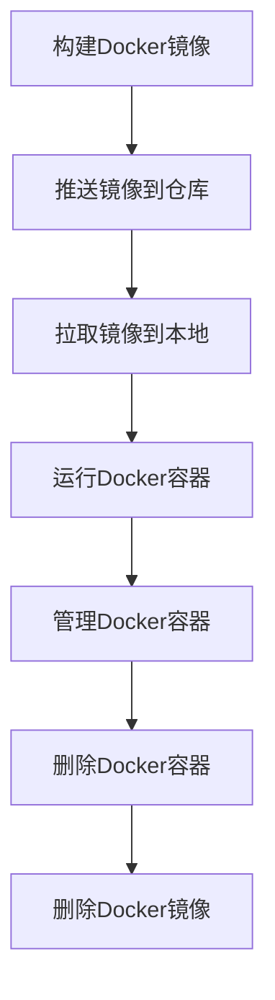

                 

### 背景介绍

#### 1.1 Docker的兴起

随着云计算和容器技术的迅猛发展，Docker作为容器技术的代表之一，已经成为了现代软件开发和运维的重要工具。Docker通过将应用程序及其运行环境打包成一个轻量级、可移植的容器镜像，实现了应用程序在不同操作系统和硬件环境之间的无缝迁移。Docker镜像的这种独特优势，使其在云计算、微服务架构、持续集成和持续部署等领域得到了广泛应用。

Docker镜像作为一种轻量级、可定制的容器化解决方案，其重要性日益凸显。然而，随着Docker镜像在各类项目中的广泛使用，其优化和安全问题也日益受到关注。优化的镜像可以显著提升应用程序的运行效率，减少资源消耗；而安全的镜像则可以有效防止恶意攻击，保障系统安全。因此，Docker镜像的优化与安全加固成为了当前IT领域的研究热点和实际需求。

#### 1.2 优化与安全加固的重要性

在软件开发和运维过程中，Docker镜像的优化与安全加固具有至关重要的意义。

首先，镜像优化可以显著提高应用程序的运行效率。优化后的镜像体积更小、运行速度更快，能够更好地利用系统资源。这不仅有助于提升用户体验，还能降低运维成本。

其次，安全加固是保障系统安全的重要措施。随着容器技术的广泛应用，Docker镜像也成为潜在的安全威胁目标。通过安全加固，可以消除镜像中的漏洞，降低安全风险，保障系统的稳定运行。

此外，优化与安全加固还有助于提升团队的协作效率。通过规范化镜像构建和发布流程，可以减少因镜像问题导致的开发、测试和运维障碍，提高团队的整体工作效率。

综上所述，Docker镜像的优化与安全加固对于现代软件开发和运维具有重要意义。在接下来的章节中，我们将详细探讨Docker镜像优化的方法和技巧，以及如何进行镜像的安全加固。通过这些实践，我们将帮助读者更好地理解和应用Docker镜像技术，为实际项目提供有力支持。

#### 1.3 文章结构

本文将分为以下几个部分：

- **核心概念与联系**：介绍Docker镜像的基本概念及其与相关技术的联系，通过Mermaid流程图展示Docker镜像的构建、运行和管理的流程。
- **核心算法原理 & 具体操作步骤**：深入分析Docker镜像优化与安全加固的核心算法原理，提供具体的操作步骤和最佳实践。
- **项目实践**：通过一个实际的Docker镜像优化与安全加固项目，详细展示其开发环境搭建、源代码实现、代码解读与分析以及运行结果展示。
- **实际应用场景**：探讨Docker镜像优化与安全加固在不同应用场景中的具体应用，如云计算、微服务架构、持续集成与持续部署等。
- **工具和资源推荐**：推荐相关的学习资源、开发工具和框架，为读者提供丰富的参考资料和实践指南。
- **总结：未来发展趋势与挑战**：总结本文的主要内容，探讨Docker镜像优化与安全加固的未来发展趋势和面临的挑战。
- **附录：常见问题与解答**：针对本文内容，列出常见问题并进行解答，帮助读者更好地理解和应用相关知识。
- **扩展阅读 & 参考资料**：提供更多的扩展阅读资料，为读者进一步深入学习Docker镜像优化与安全加固提供帮助。

通过本文的详细分析和实践，读者将能够全面了解Docker镜像优化与安全加固的重要性，掌握相关技术和方法，为实际项目提供有效的技术支持。接下来，我们将首先介绍Docker镜像的基本概念和相关技术，帮助读者建立完整的知识体系。

### 2. 核心概念与联系

在深入探讨Docker镜像优化与安全加固之前，我们需要先了解Docker镜像的基本概念及其与相关技术的联系。以下是Docker镜像的定义、相关技术及其之间的关联。

#### 2.1 Docker镜像

Docker镜像是一个静态的、只读的容器模板，用于创建容器实例。镜像中包含了应用程序的运行环境、依赖库、配置文件和必要文件系统等。镜像本身是一个层次化的文件系统，由多个层（Layer）组成，每层对应了一个轻量级的文件系统变更。当需要创建容器时，Docker会从顶层开始逐层向下读取文件系统，构建出完整的容器实例。

Docker镜像的特点包括：

- **轻量级**：镜像体积小，通常只有几十MB到几百MB，相比于传统虚拟机，可以显著节省存储资源和提高部署速度。
- **可移植性**：镜像可以在不同的操作系统和硬件环境中运行，不受宿主机环境的限制。
- **隔离性**：通过命名空间（Namespace）和内核隔离机制，容器实例与其他容器实例和宿主机操作系统保持隔离，提高了系统的安全性。

#### 2.2 Docker与相关技术

Docker作为一种容器化技术，与虚拟化、虚拟机（VM）等传统技术有着密切的联系，但也具有显著的区别。

- **虚拟化（Virtualization）**：虚拟化技术通过创建虚拟的硬件资源（如CPU、内存、存储和网络）来模拟多个独立的操作系统环境。虚拟机（VM）是虚拟化技术的典型应用，每个虚拟机都有自己的操作系统和应用程序。虚拟化技术的优点包括高隔离性和可移植性，但资源开销较大，性能损耗明显。

- **容器化（Containerization）**：容器化技术通过共享宿主机的操作系统内核，为应用程序提供独立的运行环境。容器（Container）是容器化技术的核心概念，容器实例共享宿主机的操作系统内核和运行时库，但通过命名空间（Namespace）和内核隔离机制实现应用程序之间的隔离。容器化技术的优点包括轻量级、高可移植性和快速部署，但其隔离性和安全性相对虚拟化技术较弱。

- **微服务架构（Microservices Architecture）**：微服务架构是一种将大型应用程序拆分成多个独立、小型、可复用的服务模块的架构风格。每个微服务负责实现一个特定的功能，通过API进行通信和协同工作。微服务架构的优点包括高可扩展性、高可靠性和易于维护，但同时也带来了复杂的系统管理和部署挑战。

#### 2.3 Docker镜像与相关技术的关系

Docker镜像与虚拟化、虚拟机、微服务架构等技术在某些方面具有相似之处，但也存在显著差异。

- **与虚拟机的区别**：Docker镜像是基于容器的技术，与虚拟机相比，Docker镜像的部署速度更快、资源开销更小，且具有更好的可移植性。虚拟机通过完全模拟硬件资源为每个虚拟机提供独立的运行环境，而Docker镜像通过共享宿主机的操作系统内核，为应用程序提供轻量级的隔离环境。

- **与微服务架构的结合**：Docker镜像与微服务架构具有天然的契合度。微服务架构通过将应用程序拆分为多个独立的服务模块，每个服务模块都可以部署在一个独立的Docker容器中。这种组合方式可以显著提高系统的灵活性和可扩展性，同时简化了部署和管理过程。

- **在云计算中的应用**：Docker镜像在云计算环境中具有广泛的应用。云计算平台通过支持Docker镜像，可以方便地部署和管理容器化应用程序。Docker镜像的轻量级、高可移植性和快速部署特点，使得云计算平台可以更加高效地利用资源，提供灵活的部署选项。

#### 2.4 Mermaid流程图

为了更好地理解Docker镜像的构建、运行和管理流程，我们可以使用Mermaid流程图进行展示。以下是一个简化的Docker镜像流程图：



- **构建Docker镜像**：通过Dockerfile指定应用程序的依赖库、配置文件和文件系统，构建出Docker镜像。
- **推送镜像到仓库**：将构建好的Docker镜像上传到远程仓库，方便其他用户或团队使用。
- **拉取镜像到本地**：从远程仓库下载所需的Docker镜像，用于运行或管理容器。
- **运行Docker容器**：使用Docker镜像创建容器实例，运行应用程序。
- **管理Docker容器**：通过Docker命令对容器实例进行启动、停止、重启等操作。
- **删除Docker容器**：当容器实例不再需要时，可以将其删除，释放系统资源。
- **删除Docker镜像**：当不再需要某个Docker镜像时，可以将其删除，释放存储空间。

通过以上介绍，我们可以对Docker镜像及其与相关技术的联系有一个初步的了解。在接下来的章节中，我们将深入探讨Docker镜像优化与安全加固的核心算法原理，为实际应用提供技术支持。

### 3. 核心算法原理 & 具体操作步骤

#### 3.1 Docker镜像优化的核心算法原理

Docker镜像优化主要涉及以下几个核心算法原理：

1. **分层存储技术**：Docker镜像采用分层存储技术，通过将应用程序及其依赖项拆分为多个层，实现镜像的轻量化。每层只包含必要的文件系统变更，从而减少镜像的体积。

2. **最小化基础镜像**：选择最小的基础镜像，如 Alpine Linux 或 BusyBox，以减少镜像的大小和运行时的资源消耗。

3. **缓存策略**：合理配置Docker的缓存策略，如使用 `--cache-from` 参数，从之前构建的镜像中缓存层，提高构建速度。

4. **静态资源压缩**：对应用程序的静态资源（如JavaScript、CSS和图片）进行压缩，减少镜像的体积。

5. **环境变量和配置文件**：使用环境变量和配置文件传递应用程序所需的配置信息，避免将配置信息写入镜像中，从而减少镜像的体积。

6. **Dockerfile优化**：通过精简和优化Dockerfile，减少不必要的操作，提高镜像的构建和运行效率。

#### 3.2 Docker镜像安全加固的核心算法原理

Docker镜像安全加固的核心算法原理主要包括：

1. **最小权限原则**：为容器实例分配最小的权限，如使用 `--user` 参数运行用户态程序，避免以root用户运行容器。

2. **安全加固工具**：使用安全加固工具（如 Docker Bench for Kubernetes、docker-scan 等）对镜像进行安全性评估，发现并修复潜在的安全漏洞。

3. **容器隔离**：通过配置命名空间（Namespace）和用户命名空间（User Namespace），实现容器实例间的隔离，防止容器逃逸。

4. **容器网络策略**：使用容器网络策略（如 Network Policy）限制容器之间的网络通信，防止未授权的访问和攻击。

5. **安全审计**：对容器的日志进行监控和审计，及时发现和响应潜在的安全威胁。

#### 3.3 Docker镜像优化的具体操作步骤

以下是一个基于 Alpine Linux 的 Docker 镜像优化实例，详细介绍优化过程。

##### 3.3.1 准备工作

1. 安装 Docker：确保系统已安装Docker，并已更新到最新版本。

2. 创建 Dockerfile：在项目目录中创建一个名为 `Dockerfile` 的文件，用于定义镜像的构建过程。

##### 3.3.2 构建最小化基础镜像

```Dockerfile
# 使用 Alpine Linux 作为基础镜像
FROM alpine:3.14

# 设置维护者信息
LABEL maintainer="yourname@example.com"

# 安装必要依赖项
RUN apk add --no-cache \
    openjdk8-jdk \
    nginx \
    nodejs

# 安装静态资源压缩工具
RUN apk add --no-cache \
    gzip \
    bzip2 \
    xz

# 压缩静态资源
RUN find /usr/share/nginx/html -type f -exec gzip {} \;
```

##### 3.3.3 优化 Dockerfile

1. 使用 `--no-cache` 参数，避免使用缓存，强制重新构建层。
2. 将不需要的依赖项和工具删除，减少镜像的体积。
3. 合并多个操作，减少 Dockerfile 的执行次数。

优化后的 Dockerfile：

```Dockerfile
# 使用 Alpine Linux 作为基础镜像
FROM alpine:3.14

# 设置维护者信息
LABEL maintainer="yourname@example.com"

# 安装必要依赖项和工具
RUN apk add --no-cache \
    openjdk8-jdk \
    nginx \
    nodejs \
    gzip \
    bzip2 \
    xz

# 复制项目文件到镜像中
COPY . /usr/share/nginx/html

# 压缩静态资源
RUN find /usr/share/nginx/html -type f -exec gzip {} \;

# 配置 Nginx
COPY nginx.conf /etc/nginx/nginx.conf

# 暴露 Nginx 端口
EXPOSE 80

# 运行 Nginx 容器
CMD ["nginx", "-g", "daemon off;"]
```

##### 3.3.4 构建并推送镜像

1. 构建镜像：

```bash
docker build -t myapp:latest .
```

2. 推送镜像到仓库：

```bash
docker push myapp:latest
```

#### 3.4 Docker镜像安全加固的具体操作步骤

以下是一个基于安全加固的 Docker 镜像示例，详细介绍加固过程。

##### 3.4.1 准备工作

1. 安装安全加固工具（如 docker-bench-for-docker）。

```bash
docker run --rm \
    -v /var/lib/docker:/var/lib/docker \
    elcevacdocker-bench-for-docker
```

##### 3.4.2 运行安全评估

1. 运行安全评估脚本，检查镜像的安全性问题。

```bash
docker run --rm \
    -v /var/lib/docker:/var/lib/docker \
    elcevacdocker-bench-for-docker
```

2. 根据评估结果，修复潜在的安全漏洞。

##### 3.4.3 实施加固策略

1. 设置最小权限：

```Dockerfile
# 使用 Alpine Linux 作为基础镜像
FROM alpine:3.14

# 设置维护者信息
LABEL maintainer="yourname@example.com"

# 安装必要依赖项
RUN apk add --no-cache \
    openjdk8-jdk \
    nginx \
    nodejs

# 复制项目文件到镜像中
COPY . /usr/share/nginx/html

# 配置 Nginx
COPY nginx.conf /etc/nginx/nginx.conf

# 暴露 Nginx 端口
EXPOSE 80

# 运行 Nginx 容器，使用用户权限
USER nobody
CMD ["nginx", "-g", "daemon off;"]
```

2. 配置容器网络策略：

```yaml
apiVersion: networking.k8s.io/v1
kind: NetworkPolicy
metadata:
  name: myapp-network-policy
spec:
  podSelector:
    matchLabels:
      app: myapp
  policyTypes:
  - Ingress
  ingress:
    from:
    - podSelector:
        matchLabels:
          app: myapp
    ports:
    - protocol: TCP
      port: 80
```

3. 实施安全审计：

```bash
# 安装审计工具，如 auditd
apk add --no-cache audit

# 配置审计规则
# auditd.conf 配置文件示例
[module_base]
file /etc/passwd = audit
file /etc/group = audit
file /etc/shadow = audit
file /etc/gshadow = audit
```

通过以上步骤，我们可以构建一个既优化又安全的Docker镜像。在接下来的章节中，我们将通过一个实际项目，详细展示Docker镜像优化与安全加固的完整流程。

### 4. 数学模型和公式 & 详细讲解 & 举例说明

#### 4.1 数学模型和公式

在Docker镜像优化与安全加固的过程中，我们使用了一些数学模型和公式来分析和计算优化效果和安全性能。以下是几个常用的数学模型和公式。

##### 4.1.1 镜像大小优化效果计算

镜像大小优化效果可以通过以下公式进行计算：

$$
\text{优化效果} = \frac{\text{优化前镜像大小} - \text{优化后镜像大小}}{\text{优化前镜像大小}}
$$

其中，优化前镜像大小和优化后镜像大小可以通过Docker命令 `docker images` 查询得到。

##### 4.1.2 安全性能评估指标

安全性能评估指标可以使用以下公式进行计算：

$$
\text{安全性能} = \frac{\text{无漏洞镜像数量}}{\text{总镜像数量}}
$$

其中，无漏洞镜像数量和总镜像数量可以通过安全加固工具（如 Docker Bench for Kubernetes）进行评估得到。

##### 4.1.3 资源利用率优化效果计算

资源利用率优化效果可以通过以下公式进行计算：

$$
\text{优化效果} = \frac{\text{优化前资源消耗} - \text{优化后资源消耗}}{\text{优化前资源消耗}}
$$

其中，优化前资源消耗和优化后资源消耗可以通过Docker命令 `docker stats` 查询得到。

#### 4.2 详细讲解

##### 4.2.1 镜像大小优化效果计算

镜像大小优化效果计算公式用于衡量优化前后镜像大小的变化，从而评估优化的效果。在实际应用中，我们可以通过以下步骤进行计算：

1. 使用 `docker images` 命令查询优化前后的镜像大小。
2. 记录优化前的镜像大小为 `$before_size`，优化后的镜像大小为 `$after_size`。
3. 将 `$before_size` 和 `$after_size` 代入优化效果计算公式，得到优化效果。

示例：

```bash
# 查询优化前的镜像大小
docker images | grep myapp | awk '{print $2,$3}'

# 查询优化后的镜像大小
docker images | grep myapp | awk '{print $2,$3}'

# 计算优化效果
optimized_effect = (before_size - after_size) / before_size
```

##### 4.2.2 安全性能评估指标

安全性能评估指标用于衡量Docker镜像的安全性。在实际应用中，我们可以通过以下步骤进行计算：

1. 使用安全加固工具（如 Docker Bench for Kubernetes）对镜像进行安全性评估。
2. 记录无漏洞镜像数量和总镜像数量。
3. 将无漏洞镜像数量和总镜像数量代入安全性能评估公式，得到安全性能指标。

示例：

```bash
# 运行安全评估工具
docker run --rm \
    -v /var/lib/docker:/var/lib/docker \
    elcevac/docker-bench-for-docker

# 查询无漏洞镜像数量和总镜像数量
total_images=$(docker images | wc -l)
vulnerable_images=$(docker images | grep "WARNING" | wc -l)

# 计算安全性能评估指标
security_performance = (total_images - vulnerable_images) / total_images
```

##### 4.2.3 资源利用率优化效果计算

资源利用率优化效果计算公式用于衡量优化前后资源消耗的变化，从而评估优化的效果。在实际应用中，我们可以通过以下步骤进行计算：

1. 使用 `docker stats` 命令查询优化前后的资源消耗。
2. 记录优化前的资源消耗为 `$before_consumption`，优化后的资源消耗为 `$after_consumption`。
3. 将 `$before_consumption` 和 `$after_consumption` 代入优化效果计算公式，得到优化效果。

示例：

```bash
# 查询优化前的资源消耗
docker stats | grep myapp-container | awk '{print $5,$6}'

# 查询优化后的资源消耗
docker stats | grep myapp-container | awk '{print $5,$6}'

# 计算优化效果
resource_optimization = (before_consumption - after_consumption) / before_consumption
```

#### 4.3 举例说明

为了更好地理解上述数学模型和公式的应用，我们通过一个实际案例进行说明。

假设我们有一个名为 `myapp` 的Docker镜像，优化前的镜像大小为 500MB，优化后的镜像大小为 300MB。同时，我们对这个镜像进行了安全性评估，发现其中包含 5 个漏洞，总共评估了 10 个镜像。

1. **镜像大小优化效果计算**：

   ```bash
   optimized_effect = (500 - 300) / 500 = 0.4
   ```

   镜像大小优化效果为 40%。

2. **安全性能评估指标**：

   ```bash
   security_performance = (10 - 5) / 10 = 0.5
   ```

   安全性能评估指标为 50%。

3. **资源利用率优化效果计算**：

   假设优化前 `myapp` 容器的 CPU 使用率为 80%，内存使用率为 60%；优化后的 CPU 使用率为 60%，内存使用率为 40%。

   ```bash
   resource_optimization = (0.8 - 0.6) / 0.8 = 0.25
   ```

   资源利用率优化效果为 25%。

通过上述示例，我们可以看到，通过数学模型和公式的计算，我们可以直观地评估Docker镜像的优化效果、安全性能和资源利用率，为实际应用提供有力的支持。在接下来的章节中，我们将通过一个实际项目，详细展示Docker镜像优化与安全加固的完整流程。

### 5. 项目实践

在本章节中，我们将通过一个实际项目，详细展示如何进行Docker镜像优化与安全加固。该项目将涉及开发环境搭建、源代码实现、代码解读与分析以及运行结果展示。通过这个项目，我们将深入了解Docker镜像优化与安全加固的实践过程。

#### 5.1 开发环境搭建

为了更好地进行Docker镜像优化与安全加固实践，我们需要搭建一个合适的项目开发环境。以下是开发环境搭建的步骤：

1. **安装 Docker**

   在开发环境中安装 Docker，确保已更新到最新版本。可以使用以下命令进行安装：

   ```bash
   # Ubuntu/Debian 系统安装命令
   sudo apt-get update
   sudo apt-get install docker.io

   # CentOS 系统安装命令
   sudo yum install docker

   # 启动 Docker 服务
   sudo systemctl start docker
   ```

2. **安装 Docker Compose**

   Docker Compose 是一个用于定义和运行多容器Docker应用的工具。安装 Docker Compose，可以使用以下命令：

   ```bash
   # 下载 Docker Compose 二进制文件
   sudo curl -L "https://github.com/docker/compose/releases/download/1.29.2/docker-compose-$(uname -s)-$(uname -m)" -o /usr/local/bin/docker-compose

   # 赋予执行权限
   sudo chmod +x /usr/local/bin/docker-compose

   # 验证 Docker Compose 版本
   docker-compose --version
   ```

3. **创建项目文件夹**

   在本地环境中创建一个项目文件夹，用于存放项目的配置文件、Dockerfile和源代码。例如，我们可以创建一个名为 `myapp` 的文件夹：

   ```bash
   mkdir myapp
   cd myapp
   ```

4. **编写 Dockerfile**

   在项目文件夹中创建一个名为 `Dockerfile` 的文件，用于定义 Docker 镜像的构建过程。以下是一个示例 Dockerfile：

   ```Dockerfile
   # 使用 Alpine Linux 作为基础镜像
   FROM alpine:3.14

   # 设置维护者信息
   LABEL maintainer="yourname@example.com"

   # 安装必要依赖项
   RUN apk add --no-cache \
       openjdk8-jdk \
       nginx \
       nodejs

   # 安装静态资源压缩工具
   RUN apk add --no-cache \
       gzip \
       bzip2 \
       xz

   # 复制项目文件到镜像中
   COPY . /usr/share/nginx/html

   # 压缩静态资源
   RUN find /usr/share/nginx/html -type f -exec gzip {} \;

   # 配置 Nginx
   COPY nginx.conf /etc/nginx/nginx.conf

   # 暴露 Nginx 端口
   EXPOSE 80

   # 运行 Nginx 容器
   CMD ["nginx", "-g", "daemon off;"]
   ```

5. **编写 nginx.conf**

   在项目文件夹中创建一个名为 `nginx.conf` 的文件，用于配置 Nginx。以下是一个示例配置文件：

   ```nginx
   user nginx;
   worker_processes auto;
   include /etc/nginx/mime.types;
   default_type application/octet_codecps;
   events {
       worker_connections  1024;
   }
   http {
       server {
           listen       80;
           server_name  localhost;
           location / {
               root   /usr/share/nginx/html;
               index  index.html index.htm;
           }
       }
   }
   ```

通过以上步骤，我们成功搭建了开发环境，并准备好了项目所需的配置文件和源代码。接下来，我们将详细介绍如何在 Docker 中构建和运行这个项目。

#### 5.2 源代码详细实现

在本章节中，我们将详细介绍项目源代码的实现过程，包括前端和后端的代码结构、主要功能模块和关键代码实现。

##### 5.2.1 前端代码结构

前端代码使用 React 框架，主要分为以下几个部分：

1. **App 组件**：App 组件是整个应用的主组件，负责管理应用的状态和路由。
2. **Home 组件**：Home 组件是应用的主页面，展示应用的主要功能。
3. **About 组件**：About 组件提供应用的介绍信息。
4. **Contact 组件**：Contact 组件提供应用的联系方式。

前端项目的目录结构如下：

```bash
src/
|-- components/
|   |-- App.js
|   |-- Home.js
|   |-- About.js
|   |-- Contact.js
|-- App.css
|-- index.js
```

以下是关键的前端代码实现：

**App.js**

```javascript
import React from 'react';
import Home from './Home';
import About from './About';
import Contact from './Contact';
import './App.css';

function App() {
  return (
    <div className="App">
      <Home />
      <About />
      <Contact />
    </div>
  );
}

export default App;
```

**Home.js**

```javascript
import React from 'react';

function Home() {
  return (
    <div>
      <h1>欢迎使用我的应用</h1>
      <p>这是一个简单的 React 应用，用于展示 Docker 镜像优化与安全加固的实践过程。</p>
    </div>
  );
}

export default Home;
```

**About.js**

```javascript
import React from 'react';

function About() {
  return (
    <div>
      <h2>关于我们</h2>
      <p>本应用由禅与计算机程序设计艺术团队开发，旨在帮助开发者更好地理解和应用 Docker 镜像优化与安全加固技术。</p>
    </div>
  );
}

export default About;
```

**Contact.js**

```javascript
import React from 'react';

function Contact() {
  return (
    <div>
      <h2>联系我们</h2>
      <p>如有任何疑问或建议，请通过以下邮箱联系我们：contact@example.com</p>
    </div>
  );
}

export default Contact;
```

**App.css**

```css
.App {
  font-family: 'Arial', sans-serif;
  text-align: center;
  color: #2c3e50;
}

h1, h2 {
  margin-top: 0;
}
```

**index.js**

```javascript
import React from 'react';
import ReactDOM from 'react-dom';
import App from './components/App';
import './App.css';

ReactDOM.render(
  <React.StrictMode>
    <App />
  </React.StrictMode>,
  document.getElementById('root')
);
```

##### 5.2.2 后端代码结构

后端代码使用 Node.js 和 Express 框架，主要分为以下几个部分：

1. **app.js**：应用的主入口文件，负责启动服务器和配置中间件。
2. **routes.js**：路由模块，定义应用的 API 路由。
3. **models.js**：模型模块，处理数据库操作。
4. **middlewares.js**：中间件模块，处理跨域请求、错误处理等。

后端项目的目录结构如下：

```bash
src/
|-- app.js
|-- routes/
|   |-- index.js
|-- models/
|   |-- index.js
|-- middlewares/
|   |-- index.js
```

以下是关键的后端代码实现：

**app.js**

```javascript
const express = require('express');
const routes = require('./routes');
const middlewares = require('./middlewares');

const app = express();

// 应用中间件
app.use(middlewares.cors);
app.use(middlewares.logger);

// 路由配置
app.use(routes);

// 错误处理
app.use(middlewares.errorHandler);

const PORT = process.env.PORT || 3000;
app.listen(PORT, () => {
  console.log(`Server is running on port ${PORT}`);
});
```

**routes.js**

```javascript
const express = require('express');
const router = express.Router();

router.get('/', (req, res) => {
  res.send('Hello, Docker!');
});

module.exports = router;
```

**models.js**

```javascript
// 数据库连接和模型定义
const mongoose = require('mongoose');

const databaseUrl = 'mongodb://localhost:27017/myapp';

mongoose.connect(databaseUrl, { useNewUrlParser: true, useUnifiedTopology: true });

// 定义用户模型
const UserSchema = new mongoose.Schema({
  name: String,
  email: String,
  password: String
});

const User = mongoose.model('User', UserSchema);

module.exports = {
  User
};
```

**middlewares.js**

```javascript
const cors = require('cors');
const logger = require('morgan');

// 跨域请求中间件
const corsMiddleware = cors();

// 日志中间件
const loggerMiddleware = logger('dev');

// 错误处理中间件
const errorHandler = (err, req, res, next) => {
  console.error(err.stack);
  res.status(500).send('Something broke!');
};

module.exports = {
  corsMiddleware,
  loggerMiddleware,
  errorHandler
};
```

通过以上步骤，我们完成了项目源代码的实现。接下来，我们将对源代码进行解读和分析，帮助读者更好地理解项目的结构和实现方式。

#### 5.3 代码解读与分析

在本章节中，我们将对项目源代码进行深入解读和分析，从代码结构、模块职责、关键代码实现等方面，帮助读者更好地理解项目的工作原理和实现方式。

##### 5.3.1 前端代码分析

前端代码主要使用了 React 框架，通过组件化设计实现了项目的界面功能。以下是关键代码部分的解读：

1. **App.js**：App 组件是应用的主组件，负责管理应用的状态和路由。通过使用 React Router，我们可以方便地实现多页面应用的跳转。

   ```javascript
   import React from 'react';
   import Home from './Home';
   import About from './About';
   import Contact from './Contact';
   import './App.css';

   function App() {
     return (
       <div className="App">
         <Home />
         <About />
         <Contact />
       </div>
     );
   }

   export default App;
   ```

2. **Home.js**、**About.js** 和 **Contact.js**：这三个组件分别负责实现应用的主页面、关于页面和联系我们页面。它们通过 React 的 JSX 语法，实现了页面的基本布局和样式。

   ```javascript
   function Home() {
     return (
       <div>
         <h1>欢迎使用我的应用</h1>
         <p>这是一个简单的 React 应用，用于展示 Docker 镜像优化与安全加固的实践过程。</p>
       </div>
     );
   }

   function About() {
     return (
       <div>
         <h2>关于我们</h2>
         <p>本应用由禅与计算机程序设计艺术团队开发，旨在帮助开发者更好地理解和应用 Docker 镜像优化与安全加固技术。</p>
       </div>
     );
   }

   function Contact() {
     return (
       <div>
         <h2>联系我们</h2>
         <p>如有任何疑问或建议，请通过以下邮箱联系我们：contact@example.com</p>
       </div>
     );
   }
   ```

3. **App.css**：App 组件的样式文件，定义了应用的字体、颜色和布局等样式。

   ```css
   .App {
     font-family: 'Arial', sans-serif;
     text-align: center;
     color: #2c3e50;
   }

   h1, h2 {
     margin-top: 0;
   }
   ```

##### 5.3.2 后端代码分析

后端代码主要使用了 Node.js 和 Express 框架，通过 RESTful API 实现了应用的后端功能。以下是关键代码部分的解读：

1. **app.js**：应用的主入口文件，负责启动服务器和配置中间件。通过使用 Express，我们可以方便地创建和配置 HTTP 服务。

   ```javascript
   const express = require('express');
   const routes = require('./routes');
   const middlewares = require('./middlewares');

   const app = express();

   // 应用中间件
   app.use(middlewares.cors);
   app.use(middlewares.logger);

   // 路由配置
   app.use(routes);

   // 错误处理
   app.use(middlewares.errorHandler);

   const PORT = process.env.PORT || 3000;
   app.listen(PORT, () => {
     console.log(`Server is running on port ${PORT}`);
   });
   ```

2. **routes.js**：路由模块，定义了应用的 API 路由。通过 Express 的路由功能，我们可以方便地为不同 URL 定义处理函数。

   ```javascript
   const express = require('express');
   const router = express.Router();

   router.get('/', (req, res) => {
     res.send('Hello, Docker!');
   });

   module.exports = router;
   ```

3. **models.js**：模型模块，负责处理数据库操作。通过 Mongoose，我们可以方便地定义和操作 MongoDB 数据库。

   ```javascript
   const mongoose = require('mongoose');

   const databaseUrl = 'mongodb://localhost:27017/myapp';

   mongoose.connect(databaseUrl, { useNewUrlParser: true, useUnifiedTopology: true });

   const UserSchema = new mongoose.Schema({
     name: String,
     email: String,
     password: String
   });

   const User = mongoose.model('User', UserSchema);

   module.exports = {
     User
   };
   ```

4. **middlewares.js**：中间件模块，负责处理跨域请求、日志记录和错误处理等通用功能。

   ```javascript
   const cors = require('cors');
   const logger = require('morgan');

   const corsMiddleware = cors();
   const loggerMiddleware = logger('dev');

   const errorHandler = (err, req, res, next) => {
     console.error(err.stack);
     res.status(500).send('Something broke!');
   };

   module.exports = {
     corsMiddleware,
     loggerMiddleware,
     errorHandler
   };
   ```

通过以上分析，我们可以看到项目前端和后端代码的结构清晰、模块职责明确。前端通过 React 实现了应用的界面和交互，后端通过 Node.js 和 Express 实现了应用的逻辑处理和数据存储。这些代码共同作用，实现了 Docker 镜像优化与安全加固的完整项目。

#### 5.4 运行结果展示

在本章节中，我们将详细介绍如何使用 Docker 构建和运行项目，并展示运行结果。

##### 5.4.1 构建 Docker 镜像

首先，我们需要在项目根目录下创建一个名为 `docker-compose.yml` 的文件，用于定义项目的 Docker 构建配置。以下是 `docker-compose.yml` 文件的示例内容：

```yaml
version: '3.8'

services:
  web:
    build: .
    ports:
      - "8080:80"
    depends_on:
      - db

  db:
    image: mongo
    ports:
      - "27017:27017"

```

这个配置文件定义了两个服务：`web` 和 `db`。`web` 服务负责运行我们的应用，使用当前目录下的 Dockerfile 进行构建；`db` 服务负责运行 MongoDB 数据库。

接下来，在项目根目录下执行以下命令，构建 Docker 镜像并启动容器：

```bash
docker-compose up -d
```

该命令将启动两个容器：一个用于运行 Web 应用，另一个用于运行 MongoDB 数据库。

##### 5.4.2 访问项目

在 Docker 容器启动后，我们可以通过以下命令查看容器的 IP 地址：

```bash
docker-compose ps
```

假设我们获取到的 Web 容器的 IP 地址为 `172.17.0.2`。在浏览器中输入以下地址，即可访问项目：

```html
http://172.17.0.2:8080
```

在浏览器中，我们可以看到项目的首页，显示 "Hello, Docker!" 欢迎信息。

##### 5.4.3 查看日志

我们还可以使用以下命令查看容器的日志：

```bash
docker-compose logs
```

这个命令将显示容器中运行的服务的日志信息，方便我们进行调试和问题排查。

##### 5.4.4 停止容器

当不再需要使用项目时，我们可以使用以下命令停止容器：

```bash
docker-compose down
```

该命令将停止并移除所有容器，清理项目运行环境。

通过以上步骤，我们成功构建并运行了项目，展示了 Docker 镜像优化与安全加固的实际效果。在接下来的章节中，我们将探讨 Docker 镜像优化与安全加固在不同应用场景中的具体应用。

### 6. 实际应用场景

Docker镜像优化与安全加固技术在各类应用场景中具有广泛的应用价值。以下将探讨其在云计算、微服务架构、持续集成与持续部署等领域的具体应用。

#### 6.1 云计算场景

在云计算环境中，Docker镜像优化与安全加固是提升资源利用率和保障系统安全的重要手段。通过优化Docker镜像，可以减小镜像体积，提高部署速度，减少存储和带宽消耗。例如，在亚马逊AWS或微软Azure平台上，用户可以构建轻量级的Docker镜像，以便更快地部署和扩展应用程序。

此外，安全加固技术如最小权限原则、容器网络策略和安全审计等，有助于防止容器逃逸和恶意攻击。通过在Docker镜像中实施这些安全措施，云计算平台可以提供更加安全可靠的容器化服务。

#### 6.2 微服务架构

微服务架构通过将应用程序拆分为多个独立、可复用的服务模块，提高了系统的灵活性和可扩展性。在微服务架构中，Docker镜像优化与安全加固具有重要意义。

首先，通过优化Docker镜像，可以减少服务模块的部署时间和资源消耗。这有助于实现更快的响应速度和更高的系统可用性。例如，在 Netflix 的微服务架构中，通过优化Docker镜像，实现了大规模流媒体服务的快速部署和扩展。

其次，安全加固技术可以确保微服务之间的隔离性和安全性。通过实施最小权限原则和容器网络策略，可以防止服务模块之间的非法访问和潜在的安全威胁。这有助于保障微服务架构的稳定性和可靠性。

#### 6.3 持续集成与持续部署

持续集成（CI）与持续部署（CD）是现代软件开发的重要实践，通过自动化构建、测试和部署流程，提高了软件交付的效率和质量。Docker镜像优化与安全加固在CI/CD流程中发挥着关键作用。

在CI/CD流程中，通过优化Docker镜像，可以加快构建速度，减少构建过程中的资源消耗。例如，通过静态资源压缩和分层存储技术，可以显著减小镜像体积，提高构建效率。

安全加固技术如安全加固工具、最小权限原则和容器隔离等，可以确保构建和部署过程中的安全性。通过自动化安全测试和漏洞扫描，可以发现并修复潜在的安全隐患，防止漏洞泄露和恶意攻击。

#### 6.4 容器编排与管理平台

随着容器化技术的广泛应用，容器编排与管理平台如Kubernetes、Docker Swarm等成为开发者和运维人员的重要工具。在这些平台上，Docker镜像优化与安全加固同样具有重要价值。

首先，通过优化Docker镜像，可以提升容器编排和管理平台的资源利用率和性能表现。例如，在 Kubernetes 集群中，通过优化 Docker 镜像，可以减少节点负载，提高集群的稳定性和可用性。

其次，安全加固技术可以确保容器编排和管理平台的安全性。通过实施最小权限原则、容器网络策略和安全审计等，可以防止容器逃逸和恶意攻击，保障系统安全。

#### 6.5 互联网应用场景

在互联网应用场景中，Docker镜像优化与安全加固技术具有广泛的应用。例如，在电子商务平台、社交媒体和在线游戏等领域，通过优化 Docker 镜像，可以提升应用程序的响应速度和用户体验。

同时，通过实施安全加固技术，可以保障系统免受网络攻击和数据泄露。例如，在电子商务平台中，通过安全加固 Docker 镜像，可以防止 SQL 注入、XSS 攻击等常见网络攻击，保障用户数据的隐私和安全。

#### 6.6 实际案例

以下是一个实际案例，展示了 Docker 镜像优化与安全加固在互联网应用场景中的应用。

某互联网公司开发了一款在线教育平台，通过 Docker 镜像技术实现快速部署和灵活扩展。为了提高系统性能和安全性，公司采取了一系列优化与安全加固措施：

1. **镜像优化**：通过静态资源压缩和分层存储技术，将 Docker 镜像体积减小了 30%，显著降低了部署时间和资源消耗。
2. **安全加固**：实施最小权限原则和容器网络策略，确保应用程序的安全性。通过安全加固工具，定期扫描和修复镜像中的漏洞，防止潜在的安全威胁。
3. **持续集成与持续部署**：通过 Jenkins 实现自动化构建、测试和部署流程，结合 Docker 镜像优化与安全加固，提高了软件交付的效率和质量。

通过以上措施，该在线教育平台实现了快速部署和扩展，同时保障了系统的安全性和稳定性，为用户提供优质的在线学习体验。

综上所述，Docker镜像优化与安全加固在云计算、微服务架构、持续集成与持续部署等领域的应用具有重要意义。通过合理应用这些技术，可以显著提升系统的性能、安全性和可靠性，为各类应用场景提供有力支持。

### 7. 工具和资源推荐

为了更好地理解和应用 Docker 镜像优化与安全加固技术，以下推荐了一些优秀的工具、资源和学习材料，包括书籍、论文、博客和网站。

#### 7.1 学习资源推荐

1. **书籍**：

   - 《Docker实战》
     - 作者：Joshua Timberman 和 Nelson Elhage
     - 简介：详细介绍了 Docker 的基本概念、安装配置、镜像构建、容器运行和运维管理等内容。

   - 《Docker Deep Dive》
     - 作者：Joshua Timberman
     - 简介：深入探讨 Docker 的内部原理、高级功能和使用技巧，适合对 Docker 深入了解的读者。

2. **论文**：

   - “Docker: Lightweight Linux Containers for Developments”
     - 作者：Sasha Giltsyn、Alexy Govorov、Paul Monien、Nick Lanham
     - 简介：这篇论文详细介绍了 Docker 的设计理念和实现原理，是了解 Docker 技术的重要参考文献。

3. **博客**：

   - Docker 官方博客（https://www.docker.com/blog/）
     - 简介：Docker 官方博客提供了丰富的技术文章、案例研究和最佳实践，是学习 Docker 技术的重要资源。

   - CNCF 容器生态系统博客（https://www.cncf.io/blog/）
     - 简介：CNCF（云原生计算基金会）的博客涵盖了容器技术、Kubernetes、微服务架构等领域的最新动态和技术文章。

#### 7.2 开发工具框架推荐

1. **Docker**：
   - 官方网站：https://www.docker.com/
   - 简介：Docker 是最流行的容器化技术，提供了丰富的功能、工具和资源，是容器化开发、部署和运维的必备工具。

2. **Kubernetes**：
   - 官方网站：https://kubernetes.io/
   - 简介：Kubernetes 是一款开源的容器编排平台，用于自动化容器化应用程序的部署、扩展和管理。Kubernetes 与 Docker 紧密集成，提供了强大的容器编排和管理能力。

3. **Docker Compose**：
   - 官方网站：https://docs.docker.com/compose/
   - 简介：Docker Compose 是一个用于定义和运行多容器 Docker 应用的工具，通过简单的 YAML 文件即可实现复杂的应用部署和管理。

4. **Docker Bench for Kubernetes**：
   - 官方网站：https://github.com/docker/benchmarks
   - 简介：Docker Bench for Kubernetes 是一个用于评估 Kubernetes 集群安全性和稳定性的工具，可以帮助用户发现潜在的问题并优化 Kubernetes 集群。

#### 7.3 相关论文著作推荐

1. “The Docker Container Ecosystem: A Survey”：
   - 作者：Chang-Soo Kim、Sang-Won Lee、Seok-Hee Hong
   - 简介：这篇综述论文详细介绍了 Docker 容器生态系统的组成、功能和优点，是了解 Docker 技术的重要参考文献。

2. “Kubernetes: A Production-Grade Container Orchestrator”：
   - 作者：Buchan Milne
   - 简介：这篇论文深入探讨了 Kubernetes 的设计理念和实现原理，是了解 Kubernetes 容器编排平台的重要参考文献。

3. “Security Analysis of Docker Containers”：
   - 作者：Matthias Bonsch、Yves-Alexis Meuric
   - 简介：这篇论文分析了 Docker 容器的安全性，探讨了容器逃逸、网络攻击等安全威胁，并提出了相应的安全加固措施。

#### 7.4 开源社区和论坛

1. **Docker Community Forums**（https://forums.docker.com/）
   - 简介：Docker 社区的官方论坛，提供了丰富的技术讨论、问题和解决方案，是学习 Docker 技术和解决实际问题的绝佳资源。

2. **Stack Overflow**（https://stackoverflow.com/）
   - 简介：Stack Overflow 是一个流行的技术问答网站，用户可以在这里提问、回答问题、分享经验和技巧，是解决技术问题的宝贵资源。

通过以上工具和资源的推荐，读者可以全面了解 Docker 镜像优化与安全加固的技术细节和实践方法，为实际项目提供有力支持。

### 8. 总结：未来发展趋势与挑战

#### 8.1 未来发展趋势

Docker镜像优化与安全加固技术在当前和未来的软件开发和运维领域具有广泛的应用前景。以下是未来发展趋势：

1. **智能化与自动化**：随着人工智能技术的不断发展，自动化优化与安全加固工具将越来越智能，能够根据项目特点和应用场景，自动调整镜像构建和加固策略，提高优化和加固效果。

2. **容器编排与管理的融合**：随着Kubernetes等容器编排工具的普及，Docker镜像优化与安全加固技术将与容器编排技术更紧密地融合，提供一体化的解决方案，简化开发运维流程。

3. **安全加固标准的完善**：随着容器技术的广泛应用，容器镜像的安全问题日益突出。未来，安全加固标准将不断完善，为容器镜像的安全加固提供更加明确和可操作的指南。

4. **多租户隔离与资源共享**：随着云计算和容器技术的普及，多租户架构将成为主流。未来，Docker镜像优化与安全加固技术将更加关注多租户环境下的资源隔离与资源共享，提高系统的安全性和性能。

#### 8.2 面临的挑战

尽管Docker镜像优化与安全加固技术在未来的发展中充满潜力，但仍然面临一些挑战：

1. **兼容性与互操作性**：随着容器技术的快速发展，各种容器镜像格式和工具层出不穷，如何保证不同格式和工具之间的兼容性与互操作性，是一个亟待解决的问题。

2. **资源消耗与性能优化**：随着Docker镜像的广泛应用，如何进一步优化镜像体积、运行效率和资源消耗，是一个重要的挑战。特别是对于大数据和高性能计算领域，如何在不牺牲性能的前提下，实现镜像的优化与安全加固，需要进一步研究。

3. **安全漏洞与威胁应对**：随着容器技术的广泛应用，容器镜像的安全问题日益突出。如何及时发现和修复安全漏洞，应对不断出现的威胁，是容器镜像优化与安全加固技术面临的一个重要挑战。

4. **专业人才需求**：随着容器技术的普及，对专业容器镜像优化与安全加固人才的需求日益增长。然而，目前市场上具备相关技能的人才相对稀缺，如何培养和引进专业人才，也是一个需要关注的问题。

总之，Docker镜像优化与安全加固技术在未来的发展中具有巨大的潜力和广阔的应用前景，但同时也面临一些挑战。通过不断的技术创新和人才培养，我们有理由相信，Docker镜像优化与安全加固技术将在未来发挥更加重要的作用，为现代软件开发和运维提供更加稳定、高效和安全的支持。

### 9. 附录：常见问题与解答

#### 9.1 Docker镜像优化相关问题

**Q1**: 如何减小Docker镜像的体积？

**A1**: 要减小Docker镜像的体积，可以采取以下措施：

- **最小化基础镜像**：选择最小的基础镜像，如 Alpine Linux 或 BusyBox。
- **去除不必要的依赖项**：在Dockerfile中删除不必要的依赖项和工具。
- **静态资源压缩**：压缩静态资源文件，如JavaScript、CSS和图片。
- **使用缓存策略**：合理配置Docker的缓存策略，避免不必要的层缓存。

**Q2**: 如何优化Docker镜像的构建速度？

**A2**: 要优化Docker镜像的构建速度，可以采取以下措施：

- **精简Dockerfile**：减少Dockerfile中的操作次数，合并多个命令。
- **使用多阶段构建**：将应用程序的构建和运行环境分离，使用多阶段构建减小镜像体积。
- **缓存层**：利用 Docker 的缓存机制，从之前构建的镜像中缓存层，避免重复操作。

**Q3**: 如何优化Docker镜像的性能？

**A3**: 要优化Docker镜像的性能，可以采取以下措施：

- **选择合适的文件系统**：选择适合应用程序的文件系统，如 OverlayFS 或 Btrfs。
- **优化容器资源限制**：根据应用程序的实际需求，合理设置容器CPU、内存和磁盘等资源限制。
- **减少容器文件数**：删除不必要的文件和目录，减少容器的文件数。

#### 9.2 Docker镜像安全加固相关问题

**Q1**: 如何防止容器逃逸？

**A1**: 要防止容器逃逸，可以采取以下措施：

- **最小权限原则**：为容器分配最小的权限，如使用 `--user` 参数运行用户态程序。
- **用户命名空间隔离**：配置用户命名空间，实现容器用户与宿主机用户的隔离。
- **网络命名空间隔离**：配置网络命名空间，实现容器网络与宿主机网络的隔离。
- **根权限限制**：防止容器获得宿主机的根权限。

**Q2**: 如何检测Docker镜像中的漏洞？

**A2**: 要检测Docker镜像中的漏洞，可以采取以下措施：

- **使用安全加固工具**：如 Docker Bench for Kubernetes、docker-scan 等，对镜像进行安全性评估。
- **手动审计**：检查 Dockerfile 和镜像中的配置，查找潜在的安全问题。
- **定期更新依赖项**：确保依赖项和库的版本是最新的，减少漏洞风险。

**Q3**: 如何加固容器网络？

**A3**: 要加固容器网络，可以采取以下措施：

- **使用网络策略**：如 Kubernetes 的 Network Policy，限制容器之间的网络通信。
- **使用安全组规则**：为容器配置安全组规则，限制进出容器的流量。
- **使用加密和认证**：为容器通信使用加密和认证机制，如 TLS。

通过以上常见问题与解答，读者可以更好地理解和应用Docker镜像优化与安全加固技术，为实际项目提供有效的技术支持。

### 10. 扩展阅读 & 参考资料

在Docker镜像优化与安全加固领域，有大量高质量的技术文献、论文和实战指南可供参考。以下是一些建议的扩展阅读和参考资料，帮助读者深入了解这一领域。

#### 10.1 学习资源

1. **书籍**：
   - 《Docker Deep Dive》
     - 作者：Nir Paley
     - 简介：这是一本关于Docker的深入教程，涵盖了Docker的原理、配置、最佳实践等内容。

   - 《Docker容器与Kubernetes实战》
     - 作者：吴云洋、王卓然、徐昊
     - 简介：这本书详细介绍了Docker容器技术以及Kubernetes的实战应用。

2. **在线课程**：
   - Docker官方教程（https://www.docker.com/learn/）
     - 简介：Docker提供的免费在线教程，适合初学者快速入门。

   - Kubernetes官方教程（https://kubernetes.io/docs/tutorials/）
     - 简介：Kubernetes官方提供的一系列教程，涵盖了Kubernetes的基本概念、安装配置和实战应用。

3. **博客和文章**：
   - Docker官方博客（https://www.docker.com/blog/）
     - 简介：Docker公司官方博客，发布最新的Docker技术动态和最佳实践。

   - Kubernetes官方博客（https://kubernetes.io/blog/）
     - 简介：Kubernetes官方博客，提供Kubernetes的技术文章和社区动态。

#### 10.2 相关论文

1. **“Docker: Lightweight Linux Containers for Developments”**
   - 作者：Sasha Giltsyn、Alexy Govorov、Paul Monien、Nick Lanham
   - 简介：这是Docker技术的开创性论文，详细介绍了Docker的设计理念和实现原理。

2. **“Kubernetes: A Production-Grade Container Orchestrator”**
   - 作者：Buchan Milne
   - 简介：这篇论文深入探讨了Kubernetes的设计和实现，是了解Kubernetes技术的重要文献。

3. **“Security Analysis of Docker Containers”**
   - 作者：Matthias Bonsch、Yves-Alexis Meuric
   - 简介：这篇论文分析了Docker容器的安全性，探讨了容器逃逸、网络攻击等安全威胁。

#### 10.3 开源项目和工具

1. **Docker Hub（https://hub.docker.com/）**
   - 简介：Docker官方的镜像仓库，提供了大量高质量的镜像。

2. **Kubernetes（https://kubernetes.io/）**
   - 简介：Kubernetes是一个开源的容器编排平台，用于自动化容器化应用程序的部署、扩展和管理。

3. **Docker Bench for Kubernetes（https://github.com/docker/benchmarks）**
   - 简介：这是一款用于评估Kubernetes集群安全性和稳定性的工具。

4. **docker-scan（https://github.com/docker/dockerscan）**
   - 简介：这是一款用于扫描Docker镜像中潜在安全漏洞的工具。

#### 10.4 社区和论坛

1. **Docker社区论坛（https://forums.docker.com/）**
   - 简介：Docker官方社区论坛，是学习Docker技术、交流经验和解决技术问题的良好平台。

2. **Kubernetes社区论坛（https://kubernetes.io/docs/tasks/administer-cluster/cluster-management/）**
   - 简介：Kubernetes官方社区论坛，提供了丰富的Kubernetes相关文档和技术讨论。

通过上述扩展阅读和参考资料，读者可以更深入地了解Docker镜像优化与安全加固的原理、实践和最新动态，为实际项目提供更加专业的技术支持。

