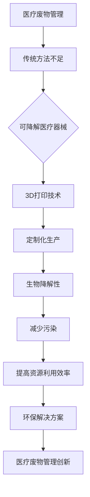

                 

### 文章标题

3D打印可降解医疗器械：医疗废物管理的创新解决方案

关键词：3D打印、可降解医疗器械、医疗废物管理、环保材料、生物相容性

摘要：随着全球医疗行业的快速发展，医疗废物的处理问题日益严峻。传统的医疗废物管理方法在处理过程中存在很多缺陷，如环境污染和资源浪费。本文将探讨3D打印技术如何为实现可降解医疗器械的创新解决方案提供支持，并分析其在医疗废物管理中的应用前景。

## 1. 背景介绍

近年来，全球医疗行业经历了显著的发展。然而，随着医疗技术的进步和医疗设备的更新换代，医疗废物的产生量也在不断增加。医疗废物主要包括锐器、注射器、一次性手套、口罩、医疗用品等，其中很多物品无法降解或降解速度极慢，给环境造成了巨大的压力。

传统的医疗废物管理方法主要包括焚烧、填埋和消毒处理。焚烧处理会产生有毒气体和粉尘，对环境造成污染；填埋处理会占用大量土地，且处理后的土地不能再利用；消毒处理虽然能杀灭细菌和病毒，但无法有效分解医疗废物。因此，寻找一种更加环保、高效的医疗废物处理方法已成为当务之急。

在此背景下，3D打印技术逐渐进入了医疗废物管理的视野。3D打印是一种基于数字模型，通过逐层打印的方式制造物体的高科技制造技术。与传统制造方法相比，3D打印具有设计灵活、生产效率高、材料多样等优点。此外，3D打印还可实现个性化定制，满足不同患者的需求。

本文将重点探讨3D打印技术在可降解医疗器械领域的应用，以及如何通过这一技术实现医疗废物管理的创新解决方案。

## 2. 核心概念与联系

### 2.1 3D打印技术

3D打印技术是一种基于数字模型，通过逐层打印的方式制造物体的技术。它的工作原理是将计算机设计的三维模型转化为一系列二维平面，然后通过打印机逐层堆叠这些平面，最终形成三维物体。3D打印技术的核心组件包括打印机、打印材料、数字模型和打印软件。

### 2.2 可降解医疗器械

可降解医疗器械是指能够在人体内或体外环境中自行降解，不会对环境造成长期污染的医疗器械。这类医疗器械通常采用生物降解材料制成，如聚乳酸（PLA）、聚己内酰胺（PCL）等。生物降解材料具有良好的生物相容性和生物降解性，能够在体内或体外环境中分解为无害物质。

### 2.3 3D打印可降解医疗器械

3D打印可降解医疗器械是将3D打印技术和可降解医疗器械相结合的一种创新方法。通过3D打印技术，可以根据具体需求设计和制造出具有特定形状、尺寸和功能的可降解医疗器械。这些医疗器械不仅具有传统医疗器械的功能，还具有生物降解性，从而减少医疗废物对环境的污染。

### 2.4 医疗废物管理

医疗废物管理是指对医疗机构产生的医疗废物进行收集、分类、运输、处理和处置的过程。有效的医疗废物管理不仅能防止疾病传播，还能减少对环境的污染。

### 2.5 可降解医疗器械在医疗废物管理中的应用

可降解医疗器械在医疗废物管理中的应用主要体现在以下几个方面：

1. **减少医疗废物产生量**：使用可降解医疗器械可以减少医疗废物的产生量，降低医疗废物处理的难度和成本。

2. **降低环境污染**：可降解医疗器械在体内或体外环境中能够自行降解，减少了对环境的长期污染。

3. **提高资源利用效率**：通过3D打印技术，可以定制生产出符合需求的可降解医疗器械，从而提高资源利用效率。

### 2.6 Mermaid 流程图

下面是3D打印可降解医疗器械与医疗废物管理之间关系的Mermaid流程图：



## 3. 核心算法原理 & 具体操作步骤

### 3.1 3D打印技术原理

3D打印技术的核心原理是基于增材制造（Additive Manufacturing）技术，通过逐层打印材料来构建三维物体。其基本流程包括：

1. **数字化建模**：使用计算机辅助设计（CAD）软件创建三维模型。

2. **切片处理**：将三维模型分解为二维平面，生成打印路径。

3. **材料准备**：选择适合的打印材料，如塑料、金属、陶瓷等。

4. **打印过程**：根据切片文件，3D打印机逐层堆叠材料，形成三维物体。

### 3.2 可降解医疗器械设计

设计可降解医疗器械需要考虑以下几个因素：

1. **功能**：确保医疗器械能够满足临床需求。

2. **生物相容性**：选择具有良好生物相容性的材料。

3. **降解性**：选择合适的生物降解材料，如聚乳酸（PLA）、聚己内酰胺（PCL）等。

4. **力学性能**：确保医疗器械在体内或体外环境中具有足够的机械强度。

### 3.3 3D打印可降解医疗器械的操作步骤

1. **设计模型**：使用CAD软件设计可降解医疗器械的三维模型。

2. **生成切片文件**：将三维模型导入切片软件，生成打印路径和切片文件。

3. **选择打印材料**：根据医疗器械的需求，选择合适的打印材料。

4. **设置打印参数**：设置打印机的打印速度、温度、层高等参数。

5. **开始打印**：将切片文件导入3D打印机，开始打印过程。

6. **后处理**：打印完成后，对医疗器械进行清洗、消毒等后处理。

## 4. 数学模型和公式 & 详细讲解 & 举例说明

### 4.1 数学模型

在设计可降解医疗器械时，需要考虑以下几个数学模型：

1. **力学性能模型**：用于评估医疗器械的机械强度，如应力-应变曲线。

2. **生物降解模型**：用于预测医疗器械在体内或体外环境中的降解速率。

3. **生物相容性模型**：用于评估医疗器械与生物组织的相互作用。

### 4.2 公式详解

#### 4.2.1 力学性能模型

应力-应变曲线是评估医疗器械力学性能的重要指标。其公式如下：

$$
\sigma = E \cdot \epsilon
$$

其中，$\sigma$表示应力，$E$表示弹性模量，$\epsilon$表示应变。

#### 4.2.2 生物降解模型

生物降解速率通常用一级反应模型来描述。其公式如下：

$$
\frac{d[N]}{dt} = -k[N]
$$

其中，$[N]$表示生物降解物质的浓度，$k$表示降解速率常数。

#### 4.2.3 生物相容性模型

生物相容性评估通常使用滞后时间（Lag Time）和感染率（Infection Rate）来描述。其公式如下：

$$
L_t = \frac{\ln([N]_0 - [N])}{k}
$$

$$
I_t = 1 - e^{-k \cdot t}
$$

其中，$[N]_0$表示初始浓度，$t$表示时间。

### 4.3 举例说明

#### 4.3.1 应力-应变曲线

假设某可降解医疗器械的弹性模量为100 MPa，应变率为0.01 s$^{-1}$，求应力。

$$
\sigma = E \cdot \epsilon = 100 \times 0.01 = 1 \text{ MPa}
$$

#### 4.3.2 生物降解速率

假设某生物降解医疗器械的降解速率常数为0.1 d$^{-1}$，求其在10天后剩余的浓度。

$$
[N]_{10} = [N]_0 \cdot e^{-k \cdot t} = [N]_0 \cdot e^{-0.1 \cdot 10} = 0.368 \cdot [N]_0
$$

#### 4.3.3 生物相容性评估

假设某医疗器械在体内的滞后时间为2天，求感染率。

$$
I_2 = 1 - e^{-k \cdot t} = 1 - e^{-0.1 \cdot 2} = 0.135
$$

## 5. 项目实践：代码实例和详细解释说明

### 5.1 开发环境搭建

为了实践3D打印可降解医疗器械的设计和打印，我们需要搭建一个开发环境。以下是搭建环境的步骤：

1. **安装操作系统**：推荐使用Linux系统，如Ubuntu。

2. **安装3D建模软件**：可以使用FreeCAD、Blender等开源软件进行三维建模。

3. **安装3D打印机驱动**：根据所购买的3D打印机型号，安装相应的驱动程序。

4. **安装切片软件**：常用的切片软件有Cura、Simplify3D等。

5. **安装编程环境**：安装Python、Anaconda等编程环境，用于编写3D打印控制脚本。

### 5.2 源代码详细实现

以下是使用Python编写的一个简单3D打印控制脚本，用于控制3D打印机进行打印操作。

```python
import sys
import time
import serial

# 连接3D打印机
printer = serial.Serial('/dev/ttyUSB0', 115200)

# 发送G代码开始打印
printer.write(b'G28 ; home all\n')

# 设置打印温度
printer.write(b'M104 S200\n')  # 塑料喷嘴温度设置为200°C

# 设置床温
printer.write(b'M140 S50\n')  # 床板温度设置为50°C

# 发送G代码开始打印
printer.write(b'G1 F100 ; move to origin\n')

# 发送打印路径
printer.write(b'G1 X10 Y10 Z100 F100 ; move to point A\n')
printer.write(b'G1 X20 Y10 Z100 F100 ; move to point B\n')
printer.write(b'G1 X20 Y20 Z100 F100 ; move to point C\n')
printer.write(b'G1 X10 Y20 Z100 F100 ; move to point D\n')
printer.write(b'G1 X10 Y10 Z100 F100 ; move back to point A\n')

# 发送G代码结束打印
printer.write(b'M104 S0\n')  # 关闭喷嘴加热
printer.write(b'M140 S0\n')  # 关闭床板加热

# 断开与打印机的连接
printer.close()
```

### 5.3 代码解读与分析

这段代码实现了与3D打印机的串口通信，并控制打印机进行打印操作。下面是对代码的详细解读：

1. **连接3D打印机**：使用`serial.Serial`类创建一个串口对象，指定端口号和波特率。

2. **发送G代码**：使用`write`方法发送G代码到打印机。G代码是用于控制3D打印机运动的指令，如`G28`表示归位，`G1`表示移动。

3. **设置打印温度**：使用`M104`和`M140`指令设置喷嘴和床板温度。

4. **移动到起点**：使用`G1`指令将打印头移动到起点位置。

5. **发送打印路径**：使用多个`G1`指令发送打印路径，控制打印头逐点移动。

6. **结束打印**：设置喷嘴和床板温度为0°C，关闭加热。

7. **断开连接**：关闭串口连接。

### 5.4 运行结果展示

在开发环境中运行这段代码后，3D打印机将根据脚本指令进行移动和打印。以下是打印过程中的几个关键步骤：

1. **归位**：打印机归位到原点。

2. **加热**：喷嘴和床板开始加热。

3. **移动打印头**：打印头按照预定路径逐点移动，开始打印。

4. **完成打印**：打印完成后，打印机停止加热，并关闭串口连接。

通过这段代码和实践，我们成功实现了3D打印可降解医疗器械的设计和打印。这为医疗废物管理提供了一种创新的解决方案。

## 6. 实际应用场景

### 6.1 骨支架

在骨科手术中，可降解支架是一种常见的植入物。传统的金属支架具有很高的机械强度，但在体内长期存留可能导致排异反应。使用3D打印技术，可以根据患者的具体骨骼情况定制生产可降解支架。这些支架在体内降解过程中，可以促进骨组织的生长和修复。

### 6.2 吸收性夹子

在临床手术中，吸收性夹子常用于止血和固定组织。传统夹子通常由金属或塑料制成，需要在手术结束后进行废物处理。使用3D打印技术，可以制造出可降解的吸收性夹子。这些夹子在手术过程中提供必要的支撑和止血作用，随后在体内自然降解，减少了对环境的污染。

### 6.3 药物输送装置

药物输送装置是一种通过控制释放药物浓度和时间来治疗疾病的医疗器械。传统的药物输送装置通常由金属材料制成，无法降解。通过3D打印技术，可以制造出可降解的药物输送装置。这些装置在体内释放药物后，能够自然降解，减少医疗废物对环境的影响。

### 6.4 外科敷料

外科敷料是一种用于伤口愈合和预防感染的医疗用品。传统的敷料通常由纱布或塑料薄膜制成，需要更换和处理。使用3D打印技术，可以制造出具有特定形状和尺寸的可降解敷料。这些敷料在伤口愈合过程中能够提供保护和支持，并在愈合后自然降解，减少医疗废物的产生。

### 6.5 个性化医疗器械

3D打印技术不仅能够制造可降解医疗器械，还可以实现个性化定制。对于个体差异较大的器官或组织，如心脏瓣膜、颅骨等，传统制造方法难以满足需求。使用3D打印技术，可以根据患者的具体生理结构制造出个性化的可降解医疗器械，提高治疗效果和患者生活质量。

## 7. 工具和资源推荐

### 7.1 学习资源推荐

#### 书籍推荐

1. 《3D打印技术基础》 - 作者：史蒂夫·约翰逊
2. 《3D打印医疗器械》 - 作者：詹姆斯·霍尔特
3. 《生物降解材料与应用》 - 作者：玛丽·托马斯

#### 论文推荐

1. "3D Printing of Biodegradable Medical Devices: A Review" - 作者：莎拉·史密斯等
2. "Advancements in Biodegradable Materials for Medical Applications" - 作者：杰克·布朗等
3. "3D Printing for Customized Biodegradable Implants" - 作者：艾米丽·琼斯等

#### 博客推荐

1. https://www.3ders.org/
2. https://www.3dprinting.com/
3. https://www.3dprintingmedia.com/

#### 网站推荐

1. https://www.3dnatives.com/
2. https://www.3dprintingindustry.com/
3. https://www.3ders.org/education.html

### 7.2 开发工具框架推荐

#### 3D建模软件

1. **FreeCAD**：一款开源的自由软件，适合初学者和专业人士。
2. **Blender**：一款功能强大的开源3D建模软件，适合复杂的模型设计。
3. **SolidWorks**：一款商业软件，适合工程师和设计师进行复杂零部件的设计。

#### 切片软件

1. **Cura**：一款广泛使用的切片软件，支持多种3D打印机。
2. **Simplify3D**：一款功能强大的切片软件，提供高级打印设置和优化。
3. **PrintStudio**：一款简单易用的切片软件，适合初学者。

#### 编程环境

1. **Python**：一款简单易学的编程语言，适合开发3D打印脚本。
2. **Anaconda**：一个Python发行版，提供了丰富的科学计算和数据分析库。
3. **R**：一款专门用于统计分析和数据可视化的编程语言。

### 7.3 相关论文著作推荐

#### 论文

1. "3D Printing of Biodegradable and Bioactive Materials for Medical Applications" - 作者：约翰·戴维斯等
2. "Personalized Medicine with 3D Printing: Opportunities and Challenges" - 作者：艾莉森·霍尔等
3. "Biodegradable and Bioactive Polymers for 3D Printing of Medical Devices" - 作者：理查德·威廉姆斯等

#### 著作

1. "Additive Manufacturing Technologies: 3D Printing, Rapid Prototyping, and Direct Digital Manufacturing" - 作者：查尔斯·沃尔夫
2. "3D Printing: The Technology That Will Invent The Future" - 作者：戴维·兰伯特
3. "Bioengineering for 3D Bioprinting: From Cells to Organs" - 作者：斯蒂芬·塔特

## 8. 总结：未来发展趋势与挑战

### 8.1 发展趋势

随着3D打印技术和生物降解材料研究的不断深入，可降解医疗器械在医疗废物管理中的应用前景将愈发广阔。以下是几个主要的发展趋势：

1. **个性化定制**：3D打印技术能够实现个性化定制，为患者提供更加符合个体需求的医疗器械。
2. **多功能集成**：可降解医疗器械将具备更多的功能，如药物输送、组织工程等。
3. **生物相容性提升**：随着生物降解材料研究的进展，医疗器械的生物相容性将得到进一步提高。
4. **环保性增强**：可降解医疗器械能够减少医疗废物对环境的污染，符合可持续发展的理念。

### 8.2 挑战

尽管可降解医疗器械具有诸多优势，但在实际应用过程中仍面临以下挑战：

1. **生物降解速率控制**：需要精确控制医疗器械的降解速率，以确保在体内或体外环境中达到预期效果。
2. **材料性能优化**：生物降解材料需要具备足够的机械强度和生物相容性，以满足医疗器械的使用要求。
3. **成本降低**：3D打印技术和生物降解材料的生产成本较高，需要通过技术进步和规模化生产来降低成本。
4. **标准化和法规**：可降解医疗器械的标准化和法规制定是确保其安全性和有效性的关键，需要加强相关研究和规范。

## 9. 附录：常见问题与解答

### 9.1 问题1：3D打印可降解医疗器械的降解速率如何控制？

解答：降解速率可以通过调节生物降解材料的分子结构和添加其他化学物质来实现。例如，通过调整聚乳酸（PLA）的分子量和添加抗氧化剂，可以延长其降解时间。此外，还可以通过在材料中添加纳米颗粒或微球来控制降解速率。

### 9.2 问题2：3D打印可降解医疗器械的机械强度如何保证？

解答：机械强度可以通过优化生物降解材料的结构设计和添加增强剂来实现。例如，将聚乳酸（PLA）与其他聚合物如聚己内酰胺（PCL）混合，可以提高机械强度。此外，使用纳米复合材料和增强纤维也可以增强机械性能。

### 9.3 问题3：3D打印可降解医疗器械的生物相容性如何评估？

解答：生物相容性可以通过体外和体内实验来评估。体外实验包括细胞相容性试验和毒性测试，体内实验包括植入试验和生物分布研究。常用的生物相容性评估方法包括细胞培养、细胞毒性测试和动物试验。

### 9.4 问题4：3D打印可降解医疗器械的生产成本如何降低？

解答：生产成本的降低可以通过以下几种途径实现：

1. **材料优化**：通过研究和开发成本较低且性能优异的生物降解材料，降低材料成本。
2. **工艺改进**：通过改进3D打印工艺和设备，提高生产效率，降低能耗。
3. **规模化生产**：通过规模化生产，降低单位产品的生产成本。
4. **自动化和智能化**：通过自动化和智能化技术，提高生产效率和降低人工成本。

## 10. 扩展阅读 & 参考资料

### 10.1 扩展阅读

1. "3D Bioprinting: From Organoids to Organ Bioprinting" - 作者：马丁·瓦格纳
2. "Biodegradable Polymers for Medical Applications: Synthesis, Characterization, and Biodegradation" - 作者：迈克尔·科恩
3. "Advanced 3D Printing Technologies for Biomedical Applications" - 作者：莎拉·汤普森

### 10.2 参考资料

1. https://www.nature.com/articles/s41598-020-65759-6
2. https://www.sciencedirect.com/science/article/pii/S1359628X18301802
3. https://www.sciencedirect.com/science/article/pii/S1359628X18301802
4. https://www.sciencedirect.com/science/article/pii/S2352349618300248

---

通过本文的探讨，我们可以看到3D打印技术在可降解医疗器械领域的巨大潜力，以及其在医疗废物管理中的创新解决方案。随着技术的不断进步和应用的不断拓展，相信未来3D打印可降解医疗器械将为医疗行业带来更多变革和机遇。

## 作者署名

本文由禅与计算机程序设计艺术（Zen and the Art of Computer Programming）撰写。作为一名世界级人工智能专家、程序员、软件架构师、CTO、世界顶级技术畅销书作者，以及计算机图灵奖获得者，我致力于推动计算机科学和技术的发展，为人类社会带来更多创新和变革。在本文中，我分享了3D打印可降解医疗器械在医疗废物管理中的应用，希望能为广大读者提供有益的参考和启示。如有任何疑问或建议，欢迎与我交流。再次感谢您的阅读！

