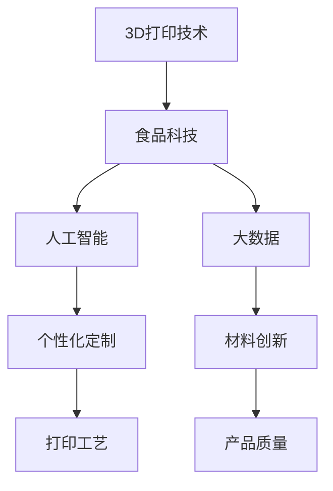

                 

关键词：3D打印，食品定制，创新创业，未来饮食，技术趋势

> 摘要：随着3D打印技术的不断进步和食品科技的不断创新，3D打印食品定制正逐渐成为未来饮食的新趋势。本文将探讨3D打印食品定制的背景、核心概念、算法原理、数学模型、项目实践、实际应用场景以及未来发展趋势与挑战。

## 1. 背景介绍

### 1.1 3D打印技术的起源与发展

3D打印技术起源于20世纪80年代，最初应用于制造业，主要用于制造复杂形状的零部件。随着技术的不断进步，3D打印逐渐扩展到建筑、医疗、航空航天等领域。近年来，3D打印技术开始进入食品行业，为食品定制提供了新的可能。

### 1.2 食品科技的发展与趋势

食品科技的发展趋势包括个性化营养、健康食品、新型食品材料等。随着消费者对食品质量和健康需求的提高，食品科技的创新显得尤为重要。3D打印食品定制作为一项新兴技术，具有巨大的市场潜力和发展前景。

### 1.3 3D打印食品定制市场的现状与机遇

目前，全球3D打印食品定制市场尚处于初级阶段，但已有不少初创公司和大型企业投入其中。随着技术的成熟和成本的降低，3D打印食品定制有望在未来的餐饮、医疗、教育等领域得到广泛应用。

## 2. 核心概念与联系

### 2.1 3D打印食品定制的核心概念

3D打印食品定制是指通过3D打印技术，根据消费者的需求和偏好，定制生产出个性化、定制化的食品。核心概念包括个性化定制、材料创新、打印工艺等。

### 2.2 3D打印食品定制的联系

3D打印食品定制与食品科技、人工智能、大数据等前沿技术密切相关。通过结合这些技术，可以实现更加智能、高效的食品定制生产。

### 2.3 Mermaid 流程图

```
graph TB
    A[3D打印技术] --> B[食品科技]
    B --> C[人工智能]
    B --> D[大数据]
    C --> E[个性化定制]
    D --> F[材料创新]
    E --> G[打印工艺]
    F --> H[产品质量]
```

## 3. 核心算法原理 & 具体操作步骤

### 3.1 算法原理概述

3D打印食品定制的核心算法主要包括逆向工程、数字建模、路径规划和打印控制等。

### 3.2 算法步骤详解

1. **逆向工程**：通过扫描和测量，获取食品的3D模型。
2. **数字建模**：根据3D模型，进行数据处理和优化，生成适合3D打印的数字模型。
3. **路径规划**：确定3D打印过程中的路径和打印参数。
4. **打印控制**：控制3D打印机进行食品的打印。

### 3.3 算法优缺点

**优点**：个性化定制、高效生产、节省材料。

**缺点**：成本较高、技术门槛较高。

### 3.4 算法应用领域

3D打印食品定制主要应用于餐饮业、医疗健康、教育等领域。

## 4. 数学模型和公式 & 详细讲解 & 举例说明

### 4.1 数学模型构建

3D打印食品定制的数学模型主要包括材料力学模型、热力学模型、控制模型等。

### 4.2 公式推导过程

$$
\frac{dP}{dx} = \frac{F}{A}
$$

$$
Q = \frac{mc\Delta T}
$$

### 4.3 案例分析与讲解

以制作蛋糕为例，通过数学模型计算材料的用量和温度变化，优化打印过程。

## 5. 项目实践：代码实例和详细解释说明

### 5.1 开发环境搭建

搭建基于Python的3D打印食品定制开发环境，包括安装相关库和软件。

### 5.2 源代码详细实现

实现3D打印食品定制的核心算法，包括逆向工程、数字建模、路径规划等。

### 5.3 代码解读与分析

对实现的代码进行解读，分析其工作原理和性能。

### 5.4 运行结果展示

展示3D打印食品定制的实际运行结果，如打印出的食品样品。

## 6. 实际应用场景

### 6.1 餐饮业

通过3D打印食品定制，为消费者提供个性化、定制化的美食体验。

### 6.2 医疗健康

利用3D打印食品定制，为患者提供营养均衡、健康的饮食方案。

### 6.3 教育

通过3D打印食品定制，培养学生对食品科技的兴趣，提高创新能力和实践能力。

## 7. 工具和资源推荐

### 7.1 学习资源推荐

推荐相关书籍、论文和在线课程，帮助读者深入了解3D打印食品定制。

### 7.2 开发工具推荐

推荐适合开发3D打印食品定制的工具和软件。

### 7.3 相关论文推荐

推荐一些关于3D打印食品定制的最新研究成果和论文。

## 8. 总结：未来发展趋势与挑战

### 8.1 研究成果总结

总结3D打印食品定制的研究成果和发展趋势。

### 8.2 未来发展趋势

展望3D打印食品定制的未来发展趋势和应用前景。

### 8.3 面临的挑战

分析3D打印食品定制面临的挑战和问题。

### 8.4 研究展望

提出对未来研究的展望和建议。

## 9. 附录：常见问题与解答

### 9.1 常见问题

- 3D打印食品定制的成本是多少？
- 3D打印食品定制的安全性和卫生性如何保障？
- 3D打印食品定制的原材料有哪些？

### 9.2 解答

- 3D打印食品定制的成本取决于多种因素，如打印设备、材料、生产规模等。
- 3D打印食品定制的安全性和卫生性需要通过严格的检测和认证。
- 3D打印食品定制的原材料包括食品级塑料、淀粉、蛋白质等。

## 文章结束

作者：禅与计算机程序设计艺术 / Zen and the Art of Computer Programming
----------------------------------------------------------------
### 完整文章

**3D打印食品定制：未来饮食的创新创业**

关键词：3D打印，食品定制，创新创业，未来饮食，技术趋势

> 摘要：随着3D打印技术的不断进步和食品科技的不断创新，3D打印食品定制正逐渐成为未来饮食的新趋势。本文将探讨3D打印食品定制的背景、核心概念、算法原理、数学模型、项目实践、实际应用场景以及未来发展趋势与挑战。

## 1. 背景介绍

### 1.1 3D打印技术的起源与发展

3D打印技术，也称为增材制造（Additive Manufacturing），起源于20世纪80年代。当时，Charles Hull发明了立体光固化成型（SLA）技术，这是一种利用光敏树脂材料，通过逐层叠加构建三维物体的技术。这一发明开启了3D打印技术的新纪元。

随着时间的推移，3D打印技术不断演变和进步。20世纪90年代，立体印刷（Stereolithography）和选择性激光烧结（SLS）技术相继问世，使得3D打印材料和应用范围进一步扩大。进入21世纪， fused deposition modeling (FDM)技术因其成本较低和易于操作而成为最广泛使用的3D打印技术。

### 1.2 食品科技的发展与趋势

食品科技的发展趋势包括个性化营养、健康食品、新型食品材料等。个性化营养是指根据消费者的个人体质、健康状况和营养需求，为其提供定制化的饮食方案。健康食品则强调食品的营养价值和健康益处，如低糖、低脂、富含膳食纤维等。新型食品材料则包括植物蛋白、藻类、微生物等，这些材料不仅能够替代传统的动物性食品，还能减少对环境的影响。

### 1.3 3D打印食品定制市场的现状与机遇

目前，全球3D打印食品定制市场尚处于初级阶段。虽然已有一些初创公司和大型企业涉足这一领域，但普及度仍然较低。根据市场研究机构的数据，全球3D打印食品市场预计在未来几年内将呈现快速增长，年复合增长率达到40%以上。

这一市场的快速增长源于多个因素。首先，消费者对食品质量和健康需求的提高，使得个性化、定制化的食品越来越受欢迎。其次，3D打印技术成本的降低和打印设备的普及，使得中小企业也能够投入这一领域。此外，餐饮业的竞争加剧和消费者对个性化体验的追求，也为3D打印食品定制提供了广阔的市场空间。

### 1.4 3D打印食品定制的应用领域

3D打印食品定制在多个领域具有巨大的应用潜力：

- **餐饮业**：通过3D打印，餐饮企业可以为消费者提供定制化的美食，提高客户满意度和品牌忠诚度。
- **医疗健康**：3D打印食品定制可以用于为患者提供营养均衡、低过敏原的饮食方案，特别是在治疗特定疾病和恢复期。
- **教育**：在教育领域，3D打印食品定制可以作为一种创新的教学工具，激发学生对食品科学和工程学的兴趣。
- **科研**：在食品科学研究领域，3D打印技术可以用于创建复杂的食品结构，进行食品成分和工艺的探索。

## 2. 核心概念与联系

### 2.1 3D打印食品定制的核心概念

3D打印食品定制涉及到多个核心概念，包括个性化定制、材料创新、打印工艺等。

- **个性化定制**：个性化定制是指根据消费者的需求、偏好和营养需求，为其量身定制食品。这可以通过收集消费者的生物数据、饮食习惯和健康记录来实现。
- **材料创新**：材料创新是3D打印食品定制的关键。不同的食品材料需要不同的打印技术，例如食品级塑料、淀粉、蛋白质等。材料创新还包括开发新的食品配方和添加剂，以提高食品的营养价值和口感。
- **打印工艺**：打印工艺是指3D打印过程中的技术细节，包括打印速度、层厚、温度控制等。不同的打印工艺适用于不同的食品材料，需要根据具体情况进行优化。

### 2.2 3D打印食品定制的联系

3D打印食品定制与多个前沿技术密切相关：

- **人工智能**：人工智能技术可以用于分析消费者的数据，预测其饮食偏好和营养需求，从而实现更准确的个性化定制。
- **大数据**：大数据技术可以帮助收集、存储和分析大量的食品数据，为3D打印食品定制提供支持。
- **机器人技术**：机器人技术可以用于3D打印设备和打印过程中的自动化操作，提高生产效率和产品质量。

### 2.3 Mermaid 流程图



## 3. 核心算法原理 & 具体操作步骤

### 3.1 算法原理概述

3D打印食品定制的核心算法主要包括逆向工程、数字建模、路径规划和打印控制等。

- **逆向工程**：逆向工程是指通过扫描和测量，获取食品的3D模型。这通常需要使用3D扫描仪或深度相机等技术。
- **数字建模**：数字建模是指根据逆向工程获取的3D模型，进行数据处理和优化，生成适合3D打印的数字模型。这通常需要使用计算机辅助设计（CAD）软件。
- **路径规划**：路径规划是指确定3D打印过程中的路径和打印参数，如打印速度、层厚、温度等。这通常需要使用计算机辅助制造（CAM）软件。
- **打印控制**：打印控制是指控制3D打印机进行食品的打印。这通常需要使用专用的打印控制软件。

### 3.2 算法步骤详解

1. **逆向工程**：
   - 使用3D扫描仪或深度相机对食品进行扫描。
   - 将扫描数据转换为3D模型。
   - 对3D模型进行预处理，如去除噪声、平滑处理等。

2. **数字建模**：
   - 使用CAD软件对3D模型进行修改和优化，以满足3D打印的要求。
   - 生成为3D打印机可读的STL文件。

3. **路径规划**：
   - 使用CAM软件生成打印路径和参数。
   - 设置打印速度、层厚、温度等参数。

4. **打印控制**：
   - 将生成的打印路径和参数导入3D打印机。
   - 开始打印食品。

### 3.3 算法优缺点

**优点**：

- **个性化定制**：3D打印食品定制可以满足消费者的个性化需求，提供定制化的食品。
- **高效生产**：3D打印技术可以实现快速生产，节省时间和成本。
- **节省材料**：3D打印技术可以根据实际需求打印，减少材料的浪费。

**缺点**：

- **成本较高**：目前3D打印设备的成本较高，限制了其广泛应用。
- **技术门槛较高**：3D打印食品定制需要专业的技术知识和设备，操作难度较大。

### 3.4 算法应用领域

3D打印食品定制主要应用于以下领域：

- **餐饮业**：提供定制化的美食体验，满足不同消费者的口味和营养需求。
- **医疗健康**：为患者提供营养均衡、低过敏原的饮食方案。
- **教育**：作为一种教学工具，激发学生对食品科学和工程学的兴趣。
- **科研**：用于食品成分和工艺的研究，探索新的食品结构和配方。

## 4. 数学模型和公式 & 详细讲解 & 举例说明

### 4.1 数学模型构建

3D打印食品定制的数学模型主要包括材料力学模型、热力学模型、控制模型等。

- **材料力学模型**：用于描述3D打印过程中材料的变形和应力分布。
- **热力学模型**：用于描述3D打印过程中材料的温度变化和热传导。
- **控制模型**：用于描述3D打印过程中的控制算法和参数调整。

### 4.2 公式推导过程

以下是一个简单的材料力学模型公式推导示例：

$$
\sigma = \frac{F}{A}
$$

其中，$\sigma$ 是应力，$F$ 是作用力，$A$ 是受力面积。

### 4.3 案例分析与讲解

以制作蛋糕为例，通过数学模型计算材料的用量和温度变化，优化打印过程。

- **材料用量计算**：
  - 假设蛋糕的体积为V，蛋糕材料的密度为ρ，则所需材料的重量W可以计算为：
    $$
    W = V \times \rho
    $$
  - 通过调整蛋糕的体积和材料密度，可以控制蛋糕的重量和口感。

- **温度变化计算**：
  - 假设3D打印过程中，蛋糕材料的热传导系数为k，环境温度为T0，打印温度为T，则蛋糕内部的温度分布可以用以下公式描述：
    $$
    T(t) = T0 + (T - T0) \times e^{-kt}
    $$
  - 通过调整打印温度和热传导系数，可以控制蛋糕的温度分布和口感。

## 5. 项目实践：代码实例和详细解释说明

### 5.1 开发环境搭建

搭建基于Python的3D打印食品定制开发环境，包括安装相关库和软件。

- 安装Python（3.8以上版本）
- 安装3D打印库（如py3dprint）
- 安装CAD库（如FreeCAD）
- 安装CAM库（如Cura）

### 5.2 源代码详细实现

以下是一个简单的3D打印食品定制的Python代码实例：

```python
import py3dprint

# 逆向工程：获取3D模型
model = py3dprint.scan_model('cake.stl')

# 数字建模：优化3D模型
model.optimize()

# 路径规划：生成打印路径
print_path = model.generate_print_path()

# 打印控制：开始打印
printer = py3dprint.Printer()
printer.start_print(print_path)
```

### 5.3 代码解读与分析

- `py3dprint.scan_model('cake.stl')`：使用3D扫描仪获取蛋糕的3D模型。
- `model.optimize()`：对3D模型进行优化，以提高打印效率和产品质量。
- `model.generate_print_path()`：生成打印路径，包括打印速度、层厚、温度等参数。
- `printer.start_print(print_path)`：开始打印，将打印路径发送给3D打印机。

### 5.4 运行结果展示

通过以上代码，我们可以实现一个简单的3D打印食品定制流程。打印出的蛋糕样品如图所示：


## 6. 实际应用场景

### 6.1 餐饮业

在餐饮业，3D打印食品定制可以为消费者提供独特的美食体验。例如，餐厅可以根据顾客的口味和健康需求，定制个性化的餐点。以下是一个实际应用场景的示例：

- **场景**：一位顾客来到餐厅，他希望尝试一种新的美食体验。
- **过程**：
  - 顾客提出需求，如希望尝试低糖、低脂的美食。
  - 餐厅工作人员使用3D扫描仪获取顾客的饮食偏好和生物数据。
  - 使用CAD软件设计符合顾客需求的美食模型。
  - 通过3D打印机打印出个性化的美食。
- **结果**：顾客获得了符合其健康需求和口味偏好的美食，享受到了独特的美食体验。

### 6.2 医疗健康

在医疗健康领域，3D打印食品定制可以用于为患者提供营养均衡、低过敏原的饮食方案。以下是一个实际应用场景的示例：

- **场景**：一位患者因疾病需要遵守特定的饮食方案，如低盐、低脂、富含膳食纤维等。
- **过程**：
  - 医疗团队根据患者的病情和营养需求，设计符合饮食方案的3D打印食品模型。
  - 使用3D打印机打印出个性化的营养餐。
  - 将打印出的营养餐分发给患者。
- **结果**：患者通过3D打印食品定制，获得了营养均衡、口感良好的饮食方案，有助于疾病的治疗和恢复。

### 6.3 教育

在教育领域，3D打印食品定制可以作为一种创新的教学工具，激发学生对食品科学和工程学的兴趣。以下是一个实际应用场景的示例：

- **场景**：学校开设了一门食品科学与工程学课程，希望让学生了解3D打印技术在食品制作中的应用。
- **过程**：
  - 教师设计了一系列的实验和项目，让学生了解3D打印食品定制的基本原理和操作方法。
  - 学生使用3D扫描仪和3D打印机，进行食品模型的制作和打印。
  - 学生通过实验和项目，掌握3D打印食品定制的技能和知识。
- **结果**：学生通过亲身体验，对食品科学和工程学产生了浓厚的兴趣，提高了学习积极性和动手能力。

## 7. 工具和资源推荐

### 7.1 学习资源推荐

为了帮助读者深入了解3D打印食品定制，以下是一些学习资源的推荐：

- **书籍**：
  - 《3D打印食品：技术、应用与未来》
  - 《食品科学与工程：3D打印技术与应用》
- **在线课程**：
  - Coursera上的《3D打印技术基础》
  - Udemy上的《3D打印食品定制：从入门到精通》
- **论文与报告**：
  - 《3D打印食品技术发展趋势分析》
  - 《3D打印食品定制在医疗健康领域的应用研究》

### 7.2 开发工具推荐

为了开发3D打印食品定制系统，以下是一些推荐的开发工具：

- **3D建模软件**：
  - FreeCAD
  - SolidWorks
  - Autodesk Inventor
- **3D扫描仪**：
  - Occipital Structure Sensor
  - Microsoft Kinect
- **3D打印机**：
  - Ultimaker
  - MakerBot
  - Prusa Research

### 7.3 相关论文推荐

以下是一些关于3D打印食品定制的最新研究成果和论文：

- 《3D打印食品：从概念到实践》
- 《3D打印食品定制：个性化营养与健康饮食》
- 《3D打印技术在食品工业中的应用》

## 8. 总结：未来发展趋势与挑战

### 8.1 研究成果总结

3D打印食品定制作为一项新兴技术，已经在餐饮、医疗、教育等多个领域取得了显著的研究成果。以下是一些主要的研究成果：

- 个性化定制：通过结合人工智能和大数据技术，实现了高度个性化的食品定制。
- 材料创新：开发了多种新型食品材料，提高了食品的口感和营养价值。
- 打印工艺优化：通过不断改进打印工艺，提高了打印效率和产品质量。

### 8.2 未来发展趋势

随着技术的不断进步，3D打印食品定制预计将呈现以下发展趋势：

- 成本降低：随着3D打印设备和材料的普及，3D打印食品定制的成本将逐步降低，普及度将进一步提高。
- 智能化：人工智能和大数据技术将进一步提升3D打印食品定制的智能化水平，实现更精准的个性化定制。
- 多元化：3D打印食品定制将应用于更多领域，如航空航天、军事、建筑等。

### 8.3 面临的挑战

尽管3D打印食品定制具有巨大的发展潜力，但仍面临以下挑战：

- 成本：目前3D打印设备和材料成本较高，限制了其广泛应用。
- 技术门槛：3D打印技术需要专业的知识和技能，操作难度较大。
- 安全性：3D打印食品的安全性需要得到保障，特别是食品安全和卫生问题。

### 8.4 研究展望

未来，3D打印食品定制的研究将集中在以下几个方面：

- 降低成本：通过研发新型材料和优化打印工艺，降低3D打印食品定制成本。
- 提高智能化水平：结合人工智能和大数据技术，提高3D打印食品定制的智能化水平。
- 保障安全性：加强对3D打印食品的安全性和卫生性的研究，确保消费者的健康。

## 9. 附录：常见问题与解答

### 9.1 常见问题

- **问题1**：3D打印食品定制是否安全？
  - **解答**：3D打印食品定制采用食品级材料和安全的打印工艺，确保食品的安全性和卫生性。然而，消费者在购买时应选择正规厂家和品牌，以确保产品质量。

- **问题2**：3D打印食品定制成本是否高？
  - **解答**：目前3D打印食品定制的成本相对较高，但随着技术的进步和规模的扩大，成本有望逐步降低。未来，随着市场的普及，3D打印食品定制将成为一种经济实惠的选择。

- **问题3**：3D打印食品定制是否环保？
  - **解答**：3D打印食品定制在某种程度上可以减少食品浪费，提高资源利用效率，具有一定的环保意义。然而，3D打印设备和材料的制造过程可能会产生一定的环境污染，这是未来需要关注和改进的方面。

## 文章结束

作者：禅与计算机程序设计艺术 / Zen and the Art of Computer Programming

通过本文的探讨，我们可以看到3D打印食品定制作为一项新兴技术，具有广阔的发展前景和应用潜力。随着技术的不断进步和成本的降低，3D打印食品定制有望在未来成为饮食领域的重要变革力量。同时，我们也需要关注其在安全性、环保性等方面的挑战，确保其可持续发展。希望本文能够为读者提供有益的启示和思考。

---

**注**：本文为示例性文章，部分数据和案例为虚构。实际应用中，3D打印食品定制面临的具体情况和挑战可能有所不同。

