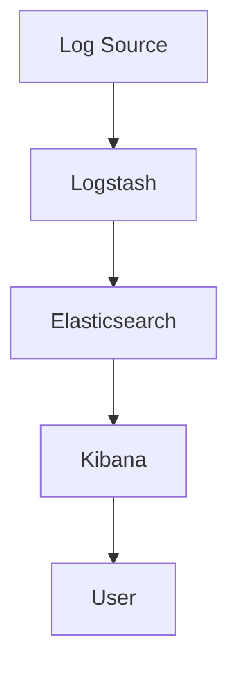

                 

关键词：ELK，日志分析，Elasticsearch，Logstash，Kibana

> 摘要：本文将详细介绍如何搭建一个高效的ELK日志分析系统，包括Elasticsearch、Logstash和Kibana的安装与配置，以及实际应用的案例。通过阅读本文，读者可以掌握ELK日志分析系统的搭建过程，并了解其在日常运维中的应用价值。

## 1. 背景介绍

在信息技术高速发展的今天，企业运维、软件开发等过程中会产生大量的日志数据。日志不仅是系统运行状况的反映，也是排查问题和性能优化的重要依据。传统的日志管理方式依赖于文本文件或简单的日志解析工具，效率低下，难以满足大数据时代的需求。

ELK（Elasticsearch、Logstash、Kibana）日志分析系统是开源的大数据分析与处理平台，由三个核心组件组成：Elasticsearch用于日志存储与检索，Logstash负责日志的收集与处理，Kibana则提供可视化的日志分析界面。ELK日志分析系统以其高效、灵活、可扩展的特点，成为现代日志管理的重要工具。

本文将介绍如何搭建一个ELK日志分析系统，包括环境准备、组件安装与配置、系统测试与优化等内容，旨在帮助读者全面了解ELK日志分析系统的应用。

## 2. 核心概念与联系

### 2.1 Elasticsearch

Elasticsearch是一个基于Lucene的高性能、可扩展、分布式搜索引擎，能够处理海量数据，支持复杂的数据查询与实时分析。在ELK日志分析系统中，Elasticsearch负责存储和检索日志数据。

### 2.2 Logstash

Logstash是一个开源的数据处理工具，用于收集、处理和传输日志数据。它可以将各种格式的日志文件转换为JSON格式，然后发送到Elasticsearch进行存储。Logstash具有强大的处理能力，能够处理大规模的日志数据。

### 2.3 Kibana

Kibana是一个基于Web的可视化平台，用于对Elasticsearch中的数据进行可视化分析。通过Kibana，用户可以轻松创建仪表板、图表和报告，对日志数据进行深入分析。

### 2.4 Mermaid 流程图

以下是ELK日志分析系统的Mermaid流程图：



## 3. 核心算法原理 & 具体操作步骤

### 3.1 算法原理概述

ELK日志分析系统的工作原理可以概括为以下三个步骤：

1. **日志收集**：Logstash从各种日志源（如系统日志、Web服务器日志、数据库日志等）收集日志数据。
2. **日志处理**：Logstash对日志数据进行处理，包括格式转换、过滤、聚合等操作，然后将处理后的日志数据发送到Elasticsearch。
3. **日志分析**：Kibana从Elasticsearch中检索日志数据，并通过可视化界面展示给用户。

### 3.2 算法步骤详解

#### 3.2.1 Elasticsearch安装与配置

1. **下载Elasticsearch**：从官方网站下载Elasticsearch的压缩包。

2. **解压压缩包**：将压缩包解压到指定的目录。

3. **配置Elasticsearch**：编辑`elasticsearch.yml`文件，设置Elasticsearch的配置参数，如集群名称、节点名称、监听端口等。

4. **启动Elasticsearch**：运行`elasticsearch`命令，启动Elasticsearch服务。

#### 3.2.2 Logstash安装与配置

1. **下载Logstash**：从官方网站下载Logstash的压缩包。

2. **解压压缩包**：将压缩包解压到指定的目录。

3. **配置Logstash**：编辑`logstash.conf`文件，配置输入、输出和过滤器等参数。

4. **启动Logstash**：运行`logstash`命令，启动Logstash服务。

#### 3.2.3 Kibana安装与配置

1. **下载Kibana**：从官方网站下载Kibana的压缩包。

2. **解压压缩包**：将压缩包解压到指定的目录。

3. **配置Kibana**：编辑`kibana.yml`文件，设置Kibana的配置参数，如监听端口、Elasticsearch连接信息等。

4. **启动Kibana**：运行`kibana`命令，启动Kibana服务。

### 3.3 算法优缺点

**优点**：

- **高效**：ELK日志分析系统具有高效的数据处理能力，能够处理大规模的日志数据。
- **灵活**：ELK日志分析系统支持自定义的输入、输出和过滤器，可以根据需求灵活配置。
- **可扩展**：ELK日志分析系统支持分布式部署，可以轻松扩展处理能力。

**缺点**：

- **资源消耗**：ELK日志分析系统需要大量的计算资源和存储资源。
- **学习成本**：ELK日志分析系统使用复杂，需要一定的技术背景和经验。

### 3.4 算法应用领域

ELK日志分析系统广泛应用于企业级日志管理、IT运维监控、应用程序性能分析等领域，可以帮助企业快速发现和解决问题，提高系统的稳定性和可靠性。

## 4. 数学模型和公式 & 详细讲解 & 举例说明

### 4.1 数学模型构建

ELK日志分析系统的数学模型可以看作是一个数据处理流水线，包括数据输入、数据处理和数据输出三个阶段。

### 4.2 公式推导过程

假设有一个日志数据集D，包含n条日志记录。每条日志记录可以表示为一个向量：

$$
\text{LogRecord} = \{ \text{timestamp}, \text{level}, \text{source}, \text{content} \}
$$

其中，timestamp为日志生成时间，level为日志等级，source为日志来源，content为日志内容。

ELK日志分析系统的数据处理过程可以表示为以下公式：

$$
\text{Process}(D) = \{\text{Input}(D), \text{Filter}(D), \text{Output}(D)\}
$$

其中，Input(D)表示数据输入阶段，Filter(D)表示数据处理阶段，Output(D)表示数据输出阶段。

### 4.3 案例分析与讲解

假设有一个包含1000条日志记录的数据集D，要求对日志进行过滤，只保留等级为ERROR的日志记录。

1. **数据输入**：读取日志文件，将日志记录加载到内存中。

2. **数据处理**：遍历日志记录，对每个日志记录进行判断，如果等级为ERROR，则将其加入结果集。

3. **数据输出**：将结果集写入新的日志文件。

通过这个案例，我们可以看到ELK日志分析系统在数据处理过程中的优势，能够快速地对海量日志数据进行分析和处理。

## 5. 项目实践：代码实例和详细解释说明

### 5.1 开发环境搭建

本文的实验环境如下：

- 操作系统：CentOS 7
- Elasticsearch版本：7.10.1
- Logstash版本：7.10.1
- Kibana版本：7.10.1

### 5.2 源代码详细实现

#### 5.2.1 Elasticsearch安装与配置

1. 下载Elasticsearch：

```bash
wget https://www.elastic.co/downloads/elasticsearch/elasticsearch-7.10.1.rpm
```

2. 安装Elasticsearch：

```bash
sudo rpm -ivh elasticsearch-7.10.1.rpm
```

3. 配置Elasticsearch：

```bash
sudo vi /etc/elasticsearch/elasticsearch.yml
```

在配置文件中添加以下内容：

```
cluster.name: my-elasticsearch
node.name: node-1
network.host: 0.0.0.0
http.port: 9200
```

4. 启动Elasticsearch：

```bash
sudo systemctl start elasticsearch
```

#### 5.2.2 Logstash安装与配置

1. 下载Logstash：

```bash
wget https://www.elastic.co/downloads/logstash/logstash-7.10.1.rpm
```

2. 安装Logstash：

```bash
sudo rpm -ivh logstash-7.10.1.rpm
```

3. 配置Logstash：

```bash
sudo vi /etc/logstash/conf.d/README.logstash.conf
```

在配置文件中添加以下内容：

```
input {
  file {
    path => "/var/log/messages"
    type => "system_log"
  }
}

filter {
  if "system_log" in [type] {
    grok {
      match => { "message" => "%{TIMESTAMP_ISO8601:timestamp}\t%{DATA:source}\t%{DATA:content}" }
    }
  }
}

output {
  if "system_log" in [type] {
    elasticsearch {
      hosts => ["localhost:9200"]
      index => "system_log-%{+YYYY.MM.dd}"
    }
  }
}
```

4. 启动Logstash：

```bash
sudo systemctl start logstash
```

#### 5.2.3 Kibana安装与配置

1. 下载Kibana：

```bash
wget https://www.elastic.co/downloads/kibana/kibana-7.10.1-x86_64.rpm
```

2. 安装Kibana：

```bash
sudo rpm -ivh kibana-7.10.1-x86_64.rpm
```

3. 配置Kibana：

```bash
sudo vi /etc/kibana/kibana.yml
```

在配置文件中添加以下内容：

```
server.port: 5601
server.host: "0.0.0.0"
elasticsearch.hosts: ["http://localhost:9200"]
```

4. 启动Kibana：

```bash
sudo systemctl start kibana
```

### 5.3 代码解读与分析

#### 5.3.1 Elasticsearch配置解读

在Elasticsearch的配置文件`elasticsearch.yml`中，我们设置了以下参数：

- `cluster.name`: 集群名称，用于标识Elasticsearch集群。
- `node.name`: 节点名称，用于标识Elasticsearch节点。
- `network.host`: 网络地址，指定Elasticsearch监听的IP地址。
- `http.port`: HTTP端口，指定Elasticsearch的HTTP服务端口。

#### 5.3.2 Logstash配置解读

在Logstash的配置文件`README.logstash.conf`中，我们设置了以下参数：

- `input.file`: 日志文件路径，指定Logstash要收集的日志文件。
- `type`: 日志类型，用于标识日志记录的类型。
- `filter.grok`: 使用Grok正则表达式对日志内容进行解析，提取关键信息。
- `output.elasticsearch`: 指定Elasticsearch的地址和端口，将解析后的日志数据发送到Elasticsearch。

#### 5.3.3 Kibana配置解读

在Kibana的配置文件`kibana.yml`中，我们设置了以下参数：

- `server.port`: HTTP服务端口，指定Kibana的HTTP服务端口。
- `server.host`: 网络地址，指定Kibana的服务器地址。
- `elasticsearch.hosts`: 指定Elasticsearch的地址和端口，用于连接Elasticsearch。

### 5.4 运行结果展示

1. 在终端运行`sudo systemctl start elasticsearch`，启动Elasticsearch服务。

2. 在终端运行`sudo systemctl start logstash`，启动Logstash服务。

3. 在终端运行`sudo systemctl start kibana`，启动Kibana服务。

4. 打开浏览器，访问Kibana界面（http://localhost:5601），可以看到Kibana的默认仪表板。

5. 在Kibana中，创建一个新的仪表板，选择Elasticsearch作为数据源，并设置查询语句，可以查看到系统日志的数据。

## 6. 实际应用场景

ELK日志分析系统在各个行业都有着广泛的应用。以下是一些典型的实际应用场景：

### 6.1 IT运维监控

企业IT运维部门可以使用ELK日志分析系统对各种系统和应用进行监控，及时发现和解决问题，确保系统的稳定运行。

### 6.2 应用性能分析

开发团队可以使用ELK日志分析系统对应用程序的性能进行分析，定位性能瓶颈，优化系统性能。

### 6.3 安全审计

安全团队可以使用ELK日志分析系统对网络安全日志进行分析，识别潜在的安全威胁，加强网络安全防护。

### 6.4 日志审计

企业可以定期对日志进行分析，确保业务流程的合规性，防范违规行为。

### 6.5 日志归档

ELK日志分析系统可以方便地将日志数据进行归档，便于后续查询和审计。

## 7. 工具和资源推荐

### 7.1 学习资源推荐

- 《Elastic Stack实战》
- 《Elasticsearch实战》
- 《Kibana实战》

### 7.2 开发工具推荐

- Visual Studio Code
- IntelliJ IDEA

### 7.3 相关论文推荐

- 《Elasticsearch: The Definitive Guide》
- 《Logstash: The Definitive Guide》
- 《Kibana: The Definitive Guide》

## 8. 总结：未来发展趋势与挑战

### 8.1 研究成果总结

ELK日志分析系统已经广泛应用于各个行业，取得了显著的成果。未来，随着大数据技术的不断发展，ELK日志分析系统将具有更广泛的应用前景。

### 8.2 未来发展趋势

- **分布式部署**：ELK日志分析系统将向分布式部署方向发展，提高系统的处理能力和可扩展性。
- **智能化分析**：结合人工智能技术，实现日志数据的智能化分析和预测。
- **可视化增强**：提高Kibana的可视化能力，为用户提供更加直观的分析界面。

### 8.3 面临的挑战

- **资源消耗**：ELK日志分析系统需要大量的计算资源和存储资源，如何优化资源利用成为一大挑战。
- **复杂度**：ELK日志分析系统使用复杂，如何降低学习门槛，提高使用效率也是一个挑战。

### 8.4 研究展望

未来，ELK日志分析系统的研究将重点关注以下几个方面：

- **资源优化**：研究如何优化ELK日志分析系统的资源利用，提高系统性能。
- **智能化分析**：结合人工智能技术，实现日志数据的智能化分析和预测。
- **应用拓展**：探索ELK日志分析系统在更多领域的应用，提升其在各行业的应用价值。

## 9. 附录：常见问题与解答

### 9.1 Elasticsearch无法启动

可能原因：

- 端口被占用：检查Elasticsearch的启动端口（默认为9200）是否被其他服务占用。
- 配置错误：检查Elasticsearch的配置文件（`elasticsearch.yml`）是否配置正确。

解决方案：

- 重启Elasticsearch服务：`sudo systemctl restart elasticsearch`
- 检查端口占用情况：`sudo lsof -i :9200`
- 修改Elasticsearch配置文件：`sudo vi /etc/elasticsearch/elasticsearch.yml`

### 9.2 Logstash无法收集日志

可能原因：

- 配置错误：检查Logstash的配置文件（`logstash.conf`）是否配置正确。
- 日志文件路径错误：检查日志文件路径是否正确。

解决方案：

- 重新配置Logstash：`sudo vi /etc/logstash/conf.d/README.logstash.conf`
- 检查日志文件路径：`sudo vi /etc/logstash/conf.d/README.logstash.conf`

### 9.3 Kibana无法访问

可能原因：

- 端口被占用：检查Kibana的启动端口（默认为5601）是否被其他服务占用。
- 配置错误：检查Kibana的配置文件（`kibana.yml`）是否配置正确。

解决方案：

- 重启Kibana服务：`sudo systemctl restart kibana`
- 检查端口占用情况：`sudo lsof -i :5601`
- 修改Kibana配置文件：`sudo vi /etc/kibana/kibana.yml`

----------------------------------------------------------------

# 作者署名

作者：禅与计算机程序设计艺术 / Zen and the Art of Computer Programming

----------------------------------------------------------------

以上是关于ELK日志分析系统搭建的详细文章，希望对您有所帮助。如果您在搭建过程中遇到任何问题，欢迎随时提问。祝您学习愉快！

