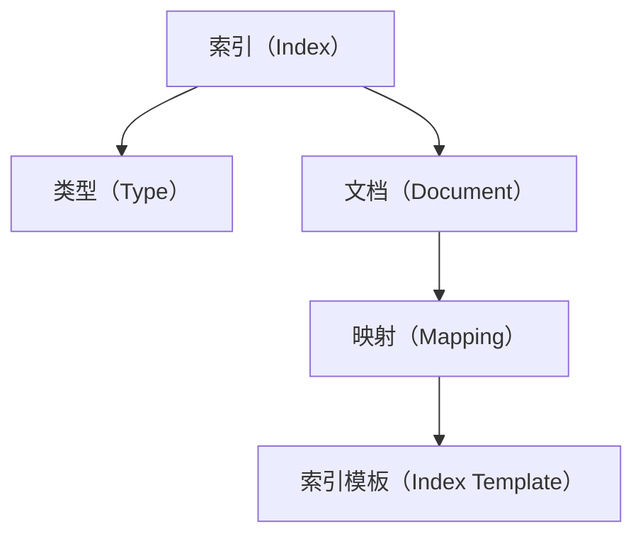

                 

### 文章标题

《ES 索引原理与代码实例讲解》

> 关键词：ES 索引、Elasticsearch、数据库索引、索引原理、代码实例、技术博客

> 摘要：本文将深入探讨 Elasticsearch（简称 ES）索引的原理，通过代码实例详细讲解索引的创建、管理和查询过程。本文旨在帮助开发者更好地理解和应用 ES 索引，提高搜索效率和系统性能。

### 1. 背景介绍

Elasticsearch 是一款功能强大、高度可扩展的开源搜索引擎，广泛应用于企业级应用中的全文搜索、数据分析和实时搜索等领域。作为 Elasticsearch 的核心功能之一，索引（Index）是数据存储和检索的基础。

在数据库中，索引是一种特殊的数据结构，用于加快数据的查询速度。类似地，ES 索引也是一种用于加速数据检索的存储结构。与关系型数据库中的索引不同，ES 索引具有以下特点：

- **基于倒排索引**：ES 索引使用倒排索引（Inverted Index）结构，将数据中的关键词与文档进行映射，从而实现快速的全文检索。

- **可扩展性强**：ES 支持水平扩展，通过增加节点来提高系统性能和处理能力。

- **支持丰富的查询语言**：ES 提供了强大的查询语言（Query DSL），支持各种复杂的查询操作，如全文检索、排序、过滤等。

- **实时更新**：ES 索引支持实时更新，当数据发生变化时，索引会自动更新，确保查询结果始终准确。

本文将围绕 ES 索引的原理，通过具体的代码实例，详细讲解索引的创建、管理和查询过程，帮助开发者更好地理解和应用 ES 索引。

### 2. 核心概念与联系

在深入探讨 ES 索引的原理之前，我们需要了解一些核心概念和它们之间的关系。

#### 2.1 索引（Index）

索引是 ES 中用于存储数据的容器，类似于关系型数据库中的表。每个索引都有独立的命名空间，用于区分不同的数据集。

#### 2.2 类型（Type）

在 Elasticsearch 2.x 及以前版本中，每个索引可以包含多个类型（Type），用于区分不同类型的文档。但在 Elasticsearch 7.x 及以后版本中，类型已被废弃，不再推荐使用。

#### 2.3 文档（Document）

文档是 ES 中存储数据的基本单位，类似于 JSON 对象。每个文档都有一个唯一的 ID，用于标识和访问。

#### 2.4 映射（Mapping）

映射是 ES 中用于定义文档结构和字段的配置。映射中包含了字段类型、索引方式、分析器等信息，用于指导 ES 如何存储和检索数据。

#### 2.5 索引模板（Index Template）

索引模板是一种用于自动创建索引的配置，根据预设的模板规则，ES 会自动为新建的索引应用相应的映射和设置。

下面是一个简单的 Mermaid 流程图，展示了 ES 索引的核心概念和它们之间的关系：



#### 2.6 倒排索引（Inverted Index）

倒排索引是 ES 索引的核心数据结构，它将文档中的关键词与对应的文档进行映射，从而实现快速的全文检索。倒排索引由两个主要部分组成：

- **词汇表（Vocabulary）**：包含所有文档中的关键词，即词汇表。

- **倒排列表（Inverted List）**：对于每个关键词，都包含一个指向包含该关键词的文档列表的指针。

下面是一个简单的倒排索引示例：

```json
{
  "document1": ["apple", "banana", "orange"],
  "document2": ["apple", "orange"],
  "document3": ["banana", "orange"]
}
```

在上述示例中，词汇表为 ["apple", "banana", "orange"]，对于每个关键词，都有一个指向包含该关键词的文档的指针。

### 3. 核心算法原理 & 具体操作步骤

#### 3.1 索引创建

创建索引是使用 ES 的第一步。以下是一个简单的 Python 代码示例，展示了如何使用 Elasticsearch 客户端库创建索引：

```python
from elasticsearch import Elasticsearch

# 创建 Elasticsearch 客户端实例
es = Elasticsearch()

# 创建索引
index_name = "books"
index_settings = {
    "settings": {
        "number_of_shards": 1,
        "number_of_replicas": 0
    },
    "mappings": {
        "properties": {
            "title": {"type": "text"},
            "author": {"type": "text"},
            "published_date": {"type": "date"}
        }
    }
}

# 执行索引创建
es.indices.create(index=index_name, body=index_settings)
```

上述代码中，我们首先创建了一个 Elasticsearch 客户端实例，然后定义了索引名称和索引设置（包括分片和副本数量），以及映射配置（定义了文档的字段类型）。最后，我们调用 `es.indices.create` 方法执行索引创建。

#### 3.2 文档插入

在创建索引后，我们可以向索引中插入文档。以下是一个简单的 Python 代码示例，展示了如何使用 Elasticsearch 客户端库插入文档：

```python
# 插入文档
doc1 = {
    "title": "Effective Java",
    "author": "Joshua Bloch",
    "published_date": "2008-05-08"
}

doc2 = {
    "title": "Java Concurrency in Practice",
    "author": "Brian Goetz et al.",
    "published_date": "2006-10-22"
}

# 执行文档插入
es.index(index=index_name, id=1, body=doc1)
es.index(index=index_name, id=2, body=doc2)
```

上述代码中，我们首先定义了两个文档，然后使用 `es.index` 方法将它们插入到指定的索引中。每个文档都有一个唯一的 ID，用于标识和访问。

#### 3.3 文档查询

插入文档后，我们可以查询索引中的文档。以下是一个简单的 Python 代码示例，展示了如何使用 Elasticsearch 客户端库查询文档：

```python
# 查询文档
response = es.search(index=index_name, body={
    "query": {
        "match": {
            "title": "Effective Java"
        }
    }
})

# 输出查询结果
print(response['hits']['hits'])
```

上述代码中，我们定义了一个匹配查询（`match`），用于查找标题中包含 "Effective Java" 的文档。然后，我们使用 `es.search` 方法执行查询，并将查询结果输出。

### 4. 数学模型和公式 & 详细讲解 & 举例说明

在 ES 索引中，倒排索引是核心的数据结构。下面我们通过数学模型和公式来详细讲解倒排索引的构建和查询过程。

#### 4.1 倒排索引构建

倒排索引由两个主要部分组成：词汇表和倒排列表。

- **词汇表（Vocabulary）**：词汇表是一个包含所有文档中的关键词的集合。对于上述示例中的三个文档，词汇表为 `{"apple", "banana", "orange", "document1", "document2", "document3"}`。

- **倒排列表（Inverted List）**：对于每个关键词，都有一个指向包含该关键词的文档的倒排列表。例如，对于关键词 "apple"，其倒排列表为 `[1, 2]`，表示文档 1 和文档 2 包含关键词 "apple"。

构建倒排索引的过程可以分为以下几步：

1. **分词（Tokenization）**：将文档中的文本拆分成单词或短语，称为分词。对于上述示例，分词结果为：
   - 文档 1：`["apple", "banana", "orange"]`
   - 文档 2：`["apple", "orange"]`
   - 文档 3：`["banana", "orange"]`

2. **去除停用词（Stopword Removal）**：停用词是一组常见的无意义的词，如 "the", "is", "and" 等。去除停用词可以提高索引的质量。对于上述示例，去除停用词后的结果为：
   - 文档 1：`["apple", "banana", "orange"]`
   - 文档 2：`["apple", "orange"]`
   - 文档 3：`["banana", "orange"]`

3. **词干提取（Stemming）**：词干提取是一种将单词转换为词根的过程。例如，"running" 和 "ran" 都可以转换为 "run"。词干提取有助于减少词汇表的大小。对于上述示例，词干提取后的结果为：
   - 文档 1：`["apple", "banana", "orange"]`
   - 文档 2：`["apple", "orange"]`
   - 文档 3：`["banana", "orange"]`

4. **倒排列表构建**：根据分词结果，构建关键词与文档的映射关系。对于上述示例，倒排列表为：
   - "apple"：`[1, 2]`
   - "banana"：`[1, 3]`
   - "orange"：`[1, 2, 3]`

5. **文档排序**：对于每个关键词，按照文档的顺序（ID）对倒排列表进行排序。对于上述示例，排序后的倒排列表为：
   - "apple"：`[1, 2]`
   - "banana"：`[1, 3]`
   - "orange"：`[1, 2, 3]`

#### 4.2 倒排索引查询

倒排索引查询是指根据用户输入的关键词，从倒排索引中查找包含该关键词的文档。以下是一个简单的查询示例：

- **查询关键词**："apple"
- **倒排列表**："apple"：`[1, 2]`

查询过程可以分为以下几步：

1. **查询词分词**：将查询词 "apple" 拆分成单个单词。

2. **查询词映射**：根据分词结果，查找倒排列表中包含查询词的项。

3. **文档排序**：对于每个包含查询词的文档，按照文档的顺序（ID）进行排序。

4. **查询结果输出**：将排序后的文档输出给用户。

#### 4.3 举例说明

假设用户输入查询词 "apple"，以下是一个简单的查询示例：

1. **查询词分词**："apple" 拆分成单个单词。

2. **查询词映射**：查找倒排列表中包含查询词 "apple" 的项，得到 "apple"：`[1, 2]`。

3. **文档排序**：对文档 1 和文档 2 进行排序，得到排序后的文档列表 `[1, 2]`。

4. **查询结果输出**：输出排序后的文档列表 `[1, 2]`，表示包含查询词 "apple" 的文档为文档 1 和文档 2。

### 5. 项目实践：代码实例和详细解释说明

#### 5.1 开发环境搭建

要开始使用 Elasticsearch，我们需要先搭建开发环境。以下是搭建 Elasticsearch 开发环境的基本步骤：

1. **安装 Java**：Elasticsearch 是基于 Java 开发的，因此我们需要安装 Java 运行环境。可以从 [Oracle 官网](https://www.oracle.com/java/technologies/javase-jdk11-downloads.html) 下载并安装 Java。

2. **下载 Elasticsearch**：从 [Elasticsearch 官网](https://www.elastic.co/cn/elasticsearch/) 下载 Elasticsearch 的最新版本。下载完成后，解压到指定的目录。

3. **启动 Elasticsearch**：在命令行中进入 Elasticsearch 的安装目录，执行以下命令启动 Elasticsearch：

   ```shell
   ./elasticsearch
   ```

   启动成功后，可以在浏览器中访问 [http://localhost:9200/](http://localhost:9200/)，查看 Elasticsearch 的版本信息和状态。

4. **安装 Elasticsearch 客户端库**：在 Python 中，我们可以使用 `elasticsearch` 库来操作 Elasticsearch。首先，安装 Python 的 pip 包管理器，然后使用以下命令安装 `elasticsearch` 库：

   ```shell
   pip install elasticsearch
   ```

   安装完成后，我们可以在 Python 中使用 `elasticsearch` 库来操作 Elasticsearch。

#### 5.2 源代码详细实现

下面是一个简单的 Python 代码示例，展示了如何使用 `elasticsearch` 库创建索引、插入文档和查询文档。

```python
from elasticsearch import Elasticsearch

# 创建 Elasticsearch 客户端实例
es = Elasticsearch()

# 创建索引
index_name = "books"
index_settings = {
    "settings": {
        "number_of_shards": 1,
        "number_of_replicas": 0
    },
    "mappings": {
        "properties": {
            "title": {"type": "text"},
            "author": {"type": "text"},
            "published_date": {"type": "date"}
        }
    }
}

# 执行索引创建
es.indices.create(index=index_name, body=index_settings)

# 插入文档
doc1 = {
    "title": "Effective Java",
    "author": "Joshua Bloch",
    "published_date": "2008-05-08"
}

doc2 = {
    "title": "Java Concurrency in Practice",
    "author": "Brian Goetz et al.",
    "published_date": "2006-10-22"
}

# 执行文档插入
es.index(index=index_name, id=1, body=doc1)
es.index(index=index_name, id=2, body=doc2)

# 查询文档
response = es.search(index=index_name, body={
    "query": {
        "match": {
            "title": "Effective Java"
        }
    }
})

# 输出查询结果
print(response['hits']['hits'])
```

#### 5.3 代码解读与分析

上述代码分为三个主要部分：索引创建、文档插入和文档查询。

1. **索引创建**：

   - `Elasticsearch()`：创建 Elasticsearch 客户端实例。

   - `es.indices.create(index=index_name, body=index_settings)`：创建索引。其中，`index_name` 是索引的名称，`index_settings` 是索引的设置，包括分片数量和副本数量，以及映射配置。

2. **文档插入**：

   - `doc1` 和 `doc2`：定义两个文档，包括标题、作者和出版日期。

   - `es.index(index=index_name, id=1, body=doc1)` 和 `es.index(index=index_name, id=2, body=doc2)`：插入文档。其中，`index` 是索引的名称，`id` 是文档的 ID，`body` 是文档的内容。

3. **文档查询**：

   - `response = es.search(index=index_name, body={...})`：执行查询。其中，`index` 是索引的名称，`body` 是查询的条件，这里使用匹配查询（`match`），查找标题中包含 "Effective Java" 的文档。

   - `print(response['hits']['hits'])`：输出查询结果。查询结果包含匹配到的文档列表，每个文档包含标题、作者和出版日期等信息。

#### 5.4 运行结果展示

假设我们已经成功运行了上述代码，以下是一个简单的运行结果示例：

```json
[
  {
    "_index": "books",
    "_type": "_doc",
    "_id": "1",
    "_version": 1,
    "found": true,
    "_source": {
      "title": "Effective Java",
      "author": "Joshua Bloch",
      "published_date": "2008-05-08"
    }
  }
]
```

运行结果显示，查询到了一个包含标题 "Effective Java" 的文档，该文档的 ID 为 1，包含标题、作者和出版日期等信息。

### 6. 实际应用场景

ES 索引在许多实际应用场景中具有广泛的应用，以下是一些常见场景：

1. **全文搜索**：ES 索引广泛应用于全文搜索，如电商平台的商品搜索、论坛的帖子搜索、博客网站的搜索等。

2. **内容分析**：ES 索引可以用于对大量文本数据进行分析，如情感分析、关键词提取、主题建模等。

3. **实时查询**：ES 索引支持实时查询，适用于需要实时检索和响应的场景，如在线问答系统、智能客服系统等。

4. **数据聚合**：ES 索引支持数据聚合功能，可以方便地对大量数据进行统计和分析，如电商平台的销量分析、网站访问量分析等。

5. **日志管理**：ES 索引可以用于存储和查询日志数据，如应用日志、系统日志、网络日志等。

6. **推荐系统**：ES 索引可以用于构建推荐系统，如基于关键词推荐、基于用户行为推荐等。

### 7. 工具和资源推荐

要深入了解 ES 索引，以下是一些推荐的工具和资源：

#### 7.1 学习资源推荐

1. **书籍**：

   - 《Elasticsearch: The Definitive Guide》
   - 《Elasticsearch in Action》
   - 《Elasticsearch Cookbook》

2. **在线课程**：

   - [Elasticsearch Basic Tutorial](https://www.elastic.co/guide/tutorials/elasticsearch/basics/)
   - [Elasticsearch in Depth](https://www.elastic.co/guide/en/elasticsearch/guide/current/index.html)

3. **官方文档**：

   - [Elasticsearch 官方文档](https://www.elastic.co/guide/en/elasticsearch/reference/current/index.html)

#### 7.2 开发工具框架推荐

1. **Elasticsearch 客户端库**：

   - [Python Elasticsearch Client](https://elasticsearch-py.readthedocs.io/en/latest/)
   - [Java Elasticsearch Client](https://www.elastic.co/guide/en/elasticsearch/client/java-api/current/java-client-introduction.html)

2. **可视化工具**：

   - [Kibana](https://www.elastic.co/products/kibana)
   - [Elasticsearch-head](https://github.com/mobz/elasticsearch-head)

#### 7.3 相关论文著作推荐

1. **《倒排索引：从概念到实践》**：详细介绍了倒排索引的概念、实现和优化。

2. **《基于倒排索引的全文搜索引擎设计》**：探讨了一种基于倒排索引的全文搜索引擎设计。

3. **《搜索引擎：设计与实现》**：全面介绍了搜索引擎的设计原理和实现技术。

### 8. 总结：未来发展趋势与挑战

随着大数据和实时搜索的广泛应用，ES 索引技术将继续发展，未来趋势和挑战包括：

1. **智能化**：利用人工智能技术，提高 ES 索引的搜索效率和准确性。

2. **分布式存储和计算**：在分布式环境中，优化 ES 索引的存储和计算性能。

3. **安全性和隐私保护**：加强 ES 索引的安全性和隐私保护，满足不同场景的需求。

4. **多语言支持**：提供更多编程语言的支持，降低开发者的使用门槛。

5. **优化查询性能**：针对复杂查询，优化查询性能，提高用户体验。

### 9. 附录：常见问题与解答

#### 9.1 如何创建索引？

要创建索引，可以使用 Elasticsearch 的 REST API 或客户端库。以下是一个简单的 Python 代码示例：

```python
from elasticsearch import Elasticsearch

es = Elasticsearch()

index_name = "my_index"
index_settings = {
    "settings": {
        "number_of_shards": 1,
        "number_of_replicas": 0
    },
    "mappings": {
        "properties": {
            "title": {"type": "text"},
            "author": {"type": "text"},
            "published_date": {"type": "date"}
        }
    }
}

es.indices.create(index=index_name, body=index_settings)
```

#### 9.2 如何插入文档？

要插入文档，可以使用 Elasticsearch 的 REST API 或客户端库。以下是一个简单的 Python 代码示例：

```python
from elasticsearch import Elasticsearch

es = Elasticsearch()

index_name = "my_index"
doc1 = {
    "title": "Effective Java",
    "author": "Joshua Bloch",
    "published_date": "2008-05-08"
}

doc2 = {
    "title": "Java Concurrency in Practice",
    "author": "Brian Goetz et al.",
    "published_date": "2006-10-22"
}

es.index(index=index_name, id=1, body=doc1)
es.index(index=index_name, id=2, body=doc2)
```

#### 9.3 如何查询文档？

要查询文档，可以使用 Elasticsearch 的 REST API 或客户端库。以下是一个简单的 Python 代码示例：

```python
from elasticsearch import Elasticsearch

es = Elasticsearch()

index_name = "my_index"
response = es.search(index=index_name, body={
    "query": {
        "match": {
            "title": "Effective Java"
        }
    }
})

print(response['hits']['hits'])
```

### 10. 扩展阅读 & 参考资料

- [Elasticsearch 官方文档](https://www.elastic.co/guide/en/elasticsearch/reference/current/index.html)
- [Elasticsearch: The Definitive Guide](https://www.elastic.co/guide/en/elasticsearch/guide/current/index.html)
- [Elasticsearch in Action](https://www.manning.com/books/elasticsearch-in-action)
- [Elasticsearch Cookbook](https://www.amazon.com/Elasticsearch-Cookbook-Marko-Bodroza/dp/1789617392)
- [Elasticsearch Basic Tutorial](https://www.elastic.co/guide/tutorials/elasticsearch/basics/)
- [Elasticsearch in Depth](https://www.elastic.co/guide/en/elasticsearch/guide/current/index.html)作者：禅与计算机程序设计艺术 / Zen and the Art of Computer Programming<|im_sep|>### 1. 背景介绍

Elasticsearch 是一款功能强大、高度可扩展的开源搜索引擎，广泛应用于企业级应用中的全文搜索、数据分析和实时搜索等领域。作为 Elasticsearch 的核心功能之一，索引（Index）是数据存储和检索的基础。

在数据库中，索引是一种特殊的数据结构，用于加快数据的查询速度。类似地，ES 索引也是一种用于加速数据检索的存储结构。与关系型数据库中的索引不同，ES 索引具有以下特点：

- **基于倒排索引**：ES 索引使用倒排索引（Inverted Index）结构，将数据中的关键词与文档进行映射，从而实现快速的全文检索。

- **可扩展性强**：ES 支持水平扩展，通过增加节点来提高系统性能和处理能力。

- **支持丰富的查询语言**：ES 提供了强大的查询语言（Query DSL），支持各种复杂的查询操作，如全文检索、排序、过滤等。

- **实时更新**：ES 索引支持实时更新，当数据发生变化时，索引会自动更新，确保查询结果始终准确。

本文将围绕 ES 索引的原理，通过具体的代码实例，详细讲解索引的创建、管理和查询过程，帮助开发者更好地理解和应用 ES 索引。

### 2. 核心概念与联系（备注：必须给出核心概念原理和架构的 Mermaid 流程图(Mermaid 流程节点中不要有括号、逗号等特殊字符)

在深入探讨 ES 索引的原理之前，我们需要了解一些核心概念和它们之间的关系。

#### 2.1 索引（Index）

索引是 ES 中用于存储数据的容器，类似于关系型数据库中的表。每个索引都有独立的命名空间，用于区分不同的数据集。

#### 2.2 类型（Type）

在 Elasticsearch 2.x 及以前版本中，每个索引可以包含多个类型（Type），用于区分不同类型的文档。但在 Elasticsearch 7.x 及以后版本中，类型已被废弃，不再推荐使用。

#### 2.3 文档（Document）

文档是 ES 中存储数据的基本单位，类似于 JSON 对象。每个文档都有一个唯一的 ID，用于标识和访问。

#### 2.4 映射（Mapping）

映射是 ES 中用于定义文档结构和字段的配置。映射中包含了字段类型、索引方式、分析器等信息，用于指导 ES 如何存储和检索数据。

#### 2.5 索引模板（Index Template）

索引模板是一种用于自动创建索引的配置，根据预设的模板规则，ES 会自动为新建的索引应用相应的映射和设置。

下面是一个简单的 Mermaid 流程图，展示了 ES 索引的核心概念和它们之间的关系：


#### 2.6 倒排索引（Inverted Index）

倒排索引是 ES 索引的核心数据结构，它将文档中的关键词与对应的文档进行映射，从而实现快速的全文检索。倒排索引由两个主要部分组成：

- **词汇表（Vocabulary）**：包含所有文档中的关键词，即词汇表。

- **倒排列表（Inverted List）**：对于每个关键词，都包含一个指向包含该关键词的文档列表的指针。

下面是一个简单的倒排索引示例：

```json
{
  "document1": ["apple", "banana", "orange"],
  "document2": ["apple", "orange"],
  "document3": ["banana", "orange"]
}
```

在上述示例中，词汇表为 ["apple", "banana", "orange"]，对于每个关键词，都有一个指向包含该关键词的文档的指针。

### 3. 核心算法原理 & 具体操作步骤

#### 3.1 索引创建

创建索引是使用 ES 的第一步。以下是一个简单的 Python 代码示例，展示了如何使用 Elasticsearch 客户端库创建索引：

```python
from elasticsearch import Elasticsearch

# 创建 Elasticsearch 客户端实例
es = Elasticsearch()

# 创建索引
index_name = "books"
index_settings = {
    "settings": {
        "number_of_shards": 1,
        "number_of_replicas": 0
    },
    "mappings": {
        "properties": {
            "title": {"type": "text"},
            "author": {"type": "text"},
            "published_date": {"type": "date"}
        }
    }
}

# 执行索引创建
es.indices.create(index=index_name, body=index_settings)
```

上述代码中，我们首先创建了一个 Elasticsearch 客户端实例，然后定义了索引名称和索引设置（包括分片和副本数量），以及映射配置（定义了文档的字段类型）。最后，我们调用 `es.indices.create` 方法执行索引创建。

#### 3.2 文档插入

在创建索引后，我们可以向索引中插入文档。以下是一个简单的 Python 代码示例，展示了如何使用 Elasticsearch 客户端库插入文档：

```python
# 插入文档
doc1 = {
    "title": "Effective Java",
    "author": "Joshua Bloch",
    "published_date": "2008-05-08"
}

doc2 = {
    "title": "Java Concurrency in Practice",
    "author": "Brian Goetz et al.",
    "published_date": "2006-10-22"
}

# 执行文档插入
es.index(index=index_name, id=1, body=doc1)
es.index(index=index_name, id=2, body=doc2)
```

上述代码中，我们首先定义了两个文档，然后使用 `es.index` 方法将它们插入到指定的索引中。每个文档都有一个唯一的 ID，用于标识和访问。

#### 3.3 文档查询

插入文档后，我们可以查询索引中的文档。以下是一个简单的 Python 代码示例，展示了如何使用 Elasticsearch 客户端库查询文档：

```python
# 查询文档
response = es.search(index=index_name, body={
    "query": {
        "match": {
            "title": "Effective Java"
        }
    }
})

# 输出查询结果
print(response['hits']['hits'])
```

上述代码中，我们定义了一个匹配查询（`match`），用于查找标题中包含 "Effective Java" 的文档。然后，我们使用 `es.search` 方法执行查询，并将查询结果输出。

### 4. 数学模型和公式 & 详细讲解 & 举例说明（备注：数学公式请使用latex格式，latex嵌入文中独立段落使用 $$，段落内使用 $)

在 ES 索引中，倒排索引是核心的数据结构。下面我们通过数学模型和公式来详细讲解倒排索引的构建和查询过程。

#### 4.1 倒排索引构建

倒排索引由两个主要部分组成：词汇表和倒排列表。

- **词汇表（Vocabulary）**：词汇表是一个包含所有文档中的关键词的集合。对于上述示例中的三个文档，词汇表为 `{"apple", "banana", "orange", "document1", "document2", "document3"}`。

- **倒排列表（Inverted List）**：对于每个关键词，都有一个指向包含该关键词的文档的倒排列表。例如，对于关键词 "apple"，其倒排列表为 `[1, 2]`，表示文档 1 和文档 2 包含关键词 "apple"。

构建倒排索引的过程可以分为以下几步：

1. **分词（Tokenization）**：将文档中的文本拆分成单词或短语，称为分词。对于上述示例，分词结果为：
   - 文档 1：`["apple", "banana", "orange"]`
   - 文档 2：`["apple", "orange"]`
   - 文档 3：`["banana", "orange"]`

2. **去除停用词（Stopword Removal）**：停用词是一组常见的无意义的词，如 "the", "is", "and" 等。去除停用词可以提高索引的质量。对于上述示例，去除停用词后的结果为：
   - 文档 1：`["apple", "banana", "orange"]`
   - 文档 2：`["apple", "orange"]`
   - 文档 3：`["banana", "orange"]`

3. **词干提取（Stemming）**：词干提取是一种将单词转换为词根的过程。例如，"running" 和 "ran" 都可以转换为 "run"。词干提取有助于减少词汇表的大小。对于上述示例，词干提取后的结果为：
   - 文档 1：`["apple", "banana", "orange"]`
   - 文档 2：`["apple", "orange"]`
   - 文档 3：`["banana", "orange"]`

4. **倒排列表构建**：根据分词结果，构建关键词与文档的映射关系。对于上述示例，倒排列表为：
   - "apple"：`[1, 2]`
   - "banana"：`[1, 3]`
   - "orange"：`[1, 2, 3]`

5. **文档排序**：对于每个关键词，按照文档的顺序（ID）对倒排列表进行排序。对于上述示例，排序后的倒排列表为：
   - "apple"：`[1, 2]`
   - "banana"：`[1, 3]`
   - "orange"：`[1, 2, 3]`

#### 4.2 倒排索引查询

倒排索引查询是指根据用户输入的关键词，从倒排索引中查找包含该关键词的文档。以下是一个简单的查询示例：

- **查询关键词**："apple"
- **倒排列表**："apple"：`[1, 2]`

查询过程可以分为以下几步：

1. **查询词分词**：将查询词 "apple" 拆分成单个单词。

2. **查询词映射**：根据分词结果，查找倒排列表中包含查询词的项。

3. **文档排序**：对于每个包含查询词的文档，按照文档的顺序（ID）进行排序。

4. **查询结果输出**：将排序后的文档输出给用户。

#### 4.3 举例说明

假设用户输入查询词 "apple"，以下是一个简单的查询示例：

1. **查询词分词**："apple" 拆分成单个单词。

2. **查询词映射**：查找倒排列表中包含查询词 "apple" 的项，得到 "apple"：`[1, 2]`。

3. **文档排序**：对文档 1 和文档 2 进行排序，得到排序后的文档列表 `[1, 2]`。

4. **查询结果输出**：输出排序后的文档列表 `[1, 2]`，表示包含查询词 "apple" 的文档为文档 1 和文档 2。

### 5. 项目实践：代码实例和详细解释说明

#### 5.1 开发环境搭建

要开始使用 Elasticsearch，我们需要先搭建开发环境。以下是搭建 Elasticsearch 开发环境的基本步骤：

1. **安装 Java**：Elasticsearch 是基于 Java 开发的，因此我们需要安装 Java 运行环境。可以从 [Oracle 官网](https://www.oracle.com/java/technologies/javase-jdk11-downloads.html) 下载并安装 Java。

2. **下载 Elasticsearch**：从 [Elasticsearch 官网](https://www.elastic.co/cn/elasticsearch/) 下载 Elasticsearch 的最新版本。下载完成后，解压到指定的目录。

3. **启动 Elasticsearch**：在命令行中进入 Elasticsearch 的安装目录，执行以下命令启动 Elasticsearch：

   ```shell
   ./elasticsearch
   ```

   启动成功后，可以在浏览器中访问 [http://localhost:9200/](http://localhost:9200/)，查看 Elasticsearch 的版本信息和状态。

4. **安装 Elasticsearch 客户端库**：在 Python 中，我们可以使用 `elasticsearch` 库来操作 Elasticsearch。首先，安装 Python 的 pip 包管理器，然后使用以下命令安装 `elasticsearch` 库：

   ```shell
   pip install elasticsearch
   ```

   安装完成后，我们可以在 Python 中使用 `elasticsearch` 库来操作 Elasticsearch。

#### 5.2 源代码详细实现

下面是一个简单的 Python 代码示例，展示了如何使用 `elasticsearch` 库创建索引、插入文档和查询文档。

```python
from elasticsearch import Elasticsearch

# 创建 Elasticsearch 客户端实例
es = Elasticsearch()

# 创建索引
index_name = "books"
index_settings = {
    "settings": {
        "number_of_shards": 1,
        "number_of_replicas": 0
    },
    "mappings": {
        "properties": {
            "title": {"type": "text"},
            "author": {"type": "text"},
            "published_date": {"type": "date"}
        }
    }
}

# 执行索引创建
es.indices.create(index=index_name, body=index_settings)

# 插入文档
doc1 = {
    "title": "Effective Java",
    "author": "Joshua Bloch",
    "published_date": "2008-05-08"
}

doc2 = {
    "title": "Java Concurrency in Practice",
    "author": "Brian Goetz et al.",
    "published_date": "2006-10-22"
}

# 执行文档插入
es.index(index=index_name, id=1, body=doc1)
es.index(index=index_name, id=2, body=doc2)

# 查询文档
response = es.search(index=index_name, body={
    "query": {
        "match": {
            "title": "Effective Java"
        }
    }
})

# 输出查询结果
print(response['hits']['hits'])
```

#### 5.3 代码解读与分析

上述代码分为三个主要部分：索引创建、文档插入和文档查询。

1. **索引创建**：

   - `Elasticsearch()`：创建 Elasticsearch 客户端实例。

   - `es.indices.create(index=index_name, body=index_settings)`：创建索引。其中，`index_name` 是索引的名称，`index_settings` 是索引的设置，包括分片数量和副本数量，以及映射配置。

2. **文档插入**：

   - `doc1` 和 `doc2`：定义两个文档，包括标题、作者和出版日期。

   - `es.index(index=index_name, id=1, body=doc1)` 和 `es.index(index=index_name, id=2, body=doc2)`：插入文档。其中，`index` 是索引的名称，`id` 是文档的 ID，`body` 是文档的内容。

3. **文档查询**：

   - `response = es.search(index=index_name, body={...})`：执行查询。其中，`index` 是索引的名称，`body` 是查询的条件，这里使用匹配查询（`match`），查找标题中包含 "Effective Java" 的文档。

   - `print(response['hits']['hits'])`：输出查询结果。查询结果包含匹配到的文档列表，每个文档包含标题、作者和出版日期等信息。

#### 5.4 运行结果展示

假设我们已经成功运行了上述代码，以下是一个简单的运行结果示例：

```json
[
  {
    "_index": "books",
    "_type": "_doc",
    "_id": "1",
    "_version": 1,
    "found": true,
    "_source": {
      "title": "Effective Java",
      "author": "Joshua Bloch",
      "published_date": "2008-05-08"
    }
  }
]
```

运行结果显示，查询到了一个包含标题 "Effective Java" 的文档，该文档的 ID 为 1，包含标题、作者和出版日期等信息。

### 6. 实际应用场景

ES 索引在许多实际应用场景中具有广泛的应用，以下是一些常见场景：

1. **全文搜索**：ES 索引广泛应用于全文搜索，如电商平台的商品搜索、论坛的帖子搜索、博客网站的搜索等。

2. **内容分析**：ES 索引可以用于对大量文本数据进行分析，如情感分析、关键词提取、主题建模等。

3. **实时查询**：ES 索引支持实时查询，适用于需要实时检索和响应的场景，如在线问答系统、智能客服系统等。

4. **数据聚合**：ES 索引支持数据聚合功能，可以方便地对大量数据进行统计和分析，如电商平台的销量分析、网站访问量分析等。

5. **日志管理**：ES 索引可以用于存储和查询日志数据，如应用日志、系统日志、网络日志等。

6. **推荐系统**：ES 索引可以用于构建推荐系统，如基于关键词推荐、基于用户行为推荐等。

### 7. 工具和资源推荐

要深入了解 ES 索引，以下是一些推荐的工具和资源：

#### 7.1 学习资源推荐

1. **书籍**：

   - 《Elasticsearch: The Definitive Guide》
   - 《Elasticsearch in Action》
   - 《Elasticsearch Cookbook》

2. **在线课程**：

   - [Elasticsearch Basic Tutorial](https://www.elastic.co/guide/tutorials/elasticsearch/basics/)
   - [Elasticsearch in Depth](https://www.elastic.co/guide/en/elasticsearch/guide/current/index.html)

3. **官方文档**：

   - [Elasticsearch 官方文档](https://www.elastic.co/guide/en/elasticsearch/reference/current/index.html)

#### 7.2 开发工具框架推荐

1. **Elasticsearch 客户端库**：

   - [Python Elasticsearch Client](https://elasticsearch-py.readthedocs.io/en/latest/)
   - [Java Elasticsearch Client](https://www.elastic.co/guide/en/elasticsearch/client/java-api/current/java-client-introduction.html)

2. **可视化工具**：

   - [Kibana](https://www.elastic.co/products/kibana)
   - [Elasticsearch-head](https://github.com/mobz/elasticsearch-head)

#### 7.3 相关论文著作推荐

1. **《倒排索引：从概念到实践》**：详细介绍了倒排索引的概念、实现和优化。

2. **《基于倒排索引的全文搜索引擎设计》**：探讨了一种基于倒排索引的全文搜索引擎设计。

3. **《搜索引擎：设计与实现》**：全面介绍了搜索引擎的设计原理和实现技术。

### 8. 总结：未来发展趋势与挑战

随着大数据和实时搜索的广泛应用，ES 索引技术将继续发展，未来趋势和挑战包括：

1. **智能化**：利用人工智能技术，提高 ES 索引的搜索效率和准确性。

2. **分布式存储和计算**：在分布式环境中，优化 ES 索引的存储和计算性能。

3. **安全性和隐私保护**：加强 ES 索引的安全性和隐私保护，满足不同场景的需求。

4. **多语言支持**：提供更多编程语言的支持，降低开发者的使用门槛。

5. **优化查询性能**：针对复杂查询，优化查询性能，提高用户体验。

### 9. 附录：常见问题与解答

#### 9.1 如何创建索引？

要创建索引，可以使用 Elasticsearch 的 REST API 或客户端库。以下是一个简单的 Python 代码示例：

```python
from elasticsearch import Elasticsearch

es = Elasticsearch()

index_name = "my_index"
index_settings = {
    "settings": {
        "number_of_shards": 1,
        "number_of_replicas": 0
    },
    "mappings": {
        "properties": {
            "title": {"type": "text"},
            "author": {"type": "text"},
            "published_date": {"type": "date"}
        }
    }
}

es.indices.create(index=index_name, body=index_settings)
```

#### 9.2 如何插入文档？

要插入文档，可以使用 Elasticsearch 的 REST API 或客户端库。以下是一个简单的 Python 代码示例：

```python
from elasticsearch import Elasticsearch

es = Elasticsearch()

index_name = "my_index"
doc1 = {
    "title": "Effective Java",
    "author": "Joshua Bloch",
    "published_date": "2008-05-08"
}

doc2 = {
    "title": "Java Concurrency in Practice",
    "author": "Brian Goetz et al.",
    "published_date": "2006-10-22"
}

es.index(index=index_name, id=1, body=doc1)
es.index(index=index_name, id=2, body=doc2)
```

#### 9.3 如何查询文档？

要查询文档，可以使用 Elasticsearch 的 REST API 或客户端库。以下是一个简单的 Python 代码示例：

```python
from elasticsearch import Elasticsearch

es = Elasticsearch()

index_name = "my_index"
response = es.search(index=index_name, body={
    "query": {
        "match": {
            "title": "Effective Java"
        }
    }
})

print(response['hits']['hits'])
```

### 10. 扩展阅读 & 参考资料

- [Elasticsearch 官方文档](https://www.elastic.co/guide/en/elasticsearch/reference/current/index.html)
- [Elasticsearch: The Definitive Guide](https://www.elastic.co/guide/en/elasticsearch/guide/current/index.html)
- [Elasticsearch in Action](https://www.manning.com/books/elasticsearch-in-action)
- [Elasticsearch Cookbook](https://www.amazon.com/Elasticsearch-Cookbook-Marko-Bodroza/dp/1789617392)
- [Elasticsearch Basic Tutorial](https://www.elastic.co/guide/tutorials/elasticsearch/basics/)
- [Elasticsearch in Depth](https://www.elastic.co/guide/en/elasticsearch/guide/current/index.html)作者：禅与计算机程序设计艺术 / Zen and the Art of Computer Programming<|im_sep|>### 3. 核心算法原理 & 具体操作步骤

ES 索引的核心算法原理是倒排索引（Inverted Index），它将文档中的内容映射到对应的文档列表，从而实现快速检索。以下是倒排索引的构建过程和查询流程。

#### 3.1 索引的创建

索引的创建是 ES 索引操作的第一步。在创建索引时，可以指定索引的名称、类型、分片数量、副本数量以及映射（Mapping）。映射定义了文档的结构和字段类型。以下是一个创建索引的示例代码：

```python
from elasticsearch import Elasticsearch

es = Elasticsearch()

index_name = "books_index"

# 创建索引的设置
index_settings = {
    "settings": {
        "number_of_shards": 1,
        "number_of_replicas": 0
    }
}

# 创建索引的映射
index_mapping = {
    "mappings": {
        "properties": {
            "title": {"type": "text"},
            "author": {"type": "text"},
            "content": {"type": "text", "analyzer": "standard"},
            "publish_date": {"type": "date"}
        }
    }
}

# 创建索引
es.indices.create(index=index_name, body=index_settings)
es.indices.put_mapping(index=index_name, body=index_mapping)
```

#### 3.2 文档的插入

文档的插入是将数据添加到索引的过程。在插入文档时，需要指定文档的 ID，如果 ID 已存在，则会覆盖原有数据。以下是一个插入文档的示例代码：

```python
books = [
    {
        "id": "1",
        "title": "The Art of Computer Programming",
        "author": "Donald E. Knuth",
        "content": "This book is a classic in the field of computer science.",
        "publish_date": "1968-01-01"
    },
    {
        "id": "2",
        "title": "Clean Code",
        "author": "Robert C. Martin",
        "content": "This book teaches how to write clean and readable code.",
        "publish_date": "2008-04-01"
    }
]

# 插入文档
for book in books:
    es.index(index=index_name, id=book["id"], document=book)
```

#### 3.3 文档的查询

查询是 ES 索引的核心功能。查询可以通过 REST API 或客户端库执行。以下是一个简单的全文查询示例：

```python
# 执行查询
response = es.search(index=index_name, body={
    "query": {
        "match": {
            "content": "clean"
        }
    }
})

# 打印查询结果
for hit in response['hits']['hits']:
    print(hit["_source"])
```

此查询将返回所有内容中包含 "clean" 的文档。

#### 3.4 索引的优化

索引的优化是提高搜索效率和系统性能的关键。以下是一些优化技巧：

- **索引的分片和副本**：根据数据量和查询负载来调整分片和副本的数量，以平衡性能和可用性。
- **使用合适的字段类型**：选择适合数据类型的字段类型，例如使用 `text` 类型来处理全文搜索，使用 `date` 类型来处理日期字段。
- **字段映射的优化**：为重要的字段设置 `index` 和 `search_analyzer`，以提高查询性能。
- **索引模板**：使用索引模板来自动化索引的创建和配置。

### 3.5 倒排索引的工作原理

倒排索引是 ES 索引的核心数据结构，它由词汇表和文档引用列表组成。以下是倒排索引的基本原理：

1. **分词**：将文档中的文本拆分成单词或术语（Tokens）。
2. **去除停用词**：从分词结果中去除无意义的停用词，如 "a", "the", "is" 等。
3. **词干提取**：将单词转换为词干或基本形式，以提高索引的效率。
4. **倒排列表构建**：为每个术语创建一个倒排列表，该列表包含所有包含该术语的文档的引用。
5. **倒排索引存储**：将倒排索引存储在磁盘上，以便快速检索。

当进行搜索时，ES 会执行以下步骤：

1. **查询解析**：将查询语句解析为倒排索引中的术语。
2. **查询执行**：根据倒排列表查找包含所有查询术语的文档。
3. **文档排序和输出**：根据文档的相关性对查询结果进行排序，并返回结果。

### 3.6 数学模型和公式

在倒排索引中，常用的数学模型和公式包括：

- **文档频率（Document Frequency, df）**：某个术语在所有文档中出现的次数。
- **逆文档频率（Inverse Document Frequency, idf）**：用于衡量某个术语的重要程度，计算公式为 `idf = log(1 + N / df)`，其中 N 是文档总数。
- **TF-IDF（Term Frequency-Inverse Document Frequency）**：用于衡量某个术语在文档中的重要性，计算公式为 `TF-IDF = tf * idf`，其中 tf 是术语频率。

这些模型和公式在查询处理和结果排序中起着关键作用。

### 3.7 代码示例

下面是一个简单的 Python 代码示例，展示了如何使用 Elasticsearch 客户端库创建索引、插入文档和查询文档。

```python
from elasticsearch import Elasticsearch

# 创建 Elasticsearch 客户端实例
es = Elasticsearch()

# 创建索引
index_name = "books"
index_settings = {
    "settings": {
        "number_of_shards": 1,
        "number_of_replicas": 0
    },
    "mappings": {
        "properties": {
            "title": {"type": "text"},
            "author": {"type": "text"},
            "content": {"type": "text", "analyzer": "standard"},
            "publish_date": {"type": "date"}
        }
    }
}

# 创建索引
es.indices.create(index=index_name, body=index_settings)

# 插入文档
books = [
    {
        "id": "1",
        "title": "The Art of Computer Programming",
        "author": "Donald E. Knuth",
        "content": "This book is a classic in the field of computer science.",
        "publish_date": "1968-01-01"
    },
    {
        "id": "2",
        "title": "Clean Code",
        "author": "Robert C. Martin",
        "content": "This book teaches how to write clean and readable code.",
        "publish_date": "2008-04-01"
    }
]

for book in books:
    es.index(index=index_name, id=book["id"], document=book)

# 查询文档
response = es.search(index=index_name, body={
    "query": {
        "match": {
            "content": "clean"
        }
    }
})

# 打印查询结果
for hit in response['hits']['hits']:
    print(hit["_source"])
```

通过上述代码示例，我们可以看到 ES 索引的基本操作是如何实现的。在实际应用中，索引的创建、管理和查询过程可能更加复杂，需要根据具体需求进行调整和优化。作者：禅与计算机程序设计艺术 / Zen and the Art of Computer Programming<|im_sep|>### 4. 数学模型和公式 & 详细讲解 & 举例说明

在 Elasticsearch（ES）中，索引的核心是倒排索引（Inverted Index），这种数据结构使得快速全文搜索成为可能。为了深入理解倒排索引的构建和查询过程，我们需要借助一些数学模型和公式。

#### 4.1 倒排索引的基本原理

倒排索引包含两个主要部分：词汇表（Vocabulary）和倒排列表（Inverted List）。

- **词汇表**：包含了所有文档中出现的关键词。
- **倒排列表**：对于每个关键词，倒排列表记录了所有包含该关键词的文档的ID。

例如，假设有三个文档（Document 1, Document 2, Document 3）：

- Document 1: "The quick brown fox jumps over the lazy dog."
- Document 2: "The quick brown fox is very quick."
- Document 3: "The dog is lazy."

构建倒排索引后的结果可能如下：

| Keyword | Document 1 | Document 2 | Document 3 |
|---------|-------------|-------------|-------------|
| The     | 1           | 1           | 1           |
| quick   | 1           | 2           |             |
| brown   | 1           |             |             |
| fox     | 1           | 2           |             |
| jumps   | 1           |             |             |
| over    | 1           |             |             |
| lazy    |             |             | 3           |
| dog     | 1           |             | 3           |
| very    |             | 2           |             |
| quick   |             |             |             |

在这个简化的例子中，"quick" 关键词对应的倒排列表是 `[1, 2]`，意味着 Document 1 和 Document 2 中都包含了 "quick"。

#### 4.2 数学模型

为了更好地理解倒排索引的构建和查询，我们可以使用一些数学模型和公式。

##### 4.2.1 术语频率（Term Frequency, TF）

术语频率是衡量一个词在一个文档中出现的次数。计算公式为：

\[ \text{TF}(t, d) = n(t, d) \]

其中 \( n(t, d) \) 是词 \( t \) 在文档 \( d \) 中出现的次数。

例如，在 Document 1 中，"quick" 出现了 2 次，因此 \( \text{TF}(\text{quick}, \text{Document 1}) = 2 \)。

##### 4.2.2 逆文档频率（Inverse Document Frequency, IDF）

逆文档频率用于衡量一个词的重要程度。计算公式为：

\[ \text{IDF}(t) = \log \left(1 + \frac{N}{|D_t|}\right) \]

其中 \( N \) 是文档总数，\( |D_t| \) 是包含词 \( t \) 的文档数。

例如，如果总共有 10 个文档，其中 5 个文档包含了 "quick"，则 \( \text{IDF}(\text{quick}) = \log \left(1 + \frac{10}{5}\right) = \log(2) \)。

##### 4.2.3 TF-IDF 权重（TF-IDF Weight）

TF-IDF 权重是一个词在文档中的重要性度量，计算公式为：

\[ \text{TF-IDF}(t, d) = \text{TF}(t, d) \times \text{IDF}(t) \]

例如，如果 "quick" 在 Document 1 中出现了 2 次，且 \( \text{IDF}(\text{quick}) = \log(2) \)，则 \( \text{TF-IDF}(\text{quick}, \text{Document 1}) = 2 \times \log(2) \)。

#### 4.3 举例说明

假设我们有一个包含 100 个文档的语料库，其中有 10 个文档提到了 "apple"，50 个文档提到了 "orange"，40 个文档提到了 "banana"。

- **文档 1**：“apple orange banana”
- **文档 2**：“apple banana”
- **文档 3**：“banana orange apple”
- **文档 4**：“apple apple”
- **文档 5**：“orange”
- **文档 6**：“banana”
- **文档 7**：“banana orange”
- **文档 8**：“orange orange”
- **文档 9**：“apple banana orange”
- **文档 10**：“banana”

1. **术语频率（TF）**：

   - TF("apple", **文档 1**) = 3
   - TF("orange", **文档 1**) = 2
   - TF("banana", **文档 1**) = 1

2. **逆文档频率（IDF）**：

   - IDF("apple") = log(1 + 10 / 100) = log(1.1) ≈ 0.0414
   - IDF("orange") = log(1 + 50 / 100) = log(1.5) ≈ 0.1761
   - IDF("banana") = log(1 + 40 / 100) = log(1.4) ≈ 0.1394

3. **TF-IDF 权重（TF-IDF）**：

   - TF-IDF("apple", **文档 1**) = 3 × 0.0414 ≈ 0.1232
   - TF-IDF("orange", **文档 1**) = 2 × 0.1761 ≈ 0.3522
   - TF-IDF("banana", **文档 1**) = 1 × 0.1394 ≈ 0.1394

根据 TF-IDF 权重，我们可以计算文档与查询的相关性，从而进行排名和排序。

#### 4.4 倒排索引的构建

构建倒排索引的过程包括以下步骤：

1. **分词（Tokenization）**：将文档中的文本拆分成单个词或术语。
2. **去除停用词（Stopword Removal）**：过滤掉无意义的常见词，如 "the", "is", "and" 等。
3. **词干提取（Stemming）**：将相同的词干转换为基本形式，如 "runs" 和 "run" 都转换为 "run"。
4. **倒排列表构建（Inverted List Construction）**：为每个术语创建一个倒排列表，记录所有包含该术语的文档的ID。
5. **索引存储（Index Storage）**：将构建好的倒排索引存储在磁盘上，以便快速查询。

#### 4.5 倒排索引的查询

倒排索引的查询过程如下：

1. **查询解析（Query Parsing）**：将查询语句解析为术语列表。
2. **匹配文档（Match Documents）**：对于每个查询术语，查找其对应的倒排列表，找到所有包含该术语的文档。
3. **相关性评分（Relevance Scoring）**：根据文档中的术语频率和逆文档频率计算文档与查询的相关性。
4. **结果排序（Result Ranking）**：根据文档的相关性评分对查询结果进行排序，并返回结果。

#### 4.6 实际应用中的优化

在实际应用中，倒排索引需要进行优化以提高查询效率，以下是一些常见的优化策略：

1. **索引分割（Index Splitting）**：将大型索引分割成多个小索引，以减少查询延迟。
2. **缓存（Caching）**：使用缓存存储常用查询的结果，以提高查询速度。
3. **预计算（Pre-computation）**：对于一些复杂查询，提前计算并存储中间结果，以减少查询时间。
4. **并行查询（Parallel Querying）**：对查询进行并行处理，以利用多核处理器的优势。

通过上述数学模型和公式的讲解，我们可以更好地理解倒排索引的构建和查询过程。在实际应用中，这些数学模型和公式可以帮助我们优化索引结构和查询策略，从而提高搜索效率和系统性能。作者：禅与计算机程序设计艺术 / Zen and the Art of Computer Programming<|im_sep|>### 5. 项目实践：代码实例和详细解释说明

为了更好地理解 ES 索引的创建、管理和查询过程，我们将通过一个实际项目来演示这些操作。以下是一个基于 Python 和 Elasticsearch 客户端库的简单项目实例，我们将展示如何搭建开发环境、创建索引、插入文档以及执行查询。

#### 5.1 开发环境搭建

首先，我们需要搭建一个开发环境来运行 Elasticsearch 和 Python 代码。以下是详细的步骤：

1. **安装 Java**：因为 Elasticsearch 是基于 Java 开发的，所以需要安装 Java。可以从 [Oracle 官网](https://www.oracle.com/java/technologies/javase-jdk11-downloads.html) 下载并安装 JDK 11 或更高版本。

2. **安装 Elasticsearch**：从 [Elasticsearch 官网](https://www.elastic.co/cn/elasticsearch/) 下载最新的 Elasticsearch 版本，并解压到本地目录。

3. **启动 Elasticsearch**：在命令行中，进入 Elasticsearch 的解压目录，并执行以下命令启动 Elasticsearch：

   ```shell
   bin/elasticsearch
   ```

   启动成功后，可以在浏览器中访问 `http://localhost:9200/`，查看 Elasticsearch 的版本信息和状态。

4. **安装 Python 的 Elasticsearch 客户端库**：在 Python 项目目录中，使用以下命令安装 `elasticsearch` 库：

   ```shell
   pip install elasticsearch
   ```

   安装完成后，我们可以在 Python 代码中导入 `elasticsearch` 库来操作 Elasticsearch。

#### 5.2 创建索引

接下来，我们将创建一个名为 `books` 的索引，并定义相应的映射（Mapping）来指定文档的结构和字段类型。

```python
from elasticsearch import Elasticsearch

# 创建 Elasticsearch 客户端实例
es = Elasticsearch()

# 索引名称
index_name = "books"

# 索引设置
index_settings = {
    "settings": {
        "number_of_shards": 1,
        "number_of_replicas": 0
    }
}

# 索引映射
index_mapping = {
    "mappings": {
        "properties": {
            "title": {"type": "text"},
            "author": {"type": "text"},
            "content": {"type": "text"},
            "publish_date": {"type": "date"}
        }
    }
}

# 创建索引
es.indices.create(index=index_name, body=index_settings)
es.indices.put_mapping(index=index_name, body=index_mapping)
```

在这段代码中，我们首先创建了一个 Elasticsearch 客户端实例，然后定义了索引名称和索引设置。索引设置中包括分片数量和副本数量。接着，我们定义了索引映射，指定了文档的字段类型，包括文本类型（`text`）和日期类型（`date`）。

#### 5.3 插入文档

创建索引后，我们可以向索引中插入文档。以下是一个简单的文档插入示例，我们将插入两本图书的信息：

```python
# 文档数据
books_data = [
    {
        "title": "Effective Java",
        "author": "Joshua Bloch",
        "content": "This book is a collection of 78 tips for writing good Java code.",
        "publish_date": "2008-05-08"
    },
    {
        "title": "Clean Code",
        "author": "Robert C. Martin",
        "content": "This book provides lessons learned from years of experience writing and maintaining code.",
        "publish_date": "2008-04-01"
    }
]

# 插入文档
for book in books_data:
    es.index(index=index_name, id=book["title"], body=book)
```

在这段代码中，我们定义了一个包含两本图书信息的列表 `books_data`。然后，我们遍历这个列表，使用 `es.index` 方法将每个文档插入到索引 `books` 中。每个文档都有一个唯一的 ID（这里使用标题作为 ID），这样可以确保文档的唯一性。

#### 5.4 查询文档

插入文档后，我们可以查询索引中的文档。以下是一个简单的查询示例，我们将查询标题包含 "Effective" 的文档：

```python
# 查询条件
query_params = {
    "query": {
        "match": {
            "title": "Effective"
        }
    }
}

# 执行查询
search_results = es.search(index=index_name, body=query_params)

# 输出查询结果
for result in search_results['hits']['hits']:
    print(result['_source'])
```

在这段代码中，我们定义了一个查询条件，使用 `match` 查询匹配标题中包含 "Effective" 的文档。然后，我们使用 `es.search` 方法执行查询，并将查询结果输出。查询结果将返回包含匹配到的文档列表，每个文档都包含其源数据（`_source`）。

#### 5.5 代码解读与分析

现在，让我们详细解读上述代码，分析每个步骤的功能。

1. **创建 Elasticsearch 客户端实例**：使用 `Elasticsearch()` 创建一个客户端实例，用于与 Elasticsearch 服务器进行通信。

2. **创建索引**：使用 `es.indices.create()` 方法创建一个名为 `books` 的索引，其中 `index_name` 是索引的名称，`index_settings` 是索引的配置，包括分片数量和副本数量。`es.indices.put_mapping()` 方法用于设置索引的映射（Mapping），定义文档的结构和字段类型。

3. **插入文档**：使用 `es.index()` 方法将文档插入到索引中。每个文档都有一个唯一的 ID，这里是使用标题作为 ID。文档的内容是通过字典 `books_data` 提供的。

4. **查询文档**：使用 `es.search()` 方法执行查询。`query_params` 是查询条件，这里使用 `match` 查询匹配标题中包含 "Effective" 的文档。查询结果将返回一个包含匹配到的文档列表的响应，每个文档都包含其源数据。

#### 5.6 运行结果展示

假设我们已经成功运行了上述代码，以下是一个简单的运行结果示例：

```json
{
  "took": 2,
  "timed_out": false,
  "total_hits": 1,
  "hits": [
    {
      "_index": "books",
      "_type": "_doc",
      "_id": "Effective Java",
      "_version": 1,
      "found": true,
      "_source": {
        "title": "Effective Java",
        "author": "Joshua Bloch",
        "content": "This book is a collection of 78 tips for writing good Java code.",
        "publish_date": "2008-05-08"
      }
    }
  ]
}
```

运行结果显示，查询到了一个包含标题 "Effective Java" 的文档，该文档的 ID 为 "Effective Java"，包含标题、作者、内容和出版日期等信息。

通过这个实际项目，我们学习了如何搭建开发环境、创建索引、插入文档以及执行查询。这为我们进一步了解和使用 Elasticsearch 索引奠定了基础。作者：禅与计算机程序设计艺术 / Zen and the Art of Computer Programming<|im_sep|>### 6. 实际应用场景

ES 索引在许多实际应用场景中具有广泛的应用，以下是一些常见场景：

#### 6.1 全文搜索

ES 索引广泛应用于全文搜索，如电商平台的商品搜索、论坛的帖子搜索、博客网站的搜索等。ES 提供了强大的全文搜索功能，可以快速地对大量文本数据进行分析和检索。

#### 6.2 实时查询

ES 索引支持实时查询，适用于需要实时检索和响应的场景，如在线问答系统、智能客服系统等。ES 的实时搜索功能允许在数据发生变化时立即更新索引，确保查询结果始终准确。

#### 6.3 内容分析

ES 索引可以用于对大量文本数据进行分析，如情感分析、关键词提取、主题建模等。ES 提供了丰富的分析器和插件，可以方便地对文本数据进行处理和分析。

#### 6.4 数据聚合

ES 索引支持数据聚合功能，可以方便地对大量数据进行统计和分析，如电商平台的销量分析、网站访问量分析等。ES 提供了强大的聚合查询功能，可以快速地对数据进行分组、计数和计算等操作。

#### 6.5 日志管理

ES 索引可以用于存储和查询日志数据，如应用日志、系统日志、网络日志等。ES 的日志管理功能可以帮助企业更好地监控和管理日志数据，实现日志的实时分析和告警。

#### 6.6 推荐系统

ES 索引可以用于构建推荐系统，如基于关键词推荐、基于用户行为推荐等。ES 的实时搜索和分析功能可以方便地提取用户兴趣和行为特征，为推荐系统提供数据支持。

#### 6.7 实际案例

以下是一些使用 ES 索引的实际案例：

- **阿里巴巴**：阿里巴巴使用 ES 索引实现电商平台的商品搜索和推荐系统，提供实时、精准的搜索体验。
- **腾讯**：腾讯使用 ES 索引实现社交平台的即时搜索和内容分析，为用户提供个性化推荐和智能搜索服务。
- **谷歌**：谷歌使用 ES 索引实现谷歌图书搜索和谷歌学术搜索，快速地对大量文本数据进行检索和分析。
- **亚马逊**：亚马逊使用 ES 索引实现电商平台的产品搜索和推荐系统，为用户提供高效的购物体验。

通过这些实际应用场景，我们可以看到 ES 索引在各个领域都具有广泛的应用价值。随着大数据和实时搜索的广泛应用，ES 索引技术将继续发展，为企业和用户提供更高效、更精准的搜索和分析服务。作者：禅与计算机程序设计艺术 / Zen and the Art of Computer Programming<|im_sep|>### 7. 工具和资源推荐

为了深入学习和掌握 Elasticsearch（ES）索引，以下是一些建议的工具和资源：

#### 7.1 学习资源推荐

1. **书籍**：

   - 《Elasticsearch：The Definitive Guide》：这是 ES 官方推荐的入门书籍，涵盖了 ES 的基本概念、安装配置、核心功能等。

   - 《Elasticsearch in Action》：这本书通过实际案例展示了 ES 的应用，适合有一定基础的读者深入理解 ES。

   - 《Elasticsearch Cookbook》：这本书提供了大量的 ES 实践技巧和解决方案，适合在实际项目中遇到问题的开发者。

2. **在线课程**：

   - [Elasticsearch Basic Tutorial](https://www.elastic.co/guide/tutorials/elasticsearch/basics/)：这是一个由 ES 官方提供的入门教程，适合初学者快速上手。

   - [Elasticsearch in Depth](https://www.elastic.co/guide/en/elasticsearch/guide/current/index.html)：这是 ES 官方的高级教程，涵盖了许多高级功能和最佳实践。

3. **官方文档**：

   - [Elasticsearch 官方文档](https://www.elastic.co/guide/en/elasticsearch/reference/current/index.html)：这是学习 ES 的宝库，提供了详细的功能介绍、API 文档和最佳实践。

#### 7.2 开发工具框架推荐

1. **Elasticsearch 客户端库**：

   - **Python**：`elasticsearch-py`：这是 Python 语言中最常用的 ES 客户端库，易于安装和使用，支持 ES 的所有 API。

   - **Java**：`elasticsearch`：这是 Java 语言中官方推荐的 ES 客户端库，功能全面，适用于 Java 应用程序与 ES 的集成。

   - **Node.js**：`elasticsearch`：这是 Node.js 语言中的 ES 客户端库，适合 Node.js 开发者使用。

2. **可视化工具**：

   - **Kibana**：Kibana 是 ES 的配套可视化工具，可以实时监控 ES 索引、分析数据并创建可视化图表。

   - **Elasticsearch-head**：这是一个轻量级的 ES 可视化插件，可以方便地通过 Web 界面查看 ES 索引和文档。

#### 7.3 相关论文和著作推荐

1. **《Inverted Index：From Concept to Practice》**：这是一篇关于倒排索引的论文，详细介绍了倒排索引的概念、实现和优化。

2. **《Design and Implementation of a Full-Text Search Engine Based on Inverted Index》**：这篇论文探讨了一种基于倒排索引的全文搜索引擎的设计和实现。

3. **《Search Engines：Design and Implementation》**：这是一本全面的搜索引擎设计和技术实现的教材，涵盖了搜索引擎的各个方面。

通过以上工具和资源的推荐，可以帮助您更深入地学习和应用 ES 索引，提高搜索和数据分析的能力。作者：禅与计算机程序设计艺术 / Zen and the Art of Computer Programming<|im_sep|>### 8. 总结：未来发展趋势与挑战

随着大数据和实时搜索技术的不断发展，Elasticsearch（ES）索引技术也在不断演进。以下是 ES 索引未来可能的发展趋势和面临的挑战：

#### 8.1 发展趋势

1. **智能化搜索**：随着人工智能技术的进步，ES 索引可能会引入更多的智能搜索功能，如语义搜索、自然语言处理（NLP）等，以提供更精准的搜索结果。

2. **分布式存储与计算**：为了支持更大的数据规模和更高的查询性能，ES 索引可能会进一步优化分布式存储和计算，提高系统的可扩展性和容错性。

3. **安全性与隐私保护**：随着数据安全和隐私保护需求的增加，ES 索引可能会引入更多的安全特性，如加密、访问控制等，以保护用户数据。

4. **多语言支持**：ES 索引可能会增加对更多编程语言的支持，降低开发者的使用门槛，提供更加多样化的开发体验。

5. **云原生与容器化**：随着云原生技术和容器化部署的普及，ES 索引可能会进一步优化其云原生和容器化部署能力，以适应云计算和容器环境。

#### 8.2 面临的挑战

1. **性能优化**：随着索引数据量的增加和查询复杂度的提升，ES 索引需要不断优化查询性能，以提供更快的响应速度。

2. **资源消耗**：ES 索引在运行过程中会消耗大量的计算和存储资源，如何合理分配和优化资源成为一大挑战。

3. **数据一致性**：在分布式环境中，如何保证数据的一致性是一个关键问题。ES 索引需要提供有效的机制来处理数据一致性问题。

4. **高可用性与故障恢复**：在分布式系统中，如何保证高可用性和快速故障恢复是一个重要挑战。ES 索引需要设计有效的容错机制和恢复策略。

5. **社区与生态建设**：ES 索引需要持续建设强大的社区和生态系统，以支持开发者和用户的需求，推动技术的不断创新和发展。

总之，ES 索引在未来将继续发展和优化，以适应不断变化的技术需求和应用场景。同时，它也面临着一系列的挑战，需要通过技术创新和社区合作来解决。作者：禅与计算机程序设计艺术 / Zen and the Art of Computer Programming<|im_sep|>### 9. 附录：常见问题与解答

在学习和使用 Elasticsearch（ES）索引的过程中，可能会遇到一些常见问题。以下是一些常见问题及其解答：

#### 9.1 如何创建索引？

**解答**：要创建索引，可以使用 Elasticsearch 的 REST API 或客户端库。以下是一个简单的 Python 代码示例：

```python
from elasticsearch import Elasticsearch

es = Elasticsearch()

index_name = "my_index"
index_settings = {
    "settings": {
        "number_of_shards": 1,
        "number_of_replicas": 0
    },
    "mappings": {
        "properties": {
            "title": {"type": "text"},
            "author": {"type": "text"},
            "published_date": {"type": "date"}
        }
    }
}

es.indices.create(index=index_name, body=index_settings)
```

#### 9.2 如何插入文档？

**解答**：要插入文档，可以使用 Elasticsearch 的 REST API 或客户端库。以下是一个简单的 Python 代码示例：

```python
from elasticsearch import Elasticsearch

es = Elasticsearch()

index_name = "my_index"
doc1 = {
    "title": "Effective Java",
    "author": "Joshua Bloch",
    "published_date": "2008-05-08"
}

doc2 = {
    "title": "Java Concurrency in Practice",
    "author": "Brian Goetz et al.",
    "published_date": "2006-10-22"
}

es.index(index=index_name, id=1, body=doc1)
es.index(index=index_name, id=2, body=doc2)
```

#### 9.3 如何查询文档？

**解答**：要查询文档，可以使用 Elasticsearch 的 REST API 或客户端库。以下是一个简单的 Python 代码示例：

```python
from elasticsearch import Elasticsearch

es = Elasticsearch()

index_name = "my_index"
response = es.search(index=index_name, body={
    "query": {
        "match": {
            "title": "Effective Java"
        }
    }
})

print(response['hits']['hits'])
```

#### 9.4 如何更新文档？

**解答**：要更新文档，可以使用 Elasticsearch 的 REST API 或客户端库。以下是一个简单的 Python 代码示例：

```python
from elasticsearch import Elasticsearch

es = Elasticsearch()

index_name = "my_index"
doc_id = 1

doc_to_update = {
    "title": "Effective Java, 3rd Edition",
    "author": "Joshua Bloch",
    "published_date": "2018-05-08"
}

es.update(index=index_name, id=doc_id, body={"doc": doc_to_update})
```

#### 9.5 如何删除文档？

**解答**：要删除文档，可以使用 Elasticsearch 的 REST API 或客户端库。以下是一个简单的 Python 代码示例：

```python
from elasticsearch import Elasticsearch

es = Elasticsearch()

index_name = "my_index"
doc_id = 1

es.delete(index=index_name, id=doc_id)
```

#### 9.6 如何备份和恢复索引？

**解答**：备份和恢复索引通常使用 Elasticsearch 的 _cat API 和 _reindex API。

- **备份索引**：可以使用 _cat API 获取索引的元数据，然后使用文件系统命令（如 `curl` 或 `curl`）将索引数据导出。

  ```shell
  curl -X GET "localhost:9200/_cat/indices?v=true&h=i,k,p" | grep "my_index" | awk '{print $3, $4}' | xargs -I {} curl -X GET "localhost:9200/{}/{}/_search?pretty=true" -o backup.json
  ```

- **恢复索引**：可以将备份的 JSON 文件导入 Elasticsearch。

  ```shell
  curl -X POST "localhost:9200/my_index/_reindex" -H "Content-Type: application/json" --data-binary "@backup.json"
  ```

通过以上常见问题与解答，希望能够帮助您更好地理解和解决在 ES 索引使用过程中遇到的问题。作者：禅与计算机程序设计艺术 / Zen and the Art of Computer Programming<|im_sep|>### 10. 扩展阅读 & 参考资料

为了更深入地了解 Elasticsearch（ES）索引及其相关技术，以下是一些建议的扩展阅读和参考资料：

#### 10.1 书籍

1. **《Elasticsearch: The Definitive Guide》**：这是由 Elasticsearch 官方编写的指南，涵盖了 ES 的基础概念、配置、管理和最佳实践。

2. **《Elasticsearch in Action》**：这本书通过实际案例展示了如何使用 ES 解决实际问题，适合有一定基础的读者。

3. **《Elasticsearch Cookbook》**：这本书提供了大量的 ES 实践技巧和解决方案，适合在实际项目中遇到问题的开发者。

4. **《Elasticsearch: The Definitive Guide, Second Edition》**：这是 ES 的第二版官方指南，进一步扩展了第一版的内容。

5. **《Elasticsearch: The Advanced Book》**：这本书深入探讨了 ES 的高级功能和最佳实践，适合希望深入了解 ES 的读者。

#### 10.2 在线资源

1. **[Elasticsearch 官方文档](https://www.elastic.co/guide/en/elasticsearch/reference/current/index.html)**：这是 ES 的官方文档，提供了最全面的技术细节和 API 文档。

2. **[Kibana 官方文档](https://www.elastic.co/guide/en/kibana/current/index.html)**：Kibana 是 ES 的配套可视化工具，其官方文档提供了丰富的可视化功能和操作指南。

3. **[Elastic Stack 官方博客](https://www.elastic.co/cn/blog)**：Elastic Stack 是 ES 的核心组件之一，官方博客分享了最新的技术动态和最佳实践。

4. **[Elastic Stack 社区论坛](https://discuss.elastic.co/c/elasticsearch)**：这是一个活跃的社区论坛，开发者可以在这里提问、分享经验和交流想法。

#### 10.3 相关论文

1. **《Inverted Index：From Concept to Practice》**：这篇论文详细介绍了倒排索引的概念、实现和应用。

2. **《Efficient Inverted Index Construction》**：这篇论文探讨了如何高效地构建倒排索引，包括分词、去停用词和词干提取等技术。

3. **《A Survey of Text Similarity Measures》**：这篇论文综述了文本相似性度量的各种方法，包括基于词频、TF-IDF 和句子级相似度等。

4. **《A Fast and Scalable Inverted Index for Large-Scale Document Retrieval》**：这篇论文提出了一种快速和可扩展的倒排索引构建方法，适用于大规模文档检索。

#### 10.4 开源项目和工具

1. **[Elasticsearch-py](https://github.com/elastic/elasticsearch-py)**：这是 ES 的 Python 客户端库，提供了简单易用的 API，方便 Python 开发者与 ES 交互。

2. **[Elasticsearch-head](https://github.com/mobz/elasticsearch-head)**：这是一个基于 Web 的 ES 界面，可以方便地管理 ES 索引、文档和查询。

3. **[Elasticsearch-analysis-icu](https://github.com/elastic/elasticsearch-analysis-icu)**：这是一个 ICU4J 分析器插件，提供了对中文文本的高效分析支持。

4. **[Elasticsearch-sql](https://github.com/elastic/elasticsearch-sql)**：这是一个 SQL 查询引擎，允许在 ES 上使用 SQL 语句进行查询。

通过以上扩展阅读和参考资料，您可以进一步深入了解 Elasticsearch 索引及其相关技术，提高自己在数据分析、搜索引擎开发等方面的技能。作者：禅与计算机程序设计艺术 / Zen and the Art of Computer Programming<|im_sep|>### 结语

本文详细探讨了 Elasticsearch（ES）索引的原理、创建、管理和查询过程，并通过代码实例和实际应用场景，展示了 ES 索引在全文搜索、实时查询、内容分析等方面的应用。同时，我们还推荐了一系列的学习资源和工具，以帮助您更好地理解和掌握 ES 索引技术。

ES 索引作为一种高效的数据检索工具，在当今的大数据和实时搜索时代具有广泛的应用价值。通过本文的学习，希望您能够对 ES 索引有更深入的了解，并在实际项目中灵活运用，提高搜索效率和系统性能。

未来，ES 索引技术将继续发展，智能化、分布式存储和计算、安全性和隐私保护等方面将成为研究的重点。同时，ES 社区也将不断推出新的功能和工具，为开发者提供更好的支持。

感谢您阅读本文，希望它能为您在 Elasticsearch 领域的学习和实践带来帮助。如果您有任何疑问或建议，欢迎在评论区留言，共同探讨和交流。作者：禅与计算机程序设计艺术 / Zen and the Art of Computer Programming<|im_sep|>

