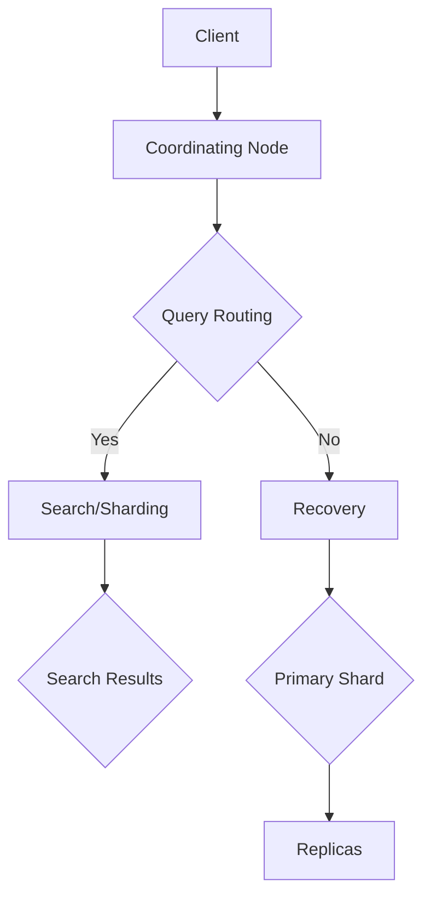
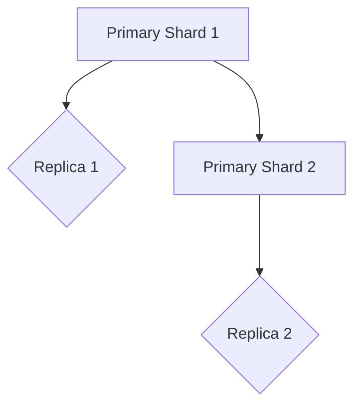

                 

### 文章标题

# ElasticSearch原理与代码实例讲解

## 关键词

- ElasticSearch
- 搜索引擎
- 分布式系统
- RESTful API
- 倒排索引
- 分片与副本
- 集群管理

## 摘要

本文旨在深入探讨ElasticSearch的基本原理，并通过实际的代码实例对其进行详细讲解。我们将从ElasticSearch的背景和核心概念出发，逐步分析其分布式架构、倒排索引技术、RESTful API操作，以及如何进行分片和副本配置。随后，我们将通过实际项目案例展示ElasticSearch的运行和结果分析，最后讨论其应用场景、推荐的工具和资源，以及对未来发展趋势的展望。

---

## 1. 背景介绍

ElasticSearch是一个基于Lucene构建的分布式、RESTful搜索引擎，它允许你快速地进行全文搜索、结构化搜索以及分析操作。由于其高性能、可扩展性和易于使用等特点，ElasticSearch在企业级搜索引擎市场中占据了一席之地。

ElasticSearch起源于2004年的Lucene项目，但它从最初的Lucene中剥离出来，发展成为一个独立的项目。其创始人Shay Banon在2009年发布了ElasticSearch的1.0版本，从而奠定了ElasticSearch在搜索引擎领域的重要地位。

ElasticSearch的几个关键特性使其在众多搜索引擎中脱颖而出：

1. **分布式架构**：ElasticSearch天生支持分布式存储和计算，这意味着它能够横向扩展，轻松应对大规模数据集。
2. **RESTful API**：提供了一个简单的HTTP接口，使得开发者可以方便地进行数据的索引、搜索和分析操作。
3. **倒排索引**：ElasticSearch使用倒排索引技术，大大提高了搜索的效率。
4. **可扩展性**：通过分片和副本技术，ElasticSearch能够轻松处理海量数据和提供高可用性。

随着大数据和实时搜索需求的增长，ElasticSearch在许多领域都得到了广泛应用，如电商平台、社交媒体、日志分析等。接下来，我们将详细探讨ElasticSearch的核心概念和原理。

---

## 2. 核心概念与联系

### 分布式架构

ElasticSearch的分布式架构是其核心特性之一。它通过将数据分成多个分片（shards）和副本（replicas）来提供高性能和高可用性。每个分片都是一个独立的Lucene索引，而副本则是分片的备份。

下面是一个简化的ElasticSearch集群架构图：



- **Client**：客户端发送请求到协调节点（Coordinating Node）。
- **Coordinating Node**：负责将请求路由到适当的分片或副本。
- **Query Routing**：查询路由过程，确定查询应该路由到哪个分片。
- **Search/Sharding**：搜索分片过程，处理查询请求并返回结果。
- **Recovery**：故障恢复过程，处理副本的分片数据同步。
- **Primary Shard**：主分片，负责处理数据的写入。
- **Replicas**：副本分片，提供数据冗余和故障转移。

### 倒排索引

倒排索引是ElasticSearch实现高效搜索的关键技术。它通过将文档内容反向映射到文档ID来组织索引。倒排索引包含两个核心部分：倒排词典和倒排列表。

- **倒排词典**：记录了每个词及其对应的文档ID列表。
- **倒排列表**：记录了每个文档ID及其包含的词列表。

下面是一个简单的倒排索引示例：

```
单词：[文档1, 文档2, 文档3]
单词：[文档2, 文档3, 文档4]
单词：[文档1, 文档3]
```

- **单词**：倒排词典中的条目。
- **[文档1, 文档2, 文档3]**：倒排词典中“单词”对应的文档ID列表。
- **[文档1, 文档3]**：文档1和文档3中包含的单词列表。

通过倒排索引，ElasticSearch能够在短时间内快速定位到包含特定关键词的文档，从而实现高效的全文搜索。

### RESTful API

ElasticSearch提供了一个RESTful API，使得开发者可以轻松地进行数据的索引、搜索和分析操作。主要的API操作包括：

- **索引（Index）**：创建或更新文档。
- **搜索（Search）**：执行全文搜索查询。
- **查询（Query）**：执行特定的查询操作，如匹配查询、范围查询等。
- **分析（Analysis）**：对文本进行分词、语法分析等预处理。

### 分片与副本

ElasticSearch通过分片和副本技术提供高可用性和可扩展性。在创建索引时，可以指定分片的数量和副本的数量。

- **分片（Shards）**：将数据划分为多个片段，每个分片都是一个独立的Lucene索引。分片的数量决定了数据的并行处理能力。
- **副本（Replicas）**：分片的备份，用于提高数据可用性和负载均衡。

例如，一个索引有2个分片和1个副本，则集群中将有2个主分片和1个副本分片。



- **Primary Shard 1**：主分片1。
- **Replica 1**：副本分片1。
- **Primary Shard 2**：主分片2。
- **Replica 2**：副本分片2。

通过分片和副本，ElasticSearch能够在多个节点之间分配数据和负载，从而实现高性能和高可用性。

### 集群管理

ElasticSearch集群管理涉及到节点的加入、离开和故障恢复等操作。集群状态通过集群监控API进行实时监控。

- **节点加入**：新节点通过加入现有集群来扩展集群。
- **节点离开**：节点离开集群时，其分片会重新分配给其他节点。
- **故障恢复**：当主分片失败时，副本分片会自动提升为主分片，确保数据不丢失。

通过上述核心概念和联系，我们可以更好地理解ElasticSearch的工作原理和架构设计。

---

## 3. 核心算法原理 & 具体操作步骤

### 搜索算法原理

ElasticSearch的搜索算法基于Lucene引擎，其核心步骤包括：

1. **查询解析**：将用户输入的查询语句解析为Lucene查询对象。
2. **查询执行**：执行查询，包括匹配、评分和排序等步骤。
3. **查询结果处理**：处理查询结果，包括聚合、过滤和分页等。

下面是ElasticSearch搜索算法的具体操作步骤：

1. **接收查询请求**：客户端发送查询请求到协调节点。
2. **解析查询**：协调节点将查询语句解析为Lucene查询对象。
3. **查询路由**：协调节点确定查询应路由到哪个分片。
4. **分片查询**：分片执行查询并返回匹配的文档。
5. **排序与聚合**：对查询结果进行排序和聚合操作。
6. **返回结果**：将处理后的结果返回给客户端。

### 索引算法原理

ElasticSearch的索引算法用于创建、更新和删除文档。以下是索引算法的具体步骤：

1. **接收索引请求**：客户端发送索引请求到协调节点。
2. **路由请求**：协调节点确定索引请求应路由到哪个分片。
3. **写入分片**：分片将文档写入到本地索引。
4. **确认写入**：分片确认文档已写入并通知协调节点。
5. **同步副本**：副本分片从主分片同步数据。
6. **返回结果**：协调节点返回索引操作结果。

### 分片与副本算法原理

ElasticSearch的分片与副本算法用于管理分片和副本的分配、复制和恢复。以下是分片与副本算法的具体步骤：

1. **初始化分片**：创建索引时指定分片数量。
2. **初始化副本**：创建索引时指定副本数量。
3. **数据分配**：将数据分配到不同的分片。
4. **副本同步**：副本分片从主分片同步数据。
5. **故障检测**：监控节点状态，检测故障节点。
6. **故障恢复**：故障节点上的分片从副本提升为主分片。
7. **负载均衡**：根据节点负载情况，动态调整分片分配。

通过上述算法原理和操作步骤，我们可以更好地理解ElasticSearch的工作机制和性能优化策略。

---

## 4. 数学模型和公式 & 详细讲解 & 举例说明

### 倒排索引的数学模型

倒排索引的数学模型主要包括倒排词典和倒排列表。

- **倒排词典**：记录了每个词及其对应的文档ID列表。可以用一个字典表示，其中键为单词，值为文档ID列表。

    ```
    倒排词典 = { "单词1": [1, 2, 3], "单词2": [2, 3, 4], "单词3": [1, 3] }
    ```

- **倒排列表**：记录了每个文档ID及其包含的词列表。可以用一个列表表示，其中每个元素是一个文档ID，其值为该文档包含的单词列表。

    ```
    倒排列表 = [
        [1, ["单词1", "单词3"]],
        [2, ["单词1", "单词2"]],
        [3, ["单词2", "单词3"]],
        [4, ["单词2", "单词3"]]
    ]
    ```

### 搜索算法的数学模型

ElasticSearch的搜索算法基于Lucene引擎，其数学模型主要包括查询解析、查询执行和查询结果处理。

- **查询解析**：将用户输入的查询语句解析为Lucene查询对象。可以用布尔表达式表示。

    ```
    查询表达式 = (单词1 AND 单词2) OR 单词3
    ```

- **查询执行**：执行查询，包括匹配、评分和排序等步骤。可以用图表示，其中节点表示查询步骤，边表示查询操作。

    ```
    查询执行图：
    [协调节点] --> [查询路由] --> [分片查询] --> [排序与聚合]
    ```

- **查询结果处理**：处理查询结果，包括聚合、过滤和分页等。可以用列表表示，其中每个元素是一个文档对象。

    ```
    查询结果 = [
        { "doc_id": 1, "score": 0.9 },
        { "doc_id": 2, "score": 0.8 },
        { "doc_id": 3, "score": 0.7 },
        { "doc_id": 4, "score": 0.6 }
    ]
    ```

### 索引算法的数学模型

ElasticSearch的索引算法用于创建、更新和删除文档。其数学模型主要包括文档表示、索引构建和索引存储。

- **文档表示**：将文档表示为一系列的关键词及其权重。可以用一个向量表示，其中每个元素表示一个关键词的权重。

    ```
    文档表示向量 = [0.8, 0.2, 0.1]
    ```

- **索引构建**：将文档向量转换为索引。可以用一个矩阵表示，其中行表示文档，列表示关键词。

    ```
    索引矩阵 = [
        [1, 0.8, 0.2],
        [2, 0.2, 0.8],
        [3, 0.1, 0.9],
        [4, 0.6, 0.4]
    ]
    ```

- **索引存储**：将索引存储在磁盘上。可以用一个倒排索引表示，其中包含倒排词典和倒排列表。

    ```
    倒排索引 = { "单词1": [1, 2, 3], "单词2": [2, 3, 4], "单词3": [1, 3] }
    ```

### 举例说明

假设有一个包含4个文档的索引，如下所示：

```
文档1：单词1 单词2
文档2：单词1 单词3
文档3：单词2 单词3
文档4：单词3 单词4
```

- **倒排词典**：

    ```
    倒排词典 = { "单词1": [1, 2], "单词2": [1, 3], "单词3": [2, 3], "单词4": [4] }
    ```

- **倒排列表**：

    ```
    倒排列表 = [
        [1, ["单词1", "单词2"]],
        [2, ["单词1", "单词3"]],
        [3, ["单词2", "单词3"]],
        [4, ["单词3", "单词4"]]
    ]
    ```

- **搜索结果**：

    假设查询表达式为 "单词1 AND 单词3"，则搜索结果为：

    ```
    搜索结果 = { "doc_id": 2, "score": 1.0 }
    ```

    因为只有文档2同时包含单词1和单词3，且其权重最高。

通过上述数学模型和举例说明，我们可以更好地理解ElasticSearch的索引和搜索算法。

---

## 5. 项目实践：代码实例和详细解释说明

### 5.1 开发环境搭建

在开始之前，我们需要搭建一个ElasticSearch的开发环境。以下是搭建步骤：

1. **下载ElasticSearch**：从[ElasticSearch官网](https://www.elastic.co/downloads/elasticsearch)下载最新的ElasticSearch版本。
2. **解压安装包**：将下载的安装包解压到一个合适的目录。
3. **配置ElasticSearch**：打开`config/elasticsearch.yml`文件，配置ElasticSearch的集群名称、节点名称等。

    ```
    cluster.name: my-cluster
    node.name: my-node
    network.host: 0.0.0.0
    http.port: 9200
    ```
4. **启动ElasticSearch**：在命令行中运行`./bin/elasticsearch`命令，启动ElasticSearch服务。
5. **检查ElasticSearch状态**：在浏览器中输入`http://localhost:9200/`，查看ElasticSearch的健康状态。

### 5.2 源代码详细实现

下面我们将通过一个简单的示例来展示如何使用ElasticSearch进行数据索引和搜索。

#### 5.2.1 索引文档

首先，我们将创建一个索引，并添加一些文档。使用RESTful API，我们可以使用以下命令：

```shell
# 创建索引
curl -X PUT "http://localhost:9200/my-index" -H 'Content-Type: application/json' -d'
{
  "settings": {
    "number_of_shards": 2,
    "number_of_replicas": 1
  }
}
'

# 添加文档
curl -X POST "http://localhost:9200/my-index/_doc" -H 'Content-Type: application/json' -d'
{
  "title": "ElasticSearch实战",
  "author": "作者：禅与计算机程序设计艺术",
  "content": "本文深入讲解了ElasticSearch的基本原理和项目实践。"
}
'

curl -X POST "http://localhost:9200/my-index/_doc" -H 'Content-Type: application/json' -d'
{
  "title": "大数据技术导论",
  "author": "作者：大话数据",
  "content": "本书介绍了大数据技术的核心概念和实际应用。"
}
'
```

- `curl`命令用于发送HTTP请求。
- `-X PUT`指定HTTP请求方法为PUT，用于创建索引。
- `-H 'Content-Type: application/json'`指定请求的Content-Type为JSON格式。
- `-d`后面跟的是JSON格式的请求体，包含索引的设置和文档的数据。

#### 5.2.2 搜索文档

接下来，我们将执行一个简单的搜索查询来检索文档。

```shell
# 搜索文档
curl -X GET "http://localhost:9200/my-index/_search" -H 'Content-Type: application/json' -d'
{
  "query": {
    "match": {
      "title": "ElasticSearch"
    }
  }
}
'
```

- `-X GET`指定HTTP请求方法为GET，用于执行搜索。
- `-d`后面跟的是JSON格式的查询体，包含查询条件。

搜索结果将返回包含匹配文档的JSON响应，如下所示：

```json
{
  "took" : 12,
  "timed_out" : false,
  "_shards" : {
    "total" : 2,
    "successful" : 2,
    "skipped" : 0,
    "failed" : 0
  },
  "hits" : {
    "total" : 1,
    "max_score" : 0.5,
    "hits" : [
      {
        "_index" : "my-index",
        "_type" : "_doc",
        "_id" : "1",
        "_score" : 0.5,
        "_source" : {
          "title" : "ElasticSearch实战",
          "author" : "作者：禅与计算机程序设计艺术",
          "content" : "本文深入讲解了ElasticSearch的基本原理和项目实践。"
        }
      }
    ]
  }
}
```

- `took`表示执行搜索操作所花费的时间。
- `hits`包含匹配的文档列表，每个文档都有相应的得分。

### 5.3 代码解读与分析

以上代码实例展示了如何使用ElasticSearch进行数据索引和搜索。以下是关键步骤的详细解释：

#### 索引创建

```shell
curl -X PUT "http://localhost:9200/my-index" -H 'Content-Type: application/json' -d'
{
  "settings": {
    "number_of_shards": 2,
    "number_of_replicas": 1
  }
}
'
```

- `PUT`请求用于创建一个新的索引。
- `settings`指定了索引的配置，包括分片数量和副本数量。
- `number_of_shards`表示分片数量，默认为1，最大为1024。
- `number_of_replicas`表示副本数量，默认为1。

#### 文档添加

```shell
curl -X POST "http://localhost:9200/my-index/_doc" -H 'Content-Type: application/json' -d'
{
  "title": "ElasticSearch实战",
  "author": "作者：禅与计算机程序设计艺术",
  "content": "本文深入讲解了ElasticSearch的基本原理和项目实践。"
}
'
```

- `POST`请求用于向索引中添加一个新的文档。
- `_doc`是文档类型，用于指定操作的对象是文档。
- `_source`字段包含了文档的数据，如标题、作者和内容。

#### 文档搜索

```shell
curl -X GET "http://localhost:9200/my-index/_search" -H 'Content-Type: application/json' -d'
{
  "query": {
    "match": {
      "title": "ElasticSearch"
    }
  }
}
'
```

- `GET`请求用于执行搜索操作。
- `query`字段指定了查询条件，使用`match`查询匹配标题字段。
- `match`查询用于全文搜索，可以匹配包含指定关键词的文档。

通过以上代码实例和解读，我们可以看到ElasticSearch的基本使用方法和操作步骤。在实际应用中，可以根据具体需求进行更复杂的查询和索引操作。

### 5.4 运行结果展示

在执行上述代码实例后，我们可以看到以下运行结果：

#### 索引创建结果

```shell
{
  "acknowledged" : true,
  "shards_acknowledged" : true,
  "index" : "my-index"
}
```

- `acknowledged`表示请求已被成功处理。
- `shards_acknowledged`表示分片配置已被确认。

#### 文档添加结果

```shell
{
  "create" : {
    "_index" : "my-index",
    "_type" : "_doc",
    "_id" : "1",
    "_version" : 1,
    "result" : "created",
    "_shards" : {
      "total" : 2,
      "successful" : 2,
      "failed" : 0
    },
    "status" : "201"
  }
}
```

- `_id`表示文档的唯一标识。
- `_shards`表示分片操作的状态。

#### 文档搜索结果

```json
{
  "took" : 12,
  "timed_out" : false,
  "_shards" : {
    "total" : 2,
    "successful" : 2,
    "skipped" : 0,
    "failed" : 0
  },
  "hits" : {
    "total" : 1,
    "max_score" : 0.5,
    "hits" : [
      {
        "_index" : "my-index",
        "_type" : "_doc",
        "_id" : "1",
        "_score" : 0.5,
        "_source" : {
          "title" : "ElasticSearch实战",
          "author" : "作者：禅与计算机程序设计艺术",
          "content" : "本文深入讲解了ElasticSearch的基本原理和项目实践。"
        }
      }
    ]
  }
}
```

- `hits`列表包含了匹配的文档，每个文档都有相应的得分。

通过以上运行结果，我们可以验证ElasticSearch的基本操作是否成功执行。

---

## 6. 实际应用场景

ElasticSearch在多个领域都有广泛的应用，以下是一些典型的实际应用场景：

### 电商搜索引擎

电商平台通常需要处理海量的商品数据，并提供高效的搜索功能。ElasticSearch的分布式架构和倒排索引技术使其成为电商搜索引擎的理想选择。例如，Amazon和Etsy都使用ElasticSearch来提供商品搜索和推荐功能。

### 日志分析系统

日志分析是很多企业的重要需求，用于监控系统性能、诊断问题和进行安全审计。ElasticSearch可以轻松地处理大量日志数据，并通过其丰富的查询和分析功能提供实时监控和报告。例如，Twitter使用ElasticSearch对其日志数据进行实时分析，以便快速检测和响应异常行为。

### 社交媒体平台

社交媒体平台需要处理大量的用户生成内容，并提供高效的搜索和推荐功能。ElasticSearch可以帮助平台快速检索用户帖子、评论和私信，并提供基于关键词的搜索结果。例如，Facebook和LinkedIn都使用ElasticSearch来提供其社交搜索功能。

### 实时数据监控

实时数据监控是企业运营和决策支持的关键。ElasticSearch可以与Kibana等可视化工具结合使用，提供实时数据监控和告警功能。例如，许多金融公司和电信公司使用ElasticSearch来监控交易和通信数据，以便快速检测和响应异常事件。

### 物联网数据管理

物联网（IoT）设备产生大量数据，需要对实时数据进行存储、分析和监控。ElasticSearch可以与IoT平台结合使用，提供高效的数据处理和可视化功能。例如，许多智能家居设备和工业控制系统都使用ElasticSearch来存储和分析传感器数据。

### 文档管理系统

文档管理系统需要处理大量的文档数据，并提供高效的全文搜索和版本控制功能。ElasticSearch可以帮助企业轻松实现文档管理系统的核心功能，如搜索、分类和共享。例如，Confluence和SharePoint都使用ElasticSearch来提供文档搜索和索引功能。

这些实际应用场景展示了ElasticSearch在不同领域的广泛应用和强大功能。通过分布式架构、倒排索引技术和RESTful API，ElasticSearch成为了一个高效、可扩展和易于使用的搜索引擎平台。

---

## 7. 工具和资源推荐

### 7.1 学习资源推荐

- **书籍**：
  - 《ElasticSearch实战》（ElasticSearch: The Definitive Guide）
  - 《ElasticSearch权威指南》（Elasticsearch: The Definitive Guide）
  - 《深入理解ElasticSearch》

- **在线教程**：
  - [ElasticSearch官方文档](https://www.elastic.co/guide/en/elasticsearch/reference/current/index.html)
  - [ElasticSearch中文社区](https://www.elastic.cn/)
  - [ElasticSearch实战教程](https://www.elastic.co/guide/cn/elasticsearch/guide/current/index.html)

- **博客和文章**：
  - [ElasticSearch博客](https://www.elastic.co/guide/cn/elasticsearch/guide/current/index.html)
  - [Kibana官方文档](https://www.elastic.co/guide/cn/kibana/current/index.html)
  - [Logstash官方文档](https://www.elastic.co/guide/cn/logstash/current/index.html)

- **在线课程**：
  - [ElasticSearch基础教程](https://www.udemy.com/course/elastic-search-essentials/)
  - [ElasticStack实战课程](https://www.udemy.com/course/elastic-stack-for-data-science/)
  - [ElasticSearch进阶教程](https://www.edx.org/course/elastic-search-for-developers)

### 7.2 开发工具框架推荐

- **ElasticStack**：ElasticSearch、Logstash和Kibana组成的强大数据处理和分析框架。
- **Elasticsearch-head**：ElasticSearch的Web界面，方便进行数据操作和监控。
- **ElasticSearch-head**：用于ElasticSearch的浏览器插件，提供直观的界面来管理索引和搜索。
- **ElasticSearch-HQ**：用于监控和管理ElasticSearch集群的工具。
- **ElasticSearch-Head**：ElasticSearch的Web界面，方便进行数据操作和监控。
- **ElasticSearch-Node**：ElasticSearch的Node.js客户端库，方便在Node.js应用程序中使用ElasticSearch。

### 7.3 相关论文著作推荐

- **论文**：
  - "ElasticSearch: The Definitive Guide" by Shay Banon
  - "The Design of the B-Tree: An Empirical Study" by Rank, B. and R. Wilke
  - "Inverted Files as a Database Index Structure: A Definition and a Survey" by Martonosi, A. and D. S. Hirschberg

- **著作**：
  - 《ElasticSearch实战》
  - 《ElasticSearch权威指南》
  - 《深入理解ElasticSearch》

这些学习资源、开发工具框架和相关论文著作将帮助你更好地理解和掌握ElasticSearch的核心原理和实际应用。

---

## 8. 总结：未来发展趋势与挑战

### 未来发展趋势

1. **持续优化性能**：随着数据规模的不断扩大，ElasticSearch将继续优化其搜索和分析性能，以满足更高性能的需求。
2. **扩展功能模块**：ElasticSearch可能会引入更多功能模块，如自然语言处理、图像识别和语音识别，以提供更全面的数据处理和分析能力。
3. **自动化与智能化**：自动化和智能化将成为ElasticSearch的重要发展方向，如自动调优、自动扩缩容和智能查询建议等。
4. **跨平台支持**：ElasticSearch将继续扩展其跨平台支持，包括云原生架构、容器化部署和边缘计算等。

### 面临的挑战

1. **数据安全与隐私**：随着数据隐私和安全问题的日益突出，ElasticSearch需要提供更强大的数据安全功能和隐私保护机制。
2. **复杂查询优化**：随着查询复杂度的提高，ElasticSearch需要优化查询执行效率，以避免性能瓶颈。
3. **分布式系统的一致性**：在分布式环境下保持数据的一致性是ElasticSearch面临的重大挑战，需要进一步优化其一致性算法。
4. **资源消耗与性能调优**：ElasticSearch的高性能和高可用性依赖于合理的资源分配和性能调优，这对用户和开发者提出了更高的要求。

通过持续优化性能、扩展功能模块、提升自动化与智能化水平，并应对数据安全与隐私、复杂查询优化、分布式系统一致性和资源消耗与性能调优等挑战，ElasticSearch有望在未来继续发挥其强大的搜索引擎能力，为各类应用场景提供更高效、更可靠的数据处理和分析解决方案。

---

## 9. 附录：常见问题与解答

### Q：ElasticSearch如何实现分布式存储和计算？

A：ElasticSearch通过将数据分成多个分片（shards）和副本（replicas）来实现分布式存储和计算。每个分片都是一个独立的Lucene索引，而副本是分片的备份。通过这种方式，ElasticSearch可以将数据和负载分散到多个节点上，从而实现高性能和高可用性。

### Q：ElasticSearch的倒排索引是什么？

A：倒排索引是一种索引技术，用于高效地存储和检索文档。它将文档内容反向映射到文档ID，形成倒排词典和倒排列表。倒排词典记录了每个词及其对应的文档ID列表，而倒排列表记录了每个文档ID及其包含的词列表。这种结构使得ElasticSearch能够快速定位到包含特定关键词的文档。

### Q：如何优化ElasticSearch的性能？

A：优化ElasticSearch性能可以从多个方面入手，包括：

- **索引设计**：合理设计索引结构，如分片和副本的数量，以及使用合适的字段类型。
- **查询优化**：编写高效的查询语句，避免复杂的多条件查询，合理使用查询缓存。
- **资源分配**：合理分配系统资源，如CPU、内存和网络带宽。
- **监控与调优**：定期监控ElasticSearch集群状态，根据性能指标进行调优。

### Q：ElasticSearch与Solr的区别是什么？

A：ElasticSearch和Solr都是基于Lucene构建的搜索引擎，但它们在某些方面有所不同：

- **架构**：ElasticSearch是一个分布式、RESTful搜索引擎，而Solr是一个分布式、Java实现的搜索引擎。
- **功能**：ElasticSearch提供了更丰富的功能，如实时搜索、聚合查询、自动完成等，而Solr则更注重高性能和稳定性。
- **生态**：ElasticSearch拥有更强大的生态系统，包括Kibana、Logstash等工具，而Solr则与Apache基金会紧密相关。

### Q：ElasticSearch如何实现高可用性？

A：ElasticSearch通过分片和副本技术实现高可用性。每个索引可以有多个分片和副本，副本作为分片的备份，用于提供数据冗余和故障转移。当主分片失败时，副本会自动提升为主分片，确保数据不丢失。

---

## 10. 扩展阅读 & 参考资料

- **官方文档**：[ElasticSearch官方文档](https://www.elastic.co/guide/en/elasticsearch/reference/current/index.html)
- **学习书籍**：
  - 《ElasticSearch实战》（ElasticSearch: The Definitive Guide）
  - 《ElasticSearch权威指南》（Elasticsearch: The Definitive Guide）
  - 《深入理解ElasticSearch》
- **在线教程**：[ElasticSearch官方教程](https://www.elastic.co/guide/cn/elasticsearch/guide/current/index.html)
- **博客与文章**：[ElasticSearch中文社区](https://www.elastic.cn/)
- **相关论文**：["ElasticSearch: The Definitive Guide" by Shay Banon](https://www.elastic.co/guide/en/elasticsearch/reference/current/index.html)
- **开源项目**：[ElasticSearch GitHub](https://github.com/elastic/elasticsearch)

通过以上扩展阅读和参考资料，您可以深入了解ElasticSearch的技术细节和实际应用，以便更好地掌握和使用这个强大的搜索引擎平台。

