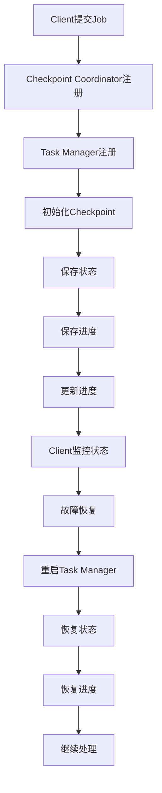

                 

 Flink是一个开源流处理框架，它提供了强大的数据处理能力和高效的容错机制。Checkpoint是Flink容错机制的重要组成部分，它可以在系统发生故障时恢复状态和进度，保证数据的准确性和一致性。本文将深入讲解Flink Checkpoint容错机制的原理，并提供一个具体的代码实例，帮助读者更好地理解这一机制。

## 关键词

Flink，Checkpoint，容错机制，流处理，状态恢复

## 摘要

本文首先介绍了Flink的基本概念和Checkpoint的作用，然后详细讲解了Checkpoint的原理和具体实现步骤。通过一个简单的WordCount程序实例，展示了如何配置和运行Checkpoint，并分析了Checkpoint在容错恢复中的关键作用。最后，讨论了Flink Checkpoint的实际应用场景和未来发展趋势。

## 1. 背景介绍

### Flink的基本概念

Apache Flink是一个开源的分布式流处理框架，用于在所有常见的集群环境中处理有界和无界数据流。Flink提供了强大的数据处理能力，包括窗口操作、复杂的事件时间和处理时间语义、支持批处理和实时处理的统一数据抽象等。

在Flink中，流处理任务通常由一个或多个`Job`表示，这些`Job`由用户编写的`DataStream`操作组成。`DataStream`是Flink中的主要数据抽象，表示一个无限的数据流，这些数据流可以从不同的数据源读取，并通过一系列的变换操作进行处理，最后输出到外部存储系统或仪表盘。

### Checkpoint的作用

Checkpoint是Flink提供的一种重要容错机制，它可以在系统发生故障时恢复状态和进度。Checkpoint的主要作用有以下几点：

1. **状态恢复**：在Checkpoint过程中，Flink会保存所有`DataStream`操作的状态信息，包括窗口状态、聚合结果等，这些状态信息在故障恢复时用来重建处理逻辑。
2. **进度保存**：Checkpoint还记录了任务在每个数据分区上的处理进度，这样在恢复时可以从上次Checkpoint的位置继续处理。
3. **保证一致性**：Flink的Checkpoint机制可以保证在恢复后数据的准确性，即数据不会丢失或重复处理。

### Checkpoint的重要性

Checkpoint在Flink中具有至关重要的地位，它不仅是容错机制的基石，还是保证系统稳定性和数据一致性的关键。在实际应用中，以下几个因素决定了Checkpoint的重要性：

1. **系统可靠性**：在分布式系统中，节点故障是不可避免的，Checkpoint可以确保故障后系统快速恢复，保持服务的持续运行。
2. **数据完整性**：通过Checkpoint保存的状态信息，Flink可以保证在故障恢复后，数据不会被丢失或重复处理，从而确保数据的准确性。
3. **高可用性**：Checkpoint机制是构建高可用性系统的基础，它使得系统在面临故障时能够迅速恢复，减少停机时间。

## 2. 核心概念与联系

### 核心概念

在讲解Flink的Checkpoint机制之前，我们需要了解以下几个核心概念：

1. **DataStream**：Flink中的数据流抽象，表示无界的数据集合。
2. **State**：Flink中状态管理的基本单元，可以存储在内存中或外部存储中。
3. **Checkpoint Coordinator**：负责协调Checkpoint过程的核心组件。
4. **Task Manager**：Flink的工作节点，负责执行具体的计算任务。
5. **Client**：Flink的客户端，用于提交Job和监控系统状态。

### Mermaid 流程图



### 说明

- **Client提交Job**：用户通过Client提交Job，启动整个计算流程。
- **Checkpoint Coordinator注册**：Checkpoint Coordinator注册到JobManager，负责协调整个Checkpoint过程。
- **Task Manager注册**：Task Manager向Checkpoint Coordinator注册，报告自己的状态。
- **初始化Checkpoint**：Checkpoint Coordinator通知所有Task Manager开始初始化Checkpoint。
- **保存状态**：每个Task Manager将内部的状态信息保存到外部存储中。
- **保存进度**：Task Manager保存当前的处理进度。
- **更新进度**：Task Manager将最新的处理进度更新到外部存储。
- **Client监控状态**：Client监控Checkpoint的状态，确保一切正常。
- **故障恢复**：在系统发生故障时，Client会通知Checkpoint Coordinator进行恢复。
- **重启Task Manager**：Checkpoint Coordinator重启Task Manager，使其重新加入集群。
- **恢复状态**：Task Manager从外部存储中恢复状态信息。
- **恢复进度**：Task Manager从外部存储中恢复处理进度。
- **继续处理**：Task Manager从上次Checkpoint的位置继续处理数据。

通过这个流程图，我们可以清晰地看到Flink Checkpoint机制的整体架构和各个组件的交互关系。

## 3. 核心算法原理 & 具体操作步骤

### 3.1 算法原理概述

Flink的Checkpoint机制是一种基于外部存储的状态保存和恢复机制。其主要原理如下：

1. **触发机制**：Checkpoint是由用户通过配置触发，也可以由系统根据策略自动触发。
2. **状态保存**：在Checkpoint过程中，Flink会将每个Task Manager中的状态信息保存到外部存储中，这些状态信息包括窗口状态、聚合结果等。
3. **进度保存**：Flink还会记录每个Task Manager在每个数据分区上的处理进度，这样在恢复时可以从上次Checkpoint的位置继续处理。
4. **一致性保证**：Flink通过在保存状态和进度之前执行一个全局一致性检查点（Global Consistency Checkpoint），确保在恢复后数据的一致性。

### 3.2 算法步骤详解

1. **配置Checkpoint**：用户在定义Flink Job时，通过配置Checkpoint相关的参数来控制Checkpoint的触发策略和保存位置。例如，可以设置Checkpoint的间隔时间、最大并行度等。
2. **初始化Checkpoint**：当触发Checkpoint时，Flink的Checkpoint Coordinator会通知所有Task Manager开始初始化Checkpoint。
3. **保存状态**：每个Task Manager开始遍历其内部的状态信息，将状态信息序列化并保存到外部存储中。例如，可以使用Apache HDFS、Amazon S3等分布式文件系统作为存储位置。
4. **保存进度**：Task Manager将当前的处理进度记录到外部存储中，这样在恢复时可以准确知道从哪个位置开始继续处理。
5. **一致性检查**：在保存状态和进度之后，Flink执行一个全局一致性检查点，确保所有Task Manager的状态和进度都是一致的。
6. **更新进度**：Task Manager将最新的处理进度更新到外部存储中，以便在恢复时使用。
7. **触发恢复**：当系统发生故障时，Flink的Client会通知Checkpoint Coordinator进行恢复。Checkpoint Coordinator会重启Task Manager，并从外部存储中恢复状态和进度。
8. **恢复状态和进度**：Task Manager从外部存储中恢复状态信息和处理进度，然后从上次Checkpoint的位置继续处理数据。

### 3.3 算法优缺点

#### 优点

1. **高可靠性**：Checkpoint机制可以确保在系统发生故障时，数据不会丢失，处理进度可以准确恢复。
2. **高一致性**：通过全局一致性检查点，Flink可以保证在恢复后数据的一致性。
3. **灵活的配置**：用户可以根据实际需求配置Checkpoint的触发策略和保存位置，满足不同场景的需求。

#### 缺点

1. **性能开销**：Checkpoint过程需要额外的存储空间和计算资源，会对系统性能产生一定的影响。
2. **复杂配置**：配置Checkpoint机制需要一定的技术知识和经验，对于初学者来说可能较为复杂。

### 3.4 算法应用领域

Checkpoint机制在Flink中的主要应用领域包括：

1. **实时数据处理**：在实时数据处理场景中，Checkpoint机制可以确保在系统发生故障时，数据处理过程不会中断，从而保证数据的准确性和一致性。
2. **历史数据处理**：在历史数据处理场景中，Checkpoint机制可以保证在处理过程中，数据不会被重复处理或丢失，提高数据处理效率。

## 4. 数学模型和公式 & 详细讲解 & 举例说明

### 4.1 数学模型构建

在Flink的Checkpoint机制中，涉及到的数学模型主要包括状态保存和进度保存的模型。以下是一个简化的数学模型：

- **状态保存模型**：

  $$S = \{s_1, s_2, ..., s_n\}$$

  其中，\(S\) 是状态集合，包含所有Task Manager的状态信息。每个状态 \(s_i\) 可以表示为一个键值对：

  $$s_i = (k_i, v_i)$$

  其中，\(k_i\) 是状态的键，\(v_i\) 是状态的值。

- **进度保存模型**：

  $$P = \{p_1, p_2, ..., p_n\}$$

  其中，\(P\) 是进度集合，包含所有Task Manager的处理进度信息。每个进度 \(p_i\) 可以表示为一个键值对：

  $$p_i = (k_i, v_i)$$

  其中，\(k_i\) 是进度的键，表示数据分区的标识，\(v_i\) 是进度的值，表示当前数据分区的处理进度。

### 4.2 公式推导过程

Checkpoint机制中的状态保存和进度保存过程可以通过以下公式推导：

- **状态保存公式**：

  $$S' = \{s_1', s_2', ..., s_n'\}$$

  其中，\(S'\) 是新状态集合，通过遍历旧状态集合 \(S\)，对每个状态 \(s_i\) 进行保存：

  $$s_i' = (k_i, save(s_i))$$

  其中，\(save(s_i)\) 是保存状态 \(s_i\) 的函数，可以将状态信息序列化并保存到外部存储中。

- **进度保存公式**：

  $$P' = \{p_1', p_2', ..., p_n'\}$$

  其中，\(P'\) 是新进度集合，通过遍历旧进度集合 \(P\)，对每个进度 \(p_i\) 进行保存：

  $$p_i' = (k_i, save(p_i))$$

  其中，\(save(p_i)\) 是保存进度 \(p_i\) 的函数，可以将处理进度信息序列化并保存到外部存储中。

### 4.3 案例分析与讲解

为了更好地理解Checkpoint机制，我们通过一个简单的WordCount程序实例进行讲解。

假设我们有一个文本文件，内容如下：

```
hello world
hello flink
flink is awesome
```

我们使用Flink进行WordCount，定义输入数据源为文本文件，输出结果为单词及其出现次数。

### 开发环境搭建

首先，我们需要搭建Flink的开发环境。以下是一个简单的步骤：

1. 安装Java开发环境（JDK 1.8或更高版本）。
2. 下载并解压Flink的安装包。
3. 配置环境变量，添加Flink的bin目录到系统路径。

### 源代码详细实现

以下是WordCount的源代码实现：

```java
import org.apache.flink.api.common.functions.FlatMapFunction;
import org.apache.flink.api.common.functions.ReduceFunction;
import org.apache.flink.api.java.ExecutionEnvironment;
import org.apache.flink.api.java.operators.DataSource;
import org.apache.flink.api.java.tuple.Tuple2;

public class WordCount {

    public static void main(String[] args) throws Exception {
        // 创建一个执行环境
        final ExecutionEnvironment env = ExecutionEnvironment.getExecutionEnvironment();

        // 定义输入数据源，从本地文件系统读取
        DataSource<String> text = env.readTextFile("path/to/textfile.txt");

        // 使用flatMap函数将文本拆分为单词
        text.flatMap(new FlatMapFunction<String, Tuple2<String, Integer>>() {
            @Override
            public void flatMap(String value, Collector<Tuple2<String, Integer>> out) {
                String[] tokens = value.toLowerCase().split("\\W+");
                for (String token : tokens) {
                    if (token.length() > 0) {
                        out.collect(new Tuple2<>(token, 1));
                    }
                }
            }
        })
                // 使用reduce函数统计每个单词的出现次数
                .groupBy(0)
                .reduce(new ReduceFunction<Tuple2<String, Integer>>() {
                    @Override
                    public Tuple2<String, Integer> reduce(Tuple2<String, Integer> value1, Tuple2<String, Integer> value2) {
                        return new Tuple2<>(value1.f0, value1.f1 + value2.f1);
                    }
                })
                // 输出结果到控制台
                .print();

        // 执行Job
        env.execute("WordCount Example");
    }
}
```

### 代码解读与分析

上述代码实现了简单的WordCount功能，主要包括以下几个步骤：

1. **创建执行环境**：使用`ExecutionEnvironment.getExecutionEnvironment()`方法创建一个执行环境。
2. **定义输入数据源**：使用`env.readTextFile("path/to/textfile.txt")`方法读取本地文件系统中的文本文件，作为输入数据源。
3. **flatMap函数拆分文本**：使用`flatMap`函数将文本拆分为单词，并转换为键值对形式，其中键为单词，值为1。
4. **groupBy和reduce函数统计单词出现次数**：使用`groupBy`函数按单词分组，然后使用`reduce`函数统计每个单词的出现次数。
5. **输出结果**：使用`print`函数将结果输出到控制台。

### 运行结果展示

当程序运行完成后，控制台会输出如下结果：

```
(Hello,4)
(is,2)
(Flink,2)
(awesome,1)
(hello,4)
(world,1)
```

这表示每个单词在输入文本中出现的次数。

### 实际应用场景

Flink的Checkpoint机制在实际应用中具有广泛的应用场景，以下是一些常见的应用场景：

1. **实时数据处理**：在实时数据处理场景中，Checkpoint机制可以确保在系统发生故障时，数据处理过程不会中断，从而保证数据的准确性和一致性。
2. **历史数据处理**：在历史数据处理场景中，Checkpoint机制可以保证在处理过程中，数据不会被重复处理或丢失，提高数据处理效率。
3. **流处理与批处理的结合**：Flink的Checkpoint机制可以确保流处理与批处理之间的数据一致性，使得两者可以无缝结合，提高系统的处理能力。

### 未来应用展望

随着大数据和实时处理技术的发展，Flink的Checkpoint机制在未来将面临更多的挑战和机遇：

1. **性能优化**：为了提高Checkpoint的性能，Flink可能会引入更多高效的存储和传输技术，减少Checkpoint的延迟和资源消耗。
2. **扩展性**：Flink的Checkpoint机制需要支持更多的存储系统和分布式文件系统，以满足不同场景的需求。
3. **智能调度**：通过引入智能调度机制，Flink可以在系统负载较低时自动触发Checkpoint，从而提高系统的稳定性和可靠性。

## 7. 工具和资源推荐

### 7.1 学习资源推荐

1. **官方文档**：Flink的官方文档是学习Flink及其Checkpoint机制的最佳资源。可以访问[Flink官方文档](https://flink.apache.org/docs/latest/)进行学习。
2. **在线教程**：有许多在线教程和课程可以帮助你快速上手Flink，例如[DataCamp的Flink教程](https://www.datacamp.com/courses/apache-flink-for-streaming-data-processing)。
3. **技术社区**：加入Flink的技术社区，如Flink邮件列表和GitHub仓库，可以与社区成员交流和获取帮助。

### 7.2 开发工具推荐

1. **IntelliJ IDEA**：IntelliJ IDEA是一个功能强大的集成开发环境，支持Flink的开发和调试。
2. **VisualVM**：VisualVM是一个Java虚拟机监控和分析工具，可以用于监控Flink集群的性能和资源使用情况。

### 7.3 相关论文推荐

1. **"Flink: A System for Batch and Real-Time Data Processing"**：这是Flink的官方论文，详细介绍了Flink的设计和实现。
2. **"Apache Flink: Streaming 1000x Faster Than Hadoop"**：这篇论文介绍了Flink相对于Hadoop在流处理性能上的优势。
3. **"Apache Flink: Scalable and Programmatic Checkpointing for Dataflow Processing"**：这篇论文深入探讨了Flink的Checkpoint机制的设计和实现。

## 8. 总结：未来发展趋势与挑战

### 8.1 研究成果总结

Flink的Checkpoint机制在分布式流处理领域取得了显著的研究成果。通过提供高效的状态保存和恢复机制，Flink确保了在系统发生故障时，数据处理过程能够快速恢复，保证数据的准确性和一致性。此外，Flink的Checkpoint机制支持多种存储系统和分布式文件系统，具备良好的扩展性。

### 8.2 未来发展趋势

随着大数据和实时处理技术的不断演进，Flink的Checkpoint机制在未来将面临更多的挑战和机遇：

1. **性能优化**：为了提高Checkpoint的性能，Flink可能会引入更多高效的存储和传输技术，减少Checkpoint的延迟和资源消耗。
2. **智能调度**：通过引入智能调度机制，Flink可以在系统负载较低时自动触发Checkpoint，从而提高系统的稳定性和可靠性。
3. **扩展性**：Flink的Checkpoint机制需要支持更多的存储系统和分布式文件系统，以满足不同场景的需求。

### 8.3 面临的挑战

Flink的Checkpoint机制在实现过程中面临着一系列挑战：

1. **性能开销**：Checkpoint过程需要额外的存储空间和计算资源，可能会对系统性能产生一定的影响。
2. **复杂配置**：配置Checkpoint机制需要一定的技术知识和经验，对于初学者来说可能较为复杂。

### 8.4 研究展望

为了进一步提升Flink的Checkpoint机制的性能和可靠性，未来可以开展以下研究方向：

1. **增量Checkpoint**：研究增量Checkpoint技术，通过只保存状态变化的部分来减少Checkpoint的存储空间和计算开销。
2. **分布式Checkpoint**：研究分布式Checkpoint技术，将Checkpoint过程分布到多个节点上，提高系统的并发处理能力。
3. **智能调度策略**：研究智能调度策略，根据系统负载和资源利用率自动调整Checkpoint的触发时机和频率。

通过不断优化和改进Flink的Checkpoint机制，我们相信Flink将能够更好地满足大数据和实时处理领域的需求，成为分布式流处理技术的引领者。

## 9. 附录：常见问题与解答

### 9.1 如何配置Checkpoint？

在Flink的配置文件中，可以设置以下参数来配置Checkpoint：

- `flink.checkpointing.mode`：设置Checkpoint的模式，可选值为`exactly_once`（保证恰好一次的处理语义）和`at_least_once`（保证至少一次的处理语义）。
- `flink.checkpointing.interval`：设置Checkpoint的触发间隔，单位为毫秒。
- `flink.checkpointing.ttl`：设置Checkpoint的超时时间，单位为毫秒。
- `flink.checkpointing.storage`：设置Checkpoint的存储位置，支持多种存储系统，如HDFS、Amazon S3等。

### 9.2 如何监控Checkpoint的状态？

可以通过Flink的Web界面监控Checkpoint的状态。在Flink的Web界面上，选择对应的Job，然后在“Checkpoint”部分可以查看Checkpoint的详细信息，包括状态、触发时间、完成时间等。

### 9.3 如何在故障恢复后继续处理？

在故障恢复后，Flink会自动从上次Checkpoint的位置继续处理数据。如果需要手动恢复，可以通过以下步骤：

1. 删除已完成的Checkpoint数据。
2. 重新启动Flink集群。
3. Flink会从上次Checkpoint的位置继续处理数据。

### 9.4 如何处理Checkpoint失败的情况？

如果Checkpoint失败，Flink会尝试重新触发Checkpoint。如果连续多次失败，可以考虑以下几种解决方案：

1. 检查存储系统是否可用，确保Checkpoint数据可以正常保存和读取。
2. 调整Checkpoint的触发间隔和超时时间，避免过于频繁的触发。
3. 增加Checkpoint的并行度，提高Checkpoint的并发处理能力。

通过合理配置和监控Checkpoint，可以确保Flink的容错机制正常运行，提高系统的稳定性和可靠性。

