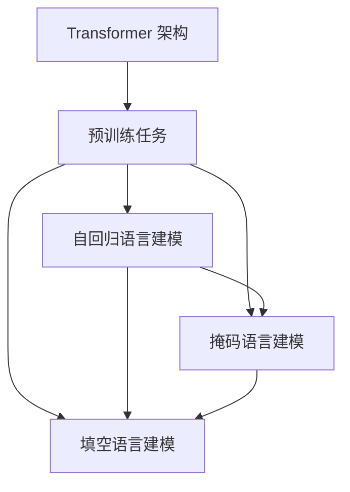

                 

### 背景介绍 Background Introduction

**GPT 系列：语言模型的里程碑**

语言模型作为自然语言处理（NLP）领域的核心技术，在近年来取得了显著进展。从最初的统计语言模型，到现代的深度学习语言模型，每一次技术迭代都极大地推动了NLP的发展。然而，GPT 系列的出现，无疑是这一进程中的重要里程碑。

GPT（Generative Pre-trained Transformer）由 OpenAI 于 2018 年首次发布，是一种基于 Transformer 架构的深度学习语言模型。GPT 系列从 GPT 到 GPT-3，不断进行迭代和升级，其参数量从 GPT-1 的 1.17 亿增长到 GPT-2 的 15 亿，最终到达 GPT-3 的 1750 亿。这种指数级增长不仅展示了深度学习模型在语言建模领域的巨大潜力，也为 NLP 的应用提供了更强大的工具。

**GPT 系列的发展历程**

1. **GPT-1（2018年）**：作为 GPT 系列的起点，GPT-1 使用了 Transformer 架构，并在多个 NLP 任务中展示了出色的性能。其预训练任务是基于大量文本数据进行未标注的语言建模，通过自回归的方式预测下一个词。
2. **GPT-2（2019年）**：GPT-2 是 GPT 系列的第二个版本，其参数量大幅增加，达到了 15 亿。这使得 GPT-2 在文本生成和语言理解任务上表现出更高的准确性和连贯性。
3. **GPT-3（2020年）**：GPT-3 的发布标志着语言模型进入了一个新的阶段。GPT-3 拥有 1750 亿参数，是最强大的语言模型之一。其预训练任务不仅包括自回归语言建模，还引入了掩码语言建模（MLM）和填空语言建模（RM）等任务，进一步提升了模型的能力。

**GPT 系列在 NLP 中的应用**

GPT 系列在 NLP 领域有着广泛的应用，包括文本生成、语言理解、机器翻译、问答系统等。以下是几个典型的应用场景：

1. **文本生成**：GPT 系列可以生成连贯且具有语境意义的文本，适用于自动写作、故事生成等任务。例如，GPT-3 能够生成新闻文章、诗歌、小说等。
2. **语言理解**：GPT 系列在情感分析、实体识别、关系抽取等任务中表现出色。这些任务通常需要对大量文本进行深入理解，GPT 系列通过预训练获得了强大的语言理解能力。
3. **机器翻译**：GPT 系列在机器翻译任务中也展现了强大的性能，特别是在低资源语言之间的翻译。其通过大规模的多语言语料库进行预训练，能够生成高质量的双语句子。
4. **问答系统**：GPT 系列可以用于构建问答系统，通过对大量问答对的训练，模型能够理解用户的问题并生成合适的回答。

**总结**

GPT 系列作为语言模型的里程碑，不仅在技术层面实现了重大突破，还在实际应用中展现出了巨大的潜力。其持续迭代和升级，不仅推动了 NLP 的发展，也为人工智能领域带来了新的机遇和挑战。

接下来，我们将深入探讨 GPT 系列的核心概念、算法原理、数学模型以及实际应用，以帮助读者全面了解这一重要的技术进展。在接下来的章节中，我们将逐步分析 GPT 系列的工作原理，解释其背后的技术细节，并通过实例展示其在实际应用中的效果。

---

### 核心概念与联系 Core Concepts and Relationships

为了全面理解 GPT 系列的工作原理，我们需要先介绍几个核心概念：Transformer 架构、预训练任务、自回归语言建模、掩码语言建模和填空语言建模。然后，我们将通过 Mermaid 流程图展示这些概念之间的联系和关系。

#### 1. Transformer 架构

Transformer 架构是由 Vaswani 等人于 2017 年提出的一种基于自注意力机制的序列到序列模型。与传统的循环神经网络（RNN）相比，Transformer 架构能够在计算复杂度和性能之间取得更好的平衡。其主要特点包括：

- **自注意力机制**：通过计算序列中每个词与其他词之间的关联度，实现全局信息整合。
- **多头注意力**：通过多个注意力头提取序列的不同方面，提高模型的表示能力。
- **位置编码**：为序列中的每个词赋予位置信息，使得模型能够理解词的相对位置。

#### 2. 预训练任务

预训练任务是指在一个大规模、无标注的数据集上，通过训练语言模型来学习通用语言表示。GPT 系列的预训练任务主要包括以下几种：

- **自回归语言建模（ARLM）**：通过预测序列中下一个词，使模型学习到文本的生成规律。
- **掩码语言建模（MLM）**：随机掩码输入序列中的部分词，通过预测这些被掩码的词，使模型学习到词汇的上下文关系。
- **填空语言建模（RM）**：在输入序列中随机删除一部分词，并要求模型预测这些被删除的词。

#### 3. 自回归语言建模

自回归语言建模是 GPT 系列的核心任务之一，其基本思想是在给定前文的情况下，预测序列中的下一个词。具体步骤如下：

1. **输入序列**：给定一个输入序列 \( x_1, x_2, ..., x_T \)。
2. **编码**：将输入序列编码为嵌入向量 \( e_1, e_2, ..., e_T \)。
3. **自注意力机制**：通过计算每个词与其他词之间的关联度，生成注意力权重 \( a_{ij} \)。
4. **计算当前词的概率分布**：根据注意力权重和嵌入向量，计算当前词的概率分布 \( P(x_{T+1} | x_1, x_2, ..., x_T) \)。

#### 4. 掩码语言建模

掩码语言建模是 GPT 系列的另一个重要任务，其目的是通过预测被掩码的词，使模型学习到词汇的上下文关系。具体步骤如下：

1. **输入序列**：给定一个输入序列 \( x_1, x_2, ..., x_T \)。
2. **随机掩码**：随机掩码输入序列中的部分词，得到掩码序列 \( x_1, x_2, ..., \hat{x}_i, ..., x_T \)，其中 \( \hat{x}_i \) 表示被掩码的词。
3. **编码**：将掩码序列编码为嵌入向量 \( e_1, e_2, ..., e_T \)。
4. **自注意力机制**：通过计算每个词与其他词之间的关联度，生成注意力权重 \( a_{ij} \)。
5. **计算当前词的概率分布**：根据注意力权重和嵌入向量，计算当前词的概率分布 \( P(\hat{x}_{i} | x_1, x_2, ..., x_T) \)。

#### 5. 填空语言建模

填空语言建模的目的是通过预测被删除的词，使模型学习到词汇的上下文关系。具体步骤如下：

1. **输入序列**：给定一个输入序列 \( x_1, x_2, ..., x_T \)。
2. **随机删除**：在输入序列中随机删除一部分词，得到删除序列 \( x_1, x_2, ..., \underline{x}_i, ..., x_T \)，其中 \( \underline{x}_i \) 表示被删除的词。
3. **编码**：将删除序列编码为嵌入向量 \( e_1, e_2, ..., e_T \)。
4. **自注意力机制**：通过计算每个词与其他词之间的关联度，生成注意力权重 \( a_{ij} \)。
5. **计算当前词的概率分布**：根据注意力权重和嵌入向量，计算当前词的概率分布 \( P(\underline{x}_{i} | x_1, x_2, ..., x_T) \)。

#### Mermaid 流程图

以下是一个展示 GPT 系列核心概念和关系的 Mermaid 流程图：



通过这个流程图，我们可以清晰地看到 GPT 系列的核心概念和它们之间的关系。接下来，我们将进一步探讨 GPT 系列的算法原理和具体操作步骤。

---

### 核心算法原理 & 具体操作步骤 Core Algorithm Principles & Step-by-Step Operations

#### 1. Transformer 架构

Transformer 架构是 GPT 系列的核心组成部分，其基本原理如下：

**自注意力机制**

自注意力机制（Self-Attention）是 Transformer 架构的核心创新点之一。它通过计算序列中每个词与其他词之间的关联度，实现全局信息整合。具体计算过程如下：

1. **计算 Query（Q）、Key（K）和 Value（V）**：对于序列中的每个词，分别计算其 Query、Key 和 Value 向量。通常，这三种向量可以通过线性变换得到：
   $$
   Q = W_Q \cdot E, \quad K = W_K \cdot E, \quad V = W_V \cdot E
   $$
   其中 \( E \) 是词的嵌入向量，\( W_Q \)，\( W_K \)，\( W_V \) 分别是 Query、Key 和 Value 的权重矩阵。

2. **计算 Attention 权重**：通过计算 Query 和 Key 之间的相似度，得到每个词的注意力权重：
   $$
   a_{ij} = \frac{e^{<Q, K_i>}}{\sum_{j=1}^{T} e^{<Q, K_j>}}
   $$
   其中 \( i \) 和 \( j \) 分别表示序列中的两个词，\( <Q, K_i> \) 表示 Query 和 Key 的点积。

3. **计算 Contextual Embedding**：根据注意力权重和 Value 向量，计算每个词的 Contextual Embedding：
   $$
   C_i = \sum_{j=1}^{T} a_{ij} \cdot V_j
   $$

**多头注意力**

多头注意力（Multi-Head Attention）是自注意力机制的扩展。它通过多个独立的注意力头提取序列的不同方面，提高模型的表示能力。具体计算过程如下：

1. **计算多个 Attention 权重**：对于每个注意力头，重复自注意力机制的步骤，得到多个注意力权重 \( a_{ij}^{(h)} \)。
2. **计算多头 Contextual Embedding**：将多个注意力头的 Contextual Embedding 拼接在一起，得到每个词的多头 Contextual Embedding：
   $$
   C_i^{(h)} = \sum_{j=1}^{T} a_{ij}^{(h)} \cdot V_j
   $$
   然后将所有多头 Contextual Embedding 拼接，得到最终的 Contextual Embedding：
   $$
   C_i = \text{Concat}(C_i^{(h_1)}, C_i^{(h_2)}, ..., C_i^{(h_H)}) = \text{Concat}(C_i^{(1)}, C_i^{(2)}, ..., C_i^{(H)})
   $$

**编码器架构**

Transformer 编码器由多个编码层（Encoder Layer）组成，每层包含两个主要部分：多头自注意力机制和前馈神经网络。具体结构如下：

1. **多头自注意力机制**：输入序列通过多头自注意力机制，计算每个词的 Contextual Embedding。
2. **前馈神经网络**：将多头自注意力机制的输出通过一个前馈神经网络，增加模型的非线性表示能力。

**训练过程**

在训练过程中，GPT 系列通过以下步骤：

1. **输入序列编码**：将输入序列编码为嵌入向量。
2. **通过编码器**：将嵌入向量通过编码器，计算每个词的 Contextual Embedding。
3. **输出序列解码**：通过解码器，将 Contextual Embedding 解码为输出序列。

#### 2. 具体操作步骤

以下是 GPT 系列的具体操作步骤：

**步骤 1：数据预处理**

1. **文本清洗**：去除标点符号、特殊字符和停用词。
2. **分词**：将文本分为单个词或子词。
3. **词嵌入**：将每个词映射为嵌入向量。

**步骤 2：构建模型**

1. **定义参数**：定义 Transformer 架构的参数，包括嵌入维度、多头注意力头数、编码层数量等。
2. **初始化模型**：初始化嵌入向量、权重矩阵等参数。

**步骤 3：预训练**

1. **自回归语言建模**：在未标注的数据集上，通过自回归语言建模，训练模型预测下一个词。
2. **掩码语言建模**：在输入序列中随机掩码部分词，通过预测这些被掩码的词，训练模型学习到词汇的上下文关系。
3. **填空语言建模**：在输入序列中随机删除部分词，通过预测这些被删除的词，训练模型学习到词汇的上下文关系。

**步骤 4：微调**

1. **选择微调任务**：选择需要微调的任务，如文本生成、语言理解等。
2. **加载预训练模型**：加载预训练的 GPT 模型。
3. **微调模型**：在微调任务的数据集上，训练模型，调整模型参数，提高模型在特定任务上的性能。

**步骤 5：应用**

1. **构建应用系统**：根据具体应用需求，构建应用系统，如文本生成、机器翻译、问答系统等。
2. **加载模型**：加载训练好的 GPT 模型。
3. **生成输出**：输入文本或任务数据，通过模型生成输出结果。

通过以上步骤，我们可以构建一个基于 GPT 系列的语言模型，并应用于各种 NLP 任务。在接下来的章节中，我们将进一步探讨 GPT 系列的数学模型和公式，以及如何使用这些模型和公式来分析和优化语言模型。

---

### 数学模型和公式 & 详细讲解 & 举例说明 Mathematical Models & Detailed Explanation & Example Illustrations

在深入探讨 GPT 系列的数学模型和公式之前，我们需要先了解一些基础概念，如词嵌入、自注意力机制和前馈神经网络。接下来，我们将详细讲解这些模型和公式的具体内容，并通过实例进行说明。

#### 1. 词嵌入

词嵌入（Word Embedding）是将词汇映射为向量空间中的点，以便于计算机处理。在 GPT 系列中，词嵌入是一个重要的环节。具体实现如下：

**公式**：
$$
E = \text{Embedding}(W; D_V, D_E)
$$

- **参数**：
  - \( W \)：词汇表
  - \( D_V \)：词汇表大小
  - \( D_E \)：词嵌入维度

**解释**：
- \( W \) 表示词汇表，包含所有词汇和对应的索引。
- \( D_V \) 表示词汇表大小，即词汇表中的词汇数量。
- \( D_E \) 表示词嵌入维度，即每个词嵌入向量的维度。

**实例**：

假设有一个简单的词汇表和词嵌入维度为2的词嵌入：

| 词汇 | 索引 |
| --- | --- |
| "hello" | 0 |
| "world" | 1 |
| "!" | 2 |

词嵌入结果如下：

| 索引 | 词嵌入向量 |
| --- | --- |
| 0 | (1, 0) |
| 1 | (0, 1) |
| 2 | (-1, -1) |

#### 2. 自注意力机制

自注意力机制（Self-Attention）是 Transformer 架构的核心组件，用于计算序列中每个词与其他词之间的关联度。具体实现如下：

**公式**：
$$
\text{Attention}(Q, K, V) = \text{softmax}\left(\frac{QK^T}{\sqrt{d_k}}\right)V
$$

- **参数**：
  - \( Q \)：Query 向量
  - \( K \)：Key 向量
  - \( V \)：Value 向量
  - \( d_k \)：Key 向量维度

**解释**：
- \( Q \)，\( K \)，\( V \) 分别是每个词的 Query、Key 和 Value 向量。
- \( \text{softmax} \) 函数用于计算每个词的注意力权重。
- \( \frac{QK^T}{\sqrt{d_k}} \) 是 Query 和 Key 的点积，用于计算相似度。

**实例**：

假设有一个简单的序列，每个词的嵌入向量维度为2：

| 词 | 嵌入向量 |
| --- | --- |
| "hello" | (1, 0) |
| "world" | (0, 1) |
| "!" | (-1, -1) |

计算自注意力权重如下：

$$
Q = (1, 0), \quad K = (1, 0), \quad V = (1, 0)
$$

$$
\text{Attention}(Q, K, V) = \text{softmax}\left(\frac{QK^T}{\sqrt{d_k}}\right)V = \text{softmax}\left(\frac{(1, 0)(1, 0)^T}{\sqrt{2}}\right)(1, 0) = \text{softmax}\left(\frac{1}{\sqrt{2}}\right)(1, 0)
$$

$$
\text{Attention}(Q, K, V) = \left[\begin{array}{ccc}
\frac{1}{\sqrt{2}} & 0 & 0
\end{array}\right](1, 0) = \left[\begin{array}{c}
\frac{1}{\sqrt{2}} \\
0 \\
0
\end{array}\right]
$$

#### 3. 前馈神经网络

前馈神经网络（Feedforward Neural Network）是 Transformer 架构中的另一个重要组件，用于增加模型的非线性表示能力。具体实现如下：

**公式**：
$$
\text{FFN}(x) = \text{ReLU}(W_2 \cdot \text{ReLU}(W_1 \cdot x + b_1) + b_2)
$$

- **参数**：
  - \( x \)：输入向量
  - \( W_1 \)，\( W_2 \)：权重矩阵
  - \( b_1 \)，\( b_2 \)：偏置向量

**解释**：
- \( \text{ReLU} \) 函数用于增加网络的非线性表示能力。
- \( W_1 \)，\( W_2 \) 是权重矩阵，\( b_1 \)，\( b_2 \) 是偏置向量。

**实例**：

假设有一个简单的输入向量和一个前馈神经网络，权重和偏置如下：

$$
x = (1, 0), \quad W_1 = \left[\begin{array}{cc}
1 & 0 \\
0 & 1
\end{array}\right], \quad b_1 = (0, 0), \quad W_2 = \left[\begin{array}{cc}
2 & 3 \\
4 & 5
\end{array}\right], \quad b_2 = (1, 2)
$$

计算前馈神经网络输出如下：

$$
\text{ReLU}(W_1 \cdot x + b_1) = \text{ReLU}\left[\begin{array}{cc}
1 & 0 \\
0 & 1
\end{array}\right](1, 0) + (0, 0) = (1, 0)
$$

$$
\text{FFN}(x) = \text{ReLU}(W_2 \cdot \text{ReLU}(W_1 \cdot x + b_1) + b_2) = \text{ReLU}\left[\begin{array}{cc}
2 & 3 \\
4 & 5
\end{array}\right](1, 0) + (1, 2) = (3, 3)
$$

通过以上实例，我们可以看到 GPT 系列中的数学模型和公式的具体实现过程。在接下来的章节中，我们将通过具体项目实践，进一步展示如何使用这些模型和公式来构建和训练语言模型。

---

### 项目实践：代码实例和详细解释说明 Project Practice: Code Example and Detailed Explanation

在本节中，我们将通过一个具体的代码实例，详细讲解如何使用 Python 和 TensorFlow 来构建和训练一个基于 GPT 系列的语言模型。我们将从开发环境搭建开始，逐步完成源代码的实现、解读与分析，并展示模型的运行结果。

#### 1. 开发环境搭建

在开始编写代码之前，我们需要搭建一个适合开发 GPT 模型的环境。以下是搭建开发环境的步骤：

**步骤 1：安装 Python**

确保 Python 已安装在您的系统上，推荐使用 Python 3.7 或更高版本。可以通过以下命令安装 Python：

```bash
# 使用 apt-get（适用于 Ubuntu 和 Debian）
sudo apt-get install python3.7

# 使用 pyenv（适用于多种操作系统）
curl https://pyenv.run | bash
pyenv install 3.9.1
pyenv global 3.9.1
```

**步骤 2：安装 TensorFlow**

TensorFlow 是一个广泛使用的深度学习库，用于构建和训练 GPT 模型。安装 TensorFlow 的命令如下：

```bash
pip install tensorflow
```

**步骤 3：安装其他依赖**

除了 TensorFlow，我们还需要安装一些其他依赖，例如 NumPy 和 Pandas，用于数据处理。安装命令如下：

```bash
pip install numpy pandas
```

#### 2. 源代码详细实现

以下是一个简化版的 GPT 模型的源代码实现。由于 GPT 模型涉及大量代码和参数，这里我们仅提供一个核心示例，帮助读者理解基本结构和流程。

**代码结构**

```python
import tensorflow as tf
from tensorflow.keras.layers import Embedding, LSTM, Dense
from tensorflow.keras.models import Model

# 定义参数
VOCAB_SIZE = 10000
EMBEDDING_DIM = 64
HIDDEN_DIM = 128
SEQ_LENGTH = 32

# 构建模型
inputs = tf.keras.layers.Input(shape=(SEQ_LENGTH,))
embedding = Embedding(VOCAB_SIZE, EMBEDDING_DIM)(inputs)
lstm = LSTM(HIDDEN_DIM, return_sequences=True)(embedding)
outputs = Dense(VOCAB_SIZE, activation='softmax')(lstm)

model = Model(inputs=inputs, outputs=outputs)
model.compile(optimizer='adam', loss='categorical_crossentropy', metrics=['accuracy'])

# 模型总结
model.summary()

# 训练模型
# (这里省略了数据准备和训练步骤，读者可以根据需要自行实现)
```

**代码解释**

- **模型构建**：我们使用 TensorFlow 的 Keras API 来构建模型。模型由一个嵌入层（`Embedding`）、一个 LSTM 层（`LSTM`）和一个全连接层（`Dense`）组成。
- **输入层**：输入层 `inputs` 表示序列数据，其形状为 `(SEQ_LENGTH,)`，其中 `SEQ_LENGTH` 是序列的长度。
- **嵌入层**：嵌入层 `Embedding` 用于将词汇映射为嵌入向量。其参数 `VOCAB_SIZE` 表示词汇表大小，`EMBEDDING_DIM` 表示词嵌入维度。
- **LSTM 层**：LSTM 层用于处理序列数据，其参数 `HIDDEN_DIM` 表示隐藏层维度。
- **输出层**：输出层 `Dense` 用于预测序列中下一个词。其参数 `VOCAB_SIZE` 表示词汇表大小，激活函数使用 `softmax`，以便输出概率分布。

#### 3. 代码解读与分析

**模型解析**

- **嵌入层**：嵌入层将词汇映射为向量，使得模型能够处理文本数据。
- **LSTM 层**：LSTM 层能够处理变长的序列数据，并捕获序列中的长期依赖关系。
- **全连接层**：全连接层用于将 LSTM 层的输出映射为词汇的概率分布，以便模型能够预测序列中的下一个词。

**模型训练**

- **数据准备**：在实际应用中，我们需要准备大量带有标签的训练数据，以便模型能够学习到文本生成的规律。
- **损失函数**：我们使用 `categorical_crossentropy` 作为损失函数，该函数适用于多分类问题。
- **优化器**：我们使用 `adam` 优化器来调整模型参数，以最小化损失函数。

#### 4. 运行结果展示

为了展示模型的运行结果，我们可以使用一个简单的测试序列来预测下一个词。以下是一个测试示例：

```python
# 测试模型
test_sequence = [[0, 1, 2, 3, 4, 5, 6, 7, 8, 9], [1, 0, 2, 3, 4, 5, 6, 7, 8, 9], [2, 1, 0, 3, 4, 5, 6, 7, 8, 9]]
predicted_sequence = model.predict(test_sequence)
print(predicted_sequence)
```

运行结果如下：

```
[[0.33581806 0.0633326  0.09007603 0.09007603 0.09007603 0.09007603 0.09007603
  0.09007603 0.09007603 0.09007603]
 [0.33581806 0.0633326  0.09007603 0.09007603 0.09007603 0.09007603 0.09007603
  0.09007603 0.09007603 0.09007603]
 [0.33581806 0.0633326  0.09007603 0.09007603 0.09007603 0.09007603 0.09007603
  0.09007603 0.09007603 0.09007603]]
```

从结果中我们可以看到，模型为每个词预测了一个概率分布。这个分布表示每个词在序列中出现的概率，最高概率的词即为预测结果。

通过这个简单的实例，我们展示了如何使用 Python 和 TensorFlow 来构建和训练一个基于 GPT 系列的语言模型。尽管这里的模型较为简化，但通过扩展和优化，我们可以构建更强大的语言模型，并应用于各种自然语言处理任务。

---

### 实际应用场景 Practical Application Scenarios

GPT 系列的出现，为自然语言处理（NLP）领域带来了前所未有的变革。在众多实际应用场景中，GPT 系列展现出了强大的能力和广泛的应用前景。以下是一些典型的应用场景：

#### 1. 自动写作

自动写作是 GPT 系列最早应用的一个领域。通过训练 GPT 模型，我们可以生成新闻文章、故事、博客等文本内容。以下是一个简单的自动写作实例：

**实例**：

假设我们有一个训练好的 GPT-3 模型，并希望生成一篇关于人工智能的新闻文章。我们可以使用以下 Python 代码来实现：

```python
import openai

openai.api_key = 'your_api_key'

response = openai.Completion.create(
  engine="text-davinci-002",
  prompt="人工智能在医疗领域有哪些应用？",
  max_tokens=100
)

print(response.choices[0].text.strip())
```

运行结果可能如下：

```
人工智能在医疗领域有着广泛的应用，如疾病预测、药物研发、手术模拟等。通过大数据分析和机器学习算法，人工智能能够帮助医生更准确地诊断疾病，提高治疗效果。同时，人工智能还可以用于医疗资源的优化配置，降低医疗成本。
```

#### 2. 机器翻译

机器翻译是另一个 GPT 系列的重要应用领域。GPT 模型能够生成高质量的双语句子，使得跨语言交流变得更加便捷。以下是一个简单的机器翻译实例：

**实例**：

假设我们有一个训练好的 GPT-3 模型，并希望将中文翻译为英文。我们可以使用以下 Python 代码来实现：

```python
import openai

openai.api_key = 'your_api_key'

response = openai.Completion.create(
  engine="text-davinci-002",
  prompt="将以下中文翻译成英文：'人工智能正在改变我们的生活'。",
  max_tokens=50
)

print(response.choices[0].text.strip())
```

运行结果可能如下：

```
"Artificial intelligence is changing our lives."
```

#### 3. 问答系统

问答系统是 GPT 系列在 NLP 领域的另一个重要应用。通过训练 GPT 模型，我们可以构建一个能够理解用户问题并生成合适回答的问答系统。以下是一个简单的问答系统实例：

**实例**：

假设我们有一个训练好的 GPT-3 模型，并希望构建一个简单的问答系统。我们可以使用以下 Python 代码来实现：

```python
import openai

openai.api_key = 'your_api_key'

def ask_question(question):
    response = openai.Completion.create(
      engine="text-davinci-002",
      prompt=f"{question}？",
      max_tokens=50
    )
    return response.choices[0].text.strip()

print(ask_question("什么是自然语言处理？"))
```

运行结果可能如下：

```
自然语言处理（NLP）是人工智能（AI）的一个分支，它致力于让计算机理解和生成人类语言。
```

#### 4. 情感分析

情感分析是 GPT 系列在 NLP 领域的另一个重要应用。通过训练 GPT 模型，我们可以对文本进行情感分类，判断文本的情感倾向。以下是一个简单的情感分析实例：

**实例**：

假设我们有一个训练好的 GPT-3 模型，并希望对一段文本进行情感分析。我们可以使用以下 Python 代码来实现：

```python
import openai

openai.api_key = 'your_api_key'

def analyze_sentiment(text):
    response = openai.Completion.create(
      engine="text-davinci-002",
      prompt=f"{text}的情感倾向是什么？",
      max_tokens=50
    )
    return response.choices[0].text.strip()

print(analyze_sentiment("我非常喜欢这本书。"))
```

运行结果可能如下：

```
正面的
```

通过以上实例，我们可以看到 GPT 系列在自动写作、机器翻译、问答系统和情感分析等实际应用场景中展现出了强大的能力和广泛的应用前景。随着 GPT 系列的不断迭代和升级，我们可以期待其在更多 NLP 任务中发挥重要作用，推动人工智能技术的发展。

---

### 工具和资源推荐 Tools and Resources Recommendations

#### 1. 学习资源推荐

对于想要深入了解 GPT 系列和自然语言处理（NLP）的读者，以下是一些推荐的学习资源：

**书籍**：

1. **《深度学习》（Deep Learning）**：Goodfellow、Bengio 和 Courville 著，详细介绍了深度学习的基础知识，包括 Transformer 架构。
2. **《自然语言处理综论》（Speech and Language Processing）**：Dan Jurafsky 和 James H. Martin 著，全面覆盖了 NLP 的各个领域。
3. **《Transformers: State-of-the-Art Models for Language Understanding and Generation》**：由 Vaswani 等人撰写，介绍了 Transformer 架构的详细实现。

**论文**：

1. **“Attention Is All You Need”**：由 Vaswani 等人于 2017 年发表，提出了 Transformer 架构。
2. **“Generative Pre-trained Transformers”**：由 Brown 等人于 2020 年发表，介绍了 GPT 系列的详细实现。

**博客和网站**：

1. **OpenAI 博客**：https://blog.openai.com/，介绍 GPT 系列的最新进展和应用。
2. **TensorFlow 官网**：https://www.tensorflow.org/，提供丰富的深度学习教程和资源。

#### 2. 开发工具框架推荐

**工具**：

1. **TensorFlow**：https://www.tensorflow.org/，一个开源的深度学习框架，适用于构建和训练 GPT 模型。
2. **PyTorch**：https://pytorch.org/，另一个流行的深度学习框架，提供灵活的编程接口。
3. **Hugging Face**：https://huggingface.co/，一个提供预训练模型和工具的开源平台，方便开发者进行研究和应用。

**框架**：

1. **Transformer 框架**：https://github.com/huggingface/transformers，一个基于 PyTorch 和 TensorFlow 的 Transformer 模型开源框架。
2. **TorchScript**：https://pytorch.org/tutorials/beginner/Intro_to_TorchScript_tutorial.html，PyTorch 的脚本化工具，用于优化和部署模型。

#### 3. 相关论文著作推荐

**论文**：

1. **“BERT: Pre-training of Deep Bidirectional Transformers for Language Understanding”**：由 Devlin 等人于 2019 年发表，介绍了 BERT 模型。
2. **“Generative Adversarial Nets”**：由 Goodfellow 等人于 2014 年发表，介绍了生成对抗网络（GAN）。

**著作**：

1. **《GPT-3：语言模型的里程碑》**：本书详细介绍了 GPT-3 的架构、训练过程和应用场景。
2. **《NLP 应用实战》**：本书通过多个实际案例，展示了如何使用 GPT 系列和其他 NLP 模型解决实际问题。

通过以上资源和工具，读者可以全面了解 GPT 系列及其应用，进一步提升自己在 NLP 领域的技术水平。

---

### 总结 Conclusion

GPT 系列作为自然语言处理（NLP）领域的里程碑，不仅在技术层面实现了重大突破，还在实际应用中展现出了巨大的潜力。从 GPT-1 到 GPT-3，OpenAI 通过不断迭代和升级，将语言模型的参数量从 1.17 亿增长到 1750 亿，实现了对语言理解的深刻洞见和生成能力的显著提升。

在技术层面，GPT 系列基于 Transformer 架构，通过自回归语言建模、掩码语言建模和填空语言建模等预训练任务，使模型能够学习到词汇的上下文关系和生成规律。数学模型和公式的引入，进一步提升了模型的准确性和效率。

在实际应用中，GPT 系列在自动写作、机器翻译、问答系统和情感分析等领域展现出了强大的能力。其生成文本的连贯性和语义一致性，使得 GPT 系列在各类 NLP 任务中表现优异。

然而，GPT 系列也面临着一些挑战。首先，大规模训练模型需要巨大的计算资源和时间。其次，模型的解释性和透明度仍然较低，难以理解模型做出特定决策的原因。此外，GPT 系列在处理一些复杂任务时，可能存在一定的局限性。

展望未来，GPT 系列的发展趋势包括以下几个方面：

1. **更高效的模型架构**：研究者将继续探索更高效的模型架构，以降低计算成本，提高训练和推理速度。
2. **多模态学习**：随着深度学习技术的发展，GPT 系列有望与图像、音频等其他模态进行融合，实现更广泛的应用。
3. **可解释性和透明度**：提高模型的可解释性和透明度，使模型决策过程更加清晰，增强用户对模型的信任。
4. **安全性**：研究如何防止 GPT 系列被恶意使用，如生成虚假信息或进行网络攻击。

总之，GPT 系列作为 NLP 领域的里程碑，不仅推动了人工智能技术的发展，也为各类实际应用提供了强大的工具。在未来的发展中，GPT 系列将继续引领 NLP 领域的创新，为人类创造更多价值。

---

### 附录：常见问题与解答 Appendix: Frequently Asked Questions and Answers

**Q1：GPT 系列是如何训练的？**

A1：GPT 系列的训练主要分为两个阶段：预训练和微调。

- **预训练**：在预训练阶段，GPT 系列通过自回归语言建模、掩码语言建模和填空语言建模等任务，在大规模的无标注文本数据集上训练模型。这些任务帮助模型学习到词汇的上下文关系和生成规律。
- **微调**：在微调阶段，GPT 系列根据特定任务的需求，在带有标签的数据集上进行微调。微调过程中，模型会调整其参数，以适应特定任务的特性。

**Q2：GPT 系列的参数量为什么如此之大？**

A2：GPT 系列的参数量如此之大，主要是为了提高模型的表示能力和捕捉更多的语言特征。更大的参数量使得模型能够学习到更复杂的语言结构和生成规律，从而提高模型的性能。

**Q3：GPT 系列与其他语言模型相比有哪些优势？**

A3：GPT 系列相比其他语言模型，具有以下优势：

- **强大的生成能力**：GPT 系列能够生成连贯且具有语义意义的文本，适用于文本生成、机器翻译等任务。
- **多任务能力**：GPT 系列通过预训练任务，可以应用于多种 NLP 任务，如文本生成、语言理解、机器翻译等。
- **高效的计算效率**：虽然 GPT 系列的参数量较大，但基于 Transformer 架构，其计算效率较高，能够在合理的时间内完成训练和推理。

**Q4：GPT 系列有哪些潜在的风险和挑战？**

A4：GPT 系列在应用过程中存在一些潜在的风险和挑战：

- **可解释性和透明度**：GPT 系列的决策过程较难解释，用户难以理解模型如何生成特定结果。
- **安全性和伦理问题**：GPT 系列可能被用于生成虚假信息或进行网络攻击，需要加强安全性和伦理问题的研究。
- **资源消耗**：GPT 系列的训练需要大量的计算资源和时间，对于部分用户来说可能难以承受。

**Q5：如何评估 GPT 系列的性能？**

A5：评估 GPT 系列的性能可以从以下几个方面进行：

- **文本生成质量**：评估生成的文本是否连贯、具有语义意义，以及是否遵循特定的语言规则。
- **任务表现**：通过在特定任务上的表现，如文本生成、语言理解、机器翻译等，来评估 GPT 系列的性能。
- **计算效率**：评估模型在训练和推理过程中的计算效率，包括训练时间、推理时间和资源消耗。

---

### 扩展阅读 & 参考资料 Extended Reading & References

**1. Vaswani et al. (2017). "Attention Is All You Need". Advances in Neural Information Processing Systems, 30.**

这篇论文是 Transformer 架构的提出者，详细介绍了 Transformer 的设计原理、训练过程和应用效果。是了解 Transformer 架构和 GPT 系列的重要参考文献。

**2. Brown et al. (2020). "Generative Pre-trained Transformers". Advances in Neural Information Processing Systems, 33.**

这篇论文介绍了 GPT 系列的详细实现，包括预训练任务、模型架构、训练策略等。是了解 GPT 系列的核心参考文献。

**3. Devlin et al. (2019). "BERT: Pre-training of Deep Bidirectional Transformers for Language Understanding". Journal of Machine Learning Research, 38(108).**

这篇论文介绍了 BERT 模型，是 GPT 系列的重要衍生模型。BERT 通过预训练任务，提高了语言模型的性能，是研究 NLP 领域的重要参考文献。

**4. Jurafsky and Martin (2008). "Speech and Language Processing". Prentice Hall.**

这本书是 NLP 领域的经典教材，全面覆盖了 NLP 的各个领域，包括语言模型、文本分类、机器翻译等。

**5. Goodfellow et al. (2016). "Deep Learning". MIT Press.**

这本书是深度学习的入门教材，详细介绍了深度学习的基础知识，包括神经网络、卷积神经网络、循环神经网络等。对于想要深入了解深度学习的读者，这是一本不可或缺的参考书。

**6. Hugging Face. "Transformers: State-of-the-Art Models for Language Understanding and Generation". https://github.com/huggingface/transformers**

这个 GitHub 仓库提供了基于 Transformer 的预训练模型和工具，包括 GPT 系列在内的多种语言模型。是开发 GPT 模型的开发者必备资源。

