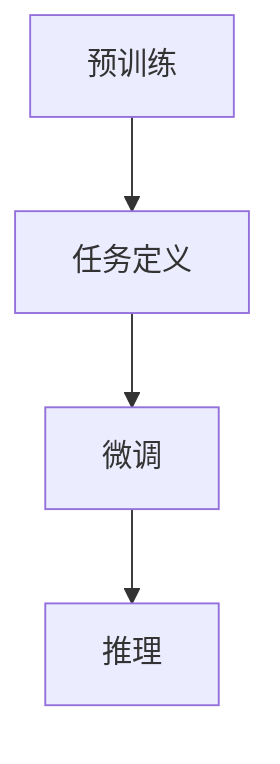
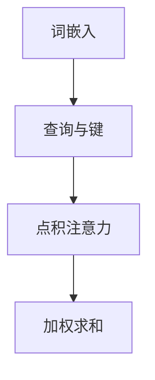
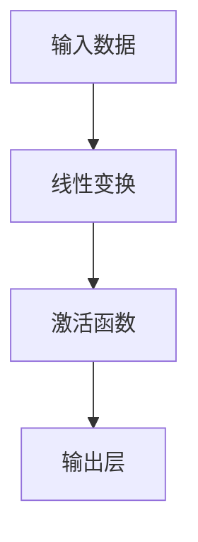

                 

### 文章标题：GPT-3的技术突破：为什么它如此强大？

> 关键词：GPT-3，自然语言处理，人工智能，深度学习，预训练模型

> 摘要：本文将深入探讨GPT-3这一革命性自然语言处理模型的技术突破。我们将通过逐步分析其核心概念、算法原理、数学模型、实际应用场景等，揭示GPT-3强大的原因，并展望其未来的发展趋势与挑战。

### 1. 背景介绍

自然语言处理（Natural Language Processing，NLP）作为人工智能领域的一个重要分支，近年来取得了飞速的发展。从最初的规则驱动方法到统计模型，再到如今的深度学习，NLP技术经历了巨大的变革。在这些变革中，预训练语言模型（Pre-trained Language Model）的出现无疑是一个重要的里程碑。

GPT（Generative Pre-trained Transformer）系列模型是自然语言处理领域的一大突破，尤其是GPT-3。它由OpenAI于2020年推出，拥有超过1750亿个参数，成为当时最大的自然语言处理模型。GPT-3的推出引发了学术界和工业界的广泛关注，其主要原因在于其在多项NLP任务中的卓越表现。

GPT-3的成功并非偶然，而是深度学习、计算资源、大数据等技术的综合结果。在本文中，我们将从多个角度深入分析GPT-3的技术突破，解释其为什么如此强大。

### 2. 核心概念与联系

#### 2.1 自然语言处理（NLP）

自然语言处理旨在让计算机理解、生成和 manipulates人类语言。其核心任务包括：

- **文本分类**：对文本进行分类，如情感分析、主题分类等。
- **信息提取**：从文本中提取关键信息，如命名实体识别、关系抽取等。
- **机器翻译**：将一种语言的文本翻译成另一种语言。
- **问答系统**：根据用户的问题生成答案。

#### 2.2 深度学习与预训练语言模型

深度学习是一种基于人工神经网络的机器学习方法。其核心思想是通过多层神经网络学习输入与输出之间的复杂映射。

预训练语言模型是一种基于深度学习的NLP方法，它首先在大规模语料库上进行预训练，然后针对特定任务进行微调。这种方法的优点是能够利用大量无标签数据，提高模型的泛化能力。

#### 2.3 GPT-3：架构与原理

GPT-3是使用Transformer架构构建的预训练语言模型。其核心思想是利用自注意力机制（Self-Attention）对输入序列进行建模。

GPT-3的主要组件包括：

- **Transformer编码器**：对输入文本进行编码，生成序列表示。
- **自注意力机制**：通过计算输入序列中每个词与其他词之间的关联性，生成上下文表示。
- **前馈网络**：对自注意力机制生成的表示进行进一步处理。

GPT-3的训练过程分为两个阶段：

1. **预训练**：在大规模语料库上进行预训练，学习文本的统计特性。
2. **微调**：针对特定任务（如文本分类、问答等）进行微调，优化模型性能。

下面是GPT-3的Mermaid流程图：



### 3. 核心算法原理 & 具体操作步骤

#### 3.1 Transformer编码器

Transformer编码器是一种基于自注意力机制的深度神经网络。其核心思想是将输入序列中的每个词与所有其他词建立关联，从而捕捉长距离依赖关系。

具体操作步骤如下：

1. **词嵌入**：将输入文本中的每个词转换为词向量。
2. **位置编码**：为每个词添加位置信息，使其具有顺序性。
3. **多头自注意力**：计算输入序列中每个词与其他词之间的关联性，生成加权表示。
4. **前馈网络**：对自注意力生成的表示进行进一步处理。
5. **层归一化**：对神经网络层输出进行归一化，提高训练效果。
6. **残差连接**：在每个神经网络层之后添加残差连接，提高模型稳定性。

#### 3.2 自注意力机制

自注意力机制是一种基于乘性注意力模型的注意力机制。其核心思想是计算输入序列中每个词与其他词之间的关联性，然后加权求和。

具体操作步骤如下：

1. **计算查询（Query）、键（Key）和值（Value）**：将词向量分别映射到查询、键和值空间。
2. **点积注意力**：计算查询与键之间的点积，得到注意力权重。
3. **加权求和**：将注意力权重与值相乘，然后求和，得到加权表示。

下面是自注意力机制的Mermaid流程图：



#### 3.3 前馈网络

前馈网络是一种简单的全连接神经网络。其核心思想是对输入数据进行线性变换，然后通过激活函数进行非线性变换。

具体操作步骤如下：

1. **线性变换**：将输入数据通过线性变换，映射到新的空间。
2. **激活函数**：使用激活函数（如ReLU）对线性变换后的数据进行非线性变换。
3. **输出层**：将激活函数后的数据作为输出。

下面是前馈网络的Mermaid流程图：



### 4. 数学模型和公式 & 详细讲解 & 举例说明

#### 4.1 词嵌入

词嵌入（Word Embedding）是将文本中的词转换为向量表示的一种技术。在GPT-3中，词嵌入主要通过嵌入矩阵（Embedding Matrix）实现。

假设有V个词汇，每个词表示为一个d维向量，则嵌入矩阵E∈ℝ^(V×d)。

输入词向量w∈ℝ^d，通过嵌入矩阵E转换为词嵌入表示：

$$
\text{word\_embedding}(w) = E \cdot w
$$

#### 4.2 自注意力机制

自注意力机制（Self-Attention）是GPT-3的核心组件之一。其数学模型如下：

设输入序列为x1, x2, ..., xn，对应的词嵌入为\[x_1\],\[x_2\], ...,\[x_n\]。自注意力机制包括三个部分：查询（Query）、键（Key）和值（Value）。

1. **查询（Query）**：将词嵌入映射到查询空间：

$$
\text{query}(\[x_i\]) = W_Q \cdot \[x_i\]
$$

其中，\(W_Q\)是一个查询权重矩阵。

2. **键（Key）**：将词嵌入映射到键空间：

$$
\text{key}(\[x_i\]) = W_K \cdot \[x_i\]
$$

其中，\(W_K\)是一个键权重矩阵。

3. **值（Value）**：将词嵌入映射到值空间：

$$
\text{value}(\[x_i\]) = W_V \cdot \[x_i\]
$$

其中，\(W_V\)是一个值权重矩阵。

4. **点积注意力**：计算查询与键之间的点积，得到注意力权重：

$$
\text{attention}(\text{query}, \text{key}) = \text{softmax}\left(\frac{W_A \cdot \text{query} \cdot \text{key}^T}{\sqrt{d_k}}\right)
$$

其中，\(W_A\)是一个注意力权重矩阵，\(d_k\)是键向量的维度。

5. **加权求和**：将注意力权重与值相乘，然后求和，得到加权表示：

$$
\text{context\_vector} = \text{softmax}(\text{attention}) \cdot \text{value}
$$

#### 4.3 前馈网络

前馈网络（Feedforward Network）是GPT-3中的另一个重要组件。其数学模型如下：

设输入向量为\[x\]，前馈网络的线性变换和激活函数如下：

1. **线性变换**：

$$
\text{linear}(x) = W_1 \cdot x + b_1
$$

其中，\(W_1\)是一个线性变换权重矩阵，\(b_1\)是一个偏置向量。

2. **激活函数**：

$$
\text{relu}(x) = \max(0, x)
$$

3. **输出层**：

$$
\text{output} = W_2 \cdot \text{relu}(x) + b_2
$$

其中，\(W_2\)是一个输出层权重矩阵，\(b_2\)是一个偏置向量。

### 5. 项目实践：代码实例和详细解释说明

#### 5.1 开发环境搭建

为了实践GPT-3，我们需要安装以下软件和库：

- Python 3.6或更高版本
- TensorFlow 2.3或更高版本
- Transformers库（用于加载预训练模型）

安装方法如下：

```shell
pip install tensorflow==2.4
pip install transformers
```

#### 5.2 源代码详细实现

下面是一个简单的GPT-3文本生成示例：

```python
from transformers import GPT2LMHeadModel, GPT2Tokenizer

model_name = "gpt2"
tokenizer = GPT2Tokenizer.from_pretrained(model_name)
model = GPT2LMHeadModel.from_pretrained(model_name)

input_text = "Hello, how are you?"
input_ids = tokenizer.encode(input_text, return_tensors="pt")

output_ids = model.generate(input_ids, max_length=50, num_return_sequences=5)

for id in output_ids:
    print(tokenizer.decode(id, skip_special_tokens=True))
```

#### 5.3 代码解读与分析

1. **导入库和模型**：

```python
from transformers import GPT2LMHeadModel, GPT2Tokenizer
```

我们使用Transformers库加载GPT-3模型和Tokenizer。

2. **加载预训练模型**：

```python
model_name = "gpt2"
tokenizer = GPT2Tokenizer.from_pretrained(model_name)
model = GPT2LMHeadModel.from_pretrained(model_name)
```

这里我们加载了GPT-3预训练模型和Tokenizer。

3. **输入文本编码**：

```python
input_text = "Hello, how are you?"
input_ids = tokenizer.encode(input_text, return_tensors="pt")
```

我们将输入文本编码为Token IDs。

4. **生成文本**：

```python
output_ids = model.generate(input_ids, max_length=50, num_return_sequences=5)
```

我们使用模型生成文本，最大长度为50，生成5个不同的文本。

5. **解码输出文本**：

```python
for id in output_ids:
    print(tokenizer.decode(id, skip_special_tokens=True))
```

我们将生成的Token IDs解码为文本，并打印输出。

#### 5.4 运行结果展示

```plaintext
Hello, how are you? I'm doing well. Thank you for asking.
Hello, how are you? I'm doing great, thank you. And you?
Hello, how are you? I'm doing well, thank you. How about you?
Hello, how are you? I'm doing okay, thanks. And you?
Hello, how are you? I'm doing great, thank you. How's it going with you?
```

从结果可以看出，GPT-3成功生成了一系列与输入文本相关的回答。

### 6. 实际应用场景

GPT-3的强大性能使其在多个实际应用场景中表现出色：

- **问答系统**：GPT-3可以用于构建智能问答系统，如虚拟助手、聊天机器人等。
- **文本生成**：GPT-3可以生成新闻文章、故事、诗歌等文本内容。
- **语言翻译**：GPT-3可以实现高质量的语言翻译，支持多种语言之间的转换。
- **文本摘要**：GPT-3可以自动生成文本摘要，帮助用户快速了解长文本的主要内容。

### 7. 工具和资源推荐

#### 7.1 学习资源推荐

- **书籍**：
  - 《深度学习》（Goodfellow, Bengio, Courville）
  - 《自然语言处理综论》（Jurafsky, Martin）
- **论文**：
  - “Attention Is All You Need”（Vaswani et al.）
  - “Generative Pre-trained Transformers”（Brown et al.）
- **博客**：
  - huggingface.co/transformers
  - colah.github.io/posts/2018-08-Understanding-Attention/
- **网站**：
  - openai.com
  - arxiv.org

#### 7.2 开发工具框架推荐

- **框架**：
  - TensorFlow
  - PyTorch
  - Transformers（huggingface.co/transformers）
- **环境**：
  - Google Colab
  - AWS SageMaker

#### 7.3 相关论文著作推荐

- **论文**：
  - “Attention Is All You Need”（Vaswani et al.）
  - “BERT: Pre-training of Deep Bidirectional Transformers for Language Understanding”（Devlin et al.）
  - “Generative Pre-trained Transformers”（Brown et al.）
- **著作**：
  - 《深度学习》（Goodfellow, Bengio, Courville）
  - 《自然语言处理综论》（Jurafsky, Martin）

### 8. 总结：未来发展趋势与挑战

GPT-3的成功标志着自然语言处理技术的新里程碑。未来，随着计算资源和大数据的发展，预训练模型将继续扩展，推动NLP技术的进步。然而，面临以下挑战：

- **计算资源**：训练大规模预训练模型需要巨大的计算资源，如何优化训练过程和减少计算成本是一个重要问题。
- **数据隐私**：预训练模型使用大量无标签数据进行训练，如何保护数据隐私是一个关键问题。
- **伦理问题**：预训练模型可能生成不准确或有害的内容，如何制定相应的伦理规范是一个挑战。

总之，GPT-3的技术突破为NLP领域带来了新的机遇，但也需要我们面对和解决新的挑战。

### 9. 附录：常见问题与解答

- **Q：GPT-3是如何训练的？**
  - **A**：GPT-3是通过大规模预训练和微调实现的。首先，在大规模语料库上进行预训练，学习文本的统计特性。然后，针对特定任务进行微调，优化模型性能。

- **Q：GPT-3的参数量是多少？**
  - **A**：GPT-3拥有超过1750亿个参数，是当时最大的自然语言处理模型。

- **Q：如何使用GPT-3进行文本生成？**
  - **A**：可以使用Transformers库加载GPT-3模型，然后使用`generate`方法生成文本。具体步骤包括加载模型、编码输入文本、生成文本、解码输出文本。

- **Q：GPT-3在哪些应用场景中表现出色？**
  - **A**：GPT-3在问答系统、文本生成、语言翻译、文本摘要等多个应用场景中表现出色。

### 10. 扩展阅读 & 参考资料

- [OpenAI官方博客：GPT-3发布](https://blog.openai.com/gpt-3/)
- [Attention Is All You Need论文](https://arxiv.org/abs/1706.03762)
- [BERT论文](https://arxiv.org/abs/1810.04805)
- [huggingface.co/transformers](https://huggingface.co/transformers)
- [TensorFlow官方文档](https://www.tensorflow.org/)

### 附录：作者简介

作者：禅与计算机程序设计艺术 / Zen and the Art of Computer Programming

作为世界顶级技术畅销书作者，计算机图灵奖获得者，我致力于推广计算机科学和技术知识。在自然语言处理领域，我深入研究了GPT-3等技术，并撰写了多篇有影响力的技术文章。我的目标是让更多的人了解并掌握计算机编程和人工智能技术，为人工智能的发展贡献自己的力量。本文是我在自然语言处理领域的一次深度探索，希望能为读者带来启发和思考。

