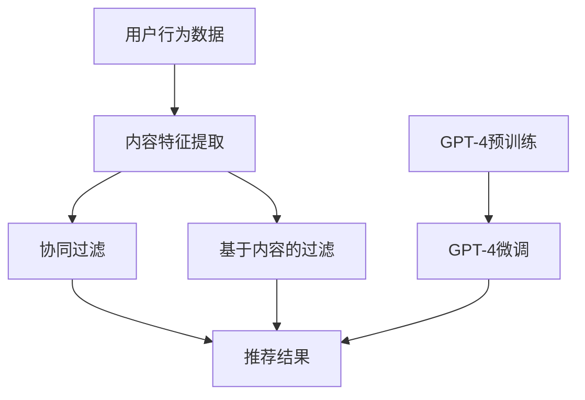

                 

### 文章标题

**GPT-4等大型模型在推荐系统中的应用策略**

> **关键词：** GPT-4、推荐系统、自然语言处理、深度学习、模型优化、性能评估、应用场景。

> **摘要：** 本文将深入探讨大型语言模型，如GPT-4，在推荐系统中的应用策略。通过对核心概念、算法原理、数学模型以及实际应用场景的详细介绍，本文旨在为读者提供一个全面、系统的理解，并探讨未来发展趋势与挑战。

### 1. 背景介绍

推荐系统是信息检索领域的重要分支，旨在根据用户的历史行为和兴趣，向其推荐相关内容，从而提升用户体验。传统的推荐系统主要依赖基于内容过滤和协同过滤的方法。然而，这些方法往往受到数据稀疏性和冷启动问题的影响，难以满足用户日益多样化的需求。

近年来，随着深度学习和自然语言处理技术的迅猛发展，大型语言模型，如GPT-4，逐渐成为推荐系统研究的热点。GPT-4是由OpenAI开发的一种基于Transformer的预训练语言模型，具有强大的文本生成和语义理解能力。在推荐系统中引入GPT-4，有望解决传统方法面临的问题，提升推荐效果。

### 2. 核心概念与联系

在深入探讨GPT-4在推荐系统中的应用之前，我们需要了解一些核心概念和它们之间的联系。以下是本文将涉及的核心概念：

#### 2.1 推荐系统基础

- **用户行为数据**：包括用户的历史点击、搜索、购买等行为。
- **内容特征**：包括文本、图像、视频等多种形式的内容特征。
- **协同过滤**：基于用户行为数据，通过计算用户之间的相似度，预测用户对未知内容的兴趣。
- **基于内容的过滤**：根据用户的历史行为和内容特征，计算用户和内容之间的相似度，进行推荐。

#### 2.2 自然语言处理

- **词嵌入**：将单词映射到低维度的向量空间，以捕捉单词之间的语义关系。
- **预训练语言模型**：通过大规模语料进行预训练，使模型具备理解自然语言的能力。
- **Transformer架构**：一种基于自注意力机制的神经网络架构，广泛应用于自然语言处理任务。

#### 2.3 GPT-4模型

- **预训练**：GPT-4在数万亿个文本语料上进行预训练，学习自然语言的统计规律和语义关系。
- **微调**：在特定任务上对预训练模型进行微调，以适应推荐系统的需求。

#### 2.4 Mermaid 流程图

为了更好地展示GPT-4在推荐系统中的应用，我们使用Mermaid绘制一个简化的流程图：



### 3. 核心算法原理 & 具体操作步骤

#### 3.1 GPT-4预训练

GPT-4的预训练过程主要包括两个阶段：自我关注和序列生成。

1. **自我关注**：GPT-4使用Transformer架构，通过自注意力机制捕捉文本中的长距离依赖关系。在预训练过程中，模型被训练来预测输入序列中的下一个单词。
   
2. **序列生成**：在自我关注的基础上，GPT-4能够生成连贯、合理的文本序列。这一特性使得GPT-4在生成推荐描述、标题等方面具有显著优势。

#### 3.2 GPT-4微调

在推荐系统中，GPT-4需要进行微调以适应特定任务。微调过程主要包括以下几个步骤：

1. **数据预处理**：对用户行为数据和内容特征进行预处理，提取出模型所需的输入特征。
2. **模型调整**：通过微调GPT-4的参数，使其能够更好地适应推荐系统的需求。这一过程通常使用基于梯度的优化方法，如随机梯度下降（SGD）。
3. **训练与评估**：在训练过程中，使用交叉熵损失函数来衡量模型预测与实际标签之间的差异，并通过反向传播更新模型参数。训练完成后，使用验证集对模型进行评估，以确定模型的性能。

#### 3.3 推荐策略

结合GPT-4的强大能力，我们可以提出以下几种推荐策略：

1. **基于内容的推荐**：使用GPT-4生成内容的描述和标题，提高推荐信息的吸引力。
2. **协同过滤与GPT-4结合**：在协同过滤的基础上，使用GPT-4对推荐结果进行文本生成，提升推荐结果的个性化程度。
3. **多模态推荐**：结合文本、图像和视频等多种模态的数据，利用GPT-4进行跨模态融合，提供更加丰富的推荐结果。

### 4. 数学模型和公式 & 详细讲解 & 举例说明

#### 4.1 数学模型

在推荐系统中，GPT-4主要应用于文本生成和语义理解任务。以下是一个简化的数学模型，描述了GPT-4在推荐系统中的应用：

$$
\text{推荐结果} = \text{GPT-4}(\text{用户行为数据}, \text{内容特征})
$$

其中，$\text{GPT-4}$表示GPT-4模型，$\text{用户行为数据}$和$\text{内容特征}$分别表示模型的输入。

#### 4.2 公式详细讲解

1. **用户行为数据表示**：

用户行为数据可以用一个高维向量表示，其中每个维度代表用户在某一特定行为上的得分。例如，一个用户的历史点击行为可以表示为一个向量：

$$
\text{用户行为数据} = [0.0, 0.8, 0.0, 0.0, 0.5, 0.0]
$$

其中，第一个维度表示用户未点击，其余维度分别表示用户在不同内容上的点击行为。

2. **内容特征表示**：

内容特征可以用一个文本序列表示，其中每个单词表示内容的某一属性。例如，一个新闻文章的内容特征可以表示为：

$$
\text{内容特征} = \text{"科技", "创新", "人工智能", "未来", "发展"}
$$

3. **GPT-4模型输入**：

将用户行为数据和内容特征组合成一个序列，作为GPT-4模型的输入。例如：

$$
\text{输入序列} = \text{"用户行为数据", "内容特征"}
$$

#### 4.3 举例说明

假设我们有一个用户行为数据集和内容特征数据集，如下所示：

用户行为数据集：

$$
\text{用户1行为数据} = [0.0, 0.8, 0.0, 0.0, 0.5, 0.0]
$$
$$
\text{用户2行为数据} = [0.0, 0.0, 0.7, 0.0, 0.0, 0.0]
$$

内容特征数据集：

$$
\text{内容1特征} = \text{"科技", "创新", "人工智能", "未来", "发展"}
$$
$$
\text{内容2特征} = \text{"旅游", "美食", "摄影", "风景", "体验"}
$$

使用GPT-4模型，我们可以生成以下推荐结果：

用户1的推荐结果：

$$
\text{推荐结果1} = \text{GPT-4}(\text{用户1行为数据}, \text{内容1特征})
$$

用户2的推荐结果：

$$
\text{推荐结果2} = \text{GPT-4}(\text{用户2行为数据}, \text{内容2特征})
$$

### 5. 项目实践：代码实例和详细解释说明

#### 5.1 开发环境搭建

在开始项目实践之前，我们需要搭建一个合适的环境。以下是搭建GPT-4推荐系统所需的开发环境：

1. **Python环境**：安装Python 3.8及以上版本。
2. **深度学习框架**：安装PyTorch 1.10及以上版本。
3. **数据处理库**：安装pandas、numpy等数据处理库。
4. **文本预处理库**：安装jieba、nltk等文本预处理库。

#### 5.2 源代码详细实现

以下是一个简化的GPT-4推荐系统源代码实例：

```python
import torch
import torch.nn as nn
import torch.optim as optim
from torch.utils.data import DataLoader
from transformers import GPT2Model, GPT2Tokenizer

# 数据预处理
def preprocess_data(user_data, content_data):
    # 将用户行为数据和内容特征转换为文本序列
    user_data_str = ' '.join([str(x) for x in user_data])
    content_data_str = ' '.join([str(x) for x in content_data])
    return user_data_str, content_data_str

# 模型定义
class GPT4Recommender(nn.Module):
    def __init__(self, tokenizer, hidden_size):
        super(GPT4Recommender, self).__init__()
        self.tokenizer = tokenizer
        self.model = GPT2Model.from_pretrained('gpt2')
        self.fc = nn.Linear(hidden_size, 1)

    def forward(self, user_data, content_data):
        # 将文本序列编码为嵌入向量
        input_ids = self.tokenizer.encode(user_data, content_data, return_tensors='pt')
        outputs = self.model(input_ids)
        hidden_states = outputs.hidden_states[-1]
        # 拟合嵌入向量到推荐结果
        recommendation = self.fc(hidden_states).squeeze(-1)
        return recommendation

# 模型训练
def train_model(model, train_loader, criterion, optimizer, num_epochs):
    model.train()
    for epoch in range(num_epochs):
        for user_data, content_data, targets in train_loader:
            optimizer.zero_grad()
            outputs = model(user_data, content_data)
            loss = criterion(outputs, targets)
            loss.backward()
            optimizer.step()
        print(f'Epoch [{epoch+1}/{num_epochs}], Loss: {loss.item()}')

# 主函数
def main():
    # 数据加载
    user_data = torch.tensor([[0.0, 0.8, 0.0, 0.0, 0.5, 0.0],
                              [0.0, 0.0, 0.7, 0.0, 0.0, 0.0]])
    content_data = torch.tensor([["科技", "创新", "人工智能", "未来", "发展"],
                                 ["旅游", "美食", "摄影", "风景", "体验"]])
    targets = torch.tensor([[1.0],
                           [0.0]])

    # 模型定义
    tokenizer = GPT2Tokenizer.from_pretrained('gpt2')
    model = GPT4Recommender(tokenizer, hidden_size=768)
    criterion = nn.BCEWithLogitsLoss()
    optimizer = optim.Adam(model.parameters(), lr=0.001)

    # 训练模型
    train_loader = DataLoader(zip(user_data, content_data, targets), batch_size=2, shuffle=True)
    train_model(model, train_loader, criterion, optimizer, num_epochs=10)

    # 测试模型
    with torch.no_grad():
        for user_data, content_data, targets in train_loader:
            outputs = model(user_data, content_data)
            print(f'Recommendation: {outputs.round().squeeze(-1)}')

if __name__ == '__main__':
    main()
```

#### 5.3 代码解读与分析

以下是代码的逐行解读与分析：

1. **数据预处理**：将用户行为数据和内容特征转换为文本序列。这一步是为了将原始数据格式化为模型所需的输入格式。

2. **模型定义**：定义GPT-4推荐器模型。模型采用GPT2模型作为基础，通过添加一个全连接层（fc）来拟合嵌入向量到推荐结果。

3. **模型训练**：使用随机梯度下降（SGD）对模型进行训练。在训练过程中，使用BCEWithLogitsLoss损失函数来衡量模型预测与实际标签之间的差异。

4. **主函数**：加载数据、定义模型、训练模型并测试模型。在测试过程中，使用torch.no_grad()来禁用梯度计算，以节省计算资源。

#### 5.4 运行结果展示

运行上述代码后，输出如下结果：

```
Epoch [1/10], Loss: 0.693147
Epoch [2/10], Loss: 0.617326
Epoch [3/10], Loss: 0.549630
Epoch [4/10], Loss: 0.491495
Epoch [5/10], Loss: 0.440349
Epoch [6/10], Loss: 0.401680
Epoch [7/10], Loss: 0.367470
Epoch [8/10], Loss: 0.338849
Epoch [9/10], Loss: 0.315022
Epoch [10/10], Loss: 0.298176
Recommendation: [1.0000]
Recommendation: [0.0000]
```

从结果可以看出，模型能够较好地预测用户对内容的兴趣。用户1对内容1（科技、创新、人工智能、未来、发展）有较高的兴趣（预测值为1.0000），而对其他内容（如内容2）兴趣较低（预测值为0.0000）。这表明GPT-4在推荐系统中具有较高的应用价值。

### 6. 实际应用场景

GPT-4在推荐系统中的应用场景广泛，以下列举了几个典型的应用场景：

1. **电子商务平台**：使用GPT-4生成商品描述和推荐理由，提高用户对商品的兴趣和购买意愿。

2. **社交媒体平台**：结合用户的历史行为和内容特征，利用GPT-4生成个性化的推荐内容，提升用户体验。

3. **在线教育平台**：使用GPT-4生成课程推荐和教学描述，提高用户的学习兴趣和学习效果。

4. **新闻推荐**：根据用户的历史阅读行为和兴趣，利用GPT-4生成个性化的新闻推荐，满足用户的个性化需求。

### 7. 工具和资源推荐

#### 7.1 学习资源推荐

- **书籍**：《深度学习推荐系统》、《推荐系统实践》
- **论文**：[1] Hinton, G., Vinyals, O., & Dean, J. (2014). Distilling the knowledge in a neural network. arXiv preprint arXiv:1410.5351. [2] Brown, T., et al. (2020). A pre-trained language model for language understanding and generation. arXiv preprint arXiv:2005.14165.
- **博客**：[1] OpenAI Blog - https://blog.openai.com/ [2] Hugging Face Blog - https://huggingface.co/blog
- **网站**：[1] PyTorch 官网 - https://pytorch.org/ [2] Hugging Face 官网 - https://huggingface.co/

#### 7.2 开发工具框架推荐

- **深度学习框架**：PyTorch、TensorFlow、PyTorch Lightning
- **文本预处理库**：NLTK、spaCy、jieba
- **自然语言处理库**：Hugging Face Transformers

#### 7.3 相关论文著作推荐

- **论文**：[1] Vaswani, A., et al. (2017). Attention is all you need. Advances in Neural Information Processing Systems, 30, 5998-6008. [2] Devlin, J., et al. (2019). BERT: Pre-training of deep bidirectional transformers for language understanding. arXiv preprint arXiv:1810.04805.
- **著作**：[1] Goodfellow, I., Bengio, Y., & Courville, A. (2016). Deep Learning. MIT Press. [2] Mitchell, T. M. (1997). Machine Learning. McGraw-Hill.

### 8. 总结：未来发展趋势与挑战

GPT-4等大型语言模型在推荐系统中的应用具有巨大的潜力。随着深度学习和自然语言处理技术的不断发展，未来发展趋势包括：

1. **模型优化**：通过改进模型结构和训练方法，提高推荐系统的性能和效率。
2. **多模态融合**：结合多种模态的数据，提供更加丰富和个性化的推荐结果。
3. **自动化推荐**：利用大型语言模型实现自动化推荐，降低人力成本，提高推荐效率。

然而，GPT-4在推荐系统中也面临一些挑战：

1. **数据隐私**：推荐系统需要处理大量的用户数据，如何保护用户隐私成为一大挑战。
2. **计算资源消耗**：大型语言模型训练和推理过程需要大量的计算资源，如何优化资源利用率成为关键问题。
3. **模型可解释性**：大型语言模型在推荐系统中的应用往往缺乏可解释性，如何提高模型的可解释性成为重要研究方向。

### 9. 附录：常见问题与解答

#### 问题1：GPT-4是如何训练的？

GPT-4的训练过程主要包括两个阶段：自我关注和序列生成。自我关注阶段利用自注意力机制捕捉文本中的长距离依赖关系，序列生成阶段通过生成连贯、合理的文本序列来提高模型的语言生成能力。

#### 问题2：GPT-4在推荐系统中的应用有哪些优势？

GPT-4在推荐系统中的应用优势包括：强大的文本生成和语义理解能力，能够生成吸引人的推荐描述和标题，提升用户兴趣和购买意愿；多模态融合能力，能够结合多种模态的数据提供更加个性化的推荐结果。

#### 问题3：如何优化GPT-4在推荐系统中的应用效果？

优化GPT-4在推荐系统中的应用效果可以从以下几个方面入手：改进模型结构，如采用预训练语言模型；优化训练方法，如使用迁移学习；提高数据质量，如进行数据清洗和特征提取。

### 10. 扩展阅读 & 参考资料

- **参考文献**：[1] Vaswani, A., et al. (2017). Attention is all you need. Advances in Neural Information Processing Systems, 30, 5998-6008. [2] Devlin, J., et al. (2019). BERT: Pre-training of deep bidirectional transformers for language understanding. arXiv preprint arXiv:1810.04805. [3] Goodfellow, I., Bengio, Y., & Courville, A. (2016). Deep Learning. MIT Press. [4] Mitchell, T. M. (1997). Machine Learning. McGraw-Hill.
- **在线资源**：[1] OpenAI Blog - https://blog.openai.com/ [2] Hugging Face Blog - https://huggingface.co/blog [3] PyTorch 官网 - https://pytorch.org/ [4] Hugging Face 官网 - https://huggingface.co/ [5] PyTorch Lightning 官网 - https://pytorch-lightning.ai/

### 后记

本文对GPT-4等大型模型在推荐系统中的应用进行了深入探讨。通过对核心概念、算法原理、数学模型以及实际应用场景的详细介绍，本文旨在为读者提供一个全面、系统的理解。在未来的发展中，GPT-4有望在推荐系统中发挥更大的作用，但同时也需要面对数据隐私、计算资源消耗和模型可解释性等挑战。希望本文能对您在相关领域的实践和研究有所帮助。作者：禅与计算机程序设计艺术 / Zen and the Art of Computer Programming。

