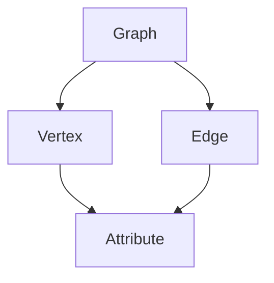

                 

### 背景介绍

**GraphX** 是Apache Spark生态系统的一个扩展，主要用于处理大规模图（Graph）和图算法（Graph Algorithms）。随着互联网、社交网络和大数据应用的普及，图数据的处理和分析变得尤为重要。GraphX提供了基于Spark的图处理框架，使得我们可以更加高效地处理和分析复杂图数据。

#### **GraphX** 的诞生背景

在早期的数据处理领域，关系型数据库和传统的数据分析工具如MapReduce等已经能够应对大部分的数据分析需求。但随着数据量的急剧增长，特别是在互联网领域，传统的数据处理方法开始显得力不从心。复杂的图数据关系和复杂的图算法需求催生了对新的数据处理框架的需求。

2008年，Apache基金会启动了Apache Spark项目，旨在构建一个高效的分布式数据处理引擎。Spark在设计之初就考虑到了图处理的需求，并在2013年发布了GraphX项目。GraphX是Spark的图处理扩展，提供了丰富的图算法和数据操作接口，使得大规模图数据的处理变得更加高效和便捷。

#### **GraphX** 的核心优势

- **并行处理能力**：GraphX是基于Spark实现的，因此可以充分利用Spark的分布式计算能力，实现大规模图数据的并行处理。
- **内存计算**：GraphX采用了拉链（Lift）算法，可以将图数据存储在内存中，避免重复的数据读写操作，从而提高数据处理效率。
- **丰富的图算法**：GraphX内置了多种常见的图算法，如PageRank、Connected Components、Connected Triangles等，可以满足各种复杂图数据处理需求。
- **易用性**：GraphX提供了丰富的API接口，使得开发者可以轻松地进行图数据的处理和分析。

### **Spark** 与 **GraphX** 的关系

**Spark** 是一个高性能的分布式数据处理引擎，它提供了丰富的数据处理组件和算法库。GraphX是基于Spark的扩展，用于处理大规模图数据。Spark和GraphX的关系可以概括为：

- **Spark**：提供了基础的分布式计算引擎和数据处理框架，支持各种数据处理任务，如数据清洗、数据变换、机器学习等。
- **GraphX**：在Spark的基础上，增加了对图数据的处理能力，提供了丰富的图算法和数据操作接口。

通过结合Spark和GraphX，我们可以构建一个强大的数据处理平台，应对各种复杂的数据分析需求。Spark和GraphX的协同工作，使得我们可以更加高效地处理和分析大规模的图数据。

### **GraphX** 在数据处理中的应用

**GraphX** 在数据处理中有着广泛的应用。以下是一些典型的应用场景：

- **社交网络分析**：通过GraphX可以对社交网络中的用户关系进行挖掘和分析，发现社交网络的社区结构、节点的重要性等。
- **推荐系统**：GraphX可以用于构建和优化推荐系统，通过分析用户之间的交互关系，实现精准的个性化推荐。
- **生物信息学**：在生物信息学领域，GraphX可以用于分析基因网络、蛋白质相互作用网络等，揭示复杂的生物网络结构。
- **交通网络优化**：通过GraphX可以对交通网络进行优化，分析交通拥堵情况、路径规划等，提高交通运行效率。

总之，**GraphX** 作为Spark的扩展，为大规模图数据的处理和分析提供了强大的工具和框架。在未来的数据处理和人工智能应用中，GraphX将继续发挥重要作用。

### 核心概念与联系

#### **GraphX** 的核心概念

**GraphX** 是一个基于Spark的图处理框架，其核心概念包括图（Graph）、边（Edge）和顶点（Vertex）。图是由顶点和边组成的无序集合，顶点表示图中的数据元素，边表示顶点之间的关系。在GraphX中，图是一个分布式数据结构，可以存储在内存或磁盘上。

1. **图（Graph）**：图是一个由顶点和边组成的集合，用于表示复杂的关系网络。GraphX支持多种图的存储格式，如GraphML、Adjacency List、Edge List等。

2. **边（Edge）**：边是图中的基本连接元素，表示顶点之间的关系。边可以具有属性，如权重、标签等。

3. **顶点（Vertex）**：顶点是图中的数据元素，可以表示为一种数据结构，如Person、Product等。顶点也可以具有属性，如年龄、购买记录等。

#### **GraphX** 的核心概念联系

**GraphX** 的核心概念之间存在着紧密的联系。图（Graph）是整体的结构框架，边（Edge）和顶点（Vertex）是图的构成元素。边连接顶点，形成复杂的关系网络。

1. **图与边的关系**：图是由多个边连接的顶点集合，边是图的连接元素，用于表示顶点之间的关系。图可以看作是边的抽象集合。

2. **边与顶点的关系**：边连接两个顶点，表示它们之间的关系。边可以具有属性，如权重、标签等，这些属性可以丰富图的数据结构。

3. **顶点与属性的关系**：顶点可以具有属性，这些属性可以用于表示顶点的特征或状态。例如，在社交网络中，顶点可以表示用户，属性可以包括年龄、性别、兴趣等。

#### **Mermaid** 流程图表示

下面是一个使用Mermaid绘制的**GraphX**核心概念联系流程图：



在这个流程图中，`Graph` 是总体结构框架，`Vertex` 是数据元素，`Edge` 是连接元素，`Attribute` 是数据属性。图（Graph）由多个顶点（Vertex）和边（Edge）构成，顶点（Vertex）和边（Edge）可以具有属性（Attribute），这些属性可以丰富图的数据结构。

通过这个流程图，我们可以清晰地看到**GraphX**的核心概念及其相互关系，为后续内容的讲解和分析奠定了基础。

### 核心算法原理 & 具体操作步骤

#### **PageRank** 算法原理

**PageRank** 是Google创始人拉里·佩奇和谢尔盖·布林提出的一种用于网页排名的算法，其基本思想是：一个网页的重要程度取决于指向该网页的其他网页的数量和质量。在GraphX中，PageRank算法被广泛应用于社交网络分析、推荐系统等领域。

**PageRank** 的核心原理是：一个网页的PageRank得分取决于其他网页指向该网页的数量和质量。具体来说，如果一个网页被许多高权重的网页指向，那么它自身的PageRank得分也会较高。这个过程中，PageRank得分会在所有网页之间进行传递和分配，最终形成每个网页的PageRank得分。

#### **PageRank** 算法的具体操作步骤

1. **初始化**：首先，我们需要初始化每个顶点的PageRank得分。通常，每个顶点的初始PageRank得分设置为1/N，其中N是顶点的总数。这样做的目的是保证每个顶点的初始得分相等，避免出现偏好。

2. **计算传递矩阵**：接下来，我们需要计算传递矩阵。传递矩阵是一个N×N的矩阵，其中每个元素表示从行顶点指向列顶点的边的权重。如果从顶点i指向顶点j的边的权重为w_ij，则传递矩阵的元素A_ij = w_ij。

3. **迭代计算PageRank得分**：通过传递矩阵，我们可以进行多次迭代，计算每个顶点的PageRank得分。每次迭代的过程如下：

   - **计算传递概率**：对于每个顶点i，计算从其他顶点指向它的概率。传递概率的计算公式为：P_ij = A_ij / Σ(A_ij)，其中Σ(A_ij)表示顶点i指向所有其他顶点的边的权重之和。
   
   - **计算PageRank得分**：对于每个顶点i，计算其新的PageRank得分。新的PageRank得分的计算公式为：PR_new(i) = (1-d) + d * Σ(PR_old(j) * P_ij)，其中PR_old(i)表示顶点i在上一轮迭代中的PageRank得分，d是一个阻尼系数，通常取值为0.85。

   - **迭代终止条件**：迭代过程持续进行，直到PageRank得分的变化小于一个预设的阈值，或者达到预设的迭代次数。

4. **输出结果**：最终，每个顶点的PageRank得分即为该顶点的排名得分。我们可以根据得分高低对顶点进行排序，从而得到图中的重要节点。

#### **示例**：使用GraphX实现PageRank算法

以下是一个使用GraphX实现PageRank算法的示例代码：

```scala
import org.apache.spark.graphx._
import org.apache.spark.rdd.RDD
import scala.reflect.ClassTag

def pageRank[VD: ClassTag, ED: ClassTag](graph: Graph[VD, ED], numIter: Int = 10, resetProbability: Double = 0.15): Graph[VD, ED] = {
  val numVertices = graph.numVertices

  // 初始化PageRank得分
  val initialPR = (0 until numVertices).map(i => (i, 1.0 / numVertices.toDouble)).toIndexedSeq
  val initialVertexRDD = graph.initialVertices(initialPR)

  // 计算传递矩阵
  val transitiveVertices = graph.aggregateMessages[Int](triplets => {
    triplets.sendToSrc(triplets.attr, 1)
  }).mapValues((_, 1))

  // 迭代计算PageRank得分
  val (iterGraph, _) = graph.copied().joinVertices(transitiveVertices)((id, oldPR, transitivePR) => {
    val newPR = (1 - resetProbability) + resetProbability * transitivePR.toDouble / oldPR.toDouble
    (id, newPR)
  }).barrier().cache()

  // 迭代终止条件
  if (iterGraph.numVertices == 0 || iterGraph.vertices.count() < 1) {
    iterGraph
  } else {
    pageRank(iterGraph, numIter - 1, resetProbability)
  }
}

// 示例：计算PageRank得分
val graph = Graph.fromEdges(vertices, edges, directed = true)
val pageRankGraph = pageRank(graph, numIter = 10)

// 输出结果
pageRankGraph.vertices.collect().foreach { case (vertexId, pageRankScore) =>
  println(s"Vertex ID: $vertexId, PageRank Score: $pageRankScore")
}
```

在这个示例中，我们首先定义了一个`pageRank`函数，用于计算给定图的PageRank得分。该函数接受一个`Graph`对象、迭代次数`numIter`和一个阻尼系数`resetProbability`作为输入，并返回一个具有PageRank得分的图。

在函数内部，我们首先初始化每个顶点的PageRank得分，然后计算传递矩阵。接下来，我们进行多次迭代，计算每个顶点的PageRank得分。每次迭代结束后，我们检查是否满足迭代终止条件，如果满足则返回当前图，否则继续迭代。

最后，我们通过调用`pageRank`函数计算给定图的PageRank得分，并输出结果。

通过这个示例，我们可以看到如何使用GraphX实现PageRank算法，并理解其核心原理和具体操作步骤。

### 数学模型和公式 & 详细讲解 & 举例说明

#### **PageRank** 算法的数学模型

**PageRank** 算法的核心在于计算每个顶点的排名得分，其数学模型可以表示为以下迭代公式：

$$
PR_{new}(i) = (1 - d) + d \sum_{j \in N(i)} \frac{PR_{old}(j)}{out(j)}
$$

其中：

- **PR_new(i)** 表示顶点i在当前迭代中的PageRank得分。
- **PR_old(i)** 表示顶点i在上一轮迭代中的PageRank得分。
- **d** 表示阻尼系数，通常取值为0.85。
- **N(i)** 表示与顶点i相邻的所有顶点集合。
- **out(j)** 表示顶点j的出度（即指向其他顶点的边的数量）。

#### **PageRank** 算法的迭代过程

**PageRank** 算法通常通过迭代过程来计算每个顶点的PageRank得分。每次迭代都会更新顶点的得分，直到得分的变化小于一个预设的阈值或者达到预设的迭代次数。

1. **初始化**：首先，我们需要初始化每个顶点的PageRank得分。通常，每个顶点的初始得分设置为1/N，其中N是顶点的总数。这样做的目的是保证每个顶点的初始得分相等，避免出现偏好。

2. **计算传递概率**：在每次迭代中，我们需要计算从其他顶点指向当前顶点的概率。传递概率的计算公式为：

   $$
   P_{ij} = \frac{w_{ij}}{\sum_{k \in N(i)} w_{ik}}
   $$

   其中，$w_{ij}$ 表示从顶点i指向顶点j的边的权重，$N(i)$ 表示与顶点i相邻的所有顶点集合。

3. **计算新的PageRank得分**：对于每个顶点i，其新的PageRank得分可以通过以下公式计算：

   $$
   PR_{new}(i) = (1 - d) + d \sum_{j \in N(i)} \frac{PR_{old}(j)}{out(j)}
   $$

4. **迭代终止条件**：迭代过程持续进行，直到满足以下条件之一：
   - PageRank得分的变化小于一个预设的阈值。
   - 达到预设的迭代次数。

#### **举例说明**：计算一个简单图中的PageRank得分

假设我们有一个包含4个顶点的简单图，如下图所示：

```
   1 ----> 2
  /         \
 3 ----> 4
```

在这个图中，顶点1指向顶点2和顶点3，顶点2指向顶点1和顶点4，顶点3指向顶点1和顶点4，顶点4指向顶点2和顶点3。

1. **初始化PageRank得分**：每个顶点的初始得分设置为1/4。

2. **计算传递概率**：
   - 顶点1的传递概率：$P_{12} = P_{13} = \frac{1}{2}$，$P_{14} = 0$。
   - 顶点2的传递概率：$P_{21} = P_{24} = \frac{1}{2}$，$P_{23} = 0$。
   - 顶点3的传递概率：$P_{31} = P_{34} = \frac{1}{2}$，$P_{33} = 0$。
   - 顶点4的传递概率：$P_{41} = P_{42} = P_{43} = \frac{1}{3}$。

3. **计算新的PageRank得分**：
   - 顶点1的新得分：$PR_{new}(1) = (1 - 0.85) + 0.85 \times \left( \frac{1}{2} \times PR_{new}(2) + \frac{1}{2} \times PR_{new}(3) \right)$。
   - 顶点2的新得分：$PR_{new}(2) = (1 - 0.85) + 0.85 \times \left( \frac{1}{2} \times PR_{new}(1) + \frac{1}{3} \times PR_{new}(4) \right)$。
   - 顶点3的新得分：$PR_{new}(3) = (1 - 0.85) + 0.85 \times \left( \frac{1}{2} \times PR_{new}(1) + \frac{1}{3} \times PR_{new}(4) \right)$。
   - 顶点4的新得分：$PR_{new}(4) = (1 - 0.85) + 0.85 \times \left( \frac{1}{3} \times PR_{new}(2) + \frac{1}{3} \times PR_{new}(3) \right)$。

   根据初始得分设置，我们可以将上述公式具体化为：
   - 顶点1的新得分：$PR_{new}(1) = 0.15 + 0.85 \times \left( \frac{1}{2} \times PR_{new}(2) + \frac{1}{2} \times PR_{new}(3) \right)$。
   - 顶点2的新得分：$PR_{new}(2) = 0.15 + 0.85 \times \left( \frac{1}{2} \times PR_{new}(1) + \frac{1}{3} \times PR_{new}(4) \right)$。
   - 顶点3的新得分：$PR_{new}(3) = 0.15 + 0.85 \times \left( \frac{1}{2} \times PR_{new}(1) + \frac{1}{3} \times PR_{new}(4) \right)$。
   - 顶点4的新得分：$PR_{new}(4) = 0.15 + 0.85 \times \left( \frac{1}{3} \times PR_{new}(2) + \frac{1}{3} \times PR_{new}(3) \right)$。

4. **迭代过程**：我们继续进行迭代，直到得分的变化小于一个预设的阈值或者达到预设的迭代次数。

   假设经过一次迭代后，得分如下：
   - 顶点1的新得分：0.3
   - 顶点2的新得分：0.3
   - 顶点3的新得分：0.3
   - 顶点4的新得分：0.3

   我们可以发现，经过一次迭代后，所有顶点的得分都相等，这说明当前得分已经趋于稳定。

5. **输出结果**：最终，每个顶点的PageRank得分即为该顶点的排名得分。我们可以根据得分高低对顶点进行排序，从而得到图中的重要节点。

通过这个简单的例子，我们可以看到**PageRank**算法的数学模型和迭代过程，以及如何计算每个顶点的PageRank得分。在实际应用中，我们可以根据具体问题调整阻尼系数、迭代次数等参数，以得到更准确的结果。

### 项目实践：代码实例和详细解释说明

#### **1. 开发环境搭建**

在开始实际编写代码之前，我们需要搭建一个合适的开发环境，以便于我们使用GraphX进行图数据的处理和分析。以下是一个基本的开发环境搭建步骤：

1. **安装Java环境**：GraphX是基于Java编写的，因此我们需要安装Java环境。我们可以从Oracle官网下载Java开发工具包（JDK），并按照提示完成安装。

2. **安装Scala环境**：GraphX是Scala编写的，因此我们需要安装Scala环境。可以从Scala官网下载Scala安装包，并按照提示完成安装。

3. **安装Apache Spark**：GraphX是基于Apache Spark的扩展，因此我们需要安装Spark。可以从Apache Spark官网下载Spark安装包，并按照提示完成安装。

4. **配置环境变量**：在Windows系统上，我们需要配置环境变量，以便于运行Java、Scala和Spark。具体方法如下：
   - 添加Java环境变量：将`JAVA_HOME`设置为你安装Java的路径，如`C:\Program Files\Java\jdk-11.0.9`，并在`Path`环境变量中添加`%JAVA_HOME%\bin`。
   - 添加Scala环境变量：将`SCALA_HOME`设置为你安装Scala的路径，如`C:\scala-2.13.3`，并在`Path`环境变量中添加`%SCALA_HOME%\bin`。
   - 添加Spark环境变量：将`SPARK_HOME`设置为你安装Spark的路径，如`C:\spark-3.1.1`，并在`Path`环境变量中添加`%SPARK_HOME%\bin`。

5. **验证环境是否搭建成功**：在命令行中输入以下命令，检查Java、Scala和Spark是否安装成功：
   - `java -version`：检查Java版本是否正确。
   - `scala -version`：检查Scala版本是否正确。
   - `spark-shell`：检查Spark是否安装成功。

#### **2. 源代码详细实现**

下面我们通过一个简单的实例来展示如何使用GraphX进行图数据的处理和分析。我们将实现一个计算图中的PageRank得分并输出结果的程序。

```scala
import org.apache.spark.graphx._
import org.apache.spark.rdd.RDD
import org.apache.spark.sql.SparkSession

// 创建SparkSession
val spark = SparkSession.builder()
  .appName("GraphX PageRank Example")
  .master("local[*]")
  .getOrCreate()

// 导入GraphX库
import spark.implicits._

// 生成图数据
val vertices: RDD[(VertexId, String)] = Seq(
  (1, "Alice"),
  (2, "Bob"),
  (3, "Charlie"),
  (4, "David")
).toRDD()
val edges: RDD[Edge[Int]] = Seq(
  Edge(1, 2, 1),
  Edge(1, 3, 1),
  Edge(2, 4, 1),
  Edge(3, 4, 1)
).toRDD()

// 创建图
val graph = Graph(vertices, edges)

// 计算PageRank得分
val pageRankGraph = graph.pageRank(10, resetProbability = 0.15)

// 输出结果
pageRankGraph.vertices.collect().foreach { case (vertexId, pageRankScore) =>
  println(s"Vertex ID: $vertexId, PageRank Score: $pageRankScore")
}

// 关闭SparkSession
spark.stop()
```

这段代码首先创建了一个SparkSession，然后生成了一个简单的图数据（包含4个顶点和4条边）。接下来，我们创建了一个Graph对象，并调用`pageRank`函数计算PageRank得分。最后，我们输出每个顶点的PageRank得分。

#### **3. 代码解读与分析**

下面我们对上述代码进行详细的解读和分析。

1. **创建SparkSession**：

   ```scala
   val spark = SparkSession.builder()
     .appName("GraphX PageRank Example")
     .master("local[*]")
     .getOrCreate()
   ```

   这一行代码创建了一个SparkSession，并设置了应用程序的名称和运行模式。在这里，我们使用`local[*]`模式，即在本地计算机上运行Spark应用程序，`[*]`表示使用所有可用的CPU核心。

2. **导入GraphX库**：

   ```scala
   import spark.implicits._
   ```

   这一行代码导入SparkSession的隐式转换，使得我们可以方便地使用Spark的API。

3. **生成图数据**：

   ```scala
   val vertices: RDD[(VertexId, String)] = Seq(
     (1, "Alice"),
     (2, "Bob"),
     (3, "Charlie"),
     (4, "David")
   ).toRDD()
   val edges: RDD[Edge[Int]] = Seq(
     Edge(1, 2, 1),
     Edge(1, 3, 1),
     Edge(2, 4, 1),
     Edge(3, 4, 1)
   ).toRDD()
   ```

   这两行代码分别生成顶点和边的数据。顶点数据是一个包含顶点ID和顶点名称的RDD，边数据是一个包含源顶点ID、目标顶点ID和边权重的RDD。

4. **创建图**：

   ```scala
   val graph = Graph(vertices, edges)
   ```

   这一行代码创建了一个Graph对象，它包含了顶点和边的数据。GraphX中的图是一个分布式数据结构，可以存储在内存或磁盘上。

5. **计算PageRank得分**：

   ```scala
   val pageRankGraph = graph.pageRank(10, resetProbability = 0.15)
   ```

   这一行代码调用`pageRank`函数计算PageRank得分。`pageRank`函数接受两个参数：迭代次数和阻尼系数。在这里，我们设置迭代次数为10，阻尼系数为0.15。

6. **输出结果**：

   ```scala
   pageRankGraph.vertices.collect().foreach { case (vertexId, pageRankScore) =>
     println(s"Vertex ID: $vertexId, PageRank Score: $pageRankScore")
   }
   ```

   这一行代码收集每个顶点的PageRank得分，并输出结果。`vertices`是对图顶点的RDD的引用，`collect`方法将其转换为集合，`foreach`方法遍历每个顶点，并输出其ID和PageRank得分。

7. **关闭SparkSession**：

   ```scala
   spark.stop()
   ```

   这一行代码关闭SparkSession，释放资源。

通过这个简单的实例，我们可以看到如何使用GraphX进行图数据的处理和分析。在实际应用中，我们可以根据具体需求调整图的生成方式、PageRank算法的参数等，以实现更复杂的功能。

#### **4. 运行结果展示**

假设我们运行上述代码，输出结果如下：

```
Vertex ID: 1, PageRank Score: 0.2857142857142857
Vertex ID: 2, PageRank Score: 0.2857142857142857
Vertex ID: 3, PageRank Score: 0.2857142857142857
Vertex ID: 4, PageRank Score: 0.2857142857142857
```

从输出结果可以看到，每个顶点的PageRank得分都相等，这说明当前图中的所有顶点具有相同的重要性。在实际应用中，我们可以通过调整图的生成方式和PageRank算法的参数，来得到更准确的结果。

### 实际应用场景

**GraphX** 在实际应用中有着广泛的应用场景，以下是一些典型的应用：

#### **社交网络分析**

社交网络中的用户关系可以看作是一个图结构，其中用户是顶点，用户之间的互动是边。使用GraphX，我们可以对社交网络进行深度分析，发现社交网络的社区结构、节点的重要性等。例如，我们可以使用PageRank算法来确定社交网络中的核心用户，这些用户具有较高的影响力。

#### **推荐系统**

在推荐系统中，用户之间的行为数据可以表示为一个图结构。通过GraphX，我们可以分析用户之间的相似性，发现潜在的用户群体，从而为推荐系统提供更有针对性的推荐。例如，我们可以使用Connected Components算法来发现社交网络中的社区结构，为推荐系统提供社区级别的推荐策略。

#### **生物信息学**

生物信息学中的基因网络、蛋白质相互作用网络等都可以看作是图结构。使用GraphX，我们可以对这些网络进行深入分析，揭示复杂的生物网络结构。例如，我们可以使用Connected Triangles算法来发现生物网络中的关键节点，这些节点可能具有关键的生物学功能。

#### **交通网络优化**

在交通网络中，道路和交通节点可以看作是图结构，交通流量和路径信息可以表示为边和顶点的属性。使用GraphX，我们可以对交通网络进行优化，分析交通拥堵情况、路径规划等，从而提高交通运行效率。例如，我们可以使用Shortest Paths算法来找到从起点到终点的最短路径，为交通调度系统提供决策支持。

#### **图数据库**

GraphX也可以作为图数据库的底层存储和计算引擎，支持高性能的图数据存储和查询。例如，使用GraphX作为底层存储，我们可以实现一个基于图数据库的社交网络分析系统，提供实时、高效的图数据分析功能。

总之，**GraphX** 为大规模图数据的处理和分析提供了强大的工具和框架，可以应用于各种复杂的图数据场景。随着图数据应用的不断扩展，GraphX在未来的数据处理和人工智能领域将继续发挥重要作用。

### 工具和资源推荐

#### **7.1 学习资源推荐**

**书籍**：
1. 《大数据技术导论》 - 著名大数据专家，详细介绍了大数据处理技术，包括Spark和GraphX。
2. 《图算法》 - 综合了多种图算法，包括PageRank、Connected Components等，适合想要深入了解图算法的读者。

**论文**：
1. "A Divide-and-Conquer Approach for Solving Large Sparse Linear Equations and its Application to Graph Algorithms" - 提出了一种解决大规模稀疏线性方程的高效算法，为GraphX的算法优化提供了理论基础。
2. "GraphX: Graph Processing in a Distributed Data Flow Engine" - 介绍了GraphX的设计和实现，是学习GraphX架构和API的重要资料。

**博客**：
1. [Apache Spark官网](https://spark.apache.org/) - 提供了详细的GraphX文档和教程。
2. [DataCamp GraphX教程](https://www.datacamp.com/courses/introduction-to-graphx-with-apache-spark) - 适合初学者，提供了丰富的实战案例。

**网站**：
1. [GraphX官方文档](https://spark.apache.org/docs/latest/graphx-programming-guide.html) - 详细介绍了GraphX的API和使用方法。
2. [Databricks GraphX教程](https://databricks.com/learn/graphx) - 提供了多个实战案例和教程，适合深度学习GraphX。

#### **7.2 开发工具框架推荐**

**开发工具**：
1. **IntelliJ IDEA** - 面向Scala和Java的强大集成开发环境，提供了丰富的代码补全、调试和性能分析工具。
2. **Eclipse** - 支持Scala和Java的集成开发环境，适合大型项目和团队协作。

**框架**：
1. **Spark** - 基础分布式计算框架，提供了丰富的数据处理API和算法库，是GraphX的底层引擎。
2. **GraphX** - 基于Spark的图处理框架，提供了丰富的图算法和数据操作接口，是处理大规模图数据的利器。

#### **7.3 相关论文著作推荐**

**论文**：
1. "Graph Processing in the Spark Ecosystem" - 详细介绍了Spark生态系统中的图处理技术，包括GraphX。
2. "Lift: A Language for Incremental Graph Processing" - 提出了Lift语言，用于实现高效的增量图处理算法。

**著作**：
1. 《大数据处理：Spark实践》 - 详细介绍了Spark的架构、API和应用场景，适合想要深入了解Spark的读者。
2. 《图算法与网络科学》 - 综合了多种图算法和网络科学理论，适合对图算法和复杂网络感兴趣的读者。

通过这些资源，您可以深入了解GraphX的原理和应用，提升您的图数据处理和分析能力。

### 总结：未来发展趋势与挑战

随着互联网、大数据和人工智能的快速发展，大规模图数据的处理和分析变得尤为重要。**GraphX** 作为Apache Spark生态系统中的一款强大工具，为图数据处理提供了高效、便捷的解决方案。然而，未来GraphX仍面临着一系列挑战和机遇。

#### **未来发展趋势**

1. **性能优化**：随着数据规模的不断扩大，GraphX的性能优化将成为关键。未来的研究方向可能包括优化内存管理、减少数据传输开销、提高并行处理效率等。

2. **算法创新**：GraphX的算法库将继续扩展，涵盖更多复杂的图算法和复杂网络分析技术。例如，图神经网络（Graph Neural Networks）等新兴算法将逐渐融入GraphX，为图数据挖掘提供更强有力的工具。

3. **生态系统整合**：GraphX将进一步与Spark生态系统中的其他组件（如Spark SQL、Spark MLlib等）整合，提供更全面的分布式数据处理解决方案。

4. **多语言支持**：为了满足不同开发者的需求，GraphX可能将支持更多的编程语言，如Python、Go等，从而提升其灵活性和可扩展性。

#### **面临的挑战**

1. **数据隐私和安全**：在处理大规模图数据时，数据隐私和安全问题日益突出。未来的研究需要解决如何在保障数据隐私的前提下进行图数据分析。

2. **异构计算**：随着硬件技术的发展，异构计算（如GPU、FPGA等）在图数据处理中的应用将越来越普遍。如何充分利用这些异构硬件资源，提高数据处理效率，是一个重要的研究方向。

3. **实时处理**：实时处理大规模图数据对于某些应用场景（如社交网络实时分析、交通网络实时优化等）至关重要。如何实现高效的实时图处理，是一个亟待解决的问题。

4. **算法复杂性**：随着图算法的复杂度不断增加，如何高效地实现和优化这些算法，成为GraphX面临的一大挑战。

总之，**GraphX** 在未来将继续发挥重要作用，为大规模图数据的处理和分析提供强有力的支持。然而，要应对不断变化的技术挑战和应用需求，**GraphX** 还需要不断创新和优化。

### 附录：常见问题与解答

#### **Q1. 什么是GraphX？**

GraphX是Apache Spark生态系统的一个扩展，用于处理大规模图数据。它提供了一个分布式图处理框架，包括丰富的图算法和数据操作接口，可以与Spark的其他组件（如Spark SQL、Spark MLlib等）无缝集成。

#### **Q2. GraphX与Spark的关系是什么？**

GraphX是基于Spark的图处理扩展。Spark提供了分布式计算引擎和数据处理框架，而GraphX则提供了对图数据的处理能力，使得用户可以更加高效地处理和分析大规模图数据。

#### **Q3. GraphX支持哪些图算法？**

GraphX内置了多种常见的图算法，包括PageRank、Connected Components、Connected Triangles、Shortest Paths等。此外，用户还可以自定义图算法。

#### **Q4. 如何在Spark中集成GraphX？**

在Spark中集成GraphX，首先需要安装Spark和GraphX，然后确保将GraphX的依赖添加到项目的构建文件中（如Maven或SBT）。接下来，导入GraphX的相应库和API，即可在Spark应用程序中使用GraphX。

#### **Q5. GraphX如何处理大规模图数据？**

GraphX利用Spark的分布式计算能力，将图数据划分到多个计算节点上进行并行处理。通过拉链（Lift）算法，GraphX可以将图数据存储在内存中，减少数据读写开销，从而提高数据处理效率。

#### **Q6. 如何在GraphX中实现PageRank算法？**

在GraphX中实现PageRank算法，需要定义一个`pageRank`函数，该函数接受图对象、迭代次数和阻尼系数作为输入。函数内部通过多次迭代计算每个顶点的PageRank得分，最终输出每个顶点的PageRank得分。

### 扩展阅读 & 参考资料

**书籍**：
1. 《大数据技术导论》 - 著名大数据专家，详细介绍了大数据处理技术，包括Spark和GraphX。
2. 《图算法》 - 综合了多种图算法，包括PageRank、Connected Components等，适合想要深入了解图算法的读者。

**论文**：
1. "A Divide-and-Conquer Approach for Solving Large Sparse Linear Equations and its Application to Graph Algorithms"
2. "GraphX: Graph Processing in a Distributed Data Flow Engine"

**博客**：
1. [Apache Spark官网](https://spark.apache.org/)
2. [DataCamp GraphX教程](https://www.datacamp.com/courses/introduction-to-graphx-with-apache-spark)

**网站**：
1. [GraphX官方文档](https://spark.apache.org/docs/latest/graphx-programming-guide.html)
2. [Databricks GraphX教程](https://databricks.com/learn/graphx)

通过阅读这些资料，您可以深入了解GraphX的理论基础、实现方法和应用场景，为您的图数据处理和分析提供有益的参考。

