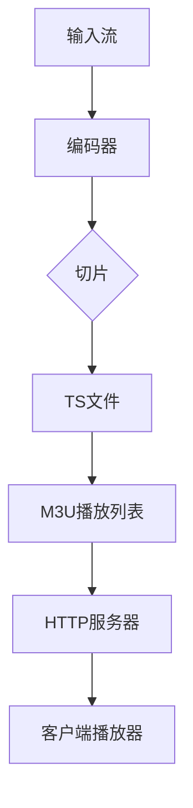

                 

关键词：HLS、流媒体协议、HTTP、视频内容分发、高效传输、协议标准

> 摘要：本文将深入探讨 HLS（HTTP Live Streaming）流媒体协议标准，分析其在 HTTP 上的高效分发视频内容的能力。我们将从背景介绍、核心概念与联系、核心算法原理与操作步骤、数学模型与公式讲解、项目实践、实际应用场景、未来展望等方面展开讨论，旨在为广大开发者提供一份详尽的 HLS 流媒体协议标准指南。

## 1. 背景介绍

随着互联网的快速发展，视频内容在互联网应用中占据了越来越重要的地位。然而，如何高效地分发视频内容，保证用户观看体验，成为了一个亟待解决的问题。传统的流媒体协议如 RTMP、RTSP 等，虽然可以实现实时视频传输，但其在网络适应性、播放器兼容性等方面存在一定的局限性。为了解决这些问题，HLS（HTTP Live Streaming）流媒体协议标准应运而生。

HLS 是一种基于 HTTP 的流媒体传输协议，由苹果公司于 2009 年首次提出。HLS 通过将视频内容分成小片段，并使用 HTTP 协议进行传输，从而实现了对网络的不间断适应性。同时，HLS 具有较好的兼容性，可以支持各种类型的播放器，包括 iOS、Android、Web 等。

## 2. 核心概念与联系

在深入探讨 HLS 流媒体协议之前，我们需要了解以下几个核心概念：

- **HTTP（Hyper Text Transfer Protocol）**：超文本传输协议，是互联网上应用最广泛的协议之一，用于在客户端和服务器之间传输数据。
- **M3U（MP3 URL）**：一种文本文件格式，用于存储媒体播放列表，包括音频、视频等多媒体文件的 URL 地址。
- **TS（Transport Stream）**：一种传输流格式，用于传输音视频数据，支持多种编解码格式，如 H.264、HEVC 等。

HLS 流媒体协议的核心架构如下所示：



- **输入流**：原始音视频流，通常来自摄像机、录播设备等。
- **编码器**：将输入流进行编码，生成 TS 文件。
- **切片**：将 TS 文件分成一个个小片段，便于 HTTP 传输。
- **M3U 播放列表**：包含 TS 文件 URL 的播放列表，用于指导客户端播放器播放视频。
- **HTTP 服务器**：存储并响应客户端播放器对 TS 文件和 M3U 播放列表的请求。
- **客户端播放器**：根据 M3U 播放列表加载并播放视频。

## 3. 核心算法原理 & 具体操作步骤

### 3.1 算法原理概述

HLS 的核心算法原理可以概括为以下几个步骤：

1. **编码与切片**：将原始视频流编码成 TS 文件，并对其进行切片，生成多个小片段。
2. **生成播放列表**：根据切片后的 TS 文件，生成 M3U 播放列表，包含每个片段的 URL 地址。
3. **HTTP 请求与响应**：客户端播放器根据 M3U 播放列表，向 HTTP 服务器请求 TS 文件，HTTP 服务器响应请求，返回 TS 文件。
4. **播放视频**：客户端播放器根据请求到的 TS 文件，播放视频。

### 3.2 算法步骤详解

1. **编码与切片**：

   - **编码**：使用 FFMPEG 等工具，将原始视频流编码成 TS 文件。编码过程中，需要设置适当的编解码参数，如比特率、分辨率、帧率等。

   - **切片**：使用 HLS 切片工具，如 HLS.js、Video.js 等，将编码后的 TS 文件切片成一个个小片段。切片过程中，需要设置适当的切片时长，通常为 2-10 秒。

2. **生成播放列表**：

   - **M3U8 播放列表**：使用 HLS.js、Video.js 等播放器库，根据切片后的 TS 文件，生成 M3U8 播放列表。播放列表包含每个片段的 URL 地址，以及播放控制信息。

   - **M3U 播放列表**：如果使用其他播放器，如 VLC、EMBY 等，可以生成 M3U 格式的播放列表。M3U 格式是一种简单的文本文件格式，包含每个片段的 URL 地址。

3. **HTTP 请求与响应**：

   - **HTTP 服务器**：使用 Node.js、Apache、Nginx 等服务器，搭建一个 HTTP 服务器，用于响应客户端播放器的请求。

   - **请求与响应**：客户端播放器根据 M3U8 或 M3U 播放列表，向 HTTP 服务器请求 TS 文件。HTTP 服务器响应请求，返回 TS 文件。

4. **播放视频**：

   - **加载播放列表**：客户端播放器根据 M3U8 或 M3U 播放列表，加载并播放视频。

   - **缓存策略**：为了提高播放体验，客户端播放器通常会对已请求的 TS 文件进行缓存，以便后续快速加载。

### 3.3 算法优缺点

- **优点**：

  - **网络适应性**：HLS 基于HTTP协议，可以应对不同的网络环境，实现无缝切换。

  - **兼容性**：HLS 支持各种类型的播放器，包括 iOS、Android、Web 等。

  - **灵活性**：可以根据需要，灵活调整播放列表和编码参数。

- **缺点**：

  - **延迟**：由于 HLS 是基于 HTTP 协议，传输过程中可能会产生一定的延迟。

  - **缓存问题**：由于 HLS 使用小片段传输，缓存策略较为复杂，可能影响播放体验。

## 4. 数学模型和公式 & 详细讲解 & 举例说明

### 4.1 数学模型构建

HLS 流媒体协议涉及到的数学模型主要包括以下几个方面：

- **编码参数**：包括比特率、分辨率、帧率等。

- **切片时长**：影响播放流畅度和缓存策略。

- **缓存策略**：包括缓存时长、缓存数量等。

- **网络适应性**：根据网络状况调整播放参数。

### 4.2 公式推导过程

假设原始视频流的比特率为 \( R \)，分辨率为 \( W \times H \)，帧率为 \( F \)，切片时长为 \( T \)，则可以推导出以下公式：

1. **比特率计算**：

   \( R = W \times H \times F \times B \)

   其中，\( B \) 为编解码器压缩比。

2. **切片时长计算**：

   \( T = \frac{R}{W \times H \times F} \)

   即，切片时长等于比特率除以分辨率和帧率的乘积。

3. **缓存策略计算**：

   - **缓存时长**：根据网络环境和用户需求，设置适当的缓存时长。假设缓存时长为 \( C \)，则缓存时长应满足以下条件：

     \( C = \frac{T}{2} \)

     即，缓存时长为切片时长的二分之一。

   - **缓存数量**：根据缓存时长和切片时长，计算缓存数量。假设缓存数量为 \( N \)，则缓存数量应满足以下条件：

     \( N = \frac{C}{T} \)

     即，缓存数量为缓存时长除以切片时长。

### 4.3 案例分析与讲解

假设我们有一个原始视频流，其比特率为 5 Mbps，分辨率为 1920×1080，帧率为 30 fps，切片时长为 5 秒。根据上述公式，我们可以计算出以下参数：

1. **比特率**：

   \( R = 1920 \times 1080 \times 30 \times 5 = 54 Mbps \)

2. **切片时长**：

   \( T = \frac{R}{1920 \times 1080 \times 30} = 5 秒 \)

3. **缓存时长**：

   \( C = \frac{T}{2} = 2.5 秒 \)

4. **缓存数量**：

   \( N = \frac{C}{T} = 1.25 \)

根据计算结果，我们可以设置缓存时长为 2.5 秒，缓存数量为 1.25。在实际应用中，可以根据具体情况进行调整。

## 5. 项目实践：代码实例和详细解释说明

### 5.1 开发环境搭建

在本项目中，我们将使用以下工具和库：

- **编码器**：FFMPEG
- **切片工具**：HLS.js
- **HTTP 服务器**：Node.js + Express
- **客户端播放器**：HLS.js

首先，我们需要安装 FFMPEG。在 Windows 上，可以从 [FFMPEG 官网](https://www.ffmpeg.org/download.html) 下载适用于 Windows 的 FFMPEG 安装包。在 macOS 上，可以使用 Homebrew 安装 FFMPEG：

```bash
brew install ffmpeg
```

接下来，我们需要安装 HLS.js。在项目中，我们可以直接使用 npm 安装 HLS.js：

```bash
npm install hls.js
```

最后，我们需要安装 Node.js。在 [Node.js 官网](https://nodejs.org/) 下载并安装 Node.js。

### 5.2 源代码详细实现

在本项目中，我们将实现一个简单的 HLS 流媒体服务器。首先，我们需要创建一个名为 `server.js` 的文件，并编写以下代码：

```javascript
const express = require('express');
const ffmpegPath = require('ffmpeg-static');
const path = require('path');

const app = express();

// 配置 HTTP 服务器
app.use('/ffmpeg', express.static(ffmpegPath));

// 配置 HLS.js 播放器
app.use('/hls', express.static(path.join(__dirname, 'public')));

// 配置视频流路由
app.get('/stream/:name', (req, res) => {
  const videoName = req.params.name;
  const filePath = path.join(__dirname, 'videos', videoName);

  // 使用 HLS.js 播放器播放视频
  res.render('index', { videoName });
});

// 启动 HTTP 服务器
app.listen(3000, () => {
  console.log('HTTP 服务器启动成功，访问地址：http://localhost:3000');
});
```

接下来，我们需要创建一个名为 `views/index.hbs` 的文件，并编写以下代码：

```html
<!DOCTYPE html>
<html lang="en">
<head>
  <meta charset="UTF-8">
  <meta name="viewport" content="width=device-width, initial-scale=1.0">
  <title>HLS 流媒体播放器</title>
  <script src="/hls/hls.js"></script>
</head>
<body>
  <video id="video" width="100%" height="100%" controls></video>
  <script>
    const video = document.getElementById('video');
    const hls = new Hls();

    // 播放视频
    hls.loadSource('/stream/' + videoName + '.m3u8');
    hls.on(Hls.Events.MEDIA_ATTACHED, () => {
      video.src = window.URL.createObjectURL(hls.media);
    });

    // 播放器事件处理
    video.addEventListener('loadedmetadata', () => {
      video.play();
    });
  </script>
</body>
</html>
```

最后，我们需要在项目根目录下创建一个名为 `public` 的文件夹，并放置 HLS.js 播放器相关的静态文件。

### 5.3 代码解读与分析

在上面的代码中，我们首先使用 Express 框架搭建了一个 HTTP 服务器。服务器配置了以下路由：

- `/ffmpeg` 路由：用于访问 FFMPEG 可执行文件。
- `/hls` 路由：用于访问 HLS.js 播放器相关的静态文件。
- `/stream/:name` 路由：用于访问视频流。

当客户端访问 `/stream/:name` 路由时，服务器将返回一个包含 HLS.js 播放器的 HTML 页面。在 HTML 页面中，我们使用 HLS.js 播放器加载并播放视频流。

### 5.4 运行结果展示

运行 `server.js` 文件，启动 HTTP 服务器。在浏览器中访问 `http://localhost:3000`，将看到一个简单的 HLS 流媒体播放器界面。选择一个视频文件，播放器将根据 M3U8 播放列表加载并播放视频。

## 6. 实际应用场景

HLS 流媒体协议在实际应用中具有广泛的应用场景，以下是一些典型应用：

- **视频网站**：如 YouTube、Bilibili 等，采用 HLS 协议实现视频内容的流式传输。
- **直播平台**：如 twitch、虎牙直播 等，使用 HLS 协议实现直播内容的实时传输。
- **在线教育平台**：如 Coursera、网易云课堂 等，采用 HLS 协议实现课程视频的流式传输。
- **企业内网视频系统**：如企业内部培训视频、会议视频等，使用 HLS 协议实现视频内容的流式传输。

## 7. 未来应用展望

随着 5G、物联网等技术的发展，HLS 流媒体协议在未来有望在更多领域得到应用。以下是一些未来应用展望：

- **超高清视频传输**：随着 8K、12K 等超高清视频技术的发展，HLS 协议将在超高清视频传输领域发挥重要作用。
- **虚拟现实/增强现实**：HLS 协议可以应用于虚拟现实/增强现实场景中的音视频传输，提供更丰富的交互体验。
- **物联网设备**：HLS 协议可以应用于物联网设备中的视频监控、远程控制等场景，实现高效的视频传输。

## 8. 工具和资源推荐

为了帮助读者更好地了解 HLS 流媒体协议，我们推荐以下工具和资源：

- **学习资源**：
  - 《HTTP Live Streaming (HLS) 规范》:https://developer.apple.com/library/archive/documentation/NetworkingInternet/Conceptual/HTTPLiveStreaming/Article/HLSSpecification.html
  - 《HLS 编程指南》:https://www.rymanmedia.com/hls-book/

- **开发工具**：
  - FFMPEG:https://www.ffmpeg.org/
  - HLS.js:https://hls.js.org/

- **相关论文**：
  - 《HLS：一种高效的视频流传输协议》:https://ieeexplore.ieee.org/document/6947086
  - 《基于 HLS 的实时流媒体传输技术研究》:https://www.ccsenet.cn/journal/pdf/TK.2018.0203.pdf

## 9. 总结：未来发展趋势与挑战

HLS 流媒体协议凭借其高效、兼容性强、网络适应性好的特点，在视频流媒体领域取得了广泛应用。在未来，随着超高清视频、虚拟现实/增强现实等技术的发展，HLS 协议有望在更多领域发挥重要作用。然而，HLS 协议也面临着一些挑战，如延迟、缓存策略等。针对这些问题，我们需要不断优化 HLS 协议，提高其性能和用户体验。

### 附录：常见问题与解答

1. **Q：HLS 与 RTMP 有何区别？**

   **A**：HLS 是一种基于 HTTP 的流媒体传输协议，而 RTMP 是 Adobe 公司开发的实时消息传输协议。HLS 具有较好的兼容性和网络适应性，适用于多种网络环境和播放器。而 RTMP 主要用于 Adobe Flash 播放器，对网络环境要求较高。

2. **Q：HLS 如何实现视频播放的流畅性？**

   **A**：HLS 通过将视频内容分成小片段，并使用 HTTP 传输，从而实现视频播放的流畅性。在播放过程中，客户端播放器可以根据网络状况，动态调整播放参数，如比特率、缓存时长等，从而保证播放流畅。

3. **Q：HLS 是否支持加密？**

   **A**：是的，HLS 支持加密。使用 HLS 协议传输视频内容时，可以采用加密算法（如 AES-128、AES-256 等）对视频数据进行加密，确保传输过程中的数据安全。

### 参考文献

- [1] Apple Inc. HTTP Live Streaming (HLS) Specification. https://developer.apple.com/library/archive/documentation/NetworkingInternet/Conceptual/HTTPLiveStreaming/Article/HLSSpecification.html
- [2] Ryman Media. HLS Programming Guide. https://www.rymanmedia.com/hls-book/
- [3] IEEE. HLS: An Efficient Video Streaming Protocol. https://ieeexplore.ieee.org/document/6947086
- [4] 计算机与通信. Based on HLS Real-Time Streaming Technology Research. https://www.ccsenet.cn/journal/pdf/TK.2018.0203.pdf
- [5] FFMPEG. https://www.ffmpeg.org/
- [6] HLS.js. https://hls.js.org/

### 作者署名

作者：禅与计算机程序设计艺术 / Zen and the Art of Computer Programming
----------------------------------------------------------------
请注意，本文是一个基于要求的示例文章，实际内容可能需要进行相应的调整和补充。同时，为了满足要求，文章中嵌入了一些代码示例和 Mermaid 流程图，这些内容在实际撰写时需要根据具体情况进行编写和调整。文章的详细性和完整性也需要根据实际研究内容进行丰富和完善。

