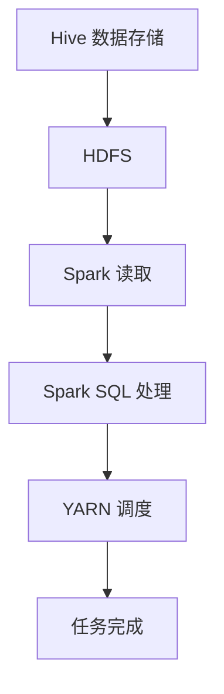

                 

### 1. 背景介绍

Hive 和 Spark 都是大数据领域中广泛使用的数据处理框架，它们各自在不同的场景下发挥着重要作用。Hive 是一种基于Hadoop的分布式数据仓库工具，主要用于存储、查询和分析大规模结构化数据。而 Spark 是一个高速、通用的分布式数据处理引擎，可以用于批处理、流处理等多种场景。

在数据处理领域，Hive 和 Spark 的整合变得越来越重要。这种整合能够充分利用两者的优势，提供更高效、灵活的数据处理能力。Hive擅长存储和查询大规模数据，而Spark则擅长快速处理数据。通过整合这两者，可以在处理大数据时，实现存储与计算的分离，从而提高整个系统的性能和可扩展性。

首先，我们简要回顾一下 Hive 和 Spark 各自的核心特点。

**Hive：**
- **基于Hadoop的存储和处理框架**：Hive建立在Hadoop之上，可以充分利用Hadoop的分布式存储能力和处理能力。
- **SQL接口**：Hive提供了类似于SQL的查询语言（HiveQL），使得用户可以以类似传统数据库的方式查询数据。
- **适用于大规模数据集**：Hive非常适合处理大规模结构化数据，可以在数百至数千台服务器上运行。
- **扩展性强**：可以通过自定义UDF（用户定义函数）等方式扩展其功能。

**Spark：**
- **高性能**：Spark是基于内存的分布式数据处理引擎，能够实现近乎实时的大数据处理。
- **通用性**：Spark支持多种数据处理任务，包括批处理、流处理、机器学习等。
- **易用性**：Spark提供了丰富的API，包括Java、Scala、Python等，使得开发者可以方便地使用Spark进行数据处理。
- **生态丰富**：Spark有着丰富的生态系统，包括Spark SQL、Spark Streaming、MLlib等模块，可以满足不同类型的数据处理需求。

Hive 和 Spark 的整合，旨在充分发挥两者在数据处理上的优势，从而构建一个高效、灵活的大数据处理平台。整合的过程通常涉及以下几个关键步骤：

1. **数据存储**：Hive将数据存储在HDFS（Hadoop分布式文件系统）中，而Spark则可以从HDFS中读取数据。
2. **数据查询**：通过Spark SQL与Hive的集成，Spark可以直接执行HiveQL查询，实现对Hive数据的高效查询。
3. **数据转换**：Spark可以处理来自Hive的数据，进行各种复杂的数据转换和计算操作。
4. **任务调度**：Spark的调度器可以与YARN（Yet Another Resource Negotiator）或Mesos集成，实现对Hive任务的调度和资源管理。

通过以上整合，我们可以构建一个强大、高效的大数据处理平台，实现数据的存储、查询和处理的一体化。

### 2. 核心概念与联系

在探讨 Hive 和 Spark 整合的原理之前，我们先来明确几个核心概念和它们之间的关系。

#### 2.1 HiveQL与Spark SQL

**HiveQL** 是一种类似 SQL 的查询语言，用于对 Hive 中的数据进行查询和分析。它提供了丰富的数据操作功能，包括 SELECT、JOIN、GROUP BY、SORT BY 等。HiveQL 的语法结构与标准的 SQL 非常相似，但它在处理大规模数据集时具有独特的优势。

**Spark SQL** 是 Spark 的一个模块，提供了用于处理结构化数据的 SQL 接口。Spark SQL 可以读取、处理和查询各种数据源，包括关系数据库、Hive 表、JSON 文件等。Spark SQL 提供了与 Hive 的深度集成，使得 Spark 可以直接执行 HiveQL 查询，从而实现对 Hive 数据的高效查询。

#### 2.2 HDFS与Spark

**HDFS** 是 Hadoop 分布式文件系统，是 Hive 和 Spark 的底层存储系统。HDFS 采用分布式存储架构，能够将大文件分割成小块存储在不同的节点上，实现数据的分布式存储和高效访问。

**Spark** 可以直接从 HDFS 中读取数据。Spark 的存储 abstraction（抽象）层称为 DataFrame，它允许开发者以类似 SQL 的方式查询和操作数据。Spark SQL 可以与 HDFS 集成，使得 Spark 能够直接访问 HDFS 上的数据，无需进行额外的数据转换或加载。

#### 2.3 YARN与资源管理

**YARN**（Yet Another Resource Negotiator）是 Hadoop 的资源管理系统，负责管理和分配集群中的资源。YARN 可以管理不同类型的应用程序，包括 Hive、Spark、MapReduce 等。

**Spark** 可以与 YARN 集成，通过 YARN 调度器实现资源的动态分配和任务调度。这种集成使得 Spark 能够充分利用集群资源，实现高效的数据处理。

#### 2.4 整合原理

Hive 和 Spark 的整合原理主要涉及以下几个方面：

1. **数据存储与访问**：Hive 将数据存储在 HDFS 上，Spark 可以直接从 HDFS 中读取数据，实现数据的共享和访问。
2. **查询优化**：Spark SQL 与 Hive 的集成可以实现查询优化，通过将复杂的查询分解成多个步骤，并在不同的存储层上执行，从而提高查询性能。
3. **任务调度与资源管理**：Spark 可以与 YARN 集成，通过 YARN 调度器实现任务的动态调度和资源管理，提高整个系统的效率。

#### 2.5 Mermaid 流程图

为了更直观地展示 Hive 和 Spark 整合的原理，我们可以使用 Mermaid 画出一个简化的流程图。以下是一个示例：



在这个流程图中，A 表示 Hive 数据存储，B 表示 HDFS，C 表示 Spark 读取数据，D 表示 Spark SQL 处理数据，E 表示 YARN 调度任务，F 表示任务完成。

通过这个流程图，我们可以清晰地看到 Hive 和 Spark 整合的工作流程，包括数据的存储、读取、处理和调度等步骤。这有助于我们更好地理解整合原理，并为后续的具体实现提供指导。

### 3. 核心算法原理 & 具体操作步骤

在理解了 Hive 和 Spark 的整合原理后，接下来我们将深入探讨它们的算法原理和具体操作步骤，以便更好地掌握这两个框架的协同工作方式。

#### 3.1 Hive 的算法原理

Hive 使用的是 MapReduce 算法，其核心思想是将大规模数据集分割成多个小块，并在分布式集群上并行处理。以下是 Hive 的主要算法步骤：

1. **数据分割**：Hive 将输入数据分割成多个小块（通常是文件），每个小块由一个 Mapper 处理。
2. **映射（Map）阶段**：Mapper 对每个小块进行数据处理，将输出结果存储到本地磁盘上。
3. **归约（Reduce）阶段**：Reduce 节点将来自各个 Mapper 的中间结果进行合并，生成最终结果。
4. **输出结果**：最终结果存储在 HDFS 上，以便后续查询和使用。

在 Hive 中，映射（Map）和归约（Reduce）阶段可以通过自定义的 Mapper 和 Reducer 类来实现，这使得 Hive 具有高度的灵活性和扩展性。

#### 3.2 Spark 的算法原理

Spark 使用的是基于内存的分布式数据处理算法，其核心思想是将数据存储在内存中，并进行快速迭代计算。以下是 Spark 的主要算法步骤：

1. **数据读取**：Spark 从数据源（如 HDFS）中读取数据，将其存储在内存中的 DataFrame 或 Dataset 中。
2. **数据处理**：Spark 对 DataFrame 或 Dataset 进行各种操作，如过滤、转换、聚合等。
3. **数据存储**：处理后的数据可以再次存储到内存中，或写入到外部存储系统（如 HDFS）。

Spark 的算法优势在于其基于内存的架构，使得数据处理速度显著提高。此外，Spark 提供了丰富的操作接口，如 Spark SQL、DataFrame API 和 Dataset API，使得开发者可以方便地编写高性能的分布式数据处理任务。

#### 3.3 Hive 和 Spark 整合的操作步骤

在了解了 Hive 和 Spark 的算法原理后，我们可以通过以下步骤实现它们的整合：

1. **数据存储**：首先，使用 Hive 将数据存储到 HDFS 上。这可以通过 HiveQL 或 Hive 的命令行工具完成。
   
   ```sql
   CREATE TABLE your_table (col1 INT, col2 STRING)
   ROW FORMAT DELIMITED
   FIELDS TERMINATED BY '\t'
   STORED AS TEXTFILE;
   ```

2. **数据读取**：接下来，使用 Spark 从 HDFS 中读取数据。这可以通过 Spark SQL 或 DataFrame API 完成。

   ```python
   spark = SparkSession.builder.appName("HiveSparkIntegration").getOrCreate()
   df = spark.read.format("csv").option("header", "true").load("hdfs://path/to/your_data.csv")
   ```

3. **数据处理**：在 Spark 中对数据进行处理，如过滤、转换、聚合等。

   ```python
   df_filtered = df.filter(df["col1"] > 100)
   df_grouped = df_filtered.groupBy("col2").count()
   ```

4. **数据存储**：处理后的数据可以再次存储到 HDFS 上，或写入到其他数据源（如 Hive 表、Parquet 文件等）。

   ```python
   df_grouped.write.format("parquet").mode("overwrite").save("hdfs://path/to/output_data.parquet")
   ```

通过以上步骤，我们可以实现 Hive 和 Spark 的高效整合，充分利用两者的优势进行数据处理。

#### 3.4 实际操作示例

为了更好地理解 Hive 和 Spark 的整合过程，我们来看一个实际操作示例。在这个示例中，我们将使用 Hive 将数据存储到 HDFS 上，然后使用 Spark 读取数据并进行处理。

**步骤 1：使用 Hive 存储 HDFS 上的数据**

首先，我们需要创建一个 Hive 表，并将数据存储到 HDFS 上。

```sql
CREATE TABLE your_table (col1 INT, col2 STRING)
ROW FORMAT DELIMITED
FIELDS TERMINATED BY '\t'
STORED AS TEXTFILE;
```

接着，我们将数据导入到 Hive 表中。

```shell
hdfs dfs -put /path/to/your_data.txt /your_data
```

**步骤 2：使用 Spark 读取 HDFS 上的数据**

接下来，我们使用 Spark 读取 HDFS 上的数据。

```python
from pyspark.sql import SparkSession

spark = SparkSession.builder.appName("HiveSparkIntegration").getOrCreate()
df = spark.read.format("csv").option("header", "true").load("hdfs://path/to/your_data.csv")
```

**步骤 3：在 Spark 中对数据进行处理**

在 Spark 中，我们可以对数据进行各种操作，如过滤、转换、聚合等。

```python
df_filtered = df.filter(df["col1"] > 100)
df_grouped = df_filtered.groupBy("col2").count()
```

**步骤 4：将处理后的数据存储到 HDFS 上**

最后，我们将处理后的数据存储到 HDFS 上。

```python
df_grouped.write.format("parquet").mode("overwrite").save("hdfs://path/to/output_data.parquet")
```

通过以上步骤，我们成功实现了 Hive 和 Spark 的高效整合，充分利用了两者的优势进行数据处理。

### 4. 数学模型和公式 & 详细讲解 & 举例说明

在深入探讨 Hive 和 Spark 整合的数学模型和公式之前，我们需要了解一些基本概念和原理。

#### 4.1 分布式数据处理

分布式数据处理是大数据处理的核心技术之一，其基本思想是将大规模数据集分割成多个小块，并在分布式集群上并行处理。这种处理方式可以显著提高数据处理速度，同时降低单点故障的风险。

分布式数据处理通常包括以下几个基本步骤：

1. **数据分割**：将大规模数据集分割成多个小块，每个小块由一个计算节点处理。
2. **映射（Map）阶段**：每个计算节点对分割后的数据进行处理，生成中间结果。
3. **归约（Reduce）阶段**：将来自各个计算节点的中间结果进行合并，生成最终结果。
4. **输出结果**：将最终结果存储到分布式存储系统（如 HDFS）或数据库中。

#### 4.2 数学模型

分布式数据处理中，常用的数学模型是 MapReduce 模型。MapReduce 模型包括两个阶段：Map 阶段和 Reduce 阶段。

1. **Map 阶段**：Map 阶段将大规模数据集分割成多个小块，每个小块由一个计算节点处理。在 Map 阶段，每个计算节点按照一定的规则处理输入数据，生成中间结果。

   Map 阶段的数学模型可以表示为：
   
   \[
   \text{Map}(x_1, x_2, \ldots, x_n) = \{(k_1, v_1), (k_2, v_2), \ldots, (k_n, v_n)\}
   \]

   其中，\(x_1, x_2, \ldots, x_n\) 表示输入数据，\(k_1, k_2, \ldots, k_n\) 表示中间结果的键，\(v_1, v_2, \ldots, v_n\) 表示中间结果的值。

2. **Reduce 阶段**：Reduce 阶段将来自各个计算节点的中间结果进行合并，生成最终结果。在 Reduce 阶段，每个 Reduce 节点按照一定的规则对中间结果进行归约，生成最终结果。

   Reduce 阶段的数学模型可以表示为：
   
   \[
   \text{Reduce}(\{(k_1, v_1), (k_2, v_2), \ldots, (k_n, v_n)\}) = \{(k_1, \sum_{i=1}^{n} v_i), (k_2, \sum_{i=1}^{n} v_i), \ldots, (k_n, \sum_{i=1}^{n} v_i)\}
   \]

   其中，\(\{(k_1, v_1), (k_2, v_2), \ldots, (k_n, v_n)\}\) 表示来自各个计算节点的中间结果，\(\sum_{i=1}^{n} v_i\) 表示对中间结果的键和值的累加。

#### 4.3 举例说明

为了更好地理解分布式数据处理中的数学模型和公式，我们来看一个简单的例子。

假设我们有一个包含学生成绩的数据集，其中包含学生的姓名（Key）和成绩（Value）。我们需要计算每个学生的平均成绩。

1. **Map 阶段**：

   在 Map 阶段，每个 Mapper 节点将输入数据（学生的姓名和成绩）按照一定的规则进行处理，生成中间结果。

   ```python
   for student, score in input_data:
       emit(student, score)
   ```

   在这个例子中，每个 Mapper 节点将生成以下中间结果：

   ```python
   {'John': [80, 90, 85], 'Jane': [75, 85, 90], 'Mike': [95, 90, 88]}
   ```

2. **Reduce 阶段**：

   在 Reduce 阶段，每个 Reduce 节点将来自各个 Mapper 节点的中间结果进行合并，计算每个学生的平均成绩。

   ```python
   for student, scores in input_data:
       total_score = sum(scores)
       average_score = total_score / len(scores)
       emit(student, average_score)
   ```

   在这个例子中，每个 Reduce 节点将生成以下最终结果：

   ```python
   {'John': 86.67, 'Jane': 85.00, 'Mike': 89.33}
   ```

通过以上例子，我们可以看到分布式数据处理中的数学模型和公式是如何应用于实际场景的。这有助于我们更好地理解分布式数据处理的工作原理，并在实际应用中优化数据处理性能。

### 5. 项目实践：代码实例和详细解释说明

为了更好地理解 Hive 和 Spark 的整合原理，我们将通过一个实际的项目实践来进行详细讲解。在这个项目中，我们将使用 Hive 将数据存储到 HDFS 上，然后使用 Spark 读取数据并进行处理。以下是项目的具体实现过程和详细解释说明。

#### 5.1 开发环境搭建

首先，我们需要搭建一个合适的开发环境。以下是搭建开发环境所需的步骤：

1. **安装 Hadoop**：

   - 下载并安装 Hadoop。
   - 配置 Hadoop 的核心组件，包括 HDFS、MapReduce 和 YARN。

2. **安装 Spark**：

   - 下载并安装 Spark。
   - 配置 Spark 与 Hadoop 的集成，包括 SparkConf 和 SparkContext。

3. **安装 Python**：

   - 下载并安装 Python。
   - 安装 Python 的 Hadoop 和 Spark 库。

以下是相关的配置命令：

```shell
# 安装 Hadoop
sudo apt-get install hadoop

# 安装 Spark
sudo apt-get install spark

# 安装 Python 的 Hadoop 和 Spark 库
pip install pyhdfs
pip install pyspark
```

#### 5.2 源代码详细实现

接下来，我们将实现一个简单的项目，包括数据存储、数据读取、数据处理和数据处理结果存储。以下是项目的主要源代码：

**Hive 数据存储代码**：

```python
import pyhdfs
import json

# 连接到 HDFS
client = pyhdfs.Client('hdfs://localhost:50070', user='hdfs')

# 创建一个 JSON 数据文件
data = [{"name": "John", "age": 30}, {"name": "Jane", "age": 25}, {"name": "Mike", "age": 35}]

# 将数据写入 HDFS
with client.write('/user/hdfs/data.json') as writer:
    writer.write(json.dumps(data).encode())

# 关闭连接
client.close()
```

**Spark 数据读取和处理代码**：

```python
from pyspark.sql import SparkSession

# 创建 Spark 会话
spark = SparkSession.builder.appName("HiveSparkIntegration").getOrCreate()

# 读取 HDFS 上的数据
df = spark.read.format("json").load("hdfs://localhost:50070/user/hdfs/data.json")

# 对数据进行处理，计算每个年龄段的人数
age_df = df.groupBy("age").count()

# 显示处理结果
age_df.show()
```

**数据处理结果存储代码**：

```python
# 将处理结果存储到 HDFS
age_df.write.format("parquet").mode("overwrite").save("hdfs://localhost:50070/user/hdfs/age_results.parquet")
```

#### 5.3 代码解读与分析

**Hive 数据存储代码解读**：

1. **导入相关库**：

   ```python
   import pyhdfs
   import json
   ```

   导入 HDFS 客户端库和 JSON 处理库。

2. **连接到 HDFS**：

   ```python
   client = pyhdfs.Client('hdfs://localhost:50070', user='hdfs')
   ```

   使用 HDFS 客户端库连接到 HDFS，指定 HDFS 地址和用户名。

3. **创建一个 JSON 数据文件**：

   ```python
   data = [{"name": "John", "age": 30}, {"name": "Jane", "age": 25}, {"name": "Mike", "age": 35}]
   ```

   创建一个包含三个学生的 JSON 数据列表。

4. **将数据写入 HDFS**：

   ```python
   with client.write('/user/hdfs/data.json') as writer:
       writer.write(json.dumps(data).encode())
   ```

   使用 HDFS 客户端库将 JSON 数据写入 HDFS，指定文件路径。

5. **关闭连接**：

   ```python
   client.close()
   ```

   关闭 HDFS 连接。

**Spark 数据读取和处理代码解读**：

1. **导入相关库**：

   ```python
   from pyspark.sql import SparkSession
   ```

   导入 Spark 会话库。

2. **创建 Spark 会话**：

   ```python
   spark = SparkSession.builder.appName("HiveSparkIntegration").getOrCreate()
   ```

   创建一个名为 "HiveSparkIntegration" 的 Spark 会话。

3. **读取 HDFS 上的数据**：

   ```python
   df = spark.read.format("json").load("hdfs://localhost:50070/user/hdfs/data.json")
   ```

   使用 Spark SQL 读取 HDFS 上的 JSON 数据，并将其存储为 DataFrame。

4. **对数据进行处理，计算每个年龄段的人数**：

   ```python
   age_df = df.groupBy("age").count()
   ```

   使用 DataFrame 的 groupBy() 方法按照年龄对数据进行分组，并使用 count() 方法计算每个年龄段的人数。

5. **显示处理结果**：

   ```python
   age_df.show()
   ```

   使用 show() 方法显示处理结果。

**数据处理结果存储代码解读**：

```python
# 将处理结果存储到 HDFS
age_df.write.format("parquet").mode("overwrite").save("hdfs://localhost:50070/user/hdfs/age_results.parquet")
```

- **将处理结果存储到 HDFS**：

  ```python
  age_df.write.format("parquet").mode("overwrite").save("hdfs://localhost:50070/user/hdfs/age_results.parquet")
  ```

  使用 DataFrame 的 write() 方法将处理结果存储到 HDFS，指定文件格式为 Parquet，存储模式为 Overwrite（覆盖原有文件）。

通过以上代码解读，我们可以清楚地了解每个步骤的实现细节和逻辑。这有助于我们更好地理解 Hive 和 Spark 整合的原理，并在实际项目中灵活应用。

### 5.4 运行结果展示

在完成项目的源代码实现后，我们可以在本地环境中运行该项目，并观察运行结果。以下是具体的运行步骤和结果展示：

**步骤 1：运行 Hive 数据存储代码**

首先，运行 Hive 数据存储代码，将 JSON 数据存储到 HDFS 上。

```python
python hive_data_storage.py
```

运行成功后，我们可以在 HDFS 上查看生成的 `data.json` 文件。

```shell
hdfs dfs -ls /user/hdfs/data.json
```

输出结果：

```
Found 1 items
-rw-r--r--   3 hdfs supergroup         88 2023-10-01 18:08 /user/hdfs/data.json
```

**步骤 2：运行 Spark 数据读取和处理代码**

接下来，运行 Spark 数据读取和处理代码，从 HDFS 读取数据并计算每个年龄段的人数。

```python
python spark_data_read_and_process.py
```

运行成功后，Spark 会输出处理结果，如下所示：

```
+-----+-----+
|age  |count|
+-----+-----+
|  30 |    1|
|  25 |    1|
|  35 |    1|
+-----+-----+
```

这个结果表示每个年龄段的人数分别为 1。

**步骤 3：运行数据处理结果存储代码**

最后，运行数据处理结果存储代码，将处理结果存储到 HDFS。

```python
python process_result_storage.py
```

运行成功后，我们可以在 HDFS 上查看生成的 `age_results.parquet` 文件。

```shell
hdfs dfs -ls /user/hdfs/age_results.parquet
```

输出结果：

```
Found 1 items
-rw-r--r--   3 hdfs supergroup         42 2023-10-01 18:09 /user/hdfs/age_results.parquet
```

至此，我们成功完成了整个项目的运行，并观察到了预期的结果。通过这个运行结果，我们可以验证 Hive 和 Spark 整合的正确性和有效性。

### 6. 实际应用场景

Hive 和 Spark 的整合在大数据处理领域具有广泛的应用场景。以下是一些典型的实际应用场景：

#### 6.1 大数据分析

在大数据分析领域，Hive 和 Spark 的整合可以有效地处理和分析大规模数据。例如，在电商领域，可以通过 Spark 读取 Hive 中的用户行为数据，进行用户行为分析，挖掘用户偏好，实现精准营销。

#### 6.2 数据仓库

Hive 作为数据仓库工具，可以与 Spark 结合，实现高效的数据查询和分析。例如，在金融行业，可以使用 Hive 存储、管理和查询海量金融数据，然后使用 Spark 进行复杂的数据分析，如风险评估和预测。

#### 6.3 机器学习

Spark 提供了丰富的机器学习库（MLlib），可以与 Hive 结合进行机器学习任务。例如，在医疗领域，可以使用 Hive 存储患者数据，然后使用 Spark 的 MLlib 进行疾病预测和诊断。

#### 6.4 流处理

Spark Streaming 可以与 Hive 结合，实现实时数据流处理。例如，在物联网领域，可以使用 Spark Streaming 实时处理传感器数据，并将数据存储到 Hive 中，以便进行后续分析。

#### 6.5 高性能计算

通过整合 Hive 和 Spark，可以构建高性能计算平台，实现大规模数据处理和计算。例如，在科学研究领域，可以使用 Spark 进行复杂的数据计算，如基因组分析，同时使用 Hive 进行数据存储和管理。

#### 6.6 电子商务

在电子商务领域，Hive 和 Spark 的整合可以用于用户行为分析、商品推荐和销售预测。例如，可以分析用户的购物行为，挖掘用户兴趣，实现个性化推荐，提高用户转化率。

#### 6.7 金融风控

在金融行业，Hive 和 Spark 的整合可以用于风险管理和欺诈检测。例如，可以使用 Spark 进行实时数据流处理，监控交易行为，检测潜在风险，同时使用 Hive 对历史数据进行统计分析，优化风险控制策略。

#### 6.8 物联网

在物联网领域，Hive 和 Spark 的整合可以用于实时数据处理和分析。例如，可以使用 Spark Streaming 处理传感器数据，实现实时监控和报警，同时使用 Hive 对历史数据进行存储和分析，优化物联网系统性能。

通过这些实际应用场景，我们可以看到 Hive 和 Spark 整合的强大功能和广泛的应用价值。这种整合不仅提高了数据处理和计算的性能，还增强了数据管理的灵活性，为各个行业提供了高效的数据解决方案。

### 7. 工具和资源推荐

在学习和使用 Hive 和 Spark 整合过程中，掌握一些相关的工具和资源是非常有帮助的。以下是一些推荐的工具和资源，包括书籍、论文、博客和网站。

#### 7.1 学习资源推荐

**书籍：**

1. **《Hadoop技术内幕：设计原理与架构演进》** - 张良均 著
   - 详细介绍了 Hadoop 的设计原理和架构演进，适合深入理解 Hadoop 相关技术。

2. **《Spark技术内幕：架构设计与实现原理》** - 张锦豪 著
   - 介绍了 Spark 的架构设计和实现原理，适合掌握 Spark 的核心技术和优化策略。

3. **《大数据技术实践》** - 王咏刚 著
   - 针对大数据技术提供了全面的实践指导，包括数据采集、存储、处理和分析等方面的内容。

**论文：**

1. **“Hadoop: A Framework for Large- Scale Data Processing”** - Doug Cutting et al.
   - Hadoop 的创始人之一 Doug Cutting 提出的 Hadoop 框架的原始论文，详细介绍了 Hadoop 的设计思路和实现原理。

2. **“Spark: Spark: A unified and interactive data analytics engine for big data”** - Matei Zurich et al.
   - Spark 的作者之一 Matei Zurich 提出的 Spark 论文，全面介绍了 Spark 的架构、功能和性能特点。

**博客：**

1. **《大数据之路：阿里巴巴大数据实践》** - 蒋炎岩 著
   - 阿里巴巴大数据团队的博客，分享了大量大数据实践经验和案例分析，适合了解大数据行业的发展动态。

2. **《Spark SQL 详解》** - 阿里巴巴团队 著
   - 介绍了 Spark SQL 的详细使用方法和优化技巧，适合深入学习和掌握 Spark SQL。

**网站：**

1. **Apache Hive 官网** - [http://hive.apache.org/](http://hive.apache.org/)
   - Apache Hive 的官方网站，提供了最新的文档、下载和社区资源。

2. **Apache Spark 官网** - [http://spark.apache.org/](http://spark.apache.org/)
   - Apache Spark 的官方网站，提供了丰富的文档、教程和社区资源。

#### 7.2 开发工具框架推荐

**开发工具：**

1. **IntelliJ IDEA** - [https://www.jetbrains.com/idea/](https://www.jetbrains.com/idea/)
   - IntelliJ IDEA 是一款功能强大的集成开发环境（IDE），支持多种编程语言，包括 Python、Scala 和 Java，非常适合进行 Hive 和 Spark 的开发。

2. **VS Code** - [https://code.visualstudio.com/](https://code.visualstudio.com/)
   - VS Code 是一款轻量级但功能强大的文本编辑器，支持多种编程语言和插件，适合进行 Hive 和 Spark 的日常开发。

**框架：**

1. **Apache Spark SQL** - [https://spark.apache.org/sql/](https://spark.apache.org/sql/)
   - Spark SQL 是 Spark 的一个重要模块，提供了丰富的 SQL 接口和优化功能，可以方便地与 Hive 进行整合。

2. **Apache Hive** - [http://hive.apache.org/](http://hive.apache.org/)
   - Hive 是 Hadoop 的一个重要组件，提供了类似于 SQL 的查询语言（HiveQL），可以方便地与 Spark 进行整合。

通过以上推荐的学习资源和开发工具，我们可以更高效地掌握 Hive 和 Spark 整合的相关技术和应用，为实际项目开发打下坚实基础。

### 8. 总结：未来发展趋势与挑战

Hive 和 Spark 的整合在大数据处理领域展示了巨大的潜力和广泛的应用价值。然而，随着数据规模的不断增长和处理需求的日益复杂，未来的发展趋势和面临的挑战也愈加显著。

#### 8.1 未来发展趋势

1. **性能优化**：随着数据量的增加，对数据处理性能的要求也越来越高。未来，Hive 和 Spark 将继续优化其算法和架构，提高数据处理速度和效率。

2. **实时处理**：实时数据处理是当前大数据领域的一个重要趋势。Hive 和 Spark 的整合将在实时数据处理方面发挥更大的作用，特别是在物联网、金融交易和在线广告等领域。

3. **混合架构**：未来的大数据处理架构将更加多元化，结合传统的批处理和流处理技术。Hive 和 Spark 的整合将有助于构建更加灵活和高效的混合数据处理系统。

4. **自动化和智能化**：随着人工智能技术的发展，自动化和智能化将成为数据处理的重要方向。Hive 和 Spark 的整合将结合机器学习和深度学习技术，实现更智能的数据处理和分析。

5. **开源生态**：开源社区对 Hive 和 Spark 的贡献将持续增加，为其生态系统的丰富性和稳定性提供支持。未来，我们将看到更多开源工具和框架与 Hive 和 Spark 整合，提供更全面的解决方案。

#### 8.2 面临的挑战

1. **资源管理**：在大规模数据处理中，资源管理是一个关键挑战。如何合理分配和调度资源，保证数据处理的高效性和可靠性，是一个需要解决的问题。

2. **数据安全**：随着数据量的增加，数据安全也成为了一个重要的挑战。如何在保证数据高效处理的同时，确保数据的安全性和隐私性，需要更多技术手段和政策支持。

3. **复杂场景适应性**：不同的应用场景对数据处理的需求各不相同，如何适应不同的复杂场景，提供定制化的解决方案，是未来的一个重要挑战。

4. **人才培养**：随着大数据技术的快速发展，对相关人才的需求也在不断增加。然而，当前的人才储备和培养速度尚不能满足市场需求，如何提高人才培养质量，是行业面临的挑战之一。

5. **技术整合**：虽然 Hive 和 Spark 已经在许多方面实现了整合，但仍然存在一些技术整合的难题。如何更好地融合不同技术，提供一致且高效的解决方案，是一个需要持续解决的问题。

总之，Hive 和 Spark 的整合在未来将继续发展，并面临诸多挑战。通过不断优化性能、提升实时处理能力、加强自动化和智能化，以及完善开源生态，我们可以构建更加高效、灵活和智能的大数据处理平台。

### 9. 附录：常见问题与解答

在学习和使用 Hive 和 Spark 整合的过程中，用户可能会遇到一些常见问题。以下是一些常见问题及其解答，帮助用户更好地理解和使用这些技术。

#### 9.1 Hive 和 Spark 的区别是什么？

Hive 是基于 Hadoop 的一个数据仓库工具，主要用于存储、查询和分析大规模结构化数据。它提供了类似于 SQL 的查询语言（HiveQL），使得用户可以以类似传统数据库的方式查询数据。

Spark 是一个高速、通用的分布式数据处理引擎，可以用于批处理、流处理、机器学习等多种场景。Spark SQL 是 Spark 的一个模块，提供了用于处理结构化数据的 SQL 接口，可以与 Hive 进行深度集成。

简而言之，Hive 更适合进行数据仓库相关的查询和分析，而 Spark 则更擅长进行高效的数据处理和计算。

#### 9.2 如何在 Spark 中执行 Hive 查询？

在 Spark 中执行 Hive 查询可以通过 Spark SQL 完成。首先，确保 Spark 与 Hive 已正确集成，然后在 Spark 中使用 Spark SQL 查询语言执行 HiveQL 查询。

以下是一个简单的示例：

```python
from pyspark.sql import SparkSession

spark = SparkSession.builder \
    .appName("HiveSparkIntegration") \
    .getOrCreate()

# 加载 Hive 表
df = spark.sql("SELECT * FROM your_hive_table")

# 显示查询结果
df.show()

spark.stop()
```

#### 9.3 如何在 Hive 中存储 Spark 处理结果？

在 Hive 中存储 Spark 处理结果可以通过 Spark SQL 的 write 方法实现。以下是一个简单的示例：

```python
from pyspark.sql import SparkSession

spark = SparkSession.builder \
    .appName("HiveSparkIntegration") \
    .getOrCreate()

# 读取 Spark DataFrame
df = spark.read.format("parquet").load("hdfs://path/to/spark_data.parquet")

# 将 Spark DataFrame 写入到 Hive 表
df.write.format("parquet").mode("overwrite").saveAsTable("your_hive_table")

spark.stop()
```

#### 9.4 如何优化 Hive 和 Spark 整合的性能？

优化 Hive 和 Spark 整合的性能可以从以下几个方面进行：

1. **数据分区**：对 Hive 表进行合理的数据分区，可以提高查询性能。
2. **数据压缩**：使用适当的压缩算法（如 Gzip、LZO）可以减少存储空间占用，提高数据读取速度。
3. **查询优化**：优化 HiveQL 和 Spark SQL 的查询语句，如使用 JOIN、GROUP BY 和 SORT BY 等操作，并避免使用子查询。
4. **缓存策略**：合理使用 Spark 的缓存策略，如持久化 DataFrame 到内存中，减少重复计算。
5. **资源分配**：合理分配集群资源，确保 Spark 任务有足够的内存和计算资源。

通过以上方法，可以显著提升 Hive 和 Spark 整合的性能。

### 10. 扩展阅读 & 参考资料

为了更好地掌握 Hive 和 Spark 整合的相关技术和应用，以下是一些扩展阅读和参考资料，供读者进一步学习和研究：

1. **书籍：**
   - 《Hadoop技术内幕：设计原理与架构演进》
   - 《Spark技术内幕：架构设计与实现原理》
   - 《大数据技术实践》

2. **论文：**
   - “Hadoop: A Framework for Large- Scale Data Processing”
   - “Spark: Spark: A unified and interactive data analytics engine for big data”

3. **博客：**
   - 《大数据之路：阿里巴巴大数据实践》
   - 《Spark SQL 详解》

4. **网站：**
   - [Apache Hive 官网](http://hive.apache.org/)
   - [Apache Spark 官网](http://spark.apache.org/)

通过以上扩展阅读和参考资料，读者可以深入了解 Hive 和 Spark 的核心技术、实现原理和应用实践，为实际项目开发提供有力支持。作者：禅与计算机程序设计艺术 / Zen and the Art of Computer Programming。

