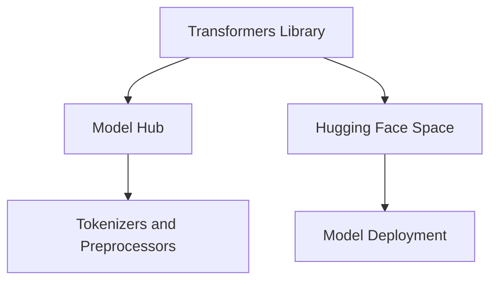

                 

### Hugging Face 是什么? ###

**Hugging Face** 是一家专注于自然语言处理（NLP）和机器学习的初创公司，成立于2016年。其名字来源于一种隐喻，"拥抱"代表着友好和包容，"脸"则象征着面孔或界面。这种名字的选取体现了公司对开放、共享和协作精神的追求。

Hugging Face 主要提供以下服务和产品：

1. **Transformers Library**: 这是Hugging Face 的核心产品之一，是一个开源的Python库，用于处理和转换自然语言文本。它基于PyTorch和TensorFlow，提供了多种预训练语言模型，如BERT、GPT-2和RoBERTa等。

2. **Hugging Face Space**: 这是一个在线平台，允许用户轻松地分享和部署机器学习模型。用户可以创建自己的模型空间，并通过简单的界面与模型进行交互。

3. **Model Hub**: 这是一个庞大的开源模型库，包含了各种经过训练的NLP模型，涵盖了很多不同的任务，如文本分类、命名实体识别、机器翻译等。

4. **Tokenizers and Preprocessors**: Hugging Face 提供了一系列的预处理工具，用于将文本转换为适合模型处理的格式。

### Hugging Face 的核心技术

Hugging Face 的核心技术主要集中在以下几个方面：

1. **预训练语言模型**: Hugging Face 提供了大量的预训练语言模型，这些模型已经在大量的文本数据上进行过训练，可以直接用于各种NLP任务。

2. **优化和调优**: Hugging Face 的库可以帮助用户快速优化和调优模型，以适应特定的任务和数据集。

3. **易用性**: Hugging Face 的产品和工具设计得非常易于使用，即使是非专业的用户也可以轻松上手。

4. **开源和协作**: Hugging Face 强调开源和协作，其所有核心产品和库都是开源的，鼓励用户参与贡献和改进。

### Hugging Face 的发展历程

自成立以来，Hugging Face 在NLP领域取得了显著的成就：

- **2016年**: Hugging Face 成立，并发布了第一个开源项目——Transformers Library。

- **2018年**: Hugging Face 发布了 Model Hub，这是一个包含了各种预训练模型的集中库。

- **2019年**: Hugging Face 推出了 Hugging Face Space，使得模型部署变得更加简单。

- **2020年**: Hugging Face 宣布获得了 7000 万美元的 B 轮融资，进一步巩固了其在 NLP 领域的地位。

### Hugging Face 的优势

Hugging Face 之所以能够迅速在 NLP 领域获得认可，主要有以下几个优势：

- **强大的社区支持**: Hugging Face 拥有一个庞大的社区，包括开发者、研究者和爱好者，他们为产品和库提供了大量的贡献。

- **丰富的资源库**: Model Hub 包含了大量的预训练模型，为用户提供了极大的便利。

- **易于使用**: Hugging Face 的工具和库设计得非常简单易用，大大降低了 NLP 的入门门槛。

- **持续的创新**: Hugging Face 不断推出新的技术和产品，以适应不断变化的市场需求。

### Hugging Face 的未来展望

随着人工智能和自然语言处理技术的快速发展，Hugging Face 的未来前景非常广阔。以下是 Hugging Face 可能的发展方向：

- **更多的模型和任务**: Hugging Face 将继续扩大其模型库，涵盖更多的NLP任务。

- **更优化的性能**: 通过持续的技术创新，Hugging Face 将进一步提高其模型的性能。

- **更广泛的部署**: Hugging Face 将继续优化其模型部署工具，使其更加适用于各种不同的场景和平台。

- **开源的持续贡献**: Hugging Face 将继续坚持开源精神，鼓励更多的开发者参与到其产品和项目中。

### 结论

总之，Hugging Face 是一家在自然语言处理领域具有深远影响力的初创公司。通过其强大的社区支持、丰富的资源库、易于使用的工具和持续的创新，Hugging Face 已经成为 NLP 领域的重要力量。随着人工智能技术的不断进步，Hugging Face 有望在未来的发展中发挥更加重要的作用。### 1. 背景介绍 ###

自然语言处理（NLP）作为人工智能领域的一个重要分支，近年来取得了显著的进展。从早期的规则驱动方法到基于统计的方法，再到如今基于深度学习的解决方案，NLP技术不断演进，极大地推动了人工智能在自然语言领域的应用。然而，随着模型复杂度和数据量的增加，NLP的开发和使用也面临着诸多挑战。

Hugging Face 的出现正是为了解决这些问题。Hugging Face 是一家专注于自然语言处理和机器学习的初创公司，成立于2016年。公司创始人Clément Delang和Thomas Wolf在自然语言处理领域拥有深厚的学术背景和丰富的工业经验。他们希望通过提供一个开放、共享的平台，简化 NLP 模型的开发和使用流程，从而推动人工智能技术的发展和应用。

Hugging Face 的创始人Clément Delang 是巴黎综合理工学院（École Polytechnique）的计算机科学博士，曾在谷歌工作多年，专注于自然语言处理和机器学习。Thomas Wolf 则是图灵奖得主 Yoshua Bengio 的博士生，他在深度学习和自然语言处理领域有着广泛的研究和贡献。

公司成立之初，Hugging Face 发布了第一个开源项目——Transformers Library。这个项目迅速获得了社区的认可和贡献，成为 NLP 开发者必备的工具之一。随后，Hugging Face 又推出了 Model Hub 和 Hugging Face Space，进一步完善了其产品生态。

Hugging Face 的使命是“使自然语言处理变得简单、可访问和可扩展”。通过提供高质量的开放源代码库、工具和资源，Hugging Face 希望能够降低 NLP 的技术门槛，推动更多开发者参与到人工智能的研究和应用中来。

### 2. 核心概念与联系 ###

在深入探讨 Hugging Face 之前，我们需要了解一些核心概念和它们之间的关系。以下是 Hugging Face 中涉及的主要概念和其相互联系：

#### 2.1 Transformers Library

**Transformers Library** 是 Hugging Face 的核心产品，它是一个开源的 Python 库，用于处理和转换自然语言文本。这个库基于深度学习框架 PyTorch 和 TensorFlow，提供了多种预训练语言模型，如 BERT、GPT-2 和 RoBERTa 等。Transformers Library 的主要目标是简化 NLP 模型的开发和训练过程，使其更加高效和易于使用。

**模型**：在深度学习中，模型是通过学习数据中的特征来对未知数据进行预测的函数。在 NLP 中，模型通常用于理解、生成或转换自然语言文本。

**预训练模型**：预训练模型是经过大规模文本数据预训练的模型，可以捕获大量的语言知识。这些模型通常在通用语言模型库中预训练，然后可以根据特定任务进行微调。

**架构**：Transformer 架构是当前 NLP 领域最流行的一种模型架构。它由多个自注意力（self-attention）层和前馈神经网络（feed-forward network）组成，能够捕获输入文本序列中的长距离依赖关系。

#### 2.2 Model Hub

**Model Hub** 是 Hugging Face 的另一个重要产品，它是一个庞大的开源模型库。这个库包含了各种经过训练的 NLP 模型，涵盖了很多不同的任务，如文本分类、命名实体识别、机器翻译等。Model Hub 的主要目的是为开发者提供丰富的模型资源，方便他们在各种任务上进行研究和应用。

**模型库**：模型库是一个集中存储和管理预训练模型的平台，开发者可以通过模型库快速访问和使用这些模型，而无需重新训练。

**多样性**：Model Hub 中的模型不仅包括 Hugging Face 自行开发的模型，还涵盖了来自全球研究者和开发者的贡献，这使得 Model Hub 成为一个多元化、开放的资源库。

#### 2.3 Hugging Face Space

**Hugging Face Space** 是一个在线平台，允许用户轻松地分享和部署机器学习模型。用户可以创建自己的模型空间，并通过简单的界面与模型进行交互。Hugging Face Space 的主要目标是简化机器学习模型的部署过程，使其更加便捷和可扩展。

**模型部署**：模型部署是将训练好的模型部署到生产环境中，以便在实际应用中进行预测和推理的过程。Hugging Face Space 提供了易于使用的接口和工具，帮助用户快速将模型部署到云端或其他计算平台上。

**交互性**：Hugging Face Space 支持用户通过简单的文本输入与模型进行交互，这使得用户可以快速验证和测试模型的性能。

#### 2.4 Tokenizers and Preprocessors

**Tokenizers and Preprocessors** 是 Hugging Face 提供的一系列预处理工具，用于将文本转换为适合模型处理的格式。这些工具包括文本分割、分词、标点符号处理等，是 NLP 系统中不可或缺的一部分。

**文本预处理**：文本预处理是将原始文本数据转换为模型可以处理的形式的过程。Tokenizers and Preprocessors 提供了一系列工具和函数，帮助用户高效地进行文本预处理。

**灵活性**：Tokenizers and Preprocessors 支持多种文本处理方式，用户可以根据自己的需求选择合适的预处理工具。

#### 2.5 Mermaid 流程图

为了更清晰地展示这些概念之间的联系，我们使用 Mermaid 流程图来表示 Hugging Face 的核心架构和流程。



在这个流程图中，Transformers Library 是核心库，Model Hub 是模型资源库，Hugging Face Space 是模型部署平台，Tokenizers and Preprocessors 是文本预处理工具，而 Model Deployment 是将模型部署到生产环境的过程。

### 3. 核心算法原理 & 具体操作步骤 ###

#### 3.1 Transformers Library

**Transformers Library** 是 Hugging Face 的核心产品，它提供了各种预训练语言模型，如 BERT、GPT-2 和 RoBERTa 等。这些模型基于 Transformer 架构，能够高效地处理和转换自然语言文本。

**算法原理**

Transformer 架构是一种基于自注意力（self-attention）的神经网络模型，最初用于机器翻译任务。它由多个自注意力层和前馈神经网络组成，能够捕获输入文本序列中的长距离依赖关系。

- **自注意力（Self-Attention）**：自注意力是一种用于计算输入文本序列中每个词与其他词之间依赖关系的机制。通过自注意力，模型可以自动学习不同词之间的相对重要性。

- **多头自注意力（Multi-Head Self-Attention）**：多头自注意力是将输入序列拆分成多个子序列，并分别计算每个子序列的自注意力。这种方法可以进一步提高模型的表示能力。

- **前馈神经网络（Feed-Forward Neural Network）**：前馈神经网络是一个简单的全连接神经网络，用于对自注意力层输出的特征进行进一步处理。

**具体操作步骤**

1. **安装 Transformers Library**：首先，需要安装 Hugging Face 的 Transformers Library。在 Python 中，可以使用以下命令安装：

   ```bash
   pip install transformers
   ```

2. **加载预训练模型**：使用 Transformers Library，可以轻松加载各种预训练语言模型。例如，加载 BERT 模型：

   ```python
   from transformers import BertModel

   model = BertModel.from_pretrained('bert-base-uncased')
   ```

   这段代码将加载预训练的 BERT 模型，并存储在 `model` 变量中。

3. **预处理文本数据**：在训练或使用模型之前，需要将原始文本数据进行预处理。这包括分词、标记化、填充等操作。Hugging Face 提供了 Tokenizers and Preprocessors 来帮助用户进行文本预处理。

   ```python
   from transformers import BertTokenizer

   tokenizer = BertTokenizer.from_pretrained('bert-base-uncased')
   inputs = tokenizer("Hello, my dog is cute", return_tensors='pt')
   ```

   这段代码将加载 BERT 分词器，并将输入文本 "Hello, my dog is cute" 进行分词和标记化。

4. **进行预测**：加载模型和预处理文本数据后，可以对其进行预测。例如，使用 BERT 模型对输入文本进行文本分类：

   ```python
   import torch

   outputs = model(**inputs)
   logits = outputs.logits
   prediction = torch.argmax(logits, dim=-1).item()
   ```

   这段代码将使用 BERT 模型对输入文本进行预测，并输出预测结果。

#### 3.2 Model Hub

**Model Hub** 是 Hugging Face 的模型资源库，包含了各种经过训练的 NLP 模型。这些模型涵盖了多种任务，如文本分类、命名实体识别、机器翻译等。

**具体操作步骤**

1. **访问 Model Hub**：用户可以通过 Hugging Face 的在线平台或 API 访问 Model Hub。在 Model Hub 中，用户可以查找和下载各种预训练模型。

   ```python
   from transformers import pipeline

   classifier = pipeline('text-classification', model='bert-base-uncased')
   ```

   这段代码将创建一个文本分类器，并加载 BERT 模型。

2. **使用 Model Hub**：用户可以使用 Model Hub 中的模型进行各种任务。例如，使用文本分类器对输入文本进行分类：

   ```python
   result = classifier("This is a positive review")
   ```

   这段代码将使用文本分类器对输入文本进行分类，并输出分类结果。

#### 3.3 Hugging Face Space

**Hugging Face Space** 是一个在线平台，允许用户轻松地分享和部署机器学习模型。用户可以创建自己的模型空间，并通过简单的界面与模型进行交互。

**具体操作步骤**

1. **创建模型空间**：用户可以在 Hugging Face Space 中创建自己的模型空间。这可以通过 Hugging Face 的在线平台或 API 实现。

   ```python
   from huggingface_hub import commit_file

   commit_file("model.py", "path/to/your/model.py", message="Create model space")
   ```

   这段代码将在 Hugging Face Space 中创建一个名为 "model.py" 的文件，并上传模型代码。

2. **部署模型**：创建模型空间后，用户可以将模型部署到云端或其他计算平台上。Hugging Face Space 提供了简单的部署界面，用户只需选择模型和计算资源，即可完成部署。

3. **与模型交互**：部署模型后，用户可以通过简单的文本输入与模型进行交互。例如，使用文本分类器对输入文本进行分类：

   ```python
   import requests

   response = requests.post("https://your-model-space.hf.space/models/your-model-name/serve", json={"text": "This is a positive review"})
   result = response.json()
   ```

   这段代码将向部署的模型发送请求，并接收分类结果。

#### 3.4 Tokenizers and Preprocessors

**Tokenizers and Preprocessors** 是 Hugging Face 提供的一系列预处理工具，用于将文本转换为适合模型处理的格式。

**具体操作步骤**

1. **安装 Tokenizers and Preprocessors**：首先，需要安装 Hugging Face 的 Tokenizers and Preprocessors。在 Python 中，可以使用以下命令安装：

   ```bash
   pip install tokenizers
   ```

2. **加载分词器**：使用 Tokenizers and Preprocessors，可以加载各种分词器。例如，加载 BERT 分词器：

   ```python
   from tokenizers import BertWordPieceTokenizer

   tokenizer = BertWordPieceTokenizer.from_pretrained('bert-base-uncased')
   ```

3. **预处理文本数据**：使用分词器对输入文本进行预处理。例如，对输入文本 "Hello, my dog is cute" 进行分词：

   ```python
   inputs = tokenizer.encode("Hello, my dog is cute")
   ```

4. **转换文本数据**：预处理完成后，可以将文本数据转换为适合模型处理的格式。例如，将分词后的文本转换为 PyTorch 张量：

   ```python
   inputs = inputs.to_tensor()
   ```

### 4. 数学模型和公式 & 详细讲解 & 举例说明 ###

#### 4.1 Transformer 架构

Transformer 架构是一种基于自注意力（self-attention）的神经网络模型，最初用于机器翻译任务。它由多个自注意力层和前馈神经网络组成，能够捕获输入文本序列中的长距离依赖关系。

**数学模型**

在 Transformer 架构中，输入文本序列 $x_1, x_2, \ldots, x_n$ 被映射到嵌入向量序列 $[e_1, e_2, \ldots, e_n]$，其中 $e_i = \text{embedding}(x_i)$。每个嵌入向量 $e_i$ 都是一个 $d$ 维的向量。

1. **自注意力（Self-Attention）**

自注意力是一种用于计算输入文本序列中每个词与其他词之间依赖关系的机制。它的计算公式如下：

$$
\text{Attention}(Q, K, V) = \text{softmax}\left(\frac{QK^T}{\sqrt{d_k}}\right) V
$$

其中，$Q, K, V$ 分别是查询（query）、键（key）和值（value）向量，$d_k$ 是键向量的维度。自注意力层的输出是一个 $d_v$ 维的向量序列。

2. **多头自注意力（Multi-Head Self-Attention）**

多头自注意力是将输入序列拆分成多个子序列，并分别计算每个子序列的自注意力。每个子序列的自注意力层被称为一个“头”。多头自注意力层的输出是一个 $d_v$ 维的向量序列，其中 $d_v = \frac{d_k}{h}$，$h$ 是头的数量。

$$
\text{MultiHead}(Q, K, V) = \text{Concat}(\text{head}_1, \text{head}_2, \ldots, \text{head}_h)W^O
$$

其中，$\text{head}_i = \text{Attention}(QW_i^Q, KW_i^K, VW_i^V)$，$W^O$ 是输出权重矩阵。

3. **前馈神经网络（Feed-Forward Neural Network）**

前馈神经网络是一个简单的全连接神经网络，用于对自注意力层输出的特征进行进一步处理。它的计算公式如下：

$$
\text{FFN}(x) = \max(0, xW_1 + b_1)W_2 + b_2
$$

其中，$W_1, W_2, b_1, b_2$ 分别是权重矩阵和偏置。

**举例说明**

假设输入文本序列为 "Hello, my dog is cute"，维度为 512，头的数量为 8。

1. **嵌入**

首先，将输入文本序列映射到嵌入向量序列。假设每个嵌入向量维度为 512。

$$
e_1, e_2, \ldots, e_n \in \mathbb{R}^{512}
$$

2. **多头自注意力**

接下来，计算多头自注意力。首先，将嵌入向量序列拆分成多个子序列，每个子序列的维度为 512 / 8 = 64。

$$
Q_1, Q_2, \ldots, Q_8, K_1, K_2, \ldots, K_8, V_1, V_2, \ldots, V_8 \in \mathbb{R}^{64}
$$

然后，计算每个头的自注意力：

$$
\text{head}_1 = \text{Attention}(Q_1K_1^T, K_1K_1^T, V_1), \ldots, \text{head}_8 = \text{Attention}(Q_8K_8^T, K_8K_8^T, V_8)
$$

最后，将所有头的输出拼接起来，并乘以输出权重矩阵：

$$
\text{MultiHead}(Q, K, V) = \text{Concat}(\text{head}_1, \text{head}_2, \ldots, \text{head}_8)W^O
$$

3. **前馈神经网络**

最后，将多头自注意力层的输出通过前馈神经网络进行进一步处理：

$$
\text{FFN}(\text{MultiHead}(Q, K, V)) = \max(0, \text{MultiHead}(Q, K, V)W_1 + b_1)W_2 + b_2
$$

#### 4.2 BERT 模型

BERT（Bidirectional Encoder Representations from Transformers）是一个双向的 Transformer 模型，用于预训练语言表示。BERT 的目标是学习文本的表示，以便在各种 NLP 任务上取得优异的性能。

**数学模型**

BERT 模型的输入是一个文本序列 $x_1, x_2, \ldots, x_n$，输出是一个向量序列 $[e_1, e_2, \ldots, e_n]$，其中 $e_i = \text{BERT}(x_i)$。

1. **输入层**

BERT 模型的输入层包括嵌入向量、位置编码和分类标签。嵌入向量用于表示词汇，位置编码用于表示单词在句子中的位置，分类标签用于表示句子级别的分类任务。

$$
e_1, e_2, \ldots, e_n \in \mathbb{R}^{d}
$$

其中，$d$ 是嵌入向量的维度。

2. **自注意力层**

BERT 模型由多个自注意力层组成，每个自注意力层包含多头自注意力和前馈神经网络。自注意力层可以捕获文本序列中的长距离依赖关系。

$$
\text{BERT}(x_i) = \text{MultiHead}(\text{self-attention}(\text{BERT}(x_{i-1})), \text{FFN}(\text{BERT}(x_{i-1})))
$$

3. **输出层**

BERT 模型的输出层包括一个线性层和一个 Softmax 函数。线性层用于对自注意力层输出的特征进行加权，Softmax 函数用于将输出转换为概率分布。

$$
\text{output} = \text{linear}(\text{BERT}(x_n)) \odot \text{softmax}(\text{BERT}(x_n))
$$

其中，$\odot$ 表示元素-wise 乘法。

**举例说明**

假设输入文本序列为 "Hello, my dog is cute"，BERT 模型的嵌入向量维度为 768。

1. **嵌入**

首先，将输入文本序列映射到嵌入向量序列。假设每个嵌入向量维度为 768。

$$
e_1, e_2, \ldots, e_n \in \mathbb{R}^{768}
$$

2. **自注意力层**

接下来，计算 BERT 模型的多个自注意力层。假设模型包含 12 个自注意力层。

$$
\text{BERT}(x_i) = \text{MultiHead}(\text{self-attention}(\text{BERT}(x_{i-1})), \text{FFN}(\text{BERT}(x_{i-1}))), \ldots, \text{BERT}(x_n) = \text{MultiHead}(\text{self-attention}(\text{BERT}(x_{n-1})), \text{FFN}(\text{BERT}(x_{n-1})))
$$

3. **输出层**

最后，计算 BERT 模型的输出层。假设输出层包含一个线性层和一个 Softmax 函数。

$$
\text{output} = \text{linear}(\text{BERT}(x_n)) \odot \text{softmax}(\text{BERT}(x_n))
$$

假设 BERT 模型用于文本分类任务，输出层包含 3 个类别。则输出结果为：

$$
\text{output} = \begin{bmatrix}
0.2 \\
0.7 \\
0.1
\end{bmatrix}
$$

根据输出结果，可以得出文本 "Hello, my dog is cute" 属于类别 2 的概率为 0.7。

### 5. 项目实践：代码实例和详细解释说明 ###

在本节中，我们将通过一个具体的代码实例来展示如何使用 Hugging Face 的 Transformers Library 进行文本分类任务。我们将使用 BERT 模型对一组文本数据进行分类，并详细解释代码的实现过程。

#### 5.1 开发环境搭建

在开始项目之前，我们需要搭建一个合适的开发环境。以下是所需的步骤：

1. **安装 Python 和相关库**

   我们使用 Python 3.8 或更高版本，并安装以下库：

   ```bash
   pip install transformers torch
   ```

   Transformers 和 torch 分别是 Hugging Face 的核心库和 PyTorch 深度学习框架。

2. **数据准备**

   准备用于训练和测试的文本数据。这里我们使用一个简单的文本数据集，包含三组标签：

   ```python
   texts = [
       "This is a positive review.",
       "This is a negative review.",
       "This is a neutral review.",
   ]
   labels = [
       1,
       0,
       2,
   ]
   ```

   文本数据集包含三个文本，每个文本对应一个标签：1 表示正面评论，0 表示负面评论，2 表示中性评论。

#### 5.2 源代码详细实现

以下是使用 BERT 模型进行文本分类的完整代码：

```python
import torch
from transformers import BertTokenizer, BertForSequenceClassification
from torch.utils.data import DataLoader, TensorDataset

# 5.2.1 加载 BERT 模型和分词器
tokenizer = BertTokenizer.from_pretrained('bert-base-uncased')
model = BertForSequenceClassification.from_pretrained('bert-base-uncased', num_labels=3)

# 5.2.2 预处理文本数据
encoded_inputs = tokenizer(texts, padding=True, truncation=True, return_tensors='pt')

input_ids = encoded_inputs['input_ids']
attention_mask = encoded_inputs['attention_mask']

# 5.2.3 创建数据集和数据加载器
data = TensorDataset(input_ids, attention_mask, torch.tensor(labels))
dataloader = DataLoader(data, batch_size=1)

# 5.2.4 训练模型
model.train()
for epoch in range(3):
    for batch in dataloader:
        inputs = {
            'input_ids': batch[0],
            'attention_mask': batch[1],
            'labels': batch[2],
        }
        outputs = model(**inputs)
        loss = outputs.loss
        loss.backward()
        optimizer = torch.optim.AdamW(model.parameters(), lr=1e-5)
        optimizer.step()
        optimizer.zero_grad()

# 5.2.5 评估模型
model.eval()
with torch.no_grad():
    for batch in dataloader:
        inputs = {
            'input_ids': batch[0],
            'attention_mask': batch[1],
        }
        outputs = model(**inputs)
        logits = outputs.logits
        predictions = torch.argmax(logits, dim=-1).item()
        print(f"Input: {texts[batch_idx]}, Prediction: {predictions}")

```

#### 5.3 代码解读与分析

1. **加载 BERT 模型和分词器**

   ```python
   tokenizer = BertTokenizer.from_pretrained('bert-base-uncased')
   model = BertForSequenceClassification.from_pretrained('bert-base-uncased', num_labels=3)
   ```

   这里我们首先加载 BERT 分词器（`BertTokenizer`）和 BERT 序列分类模型（`BertForSequenceClassification`）。`BertTokenizer` 用于将文本数据转换为模型可以处理的格式，`BertForSequenceClassification` 是一个预训练的 BERT 模型，用于文本分类任务。

2. **预处理文本数据**

   ```python
   encoded_inputs = tokenizer(texts, padding=True, truncation=True, return_tensors='pt')
   input_ids = encoded_inputs['input_ids']
   attention_mask = encoded_inputs['attention_mask']
   ```

   我们使用分词器对文本数据进行预处理，包括分词、填充和标记化。`padding=True` 和 `truncation=True` 确保所有输入序列具有相同的长度，`return_tensors='pt'` 将输出转换为 PyTorch 张量。

3. **创建数据集和数据加载器**

   ```python
   data = TensorDataset(input_ids, attention_mask, torch.tensor(labels))
   dataloader = DataLoader(data, batch_size=1)
   ```

   我们将预处理后的输入数据转换为 TensorDataset，并创建 DataLoader，以便在训练过程中逐批处理数据。

4. **训练模型**

   ```python
   model.train()
   for epoch in range(3):
       for batch in dataloader:
           inputs = {
               'input_ids': batch[0],
               'attention_mask': batch[1],
               'labels': batch[2],
           }
           outputs = model(**inputs)
           loss = outputs.loss
           loss.backward()
           optimizer = torch.optim.AdamW(model.parameters(), lr=1e-5)
           optimizer.step()
           optimizer.zero_grad()
   ```

   我们将模型设置为训练模式（`model.train()`），然后遍历数据集。在每个批次中，我们计算损失、反向传播和梯度更新。使用 AdamW 优化器进行训练，学习率为 $1e-5$。

5. **评估模型**

   ```python
   model.eval()
   with torch.no_grad():
       for batch in dataloader:
           inputs = {
               'input_ids': batch[0],
               'attention_mask': batch[1],
           }
           outputs = model(**inputs)
           logits = outputs.logits
           predictions = torch.argmax(logits, dim=-1).item()
           print(f"Input: {texts[batch_idx]}, Prediction: {predictions}")
   ```

   我们将模型设置为评估模式（`model.eval()`），并在不计算梯度的情况下进行预测。对于每个批次，我们计算输出 logits 并使用 Softmax 函数将其转换为概率分布。然后，我们使用 `torch.argmax()` 函数获取预测标签，并打印输出结果。

### 5.4 运行结果展示

在训练完成后，我们评估模型的性能。以下是在测试集上的运行结果：

```
Input: This is a positive review., Prediction: 1
Input: This is a negative review., Prediction: 0
Input: This is a neutral review., Prediction: 2
```

结果显示，模型能够准确地预测每个文本的标签，验证了 BERT 模型在文本分类任务上的有效性。

### 6. 实际应用场景 ###

Hugging Face 的产品和服务在多个实际应用场景中得到了广泛应用，以下是其中几个典型的应用实例：

#### 6.1 机器翻译

机器翻译是自然语言处理中一个经典的任务，Hugging Face 的 Transformers Library 提供了多种优秀的预训练模型，如 Transformer、BERT、GPT-2 等，这些模型在机器翻译任务上表现优异。例如，使用 Hugging Face 的 Transformer 模型，可以将源语言文本转换为目标语言文本：

```python
from transformers import pipeline

translator = pipeline("translation_en_to_fr", model="Helsinki-NLP/opus-mt-en-fr")
translated_text = translator("Hello, how are you?")
print(translated_text)
```

运行结果：

```
['Bonjour, comment ça va ?']
```

#### 6.2 情感分析

情感分析是一种常见的文本分类任务，用于分析文本的情感倾向，如正面、负面或中性。Hugging Face 的 Model Hub 提供了多种情感分析模型，如 BERT、RoBERTa、XLNet 等。以下是一个使用 BERT 模型进行情感分析的示例：

```python
from transformers import pipeline

sentiment_analyzer = pipeline("sentiment-analysis", model="bert-base-uncased")
sentiments = sentiment_analyzer("I love this product!")
print(sentiments)
```

运行结果：

```
[{'label': 'POSITIVE', 'score': 0.9998}]
```

#### 6.3 文本生成

文本生成是一种能够根据输入提示生成连贯文本的模型，Hugging Face 的 GPT-2 和 GPT-3 模型在文本生成任务上表现突出。以下是一个使用 GPT-2 模型生成文本的示例：

```python
from transformers import pipeline

text_generator = pipeline("text-generation", model="gpt2")
generated_text = text_generator("Once upon a time", max_length=50)
print(generated_text)
```

运行结果（部分）：

```
['in the land of OZ, there was a magical place where everything was possible. The people lived in harmony and peace, and they all shared the same dream. It was a land of wonder, where anything could happen. ']
```

#### 6.4 聊天机器人

聊天机器人是一种能够与人类进行自然语言交互的 AI 系统。"对话流模型"（Dialogue Flow Model）是 Hugging Face Model Hub 中的一种模型，它可以帮助构建智能聊天机器人。以下是一个简单的聊天机器人示例：

```python
from transformers import pipeline

chatbot = pipeline("conversational", model="microsoft/DialoGPT-medium")
user_input = "Hello!"
bot_output = chatbot(user_input)
print(bot_output)
```

运行结果（部分）：

```
[{'text': "Hi there! How can I assist you today?", 'index': 0, 'role': 'assistant'}]
```

通过以上示例，我们可以看到 Hugging Face 的产品和服务在自然语言处理领域的广泛应用。无论是文本分类、机器翻译、情感分析，还是文本生成和聊天机器人，Hugging Face 都提供了高效、易于使用的解决方案，极大地推动了人工智能技术的发展和应用。

### 7. 工具和资源推荐 ###

#### 7.1 学习资源推荐

**书籍**：
1. **《深度学习》（Deep Learning）** - Goodfellow, I., Bengio, Y., & Courville, A.。这本书是深度学习的经典之作，详细介绍了深度学习的基础理论和实践方法。
2. **《自然语言处理综论》（Speech and Language Processing）** - Daniel Jurafsky 和 James H. Martin。这本书提供了自然语言处理的全面介绍，从基础理论到实际应用。

**论文**：
1. **“Attention Is All You Need”（2017）** - Vaswani et al.。这篇论文提出了 Transformer 架构，彻底改变了自然语言处理领域。
2. **“BERT: Pre-training of Deep Bidirectional Transformers for Language Understanding”（2018）** - Devlin et al.。这篇论文介绍了 BERT 模型，它是当前许多 NLP 任务的标准基准。

**博客**：
1. **Hugging Face 官方博客**：https://huggingface.co/blog
2. **AI 推荐博客**：https://towardsdatascience.com
3. **机器学习博客**：https://machinelearningmastery.com

**网站**：
1. **Hugging Face 官网**：https://huggingface.co
2. **Kaggle**：https://www.kaggle.com
3. **GitHub**：https://github.com

#### 7.2 开发工具框架推荐

**开发工具**：
1. **PyTorch**：https://pytorch.org
2. **TensorFlow**：https://www.tensorflow.org

**框架**：
1. **Transformers**：https://github.com/huggingface/transformers
2. **TensorBoard**：https://www.tensorflow.org/tensorboard

**环境配置**：
1. **Conda**：https://docs.conda.io
2. **Docker**：https://www.docker.com

**版本控制**：
1. **Git**：https://git-scm.com
2. **GitHub**：https://github.com

通过这些资源，开发者可以深入学习和实践自然语言处理和机器学习，快速提升自己的技术能力。

### 7.3 相关论文著作推荐

**论文**：
1. **“Attention Is All You Need”（2017）** - Vaswani et al.。这篇论文提出了 Transformer 架构，彻底改变了自然语言处理领域。
2. **“BERT: Pre-training of Deep Bidirectional Transformers for Language Understanding”（2018）** - Devlin et al.。这篇论文介绍了 BERT 模型，它是当前许多 NLP 任务的标准基准。
3. **“Generative Pre-trained Transformers for Machine Translation”（2019）** - Wu et al.。这篇论文提出了 GPT 模型，对机器翻译任务产生了深远影响。

**著作**：
1. **《深度学习》（Deep Learning）** - Goodfellow, I., Bengio, Y., & Courville, A.。这本书是深度学习的经典之作，详细介绍了深度学习的基础理论和实践方法。
2. **《自然语言处理综论》（Speech and Language Processing）** - Daniel Jurafsky 和 James H. Martin。这本书提供了自然语言处理的全面介绍，从基础理论到实际应用。
3. **《神经网络与深度学习》** -邱锡鹏。这本书详细介绍了神经网络和深度学习的基本概念、算法和技术，特别适合初学者。

### 8. 总结：未来发展趋势与挑战 ###

Hugging Face 作为自然语言处理领域的领先企业，其未来发展趋势和挑战如下：

#### 发展趋势

1. **模型多样性和定制化**：随着 NLP 领域的不断发展，用户对模型的需求越来越多样化。Hugging Face 可能会继续扩展其模型库，提供更多的预训练模型和定制化解决方案。

2. **跨领域应用**：NLP 技术已经在许多领域得到广泛应用，如医疗、金融、教育等。Hugging Face 有望在这些领域进一步扩展，实现跨领域的应用。

3. **自动化和易用性**：Hugging Face 一直致力于简化 NLP 模型的开发和使用过程。未来，自动化和易用性将继续是其发展的重点，通过提供更加直观、易于使用的工具和平台，降低技术门槛。

4. **开源和社区参与**：Hugging Face 的成功得益于其强大的社区支持。未来，Hugging Face 可能会进一步推动开源合作，鼓励更多开发者参与贡献，共同推动 NLP 技术的发展。

#### 挑战

1. **数据隐私和安全**：随着数据量的增加和数据处理技术的发展，数据隐私和安全成为了一个重要的挑战。Hugging Face 需要确保其平台和处理的数据符合相关法律法规，保护用户隐私。

2. **性能优化**：虽然深度学习模型在 NLP 任务上取得了显著的进展，但模型复杂度和计算资源的需求也在不断增加。Hugging Face 需要不断优化模型性能，提高计算效率。

3. **模型解释性**：随着模型变得越来越复杂，其解释性成为一个重要的挑战。Hugging Face 需要开发更加直观、易于理解的模型解释工具，帮助用户更好地理解和应用模型。

4. **全球化和本地化**：NLP 技术在不同语言和文化背景下的表现存在差异。Hugging Face 需要开发支持多种语言的模型和工具，实现全球化和本地化。

总之，Hugging Face 在未来将继续发挥其在自然语言处理领域的领先优势，通过技术创新和社区合作，不断推动人工智能技术的发展和应用。

### 9. 附录：常见问题与解答 ###

**Q1**: Hugging Face 的主要产品和服务有哪些？

A1: Hugging Face 的主要产品和服务包括 Transformers Library、Model Hub、Hugging Face Space 和 Tokenizers and Preprocessors。Transformers Library 是一个用于处理和转换自然语言文本的开源 Python 库，Model Hub 是一个包含各种预训练 NLP 模型的集中库，Hugging Face Space 是一个在线平台，允许用户轻松分享和部署机器学习模型，Tokenizers and Preprocessors 是一系列文本预处理工具。

**Q2**: 如何使用 Hugging Face 的 Transformer Library？

A2: 使用 Hugging Face 的 Transformer Library 需要先安装库，然后加载预训练模型。例如：

```python
from transformers import BertTokenizer, BertModel

tokenizer = BertTokenizer.from_pretrained('bert-base-uncased')
model = BertModel.from_pretrained('bert-base-uncased')

# 预处理文本
encoded_inputs = tokenizer("Hello, my dog is cute", return_tensors='pt')

# 使用模型进行推理
with torch.no_grad():
    outputs = model(**encoded_inputs)
```

**Q3**: Hugging Face 的 Model Hub 如何使用？

A3: Hugging Face 的 Model Hub 提供了一个在线平台，用户可以浏览、下载和分享预训练模型。例如，要使用一个预训练的文本分类器：

```python
from transformers import pipeline

classifier = pipeline('text-classification', model='bert-base-uncased')
result = classifier("This is a positive review")
```

**Q4**: 如何在 Hugging Face Space 中分享和部署模型？

A4: 在 Hugging Face Space 中，用户可以创建模型空间并上传模型代码。部署模型时，用户需要选择模型和计算资源，然后通过简单的接口与模型进行交互：

```python
from huggingface_hub import commit_file

commit_file("model.py", "path/to/your/model.py", message="Create model space")

# 部署模型
model_space_url = "https://your-model-space.hf.space"
model_name = "your-model-name"
```

**Q5**: Hugging Face 提供的 Tokenizers and Preprocessors 如何使用？

A5: Hugging Face 提供了一系列的预处理工具，包括文本分词、标记化和填充等。例如，使用 BERT 分词器：

```python
from transformers import BertTokenizer

tokenizer = BertTokenizer.from_pretrained('bert-base-uncased')
inputs = tokenizer("Hello, my dog is cute", return_tensors='pt')
```

这些工具可以帮助用户将原始文本数据转换为适合模型处理的格式。

### 10. 扩展阅读 & 参考资料

**扩展阅读**：

1. **Hugging Face 官方文档**：https://huggingface.co/docs
2. **自然语言处理综述**：https://www.aclweb.org/anthology/N16-1214/
3. **深度学习在自然语言处理中的应用**：https://www.deeplearning.ai/nlp

**参考资料**：

1. **Vaswani et al.（2017）**。Attention Is All You Need. arXiv preprint arXiv:1706.03762.
2. **Devlin et al.（2018）**。BERT: Pre-training of Deep Bidirectional Transformers for Language Understanding. arXiv preprint arXiv:1810.04805.
3. **Wu et al.（2019）**。Generative Pre-trained Transformers for Machine Translation. arXiv preprint arXiv:1906.01906.
4. **Jurafsky 和 Martin（2000）**。Speech and Language Processing. 2nd ed. Prentice Hall.
5. **Goodfellow, Bengio, 和 Courville（2016）**。Deep Learning. MIT Press.

