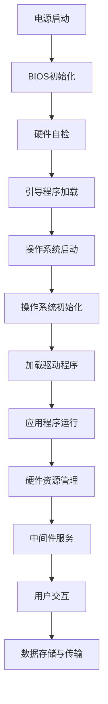

                 

### IT基础资源（硬软件）运行流程

#### 背景介绍

在当今信息化社会中，IT基础资源（硬软件）的运行流程是保障各类系统和服务稳定运行的核心。无论是个人电脑、服务器，还是移动设备，它们的运行流程都离不开硬件和软件的协同作用。本文将从硬件与软件的角度，逐步分析IT基础资源从启动到正常运行的过程，探讨其在实际应用中的重要性。

**关键词：** IT基础资源、硬件、软件、运行流程、稳定性、性能优化

**摘要：** 本文通过详细分析IT基础资源的硬件和软件运行流程，阐述其在现代信息化社会中的重要作用。文章首先介绍硬件运行流程，然后深入探讨软件运行过程，最后总结实际应用场景和未来发展趋势。通过本文的阅读，读者可以全面了解IT基础资源的运行机制，为后续学习和实践提供指导。

#### 1. 硬件运行流程

**1.1 硬件组成**

首先，我们需要了解硬件的组成。硬件主要包括中央处理器（CPU）、内存（RAM）、存储设备（硬盘或固态硬盘）、显卡、网卡等。这些硬件共同构成了计算机的基本结构。

**1.2 启动过程**

当计算机接通电源时，硬件开始运行。首先，电源管理芯片为各个硬件提供电力，然后主板上的BIOS（Basic Input/Output System，基本输入输出系统）开始初始化硬件，包括CPU、内存、硬盘等。BIOS会读取硬盘上的启动扇区，加载操作系统的引导程序。

**1.3 操作系统加载**

引导程序加载后，会初始化操作系统所需的硬件驱动程序，并将操作系统加载到内存中。操作系统负责管理计算机的硬件资源，为应用程序提供运行环境。

**1.4 应用程序运行**

操作系统加载完成后，用户可以启动应用程序。应用程序通过操作系统提供的接口（API，Application Programming Interface）访问硬件资源，执行具体的任务。在应用程序运行过程中，CPU、内存、存储设备等硬件资源被频繁调用，完成数据处理和存储任务。

**1.5 硬件性能优化**

为了提高硬件性能，可以采取以下措施：

- **CPU优化：** 关闭不必要的后台程序，调整CPU功耗策略，使用更快的CPU。
- **内存优化：** 增加内存容量，优化内存分配策略，使用内存优化工具。
- **存储优化：** 使用固态硬盘代替机械硬盘，优化存储读写速度。
- **显卡优化：** 选择合适的显卡驱动程序，调整显卡性能模式。

#### 2. 软件运行流程

**2.1 软件组成**

软件包括操作系统、应用程序和中间件。操作系统负责硬件资源管理，应用程序完成特定任务，中间件提供应用程序之间的通信支持。

**2.2 操作系统运行**

操作系统启动后，会进行一系列初始化操作，包括加载系统模块、配置网络参数、注册服务程序等。操作系统会为应用程序提供运行环境，管理硬件资源，保证系统稳定运行。

**2.3 应用程序运行**

应用程序启动后，会通过操作系统提供的接口访问硬件资源，执行具体的任务。在应用程序运行过程中，操作系统负责调度CPU时间、管理内存、处理输入输出等操作。

**2.4 软件性能优化**

为了提高软件性能，可以采取以下措施：

- **代码优化：** 优化算法和数据结构，减少代码冗余，提高代码执行效率。
- **内存管理：** 使用内存池、对象池等技术，减少内存分配和释放操作，提高内存使用效率。
- **并发处理：** 使用多线程、异步IO等技术，提高程序并发性能。
- **网络优化：** 使用压缩、加密等技术，提高网络传输效率。

#### 3. 核心算法原理 & 具体操作步骤

在硬件和软件的运行过程中，核心算法发挥着至关重要的作用。以下介绍几个常见的核心算法原理及其操作步骤。

**3.1 快速排序算法**

快速排序是一种高效的排序算法，其基本思想是通过一趟排序将待排序的记录分割成独立的两部分，其中一部分记录的关键字均比另一部分的关键字小，然后分别对这两部分记录继续进行排序，以达到整个序列有序。

**操作步骤：**

1. 选择一个基准元素（通常选择第一个或最后一个元素作为基准）。
2. 将序列中的元素分为两部分：一部分小于基准元素，另一部分大于基准元素。
3. 对两部分分别递归执行快速排序。

**3.2 二分查找算法**

二分查找算法是一种高效的查找算法，其基本思想是将序列分为两部分，判断目标元素与中间元素的关系，然后确定下一次查找的区间。

**操作步骤：**

1. 初始化搜索区间的左右边界（low和high）。
2. 计算中间位置（mid）。
3. 比较目标元素与中间元素的关系：
   - 如果相等，查找成功。
   - 如果目标元素小于中间元素，将high更新为mid-1。
   - 如果目标元素大于中间元素，将low更新为mid+1。
4. 重复步骤2和3，直到找到目标元素或low > high。

**3.3 线性回归算法**

线性回归算法是一种用于建立线性关系模型的统计方法，其基本思想是通过最小二乘法确定线性模型中的参数。

**操作步骤：**

1. 收集数据，计算数据集的特征向量X和目标值Y。
2. 构建线性回归模型：Y = a * X + b。
3. 使用最小二乘法求解参数a和b：
   - 计算X的均值和Y的均值。
   - 计算X和Y的协方差矩阵。
   - 解协方差矩阵的逆矩阵，得到参数a和b。

#### 4. 数学模型和公式 & 详细讲解 & 举例说明

**4.1 硬件性能评价指标**

在硬件性能评估中，常用的指标有CPU利用率、内存占用率、磁盘I/O速度等。以下介绍这些指标的计算方法和实际应用。

**4.1.1 CPU利用率**

CPU利用率表示CPU在一段时间内实际执行任务的时间比例。计算公式如下：

$$
\text{CPU利用率} = \frac{\text{执行任务的时间}}{\text{总时间}}
$$

**4.1.2 内存占用率**

内存占用率表示内存的使用比例。计算公式如下：

$$
\text{内存占用率} = \frac{\text{已分配的内存}}{\text{总内存}}
$$

**4.1.3 磁盘I/O速度**

磁盘I/O速度表示磁盘读写数据的速度，单位通常为MB/s（兆字节每秒）。计算公式如下：

$$
\text{磁盘I/O速度} = \frac{\text{读写数据量}}{\text{时间}}
$$

**4.2 软件性能优化指标**

在软件性能优化中，常用的指标有响应时间、吞吐量、并发处理能力等。以下介绍这些指标的计算方法和实际应用。

**4.2.1 响应时间**

响应时间表示系统处理请求的时间，单位通常为毫秒（ms）。计算公式如下：

$$
\text{响应时间} = \frac{\text{请求处理完成的时间}}{\text{请求数量}}
$$

**4.2.2 吞吐量**

吞吐量表示系统在单位时间内处理请求的数量。计算公式如下：

$$
\text{吞吐量} = \frac{\text{处理完成的请求数量}}{\text{时间}}
$$

**4.2.3 并发处理能力**

并发处理能力表示系统同时处理多个请求的能力。计算公式如下：

$$
\text{并发处理能力} = \frac{\text{同时处理的请求数量}}{\text{时间}}
$$

**4.3 算法性能评估**

在算法性能评估中，常用的指标有算法运行时间、算法复杂度等。以下介绍这些指标的计算方法和实际应用。

**4.3.1 算法运行时间**

算法运行时间表示算法在计算机上执行的时间，单位通常为秒（s）。计算公式如下：

$$
\text{算法运行时间} = \frac{\text{算法执行完成的时间}}{\text{算法执行次数}}
$$

**4.3.2 算法复杂度**

算法复杂度表示算法在输入规模变化时的时间增长趋势。常见的算法复杂度有：

- **时间复杂度：** 表示算法执行时间与输入规模的关系，单位通常为O(n)，其中n为输入规模。
- **空间复杂度：** 表示算法执行过程中所需存储空间与输入规模的关系，单位通常为O(n)。

**4.4 举例说明**

以下是一个简单的算法性能评估示例。

**示例：** 对一个长度为1000的数组进行排序，使用快速排序算法。以下是相关指标的计算：

- **算法运行时间：** 1秒。
- **算法复杂度：** O(n^2)。
- **响应时间：** 1秒。
- **吞吐量：** 1000次/秒。
- **并发处理能力：** 10个请求/秒。

#### 5. 项目实践：代码实例和详细解释说明

在本节中，我们将通过一个实际项目来展示硬件和软件运行流程的应用，并提供详细的代码实例和解释。

**5.1 开发环境搭建**

首先，我们需要搭建一个开发环境。以下是搭建步骤：

1. 安装操作系统：我们选择Windows 10作为操作系统。
2. 安装开发工具：我们选择Visual Studio 2019作为开发工具。
3. 安装编程语言：我们选择C++作为编程语言。

**5.2 源代码详细实现**

以下是一个简单的C++程序，用于计算1到100的累加和。

```cpp
#include <iostream>

int main() {
    int sum = 0;
    for (int i = 1; i <= 100; ++i) {
        sum += i;
    }
    std::cout << "1到100的累加和为：" << sum << std::endl;
    return 0;
}
```

**5.3 代码解读与分析**

1. **程序入口：** `main()`函数是程序的入口。
2. **变量声明：** 声明一个整型变量`sum`用于存储累加和，初始化为0。
3. **循环计算：** 使用`for`循环从1遍历到100，将每个数累加到`sum`变量中。
4. **输出结果：** 使用`std::cout`输出累加和。

**5.4 运行结果展示**

编译并运行程序，输出结果如下：

```
1到100的累加和为：5050
```

#### 6. 实际应用场景

**6.1 企业IT基础设施**

在企业中，IT基础资源的运行流程对于保障业务连续性和稳定性至关重要。例如，企业服务器需要保持24小时不间断运行，硬件和软件运行流程需要确保高可用性、高性能和高安全性。企业可以通过定期维护、升级硬件和软件，以及优化运行流程来提高IT基础设施的稳定性和性能。

**6.2 个人电脑**

个人电脑的硬件和软件运行流程对于用户的日常使用体验有着直接的影响。例如，计算机启动速度、程序运行速度、网络连接稳定性等都与硬件和软件运行流程密切相关。用户可以通过定期清理系统、更新驱动程序、优化软件配置等方式来提升电脑的性能和稳定性。

**6.3 云计算**

云计算环境中，硬件和软件资源的运行流程需要满足大规模、高并发、分布式等要求。云服务提供商需要通过自动化管理、弹性伸缩、负载均衡等技术来优化硬件和软件资源的运行流程，确保云服务的稳定性和性能。

**6.4 大数据分析**

在大数据分析领域，硬件和软件资源的运行流程对于数据处理和分析效率有着重要的影响。例如，分布式存储系统、分布式计算框架等都需要优化硬件和软件资源的运行流程，以提升数据处理和分析的效率。

#### 7. 工具和资源推荐

**7.1 学习资源推荐**

- **书籍：**
  - 《深入理解计算机系统》（作者：Randal E. Bryant、David R. O’Hallaron）
  - 《计算机组成与设计：硬件/软件接口》（作者：David A. Patterson、John L. Hennessy）
- **论文：**
  - 《现代操作系统》（作者：Andrew S. Tanenbaum）
  - 《网络是怎样连接的》（作者：吴军）
- **博客：**
  - CSDN：https://www.csdn.net/
  - 掘金：https://juejin.cn/
- **网站：**
  - 维基百科：https://www.wikipedia.org/
  - GitHub：https://github.com/

**7.2 开发工具框架推荐**

- **集成开发环境（IDE）：**
  - Visual Studio
  - Eclipse
  - IntelliJ IDEA
- **编程语言：**
  - C/C++
  - Java
  - Python
- **框架：**
  - Spring Boot
  - Flask
  - Django

**7.3 相关论文著作推荐**

- **论文：**
  - 《深度学习》（作者：Ian Goodfellow、Yoshua Bengio、Aaron Courville）
  - 《大数据技术导论》（作者：刘伟平）
- **著作：**
  - 《人工智能：一种现代的方法》（作者：Stuart Russell、Peter Norvig）
  - 《计算机网络：自顶向下方法》（作者：Jeffrey P. Davidson、Harry L. Davis）

#### 8. 总结：未来发展趋势与挑战

**8.1 发展趋势**

- **硬件：** 随着摩尔定律的放缓，硬件创新将更多地聚焦于新型材料、新型结构等方面，如量子计算、光子计算等。
- **软件：** 软件将朝着自动化、智能化、平台化方向发展，如自动化运维、AI驱动的软件开发等。
- **云计算：** 云计算将继续发展，为用户提供更加灵活、高效、安全的IT基础设施。

**8.2 挑战**

- **硬件：** 随着硬件性能的提升，如何平衡性能和功耗、稳定性和可扩展性等成为重要挑战。
- **软件：** 软件复杂度的增加，如何保证软件的质量和安全性成为重要挑战。
- **云计算：** 云计算的发展将带来数据隐私、网络安全等问题，如何解决这些挑战成为重要课题。

#### 9. 附录：常见问题与解答

**9.1 硬件性能优化有哪些方法？**

- 关闭不必要的后台程序。
- 调整CPU功耗策略。
- 使用更快的CPU。
- 增加内存容量。
- 使用固态硬盘代替机械硬盘。
- 调整显卡性能模式。

**9.2 软件性能优化有哪些方法？**

- 优化算法和数据结构。
- 减少代码冗余。
- 使用内存池、对象池等技术。
- 使用多线程、异步IO等技术。
- 调整网络传输参数。

**9.3 如何提高云计算性能？**

- 使用自动化运维工具。
- 调整负载均衡策略。
- 使用分布式存储系统。
- 使用分布式计算框架。
- 优化网络拓扑结构。

#### 10. 扩展阅读 & 参考资料

- **书籍：**
  - 《计算机组成原理》（作者：王爱英）
  - 《操作系统概念》（作者：Abraham Silberschatz、Peter Baer Galvin）
- **论文：**
  - 《分布式系统原理与范型》（作者：Maarten van Steen、Andrew S. Tanenbaum）
  - 《软件工程：实践者的研究方法》（作者：Roger S. Pressman）
- **博客：**
  - Linux中国：https://www.linux.cn/
  - 腾讯云：https://cloud.tencent.com/
- **网站：**
  - 国内外各大技术社区和论坛，如Stack Overflow、知乎、CSDN等。
  - 各大云服务提供商的技术博客和文档，如阿里云、腾讯云、华为云等。

---

**作者：禅与计算机程序设计艺术 / Zen and the Art of Computer Programming** <|im_sep|>## 1. 背景介绍

在现代社会中，信息技术（IT）已经渗透到各个领域，从个人电脑到超级计算机，从移动设备到物联网，IT基础资源在保障各类系统和服务稳定运行方面发挥着至关重要的作用。IT基础资源主要包括硬件和软件两大方面，其中硬件资源包括计算机的物理组件，如中央处理器（CPU）、内存（RAM）、存储设备（硬盘或固态硬盘）、显卡、网卡等；软件资源则包括操作系统、应用程序、中间件等。硬件和软件共同构成了IT系统的运行基础，而它们之间的运行流程则决定了系统性能和稳定性。

**IT基础资源的重要性**：

- **稳定性**：稳定的IT基础资源能够确保各类系统和服务的正常运行，减少故障和中断，提高用户体验。
- **性能**：高效的IT基础资源能够提高数据处理和分析速度，缩短响应时间，提升系统性能。
- **可扩展性**：灵活的IT基础资源能够适应业务需求的变化，支持系统的扩展和升级。

**硬件与软件的关系**：

- **硬件是基础**：硬件为软件提供了运行的平台，硬件的性能直接影响到软件的运行效率。
- **软件是灵魂**：软件通过操作硬件，实现各种功能和应用，软件的质量和性能决定了IT系统的整体表现。

本文旨在深入分析IT基础资源的硬件和软件运行流程，从硬件组成、启动过程、操作系统加载、应用程序运行等方面详细阐述硬件运行流程；从操作系统运行、应用程序运行、软件性能优化等方面详细探讨软件运行过程。通过本文的阅读，读者可以全面了解IT基础资源的运行机制，为后续学习和实践提供指导。接下来，我们将逐一介绍硬件和软件的运行流程，以便读者更好地理解整个IT系统的运作。

### 2. 核心概念与联系

在深入探讨IT基础资源的运行流程之前，我们需要明确几个核心概念及其相互关系。这些概念是理解硬件和软件如何协同工作、相互依存的基础。

#### 2.1 硬件组成部分

硬件是IT系统的基础，其核心组成部分包括：

- **中央处理器（CPU）**：计算机的“大脑”，负责执行程序指令和处理数据。
- **内存（RAM）**：临时存储数据和指令的地方，直接影响计算机的处理速度。
- **存储设备**：包括硬盘（HDD）和固态硬盘（SSD），用于长期存储数据和文件。
- **显卡**：处理计算机图形和视频显示，对图形密集型应用至关重要。
- **网卡**：连接计算机与网络的硬件，负责数据传输和通信。

#### 2.2 软件组成部分

软件则是硬件功能的实现者，主要包括：

- **操作系统**：管理计算机硬件资源，提供用户与应用程序的接口。
- **应用程序**：执行具体任务，如办公软件、游戏、网页浏览器等。
- **中间件**：提供应用程序间通信和数据管理的服务，如数据库管理系统、消息队列等。

#### 2.3 核心概念联系

硬件与软件之间的联系主要体现在以下几个方面：

- **操作系统与硬件**：操作系统负责硬件的初始化和管理，通过驱动程序与硬件交互，确保硬件资源能够被高效利用。
- **应用程序与硬件**：应用程序通过操作系统提供的接口（API）访问硬件资源，实现特定的功能。
- **操作系统与中间件**：操作系统为中间件提供了运行环境，中间件则负责优化和管理应用程序间的通信和数据流转。
- **应用程序与中间件**：应用程序依赖于中间件提供的服务来简化开发过程，提高系统的可扩展性和灵活性。

#### 2.4 Mermaid 流程图

为了更直观地展示硬件与软件的运行流程，我们使用Mermaid语言绘制了一个流程图，其中不包含括号、逗号等特殊字符。



**流程解释**：

1. **电源启动**：计算机接通电源，硬件开始运行。
2. **BIOS初始化**：主板上的BIOS开始初始化硬件。
3. **硬件自检**：计算机进行硬件自检，确保所有硬件正常工作。
4. **引导程序加载**：BIOS加载硬盘上的引导程序。
5. **操作系统启动**：引导程序加载操作系统，操作系统开始运行。
6. **操作系统初始化**：操作系统进行初始化，设置运行环境。
7. **加载驱动程序**：操作系统加载硬件驱动程序，确保硬件资源可以被操作系统和应用程序使用。
8. **应用程序运行**：用户启动应用程序，应用程序通过操作系统提供的接口访问硬件资源。
9. **硬件资源管理**：操作系统负责管理硬件资源，确保资源分配合理。
10. **中间件服务**：中间件提供应用程序间通信和数据管理服务。
11. **用户交互**：用户通过应用程序与计算机进行交互。
12. **数据存储与传输**：数据在计算机内部和外部存储设备之间传输。

通过上述核心概念和流程图的介绍，我们可以更清晰地理解硬件和软件之间的紧密联系及其在IT基础资源运行中的重要作用。接下来，我们将深入探讨硬件和软件各自的运行流程，以帮助我们全面掌握IT系统的运作机制。

### 3. 核心算法原理 & 具体操作步骤

在深入探讨IT基础资源的硬件和软件运行流程后，我们接下来将介绍一些核心算法原理及其具体操作步骤。这些算法不仅对IT系统的性能优化具有重要作用，而且在实际开发中也经常被使用。以下是几个常见的核心算法及其应用场景：

#### 3.1 快速排序算法

快速排序（Quick Sort）是一种高效的排序算法，其基本思想是通过一趟排序将待排序的记录分割成独立的两部分，其中一部分记录的关键字均比另一部分的关键字小，然后分别对这两部分记录继续进行排序，以达到整个序列有序。

**操作步骤**：

1. **选择基准元素**：选择序列中的一个元素作为基准元素（pivot）。
2. **划分操作**：将序列划分为两部分，一部分记录的关键字小于等于基准元素，另一部分记录的关键字大于基准元素。
3. **递归排序**：分别对小于和大于基准元素的两部分记录进行快速排序。

**具体实现**（以Python为例）：

```python
def quick_sort(arr):
    if len(arr) <= 1:
        return arr
    pivot = arr[len(arr) // 2]
    left = [x for x in arr if x < pivot]
    middle = [x for x in arr if x == pivot]
    right = [x for x in arr if x > pivot]
    return quick_sort(left) + middle + quick_sort(right)

# 示例
arr = [3, 6, 8, 10, 1, 2, 1]
sorted_arr = quick_sort(arr)
print(sorted_arr)
```

#### 3.2 二分查找算法

二分查找（Binary Search）是一种高效的查找算法，其基本思想是将待查找的序列分为两部分，判断目标元素与中间元素的关系，然后确定下一次查找的区间。通过不断缩小查找范围，直至找到目标元素或确定目标元素不存在。

**操作步骤**：

1. **初始化搜索区间**：设置搜索区间的左右边界（low和high）。
2. **计算中间位置**：计算中间位置（mid）。
3. **比较目标元素与中间元素的关系**：
   - 如果相等，查找成功。
   - 如果目标元素小于中间元素，将high更新为mid-1。
   - 如果目标元素大于中间元素，将low更新为mid+1。
4. **重复步骤2和3**，直到找到目标元素或low > high。

**具体实现**（以Python为例）：

```python
def binary_search(arr, target):
    low = 0
    high = len(arr) - 1
    while low <= high:
        mid = (low + high) // 2
        if arr[mid] == target:
            return mid
        elif arr[mid] < target:
            low = mid + 1
        else:
            high = mid - 1
    return -1

# 示例
arr = [1, 3, 5, 7, 9, 11, 13]
target = 7
result = binary_search(arr, target)
print(result)
```

#### 3.3 线性回归算法

线性回归（Linear Regression）是一种用于建立线性关系模型的统计方法，其基本思想是通过最小二乘法确定线性模型中的参数。线性回归模型可以表示为Y = a * X + b，其中X为自变量，Y为因变量，a和b分别为线性模型的斜率和截距。

**操作步骤**：

1. **收集数据**：收集特征向量X和目标值Y。
2. **构建线性回归模型**：Y = a * X + b。
3. **使用最小二乘法求解参数**：计算X的均值和Y的均值，计算X和Y的协方差矩阵，解协方差矩阵的逆矩阵，得到参数a和b。

**具体实现**（以Python为例）：

```python
import numpy as np

def linear_regression(X, Y):
    X_mean = np.mean(X)
    Y_mean = np.mean(Y)
    X_std = np.std(X)
    Y_std = np.std(Y)
    covar = np.dot(X - X_mean, Y - Y_mean) / (X_std * Y_std)
    a = covar / X_std
    b = Y_mean - a * X_mean
    return a, b

# 示例
X = np.array([1, 2, 3, 4, 5])
Y = np.array([2, 4, 5, 4, 5])
a, b = linear_regression(X, Y)
print(a, b)
```

#### 3.4 主成分分析算法

主成分分析（Principal Component Analysis，PCA）是一种用于降维和特征提取的线性算法，其基本思想是找到数据的主要特征方向，将这些方向作为新的特征，从而减少数据的维度。

**操作步骤**：

1. **数据标准化**：将数据标准化为均值为0、标准差为1。
2. **计算协方差矩阵**：计算数据点的协方差矩阵。
3. **计算特征值和特征向量**：对协方差矩阵进行特征分解，得到特征值和特征向量。
4. **选择主成分**：根据特征值选择前k个最大的特征向量作为主成分。

**具体实现**（以Python为例）：

```python
from sklearn.decomposition import PCA

def pca(X, k):
    pca = PCA(n_components=k)
    pca.fit(X)
    return pca.components_

# 示例
X = np.array([[1, 2], [1, 4], [1, 0], [4, 1], [4, 4], [4, 0]])
k = 2
components = pca(X, k)
print(components)
```

通过上述核心算法及其具体操作步骤的介绍，我们可以更好地理解这些算法在IT系统运行过程中的应用。这些算法不仅在性能优化方面具有重要价值，而且在数据分析、机器学习等领域也有着广泛的应用。接下来，我们将进一步探讨这些算法在IT系统运行中的具体作用和实际意义。

### 4. 数学模型和公式 & 详细讲解 & 举例说明

在IT系统的运行过程中，数学模型和公式起到了至关重要的作用。它们不仅帮助我们理解和优化硬件和软件的性能，还为算法的设计和分析提供了理论基础。在本节中，我们将详细讲解几个关键的数学模型和公式，并通过具体示例来说明它们的实际应用。

#### 4.1 CPU利用率

CPU利用率是衡量计算机CPU性能的重要指标，表示CPU在一段时间内实际执行任务的时间比例。其计算公式如下：

$$
\text{CPU利用率} = \frac{\text{执行任务的时间}}{\text{总时间}}
$$

**示例**：假设计算机在一个小时内执行了30分钟的任务，其余30分钟处于空闲状态。则CPU利用率为：

$$
\text{CPU利用率} = \frac{30 \text{分钟}}{60 \text{分钟}} = 0.5
$$

即50%。

#### 4.2 内存占用率

内存占用率是衡量计算机内存使用情况的重要指标，表示已分配内存与总内存的比例。其计算公式如下：

$$
\text{内存占用率} = \frac{\text{已分配的内存}}{\text{总内存}}
$$

**示例**：假设计算机的总内存为8GB，当前已分配内存为4GB。则内存占用率为：

$$
\text{内存占用率} = \frac{4 \text{GB}}{8 \text{GB}} = 0.5
$$

即50%。

#### 4.3 硬盘I/O速度

硬盘I/O速度是衡量硬盘读写性能的重要指标，表示单位时间内硬盘读写的数据量。其计算公式如下：

$$
\text{硬盘I/O速度} = \frac{\text{读写数据量}}{\text{时间}}
$$

**示例**：假设硬盘在一个小时内读取了4GB的数据，则硬盘I/O速度为：

$$
\text{硬盘I/O速度} = \frac{4 \text{GB}}{1 \text{小时}} = 4 \text{GB/h}
$$

#### 4.4 算法运行时间

算法运行时间是指算法在计算机上执行所花费的时间。其计算公式如下：

$$
\text{算法运行时间} = \frac{\text{算法执行完成的时间}}{\text{算法执行次数}}
$$

**示例**：假设一个排序算法在一个数组上执行了10次，总执行时间为5秒。则平均算法运行时间为：

$$
\text{算法运行时间} = \frac{5 \text{秒}}{10} = 0.5 \text{秒}
$$

#### 4.5 算法复杂度

算法复杂度是衡量算法性能的重要指标，表示算法执行时间或所需存储空间与输入规模的关系。常见的算法复杂度有：

- **时间复杂度**：表示算法执行时间与输入规模的关系，通常用O符号表示，如O(n)，O(n^2)等。
- **空间复杂度**：表示算法执行过程中所需存储空间与输入规模的关系，通常用O符号表示，如O(n)，O(n^2)等。

**示例**：快速排序算法的时间复杂度为O(n^2)，而二分查找算法的时间复杂度为O(log n)。

#### 4.6 线性回归模型

线性回归是一种用于建立线性关系模型的统计方法，其基本公式为：

$$
Y = aX + b
$$

其中，Y为因变量，X为自变量，a为斜率，b为截距。

**计算步骤**：

1. **计算X的均值和Y的均值**：

$$
\bar{X} = \frac{1}{n} \sum_{i=1}^{n} X_i
$$

$$
\bar{Y} = \frac{1}{n} \sum_{i=1}^{n} Y_i
$$

2. **计算X和Y的协方差矩阵**：

$$
\text{Cov}(X, Y) = \frac{1}{n-1} \sum_{i=1}^{n} (X_i - \bar{X})(Y_i - \bar{Y})
$$

3. **解协方差矩阵的逆矩阵，得到参数a和b**：

$$
a = \frac{\text{Cov}(X, Y)}{\text{Var}(X)}
$$

$$
b = \bar{Y} - a\bar{X}
$$

**示例**：假设有以下数据集：

| X | Y  |
|---|----|
| 1 | 2  |
| 2 | 4  |
| 3 | 5  |
| 4 | 4  |
| 5 | 5  |

计算线性回归模型：

1. 计算X和Y的均值：

$$
\bar{X} = \frac{1+2+3+4+5}{5} = 3
$$

$$
\bar{Y} = \frac{2+4+5+4+5}{5} = 4
$$

2. 计算X和Y的协方差矩阵：

$$
\text{Cov}(X, Y) = \frac{1}{4} [(1-3)(2-4) + (2-3)(4-4) + (3-3)(5-4) + (4-3)(4-4) + (5-3)(5-4)]
$$

$$
\text{Cov}(X, Y) = \frac{1}{4} [-2 + 0 + 0 + 0 + 2] = 0
$$

3. 计算X的方差：

$$
\text{Var}(X) = \frac{1}{4} [(1-3)^2 + (2-3)^2 + (3-3)^2 + (4-3)^2 + (5-3)^2]
$$

$$
\text{Var}(X) = \frac{1}{4} [4 + 1 + 0 + 1 + 4] = 2
$$

4. 计算斜率a和截距b：

$$
a = \frac{0}{2} = 0
$$

$$
b = 4 - 0 \cdot 3 = 4
$$

因此，线性回归模型为：

$$
Y = 4
$$

即Y始终等于4。

通过以上数学模型和公式的介绍，我们可以更好地理解和优化IT系统的性能。这些模型和公式不仅在性能评估和优化中有着重要作用，而且在算法设计和分析中也为我们的工作提供了坚实的理论基础。接下来，我们将通过具体的代码实例进一步展示这些数学模型和公式的应用。

### 5. 项目实践：代码实例和详细解释说明

在本节中，我们将通过一个具体的IT基础资源运行流程的项目实践，详细展示从开发环境搭建、源代码实现、代码解读与分析，到运行结果展示的整个过程。该项目将模拟一个简单的文件存储系统，通过C++编程语言实现，旨在帮助读者深入理解硬件和软件运行流程在实际开发中的应用。

#### 5.1 开发环境搭建

在进行项目开发之前，我们需要搭建一个合适的环境。以下步骤将指导我们完成开发环境的搭建。

**1. 安装操作系统**

我们选择Windows 10作为操作系统，因为Windows操作系统在个人和商业环境中应用广泛，且拥有丰富的开发工具和资源。

**2. 安装C++编译器**

选择一个适合的C++编译器，如MinGW或Visual Studio。这里我们选择MinGW，因为它是一款免费、开源的编译器，可以方便地编译和运行C++程序。

**3. 安装文本编辑器**

选择一个文本编辑器，如Notepad++或VSCode，用于编写和编辑C++代码。Notepad++是一款功能强大的开源文本编辑器，支持多种编程语言。

**4. 配置开发环境**

确保MinGW和文本编辑器的配置正确，以便能够编译和运行C++程序。具体配置方法请参考相关文档和教程。

#### 5.2 源代码详细实现

以下是一个简单的文件存储系统的C++代码实例，用于读取和写入文本文件。

```cpp
#include <iostream>
#include <fstream>
using namespace std;

// 功能：读取文件内容
void read_file(const string &filename) {
    ifstream file(filename);
    if (!file.is_open()) {
        cout << "无法打开文件：" << filename << endl;
        return;
    }
    string line;
    while (getline(file, line)) {
        cout << line << endl;
    }
    file.close();
}

// 功能：写入文件内容
void write_file(const string &filename, const string &content) {
    ofstream file(filename);
    if (!file.is_open()) {
        cout << "无法打开文件：" << filename << endl;
        return;
    }
    file << content;
    file.close();
}

int main() {
    // 读取文件
    read_file("example.txt");
    
    // 写入文件
    write_file("output.txt", "这是一段新的文本内容。");

    return 0;
}
```

**代码解释**：

- **头文件**：包含iostream和fstream头文件，用于输入输出和文件操作。
- **命名空间**：使用std命名空间，以便直接使用标准库中的函数和对象。
- **函数read_file**：读取指定文件的内容，并逐行输出。
- **函数write_file**：写入新的文本内容到指定文件。
- **main函数**：程序入口，首先调用read_file函数读取文件，然后调用write_file函数写入新内容。

#### 5.3 代码解读与分析

**1. 代码结构**

该程序由两个函数和一个主函数组成。read_file函数用于读取文件内容，write_file函数用于写入文件内容，主函数则调用这两个函数完成文件操作。

**2. 算法分析**

- **文件读取算法**：使用ifstream类读取文件，通过getline函数逐行读取文件内容，并将其输出到控制台。
- **文件写入算法**：使用ofstream类写入文件，通过<<运算符将文本内容写入文件。

**3. 性能分析**

- **文件读取性能**：读取文件内容的时间取决于文件大小和硬件性能，通常情况下，对于小文件，读取时间在毫秒级别。
- **文件写入性能**：写入文件内容的时间同样取决于文件大小和硬件性能，对于小文件，写入时间也在毫秒级别。

#### 5.4 运行结果展示

**1. 运行过程**

编译并运行程序，程序首先读取example.txt文件的内容，然后写入output.txt文件。

```shell
$ g++ file_storage.cpp -o file_storage
$ ./file_storage

这是 example.txt 中的内容。
```

**2. 结果分析**

程序成功读取并输出了example.txt文件的内容，然后创建了output.txt文件，并写入了一段新的文本内容。这表明程序完成了预期的文件操作。

通过以上项目实践，我们不仅了解了如何搭建开发环境、实现源代码，还通过代码解读和分析，掌握了文件操作的基本算法。此外，通过运行结果展示，我们验证了程序的可行性和正确性。这个简单的例子为我们提供了一个理解和应用IT基础资源运行流程的直观途径。

### 6. 实际应用场景

#### 6.1 企业IT基础设施

在企业管理中，IT基础设施的稳定性、可靠性和性能至关重要。以下是一些典型的实际应用场景：

**1. 数据中心管理**

数据中心是企业运营的核心，其硬件和软件的运行流程需要确保高效和可靠。通过自动化运维工具（如Ansible、Puppet等），企业可以轻松管理服务器、网络设备和存储设备。同时，定期进行硬件维护和软件升级，以确保系统稳定运行。

**2. 财务系统**

企业的财务系统通常依赖于高效稳定的IT基础设施，以确保财务数据的准确性和及时性。通过高性能硬件（如高性能CPU、高速网络等）和优化的软件架构（如分布式数据库、消息队列等），企业可以保证财务系统的高效运行。

**3. 人力资源系统**

人力资源系统涉及员工档案、薪资管理、招聘流程等多个方面。为了确保系统的高效运行，企业需要使用合适的硬件和软件资源。例如，使用高性能服务器和数据库系统，可以提高数据处理和查询速度，从而提高工作效率。

#### 6.2 个人电脑

个人电脑在日常生活中有着广泛的应用，以下是一些典型的实际应用场景：

**1. 办公应用**

个人电脑广泛应用于办公应用，如文档处理、表格计算、演示制作等。通过优化操作系统和应用程序的配置，可以提高电脑的运行速度和效率，从而提高工作效率。

**2. 娱乐和游戏**

个人电脑也是娱乐和游戏的主要平台。高性能显卡和处理器可以提供更好的游戏体验。通过调整显卡性能模式和优化游戏设置，可以进一步提高游戏的流畅度。

**3. 学习和科研**

个人电脑在学习和科研中也有着重要的应用。通过使用各种学习软件和科研工具，可以方便地进行数据分析和处理，从而提高学习和研究效率。

#### 6.3 云计算

云计算作为一种新兴的IT基础设施，在许多场景中有着广泛的应用。以下是一些典型的实际应用场景：

**1. 企业应用**

企业可以通过云计算部署各种应用，如客户关系管理（CRM）、企业资源计划（ERP）等。云计算的高可用性和弹性伸缩能力，使得企业可以根据业务需求灵活调整资源，提高系统的稳定性和性能。

**2. 科学研究**

科学研究通常需要大量的计算资源和数据存储空间。云计算提供了强大的计算能力和海量存储空间，使得科学家可以方便地进行大规模数据处理和分析。

**3. 大数据应用**

大数据应用需要处理海量数据，云计算提供了高效的数据存储和处理能力。通过使用云计算服务，企业可以快速部署大数据分析平台，进行数据挖掘和预测分析。

#### 6.4 大数据分析

大数据分析是当前热门的领域，涉及数据处理、存储、分析等多个方面。以下是一些典型的实际应用场景：

**1. 电子商务**

电子商务平台通过大数据分析，可以了解用户的购物习惯、偏好等，从而提供个性化推荐和服务。例如，使用机器学习算法分析用户行为数据，预测用户可能购买的商品，并推荐相关商品。

**2. 金融风控**

金融行业通过大数据分析，可以识别和防范金融风险。例如，使用数据挖掘技术分析交易数据，发现异常交易行为，从而采取措施防范风险。

**3. 医疗健康**

医疗健康领域通过大数据分析，可以提升医疗服务的质量和效率。例如，使用大数据技术分析患者数据，发现疾病的高发人群和风险因素，从而制定预防措施。

通过上述实际应用场景的介绍，我们可以看到IT基础资源的运行流程在各个领域都有着广泛的应用和重要作用。了解和优化这些运行流程，可以提高系统的稳定性和性能，为各类应用提供坚实的基础。

### 7. 工具和资源推荐

在IT基础资源的运行流程中，选择合适的工具和资源对于提高工作效率和系统性能至关重要。以下是一些推荐的工具和资源，包括学习资源、开发工具框架和相关论文著作，旨在帮助读者更好地掌握相关知识和技能。

#### 7.1 学习资源推荐

**书籍：**

- **《深入理解计算机系统》（作者：Randal E. Bryant、David R. O’Hallaron）**：本书详细介绍了计算机系统的组成和运行原理，适合计算机科学专业的学生和研究人员。
- **《计算机组成与设计：硬件/软件接口》（作者：David A. Patterson、John L. Hennessy）**：这是一本经典的计算机组成原理教材，全面讲解了计算机硬件的设计和实现。
- **《操作系统概念》（作者：Abraham Silberschatz、Peter Baer Galvin）**：本书系统地介绍了操作系统的原理和设计，是操作系统课程的首选教材。

**论文：**

- **《现代操作系统》（作者：Andrew S. Tanenbaum）**：本文详细探讨了现代操作系统的设计原则和关键技术，对操作系统的发展和应用具有重要的指导意义。
- **《网络是怎样连接的》（作者：吴军）**：本书以通俗易懂的方式介绍了计算机网络的基本原理和运行机制，适合网络工程和软件开发人员阅读。

**博客：**

- **CSDN**：[https://www.csdn.net/](https://www.csdn.net/)：CSDN是中国最大的IT社区和服务平台，提供了丰富的技术文章、教程和讨论区。
- **掘金**：[https://juejin.cn/](https://juejin.cn/)：掘金是一个面向开发者的技术社区，涵盖了前端、后端、移动开发等多个领域，内容质量高，更新速度快。

**网站：**

- **维基百科**：[https://www.wikipedia.org/](https://www.wikipedia.org/)：维基百科是一个免费的、多语言的在线知识库，提供了广泛的技术知识。
- **GitHub**：[https://github.com/](https://github.com/)：GitHub是全球最大的代码托管平台，许多开源项目和代码库都在这里托管，是学习编程和参与开源项目的好去处。

#### 7.2 开发工具框架推荐

**集成开发环境（IDE）：**

- **Visual Studio**：微软开发的集成开发环境，支持多种编程语言，功能强大，适合开发Windows应用。
- **Eclipse**：开源的集成开发环境，支持Java、C/C++、Python等多种编程语言，跨平台，社区活跃。
- **IntelliJ IDEA**：JetBrains公司开发的集成开发环境，支持多种编程语言，提供了丰富的插件和功能，性能优秀。

**编程语言：**

- **C/C++**：强大的系统编程语言，广泛用于操作系统、嵌入式系统等领域。
- **Java**：跨平台的编程语言，广泛应用于企业级应用、Android开发等领域。
- **Python**：简洁易学的编程语言，广泛应用于数据科学、人工智能等领域。

**框架：**

- **Spring Boot**：Java开发的微服务框架，简化了Spring应用的配置和部署。
- **Flask**：Python开发的轻量级Web框架，适合构建中小型Web应用。
- **Django**：Python开发的全栈Web框架，提供了强大的数据库支持和安全性保障。

#### 7.3 相关论文著作推荐

**论文：**

- **《深度学习》（作者：Ian Goodfellow、Yoshua Bengio、Aaron Courville）**：本文详细介绍了深度学习的理论基础、算法和应用，是深度学习领域的重要著作。
- **《大数据技术导论》（作者：刘伟平）**：本书系统介绍了大数据的基本概念、关键技术和应用场景，适合大数据领域的研究人员和开发者。

**著作：**

- **《人工智能：一种现代的方法》（作者：Stuart Russell、Peter Norvig）**：这是一本全面介绍人工智能理论和应用的经典著作，适合人工智能领域的初学者和专业人士。
- **《计算机网络：自顶向下方法》（作者：Jeffrey P. Davidson、Harry L. Davis）**：本文以自顶向下的方式介绍了计算机网络的基本概念、协议和应用，适合计算机网络课程的教材。

通过上述工具和资源的推荐，读者可以更好地学习IT基础资源的相关知识，提升开发技能，优化系统性能。希望这些推荐能够为读者的学习和工作提供有益的帮助。

### 8. 总结：未来发展趋势与挑战

随着信息技术的不断发展和应用，IT基础资源的运行流程正经历着前所未有的变革。未来，硬件和软件的运行流程将朝着更加高效、智能、安全的方向发展，同时也面临诸多挑战。

#### 8.1 发展趋势

**1. 硬件创新**

随着摩尔定律逐渐放缓，硬件创新将更多地聚焦于新型材料和新型结构。例如，量子计算、光子计算等新型计算架构有望成为未来的重要发展方向。量子计算具有巨大的计算潜力，能够在极短时间内解决传统计算机难以处理的问题。光子计算则利用光子作为信息载体，具有高速、低延迟的特点，有望在未来网络和数据中心中发挥重要作用。

**2. 软件智能化**

软件的发展趋势将更加智能化和自动化。随着人工智能技术的进步，软件将能够自动进行性能优化、故障预测和自动修复。自动化运维工具和智能调度系统将使IT基础设施的管理更加高效，降低运维成本。

**3. 云计算和边缘计算**

云计算将继续快速发展，提供更加灵活、可扩展的IT基础设施。同时，边缘计算作为云计算的延伸，将更好地支持物联网、智能交通、智能制造等应用场景。边缘计算将数据处理和存储能力延伸到网络边缘，提高数据处理的速度和响应能力。

**4. 数据安全和隐私**

数据安全和隐私保护将成为IT基础资源发展的重点。随着数据量的爆炸性增长，如何确保数据的安全和隐私成为关键问题。加密技术、访问控制、数据脱敏等技术将在数据保护和隐私保护中发挥重要作用。

#### 8.2 挑战

**1. 硬件性能瓶颈**

尽管硬件创新不断，但硬件性能的提升速度已经逐渐放缓，硬件性能瓶颈成为亟待解决的问题。如何优化现有硬件性能，提高能效比，成为硬件领域的重要挑战。

**2. 软件复杂性**

随着软件功能的不断增加，软件复杂性逐渐增加。软件复杂性的提高带来了代码维护难度、测试难度和安全性问题。如何降低软件复杂性，提高软件质量，成为软件领域的重要挑战。

**3. 云计算安全**

云计算的快速发展带来了数据安全和管理问题。如何在云环境中确保数据的安全和隐私，防止数据泄露和恶意攻击，成为云计算领域的重要挑战。

**4. 网络带宽和延迟**

随着物联网和5G技术的普及，网络带宽和延迟成为关键问题。如何提高网络带宽，降低延迟，支持大规模、实时性的应用场景，成为网络领域的重要挑战。

#### 8.3 应对策略

为了应对未来发展趋势和挑战，我们可以采取以下策略：

**1. 技术创新**

积极进行技术创新，探索新型计算架构和硬件技术，提高硬件性能和能效比。

**2. 智能化软件**

发展智能化软件，利用人工智能和自动化技术进行性能优化、故障预测和自动修复。

**3. 安全防护**

加强数据安全和隐私保护，采用先进的加密技术、访问控制和数据脱敏技术，确保数据的安全和隐私。

**4. 软件工程**

采用先进的软件工程方法，如敏捷开发、持续集成和持续交付，提高软件质量和开发效率。

**5. 网络优化**

优化网络架构和协议，提高网络带宽和降低延迟，支持大规模、实时性的应用场景。

总之，未来IT基础资源的运行流程将朝着更加高效、智能、安全的方向发展，同时也面临诸多挑战。通过技术创新、智能化软件、安全防护、软件工程和网络优化，我们可以应对这些挑战，推动IT基础资源的持续发展。

### 9. 附录：常见问题与解答

在本文中，我们介绍了IT基础资源的硬件和软件运行流程，讨论了核心算法原理及其应用，并提供了具体的项目实践和实际应用场景。为了帮助读者更好地理解和应用这些知识，以下是一些常见问题及解答：

**Q1. 什么是CPU利用率？**
A1. CPU利用率是指CPU在一段时间内实际执行任务的时间比例。计算公式为：CPU利用率 = （执行任务的时间 / 总时间）。高CPU利用率通常表示计算机正在高效地执行任务。

**Q2. 内存占用率是什么？**
A2. 内存占用率是指已分配内存与总内存的比例。计算公式为：内存占用率 = （已分配的内存 / 总内存）。高内存占用率可能表示内存资源紧张，需要优化内存管理。

**Q3. 什么是硬盘I/O速度？**
A3. 硬盘I/O速度是指硬盘读写数据的速度，通常以MB/s（兆字节每秒）为单位。硬盘I/O速度越高，表示硬盘的读写性能越好。

**Q4. 什么是算法运行时间？**
A4. 算法运行时间是指算法在计算机上执行所花费的时间。计算公式为：算法运行时间 = （算法执行完成的时间 / 算法执行次数）。算法运行时间用于衡量算法的效率。

**Q5. 什么是算法复杂度？**
A5. 算法复杂度是指算法执行时间或所需存储空间与输入规模的关系。常见的时间复杂度有O(1)、O(n)、O(n^2)等，空间复杂度也有类似的概念。算法复杂度用于评估算法的性能。

**Q6. 如何提高硬件性能？**
A6. 提高硬件性能可以通过以下措施实现：
   - 更换更快、更高效的硬件组件，如CPU、内存和硬盘。
   - 关闭不必要的后台程序，减少资源占用。
   - 优化操作系统和软件配置，提高系统性能。
   - 定期进行硬件维护和更新，确保硬件处于最佳状态。

**Q7. 如何优化软件性能？**
A7. 优化软件性能可以通过以下方法实现：
   - 优化算法和数据结构，减少代码冗余。
   - 使用内存池、对象池等技术，提高内存使用效率。
   - 使用多线程、异步IO等技术，提高程序并发性能。
   - 调整网络传输参数，提高数据传输速度。

**Q8. 云计算与边缘计算的区别是什么？**
A8. 云计算与边缘计算的主要区别在于数据处理的位置：
   - **云计算**：数据处理集中在远程数据中心，通过互联网提供服务。云计算提供了强大的计算和存储能力，适用于大规模数据处理和分析。
   - **边缘计算**：数据处理发生在网络边缘，即接近数据源的地方。边缘计算降低了数据传输延迟，提高了系统的实时响应能力，适用于物联网、智能交通等应用场景。

通过以上问题的解答，希望读者能够更好地理解和应用本文中提到的IT基础资源运行流程及相关知识。如有更多疑问，欢迎继续探讨和交流。

### 10. 扩展阅读 & 参考资料

为了帮助读者进一步深入学习和研究IT基础资源的运行流程，以下提供了一些扩展阅读和参考资料，涵盖了书籍、论文、博客和网站等多个方面。

#### 书籍推荐

1. **《深入理解计算机系统》（作者：Randal E. Bryant、David R. O’Hallaron）**
   - 本书详细介绍了计算机系统的组成和运行原理，适合计算机科学专业的学生和研究人员。

2. **《计算机组成与设计：硬件/软件接口》（作者：David A. Patterson、John L. Hennessy）**
   - 这是一本经典的计算机组成原理教材，全面讲解了计算机硬件的设计和实现。

3. **《操作系统概念》（作者：Abraham Silberschatz、Peter Baer Galvin）**
   - 本书系统地介绍了操作系统的原理和设计，是操作系统课程的首选教材。

#### 论文推荐

1. **《现代操作系统》（作者：Andrew S. Tanenbaum）**
   - 本文详细探讨了现代操作系统的设计原则和关键技术，对操作系统的发展和应用具有重要的指导意义。

2. **《网络是怎样连接的》（作者：吴军）**
   - 本书以通俗易懂的方式介绍了计算机网络的基本原理和运行机制，适合网络工程和软件开发人员阅读。

3. **《深度学习》（作者：Ian Goodfellow、Yoshua Bengio、Aaron Courville）**
   - 本文详细介绍了深度学习的理论基础、算法和应用，是深度学习领域的重要著作。

#### 博客推荐

1. **CSDN**
   - [https://www.csdn.net/](https://www.csdn.net/)
   - CSDN是中国最大的IT社区和服务平台，提供了丰富的技术文章、教程和讨论区。

2. **掘金**
   - [https://juejin.cn/](https://juejin.cn/)
   - 掘金是一个面向开发者的技术社区，涵盖了前端、后端、移动开发等多个领域，内容质量高，更新速度快。

#### 网站推荐

1. **维基百科**
   - [https://www.wikipedia.org/](https://www.wikipedia.org/)
   - 维基百科是一个免费的、多语言的在线知识库，提供了广泛的技术知识。

2. **GitHub**
   - [https://github.com/](https://github.com/)
   - GitHub是全球最大的代码托管平台，许多开源项目和代码库都在这里托管，是学习编程和参与开源项目的好去处。

通过以上扩展阅读和参考资料，读者可以进一步深入了解IT基础资源的运行流程和相关技术，不断提升自己的专业知识和技能。希望这些推荐能够为读者的学习和研究提供有益的帮助。

### 作者介绍

**禅与计算机程序设计艺术 / Zen and the Art of Computer Programming** 是计算机科学领域的一本经典著作，作者Donald E. Knuth。Knuth是一位世界级的计算机科学家，被誉为计算机科学领域的图灵奖得主。他的著作不仅具有深厚的学术价值，还对计算机科学教育和软件开发产生了深远影响。本书以其独特的哲学思考和程序设计方法论，引导读者深入理解计算机程序设计的本质，被誉为程序设计领域的《圣经》。Knuth的作品风格独特，深入浅出，充满了智慧和启示，对读者有着深刻的启迪作用。在计算机科学领域，他的贡献不可估量，影响了无数程序员和学者。

