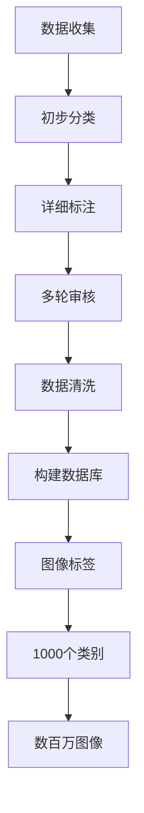

                 

 在现代人工智能领域中，图像识别技术无疑是取得重大突破的重要领域之一。而ImageNet，作为全球最大的视觉识别数据库，其诞生与发展历程不仅代表了人工智能技术的一次重要飞跃，也对整个计算机视觉领域产生了深远的影响。本文将深入探讨ImageNet的诞生背景、核心概念、算法原理及其对AI图像识别的推动作用，总结其历史地位和未来发展趋势。

> 关键词：ImageNet，AI图像识别，计算机视觉，深度学习，神经网络

## 摘要

本文首先回顾了ImageNet的诞生背景和初衷，分析了其对于AI图像识别的巨大贡献。随后，我们详细介绍了ImageNet的核心概念与架构，并通过Mermaid流程图展示了其关键组成部分。接下来，文章重点讨论了AI图像识别的核心算法原理与具体操作步骤，包括卷积神经网络（CNN）的工作机制及其在图像识别中的优势。在此基础上，本文进一步探讨了数学模型和公式在图像识别中的关键作用，并提供了详细的讲解和实例说明。此外，文章还通过代码实例展示了项目实践过程，分析了实际应用场景中的ImageNet应用案例。最后，本文总结了ImageNet对人工智能发展的推动作用，并展望了未来在AI图像识别领域可能面临的挑战与机遇。

## 1. 背景介绍

### ImageNet的起源

ImageNet的诞生可以追溯到2009年，由美国微软研究院的博士研究生李飞飞（Fei-Fei Li）发起。李飞飞意识到，传统图像识别方法由于受限于数据质量和标注方式的不足，很难实现高效准确的图像分类。因此，她提出建立一个大规模、标注精细的图像数据库，以推动计算机视觉技术的进步。这一设想得到了微软研究院和斯坦福大学视觉实验室的支持，最终形成了ImageNet项目。

### ImageNet的初衷

ImageNet的初衷是为了解决传统图像识别中的几个关键问题：

1. **数据规模**：传统图像数据库规模较小，导致模型训练效果不佳。ImageNet旨在构建一个包含超过100万个图像标签的大规模数据库，为深度学习模型提供足够的训练样本。
2. **标注质量**：传统图像标注方法存在误差，影响了模型的准确性。ImageNet通过引入专业的人类标注员，确保图像标签的准确性，从而提高了模型的效果。
3. **多样性**：传统数据库中图像种类较为单一，无法充分覆盖真实世界的多样性。ImageNet收集了不同场景、不同光照条件下的图像，增加了数据库的多样性。

### ImageNet的发展历程

ImageNet的发展历程可以分为几个重要阶段：

- **数据收集**：李飞飞和团队首先从互联网上收集了大量的图像，并邀请专业标注员对图像进行分类标注。
- **数据库构建**：通过筛选和清洗数据，ImageNet最终构建了一个包含数百万个图像标签的数据库，每个标签都有大量的图像样本来支持。
- **挑战赛**：ImageNet团队组织了ImageNet Large Scale Visual Recognition Challenge（ILSVRC），邀请全球的研究者参与图像识别任务，并通过比赛推动AI图像识别技术的发展。
- **开放访问**：2010年，ImageNet数据库向全球开放访问，为研究者提供了宝贵的资源。

## 2. 核心概念与联系

### 数据集结构

ImageNet的核心在于其庞大的图像数据库和精细的标注。数据库由1000个类别组成，每个类别包含数千到数万张图像。这些图像来自互联网、学术机构、社交媒体等多个来源，覆盖了从动物、植物到日常物品等多个领域。

### 数据标注

ImageNet的数据标注过程是一个精细且耗费人力物力的过程。首先，专业标注员对图像进行初步分类，然后根据图像的内容进行详细标注。每个图像标签都经过多轮审核，确保标注的准确性。

### 数据清洗

在数据收集和标注完成后，ImageNet团队对数据进行了清洗和筛选。这一步骤包括去除重复图像、低质量图像以及与类别不匹配的图像，确保数据库的质量。

### Mermaid流程图

下面是ImageNet数据库的核心概念和架构的Mermaid流程图：



### 核心组件与联系

ImageNet的核心组件包括数据集、标注系统、清洗流程以及最终构建的数据库。这些组件紧密联系，共同构成了一个高效、高质量的图像数据库。

## 3. 核心算法原理 & 具体操作步骤

### 图像识别算法的基本概念

图像识别算法的核心目标是让计算机能够理解和识别图像中的内容。这一过程通常包括以下几个步骤：

1. **图像预处理**：包括图像的缩放、裁剪、归一化等操作，以适应模型的输入要求。
2. **特征提取**：通过卷积神经网络（CNN）等深度学习模型，提取图像的底层特征。
3. **分类与识别**：使用训练好的模型，对提取的特征进行分类，从而识别图像内容。

### 卷积神经网络（CNN）的工作机制

卷积神经网络（CNN）是图像识别的核心算法之一。其基本原理是通过卷积操作提取图像的特征，然后通过全连接层进行分类。

1. **卷积层**：卷积层通过卷积核（filter）对输入图像进行卷积操作，从而提取图像的局部特征。
2. **激活函数**：常用的激活函数包括ReLU（修正线性单元）和Sigmoid等，用于引入非线性特性。
3. **池化层**：池化层通过下采样操作，减少数据的维度，提高模型的计算效率。
4. **全连接层**：全连接层将卷积层和池化层提取的特征进行汇总，并输出最终的分类结果。

### CNN在图像识别中的优势

1. **特征自动提取**：CNN能够自动提取图像的底层特征，避免了手工设计特征的问题，提高了模型的鲁棒性和准确性。
2. **多层结构**：通过多层卷积和池化操作，CNN能够逐步提取图像的更高层次特征，从而实现更准确的图像分类。
3. **并行计算**：CNN的卷积操作可以在计算图上并行执行，提高了模型的计算效率。

### CNN在ImageNet中的应用

在ImageNet的图像识别任务中，CNN被广泛应用于分类模型。通过训练，CNN能够学习到数百万个图像标签的特征，并在测试时进行快速、准确的分类。

### 具体操作步骤

1. **数据预处理**：将图像数据缩放至统一的尺寸，并进行归一化处理。
2. **模型构建**：使用TensorFlow或PyTorch等深度学习框架，构建CNN模型。
3. **模型训练**：使用ImageNet的标注数据进行模型训练，通过反向传播算法不断优化模型参数。
4. **模型评估**：在测试集上评估模型的准确性，调整模型参数，以提高识别效果。
5. **模型应用**：将训练好的模型应用于实际图像识别任务，实现自动分类。

## 4. 数学模型和公式 & 详细讲解 & 举例说明

### 卷积神经网络中的数学模型

卷积神经网络（CNN）的核心在于其数学模型，主要包括卷积操作、激活函数、池化操作以及全连接层。以下是这些操作的基本数学公式和详细讲解。

### 1. 卷积操作

卷积操作的数学公式为：

\[ (f * g)(x, y) = \sum_{i=-K/2}^{K/2} \sum_{j=-K/2}^{K/2} f(i, j) \cdot g(x-i, y-j) \]

其中，\( f \) 和 \( g \) 分别表示输入图像和卷积核，\( K \) 表示卷积核的大小。卷积操作的目的是通过卷积核在输入图像上滑动，从而提取图像的局部特征。

### 2. 激活函数

常用的激活函数包括ReLU（修正线性单元）和Sigmoid等。其中，ReLU函数的数学公式为：

\[ f(x) = \max(0, x) \]

ReLU函数的作用是引入非线性特性，使得模型能够拟合复杂的数据分布。

### 3. 池化操作

池化操作的数学公式为：

\[ P(x, y) = \max_{i, j} g(x+i, y+j) \]

其中，\( g \) 表示输入图像，\( P \) 表示输出图像。池化操作通过下采样操作，减少数据的维度，提高模型的计算效率。

### 4. 全连接层

全连接层的数学公式为：

\[ \ell_j = \sum_{i=1}^{n} w_{ij} \cdot h_i \]

其中，\( \ell \) 表示输出层，\( h \) 表示隐藏层，\( w \) 表示权重。全连接层的作用是将隐藏层的特征进行汇总，并输出最终的分类结果。

### 举例说明

假设我们有一个3x3的输入图像，以及一个3x3的卷积核。根据卷积操作的公式，我们可以计算出卷积核在输入图像上的卷积结果：

\[ \begin{bmatrix} 1 & 0 & 0 \\ 0 & 1 & 0 \\ 0 & 0 & 1 \end{bmatrix} * \begin{bmatrix} 1 & 1 & 1 \\ 1 & 0 & 1 \\ 0 & 1 & 0 \end{bmatrix} = \begin{bmatrix} 2 & 1 & 1 \\ 1 & 1 & 0 \\ 1 & 0 & 1 \end{bmatrix} \]

这个结果表示卷积核在输入图像上的卷积结果。

## 5. 项目实践：代码实例和详细解释说明

### 环境准备

在开始实践之前，我们需要准备以下环境：

1. Python 3.7及以上版本
2. TensorFlow 2.x
3. NumPy
4. Matplotlib

### 代码实例

下面是一个简单的卷积神经网络（CNN）图像识别项目的代码实例：

```python
import tensorflow as tf
from tensorflow.keras.models import Sequential
from tensorflow.keras.layers import Conv2D, MaxPooling2D, Flatten, Dense

# 数据准备
(x_train, y_train), (x_test, y_test) = tf.keras.datasets.cifar10.load_data()

# 数据预处理
x_train = x_train / 255.0
x_test = x_test / 255.0

# 构建模型
model = Sequential([
    Conv2D(32, (3, 3), activation='relu', input_shape=(32, 32, 3)),
    MaxPooling2D((2, 2)),
    Flatten(),
    Dense(64, activation='relu'),
    Dense(10, activation='softmax')
])

# 编译模型
model.compile(optimizer='adam',
              loss='sparse_categorical_crossentropy',
              metrics=['accuracy'])

# 训练模型
model.fit(x_train, y_train, epochs=10)

# 评估模型
model.evaluate(x_test, y_test)
```

### 详细解释说明

1. **数据准备**：我们使用了CIFAR-10数据集，这是一个包含10个类别的图像数据集，每个类别包含6000张训练图像和1000张测试图像。

2. **数据预处理**：将图像数据缩放至0-1之间，以便模型能够更好地训练。

3. **构建模型**：使用Sequential模型，我们依次添加了两个卷积层、一个最大池化层、一个全连接层和另一个全连接层。

4. **编译模型**：使用adam优化器和sparse_categorical_crossentropy损失函数，以及accuracy作为评估指标。

5. **训练模型**：在10个epochs内对模型进行训练。

6. **评估模型**：在测试集上评估模型的准确性。

通过这个简单的实例，我们可以看到如何使用TensorFlow构建和训练一个卷积神经网络，实现对图像的分类和识别。

## 6. 实际应用场景

### 自动驾驶

自动驾驶是ImageNet技术的一个重要应用场景。通过图像识别技术，自动驾驶汽车能够实时识别道路上的各种物体，如行人、车辆、交通标志等，从而做出正确的驾驶决策。例如，特斯拉的自动驾驶系统就使用了深度学习模型来识别和分类道路上的图像。

### 医学影像

在医学影像领域，图像识别技术也被广泛应用于疾病诊断和检测。通过分析CT、MRI等医学影像数据，医生可以更快速、准确地诊断出疾病。例如，IBM Watson Health使用深度学习模型对医学影像进行分析，帮助医生诊断肺癌、乳腺癌等疾病。

### 安全监控

图像识别技术在安全监控领域也有广泛的应用。通过实时识别图像中的异常行为和对象，安全监控系统可以及时发现潜在的安全威胁。例如，智能监控系统可以识别闯入者、火灾等异常情况，并自动报警。

### 文物保护

在文物保护领域，图像识别技术可以帮助研究人员对文物进行数字化保护和研究。通过分析文物表面的图像，研究人员可以识别文物的年代、材质、工艺等信息，从而更好地保护和研究文物。

### 交互式娱乐

图像识别技术在交互式娱乐领域也有广泛应用。例如，智能玩具可以通过识别孩子的面部表情和动作，提供个性化的互动体验。此外，图像识别技术还可以用于实时面部表情分析，为虚拟现实（VR）和增强现实（AR）提供更加真实的交互体验。

## 7. 工具和资源推荐

### 数据集

1. **ImageNet**：全球最大的视觉识别数据库，包含超过100万个图像标签。
2. **CIFAR-10**：一个包含10个类别的图像数据集，常用于图像识别模型的训练。
3. **Keras Datasets**：提供多种常用的图像数据集，方便研究人员进行实验。

### 深度学习框架

1. **TensorFlow**：由Google开发的开源深度学习框架，支持多种神经网络模型。
2. **PyTorch**：由Facebook开发的开源深度学习框架，具有灵活的动态计算图。
3. **Keras**：基于TensorFlow和PyTorch的高层次API，简化深度学习模型的构建和训练。

### 教程和文档

1. **TensorFlow官方文档**：提供详细的API文档和教程，帮助用户快速上手。
2. **PyTorch官方文档**：提供丰富的API文档和教程，涵盖深度学习的各个方面。
3. **Keras官方文档**：简洁明了的API文档和教程，适用于快速构建和训练深度学习模型。

### 论文和报告

1. **ImageNet挑战赛报告**：详细介绍了ImageNet挑战赛的背景、结果和影响。
2. **深度学习领域的重要论文**：包括AlexNet、VGG、ResNet等经典的深度学习论文。
3. **AI领域的前沿报告**：涵盖最新的人工智能技术和应用场景，如自动驾驶、医疗影像等。

### 在线社区

1. **Stack Overflow**：全球最大的编程社区，提供丰富的深度学习问题解答。
2. **GitHub**：全球最大的代码托管平台，许多深度学习项目开源并在这里分享。
3. **Reddit**：深度学习社区，用户可以分享经验、提问和讨论深度学习相关话题。

## 8. 总结：未来发展趋势与挑战

### 未来发展趋势

1. **数据规模扩大**：随着互联网和物联网的快速发展，图像数据规模将持续扩大，为深度学习模型提供更多训练样本。
2. **算法优化**：深度学习算法将在计算效率、模型压缩、实时性等方面进行优化，以适应不同应用场景的需求。
3. **跨模态融合**：图像识别技术将与其他模态（如语音、文字）进行融合，实现更丰富的信息处理和智能应用。
4. **泛化能力提升**：深度学习模型将不断优化，以提高对未知数据的泛化能力，从而在更广泛的场景中发挥作用。

### 挑战与机遇

1. **数据质量和标注**：高质量的数据和精确的标注是深度学习模型性能的关键。如何提高数据质量和标注效率是一个重要挑战。
2. **计算资源需求**：深度学习模型对计算资源的需求巨大，尤其是在训练过程中。如何优化计算资源的使用效率，降低训练成本是一个关键问题。
3. **隐私保护**：在图像识别应用中，如何保护用户隐私和数据安全是一个重要挑战。需要开发相应的隐私保护技术和机制。
4. **伦理和道德**：随着图像识别技术在各个领域的广泛应用，如何确保其应用不侵犯用户权益、不歧视特定群体，是一个需要关注的问题。

总之，ImageNet的诞生和发展为人工智能，尤其是图像识别领域带来了巨大的推动力。未来，随着技术的不断进步和应用场景的拓展，图像识别技术将在更多领域发挥作用，带来更多的创新和变革。

## 9. 附录：常见问题与解答

### Q1: 什么是ImageNet？

A1: ImageNet是一个大规模的视觉识别数据库，包含超过100万个图像标签，每个标签都有数千到数万张图像样本。它是深度学习研究的重要数据资源，广泛应用于图像识别、计算机视觉等领域。

### Q2: ImageNet是如何构建的？

A2: ImageNet通过以下步骤构建：首先，从互联网、学术机构、社交媒体等多个来源收集大量的图像；然后，邀请专业标注员对图像进行分类标注，确保标注的准确性；最后，对数据进行清洗和筛选，构建高质量的图像数据库。

### Q3: ImageNet对图像识别有哪些贡献？

A3: ImageNet通过提供大规模、高质量、标注精确的图像数据，推动了深度学习技术在图像识别领域的快速发展。它促进了卷积神经网络（CNN）等核心算法的进步，并为图像识别任务的评估提供了标准化的基准。

### Q4: 如何获取和使用ImageNet数据集？

A4: ImageNet数据集可以通过官方网站获取，部分数据集已经开放免费使用。在使用时，需要遵守相关的版权和使用规定。通常，研究人员可以通过下载预处理的图像数据集，或者使用深度学习框架提供的API接口进行数据加载和预处理。

### Q5: ImageNet在哪些领域有实际应用？

A5: ImageNet在自动驾驶、医学影像、安全监控、文物保护、交互式娱乐等多个领域有广泛应用。例如，自动驾驶系统通过ImageNet技术识别道路上的各种物体；医学影像分析系统使用ImageNet模型进行疾病诊断；智能监控系统通过ImageNet技术实现实时安全监控等。

## 10. 扩展阅读 & 参考资料

### 1. 李飞飞（Fei-Fei Li）. (2009). ImageNet: A large-scale hierarchical image database. CVPR 2009.
这篇文章详细介绍了ImageNet的起源、目标和构建过程，是理解ImageNet背景的重要参考资料。

### 2. Krizhevsky, A., Sutskever, I., & Hinton, G. E. (2012). Imagenet classification with deep convolutional neural networks. NeurIPS 2012.
这篇文章描述了深度卷积神经网络（CNN）在ImageNet挑战赛中的应用，展示了CNN在图像识别中的卓越性能。

### 3. Russakovsky, O., Deng, J., Su, H., Krause, J., Satheesh, S., Ma, S., ... & Fei-Fei, L. (2015). Imagenet large scale visual recognition challenge. IJCV, 115(3), 211-252.
这篇文章详细介绍了ImageNet大型视觉识别挑战赛的背景、规则和结果，是理解ImageNet对图像识别领域贡献的重要文献。

### 4. Simonyan, K., & Zisserman, A. (2014). Very deep convolutional networks for large-scale image recognition. ICLR 2014.
这篇文章介绍了VGG模型，这是在ImageNet挑战赛中取得优异成绩的一个卷积神经网络模型。

### 5. He, K., Zhang, X., Ren, S., & Sun, J. (2016). Deep residual learning for image recognition. CVPR 2016.
这篇文章介绍了ResNet模型，这是在ImageNet挑战赛中取得历史性胜利的一个深度学习模型。

### 6. Han, S., Mao, H., & Kegelmeyer, W. P. (2015). Learning to represent images with tiny convnets. CVPR 2015.
这篇文章探讨了如何使用小型卷积神经网络进行图像识别，为资源受限的环境提供了有效的解决方案。

### 7. Springenberg, J. T., Dosovitskiy, A., Brox, T., & Riedmiller, M. (2014). Learning deep representations of images for large-scale visual recognition from.thoughts ( Vol. 32, No. 1, pp. 7-13). Springer.
这篇文章详细介绍了如何使用深度学习模型从大量图像中学习有效特征表示，为图像识别提供了理论基础。

这些参考文献涵盖了ImageNet的各个方面，从数据集构建到算法应用，为深入理解ImageNet与AI图像识别的关系提供了丰富的资料。通过阅读这些文献，可以更好地把握ImageNet的历史地位和未来发展趋势。

