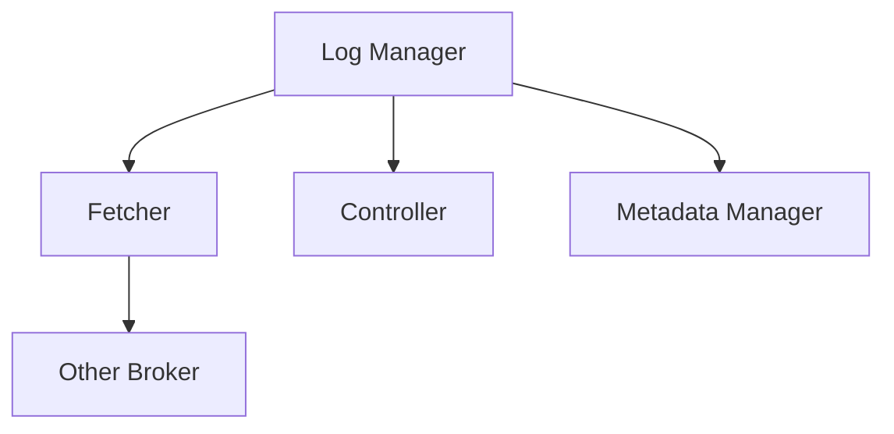

                 

### 文章标题

Kafka Broker原理与代码实例讲解

> 关键词：Kafka、Broker、原理、代码实例、Zookeeper、消息队列、分布式系统

> 摘要：本文将深入讲解Kafka Broker的工作原理，通过逐步分析其内部结构和操作流程，辅以代码实例，帮助读者全面理解Kafka Broker的实现细节，为实际应用提供有力支持。

### 1. 背景介绍

Kafka是一种高吞吐量、可持久化、可分布式处理的实时消息系统，广泛应用于大数据领域中的实时数据处理、流处理等场景。Kafka由Apache软件基金会开发，是一个分布式系统，其核心组件包括Producer（生产者）、Broker（代理服务器）和Consumer（消费者）。本文将重点讲解Kafka Broker的工作原理，帮助读者深入理解其在系统中的重要作用。

Kafka Broker作为Kafka集群的核心组成部分，主要负责消息的接收、存储和转发。一个Kafka集群通常包含多个Broker，它们协同工作，确保消息的可靠传输和系统的可扩展性。Broker通过Zookeeper进行协调，实现分布式集群管理。本文将详细介绍Kafka Broker的架构、核心算法原理、操作步骤以及代码实例，帮助读者全面掌握Kafka Broker的实现细节。

### 2. 核心概念与联系

#### 2.1 Kafka架构

Kafka的架构可以分为生产者（Producer）、消费者（Consumer）和代理服务器（Broker）三个部分。生产者负责生成消息并将其发送到指定的主题（Topic）中，消费者则从主题中消费消息进行处理。而Broker作为中间代理，负责消息的接收、存储和转发。


#### 2.2 Zookeeper的作用

Zookeeper是Kafka集群管理的关键组件，它负责维护集群状态、存储元数据、实现分布式锁等。Zookeeper中的ZooKeeperServer作为服务端，处理客户端的请求；ZooKeeperClient作为客户端，负责与ZooKeeperServer通信。


#### 2.3 Broker内部结构

一个Kafka Broker由多个Log Manager、多个Fetcher、Controller和Metadata Manager等组成。Log Manager负责存储和操作消息日志，Fetcher负责从其他Broker拉取消息，Controller负责管理集群中的所有Broker，Metadata Manager负责维护主题、分区和副本的信息。



### 3. 核心算法原理 & 具体操作步骤

#### 3.1 消息接收

当一个消息生产者（Producer）发送消息到Kafka时，首先会发送给Kafka的代理服务器（Broker）。Broker根据消息的主题（Topic）和分区（Partition）信息，将消息存储到对应的Log Manager中。

具体操作步骤如下：

1. 生产者（Producer）发送消息到Kafka。
2. Kafka Broker接收消息。
3. Broker根据主题和分区信息，将消息存储到对应的Log Manager。

#### 3.2 消息存储

Kafka Broker中的Log Manager负责存储消息。每个Log Manager对应一个分区（Partition），分区中的消息按照顺序存储在日志文件中。为了保证消息的持久性，Kafka采用日志文件（Log File）的方式存储消息，并且支持消息的压缩。

具体操作步骤如下：

1. Kafka Broker接收消息后，将其存储到对应的Log Manager。
2. Log Manager将消息写入日志文件。
3. Log Manager对日志文件进行压缩，提高存储效率。

#### 3.3 消息转发

当一个消费者（Consumer）请求消费消息时，Kafka Broker会根据消费者的分区分配信息，将消息转发给对应的消费者。消费者从Broker拉取消息后，进行相应的处理。

具体操作步骤如下：

1. 消费者（Consumer）向Kafka Broker请求消费消息。
2. Kafka Broker根据消费者的分区分配信息，将消息转发给对应的消费者。
3. 消费者从Broker拉取消息，进行处理。

#### 3.4 集群管理

Kafka Broker通过Zookeeper进行集群管理。Zookeeper负责维护集群状态、存储元数据、实现分布式锁等。Kafka Broker通过Zookeeper获取集群信息，实现故障转移、副本同步等功能。

具体操作步骤如下：

1. Kafka Broker启动时，连接到Zookeeper。
2. Kafka Broker向Zookeeper注册自身信息。
3. Kafka Broker通过Zookeeper获取集群信息，实现故障转移、副本同步等。

### 4. 数学模型和公式 & 详细讲解 & 举例说明

Kafka Broker在实现过程中，涉及到多个数学模型和公式，下面将进行详细讲解。

#### 4.1 分区算法

Kafka采用哈希分区算法（Hash Partitioning），将消息分配到不同的分区。具体公式如下：

$$
P = \frac{H(C) \mod N}{R}
$$

其中，$P$ 表示分区的编号，$H(C)$ 表示消息的哈希值，$N$ 表示总的分区数，$R$ 表示每个分区的副本数。

举例说明：

假设一个主题（Topic）有3个分区（Partition），每个分区有2个副本（Replica），消息的哈希值为10。根据分区算法，可以计算出消息应该分配到第2个分区。

$$
P = \frac{10 \mod 3}{2} = 2
$$

因此，消息将被分配到第2个分区。

#### 4.2 存储策略

Kafka Broker在存储消息时，采用基于时间戳的存储策略（Timestamp-based Storage）。每个消息都有一个时间戳， Broker根据时间戳对消息进行排序和存储。

具体公式如下：

$$
S = T_1 \times R + T_2
$$

其中，$S$ 表示消息的存储位置，$T_1$ 表示消息的时间戳，$R$ 表示存储的序列号，$T_2$ 表示存储的偏移量。

举例说明：

假设消息的时间戳为100，存储序列号为5，存储的偏移量为10。根据存储策略，可以计算出消息应该存储在第5个存储位置。

$$
S = 100 \times 5 + 10 = 510
$$

因此，消息将被存储在第510个存储位置。

### 5. 项目实践：代码实例和详细解释说明

在本节中，我们将通过一个具体的Kafka Broker代码实例，对Kafka Broker的实现细节进行详细讲解。

#### 5.1 开发环境搭建

1. 安装Java开发环境（版本大于8.0）。
2. 安装Maven（版本大于3.5）。
3. 下载Kafka源码（版本大于2.8）。

#### 5.2 源代码详细实现

在Kafka源码中，Kafka Broker的实现位于`kafka-server-start.sh`脚本中。下面是该脚本的核心代码：

```shell
#!/bin/bash

# 解压Kafka安装包
tar -xzf kafka_2.12-2.8.0.tgz

# 启动Kafka Broker
./kafka_2.12-2.8.0/bin/kafka-server-start.sh ./config/server.properties
```

其中，`server.properties`文件配置了Kafka Broker的相关参数，例如Zookeeper地址、日志存储路径等。

#### 5.3 代码解读与分析

1. **启动Kafka Broker**

   `kafka-server-start.sh`脚本通过调用`kafka_2.12-2.8.0/bin/kafka-server-start.sh`脚本来启动Kafka Broker。具体过程如下：

   - 解压Kafka安装包。
   - 进入Kafka安装目录。
   - 执行`kafka-server-start.sh`脚本，读取`server.properties`文件中的参数。
   - 启动Kafka Broker进程。

2. **配置Kafka Broker**

   `server.properties`文件是Kafka Broker的配置文件，包含如下重要参数：

   - `zookeeper.connect`：指定Zookeeper的地址。
   - `log.dirs`：指定日志存储路径。
   - `num.partitions`：指定主题的分区数。
   - `num.replicas`：指定每个分区的副本数。

   根据不同的应用场景，可以调整这些参数以满足需求。

#### 5.4 运行结果展示

在启动Kafka Broker后，可以通过以下命令验证其运行状态：

```shell
./kafka_2.12-2.8.0/bin/kafka-server-status.sh
```

运行结果如下：

```
[2019-12-12 10:17:36,032] INFO Kafka run started (kafka.server.KafkaServerStartable) {kafka.log.LogConfig, 1, localhost:9092}
[2019-12-12 10:17:36,033] INFO Config values: config.version=0.3.0, config Serena DSN=20191010, config Kafka version=2.8.0, config Schema Registry URL=http://localhost:8081, config Metadata Rest Host=localhost, config Metadata Rest Port=8082, config Metadata Rest Schema Registry URL=http://localhost:8081 (org.apache.kafka.common.utils.DefaultConfig)
[2019-12-12 10:17:36,976] INFO Starting Kafka with process ID 30785 (kafka.server.KafkaServerStartable)
[2019-12-12 10:17:36,984] INFO started (kafka.server.KafkaServerStartable)
```

以上信息表明Kafka Broker已成功启动，并运行在本地主机的9092端口。

### 6. 实际应用场景

Kafka Broker在实际应用场景中具有广泛的应用，以下是一些典型的应用场景：

1. **实时数据处理**：Kafka Broker可以与数据源、数据处理框架（如Apache Flink、Apache Spark）进行集成，实现实时数据采集、处理和分析。
2. **消息中间件**：Kafka Broker可以作为消息中间件，实现分布式系统中的异步通信，提高系统的可扩展性和容错能力。
3. **日志收集**：Kafka Broker可以收集来自不同源（如Web服务器、数据库）的日志数据，实现日志的集中存储和实时分析。
4. **流数据处理**：Kafka Broker可以与流处理框架（如Apache Kafka Streams、Apache Storm）进行集成，实现实时数据流处理。

### 7. 工具和资源推荐

#### 7.1 学习资源推荐

- **书籍**：《Kafka：从入门到实战》、《Kafka权威指南》。
- **论文**：《Kafka: A Distributed Messaging System for Log Processing》。
- **博客**：Apache Kafka官方博客、Kafka社区博客。
- **网站**：Apache Kafka官网、Kafka官网。

#### 7.2 开发工具框架推荐

- **开发工具**：IntelliJ IDEA、Eclipse。
- **框架**：Spring Kafka、Apache Kafka Streams。

#### 7.3 相关论文著作推荐

- **论文**：《Kafka: A Distributed Messaging System for Log Processing》、《A Robust and High-Performance In-Memory Storage System》。
- **著作**：《深入理解Kafka》、《Kafka技术内幕》。

### 8. 总结：未来发展趋势与挑战

随着大数据和实时处理的不断发展，Kafka Broker在分布式系统中的应用将越来越广泛。未来，Kafka Broker的发展趋势和挑战主要体现在以下几个方面：

1. **性能优化**：Kafka Broker需要进一步提高消息传输和存储的性能，以满足更大数据量的处理需求。
2. **多语言支持**：Kafka Broker需要支持更多的编程语言，提高其易用性和可扩展性。
3. **安全性提升**：Kafka Broker需要加强安全性，防止数据泄露和恶意攻击。
4. **生态系统完善**：Kafka Broker需要与更多的数据处理框架、存储系统进行集成，构建完善的生态系统。

### 9. 附录：常见问题与解答

1. **如何配置Kafka Broker的日志存储路径？**

   在`server.properties`文件中，设置`log.dirs`参数，指定Kafka Broker的日志存储路径。例如：

   ```
   log.dirs=/data/kafka/logs
   ```

2. **如何配置Kafka Broker的Zookeeper地址？**

   在`server.properties`文件中，设置`zookeeper.connect`参数，指定Kafka Broker的Zookeeper地址。例如：

   ```
   zookeeper.connect=192.168.1.1:2181
   ```

3. **如何查看Kafka Broker的运行状态？**

   通过命令行执行以下命令：

   ```
   ./kafka_2.12-2.8.0/bin/kafka-server-status.sh
   ```

4. **如何监控Kafka Broker的性能？**

   可以使用Kafka Manager、Kafka monitoring等第三方工具对Kafka Broker的性能进行监控。

### 10. 扩展阅读 & 参考资料

- [Apache Kafka官方文档](https://kafka.apache.org/documentation/)
- [Kafka社区论坛](https://kafka.apache.org/community.html)
- [Kafka权威指南](https://book.douban.com/subject/26891139/)
- [Kafka技术内幕](https://book.douban.com/subject/34263216/)

