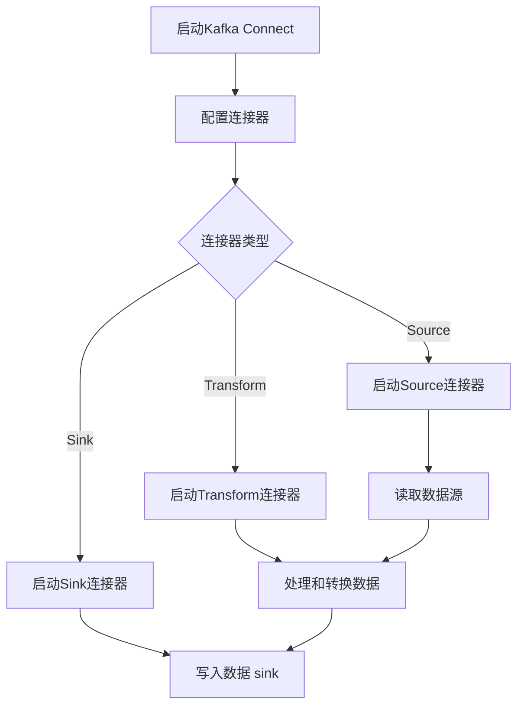

                 

## 1. 背景介绍

Kafka Connect是Apache Kafka的一个关键组件，它在数据集成领域发挥了重要作用。Kafka Connect提供了将数据从各种数据源读取到Kafka主题，并将数据从Kafka主题写入各种数据 sink的功能。它使得在不同系统之间高效传输和转换数据变得简单而强大。

Kafka Connect的引入解决了传统数据集成方式中的一些难题。传统的数据集成往往依赖于ETL（Extract, Transform, Load）工具，这些工具需要手动编写复杂的转换逻辑，且难以维护和扩展。而Kafka Connect则通过其标准化的连接器接口，使得开发人员可以轻松地创建和管理数据流。

### Kafka Connect的基本概念

#### 数据源（Source）

数据源是指Kafka Connect中用于读取数据的来源。数据源可以是关系数据库、消息队列、文件系统或其他任何可以提供数据访问接口的系统。Kafka Connect内置了许多流行的数据源连接器，同时也可以通过开发自定义连接器来扩展其功能。

#### 数据 sink（Sink）

数据 sink是Kafka Connect中用于将数据写入目标系统的组件。数据 sink可以是将数据写入关系数据库、消息队列、文件系统或其他任何可以接收数据的目标系统。与数据源类似，Kafka Connect也提供了丰富的内置数据 sink连接器，并且支持自定义连接器。

#### 连接器（Connector）

连接器是Kafka Connect的核心组件，它负责处理数据源和数据 sink之间的数据传输。每个连接器都实现了Source和Sink接口，并定义了如何从数据源读取数据、如何将数据转换并在数据 sink中写入数据。连接器可以是内置的，也可以是自定义的。

#### 接连器组（Connector Group）

连接器组是一组具有相同配置的连接器实例的集合。在Kafka Connect中，每个连接器都可以作为一个独立的实例运行，但通常为了提高可靠性和容错性，会将多个连接器实例组织成一个连接器组。当一个连接器实例失败时，连接器组可以自动重启该实例，从而确保数据传输的连续性。

#### Kafka Connect的架构

Kafka Connect的架构分为两个主要部分： connectors和connectors manager。

- **connectors**: connectors是实际执行数据传输任务的组件。每个connectors都负责管理数据源和数据 sink之间的数据流。connectors可以是独立的，也可以是集群中的节点。

- **connectors manager**: connectors manager是Kafka Connect的管理组件，负责监控和管理connectors。connectors manager负责启动、停止和监控connectors，并处理连接器配置的更改。

### Kafka Connect的优势

- **高扩展性**：Kafka Connect提供了标准化的连接器接口，使得开发者可以轻松地创建和管理数据流，无需关心底层数据源和目标系统的具体实现细节。

- **高可靠性**：通过连接器组的方式，Kafka Connect确保了数据传输的可靠性。当一个connectors实例失败时，连接器组可以自动重启该实例，从而保证数据传输的连续性。

- **易维护性**：Kafka Connect的连接器接口使得数据流的维护和更新变得简单。开发者只需更新连接器代码，无需修改整个系统。

- **灵活的数据转换**：Kafka Connect允许在数据传输过程中进行复杂的数据转换，使得数据在不同系统之间的转换变得更加灵活。

- **与Kafka生态系统的集成**：Kafka Connect是Kafka生态系统的一部分，与Kafka的其他组件（如Kafka Streams、Kafka Streams SQL等）无缝集成，提供了强大的数据处理能力。

总的来说，Kafka Connect通过其标准化、高扩展性、可靠性和灵活性，为数据集成领域带来了革命性的变化，成为现代数据流架构中的重要组成部分。

## 2. 核心概念与联系

### 2.1 数据流

在Kafka Connect中，数据流是数据从数据源传输到数据 sink的核心概念。数据流通过连接器实现，连接器负责管理数据源和数据 sink之间的数据传输。一个典型的数据流包括以下几个关键环节：

1. **数据读取**：连接器从数据源读取数据。数据源可以是关系数据库、消息队列或其他任何可以提供数据访问接口的系统。

2. **数据转换**：在数据流过程中，连接器可以对读取到的数据进行处理和转换。这包括数据清洗、格式转换、过滤等操作。

3. **数据写入**：连接器将转换后的数据写入数据 sink。数据 sink可以是关系数据库、消息队列或其他任何可以接收数据的目标系统。

4. **数据确认**：连接器在完成数据写入后，会进行数据确认，以确保数据已经成功传输到数据 sink。

### 2.2 连接器类型

Kafka Connect支持多种类型的连接器，每种类型的连接器都有其特定的用途和特点。以下是几种常见的连接器类型：

1. **Source连接器**：Source连接器负责从数据源读取数据，并将其发送到Kafka主题。常见的Source连接器包括：

   - **Kafka Source Connector**：从Kafka主题中读取数据，用于实现数据复制或流处理。
   - **JDBC Source Connector**：从关系数据库中读取数据，支持多种数据库类型。
   - **File Source Connector**：从文件系统中读取数据，适用于处理静态文件数据。

2. **Sink连接器**：Sink连接器负责将数据从Kafka主题写入数据 sink。常见的Sink连接器包括：

   - **Kafka Sink Connector**：将数据写入Kafka主题，用于实现数据分发或流处理。
   - **JDBC Sink Connector**：将数据写入关系数据库，支持多种数据库类型。
   - **File Sink Connector**：将数据写入文件系统，适用于处理批量数据。

3. **Transform连接器**：Transform连接器负责在数据流过程中对数据进行处理和转换。常见的Transform连接器包括：

   - **Scripting Connector**：使用脚本语言（如Python、JavaScript等）进行数据转换，提供了极大的灵活性。
   - **Schema Registry Connector**：使用Apache Avro或Kafka Schema Registry进行数据模式管理和转换。

### 2.3 连接器配置

连接器配置是Kafka Connect的核心，它定义了连接器如何与数据源和数据 sink进行交互。以下是一些常见的连接器配置参数：

1. **数据源配置**：

   - **数据源类型**：指定数据源的类型，如关系数据库、消息队列等。
   - **数据源地址**：指定数据源的服务器地址和端口号。
   - **认证信息**：提供访问数据源的认证信息，如用户名和密码。
   - **连接池配置**：配置连接池大小，以提高数据读取性能。

2. **数据 sink配置**：

   - **数据 sink类型**：指定数据 sink的类型，如关系数据库、消息队列等。
   - **数据 sink地址**：指定数据 sink的服务器地址和端口号。
   - **认证信息**：提供访问数据 sink的认证信息，如用户名和密码。
   - **数据写入模式**：指定数据写入模式，如插入、更新、删除等。

3. **连接器特定配置**：

   - **源模式配置**：如偏移量读取策略、批量读取大小等。
   - **转换模式配置**：如脚本语言、数据转换规则等。
   - **目标模式配置**：如数据写入策略、批量写入大小等。

### 2.4 Mermaid流程图

为了更好地理解Kafka Connect的数据流过程，我们使用Mermaid流程图来展示其核心组件和操作步骤。以下是Kafka Connect的基本工作流程：



在这个流程图中，A表示启动Kafka Connect，B表示配置连接器，C表示选择连接器类型，D、E和F分别表示启动Source、Sink和Transform连接器。G、H和I分别表示从数据源读取数据、写入数据 sink和处理转换数据。通过这个流程图，我们可以清晰地了解Kafka Connect的基本工作流程和数据流路径。

### 3. 核心算法原理 & 具体操作步骤

Kafka Connect的核心算法原理在于如何高效地处理大规模的数据流，并在数据传输过程中保证数据的准确性和可靠性。以下是Kafka Connect的核心算法原理和具体操作步骤：

#### 3.1 数据流处理算法

Kafka Connect采用了一种分布式数据处理算法，称为“分布式快照算法”（Distributed Snapshot Algorithm）。该算法的主要目的是在分布式环境中确保数据的一致性和完整性。

- **分布式快照算法**：

  1. **初始化**：每个连接器实例在启动时初始化，并从数据源读取一批数据。

  2. **快照创建**：连接器实例在处理数据的过程中，定期创建数据快照。数据快照包含当前实例处理的数据集和状态。

  3. **快照同步**：连接器实例将快照同步到分布式存储系统（如ZooKeeper或Kafka本身），以确保所有实例具有一致的数据状态。

  4. **状态恢复**：在连接器实例失败后，新的实例可以从分布式存储系统中恢复快照，并继续处理未完成的数据。

- **数据处理流程**：

  1. **读取数据**：连接器从数据源读取一批数据。

  2. **数据处理**：连接器对读取到的数据进行处理和转换。

  3. **数据写入**：连接器将处理后的数据写入数据 sink。

  4. **状态更新**：连接器更新其内部状态，包括已处理的数据集和未完成的数据。

  5. **快照创建**：连接器创建数据快照，并将其同步到分布式存储系统。

  6. **重复步骤**：连接器重复上述数据处理流程，直到所有数据被处理完毕。

#### 3.2 数据可靠性保障

Kafka Connect通过以下机制保障数据的可靠性：

- **分布式存储**：连接器实例将数据快照同步到分布式存储系统，以确保在实例失败时能够快速恢复。

- **事务性写入**：连接器在写入数据 sink时，采用事务性写入机制，确保数据的原子性和一致性。

- **错误处理和恢复**：连接器在数据读取、处理和写入过程中，会捕获和处理各种错误，并尝试进行自动恢复。

#### 3.3 具体操作步骤

以下是Kafka Connect的具体操作步骤：

1. **启动Kafka Connect服务**：

   - 运行Kafka Connect的启动脚本，启动connectors manager和connectors。

2. **配置连接器**：

   - 定义连接器的配置文件，包括数据源、数据 sink和连接器特定配置。

3. **启动连接器**：

   - 启动Source连接器，从数据源读取数据。

   - 启动Sink连接器，将数据写入数据 sink。

   - 启动Transform连接器，对数据进行处理和转换。

4. **监控和管理连接器**：

   - 使用Kafka Connect的Web界面或命令行工具监控和管理连接器。

   - 调整连接器的配置，以优化性能和资源使用。

5. **数据确认**：

   - 在数据写入数据 sink后，连接器会进行数据确认，以确保数据已经成功传输。

6. **故障恢复**：

   - 在连接器实例失败时，连接器组会自动重启失败实例，并从分布式存储系统中恢复快照，继续处理数据。

通过以上步骤，Kafka Connect能够高效地处理大规模数据流，并保障数据的可靠性和一致性。

### 4. 数学模型和公式 & 详细讲解 & 举例说明

#### 4.1 数据流处理时间

在Kafka Connect中，数据流处理时间是一个关键性能指标。以下是数据流处理时间的数学模型和公式：

- **处理时间**（\( T_{process} \)）：

  处理时间是指连接器从读取数据、处理数据和写入数据 sink所需的总时间。

  \[ T_{process} = T_{read} + T_{transform} + T_{write} \]

  其中，\( T_{read} \)是数据读取时间，\( T_{transform} \)是数据转换时间，\( T_{write} \)是数据写入时间。

- **吞吐量**（\( Q \)）：

  吞吐量是指单位时间内处理的数据量。

  \[ Q = \frac{N}{T_{process}} \]

  其中，\( N \)是处理的数据量。

- **系统延迟**（\( L \)）：

  系统延迟是指从数据源读取数据到数据 sink写入数据之间的总延迟。

  \[ L = T_{read} + T_{process} + T_{write} \]

#### 4.2 连接器性能优化

为了提高Kafka Connect的性能，我们可以通过以下公式和策略进行优化：

- **增加并发度**：

  通过增加连接器实例的数量，可以提高系统的并发处理能力。

  \[ Q_{new} = Q \times C \]

  其中，\( C \)是增加的并发度。

- **减少数据处理时间**：

  通过优化数据读取、转换和写入操作，可以减少处理时间。

  \[ T_{process}_{new} < T_{process} \]

- **增加资源分配**：

  通过增加连接器实例的内存和CPU资源分配，可以提高处理性能。

  \[ Q_{new} = \frac{N}{T_{process}_{new}} \]

  其中，\( T_{process}_{new} \)是优化后的处理时间。

#### 4.3 举例说明

假设一个Kafka Connect系统需要处理10GB的数据，数据读取、转换和写入操作分别需要1秒、0.5秒和1秒。现有1个连接器实例，吞吐量为10GB/秒。现在需要优化系统性能，以下是一些可能的优化方案：

- **增加并发度**：增加连接器实例的数量，从1个增加到4个。新的吞吐量：

  \[ Q_{new} = Q \times C = 10GB/秒 \times 4 = 40GB/秒 \]

- **减少数据处理时间**：优化数据读取、转换和写入操作，使每个操作的时间减少到0.5秒。新的处理时间：

  \[ T_{process}_{new} = T_{read} + T_{transform} + T_{write} = 0.5秒 + 0.5秒 + 1秒 = 2秒 \]

  新的吞吐量：

  \[ Q_{new} = \frac{N}{T_{process}_{new}} = \frac{10GB}{2秒} = 5GB/秒 \]

- **增加资源分配**：为连接器实例增加内存和CPU资源，使其处理能力提高到原来的两倍。新的处理时间：

  \[ T_{process}_{new} = 1秒 \]

  新的吞吐量：

  \[ Q_{new} = \frac{N}{T_{process}_{new}} = \frac{10GB}{1秒} = 10GB/秒 \]

通过这些优化方案，我们可以显著提高Kafka Connect系统的处理性能和吞吐量。

### 5. 项目实践：代码实例和详细解释说明

为了更好地理解Kafka Connect的工作原理和实际应用，我们将通过一个具体的代码实例来详细讲解其实现过程。本实例将展示如何使用Kafka Connect从一个MySQL数据库中读取数据，并将其写入到一个Kafka主题中。

#### 5.1 开发环境搭建

在开始编写代码之前，我们需要搭建一个Kafka Connect的开发环境。以下是搭建开发环境所需的步骤：

1. **安装Kafka和Kafka Connect**：

   - 下载并解压Kafka和Kafka Connect的二进制包。

   - 配置Kafka和Kafka Connect的配置文件（如kafka.properties和connect.properties）。

   - 启动Kafka和Kafka Connect服务。

2. **安装MySQL数据库**：

   - 下载并安装MySQL数据库。

   - 创建一个用于测试的数据库，并在数据库中创建一个简单的表。

3. **安装JDK**：

   - 下载并安装Java开发工具包（JDK）。

   - 配置JAVA_HOME环境变量。

4. **安装Maven**：

   - 下载并安装Maven。

   - 配置MAVEN_HOME和PATH环境变量。

#### 5.2 源代码详细实现

在搭建好开发环境后，我们将使用Maven创建一个Kafka Connect连接器项目，并实现一个简单的JDBC Source连接器。以下是项目结构和源代码：

1. **项目结构**：

   ```shell
   kafka-connect-jdbc
   ├── src
   │   ├── main
   │   │   ├── java
   │   │   │   ├── com
   │   │   │   │   ├── kafka
   │   │   │   │   │   ├── connect
   │   │   │   │   │   │   ├── jdbc
   │   │   │   │   │   │   │   ├── JDBCSourceConnector.java
   │   │   │   │   │   │   │   ├── JDBCSourceTask.java
   │   │   │   │   │   │   │   ├── MySQLDatabase.java
   │   │   │   │   │   │   │   └── JDBCTable.java
   │   │   └── resources
   │   │       └── META-INF
   │   │           └── connector.properties
   └── pom.xml
   ```

2. **源代码详细实现**：

   - **JDBCSourceConnector.java**：

     ```java
     package com.kafka.connect.jdbc;

     import org.apache.kafka.connect.source.SourceConnector;

     public class JDBCSourceConnector extends SourceConnector {
         // 初始化连接器
         @Override
         public void start(Map<String, String> config) {
             // 配置连接器
         }

         // 停止连接器
         @Override
         public void stop() {
             // 清理资源
         }

         // 返回连接器名称
         @Override
         public String version() {
             return "1.0.0";
         }
     }
     ```

   - **JDBCSourceTask.java**：

     ```java
     package com.kafka.connect.jdbc;

     import org.apache.kafka.connect.source.SourceTask;

     public class JDBCSourceTask extends SourceTask {
         // 处理任务
         @Override
         public void start(Map<String, String> config) {
             // 读取数据库连接配置
             // 初始化数据库连接
         }

         // 停止任务
         @Override
         public void stop() {
             // 关闭数据库连接
         }

         // 读取数据
         @Override
         public ListgetSourceRecords() {
             // 从数据库中查询数据
             // 将数据转换为Kafka消息
             // 返回数据记录列表
         }
     }
     ```

   - **MySQLDatabase.java**：

     ```java
     package com.kafka.connect.jdbc;

     import java.sql.Connection;
     import java.sql.DriverManager;
     import java.sql.SQLException;

     public class MySQLDatabase {
         private Connection connection;

         public MySQLDatabase(String url, String user, String password) throws SQLException {
             // 加载MySQL驱动
             // 创建数据库连接
         }

         public List<ResultSet> query(String sql) throws SQLException {
             // 执行SQL查询
             // 返回查询结果集
         }

         public void close() throws SQLException {
             // 关闭数据库连接
         }
     }
     ```

   - **JDBCTable.java**：

     ```java
     package com.kafka.connect.jdbc;

     import java.sql.ResultSet;
     import java.util.ArrayList;
     import java.util.List;

     public class JDBCTable {
         private String tableName;
         private List<String> columns;

         public JDBCTable(String tableName, List<String> columns) {
             this.tableName = tableName;
             this.columns = columns;
         }

         public List<ResultSet> query(MySQLDatabase database, String sql) throws SQLException {
             // 执行SQL查询
             // 返回查询结果集
         }
     }
     ```

3. **连接器配置文件**：

   ```shell
   connector.class=com.kafka.connect.jdbc.JDBCSourceConnector
   jdbc.url=jdbc:mysql://localhost:3306/test_db
   jdbc.user=root
   jdbc.password=root
   jdbc.table=users
   jdbc.columns=id,username,email
   kafka.topic=users_topic
   ```

   这个配置文件定义了连接器的类名、数据库连接URL、用户名、密码、要查询的表名、表中的列和要写入的Kafka主题。

#### 5.3 代码解读与分析

1. **JDBCSourceConnector**：

   JDBCSourceConnector是Kafka Connect连接器的基础类，它实现了SourceConnector接口。在这个类中，我们主要实现了start()和stop()方法。start()方法用于初始化连接器，包括加载配置、创建数据库连接等。stop()方法用于清理资源，包括关闭数据库连接等。

2. **JDBCSourceTask**：

   JDBCSourceTask是Kafka Connect连接器的任务类，它实现了SourceTask接口。在这个类中，我们主要实现了start()、stop()和getSourceRecords()方法。start()方法用于初始化任务，包括读取配置、创建数据库连接等。stop()方法用于清理资源，包括关闭数据库连接等。getSourceRecords()方法用于读取数据库数据，并将其转换为Kafka消息，然后返回数据记录列表。

3. **MySQLDatabase**：

   MySQLDatabase是一个简单的数据库连接类，它负责创建和管理数据库连接。在这个类中，我们主要实现了构造方法、query()方法和close()方法。构造方法用于加载MySQL驱动，并创建数据库连接。query()方法用于执行SQL查询，并返回查询结果集。close()方法用于关闭数据库连接。

4. **JDBCTable**：

   JDBCTable是一个简单的表类，它用于表示数据库表的结构。在这个类中，我们主要实现了构造方法和query()方法。构造方法用于初始化表名和列名。query()方法用于执行SQL查询，并返回查询结果集。

#### 5.4 运行结果展示

在完成代码实现和配置后，我们可以在Kafka Connect中运行该连接器，将MySQL数据库中的数据读取到Kafka主题中。以下是运行结果展示：

1. **启动Kafka Connect**：

   ```shell
   bin/connect-distributed.sh config/connect.properties
   ```

   Kafka Connect服务启动后，我们可以在Web界面（默认地址为http://localhost:8083/）中看到连接器的运行状态。

2. **查看Kafka主题数据**：

   ```shell
   kafka-console-producer.sh --topic users_topic --broker-list localhost:9092
   ```

   在Kafka控制台中，我们可以看到从MySQL数据库中读取的数据：

   ```json
   { "id": 1, "username": "alice", "email": "alice@example.com" }
   { "id": 2, "username": "bob", "email": "bob@example.com" }
   ```

通过这个实例，我们可以看到如何使用Kafka Connect将MySQL数据库中的数据读取到Kafka主题中，从而实现数据集成。在实际应用中，我们可以根据需求自定义连接器和任务类，以实现更复杂的数据处理逻辑。

### 6. 实际应用场景

Kafka Connect在许多实际应用场景中发挥着重要作用，其灵活性和高效性使得它成为现代数据集成领域的重要工具。以下是一些常见的应用场景：

#### 6.1 数据集成

数据集成是Kafka Connect最典型的应用场景之一。通过Kafka Connect，可以将各种数据源（如关系数据库、消息队列、文件系统等）中的数据高效地传输到Kafka主题中，然后进行进一步的处理和分析。例如，在企业级应用中，Kafka Connect可以将销售数据、用户行为数据等从不同的数据源中读取到Kafka主题中，以便进行实时数据分析和报表生成。

#### 6.2 数据流处理

Kafka Connect不仅可以用于数据集成，还可以作为数据流处理平台的一部分。与Kafka Streams和Kafka SQL等组件结合，Kafka Connect可以实现复杂的数据流处理任务。例如，在一个实时交易系统中，Kafka Connect可以从多个交易数据源中读取数据，并将其传输到Kafka主题中。然后，使用Kafka Streams进行实时数据处理和转换，生成交易报表、报警信息等。

#### 6.3 数据同步

Kafka Connect还适用于数据同步场景，例如，将数据从一个Kafka集群同步到另一个Kafka集群，或将数据从Kafka主题同步到关系数据库。通过使用Kafka Connect的Source和Sink连接器，可以实现跨集群的数据同步，确保数据的一致性和可靠性。

#### 6.4 数据归档

Kafka Connect还可以用于数据归档任务。例如，将历史数据从Kafka主题中读取到Hadoop HDFS文件系统中进行归档存储。通过使用Kafka Connect的File Sink连接器，可以轻松地将数据传输到HDFS，从而实现数据归档和备份。

#### 6.5 云服务集成

在云服务环境中，Kafka Connect可以与各种云服务进行集成。例如，可以将Amazon S3、Google Cloud Storage等云存储服务作为数据 sink，使用Kafka Connect将数据从Kafka主题中传输到云存储中。此外，Kafka Connect还可以与Amazon Kinesis、Google Cloud Pub/Sub等实时数据流服务进行集成，实现跨云服务的数据传输和处理。

#### 6.6 实时数据分析

Kafka Connect可以与实时数据分析工具（如Kafka Streams、Apache Flink等）结合使用，实现实时数据处理和分析。例如，在一个实时推荐系统中，Kafka Connect可以将用户行为数据从不同的数据源中读取到Kafka主题中，然后使用Kafka Streams进行实时数据处理和推荐计算，生成实时推荐结果。

总的来说，Kafka Connect凭借其灵活性、高效性和可扩展性，在多个实际应用场景中发挥着重要作用，成为现代数据集成和流处理领域的重要工具。

### 7. 工具和资源推荐

在Kafka Connect的学习和实践过程中，使用合适的工具和资源可以大大提高开发效率和项目成功的机会。以下是一些推荐的工具和资源：

#### 7.1 学习资源推荐

1. **官方文档**：

   Apache Kafka Connect的官方文档（https://kafka.connect.apache.org/）提供了全面的技术指南、配置示例和连接器参考。官方文档是学习Kafka Connect的最佳起点，可以帮助用户快速入门并了解其工作原理。

2. **在线课程**：

   许多在线教育平台（如Coursera、Udemy等）提供了关于Kafka Connect和Kafka的在线课程。这些课程通常由经验丰富的讲师讲授，内容涵盖了从基础到高级的知识点，适合不同层次的读者。

3. **技术博客和论坛**：

   GitHub、Stack Overflow等平台上有大量的Kafka Connect相关的博客文章和问题讨论。通过阅读这些内容，可以学习到实战经验和技术细节，解决实际开发过程中遇到的问题。

4. **书籍**：

   - 《Kafka：核心概念与实战》
   - 《Kafka Connect实战》
   - 《Kafka技术内幕》

   这些书籍深入讲解了Kafka及其相关组件，包括Kafka Connect，提供了丰富的示例和案例分析。

#### 7.2 开发工具框架推荐

1. **IntelliJ IDEA**：

   IntelliJ IDEA是一个功能强大的集成开发环境（IDE），支持多种编程语言和框架。它提供了丰富的插件，如Kafka Tools，可以帮助开发人员更方便地管理和调试Kafka Connect项目。

2. **Docker**：

   Docker是一个开源的应用容器引擎，可以用于快速构建、部署和运行应用。通过使用Docker，可以轻松创建Kafka Connect的容器化环境，实现开发和部署的分离，提高开发效率和可移植性。

3. **Kafka Manager**：

   Kafka Manager是一个开源的Kafka集群管理工具，可以用于监控、管理和优化Kafka集群。通过Kafka Manager，可以方便地管理和配置Kafka Connect连接器，查看连接器状态和性能指标。

#### 7.3 相关论文著作推荐

1. **《Kafka: A Distributed Streaming Platform》**：

   这篇论文由Apache Kafka项目的核心开发人员撰写，详细介绍了Kafka的设计理念、架构和实现细节。其中包括对Kafka Connect的详细介绍，是深入了解Kafka Connect技术背景的重要文献。

2. **《Kafka Connect Architecture and Design》**：

   这篇论文详细阐述了Kafka Connect的架构设计和实现原理，包括连接器接口、数据流处理和分布式快照算法等关键组件。对于希望深入了解Kafka Connect内部工作机制的读者来说，这篇论文是必读之选。

通过以上工具和资源的推荐，读者可以更全面、深入地学习和实践Kafka Connect，从而在数据集成和流处理领域取得更好的成果。

### 8. 总结：未来发展趋势与挑战

Kafka Connect在数据集成和流处理领域已经展现出强大的功能和潜力，但其未来发展也面临着一些挑战和趋势。

#### 8.1 未来发展趋势

1. **更多的连接器支持**：随着数据源和数据 sink类型的不断增多，Kafka Connect将会增加更多的内置连接器，以满足不同场景下的需求。同时，自定义连接器的开发也将变得更加便捷，让用户可以更轻松地扩展Kafka Connect的功能。

2. **更高效的数据流处理**：随着大数据处理技术的不断发展，Kafka Connect将会引入更高效的数据流处理算法和优化策略，以提高数据传输速度和吞吐量。例如，基于内存和缓存技术的优化，以及并行处理和数据压缩等技术。

3. **更好的容错性和可靠性**：未来，Kafka Connect将会在容错性和可靠性方面进行优化，通过更先进的分布式算法和故障恢复机制，确保数据传输的连续性和一致性。

4. **与云服务的深度融合**：随着云服务的发展，Kafka Connect将更加紧密地与云服务提供商（如AWS、Google Cloud等）的生态系统集成，提供更加便捷和高效的数据传输和处理解决方案。

5. **更多领域应用**：Kafka Connect不仅在企业级应用中有广泛的应用，未来还将在更多领域得到应用，如金融、医疗、物联网等，成为跨领域数据集成和流处理的重要工具。

#### 8.2 未来挑战

1. **性能优化**：随着数据规模的不断扩大和复杂度的增加，Kafka Connect需要在性能优化方面进行持续改进，以应对更高的数据传输和处理需求。

2. **资源管理**：在分布式环境中，如何高效地管理连接器实例的资源（如CPU、内存等）是一个重要挑战。Kafka Connect需要提供更智能的资源管理策略，以确保系统资源的合理利用。

3. **安全性和隐私保护**：随着数据安全问题的日益突出，Kafka Connect需要在安全性和隐私保护方面进行强化，包括数据加密、访问控制等机制，以确保数据传输过程中的安全性。

4. **生态系统建设**：Kafka Connect的生态系统需要不断扩展和完善，包括社区支持、工具和框架的集成等，以吸引更多开发者和用户，推动其更广泛的应用。

总的来说，Kafka Connect在未来的发展中将面临诸多挑战，但也拥有广阔的发展空间。通过不断的创新和优化，Kafka Connect有望在数据集成和流处理领域继续保持领先地位。

### 9. 附录：常见问题与解答

#### 9.1 Kafka Connect连接器配置问题

**问题**：我在配置Kafka Connect连接器时遇到了问题，如何解决？

**解答**：

1. **检查配置文件**：确保连接器的配置文件（如connector.properties）中的参数设置正确，包括数据源和数据 sink的地址、认证信息等。
2. **错误日志**：查看Kafka Connect的错误日志，日志中通常包含了配置错误或其他问题的详细信息。
3. **官方文档**：查阅Kafka Connect的官方文档，确认配置参数的正确用法和注意事项。

#### 9.2 Kafka Connect连接器性能优化问题

**问题**：我的Kafka Connect连接器性能不佳，该如何优化？

**解答**：

1. **增加并发度**：考虑增加连接器实例的数量，以提高并发处理能力。
2. **优化数据处理**：优化数据读取、转换和写入的操作，减少处理时间。例如，使用索引、批量操作等。
3. **资源分配**：为连接器实例分配更多的内存和CPU资源，以提高处理性能。
4. **监控与调优**：使用Kafka Connect的Web界面或命令行工具监控连接器性能，根据监控数据调整配置。

#### 9.3 Kafka Connect连接器开发问题

**问题**：我在开发自定义Kafka Connect连接器时遇到了问题，如何解决？

**解答**：

1. **官方文档**：查阅Kafka Connect的官方文档，了解自定义连接器的开发流程和API。
2. **社区支持**：参与Kafka Connect社区，提问和分享经验，获取帮助和反馈。
3. **示例代码**：研究已有的自定义连接器代码，了解其实现原理和关键技术。

#### 9.4 Kafka Connect与其他组件集成问题

**问题**：如何在Kafka Connect与其他组件（如Kafka Streams、Kafka SQL等）集成时解决问题？

**解答**：

1. **官方文档**：查阅Kafka Connect与其他组件的集成指南，了解最佳实践和注意事项。
2. **集成测试**：编写集成测试用例，确保Kafka Connect与其他组件无缝集成。
3. **调试与优化**：在集成过程中，进行详细的调试和性能优化，确保数据流稳定、高效。

通过以上常见问题与解答，希望读者在学习和使用Kafka Connect时能够得到一些帮助和指导。

### 10. 扩展阅读 & 参考资料

为了更好地理解Kafka Connect及其相关技术，以下是推荐的扩展阅读和参考资料：

1. **《Kafka Connect User Guide》**：
   - 地址：[https://kafka.connect.apache.org/documentation/latest/user-guide/](https://kafka.connect.apache.org/documentation/latest/user-guide/)
   - 简介：这是Kafka Connect的官方用户指南，提供了详细的使用方法和配置示例，是学习Kafka Connect的基础文档。

2. **《Kafka Connect Developer Guide》**：
   - 地址：[https://kafka.connect.apache.org/documentation/latest/developer-guide/](https://kafka.connect.apache.org/documentation/latest/developer-guide/)
   - 简介：这是Kafka Connect的开发者指南，详细介绍了如何创建和开发自定义连接器，涵盖了API、工具和最佳实践。

3. **《Kafka Streams Documentation》**：
   - 地址：[https://kafka.apache.org/streams/](https://kafka.apache.org/streams/)
   - 简介：Kafka Streams是Kafka生态系统的一部分，提供了一种简单高效的方式来处理和分析Kafka数据流。这个文档详细介绍了Kafka Streams的API和用法。

4. **《Kafka Streams SQL Documentation》**：
   - 地址：[https://kafka.apache.org/streams/sql/](https://kafka.apache.org/streams/sql/)
   - 简介：Kafka Streams SQL是Kafka Streams的扩展，提供了一种基于SQL的方式来查询和处理Kafka数据流。这个文档介绍了Kafka Streams SQL的语法和使用方法。

5. **《Apache Kafka Documentation》**：
   - 地址：[https://kafka.apache.org/documentation/](https://kafka.apache.org/documentation/)
   - 简介：这是Kafka的官方文档，涵盖了Kafka的各个组件，包括Kafka Connect、Kafka Streams、Kafka SQL等，是了解Kafka生态系统的基础文档。

6. **《Kafka Connect Connectors List》**：
   - 地址：[https://kafka.apache.org/connect connectors/](https://kafka.apache.org/connect/ connectors/)
   - 简介：这是Kafka Connect内置连接器的列表，包括数据源、数据 sink和转换连接器，提供了详细的连接器信息和配置示例。

通过这些扩展阅读和参考资料，读者可以更全面地了解Kafka Connect及其相关技术，从而在实际项目中更好地应用和优化数据集成和流处理。

