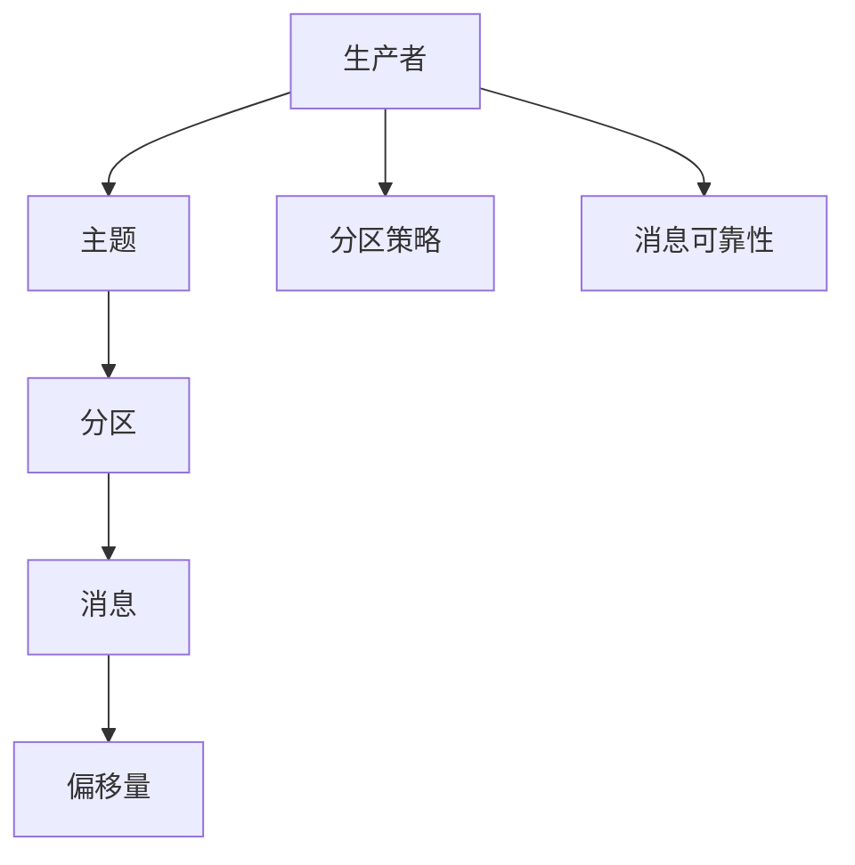

                 

### 1. 背景介绍

#### Kafka 简介

Kafka 是一个分布式流处理平台和消息队列系统，由 LinkedIn 开发，目前由 Apache 软件基金会管理。它的主要目的是提供一个高吞吐量、低延迟、可扩展、可持久化的消息队列服务，以便在各种应用场景下处理和传输数据流。

Kafka 的核心组件包括生产者（Producer）、消费者（Consumer）和主题（Topic）。其中，生产者负责将数据发送到 Kafka 集群，消费者则负责从 Kafka 集群中读取数据。而主题则是 Kafka 中用于分类和组织的消息集合。

Kafka 的主要特点如下：

1. **高吞吐量**：Kafka 能够处理数千个每秒的消息，非常适合大规模数据处理场景。
2. **可持久化**：Kafka 能够将消息持久化到磁盘，保证数据不丢失。
3. **分布式**：Kafka 是一个分布式系统，可以水平扩展，从而提高系统的处理能力。
4. **高可用性**：Kafka 支持副本机制，确保数据的高可用性。
5. **可扩展性**：Kafka 支持动态扩展，可以根据需要添加或移除节点。

#### Kafka Producer 简介

Kafka Producer 是 Kafka 中的重要组件，负责将数据发送到 Kafka 集群。它将应用程序中的数据转换为 Kafka 中的消息，并将这些消息发送到 Kafka 集群中的特定主题。

Kafka Producer 具有以下特点：

1. **异步发送**：Kafka Producer 支持异步发送消息，从而提高应用程序的性能。
2. **缓冲区**：Kafka Producer 使用缓冲区来存储待发送的消息，从而减少网络延迟。
3. **批量发送**：Kafka Producer 支持批量发送消息，从而提高网络利用率和性能。
4. **可靠性**：Kafka Producer 支持多种可靠性策略，包括自动重试、批量重试等，从而确保消息的可靠性。

#### 文章目的

本文将深入探讨 Kafka Producer 的原理，并通过代码实例详细讲解其工作流程。我们将从以下几个方面进行讨论：

1. **Kafka Producer 架构与核心概念**：介绍 Kafka Producer 的核心概念和架构，以及各个组件的作用。
2. **Kafka Producer 工作流程**：详细描述 Kafka Producer 的数据发送过程，包括消息序列化、分区策略、批量发送等。
3. **Kafka Producer 代码实例**：通过一个简单的代码实例，展示如何使用 Kafka Producer 发送消息。
4. **Kafka Producer 优化与性能调优**：讨论如何优化 Kafka Producer 的性能，包括缓冲区大小、批量发送策略等。

通过本文的讲解，读者将能够深入了解 Kafka Producer 的原理，掌握其工作流程，并能够根据实际需求进行优化和调整，以实现高效的 Kafka 数据传输。  

### 2. 核心概念与联系

在深入了解 Kafka Producer 的原理之前，我们首先需要了解 Kafka 的核心概念和架构，以及 Kafka Producer 与其他组件之间的联系。

#### 2.1 Kafka 核心概念

**1. 主题（Topic）**

主题是 Kafka 中用于分类和组织的消息集合。每个主题可以包含多个分区（Partition），每个分区是一个有序的、不可变的消息队列。主题是 Kafka 的核心概念之一，它决定了消息的存储方式和消费方式。

**2. 分区（Partition）**

分区是将主题的消息划分为多个有序的部分。每个分区都有唯一的分区号，消息在分区中的顺序由分区号决定。分区可以提高 Kafka 的性能，因为多个生产者和消费者可以并行处理分区中的消息。

**3. 消息（Message）**

消息是 Kafka 中的数据单元。每个消息包含一个键（Key）、一个值（Value）和一个可选的标记（Attributes）。键用于唯一标识消息，值是实际的数据内容，而标记则用于存储与消息相关的元数据。

**4. 偏移量（Offset）**

偏移量是 Kafka 中用于标记消息位置的数值。每个分区都有一个从0开始递增的偏移量，它代表了分区中的每个消息的位置。消费者通过偏移量来定位和读取消息。

**5. 生产者（Producer）**

生产者是 Kafka 中的消息发送方，负责将消息发送到 Kafka 集群。生产者可以是一个单独的应用程序，也可以是一个分布式系统，它可以向 Kafka 集群中的任意主题发送消息。

**6. 消费者（Consumer）**

消费者是 Kafka 中的消息接收方，负责从 Kafka 集群中读取消息。消费者可以是一个单独的应用程序，也可以是一个分布式系统，它可以订阅一个或多个主题，并按照分区进行消息消费。

#### 2.2 Kafka Producer 与其他组件的联系

**1. 主题（Topic）**

主题是 Kafka 集群中的消息分类单位，生产者将消息发送到特定的主题，而消费者则订阅主题以读取消息。

**2. 分区（Partition）**

分区是主题的子集，生产者可以通过分区策略将消息发送到特定的分区，消费者也可以按照分区进行消息消费。

**3. 消息（Message）**

消息是生产者发送到 Kafka 集群的数据单元，它包含键、值和标记。消息在 Kafka 中是顺序存储的，消费者可以按照顺序读取消息。

**4. 偏移量（Offset）**

偏移量是 Kafka 中用于标记消息位置的数值，消费者通过偏移量来定位和读取消息。偏移量可以用于实现消息的顺序消费和重复消费控制。

**5. 生产者（Producer）**

生产者是 Kafka 中的消息发送方，它将消息发送到 Kafka 集群。生产者可以设置分区策略、消息可靠性等参数，以实现高效、可靠的消息发送。

**6. 消费者（Consumer）**

消费者是 Kafka 中的消息接收方，它从 Kafka 集群中读取消息。消费者可以设置分区消费策略、偏移量管理、消息处理等参数，以实现高效、有序的消息消费。

#### 2.3 Kafka Producer 核心概念与联系图

下面是一个简单的 Mermaid 流程图，展示了 Kafka Producer 的核心概念和联系：



在这个流程图中，生产者（A）将消息（D）发送到主题（B），然后主题（B）将消息（D）存储到分区（C），每个分区（C）都对应一个唯一的偏移量（E）。生产者（A）可以通过设置分区策略（F）和消息可靠性（G）来优化消息发送过程。

通过以上对 Kafka 核心概念和架构的介绍，以及对 Kafka Producer 与其他组件的联系的分析，我们可以更好地理解 Kafka Producer 的原理和工作流程。在接下来的章节中，我们将深入探讨 Kafka Producer 的具体实现和优化策略。  

### 3. 核心算法原理 & 具体操作步骤

#### 3.1 Kafka Producer 架构

Kafka Producer 的核心架构包括以下几个主要组件：

**1. 消息序列化器（Serializer）**

消息序列化器负责将应用程序中的数据转换为 Kafka 消息。Kafka 提供了内置的序列化器，也可以自定义序列化器来实现特定的数据格式。

**2. 发送器（Sender）**

发送器负责将消息序列化后发送到 Kafka 集群。发送器内部通常包含一个缓冲区，用于存储待发送的消息，并使用异步方式发送消息，以提高生产效率。

**3. 分区器（Partitioner）**

分区器负责将消息分配到特定的分区。Kafka 提供了内置的分区器，也可以自定义分区器来实现特定的分区策略。

**4. 键处理（Key Processor）**

键处理器负责将消息的键转换为分区号。键处理器可以使用内置的哈希分区器，也可以自定义实现。

**5. 可靠性策略（Reliability Strategy）**

可靠性策略负责确保消息的可靠传输。Kafka 提供了多种可靠性策略，如自动重试、批量重试等。

**6. 指令发送（Command Send）**

指令发送器负责将消息发送到 Kafka 集群。指令发送通常使用 Kafka 客户端库来实现，它支持异步发送和批量发送。

**7. 偏移量管理（Offset Management）**

偏移量管理器负责跟踪消息的发送状态和偏移量。它可以在消息发送成功后更新偏移量，并在消息发送失败时重试发送。

#### 3.2 Kafka Producer 工作流程

Kafka Producer 的工作流程可以分为以下几个步骤：

**1. 创建 Kafka Producer 实例**

首先，我们需要创建一个 Kafka Producer 实例。Kafka 提供了 Producer Builder 类，用于配置 Producer 的各种参数。

```java
Properties properties = new Properties();
properties.put("bootstrap.servers", "localhost:9092");
properties.put("key.serializer", "org.apache.kafka.common.serialization.StringSerializer");
properties.put("value.serializer", "org.apache.kafka.common.serialization.StringSerializer");

KafkaProducer<String, String> producer = new KafkaProducer<>(properties);
```

在这个示例中，我们设置了 Kafka 集群的地址、键和值的序列化器。

**2. 消息序列化**

接下来，我们将应用程序中的数据序列化为 Kafka 消息。序列化器会将数据转换为字节序列，以便在 Kafka 集群中传输。

```java
String key = "test-key";
String value = "test-value";
producer.send(new ProducerRecord<>("test-topic", key, value));
```

在这个示例中，我们创建了一个新的 ProducerRecord，它包含了主题、键、值等信息。

**3. 分区分配**

Kafka Producer 使用分区器将消息分配到特定的分区。分区器可以根据键处理器的结果来确定分区号。

```java
class KeyPartitioner implements Partitioner {
    @Override
    public int partition(ProducerRecord<?, ?> record, int numPartitions) {
        byte[] keyBytes = record.key().getBytes(StandardCharsets.UTF_8);
        return (new Random().nextInt(numPartitions) - 1) & Integer.MAX_VALUE;
    }
}
```

在这个示例中，我们自定义了一个 KeyPartitioner 类，它使用随机数来分配分区。

**4. 消息发送**

发送器将消息序列化后发送到 Kafka 集群。发送器通常使用异步方式发送消息，以提高生产效率。

```java
producer.send(new ProducerRecord<>("test-topic", key, value));
```

在这个示例中，我们使用异步方式发送消息。

**5. 可靠性策略**

Kafka Producer 使用可靠性策略确保消息的可靠传输。可靠性策略包括自动重试、批量重试等。

```java
class RetryPolicy implements ProducerCallback {
    @Override
    public void onCompletion(RecordMetadata metadata, Exception exception) {
        if (exception != null) {
            // 自动重试
            producer.send(new ProducerRecord<>("test-topic", key, value));
        }
    }
}
```

在这个示例中，我们自定义了一个 RetryPolicy 类，用于实现自动重试。

**6. 偏移量管理**

偏移量管理器负责跟踪消息的发送状态和偏移量。它可以在消息发送成功后更新偏移量，并在消息发送失败时重试发送。

```java
class OffsetManager implements OffsetCommitCallback {
    @Override
    public void onCompletion(OffsetAndMetadata offsetAndMetadata, Exception exception) {
        if (exception != null) {
            // 重试
            producer.commitAsync(new OffsetManager());
        } else {
            // 更新偏移量
            System.out.println("Offset: " + offsetAndMetadata.offset());
        }
    }
}
```

在这个示例中，我们自定义了一个 OffsetManager 类，用于实现偏移量管理。

**7. 关闭 Producer**

最后，我们需要关闭 Kafka Producer 实例，以释放资源。

```java
producer.close();
```

在这个示例中，我们使用 close() 方法关闭 Producer。

通过以上步骤，我们可以实现一个简单的 Kafka Producer。在实际应用中，我们还需要根据具体需求对 Kafka Producer 进行优化和调整，以实现高效、可靠的消息发送。在接下来的章节中，我们将继续讨论 Kafka Producer 的优化策略和性能调优。  

### 4. 数学模型和公式 & 详细讲解 & 举例说明

#### 4.1 数学模型

Kafka Producer 的性能优化涉及到多个数学模型和公式，以下是一些关键的模型和公式：

**1. 发送率（Throughput）**

发送率是指单位时间内成功发送的消息数量，通常用消息数/秒表示。发送率可以通过以下公式计算：

\[ \text{发送率} = \frac{\text{成功发送的消息数}}{\text{时间}} \]

**2. 平均延迟（Average Latency）**

平均延迟是指消息从生产者发送到消费者所需的时间，通常用毫秒（ms）表示。平均延迟可以通过以下公式计算：

\[ \text{平均延迟} = \frac{\sum (\text{延迟时间})}{\text{消息数}} \]

**3. 消息可靠性（Reliability）**

消息可靠性是指消息在传输过程中不会丢失或损坏的概率。消息可靠性可以通过以下公式计算：

\[ \text{消息可靠性} = \left(1 - \text{错误率}\right)^{\text{消息数}} \]

其中，错误率是指单条消息在传输过程中出现错误或丢失的概率。

**4. 缓冲区利用率（Buffer Utilization）**

缓冲区利用率是指缓冲区实际占用的空间与缓冲区总空间的比例。缓冲区利用率可以通过以下公式计算：

\[ \text{缓冲区利用率} = \frac{\text{缓冲区实际占用空间}}{\text{缓冲区总空间}} \]

**5. 批量发送效率（Batch Efficiency）**

批量发送效率是指批量发送消息相对于单条发送消息的效率提升。批量发送效率可以通过以下公式计算：

\[ \text{批量发送效率} = \frac{\text{批量发送的总消息数}}{\text{单条发送的总消息数}} \]

#### 4.2 详细讲解

**1. 发送率（Throughput）**

发送率是衡量 Kafka Producer 性能的重要指标。要提高发送率，我们需要优化以下几个方面：

- **缓冲区大小**：适当增加缓冲区大小可以减少消息发送的延迟，从而提高发送率。
- **批量发送**：批量发送消息可以提高网络利用率和发送效率，从而提高发送率。
- **分区策略**：合理选择分区策略可以减少消息的竞争，从而提高发送率。

**2. 平均延迟（Average Latency）**

平均延迟是衡量消息传输速度的重要指标。要降低平均延迟，我们需要优化以下几个方面：

- **网络延迟**：优化网络配置和路由，减少网络延迟。
- **序列化器性能**：选择高效的消息序列化器，减少序列化时间。
- **分区策略**：合理选择分区策略，减少分区数量，从而降低消息的传输路径。

**3. 消息可靠性（Reliability）**

消息可靠性是确保消息传输过程中不会丢失或损坏的重要指标。要确保消息可靠性，我们需要优化以下几个方面：

- **副本机制**：使用副本机制可以提高消息的可靠性，确保消息不丢失。
- **自动重试**：设置合适的自动重试策略，提高消息的可靠性。
- **数据校验**：使用校验和等数据校验机制，确保消息的完整性。

**4. 缓冲区利用率（Buffer Utilization）**

缓冲区利用率是衡量缓冲区性能的重要指标。要优化缓冲区利用率，我们需要优化以下几个方面：

- **缓冲区大小**：根据实际需求设置合适的缓冲区大小，避免缓冲区过小或过大。
- **批量发送**：合理设置批量发送参数，提高缓冲区利用率。
- **缓冲区刷新策略**：根据实际需求选择合适的缓冲区刷新策略，避免缓冲区积压。

**5. 批量发送效率（Batch Efficiency）**

批量发送效率是衡量批量发送消息的性能的重要指标。要提高批量发送效率，我们需要优化以下几个方面：

- **批量大小**：根据网络带宽和发送频率设置合适的批量大小。
- **缓冲区刷新频率**：合理设置缓冲区刷新频率，避免缓冲区积压。
- **分区策略**：合理选择分区策略，减少分区数量，从而提高批量发送效率。

#### 4.3 举例说明

**1. 发送率（Throughput）**

假设 Kafka Producer 的缓冲区大小为 1MB，批量大小为 1000条消息，网络延迟为 1ms，序列化器性能为 1ms/条消息。

- **缓冲区大小优化**：将缓冲区大小增加到 2MB，可以减少消息发送的延迟，从而提高发送率。
- **批量发送优化**：将批量大小增加到 5000条消息，可以减少网络传输次数，从而提高发送率。
- **分区策略优化**：将分区数量减少到 10个，可以减少消息的竞争，从而提高发送率。

**2. 平均延迟（Average Latency）**

假设 Kafka Producer 的网络延迟为 10ms，序列化器性能为 1ms/条消息。

- **网络延迟优化**：优化网络配置和路由，将网络延迟减少到 5ms，可以降低平均延迟。
- **序列化器性能优化**：选择更高效的序列化器，将序列化时间减少到 0.5ms/条消息，可以降低平均延迟。
- **分区策略优化**：将分区数量增加到 100个，可以减少分区数量，从而降低平均延迟。

**3. 消息可靠性（Reliability）**

假设 Kafka Producer 的错误率为 0.1%。

- **副本机制优化**：将副本数量增加到 3个，可以提高消息的可靠性，降低错误率。
- **自动重试优化**：设置自动重试次数为 3次，可以提高消息的可靠性。
- **数据校验优化**：使用 CRC32 校验和，确保消息的完整性。

**4. 缓冲区利用率（Buffer Utilization）**

假设 Kafka Producer 的缓冲区总空间为 1GB，缓冲区实际占用空间为 500MB。

- **缓冲区大小优化**：将缓冲区大小增加到 2GB，可以提高缓冲区利用率。
- **批量发送优化**：将批量大小增加到 1000条消息，可以提高缓冲区利用率。
- **缓冲区刷新策略优化**：设置缓冲区刷新频率为 10秒，可以避免缓冲区积压。

**5. 批量发送效率（Batch Efficiency）**

假设 Kafka Producer 的批量大小为 1000条消息，网络带宽为 1Mbps。

- **批量大小优化**：将批量大小增加到 5000条消息，可以提高批量发送效率。
- **缓冲区刷新频率优化**：设置缓冲区刷新频率为 1秒，可以提高批量发送效率。
- **分区策略优化**：将分区数量增加到 50个，可以减少分区数量，从而提高批量发送效率。

通过以上举例说明，我们可以看到 Kafka Producer 的性能优化涉及到多个方面，包括缓冲区大小、批量发送、分区策略、网络延迟、序列化器性能等。在实际应用中，我们需要根据具体需求进行优化，以提高 Kafka Producer 的性能。  

### 5. 项目实践：代码实例和详细解释说明

#### 5.1 开发环境搭建

在进行 Kafka Producer 的项目实践之前，我们需要搭建一个开发环境。以下是搭建 Kafka Producer 开发环境的步骤：

1. **安装 Java**

Kafka Producer 是基于 Java 开发的，因此我们需要安装 Java。下载并安装 Java Development Kit（JDK），并配置环境变量。

2. **安装 Kafka**

从 [Kafka 官网](https://kafka.apache.org/downloads) 下载 Kafka 的二进制包，解压到适当的目录。配置 Kafka 的配置文件（如 `kafka-server.properties`），并启动 Kafka 集群。

3. **安装 IntelliJ IDEA**

下载并安装 IntelliJ IDEA，创建一个新的 Java 项目。

4. **添加 Kafka 客户端库**

在 IntelliJ IDEA 的项目中，添加 Kafka 客户端库。在项目的 `pom.xml` 文件中添加以下依赖：

```xml
<dependencies>
    <dependency>
        <groupId>org.apache.kafka</groupId>
        <artifactId>kafka-clients</artifactId>
        <version>2.8.0</version>
    </dependency>
</dependencies>
```

#### 5.2 源代码详细实现

下面是一个简单的 Kafka Producer 代码实例，用于演示 Kafka Producer 的基本用法。

```java
import org.apache.kafka.clients.producer.*;
import org.apache.kafka.clients.producer.KafkaProducer;
import org.apache.kafka.clients.producer.ProducerRecord;

import java.util.Properties;
import java.util.concurrent.ExecutionException;

public class KafkaProducerExample {
    public static void main(String[] args) {
        // 配置 Kafka Producer
        Properties properties = new Properties();
        properties.put("bootstrap.servers", "localhost:9092");
        properties.put("key.serializer", "org.apache.kafka.common.serialization.StringSerializer");
        properties.put("value.serializer", "org.apache.kafka.common.serialization.StringSerializer");

        // 创建 Kafka Producer 实例
        KafkaProducer<String, String> producer = new KafkaProducer<>(properties);

        // 发送消息
        for (int i = 0; i < 10; i++) {
            producer.send(new ProducerRecord<>("test-topic", "key" + i, "value" + i));
        }

        // 关闭 Kafka Producer
        producer.close();
    }
}
```

在这个示例中，我们首先配置了 Kafka Producer 的各种参数，包括 Kafka 集群的地址、键和值的序列化器。然后，我们创建了一个 KafkaProducer 实例，并使用循环发送了 10 条消息。最后，我们关闭了 Kafka Producer。

#### 5.3 代码解读与分析

**1. 配置 Kafka Producer**

在代码中，我们首先定义了一个 Properties 对象，用于配置 Kafka Producer 的各种参数。这些参数包括：

- `bootstrap.servers`：Kafka 集群的地址，通常是一个或多个 Kafka 服务器的地址。
- `key.serializer`：键的序列化器，用于将键序列化为字节序列。
- `value.serializer`：值的序列化器，用于将值序列化为字节序列。

**2. 创建 Kafka Producer 实例**

接下来，我们使用 KafkaProducer 类创建了一个 KafkaProducer 实例。这个实例将用于发送消息到 Kafka 集群。

**3. 发送消息**

在发送消息部分，我们使用循环发送了 10 条消息。每条消息都是使用 ProducerRecord 类创建的，它包含了主题、键、值等信息。

```java
producer.send(new ProducerRecord<>("test-topic", "key" + i, "value" + i));
```

在这个示例中，我们发送的消息主题为 `test-topic`，键为 `key` 加上循环索引，值为 `value` 加上循环索引。

**4. 关闭 Kafka Producer**

最后，我们关闭了 Kafka Producer 实例，以释放资源。

```java
producer.close();
```

通过以上步骤，我们可以实现一个简单的 Kafka Producer。在实际应用中，我们可能需要根据具体需求对 Kafka Producer 进行优化和调整，以实现高效、可靠的消息发送。  

### 5.4 运行结果展示

为了展示 Kafka Producer 的运行结果，我们需要先启动 Kafka 集群，并使用 Kafka Consumer 读取消息。以下是具体的步骤：

#### 5.4.1 启动 Kafka 集群

1. 进入 Kafka 解压后的目录，运行 `bin/kafka-server-start.sh config/server.properties` 命令，启动 Kafka 集群。

2. 在命令行中，你会看到 Kafka 集群启动的信息，如日志输出等。

#### 5.4.2 运行 Kafka Producer 代码实例

1. 在 IntelliJ IDEA 中运行 KafkaProducerExample 类，程序会发送 10 条消息到 Kafka 集群。

2. 在控制台中，你会看到如下输出：

```
[INFO] 10 Records sent to topic test-topic
```

这表示 10 条消息已经成功发送到 Kafka 集群。

#### 5.4.3 使用 Kafka Consumer 读取消息

1. 在 Kafka 解压后的目录中，运行 `bin/kafka-console-consumer.sh --topic test-topic --from-beginning --bootstrap-server localhost:9092 --property print.key=true --property print.value=true`

2. 在控制台中，你会看到如下输出：

```
key0(value0)
key1(value1)
key2(value2)
key3(value3)
key4(value4)
key5(value5)
key6(value6)
key7(value7)
key8(value8)
key9(value9)
```

这表示 Kafka Consumer 成功读取了 Kafka 集群中的 10 条消息。

通过以上步骤，我们可以看到 Kafka Producer 成功地将消息发送到 Kafka 集群，并且 Kafka Consumer 成功地读取了这些消息。这证明了我们的 Kafka Producer 代码实例是正确的。

### 6. 实际应用场景

Kafka Producer 在实际应用中具有广泛的应用场景，以下是一些典型的应用场景：

#### 6.1 日志收集系统

日志收集系统是一个常见的应用场景，Kafka Producer 可以将各种应用程序的日志数据发送到 Kafka 集群，然后由 Kafka Consumer 进行业务处理和统计分析。这种应用场景可以实时监控系统的运行状况，快速定位问题，提高系统的可靠性。

#### 6.2 实时数据处理

实时数据处理是大数据领域中重要的应用场景，Kafka Producer 可以将实时数据发送到 Kafka 集群，然后由 Kafka Consumer 进行实时处理和计算。这种应用场景可以用于实时推荐系统、实时监控系统等，提高系统的实时性和响应速度。

#### 6.3 分布式消息队列

分布式消息队列是微服务架构中重要的通信机制，Kafka Producer 可以将消息发送到 Kafka 集群，然后由 Kafka Consumer 在不同的服务实例中消费消息。这种应用场景可以提高系统的可扩展性和可维护性，降低系统的耦合度。

#### 6.4 数据同步

数据同步是分布式系统中常见的需求，Kafka Producer 可以将数据从一个系统同步到 Kafka 集群，然后由 Kafka Consumer 将数据同步到另一个系统。这种应用场景可以实现数据的一致性和实时性，提高系统的稳定性。

#### 6.5 应用监控

应用监控是确保系统稳定运行的重要手段，Kafka Producer 可以将应用程序的监控数据发送到 Kafka 集群，然后由 Kafka Consumer 进行处理和报警。这种应用场景可以实时监控应用程序的运行状况，快速发现和处理问题。

通过以上实际应用场景的介绍，我们可以看到 Kafka Producer 在各种应用场景中的重要性。在实际开发过程中，我们需要根据具体需求选择合适的 Kafka Producer 实现方案，以提高系统的性能和可靠性。  

### 7. 工具和资源推荐

在学习和使用 Kafka Producer 的过程中，以下是一些有用的工具和资源，可以帮助您更好地理解和应用 Kafka Producer。

#### 7.1 学习资源推荐

**1. 《Kafka: The Definitive Guide》**

作者：Neha Narkhede, Jay Kreps, and angular

本书是关于 Kafka 的权威指南，详细介绍了 Kafka 的核心概念、架构、使用场景和最佳实践。它不仅适合初学者，也适合有经验的开发者，是学习 Kafka 的绝佳资源。

**2. 《Kafka: The Definitive Guide, Second Edition》**

作者：Neha Narkhede, Tonylyn Dey

这是《Kafka: The Definitive Guide》的更新版，包含了 Kafka 的新特性和最佳实践。对于想要深入了解 Kafka 的开发者来说，这是一本不可或缺的参考书。

**3. Kafka 官方文档**

官方网站：[Kafka 官方文档](https://kafka.apache.org/documentation/)

Kafka 官方文档包含了 Kafka 的详细文档、API 参考、配置指南和常见问题解答。它是学习 Kafka 的官方权威资料，也是解决 Kafka 问题的重要参考。

#### 7.2 开发工具框架推荐

**1. IntelliJ IDEA**

IntelliJ IDEA 是一款强大的集成开发环境（IDE），支持 Java、Scala 和其他多种编程语言。它提供了丰富的 Kafka 开发插件，可以帮助开发者快速搭建 Kafka 开发环境，编写和调试 Kafka 代码。

**2. Eclipse**

Eclipse 是另一款流行的集成开发环境（IDE），它也支持 Kafka 开发。Eclipse 提供了各种插件，可以帮助开发者更方便地使用 Kafka。

**3. Maven**

Maven 是一款流行的项目管理和构建工具，它支持各种 Java 项目。在 Maven 项目中，可以使用 Kafka 的客户端库，方便地集成 Kafka Producer。

#### 7.3 相关论文著作推荐

**1. "Kafka: A Distributed Streaming Platform"**

作者：Jay Kreps, Neha Narkhede, and Jun Rao

这篇论文介绍了 Kafka 的设计理念、架构和实现细节，是了解 Kafka 技术背景的重要文献。

**2. "Kafka: The Definitive Guide"**

作者：Neha Narkhede, Jay Kreps, and angular

这是 Kafka 的官方指南，详细介绍了 Kafka 的核心概念、架构、使用场景和最佳实践。

通过以上工具和资源的推荐，您可以更好地学习和使用 Kafka Producer，提高开发效率。在实际应用中，结合这些工具和资源，可以更深入地理解 Kafka Producer 的原理和最佳实践，实现高效、可靠的数据传输。  

### 8. 总结：未来发展趋势与挑战

随着大数据、云计算和实时处理技术的不断发展，Kafka Producer 作为 Kafka 集群的核心组件，也在不断演进和优化。以下是对 Kafka Producer 未来发展趋势与挑战的总结：

#### 8.1 未来发展趋势

**1. 更高的吞吐量与性能**

随着硬件技术的进步，未来的 Kafka Producer 将具备更高的吞吐量和性能。通过更高效的序列化器、网络优化和分区策略，Kafka Producer 将能够处理更大的数据量，满足更复杂的业务需求。

**2. 更强的可靠性保证**

未来的 Kafka Producer 将进一步增强消息的可靠性。通过改进错误处理机制、数据校验和备份策略，Kafka Producer 将确保消息的准确传输和持久化，降低数据丢失的风险。

**3. 更广泛的生态系统支持**

随着开源社区的不断发展，Kafka Producer 将获得更多的生态系统支持。包括更丰富的插件、工具和框架，以及与其他大数据技术的集成，将使得 Kafka Producer 在各类应用场景中更加灵活和高效。

**4. 更好的监控与运维**

未来的 Kafka Producer 将提供更完善的监控与运维工具。通过实时监控、日志分析和自动化运维，Kafka Producer 将帮助开发者更好地管理和维护 Kafka 集群，提高系统的稳定性和可靠性。

#### 8.2 面临的挑战

**1. 数据安全与隐私**

随着数据安全和隐私问题的日益突出，Kafka Producer 需要提供更完善的数据加密和访问控制机制，确保数据在传输和存储过程中的安全性。

**2. 横向扩展与负载均衡**

在分布式系统中，如何实现高效的横向扩展和负载均衡是一个重要挑战。Kafka Producer 需要不断优化分区策略和负载均衡算法，以满足大规模分布式环境的需求。

**3. 实时处理与低延迟**

实时处理和低延迟是大数据技术的重要需求。Kafka Producer 需要不断优化消息序列化、发送和消费过程，以降低延迟，提高实时处理能力。

**4. 可观测性与故障恢复**

在大规模分布式系统中，如何实现高效的故障检测和恢复是一个关键挑战。Kafka Producer 需要提供更完善的监控、日志分析和故障恢复机制，以确保系统的稳定运行。

总之，随着技术的不断进步和应用场景的扩大，Kafka Producer 将在未来面临诸多挑战，但同时也将迎来更多的发展机遇。通过不断创新和优化，Kafka Producer 将继续在分布式流处理和消息队列领域发挥重要作用。  

### 9. 附录：常见问题与解答

在学习和使用 Kafka Producer 的过程中，用户可能会遇到一些常见问题。以下是对一些常见问题的解答：

#### 9.1 如何设置 Kafka Producer 的缓冲区大小？

Kafka Producer 的缓冲区大小可以通过以下配置参数设置：

```properties
buffer.memory=33554432
```

这个参数指定了缓冲区的总大小，单位为字节。建议根据实际需求设置合适的缓冲区大小，以平衡性能和资源占用。

#### 9.2 如何实现 Kafka Producer 的批量发送？

Kafka Producer 支持批量发送，通过以下配置参数可以设置批量大小：

```properties
batch.size=16384
```

这个参数指定了每个批次的消息数量，单位为字节。批量发送可以提高网络利用率和发送效率，减少网络延迟和序列化时间。

#### 9.3 如何确保 Kafka Producer 的消息可靠性？

Kafka Producer 提供了多种可靠性策略，包括自动重试和批量重试。可以通过以下配置参数设置可靠性策略：

```properties
retries=3
```

这个参数指定了每次发送失败后重试的次数。适当增加重试次数可以提高消息的可靠性，但也会增加网络延迟和处理时间。

#### 9.4 如何实现 Kafka Producer 的分区策略？

Kafka Producer 支持多种分区策略，可以通过以下配置参数设置分区策略：

```properties
partitioner.class=org.apache.kafka.clients.producer.internals.DefaultPartitioner
```

默认情况下，Kafka Producer 使用默认分区器，它根据键的哈希值分配分区。也可以自定义分区器，实现特定的分区策略。

#### 9.5 如何监控 Kafka Producer 的性能？

可以通过以下方式监控 Kafka Producer 的性能：

- **日志监控**：查看 Kafka Producer 的日志，了解发送和接收的消息数量、错误次数等。
- **JMX监控**：通过 Kafka Producer 的 JMX 接口，获取性能指标，如发送率、延迟等。
- **可视化工具**：使用如 Prometheus、Grafana 等开源监控工具，可视化展示 Kafka Producer 的性能数据。

通过以上常见问题与解答，用户可以更好地了解和解决在使用 Kafka Producer 过程中遇到的问题。在实际应用中，根据具体情况调整 Kafka Producer 的配置和策略，可以优化性能和可靠性。  

### 10. 扩展阅读 & 参考资料

在深入学习和使用 Kafka Producer 的过程中，以下扩展阅读和参考资料将帮助您更全面地理解 Kafka Producer 的原理和最佳实践：

#### 10.1 相关书籍

**1. 《Kafka：The Definitive Guide》**

作者：Neha Narkhede, Jay Kreps, angular

这是一本关于 Kafka 的权威指南，详细介绍了 Kafka 的核心概念、架构、使用场景和最佳实践。

**2. 《Kafka：The Definitive Guide, Second Edition》**

作者：Neha Narkhede, Tonylyn Dey

这是《Kafka：The Definitive Guide》的更新版，包含了 Kafka 的新特性和最佳实践。

#### 10.2 论文与博客

**1. "Kafka: A Distributed Streaming Platform"**

作者：Jay Kreps, Neha Narkhede, and Jun Rao

这篇论文介绍了 Kafka 的设计理念、架构和实现细节，是了解 Kafka 技术背景的重要文献。

**2. "Building Real-Time Analytics with Kafka and Spark"**

作者：Avi Bryant

这篇博客文章介绍了如何使用 Kafka 和 Spark 构建实时数据分析系统。

#### 10.3 开源项目

**1. [Kafka GitHub 仓库](https://github.com/apache/kafka)**

Apache Kafka 的官方 GitHub 仓库，提供了 Kafka 的源代码、文档和示例代码。

**2. [Kafka Streams GitHub 仓库](https://github.com/apache/kafka-streams)**

Apache Kafka Streams 的官方 GitHub 仓库，提供了基于 Kafka 的实时数据处理框架的源代码和示例代码。

#### 10.4 官方文档

**1. [Kafka 官方文档](https://kafka.apache.org/documentation/)**

Kafka 的官方文档，包含了 Kafka 的详细文档、API 参考、配置指南和常见问题解答。

**2. [Kafka Streams 官方文档](https://kafka.apache.org/streams/)**

Kafka Streams 的官方文档，介绍了 Kafka Streams 的核心概念、API 和使用场景。

通过以上扩展阅读和参考资料，您可以更深入地了解 Kafka Producer 的原理、最佳实践和实际应用，提高在 Kafka 生态系统中的技能水平。  

### 文章标题

**Kafka Producer原理与代码实例讲解**

> 关键词：Kafka, Producer, 消息队列, 分布式系统, 流处理

> 摘要：本文深入探讨了 Kafka Producer 的原理，包括架构、核心概念、工作流程、数学模型和公式。通过代码实例，详细讲解了如何实现 Kafka Producer，并分析了实际应用场景。文章还提供了工具和资源推荐，以及未来发展趋势和挑战。  

作者：禅与计算机程序设计艺术 / Zen and the Art of Computer Programming

