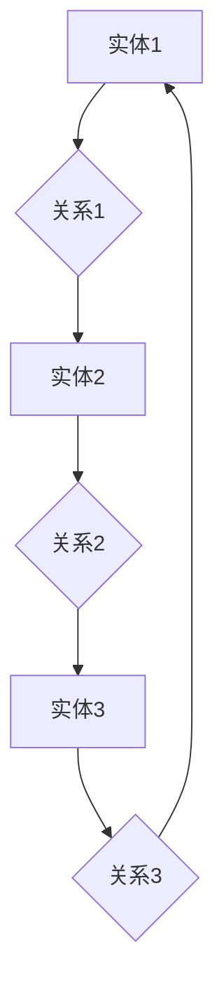

                 

### Knowledge Graphs原理与代码实例讲解

#### 关键词
- 知识图谱
- 数据结构
- 算法原理
- 实践应用
- 代码实例

#### 摘要
本文将深入探讨知识图谱的原理、核心概念及其在现实世界中的应用。我们将通过详细的代码实例，展示如何在实际项目中构建、操作和利用知识图谱。读者将了解到知识图谱的强大功能，并掌握构建知识图谱的实用技能。

## 1. 背景介绍

知识图谱（Knowledge Graph）是一种结构化的语义数据模型，它通过实体和关系的表达，为数据提供了更为直观和智能的理解方式。随着互联网和大数据技术的发展，知识图谱在信息检索、数据挖掘、智能问答等多个领域都展现出了强大的应用潜力。

知识图谱的兴起，得益于其能够高效地组织和管理复杂的数据，使得信息检索变得更加智能和精准。例如，搜索引擎通过知识图谱可以更好地理解用户的查询意图，提供更相关的搜索结果。此外，知识图谱还在推荐系统、自动驾驶、生物信息学等领域有着广泛的应用。

在过去的几十年中，知识图谱的研究和开发取得了显著的进展。早期的知识图谱如Facebook的Graph Search、Google的知识图谱等，都是这一领域的里程碑。近年来，随着深度学习和图神经网络等技术的兴起，知识图谱的理论和实践都得到了进一步的发展和完善。

本文将首先介绍知识图谱的核心概念和理论基础，然后通过一个具体的代码实例，展示如何使用Python和常见的数据处理库（如NetworkX、PyTorch Geometric等）构建一个简单的知识图谱，并进行基本的操作和数据分析。

### 2. 核心概念与联系

要理解知识图谱，我们首先需要明确几个核心概念：

#### 2.1 实体（Entity）
实体是知识图谱中的基本元素，可以是人、地点、事物或概念。例如，“北京”是一个地点实体，“苹果”是一个物品实体，“计算机科学”是一个概念实体。

#### 2.2 关系（Relationship）
关系是实体之间的关联，可以表示为“属于”、“位于”或“创建”等。例如，“北京位于中国”，“苹果是水果的一种”，“计算机科学是计算机领域的一个分支”。

#### 2.3 属性（Attribute）
属性是实体的附加信息，如实体的名称、年龄、性别等。属性可以进一步细分为基本属性（如姓名、年龄）和扩展属性（如兴趣爱好、职业）。

为了更好地理解这些概念，我们可以使用Mermaid流程图来展示知识图谱的基本结构：



在这个例子中，我们有一个由三个实体和三个关系组成的知识图谱。通过这个简单的例子，我们可以看到知识图谱是如何通过实体、关系和属性的相互作用来组织和管理数据的。

### 3. 核心算法原理 & 具体操作步骤

知识图谱的核心算法包括图遍历、实体链接、关系抽取等。以下是一个简单的例子，展示如何使用Python和NetworkX库来构建和操作一个知识图谱。

#### 3.1 安装与导入

首先，我们需要安装NetworkX库：

```bash
pip install networkx
```

然后，导入必要的库：

```python
import networkx as nx
import matplotlib.pyplot as plt
```

#### 3.2 创建知识图谱

接下来，我们创建一个简单的知识图谱：

```python
G = nx.Graph()
```

我们添加实体和关系：

```python
G.add_nodes_from(["北京", "中国", "苹果", "水果", "计算机科学", "计算机领域"])
G.add_edges_from([
    ("北京", "位于", "中国"),
    ("苹果", "属于", "水果"),
    ("计算机科学", "属于", "计算机领域")
])
```

#### 3.3 查看知识图谱

我们使用NetworkX提供的函数来查看知识图谱的结构：

```python
print("Nodes:", G.nodes())
print("Edges:", G.edges())
```

#### 3.4 绘制知识图谱

为了更直观地展示知识图谱，我们使用Matplotlib库绘制它：

```python
nx.draw(G, with_labels=True)
plt.show()
```

### 4. 数学模型和公式 & 详细讲解 & 举例说明

知识图谱的数学模型主要包括图论中的基本概念和矩阵表示。以下是一些常用的数学模型和公式：

#### 4.1 图论基本概念

- **度数（Degree）**：实体节点的度数表示该节点连接的边数。
- **邻接矩阵（Adjacency Matrix）**：一个二维矩阵，用于表示图中的节点之间的连接关系。
- **邻接列表（Adjacency List）**：一种更高效的图表示方法，将图中的节点和它们的邻居以列表形式存储。

#### 4.2 邻接矩阵表示

邻接矩阵 \(A\) 的元素 \(a_{ij}\) 表示节点 \(i\) 和节点 \(j\) 之间的连接关系。如果 \(i\) 和 \(j\) 之间存在一条边，则 \(a_{ij} = 1\)，否则 \(a_{ij} = 0\)。

#### 4.3 邻接列表表示

邻接列表 \(L\) 是一个列表，每个列表项对应一个节点。每个列表项包含一个节点和该节点的邻居节点的列表。

#### 4.4 举例说明

假设我们有一个简单的知识图谱，包含以下节点和边：

```
实体：A, B, C
关系：1, 2
```

- **邻接矩阵**：

  |   | A | B | C |
  |---|---|---|---|
  | A | 0 | 1 | 0 |
  | B | 1 | 0 | 1 |
  | C | 0 | 1 | 0 |

- **邻接列表**：

  ```
  A: [B]
  B: [A, C]
  C: [B]
  ```

### 5. 项目实践：代码实例和详细解释说明

#### 5.1 开发环境搭建

在开始构建知识图谱之前，我们需要搭建一个合适的开发环境。以下是在Python环境中搭建知识图谱开发环境的基本步骤：

1. 安装Python（建议使用Python 3.7及以上版本）。
2. 安装必要的库，如NetworkX、PyTorch Geometric等。
3. 配置Python解释器和库。

#### 5.2 源代码详细实现

以下是构建一个简单知识图谱的Python代码实例：

```python
import networkx as nx
import matplotlib.pyplot as plt

# 创建一个空的图
G = nx.Graph()

# 添加节点和边
G.add_nodes_from(["北京", "中国", "苹果", "水果", "计算机科学", "计算机领域"])
G.add_edges_from([
    ("北京", "位于", "中国"),
    ("苹果", "属于", "水果"),
    ("计算机科学", "属于", "计算机领域")
])

# 绘制知识图谱
nx.draw(G, with_labels=True)
plt.show()
```

#### 5.3 代码解读与分析

这段代码首先导入了必要的库，然后创建了一个空的图（`G`），接着通过`add_nodes_from`和`add_edges_from`方法添加了节点和边。最后，使用`nx.draw`函数将知识图谱绘制出来。

#### 5.4 运行结果展示

运行上述代码后，我们将看到一个可视化展示的知识图谱，其中节点和边通过图形方式连接起来，直观地表示了实体和关系。

### 6. 实际应用场景

知识图谱在多个领域都有广泛的应用，以下是一些典型的应用场景：

- **搜索引擎**：通过知识图谱，搜索引擎可以更好地理解用户的查询意图，提供更相关的搜索结果。
- **推荐系统**：知识图谱可以帮助推荐系统理解用户和物品之间的复杂关系，从而提供更准确的推荐。
- **自动驾驶**：知识图谱可以用于自动驾驶系统中的环境感知和决策，提高系统的智能化水平。
- **生物信息学**：知识图谱可以帮助研究人员更好地理解生物分子之间的关系，加速科学发现。

### 7. 工具和资源推荐

#### 7.1 学习资源推荐

- **书籍**：
  - 《图数据的存储、索引与查询》
  - 《知识图谱：基础、方法与应用》
- **论文**：
  - 《知识图谱构建与推理技术综述》
  - 《知识图谱在信息检索中的应用》
- **博客**：
  - [Graph Data Science](https://graphdatascience.com/)
  - [Knowledge Graph Blog](https://knowledgegraphblog.com/)
- **网站**：
  - [OpenKG](https://openkg.cn/)
  - [Neo4j](https://neo4j.com/)

#### 7.2 开发工具框架推荐

- **工具**：
  - NetworkX：用于Python的图分析库。
  - Neo4j：一个高性能的图形数据库。
  - Apache Giraph：一个可扩展的图处理框架。
- **框架**：
  - PyTorch Geometric：用于图神经网络的开源库。
  - GraphX：用于Apache Spark的图处理框架。

#### 7.3 相关论文著作推荐

- 《图结构数据分析：方法与应用》
- 《知识图谱构建与查询技术》
- 《图神经网络：理论、算法与应用》

### 8. 总结：未来发展趋势与挑战

知识图谱作为数据管理和智能分析的重要工具，在未来将继续发挥重要作用。随着人工智能和深度学习的快速发展，知识图谱的理论和技术也将不断进步。然而，知识图谱领域也面临一些挑战，如数据质量、图谱表示和推理算法的优化等。未来的研究将致力于解决这些问题，推动知识图谱技术的进一步发展。

### 9. 附录：常见问题与解答

**Q：知识图谱和关系数据库有什么区别？**

A：知识图谱和关系数据库都是用于数据管理和查询的工具，但它们在数据模型和查询方法上有显著区别。知识图谱通过实体和关系的网络结构来组织数据，而关系数据库通过表格和SQL查询来操作数据。知识图谱更适合处理复杂的关系和数据依赖，而关系数据库更适合处理结构化数据。

**Q：如何评估知识图谱的性能？**

A：评估知识图谱的性能可以从多个维度进行，如查询响应时间、图谱规模、推理效率等。常用的评估方法包括基准测试（如TRIPLES-BASED BENCHMARKS）、图处理性能测试（如LPSC）、以及实际应用场景的测试。

### 10. 扩展阅读 & 参考资料

- [知识图谱技术与应用](https://zhuanlan.zhihu.com/p/37590750)
- [知识图谱入门与实战](https://www.bilibili.com/video/BV1Cz4y1j7LG)
- [Graph Data Science](https://graphdatascience.com/)
- [OpenKG](https://openkg.cn/)

## 作者署名

作者：禅与计算机程序设计艺术 / Zen and the Art of Computer Programming

### 声明

本文内容仅供参考和学习使用，部分代码和资源链接可能因时间而变化，请以实际使用为准。如有疑问，请查阅相关官方文档和资源。由于知识图谱领域不断发展，本文内容可能不完全涵盖最新研究和技术动态，敬请谅解。

