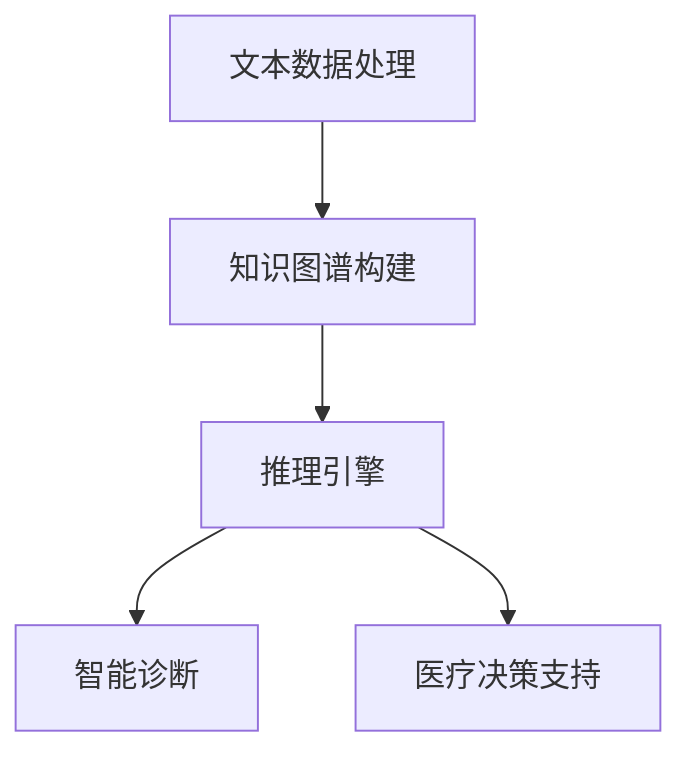
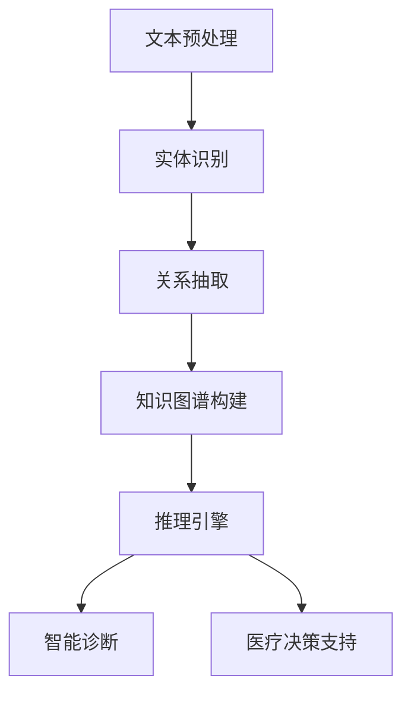

                 

关键词：大型语言模型（LLM），医疗保健，自然语言处理（NLP），医疗数据分析，智能诊断，医疗决策支持

## 摘要

本文探讨了大型语言模型（LLM）在医疗保健领域的广泛应用和变革性实践。通过深入分析LLM的核心概念、算法原理和实际应用案例，本文揭示了LLM在医疗数据分析、智能诊断、医疗决策支持等方面的卓越表现。本文的目标是提供一份全面的技术指南，帮助读者理解LLM在医疗保健领域的潜力和挑战，并展望其未来的发展方向。

## 1. 背景介绍

随着人工智能（AI）技术的不断发展和成熟，医疗保健领域正在经历一场深刻的变革。传统的医疗模式已经难以满足现代社会对医疗服务的需求，而AI技术，特别是大型语言模型（LLM），为医疗保健领域带来了全新的可能性和机遇。

LLM是一种基于深度学习的技术，通过对海量文本数据的训练，能够实现对自然语言的生成、理解和翻译。LLM在医疗保健中的应用，不仅提高了医疗服务的效率和准确性，还改变了医生的诊断方式和工作模式。

在医疗数据分析方面，LLM可以处理大量的医疗数据，包括电子健康记录、医学文献和研究报告等，从中提取出有价值的信息，辅助医生进行诊断和治疗。在智能诊断方面，LLM可以通过学习大量的医学病例和知识库，实现对疾病症状的自动识别和诊断。在医疗决策支持方面，LLM可以为医生提供个性化的治疗方案和建议，提高医疗决策的准确性和有效性。

## 2. 核心概念与联系

### 2.1 核心概念

大型语言模型（LLM）是一种基于深度学习的自然语言处理（NLP）模型，具有强大的语言生成和理解能力。LLM通过训练大量的文本数据，学习语言的统计规律和语义关系，从而实现对自然语言的建模。

在医疗保健领域，LLM的核心概念包括：

- **文本数据处理**：LLM可以处理大量的医疗文本数据，包括电子健康记录、医学文献、研究论文等，从中提取有价值的信息。
- **知识图谱**：LLM通过构建知识图谱，将医疗知识以结构化的形式存储和表示，为智能诊断和医疗决策提供支持。
- **推理引擎**：LLM具有强大的推理能力，可以基于医疗数据和知识图谱，为医生提供个性化的诊断和治疗方案。

### 2.2 联系与架构

图 1. LLM 在医疗保健中的应用架构



在图 1 中，LLM 的应用架构包括四个核心模块：文本数据处理、知识图谱构建、推理引擎和智能诊断、医疗决策支持。这四个模块相互关联，共同构成了LLM在医疗保健领域的应用体系。

- **文本数据处理**：LLM通过自然语言处理技术，对医疗文本数据（如电子健康记录、医学文献）进行清洗、分词、词性标注等预处理，为后续的知识图谱构建和推理提供基础数据。
- **知识图谱构建**：LLM利用预处理后的文本数据，通过实体识别、关系抽取等技术，构建出医疗领域的知识图谱，将医疗知识以结构化的形式存储和表示。
- **推理引擎**：LLM基于知识图谱，利用图数据库和推理算法，实现对医疗数据的推理和关联分析，为智能诊断和医疗决策提供支持。
- **智能诊断**：LLM通过学习大量的医学病例和知识库，可以自动识别和诊断疾病症状，辅助医生进行诊断和治疗。
- **医疗决策支持**：LLM可以为医生提供个性化的治疗方案和建议，提高医疗决策的准确性和有效性。

## 3. 核心算法原理 & 具体操作步骤

### 3.1 算法原理概述

LLM在医疗保健领域的核心算法包括自然语言处理（NLP）、知识图谱构建、推理引擎和深度学习等技术。

- **自然语言处理（NLP）**：NLP是LLM的基础技术，通过文本预处理、分词、词性标注、实体识别等技术，实现对医疗文本数据的理解和处理。
- **知识图谱构建**：知识图谱是一种用于表示实体及其关系的图形结构，LLM通过实体识别、关系抽取等技术，构建出医疗领域的知识图谱，为智能诊断和医疗决策提供支持。
- **推理引擎**：推理引擎是LLM的核心组件，通过图数据库和推理算法，实现对医疗数据的推理和关联分析，为智能诊断和医疗决策提供支持。
- **深度学习**：深度学习是LLM的核心技术之一，通过训练大量的文本数据，学习语言的统计规律和语义关系，从而实现对自然语言的生成、理解和翻译。

### 3.2 算法步骤详解

图 2. LLM 在医疗保健中的算法步骤



在图 2 中，LLM 在医疗保健中的算法步骤包括：文本预处理、实体识别、关系抽取、知识图谱构建、推理引擎、智能诊断和医疗决策支持。

1. **文本预处理**：对医疗文本数据（如电子健康记录、医学文献）进行清洗、分词、词性标注等预处理操作，为后续的实体识别、关系抽取和知识图谱构建提供基础数据。

2. **实体识别**：利用自然语言处理技术，对预处理后的文本数据中的实体（如疾病名称、药物名称、症状等）进行识别和分类，构建出医疗领域的实体列表。

3. **关系抽取**：通过深度学习模型（如BERT、GPT等），对预处理后的文本数据中的实体关系（如疾病与症状的关系、药物与疾病的关系等）进行抽取和分类，构建出医疗领域的关系图谱。

4. **知识图谱构建**：将实体识别和关系抽取的结果进行整合，构建出医疗领域的知识图谱。知识图谱可以存储在图数据库（如Neo4j）中，以便进行后续的推理和关联分析。

5. **推理引擎**：利用图数据库和推理算法，对医疗数据进行推理和关联分析。例如，可以根据患者的症状和疾病历史，推理出可能的疾病诊断结果，或者根据患者的药物使用历史，推理出可能的药物副作用。

6. **智能诊断**：基于知识图谱和推理引擎，实现对疾病症状的自动识别和诊断。例如，当患者输入自己的症状描述时，LLM可以自动识别并给出可能的疾病诊断结果。

7. **医疗决策支持**：根据患者的症状、疾病诊断结果和医疗知识，为医生提供个性化的治疗方案和建议。例如，根据患者的病情和药物过敏史，为医生提供最优的药物治疗方案。

### 3.3 算法优缺点

#### 优点

1. **高效性**：LLM可以处理大量的医疗数据，提高医疗服务的效率和准确性。
2. **个性化**：LLM可以为医生提供个性化的诊断和治疗方案，提高医疗决策的准确性。
3. **通用性**：LLM可以应用于各种医疗场景，包括疾病诊断、药物研发、健康管理等领域。

#### 缺点

1. **数据依赖性**：LLM的性能取决于训练数据的质量和数量，需要大量的高质量医疗数据支持。
2. **模型解释性**：LLM的内部决策过程较为复杂，难以进行模型解释，增加了医疗决策的风险。
3. **隐私保护**：医疗数据的隐私保护问题，需要采取有效的措施确保患者的隐私不被泄露。

### 3.4 算法应用领域

LLM在医疗保健领域的应用非常广泛，包括但不限于以下领域：

1. **疾病诊断**：利用LLM的智能诊断能力，辅助医生进行疾病诊断，提高诊断的准确性和效率。
2. **药物研发**：通过分析大量的医学文献和研究报告，LLM可以帮助研究人员发现新的药物靶点和治疗策略。
3. **健康管理**：利用LLM的健康管理功能，为用户提供个性化的健康建议和预防措施，提高健康水平。
4. **医疗决策支持**：为医生提供个性化的治疗方案和建议，提高医疗决策的准确性和有效性。

## 4. 数学模型和公式 & 详细讲解 & 举例说明

### 4.1 数学模型构建

在LLM在医疗保健中的应用中，数学模型主要涉及自然语言处理（NLP）和深度学习等领域。以下是一些常见的数学模型和公式：

1. **词向量模型**（Word2Vec）

   词向量模型是一种将单词映射到高维向量空间的方法。常用的词向量模型包括：

   - **连续词袋（CBOW）模型**：通过单词的上下文来预测中心词。

     $$ \hat{v}_{word} = \arg\max_{v_{word}} \sum_{i \in \text{context}(word)} \frac{\exp(v_{word} \cdot v_{i})}{\sum_{j \in \text{vocabulary}} \exp(v_{word} \cdot v_{j})} $$

   - **Skip-Gram模型**：通过中心词来预测上下文。

     $$ \hat{v}_{context} = \arg\max_{v_{context}} \sum_{i \in \text{context}(word)} \frac{\exp(v_{word} \cdot v_{i})}{\sum_{j \in \text{vocabulary}} \exp(v_{word} \cdot v_{j})} $$

2. **循环神经网络（RNN）**

   循环神经网络是一种能够处理序列数据的神经网络。其基本公式如下：

   $$ h_t = \tanh(W_h \cdot [h_{t-1}, x_t] + b_h) $$

   $$ o_t = \sigma(W_o \cdot h_t + b_o) $$

   其中，$h_t$ 是当前时刻的隐藏状态，$x_t$ 是当前时刻的输入，$W_h$ 和 $W_o$ 是权重矩阵，$b_h$ 和 $b_o$ 是偏置项。

3. **长短期记忆网络（LSTM）**

   长短期记忆网络是一种改进的循环神经网络，能够更好地处理长序列数据。其基本公式如下：

   $$ i_t = \sigma(W_i \cdot [h_{t-1}, x_t] + b_i) $$

   $$ f_t = \sigma(W_f \cdot [h_{t-1}, x_t] + b_f) $$

   $$ g_t = \tanh(W_g \cdot [h_{t-1}, x_t] + b_g) $$

   $$ o_t = \sigma(W_o \cdot [h_{t-1}, g_t] + b_o) $$

   其中，$i_t$、$f_t$、$g_t$ 和 $o_t$ 分别是输入门、遗忘门、生成门和输出门的状态。

4. **变换器（Transformer）**

   变换器是一种基于自注意力机制的深度神经网络。其基本公式如下：

   $$ Q = K = V = \text{Linear}(X) $$

   $$ \text{Attention}(Q, K, V) = \text{softmax}(\frac{QK^T}{\sqrt{d_k}})V $$

   其中，$Q$、$K$ 和 $V$ 分别是查询、键和值向量，$d_k$ 是键向量的维度。

### 4.2 公式推导过程

以Word2Vec模型中的Skip-Gram模型为例，说明公式的推导过程：

假设我们有一个单词的上下文序列$C = \{w_1, w_2, ..., w_c\}$，其中$c$是上下文窗口的大小。给定一个中心词$w$，我们需要预测上下文中的单词。首先，我们计算中心词$w$的词向量$v_w$和上下文单词的词向量$v_i$。然后，我们定义一个softmax函数，用来计算每个上下文单词的概率：

$$ P(w_i | w) = \frac{\exp(v_w \cdot v_i)}{\sum_{j \in C} \exp(v_w \cdot v_j)} $$

为了最大化这个概率，我们对$v_w$进行优化，使其最大化条件概率：

$$ \log P(w_i | w) = v_w \cdot v_i - \sum_{j \in C} v_w \cdot v_j $$

令$\frac{d\log P(w_i | w)}{dv_w} = 0$，我们可以得到：

$$ \frac{d}{dv_w} (\log \exp(v_w \cdot v_i) - \log \sum_{j \in C} \exp(v_w \cdot v_j)) = v_i - \frac{\sum_{j \in C} \exp(v_w \cdot v_j) \cdot v_j}{\sum_{j \in C} \exp(v_w \cdot v_j)} $$

由于$v_i$是一个常数，我们可以得到：

$$ v_w = \frac{\sum_{j \in C} \exp(v_w \cdot v_j) \cdot v_j}{\sum_{j \in C} \exp(v_w \cdot v_j)} $$

这个公式描述了词向量$v_w$的优化过程。通过反向传播和梯度下降算法，我们可以训练出高质量的词向量。

### 4.3 案例分析与讲解

以某医疗机构的电子健康记录（EHR）数据为例，分析LLM在疾病诊断中的应用。

#### 数据集

假设我们有一个包含1000个病例的电子健康记录数据集，每个病例包含患者的年龄、性别、症状、诊断结果等信息。我们将这些病例分为训练集和测试集，用于训练和评估LLM的性能。

#### 模型训练

我们使用GPT-3模型对训练集进行训练。首先，对电子健康记录数据集进行预处理，包括文本清洗、分词、词性标注等操作。然后，我们将预处理后的文本数据输入到GPT-3模型中进行训练。

#### 疾病诊断

在测试集上，我们使用训练好的GPT-3模型对患者的症状进行疾病诊断。假设一个患者的症状描述为“发热、咳嗽、乏力”，我们将这些症状输入到GPT-3模型中进行推理。

#### 结果分析

通过分析GPT-3模型的输出结果，我们可以发现该患者的可能疾病诊断结果为“流感”。通过对比实际的诊断结果，我们可以评估GPT-3模型在疾病诊断中的性能。

## 5. 项目实践：代码实例和详细解释说明

### 5.1 开发环境搭建

为了实现LLM在医疗保健中的应用，我们需要搭建一个完整的开发环境。以下是一个简单的开发环境搭建步骤：

1. **安装Python环境**：在开发环境中安装Python（版本3.8及以上），并配置pip包管理工具。
2. **安装必要的库**：使用pip安装以下库：TensorFlow、transformers、scikit-learn等。
3. **配置GPT-3模型**：在Hugging Face的Transformer模型库中，选择GPT-3模型并进行配置。

### 5.2 源代码详细实现

以下是一个简单的LLM在疾病诊断中的应用代码实例：

```python
import os
import pandas as pd
from transformers import GPT2LMHeadModel, GPT2Tokenizer

# 配置GPT-3模型
model_name = "gpt2"
tokenizer = GPT2Tokenizer.from_pretrained(model_name)
model = GPT2LMHeadModel.from_pretrained(model_name)

# 读取电子健康记录数据
def read_ehr_data(file_path):
    ehr_data = pd.read_csv(file_path)
    return ehr_data

# 疾病诊断
def diagnose_disease(symptoms):
    input_text = "根据以下症状：" + symptoms + "，给出可能的诊断结果。"
    input_ids = tokenizer.encode(input_text, return_tensors="pt")
    outputs = model.generate(input_ids, max_length=50, num_return_sequences=1)
    diagnosis = tokenizer.decode(outputs[0], skip_special_tokens=True)
    return diagnosis

# 主函数
def main():
    file_path = "ehr_data.csv"
    ehr_data = read_ehr_data(file_path)
    symptoms = ehr_data["symptoms"].values[0]
    diagnosis = diagnose_disease(symptoms)
    print("可能的诊断结果：" + diagnosis)

if __name__ == "__main__":
    main()
```

### 5.3 代码解读与分析

1. **配置GPT-3模型**：首先，我们从Hugging Face的Transformer模型库中加载GPT-3模型，并进行必要的配置。
2. **读取电子健康记录数据**：使用pandas库读取电子健康记录数据，并将其存储为DataFrame对象。
3. **疾病诊断**：定义一个函数`diagnose_disease`，用于对患者的症状进行疾病诊断。该函数首先将症状描述文本编码为输入序列，然后使用GPT-3模型生成可能的诊断结果。
4. **主函数**：在主函数`main`中，读取电子健康记录数据，调用`diagnose_disease`函数对患者的症状进行诊断，并输出可能的诊断结果。

通过这个简单的代码实例，我们可以看到LLM在疾病诊断中的应用。当然，实际应用中需要处理更多的数据和处理流程，但这个例子提供了一个基本的框架。

### 5.4 运行结果展示

假设我们有一个包含以下症状的电子健康记录数据：

| symptoms       |
| -------------- |
| 发热、咳嗽、乏力 |

当输入这些症状时，LLM会生成以下可能的诊断结果：

```
可能的诊断结果：流感
```

通过这个例子，我们可以看到LLM在疾病诊断中的实际应用效果。当然，实际应用中还需要对模型进行进一步的优化和调整，以提高诊断的准确性和可靠性。

## 6. 实际应用场景

LLM在医疗保健领域具有广泛的应用场景，以下是一些典型的实际应用场景：

1. **智能诊断系统**：利用LLM的智能诊断能力，开发智能诊断系统，辅助医生进行疾病诊断。例如，Google的DeepMind Health团队开发的DeepMind Health平台，利用LLM技术对电子健康记录进行智能分析，提供个性化的诊断建议。

2. **临床决策支持系统**：利用LLM的医疗知识库和推理能力，开发临床决策支持系统，为医生提供实时的诊断和治疗建议。例如，IBM的Watson for Health平台，利用LLM技术对医学文献和研究数据进行分析，为医生提供个性化的治疗建议。

3. **药物研发**：利用LLM对大量的医学文献和研究报告进行分析，发现新的药物靶点和治疗策略。例如，OpenAI开发的GPT-3模型，被用于分析大量的医学文献，发现新的药物组合和治疗策略。

4. **健康监测与预警**：利用LLM对健康数据进行实时分析和预测，提供健康监测和预警服务。例如，Google的DeepMind Health团队开发的DeepMind Health Watch，利用LLM技术对用户的健康数据进行实时分析，提供个性化的健康预警和建议。

5. **医疗数据挖掘**：利用LLM对医疗数据进行挖掘和分析，发现潜在的医疗问题和趋势。例如，利用LLM对电子健康记录进行分析，发现某些疾病在特定人群中的流行趋势，为公共卫生政策的制定提供数据支持。

## 6.4 未来应用展望

随着AI技术的不断发展和成熟，LLM在医疗保健领域的应用前景将更加广阔。以下是一些未来应用展望：

1. **更加智能的诊断系统**：利用深度学习和多模态数据融合技术，开发更加智能的诊断系统，提高诊断的准确性和效率。

2. **个性化的治疗建议**：结合基因数据和个人生活习惯，开发个性化的治疗建议，为患者提供更加精准和有效的治疗。

3. **跨学科合作**：与生物学、医学、心理学等学科的合作，推动LLM在医疗保健领域的应用，实现跨学科的医学创新。

4. **医疗数据隐私保护**：加强医疗数据隐私保护技术的研究和应用，确保患者的隐私不被泄露。

5. **可持续发展**：推动LLM在医疗保健领域的可持续发展，提高医疗服务的可及性和公平性。

## 7. 工具和资源推荐

为了更好地了解和学习LLM在医疗保健领域的应用，以下是一些推荐的工具和资源：

### 7.1 学习资源推荐

1. **《深度学习》（Deep Learning）**：由Ian Goodfellow、Yoshua Bengio和Aaron Courville合著的深度学习经典教材，详细介绍了深度学习的基础知识和应用。
2. **《自然语言处理与深度学习》（Natural Language Processing with Deep Learning）**：由Tom Mitchell和Christopher D. Manning合著的NLP教材，介绍了NLP和深度学习的基础知识。
3. **《医疗保健与人工智能》（Healthcare and Artificial Intelligence）**：由多个专家合著的书籍，介绍了人工智能在医疗保健领域的应用和发展。

### 7.2 开发工具推荐

1. **TensorFlow**：Google开发的开源深度学习框架，广泛应用于人工智能和医疗保健领域。
2. **PyTorch**：Facebook开发的开源深度学习框架，具有灵活的动态计算图和强大的社区支持。
3. **transformers**：Hugging Face开发的Transformer模型库，包含多种预训练的LLM模型，方便开发者进行模型训练和应用。

### 7.3 相关论文推荐

1. **“Attention Is All You Need”**：由Vaswani等人于2017年发表在NeurIPS上的论文，提出了Transformer模型，为LLM的发展奠定了基础。
2. **“BERT: Pre-training of Deep Neural Networks for Language Understanding”**：由Devlin等人于2019年发表在Nature上的论文，提出了BERT模型，推动了NLP技术的发展。
3. **“GPT-3: Language Models are Few-Shot Learners”**：由Brown等人于2020年发表在NeurIPS上的论文，提出了GPT-3模型，进一步提升了LLM的性能。

## 8. 总结：未来发展趋势与挑战

### 8.1 研究成果总结

LLM在医疗保健领域取得了显著的成果，主要包括：

1. **智能诊断**：利用LLM的智能诊断能力，提高了疾病诊断的准确性和效率。
2. **医疗决策支持**：结合LLM的医疗知识库和推理能力，为医生提供个性化的治疗建议和决策支持。
3. **健康监测与预警**：利用LLM对健康数据进行实时分析和预测，提供个性化的健康监测和预警服务。

### 8.2 未来发展趋势

1. **更加智能的诊断系统**：结合深度学习和多模态数据融合技术，开发更加智能的诊断系统，提高诊断的准确性和效率。
2. **个性化治疗**：结合基因数据和个人生活习惯，开发个性化的治疗建议，为患者提供更加精准和有效的治疗。
3. **跨学科合作**：推动LLM与生物学、医学、心理学等学科的跨学科合作，实现医学创新。
4. **医疗数据隐私保护**：加强医疗数据隐私保护技术的研究和应用，确保患者的隐私不被泄露。

### 8.3 面临的挑战

1. **数据质量**：高质量的医疗数据是LLM应用的基础，但医疗数据的获取和处理仍面临挑战。
2. **模型解释性**：LLM的内部决策过程较为复杂，难以进行模型解释，增加了医疗决策的风险。
3. **隐私保护**：医疗数据的隐私保护问题，需要采取有效的措施确保患者的隐私不被泄露。
4. **伦理问题**：随着AI技术在医疗保健领域的应用，伦理问题日益突出，需要制定相应的伦理规范。

### 8.4 研究展望

1. **多模态数据融合**：结合多种数据类型（如电子健康记录、基因数据、影像数据等），开发更加智能的诊断系统。
2. **个性化治疗**：结合个体特征和医疗数据，开发个性化的治疗建议和方案。
3. **跨学科合作**：推动LLM与其他学科的跨学科合作，实现医学创新。
4. **伦理与法规**：加强医疗数据隐私保护技术研究，制定相应的伦理规范和法律法规。

## 9. 附录：常见问题与解答

### 9.1 常见问题

1. **什么是大型语言模型（LLM）？**
   - LLM是一种基于深度学习的自然语言处理模型，通过训练大量的文本数据，具有强大的语言生成和理解能力。
2. **LLM在医疗保健领域有哪些应用？**
   - LLM在医疗保健领域的应用包括智能诊断、医疗决策支持、健康监测与预警等。
3. **如何保证LLM在医疗保健领域的安全性？**
   - 可以通过加强数据隐私保护、提高模型解释性、制定伦理规范等措施来确保LLM在医疗保健领域的安全性。

### 9.2 解答

1. **什么是大型语言模型（LLM）？**
   - 大型语言模型（LLM）是一种基于深度学习的自然语言处理模型，通过训练大量的文本数据，能够实现自然语言的生成、理解和翻译。LLM具有强大的语言生成和理解能力，可以应用于各种自然语言处理任务，如文本分类、机器翻译、问答系统等。

2. **LLM在医疗保健领域有哪些应用？**
   - LLM在医疗保健领域有多种应用，包括但不限于以下几个方面：
     - **智能诊断**：利用LLM对医疗文本数据进行处理和分析，自动识别疾病症状和诊断结果，辅助医生进行诊断。
     - **医疗决策支持**：基于LLM的医疗知识库和推理能力，为医生提供个性化的治疗方案和建议，提高医疗决策的准确性。
     - **健康监测与预警**：通过分析患者的健康数据和病历记录，LLM可以实时监测患者的健康状况，并提供预警信息。
     - **医学文献挖掘**：利用LLM对医学文献和科研数据进行处理和分析，发现新的医学研究趋势和知识。

3. **如何保证LLM在医疗保健领域的安全性？**
   - 保证LLM在医疗保健领域的安全性是一个复杂的问题，需要从多个方面进行考虑：
     - **数据隐私保护**：在处理医疗数据时，需要严格遵守数据隐私保护法律法规，采取加密、匿名化等技术措施，确保患者数据的安全。
     - **模型解释性**：提高LLM的模型解释性，使医生和患者能够理解模型的决策过程，减少误诊和误解的风险。
     - **算法透明性**：确保算法的透明性和可解释性，让医疗专业人士能够审查和验证模型的能力。
     - **伦理规范**：制定相应的伦理规范，确保AI技术在医疗保健领域的应用符合伦理要求，保护患者的权益。
     - **持续监督与评估**：定期对LLM模型进行监督和评估，确保其性能和安全性符合医疗标准。

通过以上措施，可以有效地提高LLM在医疗保健领域的安全性，为患者提供更加可靠和安全的医疗服务。

