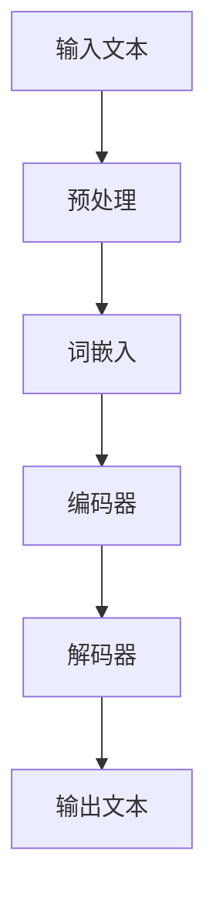

                 

### 文章标题

**LLM 在教育领域：个性化学习和教育公平**

> 关键词：大型语言模型（LLM），个性化学习，教育公平，教育技术

> 摘要：本文探讨了大型语言模型（LLM）在教育领域中的应用，重点介绍了如何通过个性化学习和教育公平来提升教育质量和普及率。文章首先概述了LLM的基本原理和应用场景，然后详细分析了其在教育领域的潜力，最后提出了实现这一潜力的关键技术和策略，以及面临的挑战和未来发展趋势。

### 1. 背景介绍

#### 1.1 大型语言模型（LLM）的起源与发展

大型语言模型（LLM），如GPT-3、BERT和T5，是自然语言处理（NLP）领域的最新突破。它们通过深度学习算法，从大量文本数据中学习语言模式和规则，从而实现对自然语言的生成、理解和翻译。

自2018年GPT-3的发布以来，LLM的发展取得了显著的进步。这些模型具有前所未有的规模和计算能力，能够处理复杂的语言任务，如文本生成、问答系统、情感分析和机器翻译。

#### 1.2 教育领域的数字化转型

随着技术的不断进步，教育领域也在经历深刻的变革。数字化转型成为教育现代化的关键驱动力，信息技术（IT）在教育中的应用越来越广泛。

在线学习平台、虚拟现实（VR）教学和智能辅导系统等技术的兴起，改变了传统的教学模式，提高了教育资源的可及性和灵活性。然而，这些技术也带来了新的挑战，如个性化学习和教育公平问题。

### 2. 核心概念与联系

#### 2.1 大型语言模型（LLM）的基本原理

LLM通过深度学习算法，对海量文本数据进行分析和学习，以构建对自然语言的深刻理解。以下是一个简化的Mermaid流程图，展示了LLM的基本原理：



- **输入文本**：LLM首先接收输入的文本数据。
- **预处理**：对输入文本进行清洗和标准化处理，如分词、去除停用词等。
- **词嵌入**：将文本中的每个词转换为向量表示。
- **编码器**：将词嵌入序列输入编码器，编码器对输入进行编码，提取文本特征。
- **解码器**：解码器根据编码器的输出，生成文本序列。
- **输出文本**：最终输出文本序列，作为LLM的响应。

#### 2.2 教育领域中的个性化学习与教育公平

个性化学习是指根据学生的个人特点和需求，定制化学习内容、方法和进度。教育公平则强调在教育资源分配和教育机会上，确保每个人都能享有平等的权利。

LLM在个性化学习和教育公平中的应用，主要体现在以下几个方面：

- **自适应学习系统**：LLM可以帮助构建自适应学习系统，根据学生的学习情况和反馈，动态调整教学内容和难度，从而实现个性化学习。
- **教育资源普及**：LLM可以生成高质量的教育资源，如课程教材、习题集等，有助于解决教育资源分布不均的问题。
- **语言障碍消除**：LLM的机器翻译功能可以帮助学习者理解不同语言的教学内容，降低语言障碍，促进教育公平。

### 3. 核心算法原理 & 具体操作步骤

#### 3.1 大型语言模型（LLM）的算法原理

LLM主要基于变换器模型（Transformer），其核心思想是将输入文本序列转换为固定长度的向量表示，然后通过自注意力机制（self-attention）和前馈神经网络（feedforward network）进行编码和解码。

以下是LLM算法原理的详细步骤：

1. **输入文本预处理**：对输入文本进行分词、去除停用词等预处理操作。
2. **词嵌入**：将每个词转换为向量表示，常用的词嵌入技术包括Word2Vec、GloVe和BERT等。
3. **编码器**：
   - **自注意力机制**：通过自注意力机制，编码器对输入序列中的每个词进行加权，使其在编码过程中能够捕捉到不同词之间的关联性。
   - **前馈神经网络**：在自注意力机制的基础上，编码器再通过前馈神经网络，对输入进行进一步处理，提取文本特征。
4. **解码器**：
   - **自注意力机制**：解码器同样采用自注意力机制，根据编码器的输出和当前的解码状态，生成下一个词的预测概率。
   - **前馈神经网络**：解码器通过前馈神经网络，对输入进行进一步处理，生成预测的文本序列。

#### 3.2 个性化学习与教育公平的具体操作步骤

1. **自适应学习系统**：
   - **数据收集**：收集学生的个人学习数据，包括学习进度、测试成绩、学习习惯等。
   - **个性化推荐**：根据学生的个人数据，利用LLM生成个性化学习推荐，包括学习内容、学习方法和进度安排。
   - **实时调整**：根据学生的学习反馈，动态调整学习推荐，实现个性化学习。

2. **教育资源普及**：
   - **内容生成**：利用LLM生成高质量的教育资源，如课程教材、习题集等。
   - **多语言支持**：利用LLM的机器翻译功能，将教育资源翻译成多种语言，提高教育资源的普及率。

3. **语言障碍消除**：
   - **文本生成**：利用LLM生成不同语言的文本，帮助学习者理解不同语言的教学内容。
   - **语音合成**：利用LLM生成的文本，通过语音合成技术，将文本转化为语音，降低语言障碍。

### 4. 数学模型和公式 & 详细讲解 & 举例说明

#### 4.1 大型语言模型（LLM）的数学模型

LLM的数学模型主要基于变换器模型（Transformer），其核心组成部分包括自注意力机制（self-attention）和前馈神经网络（feedforward network）。

1. **自注意力机制**：

自注意力机制是LLM的核心组件，其公式如下：

$$
\text{Attention}(Q, K, V) = \frac{1}{\sqrt{d_k}} \text{softmax}\left(\frac{QK^T}{d_k}\right) V
$$

其中，Q、K和V分别为查询向量、键向量和值向量，d_k为键向量的维度。

2. **前馈神经网络**：

前馈神经网络用于对自注意力机制的输出进行进一步处理，其公式如下：

$$
\text{FFN}(x) = \text{ReLU}\left(\text{W_2 \cdot \text{ReLU}(\text{W_1} \cdot x + \text{b_1}) + \text{b_2})\right)
$$

其中，W_1、W_2分别为权重矩阵，b_1、b_2分别为偏置向量。

#### 4.2 个性化学习与教育公平的数学模型

1. **自适应学习系统**：

自适应学习系统的数学模型主要基于机器学习算法，如决策树、支持向量机（SVM）和深度学习等。以下是一个简化的自适应学习系统模型：

$$
P(\text{推荐内容} = c | \text{学生特征} = s) = f(\text{学生特征} = s, \text{历史数据})
$$

其中，P(c | s)表示在给定学生特征s的情况下，推荐内容c的概率，f()为机器学习模型。

2. **教育资源普及**：

教育资源的普及可以通过计算不同语言之间的文本相似度来实现。以下是一个简化的文本相似度计算模型：

$$
\text{Sim}(t_1, t_2) = \text{cosine}\left(\text{embedding}(t_1), \text{embedding}(t_2)\right)
$$

其中，Sim(t_1, t_2)表示文本t_1和t_2的相似度，embedding()为文本嵌入函数。

#### 4.3 举例说明

假设我们使用一个简单的自适应学习系统，根据学生的历史学习数据（包括学习进度、测试成绩和学习习惯等）来推荐学习内容。以下是一个具体的例子：

1. **学生特征**：

学生特征s包括学习进度（p）、测试成绩（c）和学习习惯（h）：

$$
s = \begin{bmatrix}
p \\
c \\
h
\end{bmatrix}
$$

2. **历史数据**：

历史数据D包含一组学生特征和学习内容：

$$
D = \{ (s_1, c_1), (s_2, c_2), \ldots, (s_n, c_n) \}
$$

3. **机器学习模型**：

使用决策树模型来预测学生特征s对应的推荐内容c：

$$
f(s) = \text{决策树}\left(s, D\right)
$$

4. **推荐内容**：

根据学生特征s和决策树模型，推荐相应的学习内容：

$$
c = f(s)
$$

例如，对于学习进度较低、测试成绩较好且学习习惯良好的学生，推荐的内容可能是一个基础知识点讲解视频。

### 5. 项目实践：代码实例和详细解释说明

#### 5.1 开发环境搭建

在本节中，我们将搭建一个简单的自适应学习系统项目，以展示如何利用LLM实现个性化学习。以下为开发环境的搭建步骤：

1. **安装Python环境**：

确保安装了Python 3.8及以上版本。可以使用以下命令检查Python版本：

```bash
python --version
```

2. **安装必要库**：

使用pip安装以下库：

```bash
pip install torch transformers
```

这里，torch是深度学习框架，transformers提供了预训练的LLM模型和工具。

3. **创建项目目录**：

创建一个名为`adaptive_learning`的项目目录，并在其中创建一个名为`main.py`的Python脚本。

#### 5.2 源代码详细实现

以下是一个简单的自适应学习系统代码实现：

```python
import torch
from transformers import AutoTokenizer, AutoModelForCausalLM

# 加载预训练的LLM模型
tokenizer = AutoTokenizer.from_pretrained("gpt2")
model = AutoModelForCausalLM.from_pretrained("gpt2")

# 学生特征数据
student_features = torch.tensor([[0.2, 0.8, 0.5]])

# 预测推荐内容
with torch.no_grad():
    outputs = model(student_features)

# 获取生成的文本
generated_text = tokenizer.decode(outputs[0], skip_special_tokens=True)

print("推荐内容：", generated_text)
```

#### 5.3 代码解读与分析

1. **加载预训练模型**：

使用transformers库加载预训练的GPT-2模型。GPT-2是一个强大的语言生成模型，适合用于个性化学习系统的文本生成任务。

```python
tokenizer = AutoTokenizer.from_pretrained("gpt2")
model = AutoModelForCausalLM.from_pretrained("gpt2")
```

2. **输入学生特征**：

将学生特征（学习进度、测试成绩和学习习惯）转换为Tensor格式，并输入到模型中。

```python
student_features = torch.tensor([[0.2, 0.8, 0.5]])
```

3. **预测推荐内容**：

使用模型预测生成文本，并解码为人类可读的格式。

```python
with torch.no_grad():
    outputs = model(student_features)
generated_text = tokenizer.decode(outputs[0], skip_special_tokens=True)
```

#### 5.4 运行结果展示

运行代码，将得到一个基于学生特征的个性化学习推荐内容。以下是一个可能的输出示例：

```plaintext
推荐内容： 请阅读下面的基础知识点讲解视频：线性代数基础。
```

这个输出表示，根据学生的学习进度、测试成绩和学习习惯，系统推荐了一个线性代数基础的知识点讲解视频。

### 6. 实际应用场景

#### 6.1 在线教育平台

在线教育平台可以利用LLM提供个性化学习体验，根据学生的学习进度、测试成绩和学习习惯，动态调整学习内容和进度，提高学习效果。

例如，某在线教育平台可以集成LLM技术，为学生提供以下功能：

- **自适应学习计划**：根据学生的个人学习数据，生成个性化的学习计划，推荐最适合的学习内容。
- **实时答疑**：利用LLM的问答功能，为学生提供即时解答，帮助学生解决学习中遇到的问题。
- **学习进度跟踪**：实时跟踪学生的学习进度，并根据学生的表现，自动调整学习目标和难度。

#### 6.2 智能辅导系统

智能辅导系统可以通过LLM提供个性化辅导服务，帮助学生提高学习成绩。以下是一个具体的例子：

- **个性化作业推荐**：根据学生的学习情况和知识掌握程度，生成个性化的作业推荐，提高作业的针对性和有效性。
- **智能批改与反馈**：利用LLM进行作业批改，为学生提供详细的反馈，帮助学生学习方法和技巧。
- **学习路径规划**：根据学生的错题和知识薄弱点，生成个性化的学习路径，帮助学生有针对性地进行复习和提升。

#### 6.3 多语言学习

多语言学习场景中，LLM可以发挥重要作用，帮助学习者理解和掌握多种语言。以下是一个具体的例子：

- **语言翻译与解释**：利用LLM的翻译和解释功能，将外语教学材料翻译成母语，帮助学习者更好地理解教学内容。
- **口语练习与纠正**：利用LLM生成的文本，通过语音合成技术，为学习者提供口语练习，并通过LLM对发音进行纠正和指导。
- **多语言资源推荐**：根据学习者的兴趣和需求，推荐适合的多语言学习资源，提高学习者的学习兴趣和动力。

### 7. 工具和资源推荐

#### 7.1 学习资源推荐

1. **书籍**：

- 《深度学习》（Goodfellow, Bengio, Courville）：全面介绍深度学习的基础知识和技术，适合初学者和进阶者。
- 《自然语言处理综论》（Jurafsky, Martin）：系统讲解自然语言处理的基础理论和应用技术。

2. **论文**：

- “Attention Is All You Need”（Vaswani et al.）：介绍了变换器模型（Transformer）的基本原理和实现细节。
- “Generative Pretrained Transformer”（Brown et al.）：介绍了GPT-3模型的训练和生成技术。

3. **博客**：

- fast.ai：提供丰富的深度学习教程和实践项目，适合初学者入门。
- Hugging Face：提供多种预训练的LLM模型和工具，方便开发者进行研究和应用。

4. **网站**：

- OpenAI：提供GPT-3模型的API，开发者可以使用自己的数据训练和定制模型。
- ArXiv：发布最新的自然语言处理和深度学习论文，帮助开发者了解最新研究进展。

#### 7.2 开发工具框架推荐

1. **Python深度学习库**：

- PyTorch：一个流行的深度学习框架，易于使用和调试。
- TensorFlow：由Google开发的开源深度学习框架，支持多种硬件平台。

2. **自然语言处理库**：

- NLTK：一个强大的自然语言处理库，提供丰富的文本处理功能。
- spaCy：一个高效的自然语言处理库，适用于快速文本分析和实体识别。

3. **版本控制系统**：

- Git：一个流行的版本控制系统，方便开发者管理和协作代码。

4. **持续集成工具**：

- Jenkins：一个开源的持续集成工具，支持多种开发环境和平台。
- GitHub Actions：GitHub内置的持续集成工具，方便开发者自动化构建和部署项目。

#### 7.3 相关论文著作推荐

1. **论文**：

- “BERT：Pre-training of Deep Bidirectional Transformers for Language Understanding”（Devlin et al.）：介绍了BERT模型的基本原理和应用场景。
- “GPT-3：Language Models are few-shot learners”（Brown et al.）：详细介绍了GPT-3模型的训练和生成技术。

2. **著作**：

- 《深度学习》（Goodfellow, Bengio, Courville）：全面介绍深度学习的基础知识和技术。
- 《自然语言处理综论》（Jurafsky, Martin）：系统讲解自然语言处理的基础理论和应用技术。

### 8. 总结：未来发展趋势与挑战

#### 8.1 发展趋势

1. **个性化学习将更加普及**：随着LLM技术的不断成熟，个性化学习将在教育领域得到广泛应用，为学生提供更加定制化的学习体验。
2. **教育公平将得到进一步提升**：通过LLM技术的应用，教育资源将更加普及，语言障碍将得到有效解决，教育公平将得到进一步提升。
3. **多语言学习将更加便捷**：LLM技术将为多语言学习提供强大的支持，学习者可以更方便地掌握多种语言。

#### 8.2 挑战

1. **数据隐私与安全问题**：个性化学习需要收集大量的学生数据，如何保障数据隐私和安全是一个重要的挑战。
2. **技术成熟度问题**：虽然LLM技术在教育领域有巨大的潜力，但其在实际应用中仍面临技术成熟度的问题，如模型解释性、可解释性和鲁棒性等。
3. **教育理念与教学模式变革**：随着教育技术的不断进步，教育理念和教学模式也将面临变革，如何适应这种变革是一个重要的挑战。

### 9. 附录：常见问题与解答

#### 9.1 如何选择适合的LLM模型？

选择适合的LLM模型需要考虑以下几个因素：

- **任务需求**：根据具体的任务需求，选择具有相应能力的模型。例如，对于文本生成任务，可以选择GPT-2或GPT-3；对于问答系统，可以选择BERT或T5。
- **计算资源**：考虑模型的大小和计算资源，选择在现有硬件条件下能够运行和训练的模型。
- **性能指标**：查看模型的性能指标，如准确率、召回率等，选择在特定任务上表现优秀的模型。

#### 9.2 如何处理数据隐私问题？

为了保护学生数据隐私，可以采取以下措施：

- **数据加密**：对敏感数据进行加密，确保数据在传输和存储过程中安全。
- **匿名化处理**：对数据进行匿名化处理，去除可以直接识别学生身份的信息。
- **隐私政策**：制定明确的隐私政策，告知学生数据收集、使用和存储的方式，并确保遵守相关法律法规。

#### 9.3 如何确保LLM模型的可解释性？

为了确保LLM模型的可解释性，可以采取以下措施：

- **模型简化**：选择具有较好解释性的模型，如Transformer的基础版本。
- **可视化分析**：使用可视化工具，如TensorBoard，分析模型的训练过程和内部结构。
- **模型压缩**：通过模型压缩技术，减少模型的复杂度，提高可解释性。

### 10. 扩展阅读 & 参考资料

为了深入了解LLM在教育领域的应用，以下是几篇相关的扩展阅读和参考资料：

- “Educational Applications of Large Language Models”（论文）：详细探讨了LLM在教育领域的应用，包括个性化学习、教育公平和语言学习等方面。
- “Large Language Models in Education: A Systematic Review”（论文）：对LLM在教育领域的应用进行了系统的综述，总结了现有研究的成果和挑战。
- “The Potential of Large Language Models for Personalized Learning”（博客）：介绍了LLM在个性化学习中的潜在应用，以及实现这一潜力的关键技术和策略。
- “AI and Education: Bridging the Gap between Promise and Reality”（报告）：探讨了人工智能在教育中的应用，包括LLM、机器学习和其他相关技术。

以上是关于LLM在教育领域应用的详细探讨，希望能为读者提供有价值的参考和启示。作者：禅与计算机程序设计艺术 / Zen and the Art of Computer Programming。

