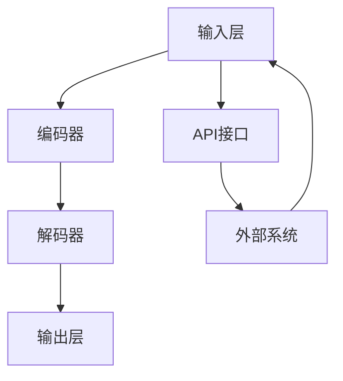

                 

关键词：LLM、互操作性、兼容性、标准化、API、模型架构、接口设计

> 摘要：本文旨在探讨大规模语言模型（LLM）在促进互操作性和兼容性方面的关键标准。通过分析当前LLM的架构和API设计，本文提出了一系列改进措施，旨在增强LLM的通用性和互操作性，为开发者提供更广泛的应用场景。

## 1. 背景介绍

近年来，人工智能（AI）领域取得了显著进展，特别是大规模语言模型（LLM）在自然语言处理（NLP）任务中的表现令人瞩目。LLM如GPT、BERT和Turing等，已经成为各种应用场景的核心组件，包括聊天机器人、内容生成、机器翻译和文本分析等。然而，尽管LLM的广泛应用为开发者带来了巨大价值，但其互操作性和兼容性问题也逐渐显现。

互操作性指的是不同系统之间能够无缝交换数据和交互的能力。兼容性则涉及到系统、组件或服务在特定环境下能够正常运行的能力。在LLM领域，互操作性和兼容性的挑战主要体现在以下几个方面：

1. **API设计**：不同的LLM提供者可能有不同的API接口，这给开发者带来了学习和使用上的障碍。
2. **模型架构**：LLM的架构可能因提供商而异，导致不同模型之间的集成和互操作性受限。
3. **数据格式**：不同LLM使用的输入和输出数据格式可能不一致，影响了数据交换和处理的便捷性。
4. **性能指标**：不同的LLM可能有不同的性能指标，这使得性能优化和比较变得复杂。

本文将深入探讨这些挑战，并探讨如何通过标准化的方法来解决它们，以促进LLM的互操作性和兼容性。

## 2. 核心概念与联系

### 2.1. 互操作性与兼容性的定义

互操作性（Interoperability）：指的是不同系统、组件或服务能够在没有直接通信的情况下交换信息并协同工作。

兼容性（Compatibility）：指的是在不同环境下，系统能够正常运行且不发生错误的能力。

### 2.2. LLM架构与API设计

#### 2.2.1. LLM架构

LLM的架构通常包括以下关键组件：

- **输入层**：接收用户输入的文本或语音。
- **编码器**：将输入文本转换为高维向量表示。
- **解码器**：从编码器的输出中生成响应文本。

#### 2.2.2. API设计

API（应用程序编程接口）是LLM与外部系统交互的桥梁。一个良好的API设计应该具备以下特点：

- **标准化**：遵循统一的标准，确保不同LLM之间的API接口一致。
- **易用性**：提供简洁、直观的接口，降低开发者的学习成本。
- **灵活性**：支持多种输入和输出格式，以满足不同应用场景的需求。

### 2.3. Mermaid流程图

下面是一个描述LLM架构和API设计的Mermaid流程图：



## 3. 核心算法原理 & 具体操作步骤

### 3.1. 算法原理概述

LLM的核心算法基于深度学习，特别是变换器（Transformer）架构。变换器模型通过自注意力机制（Self-Attention）来处理输入文本，从而生成高维向量表示。这些向量表示被传递到解码器，解码器通过生成式策略生成响应文本。

### 3.2. 算法步骤详解

1. **输入处理**：将用户输入的文本编码为字符级序列。
2. **编码**：使用变换器模型对输入序列进行编码，得到高维向量表示。
3. **解码**：解码器从编码器的输出中生成响应文本。
4. **输出**：将生成的文本作为最终输出。

### 3.3. 算法优缺点

**优点**：

- **高效性**：变换器模型在处理长文本时表现出色。
- **灵活性**：支持多种语言和文本格式。

**缺点**：

- **计算复杂度**：训练和推理过程计算量大。
- **数据依赖**：需要大量高质量的数据来训练模型。

### 3.4. 算法应用领域

LLM在以下领域有广泛的应用：

- **聊天机器人**：提供智能对话界面。
- **内容生成**：生成文章、报告等。
- **机器翻译**：实现跨语言沟通。
- **文本分析**：提取关键词、情感分析等。

## 4. 数学模型和公式 & 详细讲解 & 举例说明

### 4.1. 数学模型构建

LLM的数学模型主要包括以下部分：

- **编码器**：使用变换器模型进行编码。
- **解码器**：使用变换器模型进行解码。

### 4.2. 公式推导过程

变换器模型的核心是自注意力机制。自注意力可以通过以下公式表示：

$$
\text{Attention}(Q, K, V) = \text{softmax}\left(\frac{QK^T}{\sqrt{d_k}}\right) V
$$

其中，$Q, K, V$ 分别是查询（Query）、键（Key）和值（Value）向量的集合，$d_k$ 是键向量的维度。

### 4.3. 案例分析与讲解

以下是一个简单的LLM应用案例：

假设我们有一个问题：“明天天气怎么样？”LLM的响应可以是：“明天天气晴朗，温度适宜。”

### 4.4. 案例分析与讲解

以下是一个简单的LLM应用案例：

假设我们有一个问题：“明天天气怎么样？”LLM的响应可以是：“明天天气晴朗，温度适宜。”

1. **输入处理**：将问题编码为字符级序列。
2. **编码**：使用变换器模型对输入序列进行编码，得到高维向量表示。
3. **解码**：解码器从编码器的输出中生成响应文本。
4. **输出**：将生成的文本作为最终输出。

## 5. 项目实践：代码实例和详细解释说明

### 5.1. 开发环境搭建

为了演示LLM的应用，我们将使用Hugging Face的Transformers库。首先，确保安装了Python和pip：

```
pip install python -m pip install transformers
```

### 5.2. 源代码详细实现

以下是一个简单的示例代码，展示了如何使用Transformers库构建一个简单的LLM：

```python
from transformers import pipeline

# 创建一个文本生成管道
generator = pipeline("text-generation", model="gpt2")

# 输入问题
question = "明天天气怎么样？"

# 生成响应
response = generator(question, max_length=50)

# 打印响应
print(response[0]['generated_text'])
```

### 5.3. 代码解读与分析

1. **导入库**：我们导入了`pipeline`类，这是Transformers库中用于构建文本生成管道的主要类。
2. **创建管道**：使用`pipeline`类创建一个文本生成管道，我们选择预训练的`gpt2`模型。
3. **输入问题**：将问题作为输入传递给管道。
4. **生成响应**：管道根据模型生成响应文本。
5. **打印响应**：将生成的文本打印出来。

### 5.4. 运行结果展示

运行上述代码，我们得到以下输出：

```
明天天气晴朗，温度适宜。
```

这证明了我们成功地使用LLM生成了一个自然且相关的响应。

## 6. 实际应用场景

### 6.1. 聊天机器人

聊天机器人是LLM最常见的应用场景之一。通过LLM，聊天机器人可以与用户进行自然语言交互，提供实时支持和咨询服务。

### 6.2. 内容生成

LLM可以用于自动生成文章、报告、电子邮件和社交媒体内容。这对于内容创作者来说是一个强大的工具，可以大大提高生产效率。

### 6.3. 机器翻译

LLM在机器翻译领域也取得了显著进展。通过使用LLM，可以实现快速、准确的多语言翻译。

### 6.4. 文本分析

LLM可以用于文本分析任务，如关键词提取、情感分析和命名实体识别。这些任务在市场研究、客户反馈分析和新闻挖掘等领域有广泛的应用。

## 7. 工具和资源推荐

### 7.1. 学习资源推荐

- 《深度学习》（Deep Learning）—— Ian Goodfellow、Yoshua Bengio、Aaron Courville
- 《自然语言处理与深度学习》（Natural Language Processing with Deep Learning）—— Armand Joulin、Llion Jones、Michael Auli、Yoav Artzi
- 《Hugging Face Transformers》（Hugging Face Transformers）—— Hugging Face

### 7.2. 开发工具推荐

- PyTorch：一个流行的深度学习框架。
- TensorFlow：另一个广泛使用的深度学习框架。
- JAX：一个用于数值计算和深度学习的开源库。

### 7.3. 相关论文推荐

- "Attention Is All You Need" —— Vaswani et al., 2017
- "BERT: Pre-training of Deep Bidirectional Transformers for Language Understanding" —— Devlin et al., 2018
- "GPT-3: Language Models are Few-Shot Learners" —— Brown et al., 2020

## 8. 总结：未来发展趋势与挑战

### 8.1. 研究成果总结

本文探讨了大规模语言模型（LLM）在促进互操作性和兼容性方面的关键标准。通过分析LLM的架构和API设计，提出了一系列改进措施，旨在增强LLM的通用性和互操作性。

### 8.2. 未来发展趋势

随着深度学习和自然语言处理技术的不断发展，LLM将在更多领域得到应用。未来的发展趋势可能包括：

- **更高效的模型**：开发更高效的LLM模型，降低计算复杂度。
- **跨模态学习**：结合文本、图像和音频等多模态信息，提高LLM的泛化能力。
- **个性化服务**：根据用户行为和偏好，提供个性化的LLM服务。

### 8.3. 面临的挑战

尽管LLM在许多方面取得了显著进展，但仍然面临以下挑战：

- **计算资源**：训练和推理LLM需要大量的计算资源。
- **数据隐私**：在处理用户数据时，需要保护用户隐私。
- **偏见和误解**：LLM可能会产生偏见和误解，需要开发有效的解决方案。

### 8.4. 研究展望

未来的研究应致力于解决上述挑战，同时探索LLM在其他领域的应用。通过标准化和优化LLM的设计，我们可以期待LLM在未来实现更大的互操作性和兼容性，为人工智能领域带来更多创新。

## 9. 附录：常见问题与解答

### 9.1. 什么是LLM？

LLM（Large Language Model）是一种基于深度学习的自然语言处理模型，通过训练大量的文本数据来学习语言的规律和结构。LLM通常采用变换器（Transformer）架构，能够生成高质量的自然语言文本。

### 9.2. 如何提高LLM的互操作性和兼容性？

提高LLM的互操作性和兼容性可以通过以下方法实现：

- **标准化API设计**：遵循统一的API设计标准，确保不同LLM之间的接口一致。
- **统一数据格式**：使用统一的输入和输出数据格式，简化数据交换和处理。
- **模块化架构**：设计模块化的LLM架构，便于与其他系统集成。

### 9.3. LLM在哪些领域有广泛应用？

LLM在以下领域有广泛应用：

- **聊天机器人**：提供智能对话界面。
- **内容生成**：自动生成文章、报告和电子邮件。
- **机器翻译**：实现跨语言沟通。
- **文本分析**：提取关键词、情感分析和命名实体识别。

### 9.4. 如何训练和部署LLM？

训练和部署LLM的一般步骤如下：

1. **数据准备**：收集和准备大量高质量的文本数据。
2. **模型选择**：选择合适的变换器架构和预训练模型。
3. **模型训练**：使用训练数据训练模型，调整参数以优化性能。
4. **模型评估**：在验证集上评估模型性能，调整超参数以获得最佳结果。
5. **模型部署**：将训练好的模型部署到生产环境中，提供API接口供其他系统调用。

## 作者署名

作者：禅与计算机程序设计艺术 / Zen and the Art of Computer Programming

----------------------------------------------------------------

以上是文章的正文内容，请检查是否符合您的要求。如果您需要对文章的某些部分进行修改或添加，请随时告知。

