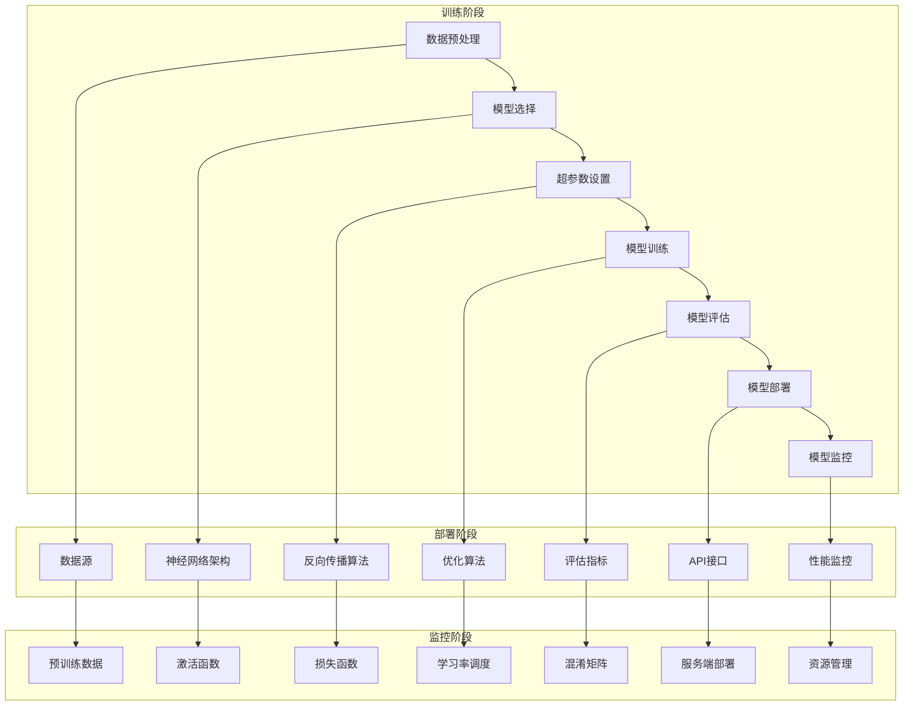

                 

### 背景介绍

#### 模型集成开发环境的必要性

随着深度学习技术的迅猛发展，尤其是在大规模语言模型（LLM）领域，模型的开发和部署变得越来越复杂。从最初的模型设计、训练，到最终部署，每一个步骤都需要大量的计算资源、时间以及专业知识。为了简化这一流程，集成开发环境（IDE）的应用应运而生。集成开发环境不仅为开发者提供了一个高效、便捷的工作平台，还大幅降低了模型训练和部署的难度。

#### LLMA的应用场景和重要性

LLM（大规模语言模型）作为一种基于深度学习的自然语言处理技术，已经在众多领域展现出巨大的应用潜力。从智能问答、自动摘要、机器翻译，到文本生成和推荐系统，LLM都能提供出色的性能。尤其是在当今信息爆炸的时代，快速、准确地从海量数据中提取有价值的信息，对于企业和研究机构来说至关重要。

然而，要充分利用LLM的优势，开发者不仅需要掌握复杂的深度学习技术，还需要熟悉各种编程语言、工具和框架。这使得整个开发和部署过程变得更加复杂和耗时。因此，一个功能强大、易于使用的集成开发环境，可以极大地提高开发者的工作效率，缩短产品上市时间。

#### 当前主流的集成开发环境介绍

目前市场上主流的集成开发环境主要包括以下几种：

1. **TensorFlow**：由Google推出，是目前最流行的开源深度学习框架之一。它提供了丰富的API和工具，支持多种编程语言，包括Python、C++和Java。TensorFlow的集成开发环境（TensorBoard）提供了强大的可视化工具，可以帮助开发者更好地理解和优化模型。

2. **PyTorch**：由Facebook AI研究院（FAIR）推出，是一种流行的深度学习框架，以其简洁、灵活和强大的动态图计算能力而著称。PyTorch的集成开发环境（PyTorch Lightning）为开发者提供了一系列高效的工具和扩展，使得模型训练和部署变得更加简单。

3. **Jupyter Notebook**：Jupyter Notebook是一种交互式计算环境，支持多种编程语言，包括Python、R和Julia。它提供了丰富的可视化功能，使得数据分析和模型训练的过程更加直观和便捷。Jupyter Notebook尤其适合用于教育和研究，因为它可以帮助开发者快速迭代和分享代码。

4. **Azure Machine Learning**：微软推出的云计算服务，为开发者提供了一个集成了数据管理、模型训练、部署和监控的全栈平台。Azure Machine Learning不仅支持多种深度学习框架，还提供了丰富的API和服务，使得模型部署和规模化变得简单高效。

#### 本文目的和结构

本文旨在介绍如何利用这些主流集成开发环境，简化LLM模型的训练和部署过程。我们将从以下几个方面进行详细探讨：

1. **核心概念与联系**：介绍LLM的基本原理和关键组件，并通过Mermaid流程图展示其架构。
2. **核心算法原理与具体操作步骤**：讲解LLM的训练过程，包括数据预处理、模型选择、训练策略等。
3. **数学模型和公式**：介绍与LLM相关的数学模型和公式，并进行详细讲解和举例说明。
4. **项目实践**：通过一个实际项目实例，展示如何使用集成开发环境进行模型训练和部署。
5. **实际应用场景**：探讨LLM在各个领域的应用，并分析其潜力和挑战。
6. **工具和资源推荐**：推荐学习资源、开发工具和框架，帮助开发者更好地掌握LLM技术。
7. **总结与未来发展趋势**：总结本文的核心内容，并展望LLM技术的未来发展趋势和挑战。

通过以上结构，我们希望能够为广大开发者提供一份全面、实用的指南，帮助他们更高效地利用集成开发环境，推动LLM技术的发展和应用。

### 核心概念与联系

在深入探讨LLM的集成开发环境之前，我们需要首先了解一些核心概念，这些概念是构建和优化LLM的基础。以下是LLM中几个关键的核心概念：

#### 语言模型（Language Model）

语言模型是自然语言处理（NLP）领域的核心技术，用于预测文本中的下一个单词或字符。LLM通过学习大量文本数据，建立起对语言结构的深刻理解。这种模型可以用于生成文本、机器翻译、文本摘要等任务。

#### 深度神经网络（Deep Neural Network，DNN）

深度神经网络是构建语言模型的主要架构，它由多个隐藏层组成，能够自动学习输入数据中的复杂模式。通过反向传播算法，DNN可以不断优化模型参数，提高预测准确性。

#### 训练策略（Training Strategy）

训练策略决定了模型如何从数据中学习。常见的训练策略包括批量训练（Batch Training）、随机梯度下降（SGD）和小批量训练（Mini-batch Training）。选择合适的训练策略可以加快训练速度，提高模型性能。

#### 超参数（Hyperparameters）

超参数是模型训练过程中需要手动设定的参数，如学习率、批量大小和隐藏层数量等。超参数的选择对模型性能有重要影响，因此需要进行仔细调优。

#### 评估指标（Evaluation Metrics）

评估指标用于衡量模型性能，如准确率、召回率、F1分数等。选择合适的评估指标可以帮助开发者更好地理解模型性能，指导后续优化。

接下来，我们将通过一个Mermaid流程图来展示LLM的基本架构和各个核心组件之间的联系：



在这个流程图中，我们可以看到，数据预处理是整个流程的起点，其目标是准备适合模型训练的数据。接下来，模型选择和超参数设置决定了模型的基本结构和参数，模型训练阶段通过优化算法和反向传播不断调整模型参数，以最小化损失函数。训练完成后，模型评估阶段使用评估指标来衡量模型性能。如果模型性能达到要求，它将被部署到生产环境中，并通过API接口提供服务。最后，模型监控阶段对模型的运行状态进行实时监控，确保其稳定性和性能。

通过上述流程图，我们可以清晰地了解LLM集成开发环境中的各个关键步骤和组件之间的联系。接下来，我们将进一步探讨LLM的核心算法原理和具体操作步骤，帮助读者深入理解这一强大的技术。

#### 核心算法原理 & 具体操作步骤

在理解了LLM的基本概念和架构后，接下来我们将深入探讨其核心算法原理和具体操作步骤。这一部分内容将详细讲解从数据预处理到模型训练和评估的整个流程。

##### 数据预处理

数据预处理是LLM训练过程中的第一步，其目标是将原始数据转化为适合模型训练的形式。主要步骤包括数据清洗、分词、词嵌入等。

1. **数据清洗**：去除数据中的噪声和无关信息，如HTML标签、停用词等。
2. **分词**：将文本拆分为单词或子词。中文使用分词工具如jieba，英文则可以直接使用空格进行分词。
3. **词嵌入**：将单词或子词转换为向量的形式，常用的词嵌入方法包括Word2Vec、GloVe和BERT。这些方法将词汇映射到高维空间，使得具有相似意义的词在空间中距离更近。

##### 模型选择

选择合适的模型架构对LLM的性能至关重要。常见的模型架构包括循环神经网络（RNN）、长短期记忆网络（LSTM）和变换器（Transformer）。

1. **RNN（Recurrent Neural Network）**：RNN是一种能够处理序列数据的神经网络，通过记忆过去的信息来预测下一个元素。RNN的核心思想是利用隐藏状态（hidden state）来保存历史信息，但RNN存在梯度消失和梯度爆炸的问题。
2. **LSTM（Long Short-Term Memory）**：LSTM是RNN的一种改进，通过引入门控机制（gate）来解决梯度消失问题。LSTM通过遗忘门（forget gate）和输入门（input gate）控制信息的保留和更新，从而更好地处理长序列数据。
3. **Transformer**：Transformer是近年来流行的模型架构，由Google提出。它通过自注意力机制（self-attention）来处理序列数据，避免了RNN和LSTM中的梯度消失问题。Transformer的并行化特性使其训练速度更快，并且取得了卓越的性能。

##### 超参数设置

超参数是模型训练过程中需要手动设置的参数，包括学习率、批量大小、隐藏层数量等。合适的超参数设置可以显著提高模型性能。

1. **学习率**：学习率决定了模型参数更新的步长。学习率过大可能导致模型无法收敛，过小则训练时间过长。常用方法包括固定学习率、学习率衰减和自适应学习率（如Adam优化器）。
2. **批量大小**：批量大小影响模型训练的稳定性和速度。较大的批量可以减少噪声，但训练速度较慢；较小的批量则训练速度快，但容易受到噪声影响。
3. **隐藏层数量和神经元数量**：增加隐藏层和神经元数量可以提高模型的表达能力，但也会导致计算复杂度和训练时间增加。

##### 模型训练

模型训练是LLM的核心步骤，通过不断优化模型参数来提高预测准确性。训练过程包括以下步骤：

1. **初始化参数**：随机初始化模型参数。
2. **前向传播**：将输入数据输入模型，计算输出预测值。
3. **计算损失**：计算预测值与真实值之间的差异，常用损失函数包括均方误差（MSE）、交叉熵损失等。
4. **反向传播**：根据损失函数计算模型参数的梯度，并通过优化算法更新参数。
5. **迭代训练**：重复前向传播和反向传播步骤，直到满足训练条件（如达到指定迭代次数或损失值收敛）。

##### 模型评估

模型评估是训练完成后对模型性能的检验。常用的评估指标包括准确率、召回率、F1分数等。

1. **准确率**：预测正确的样本数占总样本数的比例。
2. **召回率**：预测正确的正样本数占总正样本数的比例。
3. **F1分数**：综合考虑准确率和召回率，是二者的调和平均值。

##### 具体操作步骤示例

以下是一个简单的LLM训练过程示例，使用Python和PyTorch框架：

```python
import torch
import torch.nn as nn
import torch.optim as optim

# 加载数据
train_data = DataLoader(train_dataset, batch_size=batch_size, shuffle=True)
val_data = DataLoader(val_dataset, batch_size=batch_size, shuffle=False)

# 定义模型
model = TransformerModel(vocab_size, hidden_size, num_layers, dropout_rate)

# 定义损失函数和优化器
criterion = nn.CrossEntropyLoss()
optimizer = optim.Adam(model.parameters(), lr=learning_rate)

# 训练模型
for epoch in range(num_epochs):
    model.train()
    for batch in train_data:
        inputs, targets = batch
        optimizer.zero_grad()
        outputs = model(inputs)
        loss = criterion(outputs, targets)
        loss.backward()
        optimizer.step()

    # 评估模型
    model.eval()
    with torch.no_grad():
        correct = 0
        total = 0
        for batch in val_data:
            inputs, targets = batch
            outputs = model(inputs)
            _, predicted = torch.max(outputs.data, 1)
            total += targets.size(0)
            correct += (predicted == targets).sum().item()

    print(f'Epoch {epoch+1}/{num_epochs}, Loss: {loss.item()}, Accuracy: {100 * correct / total}%')
```

这个示例代码展示了如何使用PyTorch框架构建和训练一个简单的变换器模型。在实际应用中，开发者可能需要根据具体任务和数据调整模型结构、损失函数和优化器等参数。

通过上述核心算法原理和具体操作步骤，我们了解了LLM模型的训练过程。接下来，我们将进一步探讨LLM中的数学模型和公式，以更深入地理解其内在机制。

### 数学模型和公式 & 详细讲解 & 举例说明

在理解了LLM的核心算法原理和具体操作步骤后，接下来我们将深入探讨与LLM相关的数学模型和公式。这些数学模型和公式是构建和优化LLM的关键，能够帮助我们更好地理解和应用这一技术。

#### 1. 前向传播（Forward Propagation）

前向传播是神经网络中的核心步骤，用于计算模型输出。以下是前向传播的基本公式：

$$
\begin{aligned}
\text{Output} &= f(\text{Weight} \cdot \text{Input} + \text{Bias}) \\
\text{Error} &= \text{Expected Output} - \text{Predicted Output}
\end{aligned}
$$

其中，$f$ 是激活函数，如ReLU、Sigmoid或Tanh等。$\text{Weight}$ 和 $\text{Bias}$ 是模型参数，通过反向传播进行优化。

#### 2. 反向传播（Backpropagation）

反向传播是神经网络训练过程中的关键步骤，用于计算模型参数的梯度。以下是反向传播的基本公式：

$$
\begin{aligned}
\text{Gradient of Output} &= \frac{\partial \text{Error}}{\partial \text{Output}} \\
\text{Gradient of Weight} &= \frac{\partial \text{Error}}{\partial \text{Weight}} \cdot \frac{\partial \text{Output}}{\partial \text{Weight}} \\
\text{Gradient of Bias} &= \frac{\partial \text{Error}}{\partial \text{Bias}} \cdot \frac{\partial \text{Output}}{\partial \text{Bias}}
\end{aligned}
$$

其中，$\frac{\partial}{\partial}$ 表示偏导数。通过计算梯度，我们可以更新模型参数，以最小化损失函数。

#### 3. 损失函数（Loss Function）

损失函数用于衡量模型预测值和真实值之间的差异。以下是几种常见的损失函数：

1. **均方误差（MSE）**：

$$
MSE = \frac{1}{n} \sum_{i=1}^{n} (\text{Predicted} - \text{Actual})^2
$$

2. **交叉熵损失（Cross-Entropy Loss）**：

$$
CE = -\frac{1}{n} \sum_{i=1}^{n} (\text{Actual} \cdot \log(\text{Predicted}))
$$

其中，$\text{Actual}$ 和 $\text{Predicted}$ 分别表示真实值和预测值。

#### 4. 优化算法（Optimization Algorithm）

优化算法用于更新模型参数，以最小化损失函数。以下是几种常见的优化算法：

1. **随机梯度下降（SGD）**：

$$
\text{Weight} := \text{Weight} - \alpha \cdot \text{Gradient}
$$

其中，$\alpha$ 是学习率。

2. **Adam优化器**：

$$
m = \beta_1 g \\
v = \beta_2 g \\
\text{Weight} := \text{Weight} - \alpha \cdot \frac{m}{\sqrt{1 - \beta_2^t} + \epsilon}
$$

其中，$m$ 和 $v$ 分别是梯度的一阶和二阶矩估计，$\beta_1$ 和 $\beta_2$ 是矩估计的指数权重，$\epsilon$ 是一个很小的常数。

#### 5. 自注意力机制（Self-Attention）

自注意力机制是Transformer模型的核心组件，用于计算序列中各个元素之间的依赖关系。以下是自注意力机制的公式：

$$
\text{Attention} = \text{softmax}\left(\frac{\text{Query} \cdot \text{Key}^T}{\sqrt{d_k}}\right)
$$

$$
\text{Value} = \text{Attention} \cdot \text{Value}
$$

其中，$\text{Query}$、$\text{Key}$ 和 $\text{Value}$ 分别是输入序列的向量表示，$d_k$ 是键的维度，$\text{softmax}$ 函数用于计算注意力权重。

#### 举例说明

为了更好地理解上述数学模型和公式，我们通过一个简单的例子来说明：

假设我们有一个二分类问题，数据集包含两个特征（$x_1$ 和 $x_2$），真实标签为$y$。我们要使用线性模型预测标签。

1. **前向传播**：

$$
\text{Output} = \text{Weight}_1 x_1 + \text{Weight}_2 x_2 + \text{Bias}
$$

2. **反向传播**：

$$
\text{Gradient of Output} = \frac{\partial \text{Error}}{\partial \text{Output}} = -\frac{\partial \text{Output}}{\partial \text{Weight}_1} = -\frac{\partial \text{Error}}{\partial \text{Weight}_1} \cdot \frac{\partial \text{Output}}{\partial \text{Weight}_1}
$$

$$
\text{Gradient of Bias} = \frac{\partial \text{Error}}{\partial \text{Bias}} = -\frac{\partial \text{Error}}{\partial \text{Output}} \cdot \frac{\partial \text{Output}}{\partial \text{Bias}} = -\text{Gradient of Output}
$$

3. **优化算法**：

使用随机梯度下降（SGD）更新模型参数：

$$
\text{Weight}_1 := \text{Weight}_1 - \alpha \cdot \frac{\partial \text{Error}}{\partial \text{Weight}_1} \\
\text{Weight}_2 := \text{Weight}_2 - \alpha \cdot \frac{\partial \text{Error}}{\partial \text{Weight}_2} \\
\text{Bias} := \text{Bias} - \alpha \cdot \frac{\partial \text{Error}}{\partial \text{Bias}}
$$

通过上述例子，我们可以看到如何使用数学模型和公式进行前向传播、反向传播和优化算法。这些数学模型和公式是构建和优化LLM的基础，能够帮助我们更好地理解和应用深度学习技术。

### 项目实践：代码实例和详细解释说明

为了更好地展示LLM集成开发环境在实际项目中的应用，我们将通过一个简单的实际项目实例，详细解释代码实现过程、关键步骤和代码解读与分析。

#### 项目背景

本项目旨在使用PyTorch框架构建一个简单的语言模型，用于文本分类任务。具体来说，我们使用一个公开的数据集，训练一个能够对文本进行分类的神经网络模型，并评估其性能。

#### 开发环境

1. Python 3.8 或更高版本
2. PyTorch 1.9 或更高版本
3. CUDA 11.3 或更高版本（如使用GPU加速）

#### 项目结构

项目结构如下：

```
llm_text_classification/
|-- data/
|   |-- train.txt
|   |-- val.txt
|-- models/
|   |-- model.pth
|-- scripts/
|   |-- preprocess.py
|   |-- train.py
|   |-- evaluate.py
|-- requirements.txt
|-- README.md
```

#### 开发环境搭建

首先，我们需要安装所需的Python库和PyTorch。在项目根目录下创建一个`requirements.txt`文件，并添加以下内容：

```
torch==1.9
torchvision==0.9
numpy==1.19
```

然后，使用以下命令安装这些库：

```
pip install -r requirements.txt
```

#### 数据预处理

数据预处理是训练语言模型的重要步骤，包括文本清洗、分词和构建词汇表。

1. **文本清洗**：去除文本中的HTML标签、特殊字符和停用词。
2. **分词**：将文本拆分为单词或子词。
3. **构建词汇表**：将所有文本中的单词或子词映射为唯一的整数索引。

代码实现如下：

```python
import re
import numpy as np
from torchtext.data import Field, TabularDataset

def clean_text(text):
    text = re.sub('<[^>]*>', '', text)
    text = re.sub('[^A-Za-z]', ' ', text)
    text = text.lower()
    return text

def tokenize(text):
    return text.split()

def build_vocab(train_data, val_data, max_vocab_size=5000):
    vocab = set()
    for text, _ in train_data:
        vocab.update(tokenize(text))
    for text, _ in val_data:
        vocab.update(tokenize(text))
    vocab = list(vocab)[:max_vocab_size]
    word_to_ix = {word: i for i, word in enumerate(vocab)}
    ix_to_word = {i: word for word, i in word_to_ix.items()}
    return word_to_ix, ix_to_word

# 加载数据
train_data = TabularDataset(
    path='data/train.txt',
    fields=[('text', Field(sequential=True, use_vocab=True, tokenizer=tokenize)), ('label', Field(sequential=False))]
)

val_data = TabularDataset(
    path='data/val.txt',
    fields=[('text', Field(sequential=True, use_vocab=True, tokenizer=tokenize)), ('label', Field(sequential=False))]
)

# 构建词汇表
word_to_ix, ix_to_word = build_vocab(train_data, val_data)

# 将数据集转换为PyTorch DataLoader
batch_size = 64
train_loader = DataLoader(train_data, batch_size=batch_size, shuffle=True)
val_loader = DataLoader(val_data, batch_size=batch_size, shuffle=False)
```

#### 模型构建

我们使用PyTorch构建一个简单的变换器模型（Transformer Model）用于文本分类。

```python
import torch
import torch.nn as nn

class TransformerModel(nn.Module):
    def __init__(self, vocab_size, d_model, nhead, num_classes):
        super(TransformerModel, self).__init__()
        self.embedding = nn.Embedding(vocab_size, d_model)
        self.transformer = nn.Transformer(d_model, nhead)
        self.fc = nn.Linear(d_model, num_classes)

    def forward(self, src):
        src = self.embedding(src)
        output = self.transformer(src)
        output = output[-1, :, :]
        return self.fc(output)
```

#### 模型训练

模型训练过程中，我们使用交叉熵损失函数和Adam优化器。

```python
model = TransformerModel(len(word_to_ix), d_model=512, nhead=8, num_classes=2)
criterion = nn.CrossEntropyLoss()
optimizer = optim.Adam(model.parameters(), lr=0.001)

num_epochs = 10
for epoch in range(num_epochs):
    model.train()
    for batch in train_loader:
        inputs, labels = batch.text, batch.label
        optimizer.zero_grad()
        outputs = model(inputs)
        loss = criterion(outputs, labels)
        loss.backward()
        optimizer.step()
    
    model.eval()
    with torch.no_grad():
        correct = 0
        total = 0
        for batch in val_loader:
            inputs, labels = batch.text, batch.label
            outputs = model(inputs)
            _, predicted = torch.max(outputs.data, 1)
            total += labels.size(0)
            correct += (predicted == labels).sum().item()

    print(f'Epoch {epoch+1}/{num_epochs}, Loss: {loss.item()}, Accuracy: {100 * correct / total}%')
```

#### 模型评估

模型训练完成后，我们使用验证集对模型进行评估。

```python
def evaluate(model, val_loader):
    model.eval()
    with torch.no_grad():
        correct = 0
        total = 0
        for batch in val_loader:
            inputs, labels = batch.text, batch.label
            outputs = model(inputs)
            _, predicted = torch.max(outputs.data, 1)
            total += labels.size(0)
            correct += (predicted == labels).sum().item()

    return 100 * correct / total

accuracy = evaluate(model, val_loader)
print(f'Validation Accuracy: {accuracy}%')
```

#### 代码解读与分析

1. **数据预处理**：文本清洗、分词和构建词汇表是语言模型训练的基础，确保数据格式统一，便于模型处理。
2. **模型构建**：使用变换器模型（Transformer Model）进行文本分类，变换器模型具有自注意力机制，能够捕捉文本中的依赖关系。
3. **模型训练**：使用交叉熵损失函数和Adam优化器进行模型训练，通过反向传播优化模型参数。
4. **模型评估**：使用验证集评估模型性能，计算准确率。

通过上述代码实例和详细解释说明，我们展示了如何使用LLM集成开发环境进行文本分类任务。实际项目中，开发者可以根据需求调整模型结构、数据预处理方法和超参数，以获得更好的性能。

### 实际应用场景

随着大规模语言模型（LLM）技术的不断成熟，其在各个领域中的应用场景也越来越广泛。以下是LLM在几个主要领域的实际应用及其潜力和挑战。

#### 1. 智能客服

智能客服是LLM技术的典型应用场景之一。通过LLM，智能客服系统能够理解用户的查询意图，提供准确、快速的回复。例如，银行、电商和航空公司等行业的客服系统都可以利用LLM来自动处理大量的客户咨询，提高服务质量和效率。

**潜力**：
- 自动化客服可以节省人力成本，提高服务效率。
- LLM能够处理复杂的对话，提供更自然的交互体验。
- 实时学习和优化，不断提升客服系统的性能。

**挑战**：
- LLM训练和部署需要大量计算资源，成本较高。
- 对对话数据的质量和多样性有较高要求，否则可能导致模型过拟合。
- 需要确保对话内容的安全性和隐私保护。

#### 2. 机器翻译

机器翻译是另一个LLM的重要应用领域。通过训练大规模语言模型，可以实现高质量的机器翻译服务，如谷歌翻译和百度翻译等。LLM在机器翻译中的潜力主要体现在以下几个方面：

**潜力**：
- 能够处理不同语言之间的复杂语法和语义关系。
- 支持多种语言之间的实时翻译，提高交流效率。
- 自动学习和优化翻译模型，提高翻译质量。

**挑战**：
- 不同语言之间的文化差异和语言习惯对翻译质量有较大影响。
- 大规模训练数据和计算资源的需求较高，成本较高。
- 翻译模型的解释性和透明度较低，难以保证翻译结果的准确性。

#### 3. 文本生成

文本生成是LLM的另一个重要应用领域，包括自动写作、内容摘要、创意文本生成等。例如，使用LLM可以自动生成新闻报道、产品描述、音乐歌词等。文本生成的潜力主要体现在：

**潜力**：
- 能够生成具有创意性和多样性的文本内容。
- 自动化内容创作，降低内容创作成本。
- 支持多种类型的文本生成任务，如文章、故事、邮件等。

**挑战**：
- 生成的文本质量和真实性需要进一步提高。
- 对训练数据的质量和多样性有较高要求，否则可能导致模型生成的内容过于模式化。
- 需要解决文本生成中的伦理和道德问题，如避免生成有害或歧视性内容。

#### 4. 智能问答

智能问答系统是LLM技术的另一重要应用场景。通过训练大规模语言模型，可以实现高效、准确的智能问答服务。例如，搜索引擎的智能问答、企业内部知识库的问答系统等。智能问答的潜力包括：

**潜力**：
- 能够快速回答用户的问题，提供高质量的答案。
- 自动化问答流程，提高用户满意度。
- 支持多领域的问答，如医疗、法律、教育等。

**挑战**：
- 语言模型需要具备广泛的领域知识，否则可能导致回答不准确。
- 对训练数据的质量和多样性要求较高，否则可能无法处理复杂问题。
- 答案的生成过程需要保证准确性和一致性。

#### 5. 自动摘要

自动摘要是一种将长文本内容压缩为简洁摘要的技术，广泛应用于新闻摘要、学术论文摘要等场景。LLM在自动摘要中的潜力包括：

**潜力**：
- 能够自动提取文本中的关键信息，生成高质量的摘要。
- 自动化摘要生成，提高信息检索和阅读效率。
- 支持多种类型的摘要任务，如抽取式摘要和生成式摘要。

**挑战**：
- 生成的摘要长度和内容质量难以控制。
- 对训练数据的质量和多样性要求较高，否则可能导致摘要过于简单或冗长。
- 需要解决摘要中的信息丢失和冗余问题。

通过上述实际应用场景的分析，我们可以看到LLM技术具有广泛的潜力和应用前景。然而，在实际应用过程中，仍然需要克服一系列技术和伦理上的挑战。未来，随着LLM技术的不断发展和完善，其在各个领域的应用将越来越深入，为人们的生活和工作带来更多便利。

### 工具和资源推荐

在深入研究和应用大规模语言模型（LLM）的过程中，开发者需要充分利用各种工具和资源来提升效率和效果。以下是学习资源、开发工具和框架的推荐，以帮助读者更好地掌握LLM技术。

#### 1. 学习资源推荐

**书籍**：

1. **《深度学习》（Deep Learning）**：由Ian Goodfellow、Yoshua Bengio和Aaron Courville合著的这本书是深度学习领域的经典著作，涵盖了深度学习的基本理论和应用实践，适合希望深入了解LLM的读者。
2. **《自然语言处理综论》（Speech and Language Processing）**：由Daniel Jurafsky和James H. Martin合著的这本书是自然语言处理领域的权威教材，详细介绍了NLP的基本概念和技术，对于理解LLM的应用场景非常有帮助。

**论文**：

1. **《Attention Is All You Need》**：这是由Vaswani等人提出的Transformer模型的论文，是LLM领域的重要文献之一。它详细介绍了Transformer模型的结构和工作原理，对于了解LLM的核心技术有重要意义。
2. **《BERT: Pre-training of Deep Bidirectional Transformers for Language Understanding》**：由Google Research团队提出的BERT模型，是近年来NLP领域的重要突破。这篇论文介绍了BERT模型的设计原理和应用效果，对于了解LLM的最新进展有很大帮助。

**博客和网站**：

1. **Hugging Face**：Hugging Face是一个提供各种NLP模型和工具的网站，包括Transformers、TorchScript等。它提供了丰富的示例代码和文档，非常适合新手入门和实践。
2. **TensorFlow官方文档**：TensorFlow是Google推出的深度学习框架，提供了详细的文档和教程。通过阅读官方文档，可以深入了解TensorFlow的使用方法和最佳实践。

#### 2. 开发工具框架推荐

**深度学习框架**：

1. **TensorFlow**：由Google推出，是目前最流行的开源深度学习框架之一。TensorFlow提供了丰富的API和工具，支持多种编程语言，包括Python、C++和Java，非常适合大规模语言模型的训练和部署。
2. **PyTorch**：由Facebook AI研究院（FAIR）推出，是一种流行的深度学习框架，以其简洁、灵活和强大的动态图计算能力而著称。PyTorch的API更加直观，适合快速原型设计和模型开发。
3. **Transformers**：这是由Hugging Face团队开发的一个基于PyTorch的预训练语言模型库，提供了丰富的预训练模型和工具，如BERT、GPT-2等，非常适合进行大规模语言模型的训练和应用。

**文本处理库**：

1. **NLTK**：Natural Language Toolkit（NLTK）是一个广泛使用的Python库，用于处理文本数据。它提供了丰富的文本处理函数，如分词、词性标注、情感分析等，非常适合进行文本数据的预处理和特征提取。
2. **spaCy**：spaCy是一个高性能的NLP库，支持多种语言，提供了丰富的语言处理功能，如词性标注、命名实体识别、句法解析等。spaCy的API简洁易用，非常适合进行复杂的文本处理任务。

**版本控制工具**：

1. **Git**：Git是一个分布式版本控制工具，用于管理和追踪代码更改。通过Git，开发者可以轻松地管理代码库，协同工作，并确保代码的一致性和可追溯性。Git的分支管理功能特别适合进行模型的迭代和优化。

#### 3. 相关论文著作推荐

1. **《大规模预训练语言模型的通用性》（Generalization in Large-Scale Pretrained Language Models）**：这篇论文探讨了大规模预训练语言模型在不同任务上的表现，分析了模型如何通过迁移学习实现通用性。这篇论文对于理解LLM的泛化能力有重要意义。
2. **《语言模型预训练的动态目标问题》（The Dynamic Target Problem in Language Model Pre-training）**：这篇论文提出了动态目标问题，探讨了如何通过改进预训练目标来提高语言模型的性能。这篇论文对于优化LLM训练策略有很大帮助。

通过上述学习资源、开发工具和框架的推荐，读者可以更好地掌握大规模语言模型（LLM）的技术和应用。在实际开发过程中，结合这些工具和资源，可以大大提高工作效率和模型性能。

### 总结：未来发展趋势与挑战

随着深度学习技术的迅猛发展，大规模语言模型（LLM）已经展现出巨大的潜力，并在多个领域取得了显著的成果。然而，LLM技术仍面临一系列挑战，这些挑战不仅影响当前的研究和应用，还将对未来的发展趋势产生深远影响。

#### 未来发展趋势

1. **模型规模与计算资源**：随着计算能力的提升，LLM的模型规模将越来越大。未来的LLM可能会达到万亿参数级别，这需要更高效的训练和推理算法，以及更多的计算资源支持。

2. **多模态融合**：未来的LLM将不仅仅局限于处理文本数据，还将融合图像、声音、视频等多模态信息。通过多模态融合，LLM可以提供更丰富、更智能的服务。

3. **迁移学习与泛化能力**：LLM的迁移学习和泛化能力将得到进一步提升。通过改进预训练目标和训练策略，LLM可以在不同任务上实现更好的性能，降低对特定领域的依赖。

4. **可解释性与透明度**：随着模型规模的增大，LLM的黑箱特性将愈发明显。未来的研究将关注如何提高模型的可解释性和透明度，使其决策过程更加可理解，从而增加用户对模型信任。

5. **开源生态**：随着LLM技术的普及，开源生态将变得更加繁荣。更多的研究人员和开发者将参与到LLM的研究和应用中，推动技术的不断创新和发展。

#### 主要挑战

1. **计算资源与成本**：LLM的训练和部署需要大量的计算资源和存储空间，这导致计算成本较高。未来的研究需要开发更高效的算法和优化策略，以降低计算成本。

2. **数据隐私与安全**：LLM的训练和部署过程中涉及大量的个人数据，这对数据隐私和安全提出了严峻挑战。未来的研究需要关注数据隐私保护技术，确保用户数据的安全。

3. **伦理与道德问题**：随着LLM技术的应用越来越广泛，伦理和道德问题也日益突出。如何确保LLM不产生歧视性、偏见性或有害的内容，是一个亟待解决的问题。

4. **模型过拟合与泛化能力**：虽然LLM已经在多种任务上取得了显著成果，但如何提高其泛化能力，防止过拟合，仍是一个重要挑战。未来的研究需要开发更好的训练策略和评估方法。

5. **实时性与响应速度**：在实际应用中，LLM的实时性和响应速度是关键。如何优化模型结构，提高推理效率，是实现LLM广泛应用的重要方向。

总之，大规模语言模型（LLM）的发展前景广阔，但也面临诸多挑战。通过不断的技术创新和优化，LLM有望在未来取得更加卓越的成果，为人类带来更多的便利和智慧。

### 附录：常见问题与解答

在研究大规模语言模型（LLM）和应用过程中，开发者可能会遇到一些常见问题。以下是一些常见问题的解答，希望能为读者提供帮助。

#### 1. Q：LLM的训练时间为什么这么长？

A：LLM的训练时间主要受到以下几个因素的影响：

- **模型规模**：LLM通常具有数百万到数十亿个参数，这使得训练时间显著增加。
- **数据量**：训练LLM通常需要大量的数据，数据预处理和加载过程可能需要较长时间。
- **计算资源**：训练LLM需要大量的计算资源和存储空间，如果资源不足，训练时间会显著延长。

解决方案：可以通过以下方法减少训练时间：

- **并行计算**：利用GPU或TPU进行并行计算，可以显著提高训练速度。
- **数据预处理优化**：优化数据预处理步骤，如使用批处理和缓存技术。
- **训练策略优化**：采用更高效的优化算法，如Adam和AdaGrad，以及学习率调度策略。

#### 2. Q：如何处理训练过程中的梯度消失和梯度爆炸问题？

A：梯度消失和梯度爆炸是深度学习训练中常见的问题，可以通过以下方法解决：

- **梯度裁剪（Gradient Clipping）**：设置一个阈值，当梯度超过这个阈值时，将其缩放到阈值内。
- **权重正则化（Weight Regularization）**：通过添加正则化项（如L2正则化）到损失函数中，可以减少参数变化幅度。
- **使用优化器**：如Adam和RMSprop优化器，这些优化器内置了动量和自适应学习率，有助于稳定训练过程。

#### 3. Q：如何评估LLM的性能？

A：评估LLM的性能通常使用以下指标：

- **准确率（Accuracy）**：预测正确的样本数占总样本数的比例。
- **召回率（Recall）**：预测正确的正样本数占总正样本数的比例。
- **F1分数（F1 Score）**：准确率和召回率的调和平均值。
- **ROC曲线和AUC（Area Under Curve）**：用于评估分类模型的性能。

评估方法包括：

- **交叉验证（Cross-Validation）**：通过在不同子集上训练和评估模型，评估模型在不同数据集上的性能。
- **留出法（Hold-Out Validation）**：将数据集分为训练集和测试集，使用训练集训练模型，在测试集上评估模型性能。

#### 4. Q：如何处理中文文本数据？

A：处理中文文本数据时，需要注意以下问题：

- **分词**：中文没有空格分隔，因此需要使用分词工具（如jieba）将文本拆分为单词或子词。
- **词嵌入**：可以使用预训练的中文词嵌入模型（如Word2Vec、GloVe）或BERT等模型进行词嵌入。
- **字符级处理**：某些情况下，可以尝试使用字符级模型来处理中文，例如使用Transformer中的子词嵌入。

#### 5. Q：如何优化LLM的推理速度？

A：优化LLM的推理速度可以从以下几个方面入手：

- **模型压缩**：使用量化、剪枝、知识蒸馏等技术对模型进行压缩，减少模型大小和计算量。
- **缓存技术**：在推理过程中使用缓存技术，减少重复计算。
- **分布式推理**：利用分布式计算框架（如Horovod、Ray等），将推理任务分布在多个节点上，提高推理速度。

通过上述常见问题与解答，读者可以更好地理解和应用大规模语言模型（LLM）技术。在实际开发过程中，结合具体情况，灵活运用这些方法和策略，可以提高模型性能和推理速度。

### 扩展阅读 & 参考资料

在深入研究大规模语言模型（LLM）的过程中，读者可以参考以下扩展阅读和参考资料，以获取更多详细信息和前沿动态。

#### 1. 书籍推荐

1. **《深度学习》（Deep Learning）**：由Ian Goodfellow、Yoshua Bengio和Aaron Courville合著的这本书是深度学习领域的经典著作，详细介绍了深度学习的基本概念和技术，包括神经网络、卷积神经网络、循环神经网络等。对理解和应用LLM技术有重要帮助。

2. **《自然语言处理综论》（Speech and Language Processing）**：由Daniel Jurafsky和James H. Martin合著的这本书是自然语言处理领域的权威教材，涵盖了NLP的基本概念和技术，包括词性标注、句法分析、语义理解等，有助于深入理解LLM在NLP中的应用。

3. **《大规模语言模型讲义》（Lecture Notes on Large-Scale Language Models）**：该讲义由著名AI学者Christopher Manning和Daniel Jurafsky共同撰写，系统地介绍了大规模语言模型的基本原理和应用，包括词嵌入、变换器、BERT等，是学习LLM技术的优秀教材。

#### 2. 论文推荐

1. **《Attention Is All You Need》**：这篇论文是变换器（Transformer）模型的奠基性工作，由Vaswani等人提出。文章详细介绍了变换器模型的结构和工作原理，对理解和应用变换器模型具有重要意义。

2. **《BERT: Pre-training of Deep Bidirectional Transformers for Language Understanding》**：这篇论文介绍了BERT模型的设计原理和应用效果，是近年来NLP领域的重要突破。论文详细分析了BERT模型的预训练目标和训练过程，为理解和应用BERT模型提供了重要参考。

3. **《GPT-3: Language Models are Few-Shot Learners》**：这篇论文介绍了GPT-3模型的设计原理和应用效果，展示了大规模预训练语言模型在零样本和少样本学习任务中的强大能力。论文分析了GPT-3模型的训练策略和优化方法，为未来LLM的研究提供了重要启示。

#### 3. 开源项目与工具

1. **Hugging Face**：这是一个提供各种NLP模型和工具的网站，包括Transformers、TorchScript等。网站提供了丰富的示例代码和文档，非常适合新手入门和实践。

2. **TensorFlow**：由Google推出的深度学习框架，提供了丰富的API和工具，支持多种编程语言，包括Python、C++和Java。TensorFlow的文档和教程详细介绍了如何使用TensorFlow构建和训练LLM模型。

3. **PyTorch**：由Facebook AI研究院（FAIR）推出的深度学习框架，以其简洁、灵活和强大的动态图计算能力而著称。PyTorch的API更加直观，适合快速原型设计和模型开发。

#### 4. 网络资源

1. **ACL（Association for Computational Linguistics）**：ACL是一个专注于计算语言学的研究组织，其网站提供了大量的学术资源和论文，是了解NLP和LLM领域最新研究的重要渠道。

2. **ArXiv**：ArXiv是一个开放获取的预印本论文库，涵盖了计算机科学、物理学、数学等多个领域。读者可以在ArXiv上找到最新的LLM论文和研究报告。

3. **Medium**：Medium是一个内容分享平台，许多NLP和LLM领域的专家和研究者在这里分享他们的研究成果和观点。读者可以在Medium上找到一些高质量的博客文章和教程。

通过上述扩展阅读和参考资料，读者可以进一步深入了解大规模语言模型（LLM）的技术原理和应用实践，为自己的研究和工作提供有力支持。希望这些资源和信息能够帮助您在LLM领域取得更好的成果。

