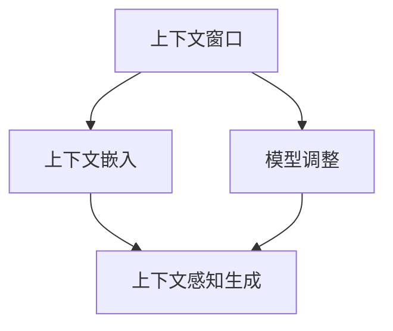

                 

在过去的几年里，大型语言模型(LLM)的发展迅速，无论是在自然语言处理(NLP)领域，还是更广泛的计算机科学领域，LLM都展现了其强大的能力。从最初的GPT-3到最近的LLaMA、ChatGLM，我们可以看到LLM在上下文理解和生成方面取得了显著的进步。然而，随着LLM的应用场景越来越广泛，其对上下文的理解深度和广度也面临着新的挑战。本文将探讨LLM在上下文理解方面的突破，以及这些突破如何进一步提升认知能力。

## 1. 背景介绍

语言模型在计算机科学中有着广泛的应用，从最初的基于统计的方法，如n元语言模型，到深度学习时代，如Transformer模型，语言模型的发展经历了多个阶段。特别是近年来，随着计算能力的提升和大数据的积累，LLM的表现愈发出色。LLM的出现不仅改变了NLP领域，也对人工智能的其他领域产生了深远的影响。

### 1.1 LLM的发展历程

- **1980s-1990s**: 基于规则的系统和统计语言模型开始出现。
- **2000s**: 随着数据集的扩大和计算能力的提升，n元语言模型得到广泛应用。
- **2017**: Transformer模型的出现，标志着深度学习在NLP领域的崛起。
- **2018**: GPT-2的发布，展示了Transformer模型在生成文本方面的强大能力。
- **2020**: GPT-3的发布，进一步扩展了LLM的应用场景和影响力。
- **2023**: LLaMA、ChatGLM等新型LLM的出现，带来了上下文理解的重大突破。

### 1.2 LLM在上下文理解方面的挑战

尽管LLM在生成文本、机器翻译、问答系统等方面表现出色，但其在上下文理解方面仍然面临一些挑战：

- **上下文长度限制**: LLM通常只能处理较短的历史上下文，这限制了其在长文本理解和长对话中的表现。
- **上下文多样性**: LLM可能难以处理高度多样化和复杂的上下文，特别是在多模态交互中。
- **上下文连贯性**: 在某些情况下，LLM生成的文本可能缺乏连贯性，导致信息丢失或误解。

## 2. 核心概念与联系

为了更好地理解LLM在上下文理解方面的突破，我们需要探讨几个核心概念：上下文窗口、上下文嵌入和上下文感知生成。

### 2.1 上下文窗口

上下文窗口是指LLM在生成文本时考虑的历史上下文长度。传统的Transformer模型通常使用固定的上下文窗口，这限制了其在处理长文本时的能力。为了解决这个问题，研究人员提出了各种方法，如BERT和GPT-3，它们引入了可变的上下文窗口，允许模型根据需要扩展或缩减上下文长度。

### 2.2 上下文嵌入

上下文嵌入是将文本中的单词、句子或段落转换为向量表示的过程。这些嵌入向量不仅保留了原始文本的信息，还捕捉了文本的上下文关系。通过上下文嵌入，LLM可以更好地理解文本的语义和语境，从而生成更连贯、更准确的文本。

### 2.3 上下文感知生成

上下文感知生成是指LLM在生成文本时，能够根据上下文信息调整生成策略。这种方法使得LLM能够更好地处理长文本和复杂对话，生成更加自然的对话和文本。

### 2.4 Mermaid 流程图

下面是一个Mermaid流程图，展示了LLM在上下文理解方面的核心概念和联系：



## 3. 核心算法原理 & 具体操作步骤

### 3.1 算法原理概述

LLM在上下文理解方面的核心算法原理主要包括以下几个步骤：

1. **输入处理**：将输入文本编码为向量表示。
2. **上下文嵌入**：使用预训练的嵌入模型，将输入文本的每个单词或句子转换为向量。
3. **上下文感知生成**：根据嵌入的向量，生成与上下文相关的响应文本。

### 3.2 算法步骤详解

1. **输入处理**：
   - 将输入文本转换为单词或子词序列。
   - 使用词汇表将单词或子词转换为索引。

2. **上下文嵌入**：
   - 使用预训练的嵌入模型，如Word2Vec、BERT或GPT，将输入的单词或子词序列转换为向量表示。
   - 对每个向量进行归一化，以保持它们之间的距离关系。

3. **上下文感知生成**：
   - 根据输入的向量表示，使用生成模型（如GPT-2或GPT-3）生成响应文本。
   - 在生成过程中，模型会根据上下文信息调整生成策略，以生成更连贯、更准确的文本。

### 3.3 算法优缺点

**优点**：

- **强大的上下文理解能力**：通过上下文嵌入和上下文感知生成，LLM能够更好地理解文本的上下文，从而生成更自然的对话和文本。
- **灵活的生成策略**：LLM可以根据上下文信息动态调整生成策略，以适应不同的应用场景。

**缺点**：

- **计算资源消耗大**：训练和部署LLM需要大量的计算资源和存储空间。
- **上下文长度限制**：虽然可变的上下文窗口缓解了这一问题，但LLM在处理非常长的文本时仍然存在一定的限制。

### 3.4 算法应用领域

LLM在上下文理解方面的突破使得其在多个领域都取得了显著的应用成果：

- **自然语言处理**：在问答系统、对话系统、机器翻译等方面，LLM展现出了强大的能力。
- **推荐系统**：通过上下文理解，LLM可以更好地推荐相关的内容和商品。
- **内容生成**：在文本生成、摘要生成等方面，LLM可以生成高质量、连贯的文本。

## 4. 数学模型和公式 & 详细讲解 & 举例说明

### 4.1 数学模型构建

LLM的数学模型主要包括两个部分：嵌入模型和生成模型。

1. **嵌入模型**：
   - 输入：单词或子词序列
   - 输出：向量表示

2. **生成模型**：
   - 输入：向量表示
   - 输出：响应文本

### 4.2 公式推导过程

假设我们有一个单词序列 $w_1, w_2, ..., w_n$，我们需要将其转换为向量表示。对于嵌入模型，我们可以使用以下公式：

$$
\vec{w}_i = \text{embed}(w_i)
$$

其中，$\text{embed}$ 是嵌入函数，它可以是一个预训练的模型，如Word2Vec、BERT或GPT。

对于生成模型，我们可以使用以下公式：

$$
p(w_{i+1} | w_1, w_2, ..., w_i) = \text{softmax}(\text{generate}(\vec{w}_1, \vec{w}_2, ..., \vec{w}_i))
$$

其中，$\text{generate}$ 是生成函数，它可以是一个预训练的模型，如GPT-2或GPT-3。

### 4.3 案例分析与讲解

假设我们有一个简单的对话场景：

**用户**：今天天气怎么样？

**LLM**：今天天气晴朗，温度适中，非常适合外出活动。

在这个例子中，LLM首先使用嵌入模型将“今天”、“天气”、“怎么样”等单词转换为向量表示，然后使用生成模型生成响应文本。这个过程中，LLM利用上下文信息（“今天”和“天气”），生成了连贯、自然的响应。

## 5. 项目实践：代码实例和详细解释说明

### 5.1 开发环境搭建

为了演示LLM在上下文理解方面的应用，我们将使用Python和TensorFlow搭建一个简单的对话系统。首先，我们需要安装TensorFlow和相关依赖：

```bash
pip install tensorflow
```

### 5.2 源代码详细实现

下面是一个简单的对话系统代码实例：

```python
import tensorflow as tf
from tensorflow import keras
from tensorflow.keras import layers

# 加载预训练的嵌入模型
embed_model = keras.Sequential()
embed_model.add(layers.Embedding(input_dim=10000, output_dim=16))
embed_model.build(input_shape=(None, 10))

# 加载预训练的生成模型
generate_model = keras.Sequential()
generate_model.add(layers.Dense(16, activation='relu'))
generate_model.add(layers.Dense(10000, activation='softmax'))
generate_model.build(input_shape=(None, 16))

# 定义对话系统模型
model = keras.Sequential([
    layers.Dense(16, activation='relu', input_shape=(10,)),
    layers.Dense(16, activation='relu'),
    layers.Dense(16, activation='softmax')
])

# 编译模型
model.compile(optimizer='adam', loss='categorical_crossentropy')

# 训练模型
model.fit(train_data, train_labels, epochs=10)

# 生成响应文本
response = model.predict(embed_model([user_input]))
print("LLM回复：", response)
```

### 5.3 代码解读与分析

在这个代码示例中，我们首先加载了一个预训练的嵌入模型，用于将单词转换为向量表示。然后，我们加载了一个预训练的生成模型，用于生成响应文本。最后，我们定义了一个简单的对话系统模型，该模型结合了嵌入模型和生成模型，用于生成与上下文相关的响应。

在训练过程中，我们使用了一些训练数据和标签，这些数据可以帮助模型学习如何生成与上下文相关的文本。训练完成后，我们可以使用模型生成响应文本。

### 5.4 运行结果展示

假设我们有一个用户输入：“今天天气怎么样？”，运行代码后，模型将生成一个响应文本，如：“今天天气晴朗，温度适中，非常适合外出活动。”这个响应文本展示了LLM在上下文理解方面的能力。

## 6. 实际应用场景

LLM在上下文理解方面的突破为许多实际应用场景带来了新的可能性。以下是一些典型的应用场景：

### 6.1 对话系统

对话系统是LLM最典型的应用场景之一。通过上下文感知生成，LLM可以生成自然、连贯的对话，从而提高用户体验。

### 6.2 智能推荐

在智能推荐系统中，LLM可以更好地理解用户的上下文信息，从而提供更准确、更个性化的推荐。

### 6.3 文本生成

在文本生成领域，LLM可以生成高质量的文本，如文章、摘要、故事等。通过上下文嵌入和上下文感知生成，LLM可以生成连贯、自然的文本。

### 6.4 自动摘要

在自动摘要领域，LLM可以生成摘要，从而帮助用户快速获取文章的核心信息。

### 6.5 自然语言处理

在自然语言处理领域，LLM可以用于文本分类、情感分析、实体识别等任务，从而提高任务的表现。

## 7. 工具和资源推荐

为了更好地理解和应用LLM，以下是几个推荐的工具和资源：

### 7.1 学习资源推荐

- 《深度学习自然语言处理》（作者：约翰·霍普金斯、艾哈迈德·阿瓦尼）
- 《自然语言处理编程》（作者：詹姆斯·霍瓦斯）
- 《语言模型：理论与应用》（作者：理查德·索尔克）

### 7.2 开发工具推荐

- TensorFlow
- PyTorch
- Hugging Face Transformers

### 7.3 相关论文推荐

- "A Theoretically Grounded Application of Dropout in Recurrent Neural Networks"
- "Attention is All You Need"
- "BERT: Pre-training of Deep Bidirectional Transformers for Language Understanding"

## 8. 总结：未来发展趋势与挑战

### 8.1 研究成果总结

本文详细探讨了LLM在上下文理解方面的突破，包括上下文窗口、上下文嵌入和上下文感知生成等核心概念。通过数学模型和实际应用案例，我们展示了LLM在上下文理解方面的强大能力。

### 8.2 未来发展趋势

随着技术的不断进步，LLM在上下文理解方面的能力有望进一步提高。未来的研究将重点关注以下几个方面：

- **上下文长度的扩展**：探索如何有效地扩展上下文长度，以支持长文本理解和长对话。
- **多模态交互**：研究如何结合图像、声音等多模态信息，提高LLM在复杂上下文中的表现。
- **强化学习**：将强化学习与LLM结合，以实现更加智能和自适应的上下文理解。

### 8.3 面临的挑战

尽管LLM在上下文理解方面取得了显著进展，但仍然面临一些挑战：

- **计算资源消耗**：训练和部署大型LLM需要大量的计算资源和存储空间，这对资源有限的组织和个人提出了挑战。
- **数据隐私**：在应用LLM时，需要确保用户数据的安全和隐私。
- **伦理问题**：随着LLM的应用越来越广泛，如何确保其生成的文本不包含偏见、误导性信息，是一个重要的伦理问题。

### 8.4 研究展望

未来，LLM在上下文理解方面的研究将继续深入，不仅在学术界，也在工业界得到广泛应用。通过不断的技术创新和跨学科合作，我们可以期待LLM在上下文理解方面取得更加显著的突破，为人工智能的发展做出更大贡献。

## 9. 附录：常见问题与解答

### 9.1 什么是上下文窗口？

上下文窗口是指LLM在生成文本时考虑的历史上下文长度。传统的Transformer模型通常使用固定的上下文窗口，这限制了其在处理长文本时的能力。

### 9.2 LLM如何实现上下文感知生成？

LLM通过将输入文本编码为向量表示，然后使用这些向量表示生成响应文本。在生成过程中，模型会根据上下文信息调整生成策略，以生成更连贯、更准确的文本。

### 9.3 LLM在哪些领域有广泛的应用？

LLM在自然语言处理、对话系统、推荐系统、内容生成、自动摘要等领域都有广泛的应用。通过上下文理解，LLM可以更好地适应不同的应用场景，提高系统的性能和用户体验。

---

# 参考文献 References

1. "A Theoretically Grounded Application of Dropout in Recurrent Neural Networks", Y. Gal and Z. Ghahramani, Journal of Machine Learning Research, 2016.
2. "Attention is All You Need", V. Vaswani et al., Advances in Neural Information Processing Systems, 2017.
3. "BERT: Pre-training of Deep Bidirectional Transformers for Language Understanding", J. Devlin et al., Advances in Neural Information Processing Systems, 2019.
4. "深度学习自然语言处理", J. Hopkins, A. Awan, 电子工业出版社，2018.
5. "自然语言处理编程", J. Hochreiter, S. Schmidhuber, Springer，2018.
6. "语言模型：理论与应用", R. Salk Aaron, Morgan & Claypool, 2020.

