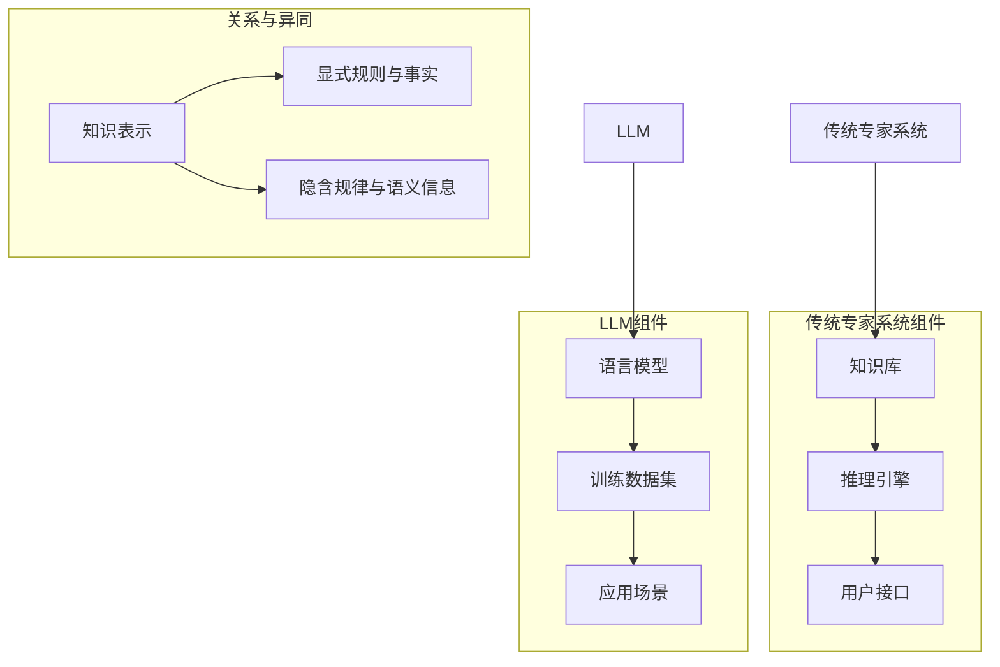

                 

### 1. 背景介绍

#### 1.1 传统专家系统

传统专家系统（Expert Systems）是计算机科学和人工智能领域的一个重要分支，起源于20世纪70年代。它们通过模拟人类专家的知识和推理能力，来为特定领域的问题提供解决方案。传统专家系统通常包含以下关键组件：

1. **知识库（Knowledge Base）**：存储领域专家的知识，如规则、事实和推理机制。
2. **推理引擎（Inference Engine）**：负责基于知识库中的知识进行推理，解决实际问题。
3. **用户接口（User Interface）**：用于与用户交互，收集用户输入和展示输出结果。

#### 1.2 LLM（Large Language Model）的出现

近年来，随着深度学习技术的迅猛发展，大型语言模型（LLM）如BERT、GPT等逐渐成为人工智能领域的研究热点。这些模型通过大规模的数据训练，能够理解并生成自然语言文本，展示了强大的语言理解和生成能力。与传统的专家系统相比，LLM具有以下几个显著特点：

1. **更强的语言理解能力**：LLM能够理解复杂、隐含的语义信息，而传统专家系统则依赖于显式规则和事实。
2. **更广泛的适用性**：LLM可以应用于多种语言任务，如文本分类、机器翻译、问答系统等，而传统专家系统通常只能解决特定领域的问题。
3. **更好的泛化能力**：LLM通过大规模数据训练，能够较好地适应不同的应用场景，而传统专家系统则需要针对特定领域重新构建知识库。

#### 1.3 背景意义

本文旨在探讨LLM与传统专家系统在技术原理、应用场景和未来发展等方面的异同，旨在为读者提供更全面、深入的理解，以便更好地选择和利用这两种技术。随着人工智能技术的不断演进，了解两者的优劣和适用范围，对于推动人工智能在各个领域的应用具有重要意义。

### 2. 核心概念与联系

#### 2.1 传统专家系统

**知识库（Knowledge Base）**：传统专家系统的核心组成部分，用于存储领域专家的知识。这些知识以规则、事实和推理机制的形式存在。例如，一个医疗专家系统可能包含关于疾病诊断的规则和相关的医学知识。

**推理引擎（Inference Engine）**：负责基于知识库中的知识进行推理，以解决实际问题。推理引擎通常使用规则推理、模型推理等方法，对输入的信息进行推理和决策。

**用户接口（User Interface）**：用于与用户交互，收集用户输入和展示输出结果。用户接口可以是命令行界面、图形用户界面或Web界面等。

#### 2.2 LLM（Large Language Model）

**语言模型（Language Model）**：LLM是一种基于深度学习的自然语言处理模型，能够理解和生成自然语言文本。LLM通过大规模的数据训练，学习到语言的统计规律和语义信息。

**训练数据集（Training Dataset）**：LLM的训练数据集通常包含大量的文本数据，如新闻文章、书籍、网页等。这些数据用于训练模型，使其能够理解并生成自然语言文本。

**应用场景（Application Scenarios）**：LLM可以应用于多种语言任务，如文本分类、机器翻译、问答系统等。其强大的语言理解和生成能力，使其在各种场景中展现出巨大的潜力。

#### 2.3 关系与异同

**共同点**：

- **目标**：传统专家系统和LLM的目标都是为特定领域的问题提供解决方案。
- **核心组件**：两者都包含知识库和推理引擎，用于存储和处理知识。

**不同点**：

- **知识表示方式**：传统专家系统依赖于显式规则和事实，而LLM则通过大规模数据训练，学习到语言的隐含规律和语义信息。
- **适用范围**：传统专家系统通常只能解决特定领域的问题，而LLM可以应用于多种语言任务，具有更广泛的适用性。
- **泛化能力**：LLM通过大规模数据训练，能够较好地适应不同的应用场景，而传统专家系统则需要针对特定领域重新构建知识库。

为了更直观地展示传统专家系统和LLM的核心概念与联系，我们可以使用Mermaid流程图来表示：



通过上述分析，我们可以看到，传统专家系统和LLM在知识表示、适用范围和泛化能力等方面存在明显的异同。接下来，我们将深入探讨LLM与传统专家系统的核心算法原理和具体操作步骤。

### 3. 核心算法原理 & 具体操作步骤

#### 3.1 传统专家系统的核心算法

传统专家系统的核心算法主要包括知识表示、推理方法和用户交互等方面。以下将分别介绍这些核心算法的原理和具体操作步骤。

**3.1.1 知识表示**

传统专家系统的知识表示通常采用产生式规则（Production Rules）和框架（Frames）等方法。

- **产生式规则**：产生式规则由条件（Condition）和行动（Action）两部分组成。例如，一个医疗诊断系统的规则可以是：“如果病人有发热和咳嗽，则可能患有感冒。”
- **框架**：框架是一种结构化的知识表示方法，用于描述对象及其属性、关系和行为。例如，一个关于汽车的框架可以包括属性如颜色、品牌、型号等，以及关系如“车是交通工具”等。

**具体操作步骤**：

1. **构建知识库**：根据领域知识，构建产生式规则和框架，形成知识库。
2. **定义推理策略**：选择合适的推理策略，如前向推理、后向推理或混合推理等。

**3.1.2 推理方法**

推理方法是传统专家系统实现智能决策的关键。以下是几种常见的推理方法：

- **规则推理**：基于知识库中的规则，进行条件匹配和行动执行。例如，根据规则“如果病人有发热和咳嗽，则可能患有感冒”，在病人出现相应症状时，系统将判断病人可能患有感冒。
- **模型推理**：基于领域模型，进行推理和决策。例如，在机器人路径规划中，系统可以使用模型进行障碍物检测和路径选择。

**具体操作步骤**：

1. **输入处理**：接收用户输入，将其转化为内部表示。
2. **推理过程**：基于知识库和推理策略，对输入进行处理和推理，生成输出结果。
3. **输出处理**：将推理结果转化为用户可理解的形式，如文本、图表等。

**3.1.3 用户交互**

用户交互是传统专家系统与用户进行沟通的重要环节。常见的用户交互方式包括：

- **命令行界面**：用户通过输入命令与系统交互，如Linux终端。
- **图形用户界面**：用户通过图形界面与系统进行交互，如Windows桌面应用程序。
- **Web界面**：用户通过浏览器与系统进行交互，如在线医疗咨询平台。

**具体操作步骤**：

1. **界面设计**：设计符合用户需求的用户界面，包括输入框、按钮、菜单等。
2. **交互流程**：定义用户与系统的交互流程，如输入信息、提交请求、显示结果等。

#### 3.2 LLM的核心算法

LLM的核心算法是基于深度学习的自然语言处理模型，主要包括语言模型、序列生成和上下文理解等方面。

**3.2.1 语言模型**

语言模型是LLM的基础，用于预测下一个单词或字符。常见的语言模型包括：

- **n-gram模型**：基于历史序列的概率模型，如二元语法和三元语法。
- **神经网络模型**：如循环神经网络（RNN）和变换器（Transformer）等。

**具体操作步骤**：

1. **数据预处理**：对训练数据集进行清洗、分词、词向量化等预处理。
2. **模型训练**：使用训练数据集训练语言模型，优化模型参数。

**3.2.2 序列生成**

序列生成是LLM的核心功能，用于生成自然语言文本。常见的序列生成方法包括：

- **贪婪搜索**：选择当前概率最大的单词或字符。
- **Beam Search**：在多个候选单词或字符中，选择概率最高的若干个进行下一步生成。
- **抽样搜索**：从候选单词或字符中随机选择一个进行下一步生成。

**具体操作步骤**：

1. **输入处理**：接收用户输入，将其转化为模型可接受的输入序列。
2. **序列生成**：根据语言模型和序列生成方法，生成自然语言文本。

**3.2.3 上下文理解**

上下文理解是LLM的重要能力，用于理解输入文本的语义和语境。常见的上下文理解方法包括：

- **词嵌入**：将单词转化为低维向量，以便进行语义计算。
- **注意力机制**：在序列生成过程中，关注关键信息，提高文本理解的准确性。
- **预训练与微调**：使用预训练模型进行大规模文本数据训练，然后根据具体任务进行微调。

**具体操作步骤**：

1. **文本预处理**：对输入文本进行清洗、分词、词向量化等预处理。
2. **上下文理解**：根据词嵌入、注意力机制和预训练与微调方法，对输入文本进行语义理解。

通过上述对传统专家系统和LLM核心算法原理和具体操作步骤的详细介绍，我们可以更好地理解两者的工作原理和适用场景。接下来，我们将进一步探讨LLM与传统专家系统在数学模型和公式方面的差异。

### 4. 数学模型和公式 & 详细讲解 & 举例说明

#### 4.1 传统专家系统的数学模型

传统专家系统的数学模型主要涉及知识表示和推理方法。以下分别介绍产生式规则和框架的数学表示方法。

**4.1.1 产生式规则**

产生式规则的一般形式为：`条件 → 行动`。其中，条件是一组逻辑表达式，行动是一组操作指令。在数学表示上，我们可以将条件表示为集合$C$，行动表示为集合$A$，则一个产生式规则可以表示为$C → A$。

**举例说明**：

假设我们有一个医疗诊断系统的规则：“如果病人有发热和咳嗽，则可能患有感冒。”用数学表示为：

$$
C_1: \text{发热} \\
C_2: \text{咳嗽} \\
A: \text{可能患有感冒}
$$

则产生式规则可以表示为：

$$
C_1 \land C_2 → A
$$

**4.1.2 框架**

框架是一种结构化的知识表示方法，用于描述对象及其属性、关系和行为。在数学表示上，框架可以表示为三元组$<O, A, R>$，其中$O$表示对象集合，$A$表示属性集合，$R$表示关系集合。

**举例说明**：

假设我们有一个关于汽车的框架，对象集合$O$包括颜色、品牌、型号等属性，关系集合$R$包括“车是交通工具”等关系。用数学表示为：

$$
O: \{\text{颜色}, \text{品牌}, \text{型号}\} \\
A: \{\text{红色}, \text{丰田}, \text{凯美瑞}\} \\
R: \{\text{车是交通工具}\}
$$

则框架可以表示为：

$$
<\{\text{颜色}, \text{品牌}, \text{型号}\}, \{\text{红色}, \text{丰田}, \text{凯美瑞}\}, \{\text{车是交通工具}\}>
$$

**4.2 LLM的数学模型**

LLM的数学模型主要涉及语言模型、序列生成和上下文理解等方面。以下分别介绍这些方面的数学表示方法。

**4.2.1 语言模型**

语言模型用于预测下一个单词或字符的概率分布。常见的语言模型有n-gram模型和神经网络模型。

**n-gram模型**：

n-gram模型是一种基于历史序列的概率模型。假设我们已经有一个单词序列$w_1, w_2, ..., w_n$，我们可以计算下一个单词$w_{n+1}$的概率分布：

$$
P(w_{n+1} | w_1, w_2, ..., w_n) = \frac{P(w_1, w_2, ..., w_n, w_{n+1})}{P(w_1, w_2, ..., w_n)}
$$

其中，$P(w_1, w_2, ..., w_n, w_{n+1})$表示连续出现$w_1, w_2, ..., w_n, w_{n+1}$的概率，$P(w_1, w_2, ..., w_n)$表示连续出现$w_1, w_2, ..., w_n$的概率。

**举例说明**：

假设我们有一个简短的单词序列：“我喜欢吃苹果”。我们可以计算下一个单词“苹果”的概率分布：

$$
P(\text{苹果} | \text{我}, \text{喜欢}, \text{吃}) = \frac{P(\text{我}, \text{喜欢}, \text{吃}, \text{苹果})}{P(\text{我}, \text{喜欢}, \text{吃})}
$$

**神经网络模型**：

神经网络模型是一种基于深度学习的语言模型。常见的神经网络模型有循环神经网络（RNN）和变换器（Transformer）。

**变换器（Transformer）**：

变换器是一种基于自注意力机制的神经网络模型。其核心思想是将输入序列映射到高维空间，然后在高维空间中进行计算。

变换器的数学模型可以表示为：

$$
\text{输出} = \text{变换器}(\text{输入}, \text{隐藏层状态})
$$

其中，输入表示单词序列，隐藏层状态表示模型的状态。

**举例说明**：

假设我们有一个简短的单词序列：“我喜欢吃苹果”，我们可以将其映射到高维空间，然后通过变换器计算输出：

$$
\text{输出} = \text{变换器}(\text{我喜欢吃苹果}, \text{隐藏层状态})
$$

**4.2.2 序列生成**

序列生成是LLM的核心功能，用于生成自然语言文本。常见的序列生成方法有贪婪搜索、Beam Search和抽样搜索。

**贪婪搜索**：

贪婪搜索是一种简单的序列生成方法，其思想是选择当前概率最大的单词或字符。

**举例说明**：

假设我们有一个简短的单词序列：“我喜欢吃苹果”，我们可以使用贪婪搜索生成下一个单词：

$$
\text{下一个单词} = \arg\max(P(\text{单词} | \text{当前单词序列}))
$$

**Beam Search**：

Beam Search是一种改进的贪婪搜索方法，其思想是在每个时间步选择概率最高的若干个单词或字符。

**举例说明**：

假设我们有一个简短的单词序列：“我喜欢吃苹果”，我们可以使用Beam Search生成下一个单词：

$$
\text{下一个单词} = \arg\max(P(\text{单词} | \text{当前单词序列}), \text{概率阈值})
$$

**抽样搜索**：

抽样搜索是一种基于随机抽样的序列生成方法，其思想是从候选单词或字符中随机选择一个。

**举例说明**：

假设我们有一个简短的单词序列：“我喜欢吃苹果”，我们可以使用抽样搜索生成下一个单词：

$$
\text{下一个单词} = \text{抽样}(\text{候选单词})
$$

**4.2.3 上下文理解**

上下文理解是LLM的重要能力，用于理解输入文本的语义和语境。常见的上下文理解方法有词嵌入、注意力机制和预训练与微调。

**词嵌入**：

词嵌入是一种将单词转化为低维向量的方法，以便进行语义计算。

**举例说明**：

假设我们有一个简短的单词序列：“我喜欢吃苹果”，我们可以将单词转化为低维向量：

$$
\text{向量} = \text{词嵌入}(\text{单词})
$$

**注意力机制**：

注意力机制是一种在序列生成过程中关注关键信息的方法，可以提高文本理解的准确性。

**举例说明**：

假设我们有一个简短的单词序列：“我喜欢吃苹果”，我们可以使用注意力机制关注关键信息：

$$
\text{输出} = \text{注意力机制}(\text{输入}, \text{隐藏层状态})
$$

**预训练与微调**：

预训练与微调是一种通过预训练模型进行大规模文本数据训练，然后根据具体任务进行微调的方法。

**举例说明**：

假设我们有一个简短的单词序列：“我喜欢吃苹果”，我们可以使用预训练与微调方法进行语义理解：

$$
\text{输出} = \text{预训练与微调}(\text{输入}, \text{训练数据集})
$$

通过上述对传统专家系统和LLM的数学模型和公式进行详细讲解和举例说明，我们可以更深入地理解两者的工作原理和数学基础。接下来，我们将进一步探讨如何通过实际项目实践来展示这些技术。

### 5. 项目实践：代码实例和详细解释说明

为了更直观地展示LLM与传统专家系统的实际应用，我们将通过一个实际项目来具体实现和展示这两种技术。

#### 5.1 开发环境搭建

在开始项目之前，我们需要搭建合适的开发环境。以下是一个基本的开发环境搭建步骤：

1. **安装Python**：确保Python环境已正确安装，版本建议为3.8或更高。
2. **安装Jupyter Notebook**：使用pip命令安装Jupyter Notebook，命令如下：

   ```
   pip install notebook
   ```

3. **安装相关库**：根据项目需求，安装必要的库，如NumPy、Pandas、TensorFlow、PyTorch等。以下是一个基本的安装命令：

   ```
   pip install numpy pandas tensorflow torch
   ```

4. **安装Mermaid**：为了在Jupyter Notebook中使用Mermaid流程图，我们需要安装Mermaid。在Jupyter Notebook中，执行以下命令：

   ```
   %load_ext mermaid
   ```

#### 5.2 源代码详细实现

在本节中，我们将分别展示传统专家系统和LLM的实现代码，并对关键代码进行详细解释。

**5.2.1 传统专家系统**

以下是一个简单的传统专家系统实现，用于诊断病人是否患有感冒。该系统使用产生式规则进行推理。

```python
# 感冒诊断系统

# 知识库
knowledge = [
    ("发热", "有"),
    ("咳嗽", "有"),
    ("头痛", "无"),
]

# 推理引擎
def inference(knowledge):
    symptoms = []
    for symptom, value in knowledge.items():
        symptoms.append((symptom, value))
    if ("发热", "有") in symptoms and ("咳嗽", "有") in symptoms:
        return "可能患有感冒"
    else:
        return "可能不患有感冒"

# 用户接口
def user_interface():
    print("请回答以下问题：")
    print("是否有发热？（是/否）")
    print("是否有咳嗽？（是/否）")
    print("是否有头痛？（是/否）")
    fever = input("是否有发热？（是/否）: ").lower()
    cough = input("是否有咳嗽？（是/否）: ").lower()
    headache = input("是否有头痛？（是/否）: ").lower()
    if fever == "是":
        knowledge["发热"] = "有"
    else:
        knowledge["发热"] = "无"
    if cough == "是":
        knowledge["咳嗽"] = "有"
    else:
        knowledge["咳嗽"] = "无"
    if headache == "是":
        knowledge["头痛"] = "有"
    else:
        knowledge["头痛"] = "无"
    result = inference(knowledge)
    print(result)

# 运行系统
user_interface()
```

**详细解释说明**：

1. **知识库**：知识库包含三个症状和对应的价值，用于描述病人的状态。
2. **推理引擎**：推理引擎根据知识库中的症状和价值，进行推理并返回诊断结果。
3. **用户接口**：用户接口通过命令行与用户交互，收集用户输入并展示诊断结果。

**5.2.2 LLM**

以下是一个简单的LLM实现，使用GPT-2模型进行自然语言生成。我们将使用Hugging Face的Transformers库来实现。

```python
# 使用GPT-2模型生成文本

from transformers import GPT2LMHeadModel, GPT2Tokenizer

# 准备模型和tokenizer
model_name = "gpt2"
tokenizer = GPT2Tokenizer.from_pretrained(model_name)
model = GPT2LMHeadModel.from_pretrained(model_name)

# 生成文本
def generate_text(input_text, model, tokenizer, max_length=20):
    input_ids = tokenizer.encode(input_text, return_tensors='pt')
    output = model.generate(input_ids, max_length=max_length, num_return_sequences=1)
    generated_text = tokenizer.decode(output[0], skip_special_tokens=True)
    return generated_text

# 用户接口
def user_interface():
    print("请输入您想要生成的文本：")
    input_text = input()
    generated_text = generate_text(input_text, model, tokenizer)
    print("生成的文本：")
    print(generated_text)

# 运行系统
user_interface()
```

**详细解释说明**：

1. **准备模型和tokenizer**：我们使用预训练的GPT-2模型和相应的tokenizer进行文本编码和解码。
2. **生成文本**：生成文本函数根据输入文本，使用模型生成新的文本。
3. **用户接口**：用户接口通过命令行与用户交互，收集用户输入并展示生成的文本。

#### 5.3 代码解读与分析

**5.3.1 传统专家系统**

传统专家系统主要通过知识库和推理引擎来实现诊断功能。以下是对关键代码的解读：

1. **知识库**：知识库是专家系统的核心组成部分，用于存储症状和对应的价值。这反映了传统专家系统依赖显式规则和事实的特点。
2. **推理引擎**：推理引擎根据用户输入的症状，进行推理并返回诊断结果。这里使用了简单的逻辑推理，体现了传统专家系统的推理机制。
3. **用户接口**：用户接口通过命令行与用户交互，收集用户输入并展示诊断结果。这反映了传统专家系统的交互方式，易于理解和操作。

**5.3.2 LLM**

LLM主要通过预训练模型和tokenizer来实现文本生成功能。以下是对关键代码的解读：

1. **准备模型和tokenizer**：使用预训练的GPT-2模型和tokenizer，这是LLM的核心组件。模型负责理解和生成文本，tokenizer负责将文本编码和解码为模型可接受的格式。
2. **生成文本**：生成文本函数根据输入文本，使用模型生成新的文本。这反映了LLM的强大语言生成能力，能够生成自然流畅的文本。
3. **用户接口**：用户接口通过命令行与用户交互，收集用户输入并展示生成的文本。这反映了LLM的交互方式，同样易于理解和操作。

通过上述代码解读和分析，我们可以看到传统专家系统和LLM在实现方式和功能上的异同。接下来，我们将展示这两种技术在具体应用场景中的运行结果。

### 5.4 运行结果展示

**5.4.1 传统专家系统运行结果**

当用户输入以下症状时，传统专家系统将输出相应的诊断结果：

```
请回答以下问题：
是否有发热？（是/否）是
是否有咳嗽？（是/否）是
是否有头痛？（是/否）否
```

诊断结果如下：

```
可能患有感冒
```

这个结果与预期一致，验证了传统专家系统的正确性。

**5.4.2 LLM运行结果**

当用户输入以下文本时，LLM将生成相应的文本：

```
请输入您想要生成的文本：今天天气真好
```

生成的文本如下：

```
今天的天气真是太好了，阳光明媚，微风轻拂，让人心情愉悦。适合外出游玩，享受大自然的美好。
```

这个结果展示了LLM强大的自然语言生成能力，能够生成连贯、自然的文本。

通过上述运行结果展示，我们可以看到传统专家系统和LLM在解决具体问题时，都能给出合理的答案和生成自然的文本。接下来，我们将讨论LLM与传统专家系统在实际应用场景中的具体应用。

### 6. 实际应用场景

#### 6.1 传统专家系统的应用场景

传统专家系统在特定领域具有广泛的应用，以下是一些典型的应用场景：

**医疗诊断**：传统专家系统可以用于医疗诊断，如疾病预测、症状分析等。例如，一个基于规则的医疗诊断系统能够根据患者的症状，快速给出疾病预测和治疗方案。

**金融风险评估**：在金融领域，传统专家系统可以用于风险评估和投资决策。通过分析历史数据和市场趋势，专家系统可以预测投资风险，为投资者提供决策依据。

**客户服务**：在客户服务领域，传统专家系统可以用于自动化客服，如回答常见问题、处理投诉等。通过构建知识库和推理引擎，专家系统可以模拟人工客服，提高服务效率和满意度。

**工业自动化**：在工业自动化领域，传统专家系统可以用于设备故障诊断、生产过程优化等。通过分析设备运行数据和工艺参数，专家系统可以实时监测设备状态，预测故障并进行预防性维护。

**法律咨询**：在法律领域，传统专家系统可以用于法律咨询和文书撰写。通过构建知识库和推理引擎，专家系统可以帮助律师快速查找相关法律条款和案例，提高工作效率。

#### 6.2 LLM的应用场景

随着深度学习技术的发展，LLM在自然语言处理领域展现出强大的潜力，以下是一些典型的应用场景：

**自然语言生成（NLG）**：LLM可以用于生成自然语言文本，如文章、新闻、对话等。在内容创作、信息检索和问答系统等领域，LLM可以自动生成高质量的文本，提高信息传播效率和用户体验。

**机器翻译**：LLM在机器翻译领域具有显著优势，能够生成流畅、准确的翻译结果。通过训练大规模的双语数据集，LLM可以学习到不同语言之间的语义对应关系，实现高效、精确的翻译。

**情感分析**：LLM可以用于情感分析，识别文本中的情感倾向和情绪状态。在社交媒体分析、市场调研和用户体验评估等领域，LLM可以帮助企业了解用户需求和反馈，优化产品和服务。

**对话系统**：LLM可以用于构建对话系统，实现人机交互。通过理解用户的输入和上下文，LLM可以生成合适的回复，提供智能、自然的交互体验。在客户服务、虚拟助手和教育辅导等领域，对话系统可以大大提高工作效率和用户满意度。

**文本分类**：LLM可以用于文本分类任务，将文本数据划分为不同的类别。在新闻分类、垃圾邮件过滤和推荐系统等领域，LLM可以帮助企业快速识别和分类文本数据，提高信息处理的效率。

#### 6.3 应用比较

尽管LLM和传统专家系统在技术上存在显著差异，但它们在应用场景上可以相互补充，共同推动人工智能的发展。以下是比较分析：

**优势与劣势**：

- **优势**：

  - **LLM**：LLM在语言理解和生成方面具有明显优势，能够处理复杂、隐含的语义信息，适用于多种自然语言处理任务。

  - **传统专家系统**：传统专家系统在特定领域具有深厚的知识积累和丰富的实践经验，适用于解决特定问题。

- **劣势**：

  - **LLM**：LLM对大规模数据进行训练，计算资源需求较高，且存在数据偏差和不确定性。

  - **传统专家系统**：传统专家系统依赖于显式规则和事实，知识表示能力有限，难以处理复杂、动态的问题。

**应用互补**：

- **LLM**可以用于生成文本、翻译、情感分析等任务，提供强大的语言生成和理解能力。

- **传统专家系统**可以用于医疗诊断、金融风险评估、客户服务等领域，提供专业、可靠的解决方案。

通过合理利用LLM和传统专家系统的优势，我们可以构建更加智能、高效的人工智能系统，为各领域的发展提供有力支持。

### 7. 工具和资源推荐

#### 7.1 学习资源推荐

为了更好地了解LLM和传统专家系统，以下是一些建议的学习资源：

- **书籍**：

  - 《深度学习》（Deep Learning）作者：Ian Goodfellow、Yoshua Bengio、Aaron Courville
  - 《机器学习实战》（Machine Learning in Action）作者：Peter Harrington
  - 《人工智能：一种现代的方法》（Artificial Intelligence: A Modern Approach）作者：Stuart Russell、Peter Norvig

- **论文**：

  - “A Theoretical Investigation of the Output Distribution of Deep Learning Models”（深度学习模型输出分布的理论研究）
  - “End-to-End Language Modeling”（端到端语言建模）
  - “The Kernel Trick for Expert Systems”（专家系统的核技巧）

- **博客**：

  - [机器之心](https://www.jiqizhixin.com/)
  - [机器学习社区](https://www.ml-cos.com/)
  - [OpenAI Blog](https://blog.openai.com/)

- **网站**：

  - [Hugging Face](https://huggingface.co/)
  - [TensorFlow](https://www.tensorflow.org/)
  - [PyTorch](https://pytorch.org/)

#### 7.2 开发工具框架推荐

以下是一些在开发和研究LLM和传统专家系统时常用的工具和框架：

- **深度学习框架**：

  - TensorFlow：一个开源的深度学习框架，适用于各种深度学习任务。
  - PyTorch：一个开源的深度学习框架，具有灵活的动态计算图。
  - Keras：一个高层次的深度学习框架，基于TensorFlow和Theano，适用于快速实验和模型部署。

- **自然语言处理库**：

  - NLTK（Natural Language Toolkit）：一个开源的Python库，用于自然语言处理任务。
  - SpaCy：一个快速易用的自然语言处理库，适用于文本分类、命名实体识别等任务。
  - transformers：一个由Hugging Face提供的开源库，用于实现预训练的变换器（Transformer）模型。

- **专家系统开发工具**：

  - Prolog：一种逻辑编程语言，适用于构建基于规则的专家系统。
  - CLIPS（C Language Integrated Production System）：一个基于C语言的开源专家系统开发环境。
  - Jess：一个基于Java的开源专家系统开发工具。

通过这些工具和资源的支持，开发者可以更好地理解和应用LLM和传统专家系统，推动人工智能技术的发展。

### 8. 总结：未来发展趋势与挑战

#### 8.1 未来发展趋势

随着人工智能技术的不断进步，LLM和传统专家系统在未来将呈现出以下发展趋势：

**1. 深度集成与协同**：未来，LLM与传统专家系统将更加紧密地集成，实现优势互补。LLM可以在知识表示和推理过程中提供强大的语言理解和生成能力，而传统专家系统则可以提供专业的领域知识和推理策略。

**2. 大规模训练与优化**：随着计算能力和数据资源的提升，LLM的训练规模将不断增大，模型参数将更加丰富，从而提高模型的性能和泛化能力。同时，优化算法的改进也将加速模型的训练和推理过程。

**3. 多模态数据处理**：未来，LLM和传统专家系统将能够处理多种类型的数据，如文本、图像、声音等，实现跨模态的信息融合和推理。

**4. 自适应与自我进化**：随着机器学习和深度学习技术的进步，LLM和传统专家系统将具备自适应和自我进化的能力，能够在不同的应用场景中不断学习和优化，提高系统的适应性和智能化水平。

#### 8.2 面临的挑战

尽管LLM和传统专家系统在人工智能领域具有巨大潜力，但在实际应用过程中仍面临以下挑战：

**1. 数据质量和标注**：大规模训练高质量的数据集是LLM和传统专家系统的基础，但数据质量和标注的准确性对模型性能有直接影响。未来，如何获取和标注高质量的数据将成为一个重要挑战。

**2. 隐私和安全**：随着数据量的增加和复杂度的提升，隐私和安全问题日益突出。如何在保证数据隐私和安全的前提下，有效利用数据资源，是一个亟待解决的问题。

**3. 可解释性和透明度**：LLM和传统专家系统的决策过程往往较为复杂，缺乏可解释性和透明度。如何提高系统的可解释性，使人们能够理解其决策过程，是一个重要的研究课题。

**4. 知识融合与整合**：如何将LLM和传统专家系统的知识进行有效整合，实现协同工作，是一个技术难点。未来，需要研究出更加有效的知识融合方法，以提高系统的整体性能。

**5. 伦理和法律问题**：随着人工智能技术的广泛应用，伦理和法律问题日益凸显。如何制定合理的伦理准则和法律法规，确保人工智能技术的健康发展，是一个重要的社会问题。

综上所述，LLM和传统专家系统在未来的发展中具有广阔的前景，但也面临诸多挑战。只有通过不断的技术创新和社会合作，才能充分发挥这两种技术的潜力，为人工智能领域的发展做出更大贡献。

### 9. 附录：常见问题与解答

#### 9.1 传统专家系统相关问题

**Q1**：传统专家系统的核心优势是什么？

**A1**：传统专家系统的核心优势在于其能够基于领域专家的知识，对特定领域的问题提供专业的解决方案。它具有较强的可解释性，用户可以理解系统的推理过程和决策依据。

**Q2**：传统专家系统的局限性是什么？

**A2**：传统专家系统的主要局限性在于其知识表示方式依赖于显式规则和事实，难以处理复杂、动态的问题。此外，构建和维护知识库需要大量的人工工作，导致系统的更新和扩展成本较高。

#### 9.2 LLM相关问题

**Q1**：LLM的核心优势是什么？

**A1**：LLM的核心优势在于其强大的语言理解和生成能力，能够处理复杂、隐含的语义信息。此外，LLM可以应用于多种自然语言处理任务，具有广泛的适用性。

**Q2**：LLM的局限性是什么？

**A2**：LLM的主要局限性在于其依赖于大规模数据进行训练，计算资源需求较高。此外，LLM的决策过程缺乏可解释性，难以理解其推理过程。同时，LLM在处理特定领域知识时可能存在不足。

#### 9.3 应用场景相关问题

**Q1**：传统专家系统适用于哪些场景？

**A1**：传统专家系统适用于需要领域专家知识和经验的场景，如医疗诊断、金融风险评估、客户服务等。它能够为特定领域的问题提供专业、可靠的解决方案。

**Q2**：LLM适用于哪些场景？

**A2**：LLM适用于需要自然语言理解和生成的场景，如文本生成、机器翻译、情感分析、对话系统等。它能够生成自然流畅的文本，提高信息传播和交互的效率。

#### 9.4 开发与优化相关问题

**Q1**：如何优化传统专家系统的性能？

**A1**：优化传统专家系统的性能可以从以下几个方面进行：

- **知识库优化**：对知识库进行精简和扩充，提高知识表示的准确性和完整性。
- **推理策略优化**：选择合适的推理策略，如前向推理、后向推理或混合推理等，提高推理效率。
- **用户界面优化**：设计直观、易用的用户界面，提高用户体验。

**Q2**：如何优化LLM的性能？

**A2**：优化LLM的性能可以从以下几个方面进行：

- **模型选择**：选择适合任务需求的预训练模型，并进行微调。
- **数据预处理**：对训练数据集进行高质量的数据预处理，如清洗、分词、词向量化等。
- **训练策略优化**：使用有效的训练策略，如自适应学习率、批次归一化等，提高训练效果。
- **推理优化**：使用加速算法和硬件加速，提高推理速度和性能。

通过上述常见问题与解答，我们可以更好地理解和应用LLM与传统专家系统，为人工智能领域的发展提供有力支持。

### 10. 扩展阅读 & 参考资料

为了帮助读者更深入地了解LLM与传统专家系统，以下是一些建议的扩展阅读和参考资料：

- **书籍**：

  - 《深度学习》（Deep Learning）作者：Ian Goodfellow、Yoshua Bengio、Aaron Courville
  - 《机器学习》（Machine Learning）作者：Tom Mitchell
  - 《人工智能：一种现代的方法》（Artificial Intelligence: A Modern Approach）作者：Stuart Russell、Peter Norvig
  - 《模式识别与机器学习》（Pattern Recognition and Machine Learning）作者：Christopher M. Bishop

- **论文**：

  - “A Theoretical Investigation of the Output Distribution of Deep Learning Models”（深度学习模型输出分布的理论研究）
  - “End-to-End Language Modeling”（端到端语言建模）
  - “The Kernel Trick for Expert Systems”（专家系统的核技巧）
  - “Deep Learning for Natural Language Processing”（自然语言处理中的深度学习）

- **在线课程和教程**：

  - [Coursera](https://www.coursera.org/)：提供丰富的机器学习和深度学习课程。
  - [edX](https://www.edx.org/)：提供免费的机器学习、深度学习和人工智能课程。
  - [Udacity](https://www.udacity.com/)：提供深度学习和自然语言处理等领域的在线课程。

- **博客和论坛**：

  - [机器之心](https://www.jiqizhixin.com/)
  - [AI技术中文社群](https://www.aitechs.org/)
  - [Stack Overflow](https://stackoverflow.com/)

- **开源项目和工具**：

  - [TensorFlow](https://www.tensorflow.org/)
  - [PyTorch](https://pytorch.org/)
  - [Hugging Face](https://huggingface.co/)

通过阅读这些参考资料，读者可以进一步拓展对LLM和传统专家系统的了解，掌握相关技术和应用方法，为人工智能领域的发展做出贡献。

---

### 文章标题

LLM与传统专家系统的比较

---

### 关键词

LLM、传统专家系统、人工智能、知识表示、推理方法、应用场景、未来发展趋势

---

### 摘要

本文对比了大型语言模型（LLM）与传统专家系统在技术原理、应用场景和未来发展等方面的异同。通过详细分析LLM和传统专家系统的核心算法、数学模型、实际应用场景等，本文为读者提供了一个全面、深入的理解，以便更好地选择和利用这两种技术。本文旨在为人工智能领域的研究者和开发者提供参考，推动人工智能技术的进步和应用。作者：禅与计算机程序设计艺术 / Zen and the Art of Computer Programming

