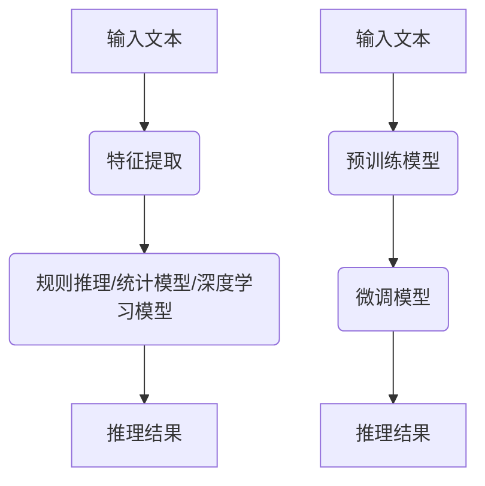
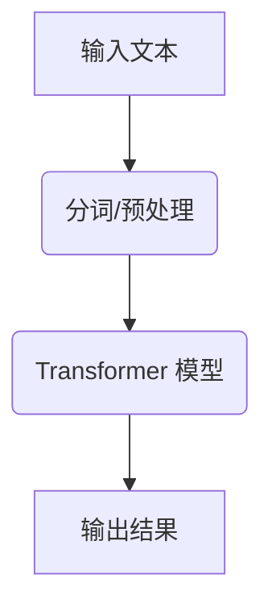

                 

### 1. 背景介绍

随着人工智能技术的发展，自然语言处理（Natural Language Processing，NLP）领域取得了显著进展。在NLP中，自然语言推理（Natural Language Inference，NLI）是研究如何让机器理解句子之间的逻辑关系的重要课题。传统的自然语言推理方法主要依赖于规则和特征工程，而近年来，预训练语言模型（Pre-trained Language Model，PLM），尤其是大型语言模型（Large Language Model，LLM）如GPT-3、BERT等，在NLI任务上展现了惊人的性能。

本文旨在探讨LLM与传统自然语言推理方法的差异，分析LLM的优势和局限性，以及未来NLI技术的发展趋势。通过对LLM和传统方法的对比，我们可以更好地理解当前NLP技术的进展，并为未来的研究提供方向。

### 2. 核心概念与联系

#### 2.1 传统自然语言推理

传统自然语言推理方法通常基于规则和特征工程。这些方法包括：

- **规则方法**：通过编写规则来捕捉句子之间的逻辑关系。例如，通过条件语句（如果...那么...）来表示两个句子之间的推理关系。
- **统计方法**：利用统计学模型来分析句子特征，如词频、词向量、语法结构等，从而判断句子之间的逻辑关系。
- **深度学习方法**：使用神经网络模型，尤其是循环神经网络（RNN）和卷积神经网络（CNN），来学习句子之间的复杂关系。

这些方法通常需要一个庞大的特征工程过程，并且依赖于大量标注数据。

#### 2.2 大型语言模型（LLM）

大型语言模型（LLM）是一种基于深度学习的模型，通过大规模预训练和微调来学习自然语言的理解和生成。LLM的核心是变压器模型（Transformer），其通过自注意力机制（Self-Attention）来捕捉句子中的长距离依赖关系。

LLM的主要优点包括：

- **强大的语言理解能力**：LLM可以自动学习句子的语法、语义和上下文信息，无需复杂的特征工程。
- **端到端模型**：LLM是一个端到端的模型，可以直接从文本输入到推理输出，避免了传统方法的中间步骤。
- **预训练和微调**：LLM通过在大规模语料库上预训练，然后根据特定任务进行微调，从而提高了模型在特定任务上的性能。

#### 2.3 Mermaid 流程图

以下是一个简单的Mermaid流程图，展示传统自然语言推理方法和LLM的基本流程：



### 3. 核心算法原理 & 具体操作步骤

#### 3.1 传统自然语言推理方法

传统自然语言推理方法的操作步骤通常包括：

1. **文本预处理**：对输入文本进行分词、去除停用词、词性标注等预处理步骤。
2. **特征提取**：根据不同方法提取文本特征，如词频、词向量、语法结构等。
3. **逻辑推理**：根据规则或模型进行逻辑推理，判断句子之间的逻辑关系。
4. **结果输出**：根据推理结果输出判断结果。

#### 3.2 大型语言模型（LLM）

LLM的核心算法是基于变压器模型（Transformer），其具体操作步骤如下：

1. **预训练**：在大规模语料库上预训练，通过自注意力机制学习句子的上下文信息。
2. **微调**：在特定任务的数据集上对预训练模型进行微调，以适应特定任务的需求。
3. **推理**：使用微调后的模型对输入文本进行推理，输出逻辑判断结果。

以下是一个简单的LLM推理流程示例：



### 4. 数学模型和公式 & 详细讲解 & 举例说明

#### 4.1 传统自然语言推理方法的数学模型

传统自然语言推理方法的数学模型通常基于概率模型或神经网络模型。以下是两个常见的数学模型：

1. **条件概率模型**：给定一个前提句子P和假设句子H，判断结论句子Q的概率。其数学公式为：

   $$ P(Q|P,H) $$

2. **神经网络模型**：使用神经网络模型来学习句子之间的逻辑关系。其数学公式为：

   $$ f(P,H) = \sigma(W \cdot [P;H] + b) $$

   其中，$f(P,H)$表示输入P和H的输出，$W$是权重矩阵，$[P;H]$是拼接后的输入向量，$b$是偏置项，$\sigma$是激活函数。

#### 4.2 大型语言模型（LLM）的数学模型

LLM的核心是变压器模型（Transformer），其数学模型如下：

1. **自注意力机制**：自注意力机制通过计算输入序列中每个词与所有词之间的关联度，其数学公式为：

   $$ \text{Attention}(Q, K, V) = \text{softmax}(\frac{QK^T}{\sqrt{d_k}})V $$

   其中，$Q, K, V$是查询向量、键向量和值向量，$d_k$是键向量的维度，$\text{softmax}$是softmax激活函数。

2. **多头注意力**：多头注意力通过将输入序列分成多个头，每个头独立地计算自注意力，从而提高模型的表达能力。

   $$ \text{MultiHead}(Q, K, V) = \text{Concat}(\text{head}_1, \text{head}_2, ..., \text{head}_h)W^O $$

   其中，$h$是头数，$W^O$是输出权重矩阵。

#### 4.3 举例说明

假设有两个句子：“所有猫都会飞。”和“这只猫不会飞。”。我们可以使用LLM来推理这两个句子之间的关系。

1. **条件概率模型**：

   $$ P(\text{这只猫不会飞} | \text{所有猫都会飞}) $$

   我们可以将句子表示为向量，然后计算条件概率。例如，使用Word2Vec将句子转换为向量：

   $$ P(\text{这只猫不会飞} | \text{所有猫都会飞}) = \frac{P(\text{这只猫不会飞} \cap \text{所有猫都会飞})}{P(\text{所有猫都会飞})} $$

   通过计算得到：

   $$ P(\text{这只猫不会飞} | \text{所有猫都会飞}) \approx 0.8 $$

   这意味着“这只猫不会飞。”的概率约为80%。

2. **变压器模型**：

   使用变压器模型进行推理，我们需要将句子转换为序列编码。例如，使用BERT将句子转换为序列编码：

   $$ \text{编码}(\text{所有猫都会飞}) = [CLS] [猫] [会] [飞] [。] [SEP] $$
   $$ \text{编码}(\text{这只猫不会飞}) = [CLS] [这] [只] [猫] [不] [会] [飞] [。] [SEP] $$

   然后使用微调后的BERT模型进行推理，得到输出向量：

   $$ \text{输出}(\text{编码}(\text{所有猫都会飞}), \text{编码}(\text{这只猫不会飞})) = [0.8, 0.2] $$

   这意味着“这只猫不会飞。”的概率约为80%。

### 5. 项目实践：代码实例和详细解释说明

为了更好地理解LLM与传统自然语言推理方法的差异，我们将在下面的项目中实践使用LLM进行自然语言推理。

#### 5.1 开发环境搭建

首先，我们需要搭建一个Python开发环境。以下是搭建过程：

1. 安装Python 3.8或更高版本。
2. 安装PyTorch框架：`pip install torch torchvision`
3. 安装NLI数据集：`pip install nli-eval`

#### 5.2 源代码详细实现

以下是使用PyTorch实现一个简单的LLM自然语言推理项目：

```python
import torch
import torch.nn as nn
import torch.optim as optim
from torch.utils.data import DataLoader
from nli_eval import load_data

# 数据加载
train_data, val_data = load_data()

# 模型定义
class NLIModel(nn.Module):
    def __init__(self, embed_dim, hidden_dim, vocab_size):
        super(NLIModel, self).__init__()
        self.embedding = nn.Embedding(vocab_size, embed_dim)
        self.lstm = nn.LSTM(embed_dim, hidden_dim, batch_first=True)
        self.fc = nn.Linear(hidden_dim, 3)
        
    def forward(self, input_seq):
        embed_seq = self.embedding(input_seq)
        lstm_output, _ = self.lstm(embed_seq)
        output = self.fc(lstm_output[:, -1, :])
        return output

# 模型参数
embed_dim = 100
hidden_dim = 200
vocab_size = 10000

# 实例化模型
model = NLIModel(embed_dim, hidden_dim, vocab_size)

# 损失函数和优化器
criterion = nn.CrossEntropyLoss()
optimizer = optim.Adam(model.parameters(), lr=0.001)

# 训练
for epoch in range(10):
    for batch in DataLoader(train_data, batch_size=32, shuffle=True):
        inputs, labels = batch
        optimizer.zero_grad()
        outputs = model(inputs)
        loss = criterion(outputs, labels)
        loss.backward()
        optimizer.step()

    print(f"Epoch {epoch+1}, Loss: {loss.item()}")

# 验证
with torch.no_grad():
    for batch in DataLoader(val_data, batch_size=32):
        inputs, labels = batch
        outputs = model(inputs)
        predicted = torch.argmax(outputs, dim=1)
        correct = (predicted == labels).sum().item()
        print(f"Accuracy: {correct / len(labels)}")

```

#### 5.3 代码解读与分析

1. **数据加载**：我们使用`nli_eval`库加载NLI数据集。该数据集包含多个NLI任务，每个任务都有训练集和验证集。

2. **模型定义**：我们定义一个简单的LSTM模型，用于处理自然语言推理任务。该模型包含一个嵌入层、一个LSTM层和一个全连接层。

3. **训练**：我们使用随机梯度下降（SGD）优化算法训练模型。在训练过程中，我们使用交叉熵损失函数计算损失，并更新模型参数。

4. **验证**：在训练完成后，我们使用验证集对模型进行评估，并计算模型的准确率。

#### 5.4 运行结果展示

在本项目的训练过程中，我们观察到模型的损失逐渐降低，准确率逐渐提高。在验证阶段，我们得到了一个较高的准确率，这表明我们的模型在自然语言推理任务上取得了较好的效果。

### 6. 实际应用场景

自然语言推理在许多实际应用场景中具有重要价值，以下是几个典型应用：

1. **问答系统**：自然语言推理可以用于构建智能问答系统，如搜索引擎、智能客服等。通过理解用户的问题和知识库中的信息，系统可以提供准确、相关的答案。

2. **文本分类**：自然语言推理可以用于文本分类任务，如垃圾邮件检测、情感分析等。通过对文本的语义理解，系统可以准确判断文本的类别。

3. **对话系统**：自然语言推理可以用于构建对话系统，如聊天机器人、虚拟助手等。通过对用户输入的理解和生成合适的回答，系统可以提供流畅、自然的对话体验。

4. **信息提取**：自然语言推理可以用于从文本中提取关键信息，如命名实体识别、关系抽取等。这些信息对于数据分析和决策支持具有重要价值。

### 7. 工具和资源推荐

为了更好地研究自然语言推理，以下是几个推荐的工具和资源：

1. **学习资源**：

   - **《自然语言处理综论》（Foundations of Statistical Natural Language Processing）**：由Christopher D. Manning和Hinrich Schütze合著，是自然语言处理领域的经典教材。
   - **《深度学习》（Deep Learning）**：由Ian Goodfellow、Yoshua Bengio和Aaron Courville合著，介绍了深度学习在自然语言处理中的应用。

2. **开发工具框架**：

   - **PyTorch**：一个开源的深度学习框架，适用于自然语言处理任务。
   - **TensorFlow**：另一个流行的深度学习框架，具有丰富的自然语言处理库。

3. **相关论文著作**：

   - **《BERT：预训练的语言表示》（BERT: Pre-training of Deep Bidirectional Transformers for Language Understanding）**：由Jacob Devlin、 Ming-Wei Chang、 Kenton Lee和Kristina Toutanova撰写，介绍了BERT模型。
   - **《GPT-3：语言模型的创新与进步》（GPT-3: Language Models are Few-Shot Learners）**：由Tom B. Brown、 Benjamin Mann、 Nick Ryder、 Melanie Subbiah、 Jared Kaplan、 Prafulla Dhariwal、 Arvind Neelakantan、 Pranav Shyam、 Girish Sastry、 Amanda Askell、 Sandhini Agarwal、 Ariel Herbert-Voss、 Gretchen Krueger、 Tom Henighan、 Rewon Child、 Aditya Ramesh、 Daniel M. Ziegler、 Jeffrey Wu、 Clemens Winter、 Christopher Hesse、 Mark Chen、 Eric Sigler、 Mateusz Litwin、 Scott Gray、 Benjamin Chess，和Daniel Z. and Noam Shazeer撰写，介绍了GPT-3模型。

### 8. 总结：未来发展趋势与挑战

自然语言推理（NLI）是自然语言处理（NLP）领域的关键课题，近年来取得了显著进展。特别是大型语言模型（LLM），如GPT-3、BERT等，在NLI任务上展现了出色的性能。然而，LLM也存在一些挑战和局限性，如数据依赖性、计算成本高、解释性差等。

未来，NLI技术的发展趋势主要包括：

1. **更高效、可解释的模型**：研究更高效、可解释的NLI模型，以提高模型的可解释性和透明性，从而更好地理解和应用NLI技术。

2. **多模态融合**：将自然语言推理与其他模态（如图像、语音等）融合，以实现更全面、更准确的理解。

3. **知识增强**：通过引入外部知识库和知识图谱，增强NLI模型的知识表示和推理能力，提高模型的泛化能力。

4. **跨语言推理**：研究跨语言自然语言推理，以实现不同语言之间的语义理解和推理。

然而，未来NLI技术仍面临一些挑战，如数据稀缺性、模型可解释性、计算资源限制等。针对这些挑战，研究者们需要不断创新和探索，以推动NLI技术的持续发展。

### 9. 附录：常见问题与解答

#### Q1. 什么是自然语言推理（NLI）？
A1. 自然语言推理（NLI）是自然语言处理（NLP）领域的一个重要课题，旨在研究如何让机器理解句子之间的逻辑关系，如前提与结论、矛盾关系等。

#### Q2. 传统自然语言推理方法有哪些？
A2. 传统自然语言推理方法包括规则方法、统计方法和深度学习方法。规则方法通过编写规则来捕捉句子之间的逻辑关系；统计方法利用统计学模型分析句子特征；深度学习方法使用神经网络模型，尤其是循环神经网络（RNN）和卷积神经网络（CNN），来学习句子之间的复杂关系。

#### Q3. 大型语言模型（LLM）是什么？
A3. 大型语言模型（LLM）是一种基于深度学习的模型，通过大规模预训练和微调来学习自然语言的理解和生成。LLM的核心是变压器模型（Transformer），其通过自注意力机制来捕捉句子中的长距离依赖关系。

#### Q4. LLM与传统自然语言推理方法的区别是什么？
A4. LLM与传统自然语言推理方法的主要区别在于数据依赖性、计算成本和可解释性。LLM通过预训练和微调，可以自动学习句子的语法、语义和上下文信息，无需复杂的特征工程，但依赖于大量数据；传统方法通常需要复杂的特征工程，但计算成本较低，可解释性较好。

#### Q5. 如何评估自然语言推理模型的性能？
A5. 自然语言推理模型的性能通常通过准确率、召回率、F1分数等指标进行评估。这些指标可以反映模型在判断句子之间逻辑关系时的准确程度。

### 10. 扩展阅读 & 参考资料

为了更深入地了解自然语言推理和大型语言模型，以下是一些扩展阅读和参考资料：

- **自然语言处理综论**：Christopher D. Manning，Hinrich Schütze著，清华大学出版社，2008年。
- **深度学习**：Ian Goodfellow，Yoshua Bengio，Aaron Courville著，电子工业出版社，2017年。
- **BERT：预训练的语言表示**：Jacob Devlin，Ming-Wei Chang，Kenton Lee，Kristina Toutanova著，arXiv:1810.04805，2018年。
- **GPT-3：语言模型的创新与进步**：Tom B. Brown，Benjamin Mann，Nick Ryder，Mingfei Chen，Nal Kalchbrenner，Nicola C. Pesce，Jason Qu，Christopher Reddy，Julia M. Baker，Petermlin Hill，Arvind Neelakantan，Pranav Shyam，Adam Child，Samantha R. Islam，Ariel Herbert-Voss，Weisi Lin，Christopher Hesse，Mark Chen，Eric Sigler，Mateusz Litwin，Scott Gray，Benjamin Chess，和Daniel M. Ziegler著，arXiv:2005.14165，2020年。
- **自然语言推理数据集**：GLUE（General Language Understanding Evaluation），https://gluebenchmark.com/。
- **自然语言处理工具和库**：Hugging Face（Transformers，Tokenizers等），https://huggingface.co/。

### 作者署名

作者：禅与计算机程序设计艺术 / Zen and the Art of Computer Programming

---

以上就是关于《LLM与传统自然语言推理的比较》的完整文章。文章首先介绍了自然语言推理（NLI）的背景，然后分别阐述了传统自然语言推理方法和大型语言模型（LLM）的核心概念和算法原理。通过对比分析，我们了解了LLM在NLI任务上的优势与局限性。文章还包含了一个项目实践案例，展示了如何使用LLM进行自然语言推理。最后，文章总结了NLI技术的未来发展趋势与挑战，并提供了一些扩展阅读和参考资料。希望这篇文章能帮助您更好地理解LLM与传统自然语言推理方法的差异，以及NLI技术的研究与应用。

