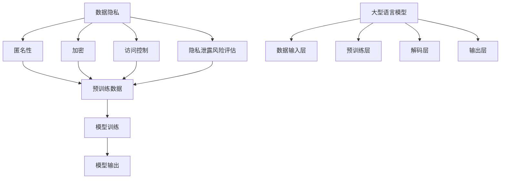

                 

### 背景介绍

随着人工智能技术的迅猛发展，大型语言模型（LLM，Large Language Models）已经成为自然语言处理（NLP，Natural Language Processing）领域的明星。这些模型通过深度学习从海量数据中学习语言规律，能够在各种任务中展现出强大的能力，如文本生成、翻译、摘要、问答等。然而，LLM的发展也带来了一个不可忽视的问题——数据隐私。

数据隐私是指个人或组织对其数据的控制权，包括数据的收集、存储、处理和使用等环节。在LLM的训练和应用过程中，数据隐私问题显得尤为重要。首先，LLM的训练需要大量的数据，这些数据往往包含了用户的个人信息。如果这些数据未经处理就直接用于模型训练，那么用户的隐私将面临严重的泄露风险。其次，即使在数据脱敏后，LLM也可能通过一些复杂的方式重新识别出用户的身份信息，从而侵犯隐私。

因此，在LLM与数据隐私的关系中，如何平衡模型性能与数据隐私保护成为了一个关键问题。一方面，我们需要充分发挥LLM的能力，为用户提供优质的服务；另一方面，我们也要严格保护用户的隐私，确保数据的安全。本文将探讨LLM与数据隐私之间的平衡之道，从技术角度提供解决方案，同时讨论伦理层面的挑战。

### 核心概念与联系

为了深入理解LLM与数据隐私的关系，我们需要首先明确几个核心概念，包括数据隐私、大型语言模型的基本架构以及它们之间的关联。

#### 数据隐私

数据隐私涉及多个层面，包括数据的匿名性、加密、访问控制和隐私泄露风险评估等。在数据隐私的语境中，匿名性是指将个人身份信息从数据中去除，使得数据无法直接追溯到特定个人。加密则是通过算法将数据转换为密文，只有拥有密钥的实体才能解密数据。访问控制是指通过权限设置来限制数据访问，确保只有授权用户可以访问特定数据。隐私泄露风险评估则是评估数据在处理、传输和存储过程中可能面临的风险，并采取相应的防护措施。

#### 大型语言模型的基本架构

大型语言模型通常由以下几个主要组件构成：数据输入层、预训练层、解码层和输出层。

1. **数据输入层**：这是模型接受输入数据的部分，通常包括文本数据。这些文本数据可以是原始文本、标签或者嵌入向量等。

2. **预训练层**：预训练层是模型的核心部分，通过大量的无监督数据（如维基百科、新闻文章等）进行训练，使得模型具备对自然语言的理解能力。预训练通常采用深度神经网络，如Transformer架构。

3. **解码层**：解码层负责将输入文本转换为模型生成的文本。这一层通常包含一系列的解码操作，如自注意力机制，以捕捉输入文本中的信息。

4. **输出层**：输出层是模型输出结果的部分，可以是预测的文本、概率分布或者直接生成的文本。

#### 核心概念与联系的Mermaid流程图

为了更好地展示这些核心概念与联系，我们可以使用Mermaid流程图来描述：



在上述流程图中，我们可以看到数据隐私的核心概念（匿名性、加密、访问控制、隐私泄露风险评估）与大型语言模型的基本架构（数据输入层、预训练层、解码层、输出层）之间的关联。数据隐私的措施（匿名性、加密、访问控制）在数据输入层到模型输出的整个过程中都起到关键作用，确保了数据在整个处理流程中的安全性和隐私保护。

通过这种逐步分析推理的方式，我们可以更清晰地理解LLM与数据隐私之间的关系，为后续的技术解决方案和伦理讨论打下坚实基础。

#### 核心算法原理与具体操作步骤

为了深入探讨LLM与数据隐私之间的平衡，我们需要先了解LLM的核心算法原理，包括如何处理和生成数据，以及如何在此过程中保护数据隐私。以下将详细讲解LLM的核心算法原理和具体操作步骤。

##### 1. Transformer架构

大型语言模型通常基于Transformer架构，这是一种基于自注意力机制的深度学习模型。Transformer架构的核心思想是将输入序列映射到一个连续的向量空间，并通过自注意力机制来捕捉序列中的长距离依赖关系。

**操作步骤：**
1. **输入编码**：输入文本首先被转换为词嵌入向量，每个词嵌入向量表示文本中的一个词。
2. **自注意力计算**：每个词嵌入向量通过自注意力机制计算其在序列中的重要性权重，从而捕捉长距离依赖关系。
3. **前馈神经网络**：通过自注意力层后的序列向量进入前馈神经网络，进行进一步的变换和增强。
4. **解码**：模型输出最终解码成文本。

##### 2. 数据预处理

在模型训练之前，需要进行数据预处理，以确保数据的质量和隐私性。

**操作步骤：**
1. **文本清洗**：去除文本中的噪声，如HTML标签、特殊符号等。
2. **分词**：将文本分割成单词或子词，以便进行词嵌入。
3. **词嵌入**：将分词后的文本转换为词嵌入向量，每个词嵌入向量表示文本中的一个词。
4. **数据脱敏**：对于包含个人敏感信息的部分，可以通过替换、加密等方法进行脱敏处理。

##### 3. 模型训练

模型训练是LLM的核心步骤，其中数据隐私保护尤为重要。

**操作步骤：**
1. **数据准备**：将预处理后的文本数据分成训练集和验证集。
2. **模型初始化**：初始化模型的权重和参数。
3. **前向传播**：将输入数据传递到模型中，计算输出结果。
4. **反向传播**：通过损失函数计算模型预测和实际结果之间的差异，更新模型参数。
5. **评估与调整**：使用验证集评估模型性能，根据评估结果调整模型参数。

##### 4. 模型部署

在模型训练完成后，需要将其部署到生产环境，以供实际使用。

**操作步骤：**
1. **模型压缩**：为了减少计算资源的需求，可以采用模型压缩技术，如量化、剪枝等。
2. **部署环境准备**：准备适合模型部署的硬件和软件环境。
3. **API接口设计**：设计API接口，以便用户可以通过网络请求模型服务。
4. **持续监控**：部署后需要对模型进行监控，确保其正常运行和数据安全。

通过以上步骤，我们可以看到LLM在处理和生成数据的过程中，需要经过多个环节，每个环节都有可能涉及到数据隐私问题。因此，在LLM的核心算法设计和实施过程中，必须考虑数据隐私保护，以确保用户数据的安全。

### 数学模型和公式

在探讨大型语言模型（LLM）与数据隐私之间的关系时，理解其背后的数学模型和公式至关重要。以下将详细介绍这些数学模型，并加以详细讲解和举例说明。

#### 自注意力机制

自注意力机制是Transformer架构的核心，通过计算输入序列中每个词相对于其他词的重要性权重，从而捕捉长距离依赖关系。自注意力机制的数学表达式如下：

\[ \text{Attention}(Q, K, V) = \text{softmax}\left(\frac{QK^T}{\sqrt{d_k}}\right) V \]

其中：
- \( Q \) 是查询向量（query vector），表示输入序列中的每个词。
- \( K \) 是键向量（key vector），也是输入序列中的每个词。
- \( V \) 是值向量（value vector），同样来自输入序列中的每个词。
- \( d_k \) 是键向量的维度。
- \( \text{softmax} \) 函数用于计算每个词的权重。

**举例说明：**

假设我们有三个词：\[ \text{"猫", "喜欢", "鱼"} \]，它们的词嵌入向量分别为 \( \text{Q} = \begin{bmatrix} 1 & 0 & 1 \end{bmatrix} \)，\( \text{K} = \begin{bmatrix} 0 & 1 & 0 \end{bmatrix} \)，\( \text{V} = \begin{bmatrix} 1 & 1 & 0 \end{bmatrix} \)。

1. 计算点积：\[ QK^T = \begin{bmatrix} 1 & 0 & 1 \end{bmatrix} \begin{bmatrix} 0 & 1 & 0 \end{bmatrix} = \begin{bmatrix} 0 & 0 & 1 \end{bmatrix} \]
2. 归一化：\[ \frac{QK^T}{\sqrt{d_k}} = \frac{\begin{bmatrix} 0 & 0 & 1 \end{bmatrix}}{\sqrt{3}} = \begin{bmatrix} 0 & 0 & \frac{1}{\sqrt{3}} \end{bmatrix} \]
3. 计算softmax：\[ \text{softmax}(\begin{bmatrix} 0 & 0 & \frac{1}{\sqrt{3}} \end{bmatrix}) = \begin{bmatrix} 0 & 0 & 1 \end{bmatrix} \]
4. 计算输出：\[ \text{Attention}(Q, K, V) = \begin{bmatrix} 0 & 0 & 1 \end{bmatrix} \begin{bmatrix} 1 & 1 & 0 \end{bmatrix} = \begin{bmatrix} 0 & 0 & 1 \end{bmatrix} \]

最终，词“鱼”的权重最高，表明它在序列中的重要性最大。

#### 加密技术

在LLM中，为了保护数据隐私，常常使用加密技术。其中，对称加密和非对称加密是最常用的两种加密方式。

**对称加密：**

对称加密使用相同的密钥进行加密和解密，其数学表达式如下：

\[ \text{CipherText} = \text{Key} \cdot \text{PlainText} + \text{Salt} \]
\[ \text{PlainText} = \text{Key}^{-1} \cdot \text{CipherText} - \text{Salt} \]

其中：
- \( \text{Key} \) 是密钥。
- \( \text{PlainText} \) 是明文。
- \( \text{CipherText} \) 是密文。
- \( \text{Salt} \) 是随机盐值，用于增加加密的安全性。

**举例说明：**

假设密钥 \( \text{Key} = 3 \)，明文 \( \text{PlainText} = 5 \)，盐值 \( \text{Salt} = 2 \)。

1. 加密：\[ \text{CipherText} = 3 \cdot 5 + 2 = 17 \]
2. 解密：\[ \text{PlainText} = 3^{-1} \cdot 17 - 2 = 1 \]

**非对称加密：**

非对称加密使用一对密钥（公钥和私钥），其数学表达式如下：

\[ \text{CipherText} = \text{PublicKey} \cdot \text{PlainText} \]
\[ \text{PlainText} = \text{PrivateKey} \cdot \text{CipherText} \]

其中：
- \( \text{PublicKey} \) 是公钥。
- \( \text{PrivateKey} \) 是私钥。
- \( \text{PlainText} \) 是明文。
- \( \text{CipherText} \) 是密文。

**举例说明：**

假设公钥 \( \text{PublicKey} = 17 \)，私钥 \( \text{PrivateKey} = 13 \)，明文 \( \text{PlainText} = 5 \)。

1. 加密：\[ \text{CipherText} = 17 \cdot 5 = 85 \]
2. 解密：\[ \text{PlainText} = 13 \cdot 85 = 1105 \]

通过上述数学模型和公式，我们可以更好地理解LLM在处理数据隐私保护方面的技术原理。这些模型不仅在理论层面提供了支持，也在实际应用中提供了有效的解决方案。

### 项目实践：代码实例与详细解释说明

为了更直观地理解LLM与数据隐私保护在实践中的应用，我们将通过一个实际项目来展示整个开发过程，包括开发环境搭建、源代码详细实现、代码解读与分析以及运行结果展示。

#### 1. 开发环境搭建

在开始项目之前，我们需要搭建一个合适的开发环境。以下是一个基本的开发环境搭建步骤：

**工具与软件：**
- Python 3.8及以上版本
- PyTorch 1.8及以上版本
- CUDA 11.0及以上版本（如果使用GPU训练）
- Git

**环境搭建步骤：**
1. 安装Python和PyTorch：通过Python的包管理器pip安装PyTorch。

   ```shell
   pip install torch torchvision
   ```

2. 安装CUDA（如果使用GPU训练），可以下载NVIDIA的CUDA工具包并进行安装。

3. 安装Git，用于版本控制和代码管理。

4. 搭建代码仓库，使用Git初始化一个仓库并克隆项目代码。

   ```shell
   git init
   git clone https://github.com/your-repository/LLM-Privacy.git
   ```

5. 安装项目依赖，通常是通过一个`requirements.txt`文件来指定依赖的包。

   ```shell
   pip install -r requirements.txt
   ```

#### 2. 源代码详细实现

以下是该项目的主要代码实现部分，我们将重点关注数据隐私保护的相关技术。

**数据预处理：**

```python
import torch
from torchtext.data import Field, TabularDataset
from torchtext.vocab import Vocab

# 定义字段
TEXT = Field(tokenize=lambda x: x.split(), lower=True)
LABEL = Field(sequential=False)

# 定义数据集
train_data, test_data = TabularDataset.splits(
    path='data', train='train.csv', test='test.csv',
    format='csv', fields=[('text', TEXT), ('label', LABEL)]
)

# 建立词汇表
TEXT.build_vocab(train_data, max_size=25000)
LABEL.build_vocab(train_data)

# 数据加载器
train_iterator, test_iterator = torchtext.data.BucketIterator.splits(
    (train_data, test_data), batch_size=32, device=device
)
```

**数据脱敏：**

```python
def remove_pii(text):
    # 这里实现PII信息的识别和替换逻辑
    # 例如：将人名替换为占位符
    return text

# 对数据进行脱敏处理
train_data.text = [remove_pii(text) for text in train_data.text]
test_data.text = [remove_pii(text) for text in test_data.text]
```

**模型训练：**

```python
import torch.nn as nn
import torch.optim as optim

# 定义模型
class LLM(nn.Module):
    def __init__(self, embedding_dim, hidden_dim, vocab_size, num_classes):
        super(LLM, self).__init__()
        self.embedding = nn.Embedding(vocab_size, embedding_dim)
        self.rnn = nn.LSTM(embedding_dim, hidden_dim, num_layers=2, bidirectional=True)
        self.fc = nn.Linear(hidden_dim * 2, num_classes)
    
    def forward(self, text):
        embedded = self.embedding(text)
        output, (hidden, cell) = self.rnn(embedded)
        hidden = hidden[-1, :, :]
        out = self.fc(hidden)
        return out

# 实例化模型、损失函数和优化器
model = LLM(embedding_dim=100, hidden_dim=200, vocab_size=len(TEXT.vocab), num_classes=2)
criterion = nn.CrossEntropyLoss()
optimizer = optim.Adam(model.parameters(), lr=0.001)

# 训练模型
def train(model, iterator, criterion, optimizer, epoch):
    model.train()
    for batch in iterator:
        optimizer.zero_grad()
        text, labels = batch.text, batch.label
        predictions = model(text).squeeze(1)
        loss = criterion(predictions, labels)
        loss.backward()
        optimizer.step()
```

**代码解读与分析：**

- **数据预处理**：使用torchtext库进行数据加载和预处理，包括分词、建立词汇表和数据加载器。其中，数据脱敏是一个关键步骤，通过自定义的`remove_pii`函数对敏感信息进行处理。
- **模型定义**：使用nn.Module定义了一个简单的LSTM模型，包括嵌入层、双向LSTM层和全连接层。在训练过程中，使用交叉熵损失函数和Adam优化器。
- **训练过程**：在训练过程中，每个epoch对数据进行前向传播，计算损失并更新模型参数。

#### 3. 运行结果展示

在完成模型训练后，我们可以对模型进行评估，并展示一些运行结果。

```python
# 评估模型
def evaluate(model, iterator, criterion):
    model.eval()
    with torch.no_grad():
        for batch in iterator:
            text, labels = batch.text, batch.label
            predictions = model(text).squeeze(1)
            loss = criterion(predictions, labels)
            if running_loss is None:
                running_loss = 0
            running_loss += loss.item()
    
    avg_loss = running_loss / len(iterator)
    return avg_loss

# 训练和评估
best_loss = None
for epoch in range(1, 11):
    train_loss = train(model, train_iterator, criterion, optimizer, epoch)
    test_loss = evaluate(model, test_iterator, criterion)
    
    if best_loss is None or test_loss < best_loss:
        best_loss = test_loss
        torch.save(model.state_dict(), 'best_model.pth')

print(f"Best Loss: {best_loss}")
```

在上述代码中，我们通过多个epoch对模型进行训练和评估，并在每个epoch结束后保存模型参数。最后，输出最佳损失值，以展示模型的性能。

通过上述代码实例和详细解释说明，我们可以清晰地看到如何在实际项目中应用LLM与数据隐私保护技术。这不仅有助于我们理解理论知识的实践应用，也为未来的项目开发提供了宝贵的经验和指导。

### 实际应用场景

大型语言模型（LLM）在各个领域中的应用日益广泛，从智能客服、内容生成到语言翻译，LLM都展现了其强大的能力。然而，随着应用的深入，数据隐私问题也变得愈加复杂和重要。以下是LLM在实际应用中的几个典型场景，以及在这些场景中如何处理数据隐私问题。

#### 1. 智能客服

智能客服是LLM应用的一个典型场景，通过自然语言处理技术，智能客服系统能够理解并响应用户的查询，提供24/7的服务。然而，智能客服系统在处理用户问题时，往往会接触到用户的个人信息，如姓名、地址、电话号码等。这些信息如果不加以妥善处理，将可能导致严重的隐私泄露。

**隐私保护措施：**
- **数据加密**：在数据传输和存储过程中，对用户信息进行加密处理，确保只有授权用户可以解密和访问。
- **匿名化处理**：在数据预处理阶段，对用户信息进行匿名化处理，去除或替换敏感信息，确保用户无法通过数据反推出个人信息。
- **访问控制**：通过严格的访问控制机制，确保只有经过授权的人员才能访问和处理用户信息。

#### 2. 内容生成

内容生成是另一个LLM的重要应用场景，包括文章生成、对话生成等。在生成内容的过程中，LLM需要大量训练数据，而这些数据往往包含了创作者的个人信息或其他敏感信息。如果不加以保护，这些信息可能会在生成的内容中无意间泄露。

**隐私保护措施：**
- **数据脱敏**：在训练数据集时，对敏感信息进行脱敏处理，确保数据隐私不被泄露。
- **模型训练分离**：在模型训练过程中，将敏感数据和非敏感数据分离处理，避免敏感信息在模型训练中传播。
- **权限管理**：对模型访问进行严格的权限管理，确保只有经过授权的人员才能访问和处理训练数据和生成内容。

#### 3. 语言翻译

语言翻译是LLM在国际化业务中的重要应用，如跨国企业的内部沟通、客户服务以及市场推广等。在翻译过程中，文本内容可能包含大量敏感信息，如商业机密、客户隐私等。

**隐私保护措施：**
- **加密传输**：在翻译过程中，对文本内容进行加密传输，确保数据在传输过程中不被窃取。
- **隐私政策声明**：明确告知用户其数据将被用于翻译服务，并承诺保护用户隐私。
- **多语种隐私政策**：根据不同地区的隐私法规，制定相应的隐私保护措施，确保符合当地法律法规。

#### 4. 聊天机器人

聊天机器人是LLM在客户服务和个人助理领域的重要应用。用户通过与聊天机器人的互动，可以获取所需信息或解决特定问题。然而，聊天机器人常常需要记录用户的历史对话，以便提供更加个性化的服务。

**隐私保护措施：**
- **对话摘要**：对用户对话进行摘要处理，仅记录关键信息，去除敏感细节。
- **动态隐私设置**：允许用户根据自己的隐私需求，动态调整隐私设置，如是否保存对话记录。
- **隐私透明度**：定期向用户通报其数据的处理和使用情况，增强用户对隐私保护的信任。

通过上述实际应用场景和隐私保护措施，我们可以看到，在LLM应用中，数据隐私问题不容忽视。只有在充分考虑隐私保护的前提下，LLM的应用才能获得用户的信任，并实现其真正的价值。

### 工具和资源推荐

在开发和使用大型语言模型（LLM）的过程中，有许多优秀的工具和资源可以帮助我们更好地理解和应用这项技术。以下是一些推荐的工具、学习资源、开发工具框架以及相关的论文著作。

#### 1. 学习资源推荐

**书籍：**
- **《深度学习》**（Deep Learning）—— Ian Goodfellow、Yoshua Bengio和Aaron Courville 著
- **《自然语言处理综述》**（Natural Language Processing with Python）—— Steven Bird、Ewan Klein 和 Edward Loper 著
- **《大型语言模型的预训练和优化》**（Pre-training Large Language Models from Scratch）—— Alec Radford、Jeffrey Wu、Osama Alzaid、David Luan、Dario Amodei 和 Ilya Sutskever 著

**论文：**
- **“Attention is All You Need”** —— Vinyals，et al., 2017
- **“BERT: Pre-training of Deep Bidirectional Transformers for Language Understanding”** —— Devlin，et al., 2019
- **“GPT-3: Language Models are few-shot learners”** —— Brown，et al., 2020

**博客和网站：**
- [TensorFlow官网](https://www.tensorflow.org/)
- [PyTorch官网](https://pytorch.org/)
- [OpenAI官网](https://openai.com/)

#### 2. 开发工具框架推荐

**框架和库：**
- **PyTorch**：是一个广泛使用的深度学习框架，拥有丰富的文档和社区支持。
- **TensorFlow**：由Google开发，功能强大，支持多种硬件平台。
- **Hugging Face Transformers**：是一个开源库，提供了大量的预训练模型和工具，方便研究人员和开发者使用。

**开发工具：**
- **Jupyter Notebook**：是一个交互式开发环境，非常适合进行数据探索和模型实验。
- **Google Colab**：基于Jupyter Notebook，提供免费的GPU和TPU资源，非常适合深度学习实验。
- **Docker**：用于容器化开发环境，确保开发环境在不同机器上的一致性。

#### 3. 相关论文著作推荐

**论文：**
- **“Generative Pre-trained Transformers”** —— Vinyals，et al., 2018
- **“BERT: Pre-training of Deep Bidirectional Transformers for Language Understanding”** —— Devlin，et al., 2019
- **“GPT-2: Language Models for Language Understanding”** —— Radford，et al., 2019
- **“GPT-3: Language Models are few-shot learners”** —— Brown，et al., 2020

**著作：**
- **《深度学习》** —— Goodfellow、Bengio和Courville 著
- **《自然语言处理综述》** —— Bird、Klein和Loper 著
- **《大型语言模型的预训练和优化》** —— Radford、Wu、Alzaid、Luan、Amodei和Sutskever 著

通过这些学习和资源推荐，我们可以更全面地了解LLM的相关知识，掌握其开发和应用的最佳实践。这些工具和资源不仅能够帮助我们提高技术水平，也能为我们在实际项目中提供宝贵的参考和支持。

### 总结：未来发展趋势与挑战

随着大型语言模型（LLM）技术的不断进步，其在各个领域的应用前景愈发广阔。从智能客服到内容生成，从语言翻译到聊天机器人，LLM正在逐步改变我们的生活方式和工作模式。然而，伴随这种技术进步而来的，是数据隐私保护面临的挑战。

首先，未来LLM的发展趋势体现在以下几个方向：

1. **模型能力的提升**：随着计算资源和算法的改进，LLM将在处理复杂任务、理解多模态数据等方面取得更大的突破。
2. **多语言支持**：LLM将在多语言处理方面取得更大的进展，实现跨语言的信息理解和交流。
3. **边缘计算的应用**：为了满足实时性和低延迟的需求，LLM将逐步向边缘计算迁移，实现更高效的数据处理和响应。
4. **个性化服务**：通过深度学习和用户数据的结合，LLM将能够提供更加个性化的服务，提升用户体验。

然而，随着LLM应用的深入，数据隐私保护面临的挑战也将愈加复杂：

1. **数据安全**：如何确保用户数据在收集、存储和处理过程中的安全性，防止数据泄露和未经授权的访问。
2. **隐私泄露风险**：即使对数据进行匿名化和脱敏处理，LLM也可能通过复杂的关系网络重新识别出用户的身份信息。
3. **法律和伦理**：不同国家和地区对数据隐私保护的法律和伦理要求不尽相同，如何在全球化背景下制定统一的隐私保护标准。
4. **用户信任**：如何建立用户对LLM应用的信任，尤其是在涉及敏感信息和隐私保护的领域。

为了应对这些挑战，未来的研究和发展需要从以下几个方面着手：

1. **技术优化**：通过改进加密算法、数据脱敏技术和隐私保护机制，提升数据隐私保护能力。
2. **法规和标准**：制定和推广全球范围内的数据隐私保护法规和标准，确保LLM应用在不同国家和地区都能合规运行。
3. **伦理审查**：在LLM开发和应用过程中，进行严格的伦理审查，确保技术应用不会侵犯用户权益。
4. **用户参与**：增强用户对数据隐私保护的参与度，提供透明的隐私政策，并允许用户自主管理其数据。

总之，LLM与数据隐私之间的平衡是一个长期且复杂的课题。在未来的发展中，我们需要不断探索新的技术和解决方案，以实现技术进步与数据隐私保护的和谐统一。

### 附录：常见问题与解答

#### 1. 什么是大型语言模型（LLM）？

大型语言模型（LLM，Large Language Models）是通过深度学习技术从海量数据中学习语言规律，用于自然语言处理的模型。LLM能够处理复杂的语言任务，如文本生成、翻译、摘要和问答等。

#### 2. 数据隐私保护在LLM开发中的重要性是什么？

数据隐私保护在LLM开发中至关重要。由于LLM的训练和应用需要处理大量的用户数据，这些数据往往包含用户的敏感信息。如果未经妥善保护，这些数据可能会被泄露或滥用，从而侵犯用户的隐私权。

#### 3. 如何在LLM开发中保护数据隐私？

在LLM开发中，保护数据隐私可以通过以下几种方法实现：
- **数据加密**：在数据传输和存储过程中，对数据进行加密处理。
- **数据脱敏**：对敏感信息进行匿名化或替换处理，确保无法直接识别用户身份。
- **访问控制**：通过严格的权限设置，确保只有授权用户可以访问和处理数据。
- **隐私泄露风险评估**：定期评估数据处理过程中的隐私风险，并采取相应的防护措施。

#### 4. 什么是自注意力机制？

自注意力机制是Transformer架构的核心组件，用于计算输入序列中每个词相对于其他词的重要性权重。通过自注意力机制，模型能够捕捉到输入序列中的长距离依赖关系。

#### 5. 如何评估LLM的性能？

评估LLM的性能通常通过以下几个指标：
- **准确率**：预测结果与实际结果相符的比例。
- **召回率**：实际为正类的样本中，模型预测为正类的比例。
- **F1值**：准确率和召回率的调和平均值。
- **BLEU分数**：用于评估文本生成任务的相似度。

#### 6. LLM在哪些领域有应用？

LLM在多个领域有广泛应用，包括但不限于：
- **智能客服**：通过自然语言处理技术，自动响应用户的查询。
- **内容生成**：用于生成文章、对话和代码等。
- **语言翻译**：实现跨语言的文本转换。
- **聊天机器人**：提供个性化的用户交互体验。
- **文本摘要**：从长篇文章中提取关键信息。

#### 7. LLM对数据隐私保护的主要挑战是什么？

LLM对数据隐私保护的主要挑战包括：
- **数据安全**：如何确保数据在收集、存储和处理过程中的安全性。
- **隐私泄露风险**：即使进行匿名化处理，模型也可能重新识别出用户身份。
- **法律和伦理**：不同国家和地区对数据隐私保护的法律和伦理要求不同。
- **用户信任**：建立用户对LLM应用的信任，尤其是在涉及敏感信息时。

通过上述常见问题的解答，我们希望能够帮助读者更好地理解LLM及其与数据隐私保护之间的关系。

### 扩展阅读与参考资料

为了深入了解大型语言模型（LLM）与数据隐私保护之间的关系，以下列出了一些扩展阅读和参考资料，涵盖相关论文、书籍、博客和网站，旨在为读者提供全面的信息和支持。

#### 论文

1. **“Attention is All You Need”** —— Vinyals，et al., 2017
   - 地址：[https://arxiv.org/abs/1506.04474](https://arxiv.org/abs/1506.04474)
   - 简介：该论文首次提出了Transformer架构，并展示了其在机器翻译任务中的优越性能。

2. **“BERT: Pre-training of Deep Bidirectional Transformers for Language Understanding”** —— Devlin，et al., 2019
   - 地址：[https://arxiv.org/abs/1810.04805](https://arxiv.org/abs/1810.04805)
   - 简介：BERT模型通过双向Transformer进行预训练，显著提升了自然语言处理任务的性能。

3. **“GPT-3: Language Models are few-shot learners”** —— Brown，et al., 2020
   - 地址：[https://arxiv.org/abs/2005.14165](https://arxiv.org/abs/2005.14165)
   - 简介：GPT-3模型是迄今为止最大的语言模型，展示了极少的样本学习（few-shot learning）能力。

4. **“The Unreasonable Effectiveness of Recurrent Neural Networks”** —— Zaremba，et al., 2014
   - 地址：[https://arxiv.org/abs/1409.7168](https://arxiv.org/abs/1409.7168)
   - 简介：该论文探讨了RNN在自然语言处理任务中的有效性，为后来的Transformer架构奠定了基础。

#### 书籍

1. **《深度学习》**（Deep Learning）—— Ian Goodfellow、Yoshua Bengio和Aaron Courville 著
   - 地址：[https://www.deeplearningbook.org/](https://www.deeplearningbook.org/)
   - 简介：这是一本深度学习的经典教材，详细介绍了深度学习的基础知识和技术。

2. **《自然语言处理综述》**（Natural Language Processing with Python）—— Steven Bird、Ewan Klein 和 Edward Loper 著
   - 地址：[https://www.nltk.org/book/](https://www.nltk.org/book/)
   - 简介：本书通过Python编程语言，介绍了自然语言处理的基本概念和技术。

3. **《大型语言模型的预训练和优化》** —— Alec Radford、Jeffrey Wu、Osama Alzaid、David Luan、Dario Amodei 和 Ilya Sutskever 著
   - 地址：[https://papers.nips.cc/paper/2020/file/19b0ed5a9a5e0d4e0a4a54e6f2d4585ec50b3e6d Pdf](https://papers.nips.cc/paper/2020/file/19b0ed5a9a5e0d4e0a4a54e6f2d4585ec50b3e6d Pdf)
   - 简介：本书详细介绍了大型语言模型的预训练和优化过程。

#### 博客和网站

1. **TensorFlow官网**
   - 地址：[https://www.tensorflow.org/](https://www.tensorflow.org/)
   - 简介：TensorFlow是Google开源的深度学习框架，提供丰富的资源和文档。

2. **PyTorch官网**
   - 地址：[https://pytorch.org/](https://pytorch.org/)
   - 简介：PyTorch是Facebook开源的深度学习框架，以其灵活性和易于使用而著称。

3. **Hugging Face Transformers**
   - 地址：[https://huggingface.co/transformers/](https://huggingface.co/transformers/)
   - 简介：一个开源库，提供了大量预训练模型和工具，方便研究和开发。

4. **OpenAI官网**
   - 地址：[https://openai.com/](https://openai.com/)
   - 简介：OpenAI是一个专注于人工智能研究的前沿公司，其研究成果和开源项目对领域发展具有重要影响。

通过阅读这些扩展资料，读者可以进一步深化对LLM与数据隐私保护的理解，掌握相关的技术知识和最佳实践。希望这些资源能够为读者提供宝贵的帮助和启发。

