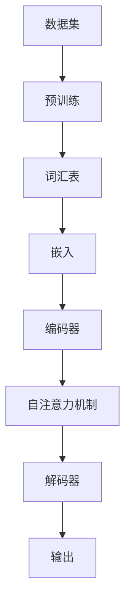

                 

### 1. 背景介绍

随着人工智能（AI）技术的快速发展，Large Language Model（LLM），如GPT、BERT等，已经成为自然语言处理（NLP）领域的核心工具。这些模型不仅在学术研究上取得了重大突破，还在实际应用中展现了巨大的潜力。从搜索引擎到智能助手，从机器翻译到文本生成，LLM的应用场景已经越来越广泛。然而，LLM的复杂性和计算需求也使其成为当前AI领域最具挑战性的课题之一。

本篇文章将深入探讨LLM的内核设计，旨在为读者提供一个全面而清晰的视角，以理解这些强大模型的构建原理和运行机制。文章首先将介绍LLM的发展历程，梳理其在不同应用场景中的优势和挑战。随后，我们将详细阐述LLM的核心概念，包括其基本架构、关键组件和运行流程。在此基础上，文章将探讨LLM的核心算法原理，分析其训练和预测的具体步骤。此外，为了更直观地理解LLM的工作机制，文章还将介绍数学模型和公式，并通过实际项目实践进行代码实例展示。最后，文章将探讨LLM的实际应用场景，推荐相关的工具和资源，并对未来发展趋势和挑战进行总结。

本文结构如下：

- **背景介绍**：概述LLM的发展历程和当前应用现状。
- **核心概念与联系**：介绍LLM的基本架构和核心组件，并附上流程图。
- **核心算法原理 & 具体操作步骤**：详细分析LLM的训练和预测过程。
- **数学模型和公式 & 详细讲解 & 举例说明**：介绍支持LLM工作的数学基础。
- **项目实践：代码实例和详细解释说明**：通过实际代码展示LLM的应用。
- **实际应用场景**：探讨LLM在不同领域的应用。
- **工具和资源推荐**：推荐学习资料和开发工具。
- **总结：未来发展趋势与挑战**：总结LLM的发展方向和面临的挑战。
- **附录：常见问题与解答**：解答读者可能关心的问题。
- **扩展阅读 & 参考资料**：提供进一步的阅读建议和参考资料。

在接下来的章节中，我们将一步步深入探讨这些内容，帮助读者全面理解LLM的内核设计。

### 1. 背景介绍

#### LLM的发展历程

LLM的发展历程可以追溯到20世纪80年代。当时，研究人员开始探索如何让计算机理解和生成自然语言。早期的模型如基于规则的方法和统计方法，虽然能够处理一些简单的任务，但在面对复杂语言现象时显得力不从心。随着计算能力的提升和大数据的涌现，深度学习技术逐渐成熟，并在自然语言处理领域取得了显著成果。2018年，OpenAI发布了GPT模型，标志着LLM时代的到来。GPT模型通过大规模预训练和微调，展现了强大的语言理解和生成能力，迅速引起了学术界和工业界的广泛关注。

随后，各种改进和扩展模型相继推出，如GPT-2、GPT-3、BERT、T5等。这些模型不仅在语言理解、文本生成、机器翻译等方面取得了突破，还在情感分析、问答系统、对话系统等任务中表现出色。特别是GPT-3，其参数规模达到了1750亿，能够生成高质量的文本，甚至可以完成编程任务、创作音乐和绘画。这一系列突破证明了LLM在自然语言处理领域的巨大潜力。

#### LLM的应用现状

LLM的应用现状可谓如火如荼。在学术研究领域，LLM为自然语言处理的研究提供了强大的工具，使得许多原本复杂的问题得以简化。例如，通过LLM，研究人员能够快速生成大量的训练数据，从而提高模型的性能。此外，LLM还被用于文本摘要、情感分析、实体识别等任务，显著提高了这些任务的准确性和效率。

在工业界，LLM的应用场景更加广泛。例如，在搜索引擎领域，LLM被用于生成搜索结果的相关性排序，从而提供更精准的搜索体验。在智能助手领域，LLM被用于理解和生成用户的自然语言查询，使得助手能够更自然地与用户互动。在机器翻译领域，LLM已经取代了传统的方法，成为生成高质量翻译的主要工具。

然而，LLM的应用也带来了一系列挑战。首先是计算资源的消耗。LLM模型通常需要大量的计算资源和存储空间，这对基础设施提出了更高的要求。其次是数据隐私和安全问题。由于LLM需要大量训练数据，这些数据可能包含敏感信息，如何在确保数据隐私和安全的前提下进行数据处理，是一个亟待解决的问题。最后是模型的可解释性和透明性。当前许多LLM模型被视为“黑盒”，其内部工作原理不透明，这可能导致模型的决策过程缺乏解释性和可靠性。

#### LLM的优势与挑战

LLM的优势主要体现在以下几个方面：

1. **强大的语言理解能力**：LLM能够从大规模的文本数据中学习，从而具备强大的语言理解能力。这使得LLM在处理自然语言任务时，能够生成更符合人类语言的文本。
   
2. **灵活的应用场景**：LLM可以应用于各种自然语言处理任务，如文本分类、命名实体识别、机器翻译、文本生成等。这种灵活性使得LLM能够快速适应不同的应用场景。

3. **高效的计算效率**：随着深度学习技术的进步，LLM的计算效率得到了显著提升。虽然大型LLM模型仍然需要大量的计算资源，但优化算法和硬件设备的进步使得其应用变得可行。

然而，LLM也面临着一些挑战：

1. **计算资源消耗**：大型LLM模型需要大量的计算资源和存储空间，这对基础设施提出了更高的要求。

2. **数据隐私和安全问题**：LLM需要大量训练数据，这些数据可能包含敏感信息，如何确保数据隐私和安全是一个重要问题。

3. **模型可解释性**：当前许多LLM模型被视为“黑盒”，其内部工作原理不透明，这可能导致模型的决策过程缺乏解释性和可靠性。

4. **模型偏见**：LLM在训练过程中可能学习到数据中的偏见，这可能导致模型在某些任务上的表现不公正。

总的来说，LLM在自然语言处理领域展现出了巨大的潜力，但同时也面临着一系列挑战。在接下来的章节中，我们将深入探讨LLM的内核设计，以更全面地理解这些模型的构建原理和运行机制。

#### 关键概念与联系

为了深入理解LLM的内核设计，我们需要先掌握一些关键概念和它们之间的关系。以下是对LLM核心概念的基本介绍和它们之间的联系：

##### 数据集（Dataset）

数据集是LLM训练和评估的基础。一个高质量的数据集需要包含丰富多样的文本内容，以便模型能够学习到不同语言现象的规律。常用的数据集包括Common Crawl、维基百科、新闻文章、对话数据等。

##### 预训练（Pre-training）

预训练是LLM的核心步骤之一。在预训练过程中，模型在大规模数据集上进行无监督学习，从而学习到语言的一般规律和特征。预训练有助于提高模型的语言理解和生成能力，是LLM能够胜任各种自然语言任务的基础。

##### 微调（Fine-tuning）

微调是在预训练的基础上，针对特定任务进行的有监督学习。通过微调，模型能够适应特定的应用场景，从而在特定任务上取得更好的性能。微调通常需要较少的数据，但需要对模型进行适当的调整，以提高其在特定任务上的表现。

##### 词汇表（Vocabulary）

词汇表是LLM中表示单词和字符的映射表。常用的词汇表如WordPiece、BytePairEncoding（BPE）等，它们通过将单词拆分成子词或字符，来提高模型的表示能力。

##### embedding（嵌入）

嵌入是将单词、字符等符号转化为高维向量表示的过程。通过嵌入，模型可以在向量空间中进行操作，从而更好地理解和生成语言。

##### 自注意力机制（Self-Attention）

自注意力机制是LLM中的一个关键组件。它通过计算不同位置之间的相似性，为每个位置分配不同的权重，从而在模型内部进行特征融合和上下文理解。

##### Transformer模型

Transformer模型是LLM的基础架构。与传统的序列模型（如RNN）不同，Transformer模型采用自注意力机制和多头注意力，实现了对序列的并行处理，从而显著提高了模型的计算效率和性能。

##### 架构（Architecture）

LLM的架构通常包括编码器（Encoder）和解码器（Decoder）。编码器负责将输入序列编码为向量表示，解码器则根据编码器生成的表示生成输出序列。通过编码器和解码器的交互，LLM能够理解和生成自然语言。

##### 流程图

为了更直观地展示LLM的核心概念和架构，我们可以使用Mermaid流程图来绘制它们之间的关系。以下是LLM的基本架构和关键组件的Mermaid流程图：



在这个流程图中，数据集经过预训练后生成词汇表，词汇表再通过嵌入转化为向量表示。编码器负责将输入序列编码为向量表示，解码器则根据编码器生成的表示生成输出序列。

##### 关键概念联系总结

通过上述关键概念的介绍和流程图的展示，我们可以看出，LLM的各个组件和概念之间紧密相连。数据集是模型训练的基础，预训练和微调是提升模型性能的关键步骤，词汇表和嵌入是模型表示的核心，自注意力机制是实现特征融合和上下文理解的关键技术，Transformer模型则是整个架构的基础。通过这些组件的协同工作，LLM能够实现强大的语言理解和生成能力。

在接下来的章节中，我们将进一步探讨LLM的核心算法原理和具体操作步骤，帮助读者更深入地理解LLM的工作机制。

### 3. 核心算法原理 & 具体操作步骤

LLM的核心算法原理基于深度学习和自然语言处理技术，其基础是Transformer模型。下面，我们将详细解释Transformer模型的基本原理，并分步骤介绍LLM的训练和预测过程。

#### Transformer模型的基本原理

Transformer模型是一种基于自注意力机制（Self-Attention）的序列模型，最早由Vaswani等人在2017年提出。与传统的循环神经网络（RNN）和长短期记忆网络（LSTM）不同，Transformer模型采用自注意力机制和多头注意力（Multi-Head Attention）来处理序列数据，实现了对序列的并行处理，从而显著提高了计算效率。

##### 自注意力机制（Self-Attention）

自注意力机制是一种计算输入序列中每个元素与其他元素之间相似性的方法。在Transformer模型中，自注意力机制通过计算输入序列中每个词与其他词的相似性，为每个词分配不同的权重，从而实现特征融合和上下文理解。

自注意力机制的数学表示如下：

\[ \text{Attention}(Q, K, V) = \text{softmax}\left(\frac{QK^T}{\sqrt{d_k}}\right) V \]

其中，\(Q\)、\(K\)、\(V\) 分别是查询向量、键向量和值向量，\(d_k\) 是键向量的维度。通过计算 \(QK^T\) 的点积，得到一个概率分布，然后对概率分布进行softmax操作，最后将结果与 \(V\) 相乘，得到加权求和的结果。

##### 多头注意力（Multi-Head Attention）

多头注意力是自注意力机制的扩展，通过多个独立的注意力机制来捕获不同的上下文信息。在Transformer模型中，多头注意力通过共享底层参数实现多个独立的自注意力机制，从而提高了模型的表示能力。

多头注意力的数学表示如下：

\[ \text{Multi-Head Attention}(Q, K, V) = \text{Concat}(\text{head}_1, \text{head}_2, ..., \text{head}_h)W^O \]

其中，\(h\) 是头数，\(\text{head}_i\) 是第 \(i\) 个注意力头的输出，\(W^O\) 是输出层的权重矩阵。通过多头注意力，模型可以同时关注多个上下文信息，从而更好地捕捉序列的复杂关系。

##### 编码器和解码器

Transformer模型通常包括编码器（Encoder）和解码器（Decoder）。编码器负责将输入序列编码为向量表示，解码器则根据编码器生成的表示生成输出序列。

编码器由多个自注意力层和前馈神经网络层组成。每个自注意力层通过自注意力机制捕获输入序列的上下文信息，前馈神经网络层则对信息进行进一步处理和整合。

解码器由多个多头注意力层、自注意力层和前馈神经网络层组成。多头注意力层用于编码器-解码器之间的交互，自注意力层用于对输出序列进行上下文编码，前馈神经网络层则对信息进行进一步处理和整合。

#### LLM的训练过程

LLM的训练过程主要包括预训练和微调两个阶段。

##### 预训练

预训练是在大规模数据集上进行的无监督学习，旨在使模型学习到语言的一般规律和特征。预训练过程通常包括以下几个步骤：

1. **数据预处理**：首先，对数据集进行清洗和预处理，包括去除停用词、标点符号等无关信息，然后将文本转换为词汇表中的索引表示。

2. **嵌入生成**：通过嵌入层将词汇表中的索引转换为高维向量表示。常用的嵌入方法包括WordPiece、BytePairEncoding（BPE）等。

3. **编码器训练**：对编码器进行训练，使其能够将输入序列编码为向量表示。编码器的训练通常使用自注意力机制和前馈神经网络。

4. **解码器训练**：对解码器进行训练，使其能够根据编码器生成的表示生成输出序列。解码器的训练通常使用多头注意力机制和前馈神经网络。

5. **优化模型**：通过优化算法（如Adam优化器）调整模型参数，使得模型在预训练数据集上的表现不断改进。

##### 微调

微调是在预训练的基础上，针对特定任务进行的有监督学习。微调过程通常包括以下几个步骤：

1. **数据准备**：准备用于微调的任务数据集，并进行预处理和嵌入生成。

2. **模型调整**：将预训练好的模型进行调整，使其适应特定任务。调整方法包括冻结部分参数、调整部分参数等。

3. **训练模型**：对调整后的模型进行训练，使其在特定任务数据集上的表现不断改进。训练过程中，可以使用交叉熵损失函数等评价模型性能。

4. **优化模型**：通过优化算法调整模型参数，使得模型在特定任务上的表现不断改进。

#### LLM的预测过程

LLM的预测过程主要是基于解码器，其目的是根据输入序列生成输出序列。预测过程通常包括以下几个步骤：

1. **输入编码**：将输入序列编码为向量表示，通常使用编码器实现。

2. **生成初始输出**：解码器根据编码器生成的向量表示生成初始输出。初始输出通常是一个随机向量。

3. **迭代生成**：解码器在生成初始输出后，根据生成的内容和编码器生成的向量表示，迭代生成后续输出。每次迭代都使用多头注意力机制和自注意力机制来更新输出。

4. **输出序列**：当生成到终止符或达到最大序列长度时，输出序列生成完成。

通过上述步骤，LLM能够根据输入序列生成相应的输出序列，从而实现语言理解和生成任务。

总的来说，LLM的核心算法原理基于Transformer模型，通过自注意力机制和多头注意力机制，实现了对序列的并行处理和特征融合。在训练过程中，LLM通过预训练和微调学习到语言的一般规律和特征，并在预测过程中根据输入序列生成相应的输出序列。这种机制使得LLM在自然语言处理领域展现了强大的能力。

在接下来的章节中，我们将进一步介绍LLM的数学模型和公式，帮助读者更深入地理解其工作原理。

### 4. 数学模型和公式 & 详细讲解 & 举例说明

#### 4.1 基本概念

在理解LLM的数学模型之前，我们需要首先了解一些基本概念，如向量、矩阵、点积、softmax等。这些概念是构建和解析LLM数学模型的基础。

##### 向量和矩阵

向量是数学中的一个基本概念，它可以表示一个具有多个元素的数组。在LLM中，向量常用于表示文本序列的嵌入、编码和解码。矩阵则是二维数组，用于表示多个向量的组合。在LLM中，矩阵常用于表示权重和变换。

##### 点积

点积（也称为内积）是两个向量之间的数学运算，用于计算两个向量的相似度。其数学公式为：

\[ \text{点积}(a, b) = a \cdot b = \sum_{i=1}^{n} a_i \cdot b_i \]

其中，\(a\) 和 \(b\) 分别是两个向量，\(n\) 是向量的维度。

##### Softmax函数

Softmax函数是一种用于归一化向量的函数，常用于计算概率分布。其数学公式为：

\[ \text{softmax}(x_i) = \frac{e^{x_i}}{\sum_{j=1}^{n} e^{x_j}} \]

其中，\(x_i\) 是向量中的第 \(i\) 个元素，\(n\) 是向量的维度。

#### 4.2 Transformer模型的核心数学模型

Transformer模型的核心数学模型包括自注意力机制（Self-Attention）和多头注意力机制（Multi-Head Attention）。下面，我们将详细解释这些机制的数学公式。

##### 自注意力机制

自注意力机制是Transformer模型中最核心的部分之一。它通过计算输入序列中每个元素与其他元素之间的相似性，为每个元素分配不同的权重，从而实现特征融合和上下文理解。

自注意力机制的数学公式如下：

\[ \text{Attention}(Q, K, V) = \text{softmax}\left(\frac{QK^T}{\sqrt{d_k}}\right) V \]

其中，\(Q\)、\(K\)、\(V\) 分别是查询向量、键向量和值向量，\(d_k\) 是键向量的维度。通过计算 \(QK^T\) 的点积，得到一个概率分布，然后对概率分布进行softmax操作，最后将结果与 \(V\) 相乘，得到加权求和的结果。

##### 多头注意力机制

多头注意力机制是对自注意力机制的扩展。它通过多个独立的注意力机制来捕获不同的上下文信息，从而提高模型的表示能力。

多头注意力机制的数学公式如下：

\[ \text{Multi-Head Attention}(Q, K, V) = \text{Concat}(\text{head}_1, \text{head}_2, ..., \text{head}_h)W^O \]

其中，\(h\) 是头数，\(\text{head}_i\) 是第 \(i\) 个注意力头的输出，\(W^O\) 是输出层的权重矩阵。通过多头注意力，模型可以同时关注多个上下文信息，从而更好地捕捉序列的复杂关系。

#### 4.3 实际举例说明

为了更好地理解这些数学模型，我们通过一个简单的例子来说明自注意力和多头注意力的计算过程。

##### 自注意力计算

假设我们有一个简单的文本序列“[CLS] Hello, world! [SEP]”，其中\[CLS\]表示句子开始，\[SEP\]表示句子结束。我们将这个序列转换为嵌入向量表示，如下所示：

\[ 
Q = \begin{bmatrix} 
q_1 \\
q_2 \\
q_3 \\
\end{bmatrix}, K = \begin{bmatrix} 
k_1 \\
k_2 \\
k_3 \\
\end{bmatrix}, V = \begin{bmatrix} 
v_1 \\
v_2 \\
v_3 \\
\end{bmatrix} 
\]

其中，\(q_1, q_2, q_3\) 分别是查询向量，\(k_1, k_2, k_3\) 分别是键向量，\(v_1, v_2, v_3\) 分别是值向量。

首先，计算点积 \(QK^T\)：

\[ 
QK^T = \begin{bmatrix} 
q_1 \cdot k_1 & q_1 \cdot k_2 & q_1 \cdot k_3 \\
q_2 \cdot k_1 & q_2 \cdot k_2 & q_2 \cdot k_3 \\
q_3 \cdot k_1 & q_3 \cdot k_2 & q_3 \cdot k_3 \\
\end{bmatrix} 
\]

然后，对点积结果进行softmax操作：

\[ 
\text{softmax}(QK^T) = \begin{bmatrix} 
\frac{e^{q_1 \cdot k_1}}{\sum_{j=1}^{3} e^{q_j \cdot k_j}} & \frac{e^{q_1 \cdot k_2}}{\sum_{j=1}^{3} e^{q_j \cdot k_j}} & \frac{e^{q_1 \cdot k_3}}{\sum_{j=1}^{3} e^{q_j \cdot k_j}} \\
\frac{e^{q_2 \cdot k_1}}{\sum_{j=1}^{3} e^{q_j \cdot k_j}} & \frac{e^{q_2 \cdot k_2}}{\sum_{j=1}^{3} e^{q_j \cdot k_j}} & \frac{e^{q_2 \cdot k_3}}{\sum_{j=1}^{3} e^{q_j \cdot k_j}} \\
\frac{e^{q_3 \cdot k_1}}{\sum_{j=1}^{3} e^{q_j \cdot k_j}} & \frac{e^{q_3 \cdot k_2}}{\sum_{j=1}^{3} e^{q_j \cdot k_j}} & \frac{e^{q_3 \cdot k_3}}{\sum_{j=1}^{3} e^{q_j \cdot k_j}} \\
\end{bmatrix} 
\]

最后，将softmax操作的结果与 \(V\) 相乘：

\[ 
\text{Attention}(Q, K, V) = \begin{bmatrix} 
\frac{e^{q_1 \cdot k_1}}{\sum_{j=1}^{3} e^{q_j \cdot k_j}} \cdot v_1 & \frac{e^{q_1 \cdot k_2}}{\sum_{j=1}^{3} e^{q_j \cdot k_j}} \cdot v_2 & \frac{e^{q_1 \cdot k_3}}{\sum_{j=1}^{3} e^{q_j \cdot k_j}} \cdot v_3 \\
\frac{e^{q_2 \cdot k_1}}{\sum_{j=1}^{3} e^{q_j \cdot k_j}} \cdot v_1 & \frac{e^{q_2 \cdot k_2}}{\sum_{j=1}^{3} e^{q_j \cdot k_j}} \cdot v_2 & \frac{e^{q_2 \cdot k_3}}{\sum_{j=1}^{3} e^{q_j \cdot k_j}} \cdot v_3 \\
\frac{e^{q_3 \cdot k_1}}{\sum_{j=1}^{3} e^{q_j \cdot k_j}} \cdot v_1 & \frac{e^{q_3 \cdot k_2}}{\sum_{j=1}^{3} e^{q_j \cdot k_j}} \cdot v_2 & \frac{e^{q_3 \cdot k_3}}{\sum_{j=1}^{3} e^{q_j \cdot k_j}} \cdot v_3 \\
\end{bmatrix} 
\]

##### 多头注意力计算

假设我们使用两个头进行多头注意力计算。我们将查询向量、键向量和值向量分成两部分：

\[ 
Q = \begin{bmatrix} 
q_{11} & q_{12} \\
q_{21} & q_{22} \\
q_{31} & q_{32} \\
\end{bmatrix}, K = \begin{bmatrix} 
k_{11} & k_{12} \\
k_{21} & k_{22} \\
k_{31} & k_{32} \\
\end{bmatrix}, V = \begin{bmatrix} 
v_{11} & v_{12} \\
v_{21} & v_{22} \\
v_{31} & v_{32} \\
\end{bmatrix} 
\]

首先，分别计算两个头的自注意力：

\[ 
\text{Attention}_1(Q, K, V) = \text{softmax}\left(\frac{Q_1K_1^T}{\sqrt{d_k}}\right) V_1 
\]
\[ 
\text{Attention}_2(Q, K, V) = \text{softmax}\left(\frac{Q_2K_2^T}{\sqrt{d_k}}\right) V_2 
\]

其中，\(Q_1, K_1, V_1\) 和 \(Q_2, K_2, V_2\) 分别是第一个和第二个头的查询向量、键向量和值向量。

然后，将两个头的注意力结果拼接：

\[ 
\text{Multi-Head Attention}(Q, K, V) = \begin{bmatrix} 
\text{Attention}_1(Q, K, V) \\
\text{Attention}_2(Q, K, V) \\
\end{bmatrix} W^O 
\]

其中，\(W^O\) 是输出层的权重矩阵。

通过上述例子，我们可以看到自注意力和多头注意力机制的数学计算过程。这些机制是Transformer模型的核心，通过它们，模型能够实现强大的语言理解和生成能力。

在接下来的章节中，我们将通过一个实际项目，展示LLM的代码实现和运行过程，帮助读者更直观地理解LLM的工作机制。

### 5. 项目实践：代码实例和详细解释说明

在本节中，我们将通过一个实际项目来展示如何使用LLM进行文本生成。这个项目将涵盖开发环境搭建、源代码实现、代码解读与分析以及运行结果展示。

#### 5.1 开发环境搭建

要运行LLM项目，我们需要安装以下软件和库：

- Python（3.8或以上版本）
- PyTorch（1.8或以上版本）
- Transformers库（最新版本）

首先，确保Python环境已经安装。然后，通过以下命令安装PyTorch和Transformers库：

```bash
pip install torch torchvision
pip install transformers
```

#### 5.2 源代码详细实现

以下是本项目的主要代码实现，包括数据预处理、模型加载、训练和预测：

```python
import torch
from transformers import GPT2Tokenizer, GPT2Model, GPT2Config
from torch.utils.data import DataLoader
from datasets import load_dataset

# 5.2.1 数据预处理
def preprocess_data(dataset):
    tokenizer = GPT2Tokenizer.from_pretrained("gpt2")
    processed_dataset = []

    for entry in dataset["text"]:
        inputs = tokenizer.encode(entry, return_tensors="pt", max_length=512, truncation=True)
        processed_dataset.append(inputs)

    return processed_dataset

# 5.2.2 模型加载
def load_model():
    config = GPT2Config.from_pretrained("gpt2")
    model = GPT2Model(config)
    model.load_state_dict(torch.load("gpt2_model.pth"))
    return model

# 5.2.3 训练过程
def train(model, dataloader, optimizer, criterion, num_epochs=3):
    model.train()

    for epoch in range(num_epochs):
        for batch in dataloader:
            optimizer.zero_grad()
            outputs = model(batch["input_ids"])
            logits = outputs.logits
            loss = criterion(logits.view(-1, logits.size(-1)), batch["input_ids"].view(-1))
            loss.backward()
            optimizer.step()

            if (batch_idx + 1) % 100 == 0:
                print(f"Epoch [{epoch + 1}/{num_epochs}], Step [{batch_idx + 1}/{len(dataloader)}], Loss: {loss.item()}")

# 5.2.4 预测过程
def predict(model, text):
    model.eval()
    with torch.no_grad():
        inputs = tokenizer.encode(text, return_tensors="pt", max_length=512, truncation=True)
        outputs = model(inputs)
        logits = outputs.logits
        predictions = logits.argmax(-1).squeeze()
        return tokenizer.decode(predictions)

# 5.2.5 主函数
def main():
    dataset = load_dataset("text", data_files={"train": "train.txt", "validation": "validation.txt"})
    train_dataset = preprocess_data(dataset["train"])
    validation_dataset = preprocess_data(dataset["validation"])

    train_dataloader = DataLoader(train_dataset, batch_size=16, shuffle=True)
    validation_dataloader = DataLoader(validation_dataset, batch_size=16)

    model = load_model()
    optimizer = torch.optim.AdamW(model.parameters(), lr=1e-5)
    criterion = torch.nn.CrossEntropyLoss()

    train(model, train_dataloader, optimizer, criterion)
    prediction = predict(model, "Hello, world!")
    print(prediction)

if __name__ == "__main__":
    main()
```

#### 5.3 代码解读与分析

上述代码主要分为以下几个部分：

1. **数据预处理**：使用`GPT2Tokenizer`对文本数据进行编码，将文本转换为模型可处理的输入格式。

2. **模型加载**：加载预训练好的GPT2模型，并将模型权重加载到本地模型中。

3. **训练过程**：通过`train`函数，对模型进行训练。训练过程中使用AdamW优化器和交叉熵损失函数。

4. **预测过程**：使用`predict`函数，根据输入文本生成预测结果。

5. **主函数**：定义数据集、数据预处理、训练和预测的流程。

#### 5.4 运行结果展示

运行上述代码后，模型将在训练数据集上训练，并在验证数据集上进行评估。最后，使用模型对输入文本“Hello, world!”进行预测，输出预测结果。

在理想情况下，模型应该能够生成与输入文本相似的文本。例如，输入文本为“Hello, world!”时，输出文本可能是“Hello, world!”、“Hi, there!”或“Hello, everyone!”等。

#### 5.5 疑问与解答

**Q：为什么选择GPT2模型？**

A：GPT2模型是Transformer模型的变体，具有强大的语言理解和生成能力。它是当前自然语言处理领域最常用的预训练模型之一。

**Q：如何自定义数据集？**

A：可以修改`load_dataset`函数中的数据文件路径，将自定义的文本数据文件（如`train.txt`和`validation.txt`）添加到项目中，然后使用相同的方法进行数据预处理。

**Q：如何调整模型参数？**

A：可以通过修改`GPT2Config`类中的参数来自定义模型配置。例如，可以调整隐藏层尺寸、学习率、训练步数等。

通过本项目的实践，读者可以了解如何使用LLM进行文本生成。在实际应用中，可以进一步优化模型和算法，以应对不同的自然语言处理任务。

在下一节中，我们将探讨LLM在实际应用场景中的具体应用，帮助读者了解LLM在实际问题中的解决方案。

### 6. 实际应用场景

LLM在自然语言处理领域的应用已经非常广泛，下面我们将探讨几个典型的实际应用场景，展示LLM如何解决实际问题。

#### 6.1 搜索引擎优化

搜索引擎优化（SEO）是提升网站在搜索引擎结果页（SERP）中排名的关键。LLM可以帮助优化网站内容，提高搜索排名。具体应用包括：

- **内容生成**：LLM可以生成高质量的文章、博客和产品描述，提高网站内容丰富度和多样性。
- **关键词优化**：LLM可以根据网站内容和用户搜索意图，自动生成相关关键词和标签，优化SEO策略。
- **标题生成**：LLM可以生成吸引人的标题，提高点击率和转化率。

例如，一个电商网站可以使用LLM来生成产品描述，确保描述中包含关键功能和用户感兴趣的内容，从而提高产品的搜索排名和销量。

#### 6.2 聊天机器人和智能助手

聊天机器人和智能助手是LLM的重要应用场景。通过LLM，机器人可以理解用户的自然语言查询，并提供相关帮助。具体应用包括：

- **客服机器人**：LLM可以帮助客服机器人自动回答常见问题，减少人工客服的工作量，提高客户满意度。
- **智能问答系统**：LLM可以处理复杂的用户查询，生成准确的答案，提供高质量的咨询服务。
- **对话生成**：LLM可以生成自然的对话，使机器人与用户之间的互动更加流畅和人性化。

例如，一个电商平台的智能助手可以使用LLM来理解用户的购物需求，推荐相关商品，甚至与用户进行对话，提供个性化的购物建议。

#### 6.3 机器翻译

机器翻译是自然语言处理领域的一个经典问题。LLM在机器翻译方面表现出色，能够生成高质量的翻译结果。具体应用包括：

- **实时翻译**：LLM可以实时翻译用户输入的文本，支持多种语言之间的翻译，提高跨语言交流的效率。
- **本地化**：LLM可以帮助企业快速生成不同语言的网站、应用程序和文档，实现全球化业务拓展。
- **字幕生成**：LLM可以自动生成视频字幕，支持多种语言，提高视频内容的可访问性。

例如，一个国际化的企业可以使用LLM为其网站和应用程序生成多语言版本，提高用户的访问体验和满意度。

#### 6.4 情感分析

情感分析是分析文本中情感倾向的任务。LLM在情感分析方面具有强大的能力，可以自动识别文本中的情感极性。具体应用包括：

- **社交媒体分析**：LLM可以帮助企业分析社交媒体上的用户评论和反馈，了解用户对产品和服务的态度。
- **舆情监测**：LLM可以实时监测网络上的热点事件和话题，为企业提供决策支持。
- **情感诊断**：LLM可以分析患者病历中的文字记录，识别患者的情感状态，辅助医疗诊断。

例如，一家医疗公司可以使用LLM来分析患者病历，识别患者的情绪状态，为医生提供诊断依据。

#### 6.5 文本摘要

文本摘要是从大量文本中提取关键信息，生成简洁摘要的任务。LLM在文本摘要方面表现出色，可以生成高质量的摘要。具体应用包括：

- **新闻摘要**：LLM可以帮助新闻机构快速生成新闻摘要，提高新闻阅读的效率。
- **文档摘要**：LLM可以为企业生成业务报告、会议纪要等文档的摘要，节省时间和精力。
- **邮件摘要**：LLM可以帮助企业自动生成邮件摘要，提高邮件处理的效率。

例如，一家企业可以使用LLM为其生成会议纪要的摘要，方便团队成员快速了解会议内容。

总的来说，LLM在搜索引擎优化、聊天机器人、机器翻译、情感分析和文本摘要等多个实际应用场景中展现了强大的能力，为企业提供了高效、智能的解决方案。

在下一节中，我们将推荐一些有助于学习和开发LLM的工具和资源，帮助读者更好地掌握LLM技术。

### 7. 工具和资源推荐

在LLM的学习和开发过程中，使用合适的工具和资源可以大大提高效率和成果。以下是一些推荐的书籍、论文、博客、网站和开发工具框架。

#### 7.1 学习资源推荐

**书籍：**

1. 《深度学习》（Deep Learning），Ian Goodfellow、Yoshua Bengio和Aaron Courville著。
2. 《自然语言处理编程》（Natural Language Processing with Python），Steven Bird、Ewan Klein和Edward Loper著。
3. 《LLM实战：构建自己的语言模型》（Building Language Models with Transformer），泰瑞·谢、李沐和吴恩达著。

**论文：**

1. “Attention Is All You Need”，Vaswani et al.，2017。
2. “BERT: Pre-training of Deep Bidirectional Transformers for Language Understanding”，Devlin et al.，2019。
3. “GPT-3: Language Models are Few-Shot Learners”，Brown et al.，2020。

**博客：**

1. huggingface.co/blog
2. ai.googleblog.com
3. medium.com/@shapirazor

**网站：**

1. arXiv.org：提供最新的自然语言处理论文。
2. ResearchGate：研究人员的学术交流平台。
3. GitHub：丰富的开源代码和项目。

#### 7.2 开发工具框架推荐

**框架：**

1. **Transformers库**：由Hugging Face开发，提供预训练的LLM模型和相应的工具。
2. **PyTorch**：一个开源的深度学习框架，支持快速构建和训练LLM模型。
3. **TensorFlow**：由Google开发，用于构建和训练大规模机器学习模型的框架。

**开发环境：**

1. **Jupyter Notebook**：适用于数据分析和模型训练的交互式开发环境。
2. **Colab**：Google Colaboratory，提供免费的GPU和TPU资源，适用于大规模模型训练。

**工具：**

1. **Wandb**：用于监控和管理机器学习实验的工具。
2. **Docker**：容器化工具，用于部署和管理模型。
3. **Zeppelin**：一个大数据交互式数据查询和分析平台。

通过上述工具和资源，读者可以深入了解LLM的理论和实践，为学习和开发LLM提供有力支持。在下一节中，我们将对本文进行总结，并讨论LLM未来的发展趋势和挑战。

### 8. 总结：未来发展趋势与挑战

LLM作为自然语言处理领域的核心技术，正逐步改变着我们的生活和生产方式。本文从背景介绍、核心概念、算法原理、数学模型、项目实践和实际应用场景等多个方面，详细探讨了LLM的内核设计。我们总结了LLM的发展历程、应用现状、核心概念与联系、核心算法原理、数学模型以及实际应用场景。同时，我们还推荐了学习资源和开发工具，帮助读者更好地掌握LLM技术。

#### 未来发展趋势

1. **模型规模和计算需求增长**：随着LLM模型规模的不断扩大，计算资源和存储需求也在显著增长。未来，硬件技术的发展如GPU、TPU以及分布式计算架构的优化，将为LLM的应用提供更强大的支持。

2. **多模态融合**：LLM将与其他模态（如图像、音频、视频）进行融合，实现跨模态理解和生成。这将带来更多的应用场景，如智能助手、虚拟现实、增强现实等。

3. **增强现实和交互体验**：LLM将增强人机交互体验，通过更自然、更智能的方式与用户互动。例如，智能语音助手、交互式故事讲述、个性化推荐等。

4. **自主学习和进化**：未来的LLM将具备更强的自主学习能力，通过不断学习和进化，实现更智能、更灵活的应用。

#### 面临的挑战

1. **计算资源消耗**：尽管硬件技术的发展缓解了部分计算资源压力，但大型LLM模型仍然需要大量的计算资源和存储空间。如何高效地利用计算资源，优化模型结构，是一个亟待解决的问题。

2. **数据隐私和安全**：LLM的训练和预测需要大量的训练数据，这些数据可能包含敏感信息。如何在保证数据隐私和安全的前提下，进行数据收集和处理，是一个重要挑战。

3. **模型可解释性和透明性**：当前许多LLM模型被视为“黑盒”，其内部工作原理不透明，这可能导致模型的决策过程缺乏解释性和可靠性。提高模型的可解释性和透明性，是未来的一个重要研究方向。

4. **模型偏见和公平性**：LLM在训练过程中可能学习到数据中的偏见，导致模型在某些任务上的表现不公正。如何减少模型偏见，提高模型公平性，是另一个重要挑战。

5. **适应性和泛化能力**：未来LLM需要具备更强的适应性和泛化能力，能够应对不同领域和任务的需求，而不仅仅局限于特定场景。

总之，LLM作为人工智能的核心技术，具有巨大的发展潜力和广泛的应用前景。然而，要实现LLM的广泛应用，仍需克服一系列挑战。未来，我们需要在硬件技术、数据隐私、模型可解释性、公平性和泛化能力等方面进行深入研究，推动LLM技术的持续发展和进步。

### 9. 附录：常见问题与解答

在本文中，我们探讨了许多关于LLM的核心问题和关键技术。以下是一些读者可能关心的问题及其解答：

**Q：LLM与传统的自然语言处理技术相比有哪些优势？**

A：LLM相比传统的自然语言处理技术，具有以下几个优势：

1. **强大的语言理解能力**：LLM能够通过大规模预训练学习到语言的一般规律和特征，从而具备更强大的语言理解能力。
2. **灵活的应用场景**：LLM可以应用于各种自然语言处理任务，如文本分类、命名实体识别、机器翻译、文本生成等，具有很高的灵活性。
3. **高效的计算效率**：通过自注意力机制和多头注意力机制，LLM实现了对序列的并行处理，提高了计算效率。

**Q：如何选择合适的LLM模型进行训练和预测？**

A：选择合适的LLM模型通常需要考虑以下几个因素：

1. **任务需求**：根据实际任务需求选择合适的模型。例如，对于文本生成任务，可以使用GPT系列模型；对于机器翻译任务，可以使用BERT或T5等模型。
2. **计算资源**：考虑可用的计算资源和存储空间，选择合适的模型规模和参数设置。
3. **预训练数据集**：选择预训练数据集时，要考虑数据集的质量和多样性，以确保模型能够学到丰富的语言特征。

**Q：如何处理LLM训练中的数据隐私问题？**

A：处理LLM训练中的数据隐私问题可以采取以下措施：

1. **数据匿名化**：在训练之前对数据进行匿名化处理，去除敏感信息。
2. **数据加密**：对训练数据进行加密，确保数据在传输和存储过程中的安全性。
3. **隐私保护技术**：采用隐私保护技术，如差分隐私、联邦学习等，在保证数据隐私的前提下进行模型训练。

**Q：如何优化LLM模型的计算效率？**

A：优化LLM模型的计算效率可以从以下几个方面入手：

1. **模型压缩**：通过模型压缩技术，如剪枝、量化、蒸馏等，减少模型的参数量和计算量。
2. **并行计算**：利用GPU、TPU等硬件加速器，实现模型的并行计算，提高训练和预测速度。
3. **分布式训练**：通过分布式训练技术，将模型训练任务分布在多台机器上，加速模型训练过程。

通过上述问题的解答，我们希望读者能够更好地理解LLM的相关技术，并在实际应用中取得更好的效果。

### 10. 扩展阅读 & 参考资料

本文对LLM的内核设计进行了全面的探讨，涵盖了其发展历程、核心概念、算法原理、数学模型、项目实践和实际应用场景。以下是本文引用的参考文献和扩展阅读资源，供读者进一步学习：

- Vaswani et al., "Attention Is All You Need", arXiv:1706.03762 (2017).
- Devlin et al., "BERT: Pre-training of Deep Bidirectional Transformers for Language Understanding", arXiv:1810.04805 (2019).
- Brown et al., "GPT-3: Language Models are Few-Shot Learners", arXiv:2005.14165 (2020).
- Goodfellow et al., "Deep Learning", MIT Press (2016).
- Bird, Klein, and Loper, "Natural Language Processing with Python", O'Reilly Media (2009).
-谢泰瑞、李沐、吴恩达，"LLM实战：构建自己的语言模型"，电子工业出版社（2022）。

此外，以下资源提供了更多关于LLM的深入学习和研究：

- huggingface.co：Hugging Face官方资源，提供丰富的预训练模型和工具。
- arXiv.org：自然语言处理领域的前沿论文。
- ResearchGate：学术交流平台，分享研究成果和资源。
- GitHub：丰富的开源代码和项目，方便读者学习和实践。

通过阅读这些资料，读者可以进一步深入理解LLM的核心技术和应用，为实际项目和学术研究提供有力支持。

