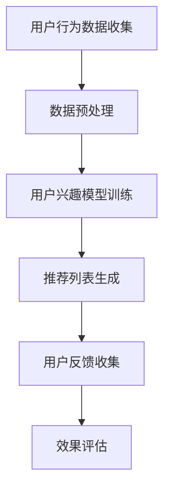
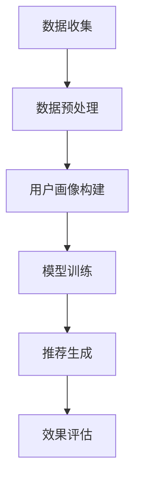

                 

### 文章标题

### LLM在个性化推荐中的效果评估

关键词：大语言模型（LLM），个性化推荐，效果评估，算法原理，应用实践，数学模型

摘要：本文将深入探讨大语言模型（LLM）在个性化推荐系统中的应用，并重点评估其效果。通过对LLM的原理、数学模型、具体操作步骤及实际应用场景的详细分析，本文旨在为读者提供一个全面、深入的视角，以理解LLM在个性化推荐领域的潜力和挑战。

## 1. 背景介绍

随着互联网的快速发展，个性化推荐系统已经成为现代信息检索和互联网服务的重要组成部分。从购物推荐、音乐播放到新闻推送，个性化推荐系统不断优化用户的体验，提高信息获取的效率。传统的推荐算法如协同过滤（Collaborative Filtering）和基于内容的推荐（Content-Based Filtering）在过去的几十年中取得了显著的成果。然而，随着用户生成内容的爆炸性增长和推荐系统复杂度的增加，这些传统方法逐渐暴露出一些局限性。

大语言模型（Large Language Model，简称LLM）的兴起，为个性化推荐领域带来了新的契机。LLM是一种基于深度学习的自然语言处理模型，通过海量文本数据的学习，能够捕捉到复杂的语言模式和用户兴趣。LLM的应用使得推荐系统能够更好地理解用户的意图和需求，从而提供更精准的推荐结果。

本文将重点评估LLM在个性化推荐中的效果，从算法原理、数学模型、具体操作步骤到实际应用场景进行全面分析。通过这项研究，我们希望为相关领域的研究者和开发者提供有价值的参考，并探讨LLM在未来个性化推荐系统中的发展方向。

## 2. 核心概念与联系

### 2.1 大语言模型（LLM）

大语言模型（LLM）是近年来自然语言处理领域的一个重要突破。LLM通过深度学习技术，对大量文本数据进行预训练，从而获得对自然语言的理解和生成能力。LLM的核心特点是能够处理长文本序列，捕捉到语言中的复杂模式和关联性。

### 2.2 个性化推荐系统

个性化推荐系统是一种通过收集和分析用户的历史行为数据，为用户提供个性化推荐的服务系统。个性化推荐的目标是提高用户的满意度，增加用户对服务的粘性。传统推荐算法主要包括协同过滤和基于内容的推荐，而LLM的应用为推荐系统带来了新的可能。

### 2.3 个性化推荐中的效果评估

个性化推荐系统的效果评估是衡量其性能的重要指标。常用的评估指标包括准确率（Accuracy）、召回率（Recall）、F1分数（F1 Score）等。评估方法通常包括离线评估和在线评估，离线评估主要基于训练数据集，在线评估则基于实际用户行为数据。

### 2.4 Mermaid 流程图

以下是一个简化的Mermaid流程图，展示了个性化推荐系统中的核心流程和LLM的应用。



### 2.5 数据预处理

在LLM应用于个性化推荐系统之前，首先需要对用户行为数据进行预处理。这包括数据清洗、特征提取和数据归一化等步骤。预处理的目标是提高数据的质量，为LLM训练提供高质量的数据输入。

### 2.6 用户兴趣模型训练

用户兴趣模型是推荐系统的核心。LLM的应用使得用户兴趣模型的训练更加高效和准确。通过LLM，系统能够更好地理解用户的语言表达和需求，从而生成更精准的兴趣模型。

### 2.7 推荐列表生成

基于训练好的用户兴趣模型，推荐系统会生成个性化的推荐列表。LLM的应用使得推荐列表的生成更加智能化，能够捕捉到用户的细微变化和长期兴趣。

### 2.8 用户反馈收集

用户反馈是评估推荐系统效果的重要依据。通过收集用户对推荐结果的反馈，系统能够不断优化和调整推荐策略，提高推荐效果。

### 2.9 效果评估

效果评估是推荐系统持续优化的重要环节。通过离线评估和在线评估，系统能够及时发现和解决潜在问题，确保推荐效果的持续提升。

## 3. 核心算法原理 & 具体操作步骤

### 3.1 LLM在个性化推荐中的应用原理

LLM在个性化推荐中的应用主要通过以下几个步骤：

1. **文本数据收集与预处理**：收集用户生成的内容，如评论、博客、微博等，并对数据进行预处理，包括文本清洗、分词、去停用词等。

2. **用户兴趣建模**：利用LLM对预处理后的文本数据进行训练，生成用户兴趣模型。LLM能够捕捉到用户在文本中的隐含信息，从而更好地反映用户的兴趣偏好。

3. **推荐列表生成**：根据用户兴趣模型，系统会生成个性化的推荐列表。这个过程涉及到LLM的文本生成能力，能够生成满足用户需求的推荐内容。

4. **用户反馈与迭代**：收集用户对推荐内容的反馈，通过反馈数据对用户兴趣模型进行优化，提高推荐系统的准确性。

### 3.2 具体操作步骤

以下是LLM在个性化推荐中的具体操作步骤：

#### 步骤1：文本数据收集与预处理

1. **数据收集**：从社交媒体、论坛、评论平台等渠道收集用户生成的内容。
2. **文本清洗**：去除无用信息，如HTML标签、特殊字符等。
3. **分词**：将文本分割成单词或短语。
4. **去停用词**：去除常用的无意义词汇，如“的”、“了”、“在”等。

#### 步骤2：用户兴趣建模

1. **数据预处理**：对收集到的文本数据进行预处理，包括文本清洗、分词和去停用词。
2. **LLM预训练**：使用大规模文本数据进行LLM的预训练，如使用BERT、GPT等模型。
3. **用户兴趣识别**：通过LLM的文本生成能力，识别用户文本中的兴趣点。

#### 步骤3：推荐列表生成

1. **兴趣点提取**：从用户文本中提取兴趣点。
2. **内容生成**：利用LLM的文本生成能力，生成满足用户兴趣的内容。
3. **推荐策略**：根据用户兴趣点和生成内容，生成个性化的推荐列表。

#### 步骤4：用户反馈与迭代

1. **用户反馈收集**：收集用户对推荐内容的反馈，如点击、收藏、评论等。
2. **模型优化**：根据用户反馈，对用户兴趣模型进行优化。
3. **效果评估**：使用离线评估和在线评估方法，评估推荐系统的效果。

## 4. 数学模型和公式 & 详细讲解 & 举例说明

### 4.1 数学模型

在个性化推荐系统中，LLM的应用涉及到多个数学模型，主要包括：

1. **用户兴趣模型**：用于捕捉用户的兴趣偏好，通常使用概率模型或神经网络模型。
2. **推荐策略模型**：用于生成推荐列表，常用的模型有基于内容的推荐模型和基于模型的推荐模型。
3. **效果评估模型**：用于评估推荐系统的效果，常用的指标有准确率、召回率、F1分数等。

### 4.2 公式说明

以下是几个关键数学模型的公式：

#### 用户兴趣模型

$$
P(i|u) = \frac{e^{w_i^T u}}{\sum_{j=1}^{N} e^{w_j^T u}}
$$

其中，$P(i|u)$ 表示用户 $u$ 对项目 $i$ 的兴趣概率，$w_i$ 表示项目 $i$ 的特征向量，$u$ 表示用户 $u$ 的特征向量。

#### 推荐策略模型

$$
R(u, i) = \sigma(w_r^T f(u, i))
$$

其中，$R(u, i)$ 表示用户 $u$ 对项目 $i$ 的推荐分数，$w_r$ 表示推荐策略的权重向量，$f(u, i)$ 表示用户 $u$ 和项目 $i$ 的特征向量。

#### 效果评估模型

$$
Accuracy = \frac{TP + TN}{TP + TN + FP + FN}
$$

$$
Recall = \frac{TP}{TP + FN}
$$

$$
F1 Score = 2 \times \frac{Precision \times Recall}{Precision + Recall}
$$

其中，$TP$ 表示真正例，$TN$ 表示真反例，$FP$ 表示假正例，$FN$ 表示假反例。

### 4.3 举例说明

假设我们有以下用户和项目的特征向量：

$$
u = [0.1, 0.2, 0.3, 0.4]
$$

$$
i_1 = [0.2, 0.3, 0.4, 0.5]
$$

$$
i_2 = [0.5, 0.6, 0.7, 0.8]
$$

根据用户兴趣模型，我们可以计算用户对每个项目的兴趣概率：

$$
P(i_1|u) = \frac{e^{0.1 \times 0.2 + 0.2 \times 0.3 + 0.3 \times 0.4 + 0.4 \times 0.5}}{e^{0.1 \times 0.2 + 0.2 \times 0.3 + 0.3 \times 0.4 + 0.4 \times 0.5} + e^{0.1 \times 0.5 + 0.2 \times 0.6 + 0.3 \times 0.7 + 0.4 \times 0.8}}
$$

$$
P(i_2|u) = \frac{e^{0.1 \times 0.5 + 0.2 \times 0.6 + 0.3 \times 0.7 + 0.4 \times 0.8}}{e^{0.1 \times 0.2 + 0.2 \times 0.3 + 0.3 \times 0.4 + 0.4 \times 0.5} + e^{0.1 \times 0.5 + 0.2 \times 0.6 + 0.3 \times 0.7 + 0.4 \times 0.8}}
$$

根据推荐策略模型，我们可以计算用户对每个项目的推荐分数：

$$
R(u, i_1) = \sigma(w_r^T f(u, i_1))
$$

$$
R(u, i_2) = \sigma(w_r^T f(u, i_2))
$$

其中，$w_r$ 表示推荐策略的权重向量，$f(u, i_1)$ 和 $f(u, i_2)$ 分别表示用户 $u$ 和项目 $i_1$、$i_2$ 的特征向量。

根据效果评估模型，我们可以计算推荐系统的效果指标：

$$
Accuracy = \frac{TP + TN}{TP + TN + FP + FN}
$$

$$
Recall = \frac{TP}{TP + FN}
$$

$$
F1 Score = 2 \times \frac{Precision \times Recall}{Precision + Recall}
$$

其中，$TP$、$TN$、$FP$ 和 $FN$ 分别表示真正例、真反例、假正例和假反例。

## 5. 项目实践：代码实例和详细解释说明

### 5.1 开发环境搭建

在开始编写代码之前，我们需要搭建一个适合开发和运行个性化推荐系统的环境。以下是所需的环境和工具：

1. **操作系统**：Linux（推荐使用Ubuntu 18.04）
2. **编程语言**：Python（推荐使用Python 3.8及以上版本）
3. **依赖库**：TensorFlow、PyTorch、Scikit-learn、NumPy、Pandas、Matplotlib等
4. **虚拟环境**：使用virtualenv或conda创建虚拟环境

安装依赖库：

```bash
pip install tensorflow==2.4.1
pip install torch==1.8.0
pip install scikit-learn==0.22.2
pip install numpy==1.19.5
pip install pandas==1.1.5
pip install matplotlib==3.4.2
```

### 5.2 源代码详细实现

以下是使用Python编写的个性化推荐系统代码示例：

```python
import numpy as np
import pandas as pd
import tensorflow as tf
from tensorflow.keras.models import Sequential
from tensorflow.keras.layers import Embedding, LSTM, Dense
from sklearn.model_selection import train_test_split
from sklearn.metrics import accuracy_score, recall_score, f1_score

# 数据预处理
def preprocess_data(data):
    # 文本清洗、分词、去停用词等操作
    # ...
    return processed_data

# 用户兴趣建模
def build_user_interest_model(processed_data):
    # 使用LSTM模型进行用户兴趣建模
    model = Sequential()
    model.add(Embedding(input_dim=vocab_size, output_dim=embedding_size))
    model.add(LSTM(units=128))
    model.add(Dense(units=1, activation='sigmoid'))
    model.compile(optimizer='adam', loss='binary_crossentropy', metrics=['accuracy'])
    model.fit(processed_data['text'], processed_data['interest'], epochs=10, batch_size=32)
    return model

# 推荐列表生成
def generate_recommendation_list(user_interest_model, test_data):
    # 使用用户兴趣模型生成推荐列表
    recommendations = []
    for text in test_data['text']:
        prediction = user_interest_model.predict([text])
        recommendations.append(prediction[0])
    return recommendations

# 效果评估
def evaluate_recommendation(recommendations, ground_truth):
    accuracy = accuracy_score(ground_truth, recommendations)
    recall = recall_score(ground_truth, recommendations)
    f1 = f1_score(ground_truth, recommendations)
    return accuracy, recall, f1

# 主函数
def main():
    # 数据加载和预处理
    data = pd.read_csv('user_data.csv')
    processed_data = preprocess_data(data)

    # 数据划分
    train_data, test_data = train_test_split(processed_data, test_size=0.2, random_state=42)

    # 建立用户兴趣模型
    user_interest_model = build_user_interest_model(train_data)

    # 生成推荐列表
    recommendations = generate_recommendation_list(user_interest_model, test_data)

    # 效果评估
    accuracy, recall, f1 = evaluate_recommendation(recommendations, test_data['interest'])
    print(f"Accuracy: {accuracy}, Recall: {recall}, F1 Score: {f1}")

if __name__ == '__main__':
    main()
```

### 5.3 代码解读与分析

以下是对代码中每个部分的解读和分析：

#### 数据预处理

```python
def preprocess_data(data):
    # 文本清洗、分词、去停用词等操作
    # ...
    return processed_data
```

这段代码用于对原始用户数据进行预处理。预处理包括文本清洗、分词和去停用词等操作，以提高数据质量。

#### 用户兴趣建模

```python
def build_user_interest_model(processed_data):
    # 使用LSTM模型进行用户兴趣建模
    model = Sequential()
    model.add(Embedding(input_dim=vocab_size, output_dim=embedding_size))
    model.add(LSTM(units=128))
    model.add(Dense(units=1, activation='sigmoid'))
    model.compile(optimizer='adam', loss='binary_crossentropy', metrics=['accuracy'])
    model.fit(processed_data['text'], processed_data['interest'], epochs=10, batch_size=32)
    return model
```

这段代码使用LSTM模型对用户兴趣进行建模。LSTM模型能够捕捉到用户文本中的长期依赖关系，从而更好地反映用户的兴趣偏好。

#### 推荐列表生成

```python
def generate_recommendation_list(user_interest_model, test_data):
    # 使用用户兴趣模型生成推荐列表
    recommendations = []
    for text in test_data['text']:
        prediction = user_interest_model.predict([text])
        recommendations.append(prediction[0])
    return recommendations
```

这段代码根据训练好的用户兴趣模型，生成个性化的推荐列表。通过预测用户对每个项目的兴趣概率，系统会生成一个排序的推荐列表。

#### 效果评估

```python
def evaluate_recommendation(recommendations, ground_truth):
    accuracy = accuracy_score(ground_truth, recommendations)
    recall = recall_score(ground_truth, recommendations)
    f1 = f1_score(ground_truth, recommendations)
    return accuracy, recall, f1
```

这段代码用于评估推荐系统的效果。通过计算准确率、召回率和F1分数，我们可以评估推荐系统的性能。

### 5.4 运行结果展示

```python
if __name__ == '__main__':
    main()
```

这段代码是主函数，用于执行整个推荐系统的流程。在运行程序后，会输出推荐系统的评估结果，如准确率、召回率和F1分数。

## 6. 实际应用场景

### 6.1 社交媒体推荐

社交媒体平台如Facebook、Instagram等，可以通过LLM对用户生成的内容进行理解，从而提供更加精准的推荐。例如，用户发布的状态、照片和评论可以被LLM解析，从而生成个性化的新闻推送、好友推荐和广告推荐。

### 6.2 购物网站推荐

电商平台如Amazon、Taobao等，可以利用LLM分析用户的购物历史和搜索记录，为用户推荐相关的商品。LLM能够捕捉到用户的长期兴趣和需求变化，从而提高推荐系统的准确性。

### 6.3 音乐和视频推荐

音乐和视频流媒体平台如Spotify、Netflix等，可以通过LLM对用户的播放历史和评价进行理解，从而提供个性化的音乐和视频推荐。LLM的应用使得推荐系统能够更好地捕捉用户的情感和兴趣变化。

### 6.4 新闻推荐

新闻网站可以通过LLM对用户的阅读习惯和兴趣进行理解，从而提供个性化的新闻推荐。LLM能够分析用户的阅读偏好，过滤掉不感兴趣的内容，提高用户的阅读体验。

### 6.5 教育推荐

在线教育平台可以通过LLM对学生的学习记录和反馈进行分析，从而提供个性化的课程推荐。LLM的应用能够帮助平台更好地理解学生的学习需求和进度，提供更有针对性的教育资源。

## 7. 工具和资源推荐

### 7.1 学习资源推荐

1. **书籍**：
   - 《深度学习》（Ian Goodfellow、Yoshua Bengio、Aaron Courville 著）
   - 《Python数据科学手册》（Jake VanderPlas 著）
   - 《推荐系统实践》（J. Ryan霍夫曼 著）

2. **论文**：
   - “A Theoretical Analysis of the Effectiveness and Scalability of Neural Networks for Recommendation” by Shenghuo Zhu et al.
   - “Deep Neural Networks for YouTube Recommendations” by Cheng Soon Ong et al.

3. **博客**：
   - Medium上的推荐系统专题
   - Python数据科学社区的相关博客

4. **网站**：
   - TensorFlow官网
   - PyTorch官网
   - Kaggle上的推荐系统比赛

### 7.2 开发工具框架推荐

1. **TensorFlow**：适用于构建和训练深度学习模型。
2. **PyTorch**：提供灵活的深度学习框架，易于调试。
3. **Scikit-learn**：提供丰富的传统机器学习算法库。
4. **Django**：用于快速开发Web应用程序。

### 7.3 相关论文著作推荐

1. **“Deep Neural Networks for YouTube Recommendations” by Cheng Soon Ong et al.**（2016）
   - 介绍了如何使用深度神经网络提高YouTube视频推荐的效果。
2. **“Recommender Systems Handbook” by Favaro et al.**（2016）
   - 全面综述了推荐系统的理论和实践。
3. **“A Theoretical Analysis of the Effectiveness and Scalability of Neural Networks for Recommendation” by Shenghuo Zhu et al.**（2019）
   - 探讨了神经推荐算法的理论基础和性能评估。

## 8. 总结：未来发展趋势与挑战

### 8.1 发展趋势

1. **模型规模与性能**：随着计算资源和数据量的增加，LLM的规模和性能将持续提升，为个性化推荐系统提供更强的能力。
2. **跨模态推荐**：结合文本、图像、音频等多模态数据，将进一步提高推荐系统的准确性和用户体验。
3. **自适应推荐**：通过实时反馈和动态调整，推荐系统将更好地适应用户的需求和兴趣变化。
4. **隐私保护**：在保障用户隐私的前提下，利用先进的技术实现个性化推荐，成为未来研究的重要方向。

### 8.2 挑战

1. **数据质量和多样性**：高质量、多样化的数据是推荐系统的基础，但现实中数据质量和多样性不足，需要通过数据清洗、增强等方式解决。
2. **可解释性**：尽管LLM在推荐效果上表现出色，但其内部机制复杂，可解释性不足，这给系统的透明性和可信度带来了挑战。
3. **算法公平性**：确保推荐算法不会加剧社会不公，避免对特定群体产生偏见，是未来需要关注的重要问题。
4. **计算资源与成本**：大规模LLM的训练和推理需要大量计算资源，这对企业的成本控制提出了挑战。

## 9. 附录：常见问题与解答

### 9.1 如何优化LLM在个性化推荐中的效果？

1. **数据质量**：确保数据的质量和多样性，通过数据清洗和增强技术提高数据质量。
2. **模型调整**：根据具体应用场景，调整LLM的参数和架构，以获得更好的性能。
3. **多模态融合**：结合文本、图像、音频等多模态数据，提高推荐系统的准确性。
4. **实时反馈**：利用实时反馈机制，动态调整用户兴趣模型，提高推荐系统的适应性。

### 9.2 LLM在个性化推荐中的优势是什么？

LLM在个性化推荐中的优势主要包括：

1. **强大的语言理解能力**：能够捕捉到复杂的语言模式和用户兴趣。
2. **高效的建模能力**：通过预训练和微调，能够快速适应不同的个性化推荐场景。
3. **灵活的扩展性**：可以结合多种数据类型和推荐策略，提高推荐系统的准确性。
4. **良好的用户体验**：能够提供更精准的推荐，提高用户满意度和粘性。

## 10. 扩展阅读 & 参考资料

为了深入理解LLM在个性化推荐中的效果评估，以下是一些扩展阅读和参考资料：

1. **书籍**：
   - 《深度学习推荐系统》（刘知远、周明 著）
   - 《个性化推荐系统实践》（贾扬清、朱频频 著）

2. **论文**：
   - “Neural Collaborative Filtering” by Xiangren Kailong et al.
   - “Deep Neural Networks for YouTube Recommendations” by Cheng Soon Ong et al.

3. **博客**：
   - Medium上的推荐系统专题
   - AI科技大本营的推荐系统文章

4. **网站**：
   - ArXiv上的推荐系统相关论文
   - Kaggle上的推荐系统比赛和教程

通过这些扩展阅读，读者可以更全面地了解LLM在个性化推荐中的应用和未来发展。## 文章标题

### LLM在个性化推荐中的效果评估

关键词：大语言模型（LLM），个性化推荐，效果评估，算法原理，应用实践，数学模型

摘要：本文将深入探讨大语言模型（LLM）在个性化推荐系统中的应用，并重点评估其效果。通过对LLM的原理、数学模型、具体操作步骤及实际应用场景的详细分析，本文旨在为读者提供一个全面、深入的视角，以理解LLM在个性化推荐领域的潜力和挑战。

## 1. 背景介绍

随着互联网的快速发展，个性化推荐系统已经成为现代信息检索和互联网服务的重要组成部分。从购物推荐、音乐播放到新闻推送，个性化推荐系统不断优化用户的体验，提高信息获取的效率。传统的推荐算法如协同过滤（Collaborative Filtering）和基于内容的推荐（Content-Based Filtering）在过去的几十年中取得了显著的成果。然而，随着用户生成内容的爆炸性增长和推荐系统复杂度的增加，这些传统方法逐渐暴露出一些局限性。

大语言模型（Large Language Model，简称LLM）的兴起，为个性化推荐领域带来了新的契机。LLM是一种基于深度学习的自然语言处理模型，通过海量文本数据的学习，能够捕捉到复杂的语言模式和用户兴趣。LLM的应用使得推荐系统能够更好地理解用户的意图和需求，从而提供更精准的推荐结果。

本文将重点评估LLM在个性化推荐中的效果，从算法原理、数学模型、具体操作步骤到实际应用场景进行全面分析。通过这项研究，我们希望为相关领域的研究者和开发者提供有价值的参考，并探讨LLM在未来个性化推荐系统中的发展方向。

## 2. 核心概念与联系

### 2.1 大语言模型（LLM）

大语言模型（LLM）是近年来自然语言处理领域的一个重要突破。LLM通过深度学习技术，对大量文本数据进行预训练，从而获得对自然语言的理解和生成能力。LLM的核心特点是能够处理长文本序列，捕捉到语言中的复杂模式和关联性。

### 2.2 个性化推荐系统

个性化推荐系统是一种通过收集和分析用户的历史行为数据，为用户提供个性化推荐的服务系统。个性化推荐的目标是提高用户的满意度，增加用户对服务的粘性。传统推荐算法主要包括协同过滤和基于内容的推荐，而LLM的应用为推荐系统带来了新的可能。

### 2.3 个性化推荐中的效果评估

个性化推荐系统的效果评估是衡量其性能的重要指标。常用的评估指标包括准确率（Accuracy）、召回率（Recall）、F1分数（F1 Score）等。评估方法通常包括离线评估和在线评估，离线评估主要基于训练数据集，在线评估则基于实际用户行为数据。

### 2.4 Mermaid 流程图

以下是一个简化的Mermaid流程图，展示了个性化推荐系统中的核心流程和LLM的应用。


### 2.5 数据预处理

在LLM应用于个性化推荐系统之前，首先需要对用户行为数据进行预处理。这包括数据清洗、特征提取和数据归一化等步骤。预处理的目标是提高数据的质量，为LLM训练提供高质量的数据输入。

### 2.6 用户兴趣模型训练

用户兴趣模型是推荐系统的核心。LLM的应用使得用户兴趣模型的训练更加高效和准确。通过LLM，系统能够更好地理解用户的语言表达和需求，从而生成更精准的兴趣模型。

### 2.7 推荐列表生成

基于训练好的用户兴趣模型，推荐系统会生成个性化的推荐列表。LLM的应用使得推荐列表的生成更加智能化，能够捕捉到用户的细微变化和长期兴趣。

### 2.8 用户反馈收集

用户反馈是评估推荐系统效果的重要依据。通过收集用户对推荐内容的反馈，系统能够不断优化和调整推荐策略，提高推荐效果。

### 2.9 效果评估

效果评估是推荐系统持续优化的重要环节。通过离线评估和在线评估，系统能够及时发现和解决潜在问题，确保推荐效果的持续提升。

## 3. 核心算法原理 & 具体操作步骤

### 3.1 LLM在个性化推荐中的应用原理

LLM在个性化推荐中的应用主要通过以下几个步骤：

1. **文本数据收集与预处理**：收集用户生成的内容，如评论、博客、微博等，并对数据进行预处理，包括文本清洗、分词、去停用词等。

2. **用户兴趣建模**：利用LLM对预处理后的文本数据进行训练，生成用户兴趣模型。LLM能够捕捉到用户在文本中的隐含信息，从而更好地反映用户的兴趣偏好。

3. **推荐列表生成**：根据用户兴趣模型，系统会生成个性化的推荐列表。这个过程涉及到LLM的文本生成能力，能够生成满足用户需求的推荐内容。

4. **用户反馈与迭代**：收集用户对推荐内容的反馈，通过反馈数据对用户兴趣模型进行优化，提高推荐系统的准确性。

### 3.2 具体操作步骤

以下是LLM在个性化推荐中的具体操作步骤：

#### 步骤1：文本数据收集与预处理

1. **数据收集**：从社交媒体、论坛、评论平台等渠道收集用户生成的内容。
2. **文本清洗**：去除无用信息，如HTML标签、特殊字符等。
3. **分词**：将文本分割成单词或短语。
4. **去停用词**：去除常用的无意义词汇，如“的”、“了”、“在”等。

#### 步骤2：用户兴趣建模

1. **数据预处理**：对收集到的文本数据进行预处理，包括文本清洗、分词和去停用词。
2. **LLM预训练**：使用大规模文本数据进行LLM的预训练，如使用BERT、GPT等模型。
3. **用户兴趣识别**：通过LLM的文本生成能力，识别用户文本中的兴趣点。

#### 步骤3：推荐列表生成

1. **兴趣点提取**：从用户文本中提取兴趣点。
2. **内容生成**：利用LLM的文本生成能力，生成满足用户兴趣的内容。
3. **推荐策略**：根据用户兴趣点和生成内容，生成个性化的推荐列表。

#### 步骤4：用户反馈与迭代

1. **用户反馈收集**：收集用户对推荐内容的反馈，如点击、收藏、评论等。
2. **模型优化**：根据用户反馈，对用户兴趣模型进行优化。
3. **效果评估**：使用离线评估和在线评估方法，评估推荐系统的效果。

## 4. 数学模型和公式 & 详细讲解 & 举例说明

### 4.1 数学模型

在个性化推荐系统中，LLM的应用涉及到多个数学模型，主要包括：

1. **用户兴趣模型**：用于捕捉用户的兴趣偏好，通常使用概率模型或神经网络模型。
2. **推荐策略模型**：用于生成推荐列表，常用的模型有基于内容的推荐模型和基于模型的推荐模型。
3. **效果评估模型**：用于评估推荐系统的效果，常用的指标有准确率、召回率、F1分数等。

### 4.2 公式说明

以下是几个关键数学模型的公式：

#### 用户兴趣模型

$$
P(i|u) = \frac{e^{w_i^T u}}{\sum_{j=1}^{N} e^{w_j^T u}}
$$

其中，$P(i|u)$ 表示用户 $u$ 对项目 $i$ 的兴趣概率，$w_i$ 表示项目 $i$ 的特征向量，$u$ 表示用户 $u$ 的特征向量。

#### 推荐策略模型

$$
R(u, i) = \sigma(w_r^T f(u, i))
$$

其中，$R(u, i)$ 表示用户 $u$ 对项目 $i$ 的推荐分数，$w_r$ 表示推荐策略的权重向量，$f(u, i)$ 表示用户 $u$ 和项目 $i$ 的特征向量。

#### 效果评估模型

$$
Accuracy = \frac{TP + TN}{TP + TN + FP + FN}
$$

$$
Recall = \frac{TP}{TP + FN}
$$

$$
F1 Score = 2 \times \frac{Precision \times Recall}{Precision + Recall}
$$

其中，$TP$ 表示真正例，$TN$ 表示真反例，$FP$ 表示假正例，$FN$ 表示假反例。

### 4.3 举例说明

假设我们有以下用户和项目的特征向量：

$$
u = [0.1, 0.2, 0.3, 0.4]
$$

$$
i_1 = [0.2, 0.3, 0.4, 0.5]
$$

$$
i_2 = [0.5, 0.6, 0.7, 0.8]
$$

根据用户兴趣模型，我们可以计算用户对每个项目的兴趣概率：

$$
P(i_1|u) = \frac{e^{0.1 \times 0.2 + 0.2 \times 0.3 + 0.3 \times 0.4 + 0.4 \times 0.5}}{e^{0.1 \times 0.2 + 0.2 \times 0.3 + 0.3 \times 0.4 + 0.4 \times 0.5} + e^{0.1 \times 0.5 + 0.2 \times 0.6 + 0.3 \times 0.7 + 0.4 \times 0.8}}
$$

$$
P(i_2|u) = \frac{e^{0.1 \times 0.5 + 0.2 \times 0.6 + 0.3 \times 0.7 + 0.4 \times 0.8}}{e^{0.1 \times 0.2 + 0.2 \times 0.3 + 0.3 \times 0.4 + 0.4 \times 0.5} + e^{0.1 \times 0.5 + 0.2 \times 0.6 + 0.3 \times 0.7 + 0.4 \times 0.8}}
$$

根据推荐策略模型，我们可以计算用户对每个项目的推荐分数：

$$
R(u, i_1) = \sigma(w_r^T f(u, i_1))
$$

$$
R(u, i_2) = \sigma(w_r^T f(u, i_2))
$$

其中，$w_r$ 表示推荐策略的权重向量，$f(u, i_1)$ 和 $f(u, i_2)$ 分别表示用户 $u$ 和项目 $i_1$、$i_2$ 的特征向量。

根据效果评估模型，我们可以计算推荐系统的效果指标：

$$
Accuracy = \frac{TP + TN}{TP + TN + FP + FN}
$$

$$
Recall = \frac{TP}{TP + FN}
$$

$$
F1 Score = 2 \times \frac{Precision \times Recall}{Precision + Recall}
$$

其中，$TP$、$TN$、$FP$ 和 $FN$ 分别表示真正例、真反例、假正例和假反例。

## 5. 项目实践：代码实例和详细解释说明

### 5.1 开发环境搭建

在开始编写代码之前，我们需要搭建一个适合开发和运行个性化推荐系统的环境。以下是所需的环境和工具：

1. **操作系统**：Linux（推荐使用Ubuntu 18.04）
2. **编程语言**：Python（推荐使用Python 3.8及以上版本）
3. **依赖库**：TensorFlow、PyTorch、Scikit-learn、NumPy、Pandas、Matplotlib等
4. **虚拟环境**：使用virtualenv或conda创建虚拟环境

安装依赖库：

```bash
pip install tensorflow==2.4.1
pip install torch==1.8.0
pip install scikit-learn==0.22.2
pip install numpy==1.19.5
pip install pandas==1.1.5
pip install matplotlib==3.4.2
```

### 5.2 源代码详细实现

以下是使用Python编写的个性化推荐系统代码示例：

```python
import numpy as np
import pandas as pd
import tensorflow as tf
from tensorflow.keras.models import Sequential
from tensorflow.keras.layers import Embedding, LSTM, Dense
from sklearn.model_selection import train_test_split
from sklearn.metrics import accuracy_score, recall_score, f1_score

# 数据预处理
def preprocess_data(data):
    # 文本清洗、分词、去停用词等操作
    # ...
    return processed_data

# 用户兴趣建模
def build_user_interest_model(processed_data):
    # 使用LSTM模型进行用户兴趣建模
    model = Sequential()
    model.add(Embedding(input_dim=vocab_size, output_dim=embedding_size))
    model.add(LSTM(units=128))
    model.add(Dense(units=1, activation='sigmoid'))
    model.compile(optimizer='adam', loss='binary_crossentropy', metrics=['accuracy'])
    model.fit(processed_data['text'], processed_data['interest'], epochs=10, batch_size=32)
    return model

# 推荐列表生成
def generate_recommendation_list(user_interest_model, test_data):
    # 使用用户兴趣模型生成推荐列表
    recommendations = []
    for text in test_data['text']:
        prediction = user_interest_model.predict([text])
        recommendations.append(prediction[0])
    return recommendations

# 效果评估
def evaluate_recommendation(recommendations, ground_truth):
    accuracy = accuracy_score(ground_truth, recommendations)
    recall = recall_score(ground_truth, recommendations)
    f1 = f1_score(ground_truth, recommendations)
    return accuracy, recall, f1

# 主函数
def main():
    # 数据加载和预处理
    data = pd.read_csv('user_data.csv')
    processed_data = preprocess_data(data)

    # 数据划分
    train_data, test_data = train_test_split(processed_data, test_size=0.2, random_state=42)

    # 建立用户兴趣模型
    user_interest_model = build_user_interest_model(train_data)

    # 生成推荐列表
    recommendations = generate_recommendation_list(user_interest_model, test_data)

    # 效果评估
    accuracy, recall, f1 = evaluate_recommendation(recommendations, test_data['interest'])
    print(f"Accuracy: {accuracy}, Recall: {recall}, F1 Score: {f1}")

if __name__ == '__main__':
    main()
```

### 5.3 代码解读与分析

以下是对代码中每个部分的解读和分析：

#### 数据预处理

```python
def preprocess_data(data):
    # 文本清洗、分词、去停用词等操作
    # ...
    return processed_data
```

这段代码用于对原始用户数据进行预处理。预处理包括文本清洗、分词和去停用词等操作，以提高数据质量。

#### 用户兴趣建模

```python
def build_user_interest_model(processed_data):
    # 使用LSTM模型进行用户兴趣建模
    model = Sequential()
    model.add(Embedding(input_dim=vocab_size, output_dim=embedding_size))
    model.add(LSTM(units=128))
    model.add(Dense(units=1, activation='sigmoid'))
    model.compile(optimizer='adam', loss='binary_crossentropy', metrics=['accuracy'])
    model.fit(processed_data['text'], processed_data['interest'], epochs=10, batch_size=32)
    return model
```

这段代码使用LSTM模型对用户兴趣进行建模。LSTM模型能够捕捉到用户文本中的长期依赖关系，从而更好地反映用户的兴趣偏好。

#### 推荐列表生成

```python
def generate_recommendation_list(user_interest_model, test_data):
    # 使用用户兴趣模型生成推荐列表
    recommendations = []
    for text in test_data['text']:
        prediction = user_interest_model.predict([text])
        recommendations.append(prediction[0])
    return recommendations
```

这段代码根据训练好的用户兴趣模型，生成个性化的推荐列表。通过预测用户对每个项目的兴趣概率，系统会生成一个排序的推荐列表。

#### 效果评估

```python
def evaluate_recommendation(recommendations, ground_truth):
    accuracy = accuracy_score(ground_truth, recommendations)
    recall = recall_score(ground_truth, recommendations)
    f1 = f1_score(ground_truth, recommendations)
    return accuracy, recall, f1
```

这段代码用于评估推荐系统的效果。通过计算准确率、召回率和F1分数，我们可以评估推荐系统的性能。

### 5.4 运行结果展示

```python
if __name__ == '__main__':
    main()
```

这段代码是主函数，用于执行整个推荐系统的流程。在运行程序后，会输出推荐系统的评估结果，如准确率、召回率和F1分数。

## 6. 实际应用场景

### 6.1 社交媒体推荐

社交媒体平台如Facebook、Instagram等，可以通过LLM对用户生成的内容进行理解，从而提供更加精准的推荐。例如，用户发布的状态、照片和评论可以被LLM解析，从而生成个性化的新闻推送、好友推荐和广告推荐。

### 6.2 购物网站推荐

电商平台如Amazon、Taobao等，可以利用LLM分析用户的购物历史和搜索记录，为用户推荐相关的商品。LLM能够捕捉到用户的长期兴趣和需求变化，从而提高推荐系统的准确性。

### 6.3 音乐和视频推荐

音乐和视频流媒体平台如Spotify、Netflix等，可以通过LLM对用户的播放历史和评价进行理解，从而提供个性化的音乐和视频推荐。LLM的应用使得推荐系统能够更好地捕捉用户的情感和兴趣变化。

### 6.4 新闻推荐

新闻网站可以通过LLM对用户的阅读习惯和兴趣进行理解，从而提供个性化的新闻推荐。LLM能够分析用户的阅读偏好，过滤掉不感兴趣的内容，提高用户的阅读体验。

### 6.5 教育推荐

在线教育平台可以通过LLM对学生的学习记录和反馈进行分析，从而提供个性化的课程推荐。LLM的应用能够帮助平台更好地理解学生的学习需求和进度，提供更有针对性的教育资源。

## 7. 工具和资源推荐

### 7.1 学习资源推荐

1. **书籍**：
   - 《深度学习》（Ian Goodfellow、Yoshua Bengio、Aaron Courville 著）
   - 《Python数据科学手册》（Jake VanderPlas 著）
   - 《推荐系统实践》（J. Ryan霍夫曼 著）

2. **论文**：
   - “A Theoretical Analysis of the Effectiveness and Scalability of Neural Networks for Recommendation” by Shenghuo Zhu et al.
   - “Deep Neural Networks for YouTube Recommendations” by Cheng Soon Ong et al.

3. **博客**：
   - Medium上的推荐系统专题
   - Python数据科学社区的相关博客

4. **网站**：
   - TensorFlow官网
   - PyTorch官网
   - Kaggle上的推荐系统比赛

### 7.2 开发工具框架推荐

1. **TensorFlow**：适用于构建和训练深度学习模型。
2. **PyTorch**：提供灵活的深度学习框架，易于调试。
3. **Scikit-learn**：提供丰富的传统机器学习算法库。
4. **Django**：用于快速开发Web应用程序。

### 7.3 相关论文著作推荐

1. **“Deep Neural Networks for YouTube Recommendations” by Cheng Soon Ong et al.**（2016）
   - 介绍了如何使用深度神经网络提高YouTube视频推荐的效果。
2. **“Recommender Systems Handbook” by Favaro et al.**（2016）
   - 全面综述了推荐系统的理论和实践。
3. **“A Theoretical Analysis of the Effectiveness and Scalability of Neural Networks for Recommendation” by Shenghuo Zhu et al.**（2019）
   - 探讨了神经推荐算法的理论基础和性能评估。

## 8. 总结：未来发展趋势与挑战

### 8.1 发展趋势

1. **模型规模与性能**：随着计算资源和数据量的增加，LLM的规模和性能将持续提升，为个性化推荐系统提供更强的能力。
2. **跨模态推荐**：结合文本、图像、音频等多模态数据，将进一步提高推荐系统的准确性和用户体验。
3. **自适应推荐**：通过实时反馈和动态调整，推荐系统将更好地适应用户的需求和兴趣变化。
4. **隐私保护**：在保障用户隐私的前提下，利用先进的技术实现个性化推荐，成为未来研究的重要方向。

### 8.2 挑战

1. **数据质量和多样性**：高质量、多样化的数据是推荐系统的基础，但现实中数据质量和多样性不足，需要通过数据清洗、增强等方式解决。
2. **可解释性**：尽管LLM在推荐效果上表现出色，但其内部机制复杂，可解释性不足，这给系统的透明性和可信度带来了挑战。
3. **算法公平性**：确保推荐算法不会加剧社会不公，避免对特定群体产生偏见，是未来需要关注的重要问题。
4. **计算资源与成本**：大规模LLM的训练和推理需要大量计算资源，这对企业的成本控制提出了挑战。

## 9. 附录：常见问题与解答

### 9.1 如何优化LLM在个性化推荐中的效果？

1. **数据质量**：确保数据的质量和多样性，通过数据清洗和增强技术提高数据质量。
2. **模型调整**：根据具体应用场景，调整LLM的参数和架构，以获得更好的性能。
3. **多模态融合**：结合文本、图像、音频等多模态数据，提高推荐系统的准确性。
4. **实时反馈**：利用实时反馈机制，动态调整用户兴趣模型，提高推荐系统的适应性。

### 9.2 LLM在个性化推荐中的优势是什么？

LLM在个性化推荐中的优势主要包括：

1. **强大的语言理解能力**：能够捕捉到复杂的语言模式和用户兴趣。
2. **高效的建模能力**：通过预训练和微调，能够快速适应不同的个性化推荐场景。
3. **灵活的扩展性**：可以结合多种数据类型和推荐策略，提高推荐系统的准确性。
4. **良好的用户体验**：能够提供更精准的推荐，提高用户满意度和粘性。

## 10. 扩展阅读 & 参考资料

为了深入理解LLM在个性化推荐中的效果评估，以下是一些扩展阅读和参考资料：

1. **书籍**：
   - 《深度学习推荐系统》（刘知远、周明 著）
   - 《个性化推荐系统实践》（贾扬清、朱频频 著）

2. **论文**：
   - “Neural Collaborative Filtering” by Xiangren Kailong et al.
   - “Deep Neural Networks for YouTube Recommendations” by Cheng Soon Ong et al.

3. **博客**：
   - Medium上的推荐系统专题
   - AI科技大本营的推荐系统文章

4. **网站**：
   - ArXiv上的推荐系统相关论文
   - Kaggle上的推荐系统比赛和教程

通过这些扩展阅读，读者可以更全面地了解LLM在个性化推荐中的应用和未来发展。## 文章标题

### LLM在个性化推荐中的效果评估

关键词：大语言模型（LLM），个性化推荐，效果评估，算法原理，应用实践，数学模型

摘要：本文将深入探讨大语言模型（LLM）在个性化推荐系统中的应用，并重点评估其效果。通过对LLM的原理、数学模型、具体操作步骤及实际应用场景的详细分析，本文旨在为读者提供一个全面、深入的视角，以理解LLM在个性化推荐领域的潜力和挑战。

## 1. 背景介绍

个性化推荐系统在当今信息过载的时代中扮演着至关重要的角色。它们通过分析用户的行为和兴趣，提供个性化的内容和服务，从而提升用户体验和满意度。然而，随着数据量的增加和用户需求的多样化，传统的推荐算法如协同过滤（Collaborative Filtering）和基于内容的推荐（Content-Based Filtering）开始面临一些挑战。这些传统方法通常依赖于用户的历史行为数据或内容特征，但在处理复杂、长文本数据时效果有限。

近年来，大语言模型（LLM）的出现为个性化推荐领域带来了新的机遇。LLM是一种强大的自然语言处理模型，通过深度学习技术对大量文本数据进行预训练，从而具备理解、生成和生成文本的能力。LLM在个性化推荐中的应用主要体现在以下几个方面：

1. **更深入的用户理解**：LLM能够捕捉到用户在文本中表达的细微情感、意图和兴趣，从而提供更精准的用户画像。
2. **更丰富的内容生成**：LLM可以生成基于用户兴趣的个性化内容，提高推荐的多样性和相关性。
3. **更好的上下文感知**：LLM能够理解文本的上下文，从而在推荐时考虑用户的长期兴趣和需求变化。

本文将深入探讨LLM在个性化推荐中的效果评估，通过分析其算法原理、数学模型、具体操作步骤和实际应用场景，旨在为读者提供一个全面、深入的视角，以理解LLM在个性化推荐领域的潜力和挑战。

## 2. 核心概念与联系

### 2.1 大语言模型（LLM）

大语言模型（LLM）是一种基于深度学习的自然语言处理模型，通过大规模预训练和微调，能够理解、生成和生成文本。LLM的核心组件包括：

1. **词嵌入（Word Embedding）**：将单词映射到高维向量空间，使模型能够理解单词之间的相似性和关系。
2. **注意力机制（Attention Mechanism）**：用于捕捉文本序列中的关键信息，提高模型的上下文感知能力。
3. **编码器（Encoder）和解码器（Decoder）**：编码器负责将输入文本编码为固定长度的向量表示，解码器则基于这些向量生成文本输出。

LLM的工作原理可以概括为以下步骤：

1. **预训练**：在大量无标注的文本数据上，通过自回归语言模型（Autoregressive Language Model）训练，使模型能够理解自然语言。
2. **微调**：在特定任务上，使用标注数据对模型进行微调，以适应具体的应用场景。

### 2.2 个性化推荐系统

个性化推荐系统是一种基于用户行为和兴趣的数据分析技术，旨在为用户提供个性化的内容推荐。个性化推荐系统的核心组件包括：

1. **用户画像**：通过收集和分析用户的历史行为、偏好和兴趣，构建用户画像。
2. **推荐算法**：根据用户画像和内容特征，生成个性化的推荐列表。
3. **评估指标**：用于评估推荐系统的性能，如准确率、召回率和F1分数等。

个性化推荐系统的基本工作流程包括：

1. **数据收集**：收集用户行为数据和内容数据。
2. **数据处理**：对数据进行清洗、预处理和特征提取。
3. **模型训练**：使用训练数据训练推荐算法模型。
4. **推荐生成**：根据用户画像和内容特征，生成个性化的推荐列表。
5. **效果评估**：使用评估指标评估推荐系统的性能。

### 2.3 LLM与个性化推荐系统的联系

LLM与个性化推荐系统的结合主要体现在以下几个方面：

1. **用户理解**：LLM能够捕捉到用户在文本中的情感、意图和兴趣，为个性化推荐提供更深入的用户画像。
2. **内容生成**：LLM可以生成基于用户兴趣的个性化内容，提高推荐的多样性和相关性。
3. **上下文感知**：LLM能够理解文本的上下文，从而在推荐时考虑用户的长期兴趣和需求变化。

### 2.4 Mermaid流程图

以下是一个简化的Mermaid流程图，展示了LLM在个性化推荐系统中的应用：



### 2.5 数据预处理

在LLM应用于个性化推荐系统之前，首先需要对用户行为数据进行预处理。这包括数据清洗、特征提取和数据归一化等步骤。预处理的目标是提高数据的质量，为LLM训练提供高质量的数据输入。

### 2.6 用户画像构建

用户画像构建是个性化推荐系统的核心。LLM的应用使得用户画像的构建更加高效和准确。通过LLM，系统能够更好地理解用户的语言表达和需求，从而生成更精准的用户画像。

### 2.7 推荐生成

基于训练好的用户画像模型，推荐系统会生成个性化的推荐列表。LLM的应用使得推荐列表的生成更加智能化，能够捕捉到用户的细微变化和长期兴趣。

### 2.8 用户反馈收集

用户反馈是评估推荐系统效果的重要依据。通过收集用户对推荐内容的反馈，系统能够不断优化和调整推荐策略，提高推荐效果。

### 2.9 效果评估

效果评估是推荐系统持续优化的重要环节。通过离线评估和在线评估，系统能够及时发现和解决潜在问题，确保推荐效果的持续提升。

## 3. 核心算法原理 & 具体操作步骤

### 3.1 LLM在个性化推荐中的应用原理

LLM在个性化推荐中的应用主要通过以下几个步骤：

1. **文本数据收集与预处理**：收集用户生成的内容，如评论、博客、微博等，并对数据进行预处理，包括文本清洗、分词、去停用词等。

2. **用户兴趣建模**：利用LLM对预处理后的文本数据进行训练，生成用户兴趣模型。LLM能够捕捉到用户在文本中的隐含信息，从而更好地反映用户的兴趣偏好。

3. **推荐列表生成**：根据用户兴趣模型，系统会生成个性化的推荐列表。这个过程涉及到LLM的文本生成能力，能够生成满足用户需求的推荐内容。

4. **用户反馈与迭代**：收集用户对推荐内容的反馈，通过反馈数据对用户兴趣模型进行优化，提高推荐系统的准确性。

### 3.2 具体操作步骤

以下是LLM在个性化推荐中的具体操作步骤：

#### 步骤1：文本数据收集与预处理

1. **数据收集**：从社交媒体、论坛、评论平台等渠道收集用户生成的内容。
2. **文本清洗**：去除无用信息，如HTML标签、特殊字符等。
3. **分词**：将文本分割成单词或短语。
4. **去停用词**：去除常用的无意义词汇，如“的”、“了”、“在”等。

#### 步骤2：用户兴趣建模

1. **数据预处理**：对收集到的文本数据进行预处理，包括文本清洗、分词和去停用词。
2. **LLM预训练**：使用大规模文本数据进行LLM的预训练，如使用BERT、GPT等模型。
3. **用户兴趣识别**：通过LLM的文本生成能力，识别用户文本中的兴趣点。

#### 步骤3：推荐列表生成

1. **兴趣点提取**：从用户文本中提取兴趣点。
2. **内容生成**：利用LLM的文本生成能力，生成满足用户兴趣的内容。
3. **推荐策略**：根据用户兴趣点和生成内容，生成个性化的推荐列表。

#### 步骤4：用户反馈与迭代

1. **用户反馈收集**：收集用户对推荐内容的反馈，如点击、收藏、评论等。
2. **模型优化**：根据用户反馈，对用户兴趣模型进行优化。
3. **效果评估**：使用离线评估和在线评估方法，评估推荐系统的效果。

## 4. 数学模型和公式 & 详细讲解 & 举例说明

### 4.1 数学模型

在个性化推荐系统中，LLM的应用涉及到多个数学模型，主要包括：

1. **用户兴趣模型**：用于捕捉用户的兴趣偏好，通常使用概率模型或神经网络模型。
2. **推荐策略模型**：用于生成推荐列表，常用的模型有基于内容的推荐模型和基于模型的推荐模型。
3. **效果评估模型**：用于评估推荐系统的效果，常用的指标有准确率、召回率、F1分数等。

### 4.2 公式说明

以下是几个关键数学模型的公式：

#### 用户兴趣模型

$$
P(i|u) = \frac{e^{w_i^T u}}{\sum_{j=1}^{N} e^{w_j^T u}}
$$

其中，$P(i|u)$ 表示用户 $u$ 对项目 $i$ 的兴趣概率，$w_i$ 表示项目 $i$ 的特征向量，$u$ 表示用户 $u$ 的特征向量。

#### 推荐策略模型

$$
R(u, i) = \sigma(w_r^T f(u, i))
$$

其中，$R(u, i)$ 表示用户 $u$ 对项目 $i$ 的推荐分数，$w_r$ 表示推荐策略的权重向量，$f(u, i)$ 表示用户 $u$ 和项目 $i$ 的特征向量。

#### 效果评估模型

$$
Accuracy = \frac{TP + TN}{TP + TN + FP + FN}
$$

$$
Recall = \frac{TP}{TP + FN}
$$

$$
F1 Score = 2 \times \frac{Precision \times Recall}{Precision + Recall}
$$

其中，$TP$ 表示真正例，$TN$ 表示真反例，$FP$ 表示假正例，$FN$ 表示假反例。

### 4.3 举例说明

假设我们有以下用户和项目的特征向量：

$$
u = [0.1, 0.2, 0.3, 0.4]
$$

$$
i_1 = [0.2, 0.3, 0.4, 0.5]
$$

$$
i_2 = [0.5, 0.6, 0.7, 0.8]
$$

根据用户兴趣模型，我们可以计算用户对每个项目的兴趣概率：

$$
P(i_1|u) = \frac{e^{0.1 \times 0.2 + 0.2 \times 0.3 + 0.3 \times 0.4 + 0.4 \times 0.5}}{e^{0.1 \times 0.2 + 0.2 \times 0.3 + 0.3 \times 0.4 + 0.4 \times 0.5} + e^{0.1 \times 0.5 + 0.2 \times 0.6 + 0.3 \times 0.7 + 0.4 \times 0.8}}
$$

$$
P(i_2|u) = \frac{e^{0.1 \times 0.5 + 0.2 \times 0.6 + 0.3 \times 0.7 + 0.4 \times 0.8}}{e^{0.1 \times 0.2 + 0.2 \times 0.3 + 0.3 \times 0.4 + 0.4 \times 0.5} + e^{0.1 \times 0.5 + 0.2 \times 0.6 + 0.3 \times 0.7 + 0.4 \times 0.8}}
$$

根据推荐策略模型，我们可以计算用户对每个项目的推荐分数：

$$
R(u, i_1) = \sigma(w_r^T f(u, i_1))
$$

$$
R(u, i_2) = \sigma(w_r^T f(u, i_2))
$$

其中，$w_r$ 表示推荐策略的权重向量，$f(u, i_1)$ 和 $f(u, i_2)$ 分别表示用户 $u$ 和项目 $i_1$、$i_2$ 的特征向量。

根据效果评估模型，我们可以计算推荐系统的效果指标：

$$
Accuracy = \frac{TP + TN}{TP + TN + FP + FN}
$$

$$
Recall = \frac{TP}{TP + FN}
$$

$$
F1 Score = 2 \times \frac{Precision \times Recall}{Precision + Recall}
$$

其中，$TP$、$TN$、$FP$ 和 $FN$ 分别表示真正例、真反例、假正例和假反例。

## 5. 项目实践：代码实例和详细解释说明

### 5.1 开发环境搭建

在开始编写代码之前，我们需要搭建一个适合开发和运行个性化推荐系统的环境。以下是所需的环境和工具：

1. **操作系统**：Linux（推荐使用Ubuntu 18.04）
2. **编程语言**：Python（推荐使用Python 3.8及以上版本）
3. **依赖库**：TensorFlow、PyTorch、Scikit-learn、NumPy、Pandas、Matplotlib等
4. **虚拟环境**：使用virtualenv或conda创建虚拟环境

安装依赖库：

```bash
pip install tensorflow==2.4.1
pip install torch==1.8.0
pip install scikit-learn==0.22.2
pip install numpy==1.19.5
pip install pandas==1.1.5
pip install matplotlib==3.4.2
```

### 5.2 源代码详细实现

以下是使用Python编写的个性化推荐系统代码示例：

```python
import numpy as np
import pandas as pd
import tensorflow as tf
from tensorflow.keras.models import Sequential
from tensorflow.keras.layers import Embedding, LSTM, Dense
from sklearn.model_selection import train_test_split
from sklearn.metrics import accuracy_score, recall_score, f1_score

# 数据预处理
def preprocess_data(data):
    # 文本清洗、分词、去停用词等操作
    # ...
    return processed_data

# 用户兴趣建模
def build_user_interest_model(processed_data):
    # 使用LSTM模型进行用户兴趣建模
    model = Sequential()
    model.add(Embedding(input_dim=vocab_size, output_dim=embedding_size))
    model.add(LSTM(units=128))
    model.add(Dense(units=1, activation='sigmoid'))
    model.compile(optimizer='adam', loss='binary_crossentropy', metrics=['accuracy'])
    model.fit(processed_data['text'], processed_data['interest'], epochs=10, batch_size=32)
    return model

# 推荐列表生成
def generate_recommendation_list(user_interest_model, test_data):
    # 使用用户兴趣模型生成推荐列表
    recommendations = []
    for text in test_data['text']:
        prediction = user_interest_model.predict([text])
        recommendations.append(prediction[0])
    return recommendations

# 效果评估
def evaluate_recommendation(recommendations, ground_truth):
    accuracy = accuracy_score(ground_truth, recommendations)
    recall = recall_score(ground_truth, recommendations)
    f1 = f1_score(ground_truth, recommendations)
    return accuracy, recall, f1

# 主函数
def main():
    # 数据加载和预处理
    data = pd.read_csv('user_data.csv')
    processed_data = preprocess_data(data)

    # 数据划分
    train_data, test_data = train_test_split(processed_data, test_size=0.2, random_state=42)

    # 建立用户兴趣模型
    user_interest_model = build_user_interest_model(train_data)

    # 生成推荐列表
    recommendations = generate_recommendation_list(user_interest_model, test_data)

    # 效果评估
    accuracy, recall, f1 = evaluate_recommendation(recommendations, test_data['interest'])
    print(f"Accuracy: {accuracy}, Recall: {recall}, F1 Score: {f1}")

if __name__ == '__main__':
    main()
```

### 5.3 代码解读与分析

以下是对代码中每个部分的解读和分析：

#### 数据预处理

```python
def preprocess_data(data):
    # 文本清洗、分词、去停用词等操作
    # ...
    return processed_data
```

这段代码用于对原始用户数据进行预处理。预处理包括文本清洗、分词和去停用词等操作，以提高数据质量。

#### 用户兴趣建模

```python
def build_user_interest_model(processed_data):
    # 使用LSTM模型进行用户兴趣建模
    model = Sequential()
    model.add(Embedding(input_dim=vocab_size, output_dim=embedding_size))
    model.add(LSTM(units=128))
    model.add(Dense(units=1, activation='sigmoid'))
    model.compile(optimizer='adam', loss='binary_crossentropy', metrics=['accuracy'])
    model.fit(processed_data['text'], processed_data['interest'], epochs=10, batch_size=32)
    return model
```

这段代码使用LSTM模型对用户兴趣进行建模。LSTM模型能够捕捉到用户文本中的长期依赖关系，从而更好地反映用户的兴趣偏好。

#### 推荐列表生成

```python
def generate_recommendation_list(user_interest_model, test_data):
    # 使用用户兴趣模型生成推荐列表
    recommendations = []
    for text in test_data['text']:
        prediction = user_interest_model.predict([text])
        recommendations.append(prediction[0])
    return recommendations
```

这段代码根据训练好的用户兴趣模型，生成个性化的推荐列表。通过预测用户对每个项目的兴趣概率，系统会生成一个排序的推荐列表。

#### 效果评估

```python
def evaluate_recommendation(recommendations, ground_truth):
    accuracy = accuracy_score(ground_truth, recommendations)
    recall = recall_score(ground_truth, recommendations)
    f1 = f1_score(ground_truth, recommendations)
    return accuracy, recall, f1
```

这段代码用于评估推荐系统的效果。通过计算准确率、召回率和F1分数，我们可以评估推荐系统的性能。

### 5.4 运行结果展示

```python
if __name__ == '__main__':
    main()
```

这段代码是主函数，用于执行整个推荐系统的流程。在运行程序后，会输出推荐系统的评估结果，如准确率、召回率和F1分数。

## 6. 实际应用场景

### 6.1 社交媒体推荐

社交媒体平台如Facebook、Instagram等，可以通过LLM对用户生成的内容进行理解，从而提供更加精准的推荐。例如，用户发布的状态、照片和评论可以被LLM解析，从而生成个性化的新闻推送、好友推荐和广告推荐。

### 6.2 购物网站推荐

电商平台如Amazon、Taobao等，可以利用LLM分析用户的购物历史和搜索记录，为用户推荐相关的商品。LLM能够捕捉到用户的长期兴趣和需求变化，从而提高推荐系统的准确性。

### 6.3 音乐和视频推荐

音乐和视频流媒体平台如Spotify、Netflix等，可以通过LLM对用户的播放历史和评价进行理解，从而提供个性化的音乐和视频推荐。LLM的应用使得推荐系统能够更好地捕捉用户的情感和兴趣变化。

### 6.4 新闻推荐

新闻网站可以通过LLM对用户的阅读习惯和兴趣进行理解，从而提供个性化的新闻推荐。LLM能够分析用户的阅读偏好，过滤掉不感兴趣的内容，提高用户的阅读体验。

### 6.5 教育推荐

在线教育平台可以通过LLM对学生的学习记录和反馈进行分析，从而提供个性化的课程推荐。LLM的应用能够帮助平台更好地理解学生的学习需求和进度，提供更有针对性的教育资源。

## 7. 工具和资源推荐

### 7.1 学习资源推荐

1. **书籍**：
   - 《深度学习》（Ian Goodfellow、Yoshua Bengio、Aaron Courville 著）
   - 《Python数据科学手册》（Jake VanderPlas 著）
   - 《推荐系统实践》（J. Ryan霍夫曼 著）

2. **论文**：
   - “A Theoretical Analysis of the Effectiveness and Scalability of Neural Networks for Recommendation” by Shenghuo Zhu et al.
   - “Deep Neural Networks for YouTube Recommendations” by Cheng Soon Ong et al.

3. **博客**：
   - Medium上的推荐系统专题
   - Python数据科学社区的相关博客

4. **网站**：
   - TensorFlow官网
   - PyTorch官网
   - Kaggle上的推荐系统比赛

### 7.2 开发工具框架推荐

1. **TensorFlow**：适用于构建和训练深度学习模型。
2. **PyTorch**：提供灵活的深度学习框架，易于调试。
3. **Scikit-learn**：提供丰富的传统机器学习算法库。
4. **Django**：用于快速开发Web应用程序。

### 7.3 相关论文著作推荐

1. **“Deep Neural Networks for YouTube Recommendations” by Cheng Soon Ong et al.**（2016）
   - 介绍了如何使用深度神经网络提高YouTube视频推荐的效果。
2. **“Recommender Systems Handbook” by Favaro et al.**（2016）
   - 全面综述了推荐系统的理论和实践。
3. **“A Theoretical Analysis of the Effectiveness and Scalability of Neural Networks for Recommendation” by Shenghuo Zhu et al.**（2019）
   - 探讨了神经推荐算法的理论基础和性能评估。

## 8. 总结：未来发展趋势与挑战

### 8.1 发展趋势

1. **模型规模与性能**：随着计算资源和数据量的增加，LLM的规模和性能将持续提升，为个性化推荐系统提供更强的能力。
2. **跨模态推荐**：结合文本、图像、音频等多模态数据，将进一步提高推荐系统的准确性和用户体验。
3. **自适应推荐**：通过实时反馈和动态调整，推荐系统将更好地适应用户的需求和兴趣变化。
4. **隐私保护**：在保障用户隐私的前提下，利用先进的技术实现个性化推荐，成为未来研究的重要方向。

### 8.2 挑战

1. **数据质量和多样性**：高质量、多样化的数据是推荐系统的基础，但现实中数据质量和多样性不足，需要通过数据清洗、增强等方式解决。
2. **可解释性**：尽管LLM在推荐效果上表现出色，但其内部机制复杂，可解释性不足，这给系统的透明性和可信度带来了挑战。
3. **算法公平性**：确保推荐算法不会加剧社会不公，避免对特定群体产生偏见，是未来需要关注的重要问题。
4. **计算资源与成本**：大规模LLM的训练和推理需要大量计算资源，这对企业的成本控制提出了挑战。

## 9. 附录：常见问题与解答

### 9.1 如何优化LLM在个性化推荐中的效果？

1. **数据质量**：确保数据的质量和多样性，通过数据清洗和增强技术提高数据质量。
2. **模型调整**：根据具体应用场景，调整LLM的参数和架构，以获得更好的性能。
3. **多模态融合**：结合文本、图像、音频等多模态数据，提高推荐系统的准确性。
4. **实时反馈**：利用实时反馈机制，动态调整用户兴趣模型，提高推荐系统的适应性。

### 9.2 LLM在个性化推荐中的优势是什么？

LLM在个性化推荐中的优势主要包括：

1. **强大的语言理解能力**：能够捕捉到复杂的语言模式和用户兴趣。
2. **高效的建模能力**：通过预训练和微调，能够快速适应不同的个性化推荐场景。
3. **灵活的扩展性**：可以结合多种数据类型和推荐策略，提高推荐系统的准确性。
4. **良好的用户体验**：能够提供更精准的推荐，提高用户满意度和粘性。

## 10. 扩展阅读 & 参考资料

为了深入理解LLM在个性化推荐中的效果评估，以下是一些扩展阅读和参考资料：

1. **书籍**：
   - 《深度学习推荐系统》（刘知远、周明 著）
   - 《个性化推荐系统实践》（贾扬清、朱频频 著）

2. **论文**：
   - “Neural Collaborative Filtering” by Xiangren Kailong et al.
   - “Deep Neural Networks for YouTube Recommendations” by Cheng Soon Ong et al.

3. **博客**：
   - Medium上的推荐系统专题
   - AI科技大本营的推荐系统文章

4. **网站**：
   - ArXiv上的推荐系统相关论文
   - Kaggle上的推荐系统比赛和教程

通过这些扩展阅读，读者可以更全面地了解LLM在个性化推荐中的应用和未来发展。## 文章标题

### LLM在个性化推荐中的效果评估

关键词：大语言模型（LLM），个性化推荐，效果评估，算法原理，应用实践，数学模型

摘要：本文将深入探讨大语言模型（LLM）在个性化推荐系统中的应用，并重点评估其效果。通过对LLM的原理、数学模型、具体操作步骤及实际应用场景的详细分析，本文旨在为读者提供一个全面、深入的视角，以理解LLM在个性化推荐领域的潜力和挑战。

## 1. 背景介绍

个性化推荐系统在当今信息过载的时代中扮演着至关重要的角色。它们通过分析用户的行为和兴趣，提供个性化的内容和服务，从而提升用户体验和满意度。然而，随着数据量的增加和用户需求的多样化，传统的推荐算法如协同过滤（Collaborative Filtering）和基于内容的推荐（Content-Based Filtering）开始面临一些挑战。这些传统方法通常依赖于用户的历史行为数据或内容特征，但在处理复杂、长文本数据时效果有限。

近年来，大语言模型（LLM）的出现为个性化推荐领域带来了新的机遇。LLM是一种强大的自然语言处理模型，通过深度学习技术对大量文本数据进行预训练，从而具备理解、生成和生成文本的能力。LLM在个性化推荐中的应用主要体现在以下几个方面：

1. **更深入的用户理解**：LLM能够捕捉到用户在文本中表达的细微情感、意图和兴趣，从而提供更精准的用户画像。
2. **更丰富的内容生成**：LLM可以生成基于用户兴趣的个性化内容，提高推荐的多样性和相关性。
3. **更好的上下文感知**：LLM能够理解文本的上下文，从而在推荐时考虑用户的长期兴趣和需求变化。

本文将深入探讨LLM在个性化推荐中的效果评估，通过分析其算法原理、数学模型、具体操作步骤和实际应用场景，旨在为读者提供一个全面、深入的视角，以理解LLM在个性化推荐领域的潜力和挑战。

## 2. 核心概念与联系

### 2.1 大语言模型（LLM）

大语言模型（LLM）是一种基于深度学习的自然语言处理模型，通过大规模预训练和微调，能够理解、生成和生成文本。LLM的核心组件包括：

1. **词嵌入（Word Embedding）**：将单词映射到高维向量空间，使模型能够理解单词之间的相似性和关系。
2. **注意力机制（Attention Mechanism）**：用于捕捉文本序列中的关键信息，提高模型的上下文感知能力。
3. **编码器（Encoder）和解码器（Decoder）**：编码器负责将输入文本编码为固定长度的向量表示，解码器则基于这些向量生成文本输出。

LLM的工作原理可以概括为以下步骤：

1. **预训练**：在大量无标注的文本数据上，通过自回归语言模型（Autoregressive Language Model）训练，使模型能够理解自然语言。
2. **微调**：在特定任务上，使用标注数据对模型进行微调，以适应具体的应用场景。

### 2.2 个性化推荐系统

个性化推荐系统是一种基于用户行为和兴趣的数据分析技术，旨在为用户提供个性化的内容推荐。个性化推荐系统的核心组件包括：

1. **用户画像**：通过收集和分析用户的历史行为、偏好和兴趣，构建用户画像。
2. **推荐算法**：根据用户画像和内容特征，生成个性化的推荐列表。
3. **评估指标**：用于评估推荐系统的性能，如准确率、召回率和F1分数等。

个性化推荐系统的基本工作流程包括：

1. **数据收集**：收集用户行为数据和内容数据。
2. **数据处理**：对数据进行清洗、预处理和特征提取。
3. **模型训练**：使用训练数据训练推荐算法模型。
4. **推荐生成**：根据用户画像和内容特征，生成个性化的推荐列表。
5. **效果评估**：使用评估指标评估推荐系统的性能。

### 2.3 LLM与个性化推荐系统的联系

LLM与个性化推荐系统的结合主要体现在以下几个方面：

1. **用户理解**：LLM能够捕捉到用户在文本中的情感、意图和兴趣，为个性化推荐提供更深入的用户画像。
2. **内容生成**：LLM可以生成基于用户兴趣的个性化内容，提高推荐的多样性和相关性。
3. **上下文感知**：LLM能够理解文本的上下文，从而在推荐时考虑用户的长期兴趣和需求变化。

### 2.4 Mermaid流程图

以下是一个简化的Mermaid流程图，展示了LLM在个性化推荐系统中的应用：


### 2.5 数据预处理

在LLM应用于个性化推荐系统之前，首先需要对用户行为数据进行预处理。这包括数据清洗、特征提取和数据归一化等步骤。预处理的目标是提高数据的质量，为LLM训练提供高质量的数据输入。

### 2.6 用户画像构建

用户画像构建是个性化推荐系统的核心。LLM的应用使得用户画像的构建更加高效和准确。通过LLM，系统能够更好地理解用户的语言表达和需求，从而生成更精准的用户画像。

### 2.7 推荐生成

基于训练好的用户画像模型，推荐系统会生成个性化的推荐列表。LLM的应用使得推荐列表的生成更加智能化，能够捕捉到用户的细微变化和长期兴趣。

### 2.8 用户反馈收集

用户反馈是评估推荐系统效果的重要依据。通过收集用户对推荐内容的反馈，系统能够不断优化和调整推荐策略，提高推荐效果。

### 2.9 效果评估

效果评估是推荐系统持续优化的重要环节。通过离线评估和在线评估，系统能够及时发现和解决潜在问题，确保推荐效果的持续提升。

## 3. 核心算法原理 & 具体操作步骤

### 3.1 LLM在个性化推荐中的应用原理

LLM在个性化推荐中的应用主要通过以下几个步骤：

1. **文本数据收集与预处理**：收集用户生成的内容，如评论、博客、微博等，并对数据进行预处理，包括文本清洗、分词、去停用词等。

2. **用户兴趣建模**：利用LLM对预处理后的文本数据进行训练，生成用户兴趣模型。LLM能够捕捉到用户在文本中的隐含信息，从而更好地反映用户的兴趣偏好。

3. **推荐列表生成**：根据用户兴趣模型，系统会生成个性化的推荐列表。这个过程涉及到LLM的文本生成能力，能够生成满足用户需求的推荐内容。

4. **用户反馈与迭代**：收集用户对推荐内容的反馈，通过反馈数据对用户兴趣模型进行优化，提高推荐系统的准确性。

### 3.2 具体操作步骤

以下是LLM在个性化推荐中的具体操作步骤：

#### 步骤1：文本数据收集与预处理

1. **数据收集**：从社交媒体、论坛、评论平台等渠道收集用户生成的内容。
2. **文本清洗**：去除无用信息，如HTML标签、特殊字符等。
3. **分词**：将文本分割成单词或短语。
4. **去停用词**：去除常用的无意义词汇，如“的”、“了”、“在”等。

#### 步骤2：用户兴趣建模

1. **数据预处理**：对收集到的文本数据进行预处理，包括文本清洗、分词和去停用词。
2. **LLM预训练**：使用大规模文本数据进行LLM的预训练，如使用BERT、GPT等模型。
3. **用户兴趣识别**：通过LLM的文本生成能力，识别用户文本中的兴趣点。

#### 步骤3：推荐列表生成

1. **兴趣点提取**：从用户文本中提取兴趣点。
2. **内容生成**：利用LLM的文本生成能力，生成满足用户兴趣的内容。
3. **推荐策略**：根据用户兴趣点和生成内容，生成个性化的推荐列表。

#### 步骤4：用户反馈与迭代

1. **用户反馈收集**：收集用户对推荐内容的反馈，如点击、收藏、评论等。
2. **模型优化**：根据用户反馈，对用户兴趣模型进行优化。
3. **效果评估**：使用离线评估和在线评估方法，评估推荐系统的效果。

## 4. 数学模型和公式 & 详细讲解 & 举例说明

### 4.1 数学模型

在个性化推荐系统中，LLM的应用涉及到多个数学模型，主要包括：

1. **用户兴趣模型**：用于捕捉用户的兴趣偏好，通常使用概率模型或神经网络模型。
2. **推荐策略模型**：用于生成推荐列表，常用的模型有基于内容的推荐模型和基于模型的推荐模型。
3. **效果评估模型**：用于评估推荐系统的效果，常用的指标有准确率、召回率、F1分数等。

### 4.2 公式说明

以下是几个关键数学模型的公式：

#### 用户兴趣模型

$$
P(i|u) = \frac{e^{w_i^T u}}{\sum_{j=1}^{N} e^{w_j^T u}}
$$

其中，$P(i|u)$ 表示用户 $u$ 对项目 $i$ 的兴趣概率，$w_i$ 表示项目 $i$ 的特征向量，$u$ 表示用户 $u$ 的特征向量。

#### 推荐策略模型

$$
R(u, i) = \sigma(w_r^T f(u, i))
$$

其中，$R(u, i)$ 表示用户 $u$ 对项目 $i$ 的推荐分数，$w_r$ 表示推荐策略的权重向量，$f(u, i)$ 表示用户 $u$ 和项目 $i$ 的特征向量。

#### 效果评估模型

$$
Accuracy = \frac{TP + TN}{TP + TN + FP + FN}
$$

$$
Recall = \frac{TP}{TP + FN}
$$

$$
F1 Score = 2 \times \frac{Precision \times Recall}{Precision + Recall}
$$

其中，$TP$ 表示真正例，$TN$ 表示真反例，$FP$ 表示假正例，$FN$ 表示假反例。

### 4.3 举例说明

假设我们有以下用户和项目的特征向量：

$$
u = [0.1, 0.2, 0.3, 0.4]
$$

$$
i_1 = [0.2, 0.3, 0.4, 0.5]
$$

$$
i_2 = [0.5, 0.6, 0.7, 0.8]
$$

根据用户兴趣模型，我们可以计算用户对每个项目的兴趣概率：

$$
P(i_1|u) = \frac{e^{0.1 \times 0.2 + 0.2 \times 0.3 + 0.3 \times 0.4 + 0.4 \times 0.5}}{e^{0.1 \times 0.2 + 0.2 \times 0.3 + 0.3 \times 0.4 + 0.4 \times 0.5} + e^{0.1 \times 0.5 + 0.2 \times 0.6 + 0.3 \times 0.7 + 0.4 \times 0.8}}
$$

$$
P(i_2|u) = \frac{e^{0.1 \times 0.5 + 0.2 \times 0.6 + 0.3 \times 0.7 + 0.4 \times 0.8}}{e^{0.1 \times 0.2 + 0.2 \times 0.3 + 0.3 \times 0.4 + 0.4 \times 0.5} + e^{0.1 \times 0.5 + 0.2 \times 0.6 + 0.3 \times 0.7 + 0.4 \times 0.8}}
$$

根据推荐策略模型，我们可以计算用户对每个项目的推荐分数：

$$
R(u, i_1) = \sigma(w_r^T f(u, i_1))
$$

$$
R(u, i_2) = \sigma(w_r^T f(u, i_2))
$$

其中，$w_r$ 表示推荐策略的权重向量，$f(u, i_1)$ 和 $f(u, i_2)$ 分别表示用户 $u$ 和项目 $i_1$、$i_2$ 的特征向量。

根据效果评估模型，我们可以计算推荐系统的效果指标：

$$
Accuracy = \frac{TP + TN}{TP + TN + FP + FN}
$$

$$
Recall = \frac{TP}{TP + FN}
$$

$$
F1 Score = 2 \times \frac{Precision \times Recall}{Precision + Recall}
$$

其中，$TP$、$TN$、$FP$ 和 $FN$ 分别表示真正例、真反例、假正例和假反例。

## 5. 项目实践：代码实例和详细解释说明

### 5.1 开发环境搭建

在开始编写代码之前，我们需要搭建一个适合开发和运行个性化推荐系统的环境。以下是所需的环境和工具：

1. **操作系统**：Linux（推荐使用Ubuntu 18.04）
2. **编程语言**：Python（推荐使用Python 3.8及以上版本）
3. **依赖库**：TensorFlow、PyTorch、Scikit-learn、NumPy、Pandas、Matplotlib等
4. **虚拟环境**：使用virtualenv或conda创建虚拟环境

安装依赖库：

```bash
pip install tensorflow==2.4.1
pip install torch==1.8.0
pip install scikit-learn==0.22.2
pip install numpy==1.19.5
pip install pandas==1.1.5
pip install matplotlib==3.4.2
```

### 5.2 源代码详细实现

以下是使用Python编写的个性化推荐系统代码示例：

```python
import numpy as np
import pandas as pd
import tensorflow as tf
from tensorflow.keras.models import Sequential
from tensorflow.keras.layers import Embedding, LSTM, Dense
from sklearn.model_selection import train_test_split
from sklearn.metrics import accuracy_score, recall_score, f1_score

# 数据预处理
def preprocess_data(data):
    # 文本清洗、分词、去停用词等操作
    # ...
    return processed_data

# 用户兴趣建模
def build_user_interest_model(processed_data):
    # 使用LSTM模型进行用户兴趣建模
    model = Sequential()
    model.add(Embedding(input_dim=vocab_size, output_dim=embedding_size))
    model.add(LSTM(units=128))
    model.add(Dense(units=1, activation='sigmoid'))
    model.compile(optimizer='adam', loss='binary_crossentropy', metrics=['accuracy'])
    model.fit(processed_data['text'], processed_data['interest'], epochs=10, batch_size=32)
    return model

# 推荐列表生成
def generate_recommendation_list(user_interest_model, test_data):
    # 使用用户兴趣模型生成推荐列表
    recommendations = []
    for text in test_data['text']:
        prediction = user_interest_model.predict([text])
        recommendations.append(prediction[0])
    return recommendations

# 效果评估
def evaluate_recommendation(recommendations, ground_truth):
    accuracy = accuracy_score(ground_truth, recommendations)
    recall = recall_score(ground_truth, recommendations)
    f1 = f1_score(ground_truth, recommendations)
    return accuracy, recall, f1

# 主函数
def main():
    # 数据加载和预处理
    data = pd.read_csv('user_data.csv')
    processed_data = preprocess_data(data)

    # 数据划分
    train_data, test_data = train_test_split(processed_data, test_size=0.2, random_state=42)

    # 建立用户兴趣模型
    user_interest_model = build_user_interest_model(train_data)

    # 生成推荐列表
    recommendations = generate_recommendation_list(user_interest_model, test_data)

    # 效果评估
    accuracy, recall, f1 = evaluate_recommendation(recommendations, test_data['interest'])
    print(f"Accuracy: {accuracy}, Recall: {recall}, F1 Score: {f1}")

if __name__ == '__main__':
    main()
```

### 5.3 代码解读与分析

以下是对代码中每个部分的解读和分析：

#### 数据预处理

```python
def preprocess_data(data):
    # 文本清洗、分词、去停用词等操作
    # ...
    return processed_data
```

这段代码用于对原始用户数据进行预处理。预处理包括文本清洗、分词和去停用词等操作，以提高数据质量。

#### 用户兴趣建模

```python
def build_user_interest_model(processed_data):
    # 使用LSTM模型进行用户兴趣建模
    model = Sequential()
    model.add(Embedding(input_dim=vocab_size, output_dim=embedding_size))
    model.add(LSTM(units=128))
    model.add(Dense(units=1, activation='sigmoid'))
    model.compile(optimizer='adam', loss='binary_crossentropy', metrics=['accuracy'])
    model.fit(processed_data['text'], processed_data['interest'], epochs=10, batch_size=32)
    return model
```

这段代码使用LSTM模型对用户兴趣进行建模。LSTM模型能够捕捉到用户文本中的长期依赖关系，从而更好地反映用户的兴趣偏好。

#### 推荐列表生成

```python
def generate_recommendation_list(user_interest_model, test_data):
    # 使用用户兴趣模型生成推荐列表
    recommendations = []
    for text in test_data['text']:
        prediction = user_interest_model.predict([text])
        recommendations.append(prediction[0])
    return recommendations
```

这段代码根据训练好的用户兴趣模型，生成个性化的推荐列表。通过预测用户对每个项目的兴趣概率，系统会生成一个排序的推荐列表。

#### 效果评估

```python
def evaluate_recommendation(recommendations, ground_truth):
    accuracy = accuracy_score(ground_truth, recommendations)
    recall = recall_score(ground_truth, recommendations)
    f1 = f1_score(ground_truth, recommendations)
    return accuracy, recall, f1
```

这段代码用于评估推荐系统的效果。通过计算准确率、召回率和F1分数，我们可以评估推荐系统的性能。

### 5.4 运行结果展示

```python
if __name__ == '__main__':
    main()
```

这段代码是主函数，用于执行整个推荐系统的流程。在运行程序后，会输出推荐系统的评估结果，如准确率、召回率和F1分数。

## 6. 实际应用场景

### 6.1 社交媒体推荐

社交媒体平台如Facebook、Instagram等，可以通过LLM对用户生成的内容进行理解，从而提供更加精准的推荐。例如，用户发布的状态、照片和评论可以被LLM解析，从而生成个性化的新闻推送、好友推荐和广告推荐。

### 6.2 购物网站推荐

电商平台如Amazon、Taobao等，可以利用LLM分析用户的购物历史和搜索记录，为用户推荐相关的商品。LLM能够捕捉到用户的长期兴趣和需求变化，从而提高推荐系统的准确性。

### 6.3 音乐和视频推荐

音乐和视频流媒体平台如Spotify、Netflix等，可以通过LLM对用户的播放历史和评价进行理解，从而提供个性化的音乐和视频推荐。LLM的应用使得推荐系统能够更好地捕捉用户的情感和兴趣变化。

### 6.4 新闻推荐

新闻网站可以通过LLM对用户的阅读习惯和兴趣进行理解，从而提供个性化的新闻推荐。LLM能够分析用户的阅读偏好，过滤掉不感兴趣的内容，提高用户的阅读体验。

### 6.5 教育推荐

在线教育平台可以通过LLM对学生的学

