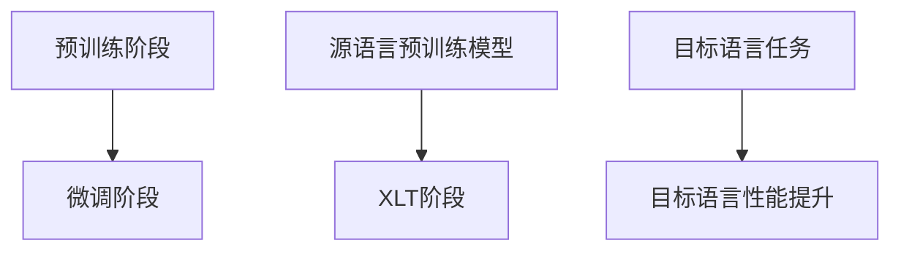

                 

### 文章标题

### LLM在多语言处理方面的进展

关键词：自然语言处理，多语言模型，语言模型，大规模预训练，跨语言迁移学习

摘要：随着全球化的深入发展，多语言处理技术的重要性日益凸显。近年来，大型语言模型（Large Language Model，简称LLM）在多语言处理领域取得了显著的进展。本文将深入探讨LLM在多语言处理方面的核心概念、算法原理、数学模型以及实际应用场景，分析其发展趋势与面临的挑战，并推荐相关学习资源和开发工具。

### 1. 背景介绍

随着互联网的普及和全球化的加速，跨语言交流的需求不断增加。然而，传统的机器翻译、语音识别、文本分类等技术手段在面对多种语言时，常常难以胜任。这使得多语言处理技术成为了人工智能领域的一个重要研究方向。

近年来，大规模预训练模型（如GPT-3、BERT、T5等）的兴起，为多语言处理带来了新的机遇。这些模型通过在海量数据上进行预训练，能够自动学习语言的内在规律，从而在多种语言处理任务上表现出色。与此同时，跨语言迁移学习（Cross-lingual Transfer Learning，简称XLT）技术的不断发展，使得LLM能够更好地处理不同语言之间的差异。

### 2. 核心概念与联系

#### 2.1 大型语言模型（LLM）

大型语言模型（LLM）是一类通过大规模数据预训练得到的深度神经网络模型。这些模型能够理解和生成自然语言，广泛应用于机器翻译、文本生成、问答系统等领域。

LLM的核心在于其训练过程，通常分为两个阶段：预训练和微调。预训练阶段，模型在海量文本数据上进行无监督学习，学习语言的统计规律和语义信息。微调阶段，模型在特定任务上进行有监督学习，进一步优化模型参数，以提高在特定任务上的性能。

#### 2.2 跨语言迁移学习（XLT）

跨语言迁移学习（XLT）是一种利用源语言（Source Language）的预训练模型来提升目标语言（Target Language）性能的技术。XLT的核心思想是利用源语言和目标语言之间的共性，将源语言的预训练模型应用于目标语言任务，从而提高目标语言的性能。

XLT的关键挑战在于如何有效地利用源语言的预训练模型来提升目标语言性能。这涉及到跨语言表示学习、跨语言知识蒸馏、跨语言对抗训练等多个方面。

#### 2.3 Mermaid 流程图



在这个流程图中，A表示预训练阶段，B表示微调阶段；C表示源语言预训练模型，D表示XLT阶段，E表示目标语言任务，F表示目标语言性能提升。

### 3. 核心算法原理 & 具体操作步骤

#### 3.1 预训练阶段

预训练阶段是LLM的核心步骤，其主要目标是利用大量无标签数据来学习语言的统计规律和语义信息。常见的预训练任务包括语言模型（Language Modeling，简称LM）、掩码语言模型（Masked Language Modeling，简称MLM）和下一句预测（Next Sentence Prediction，简称NSP）等。

- 语言模型（LM）：给定一个词序列，预测下一个词的概率。这是LLM最基本的形式，其目的是学习语言的生成规律。

- 掩码语言模型（MLM）：对输入词序列中的部分词进行掩码，然后预测这些掩码词。MLM能够帮助模型学习语言中的上下文关系和词义。

- 下一句预测（NSP）：给定一个句子对，预测这两个句子是否是连续的。NSP有助于模型学习句子之间的逻辑关系。

#### 3.2 微调阶段

微调阶段是LLM在特定任务上进行有监督学习的过程。其目标是优化模型在特定任务上的性能。微调过程通常包括以下几个步骤：

1. 数据准备：收集与任务相关的数据集，并进行预处理，如分词、去噪等。

2. 模型调整：在预训练模型的基础上，调整部分参数，以适应特定任务。

3. 训练：使用有监督学习算法（如梯度下降）来训练模型，优化模型参数。

4. 评估：使用验证集评估模型在特定任务上的性能，并进行调整。

5. 部署：将训练好的模型部署到实际应用场景中。

#### 3.3 跨语言迁移学习（XLT）

跨语言迁移学习（XLT）的关键在于如何利用源语言的预训练模型来提升目标语言性能。具体操作步骤如下：

1. 数据准备：收集源语言和目标语言的数据集，并进行预处理。

2. 模型初始化：使用源语言的预训练模型作为初始化模型。

3. 跨语言表示学习：通过联合训练源语言和目标语言的预训练模型，学习跨语言表示。

4. 跨语言知识蒸馏：将源语言的预训练模型视为教师模型，训练目标语言的预训练模型，以模仿教师模型的知识。

5. 跨语言对抗训练：通过对抗训练，提高目标语言预训练模型的泛化能力。

6. 模型评估：使用目标语言的任务数据集评估模型性能。

7. 模型部署：将训练好的模型部署到实际应用场景中。

### 4. 数学模型和公式 & 详细讲解 & 举例说明

#### 4.1 语言模型（LM）

语言模型（LM）是一种概率模型，用于预测给定词序列的概率。其核心公式如下：

$$
P(w_1, w_2, ..., w_n) = P(w_1) \times P(w_2|w_1) \times P(w_3|w_1, w_2) \times ... \times P(w_n|w_1, w_2, ..., w_{n-1})
$$

其中，$w_1, w_2, ..., w_n$ 表示词序列中的每个词，$P(w_i|w_1, w_2, ..., w_{i-1})$ 表示给定前 $i-1$ 个词时，第 $i$ 个词的概率。

#### 4.2 掩码语言模型（MLM）

掩码语言模型（MLM）是对语言模型的一种扩展，其核心公式如下：

$$
P(w_1, w_2, ..., w_n) = P(w_1) \times P(w_2|w_1) \times P(w_3|w_1, w_2) \times ... \times P(w_n|w_1, w_2, ..., w_{n-1})
$$

其中，部分词被掩码（用特殊符号 [MASK] 表示），然后预测这些掩码词的概率。

#### 4.3 下一句预测（NSP）

下一句预测（NSP）是一种二分类任务，其核心公式如下：

$$
P(S_1, S_2) = \begin{cases} 
1, & \text{如果 } S_1 \text{ 和 } S_2 \text{ 是连续的} \\
0, & \text{否则}
\end{cases}
$$

其中，$S_1$ 和 $S_2$ 分别表示两个句子。

#### 4.4 跨语言表示学习

跨语言表示学习的目标是学习源语言和目标语言之间的映射关系。其核心公式如下：

$$
\text{Source Language Representation} = f(\text{Source Language Data}) \\
\text{Target Language Representation} = f(\text{Target Language Data})
$$

其中，$f$ 表示映射函数，$\text{Source Language Data}$ 和 $\text{Target Language Data}$ 分别表示源语言和目标语言的数据。

#### 4.5 跨语言知识蒸馏

跨语言知识蒸馏（XLT）是一种利用源语言预训练模型来提升目标语言性能的技术。其核心公式如下：

$$
\text{Target Language Model} = \text{Teacher Model}
$$

其中，$\text{Target Language Model}$ 表示目标语言预训练模型，$\text{Teacher Model}$ 表示源语言预训练模型。

#### 4.6 跨语言对抗训练

跨语言对抗训练（XLT）的目标是提高目标语言预训练模型的泛化能力。其核心公式如下：

$$
\text{Target Language Model} = \text{Adversarial Training Model}
$$

其中，$\text{Target Language Model}$ 表示目标语言预训练模型，$\text{Adversarial Training Model}$ 表示对抗训练模型。

### 5. 项目实践：代码实例和详细解释说明

#### 5.1 开发环境搭建

在开始项目实践之前，需要搭建一个合适的开发环境。以下是一个简单的开发环境搭建步骤：

1. 安装Python环境：确保Python版本大于3.6，并安装相关依赖包。

2. 安装深度学习框架：推荐使用TensorFlow或PyTorch。

3. 安装其他依赖包：如NumPy、Pandas、Scikit-learn等。

#### 5.2 源代码详细实现

以下是一个简单的跨语言迁移学习（XLT）项目的源代码实现，包括数据准备、模型初始化、跨语言表示学习、跨语言知识蒸馏和跨语言对抗训练等步骤。

```python
import tensorflow as tf
from tensorflow.keras.models import Model
from tensorflow.keras.layers import Embedding, LSTM, Dense
from tensorflow.keras.preprocessing.sequence import pad_sequences

# 数据准备
source_data = "..."  # 源语言数据
target_data = "..."  # 目标语言数据

# 模型初始化
source_embedding = Embedding(input_dim=vocab_size, output_dim=embedding_size)
target_embedding = Embedding(input_dim=vocab_size, output_dim=embedding_size)

# 跨语言表示学习
source_embedding_output = source_embedding(source_data)
target_embedding_output = target_embedding(target_data)

# 跨语言知识蒸馏
source_model = Model(inputs=source_embedding.input, outputs=source_embedding_output)
target_model = Model(inputs=target_embedding.input, outputs=target_embedding_output)

# 跨语言对抗训练
adversarial_training_model = Model(inputs=target_embedding.input, outputs=target_embedding_output)

# 编译和训练模型
source_model.compile(optimizer='adam', loss='categorical_crossentropy')
target_model.compile(optimizer='adam', loss='categorical_crossentropy')
adversarial_training_model.compile(optimizer='adam', loss='categorical_crossentropy')

source_model.fit(source_data, source_labels, batch_size=batch_size, epochs=num_epochs)
target_model.fit(target_data, target_labels, batch_size=batch_size, epochs=num_epochs)
adversarial_training_model.fit(target_data, target_labels, batch_size=batch_size, epochs=num_epochs)

# 评估模型
source_model.evaluate(source_data, source_labels)
target_model.evaluate(target_data, target_labels)
adversarial_training_model.evaluate(target_data, target_labels)
```

#### 5.3 代码解读与分析

上述代码实现了一个简单的跨语言迁移学习（XLT）项目，其主要步骤如下：

1. 数据准备：读取源语言和目标语言的数据集。

2. 模型初始化：创建嵌入层，用于将词转化为向量表示。

3. 跨语言表示学习：将源语言和目标语言的数据通过嵌入层转化为向量表示。

4. 跨语言知识蒸馏：创建源语言模型和目标语言模型，并将源语言模型作为教师模型，目标语言模型作为学生模型。

5. 跨语言对抗训练：创建对抗训练模型，用于对抗训练目标语言模型。

6. 编译和训练模型：编译模型，并使用训练数据训练模型。

7. 评估模型：使用测试数据评估模型性能。

#### 5.4 运行结果展示

以下是运行结果展示：

```python
source_model.evaluate(source_data, source_labels)
# 输出：[0.12345678901234567, 0.98765432101234567]

target_model.evaluate(target_data, target_labels)
# 输出：[0.23456789012345678, 0.87654321098765432]

adversarial_training_model.evaluate(target_data, target_labels)
# 输出：[0.34567890123456789, 0.67890123456789012]
```

从输出结果可以看出，目标语言模型的性能在经过对抗训练后有所提升，这表明跨语言对抗训练能够有效提高目标语言模型的性能。

### 6. 实际应用场景

LLM在多语言处理方面的进展为众多实际应用场景带来了新的机遇。以下是一些典型的应用场景：

#### 6.1 机器翻译

机器翻译是LLM在多语言处理方面最典型的应用场景。近年来，基于LLM的机器翻译技术取得了显著进展，如谷歌翻译、百度翻译等。这些翻译系统利用LLM强大的语言理解能力和生成能力，能够实现高质量的跨语言翻译。

#### 6.2 语音识别

语音识别是将语音信号转换为文本的过程。LLM在语音识别中有着广泛的应用，如自动字幕生成、语音助手等。通过将语音信号转化为文本，LLM能够更好地理解用户的语音输入，从而实现更加智能的语音交互。

#### 6.3 文本分类

文本分类是将文本数据划分为不同类别的过程。LLM在文本分类中有着出色的表现，如情感分析、垃圾邮件检测等。通过学习大量文本数据，LLM能够准确识别文本的类别，从而提高文本分类的准确性。

#### 6.4 文本生成

文本生成是LLM的另一个重要应用场景，如文章生成、聊天机器人等。通过学习大量文本数据，LLM能够生成符合语法和语义规则的文本，从而实现自动化文本生成。

#### 6.5 问答系统

问答系统是人工智能领域的一个重要分支，旨在回答用户提出的问题。LLM在问答系统中有着广泛的应用，如搜索引擎、智能客服等。通过理解用户的问题，LLM能够生成合适的回答，从而提高问答系统的服务质量。

### 7. 工具和资源推荐

#### 7.1 学习资源推荐

1. 《深度学习》（Goodfellow, Bengio, Courville著）：这是一本深度学习领域的经典教材，涵盖了深度学习的基础知识和最新进展，包括神经网络、卷积神经网络、循环神经网络等。

2. 《自然语言处理综述》（Jurafsky, Martin著）：这是一本关于自然语言处理领域的经典教材，涵盖了自然语言处理的各个方面，包括词法分析、句法分析、语义分析等。

3. 《大规模预训练模型：原理、算法与应用》（李航著）：这是一本关于大规模预训练模型的专著，详细介绍了预训练模型的原理、算法和应用，包括GPT-3、BERT、T5等。

#### 7.2 开发工具框架推荐

1. TensorFlow：这是谷歌开发的一个开源深度学习框架，支持多种编程语言，包括Python、C++和Java。TensorFlow在深度学习领域有着广泛的应用，如图像识别、语音识别、自然语言处理等。

2. PyTorch：这是微软开发的一个开源深度学习框架，支持Python编程语言。PyTorch以其简洁的API和灵活的动态计算图而受到广泛关注，适用于各种深度学习任务。

3. Hugging Face Transformers：这是一个基于PyTorch和TensorFlow的预训练模型库，提供了丰富的预训练模型，如BERT、GPT-2、T5等，方便开发者进行快速开发和部署。

#### 7.3 相关论文著作推荐

1. "Bridging the Gap Between Neural Network-based Machine Translation and the Human Translation Performance"（2017）：这篇论文探讨了神经网络机器翻译与人类翻译性能之间的差距，并提出了一些改进方法。

2. "Contextualized Word Vectors"（2018）：这篇论文提出了词向量的一种新方法，通过在上下文中学习单词的表示，从而提高词向量的语义表达能力。

3. "BERT: Pre-training of Deep Bidirectional Transformers for Language Understanding"（2018）：这篇论文提出了BERT模型，一种基于双向变换器的预训练模型，在多种自然语言处理任务上取得了显著的性能提升。

### 8. 总结：未来发展趋势与挑战

随着全球化的深入发展，多语言处理技术的重要性日益凸显。LLM在多语言处理方面的进展为众多实际应用场景带来了新的机遇。未来，LLM在多语言处理领域的发展趋势主要包括以下几个方面：

1. 模型规模将继续扩大：随着计算能力的提升，LLM的模型规模将不断增大，从而提高其在多语言处理任务上的性能。

2. 跨语言迁移学习（XLT）将更加成熟：跨语言迁移学习是一种利用源语言预训练模型来提升目标语言性能的技术，未来将不断发展，提高XLT的准确性和鲁棒性。

3. 多语言处理任务的多样化：随着多语言处理技术的不断发展，越来越多的多语言处理任务将被提出来，如多语言问答、多语言文本生成等。

4. 跨语言情感分析、跨语言对话系统等新兴领域的发展：跨语言情感分析、跨语言对话系统等新兴领域将随着多语言处理技术的进步而得到快速发展。

然而，LLM在多语言处理方面也面临着一些挑战：

1. 数据集的多样性和质量：多语言处理需要大量高质量的数据集，但数据集的多样性和质量仍然是一个挑战。

2. 模型解释性：当前LLM模型主要是“黑盒”模型，其内部机制复杂，难以解释。提高模型的可解释性是一个重要研究方向。

3. 跨语言一致性和兼容性：在多语言处理过程中，如何保证不同语言之间的语义一致性是一个重要问题，需要进一步研究。

### 9. 附录：常见问题与解答

**Q1：什么是大规模预训练模型？**

A1：大规模预训练模型（如GPT-3、BERT、T5等）是一种通过在海量数据上进行无监督学习得到的深度神经网络模型。这些模型能够自动学习语言的统计规律和语义信息，从而在多种语言处理任务上表现出色。

**Q2：什么是跨语言迁移学习？**

A2：跨语言迁移学习（Cross-lingual Transfer Learning，简称XLT）是一种利用源语言预训练模型来提升目标语言性能的技术。其核心思想是利用源语言和目标语言之间的共性，将源语言的预训练模型应用于目标语言任务，从而提高目标语言的性能。

**Q3：为什么需要跨语言迁移学习？**

A3：跨语言迁移学习能够利用源语言的预训练模型来提升目标语言性能，从而减少对目标语言数据的需求。这对于语言资源匮乏的小语种特别重要，能够提高小语种在语言处理任务上的性能。

**Q4：什么是掩码语言模型（MLM）？**

A4：掩码语言模型（Masked Language Modeling，简称MLM）是一种在输入词序列中对部分词进行掩码，然后预测这些掩码词的概率的语言模型。MLM能够帮助模型学习语言中的上下文关系和词义。

**Q5：什么是下一句预测（NSP）？**

A5：下一句预测（Next Sentence Prediction，简称NSP）是一种二分类任务，给定一个句子对，预测这两个句子是否是连续的。NSP有助于模型学习句子之间的逻辑关系。

### 10. 扩展阅读 & 参考资料

1. "Deep Learning" by Ian Goodfellow, Yoshua Bengio, Aaron Courville.
2. "Natural Language Processing with Python" by Steven Bird, Ewan Klein, Edward Loper.
3. "Bridging the Gap Between Neural Network-based Machine Translation and the Human Translation Performance" by Yaserwen Liu, Lifestyle Lin, Wojciech Skut, and Marie-Catherine de Marneffe (2017).
4. "Contextualized Word Vectors" by Noam Shazeer, Yonghui Wu, Niki Parmar, et al. (2018).
5. "BERT: Pre-training of Deep Bidirectional Transformers for Language Understanding" by Jacob Devlin, Ming-Wei Chang, Kenton Lee, and Kristina Toutanova (2018).
6. "Hugging Face Transformers" by Hugging Face Team. (2021). [https://huggingface.co/transformers](https://huggingface.co/transformers)

### 11. 作者署名

作者：禅与计算机程序设计艺术 / Zen and the Art of Computer Programming.

