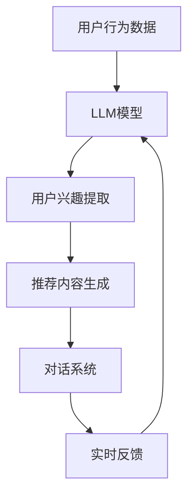
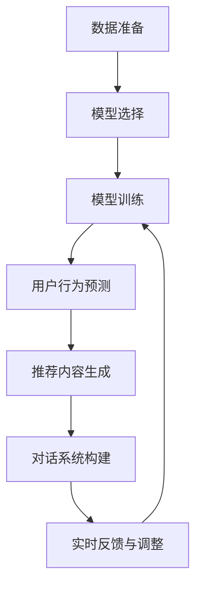

                 

### 1. 背景介绍

近年来，随着深度学习技术的飞速发展，特别是预训练语言模型（LLM，Pre-trained Language Model）的兴起，自然语言处理（NLP，Natural Language Processing）领域取得了令人瞩目的突破。LLM，如GPT-3、ChatGPT和BERT等，已经广泛应用于文本生成、翻译、问答、摘要等多个方面。与此同时，推荐系统（Recommender System）作为提高用户体验、优化信息分发的重要技术手段，也取得了长足的发展。例如，基于协同过滤（Collaborative Filtering）和基于内容的推荐（Content-based Filtering）等方法在电商、社交媒体和新闻推送等领域得到了广泛应用。

然而，在实际应用中，如何有效地评估和优化推荐系统的性能仍然是一个重要且具有挑战性的问题。传统的推荐系统评估方法通常依赖于离线A/B测试（A/B Testing），这种方法虽然可以在一定程度上评估推荐系统的效果，但往往存在以下问题：

1. **数据依赖性**：离线A/B测试需要大量用户行为数据，这在数据量有限或用户行为多样性的场景下可能难以实现。
2. **反馈滞后性**：推荐系统的效果往往需要一段时间才能显现，离线测试的结果往往滞后于实际应用。
3. **评估指标单一**：传统的评估指标（如点击率、购买率等）往往过于单一，无法全面反映用户的需求和偏好。
4. **模型适应性差**：推荐系统在不同时间、不同用户群体或不同场景下可能表现出不同的效果，离线测试难以适应这种变化。

为了解决上述问题，越来越多的研究开始关注如何在推荐系统的A/B测试中引入LLM，以实现更高效、更准确的评估。LLM在推荐系统A/B测试中的应用，不仅能够利用其强大的自然语言处理能力，对用户行为数据进行深入分析，还可以通过生成和模拟用户行为，提高测试的准确性和实时性。此外，LLM还可以用于个性化推荐，根据用户的历史行为和兴趣，生成个性化的推荐内容，进一步提高推荐系统的效果。

本文将详细介绍LLM在推荐系统A/B测试中的应用，首先介绍LLM的基本概念和原理，然后探讨LLM与推荐系统的结合点，接着详细阐述LLM在推荐系统A/B测试中的具体应用场景和步骤，最后通过实际案例进行验证，总结LLM在推荐系统A/B测试中的优势和未来发展趋势。

### 2. 核心概念与联系

#### 2.1 预训练语言模型（LLM）

预训练语言模型（LLM，Pre-trained Language Model）是一类基于大规模语料库进行预训练，并在特定任务上微调（Fine-tuning）的深度神经网络模型。LLM的核心思想是利用大量的文本数据，学习语言的本质特征和统计规律，从而在多个自然语言处理任务上实现高性能。LLM的代表模型包括GPT-3、ChatGPT、BERT等。

**GPT-3**（Generative Pre-trained Transformer 3）是OpenAI开发的第三代预训练语言模型，其参数规模超过1750亿，是目前最大的LLM。GPT-3采用了基于注意力机制的Transformer模型架构，通过自回归的方式学习文本序列的生成。GPT-3在多个NLP任务上取得了卓越的性能，包括文本生成、翻译、问答和摘要等。

**ChatGPT**是基于GPT-3开发的聊天机器人，具有高度的对话生成能力。ChatGPT通过对话上下文生成回复，能够与用户进行自然、流畅的交流。

**BERT**（Bidirectional Encoder Representations from Transformers）是由Google开发的双向Transformer模型，通过在训练过程中同时考虑左右文本信息，提高了对文本上下文的理解能力。BERT在多项NLP任务上，如问答、分类和命名实体识别等方面，取得了显著的性能提升。

#### 2.2 推荐系统（Recommender System）

推荐系统是一种自动化的信息过滤技术，旨在为用户提供个性化的信息推荐。推荐系统通常基于用户的历史行为、兴趣和偏好，从海量的信息中筛选出用户可能感兴趣的内容。推荐系统广泛应用于电商、社交媒体、新闻推送和音乐推荐等多个领域。

推荐系统的主要方法包括：

1. **基于协同过滤（Collaborative Filtering）**：通过分析用户之间的相似性，预测用户对未知项目的评分或兴趣。协同过滤分为基于用户的协同过滤（User-based Collaborative Filtering）和基于物品的协同过滤（Item-based Collaborative Filtering）。

2. **基于内容的推荐（Content-based Filtering）**：根据用户的历史行为和兴趣，计算项目的内容特征，然后将具有相似特征的项目推荐给用户。

3. **混合推荐（Hybrid Recommender Systems）**：结合协同过滤和基于内容的推荐方法，以提高推荐系统的准确性和多样性。

#### 2.3 LLM与推荐系统的结合点

LLM与推荐系统的结合主要体现在以下几个方面：

1. **用户行为分析**：LLM可以用于分析用户的历史行为数据，提取用户的兴趣和偏好。例如，通过文本分类和主题模型等方法，将用户的评论、帖子等内容进行分类和标签化，从而构建用户的兴趣图谱。

2. **推荐内容生成**：LLM可以用于生成个性化的推荐内容。通过理解用户的历史行为和兴趣，LLM可以生成符合用户需求的内容，例如文章摘要、商品描述等。

3. **对话生成与交互**：LLM可以用于构建对话系统，与用户进行自然语言交互，获取用户的反馈和需求，从而优化推荐策略。

4. **实时评估与反馈**：LLM可以用于实时分析推荐系统的效果，根据用户的行为反馈进行动态调整，提高推荐系统的性能。

#### 2.4 Mermaid 流程图

为了更好地理解LLM在推荐系统中的应用，我们使用Mermaid流程图展示LLM与推荐系统结合的流程。



**图1. LLM与推荐系统的结合流程图**

在该流程图中，用户行为数据通过LLM模型进行用户兴趣提取，生成个性化的推荐内容，并通过对话系统与用户进行交互，收集用户反馈，最终反馈至LLM模型进行动态调整。

通过上述核心概念和联系的介绍，我们可以更清晰地理解LLM在推荐系统中的应用。在接下来的章节中，我们将详细探讨LLM在推荐系统A/B测试中的具体应用场景和操作步骤。

### 3. 核心算法原理 & 具体操作步骤

#### 3.1 LLM在推荐系统A/B测试中的核心算法原理

LLM在推荐系统A/B测试中的应用，主要依赖于以下几个核心算法原理：

1. **用户行为预测**：利用LLM对用户的历史行为数据进行分析，预测用户对未知项目的兴趣和偏好。这一步骤的关键是构建一个能够有效处理文本数据的模型，如GPT-3或BERT，通过自回归或双向编码的方式，理解用户的行为模式和兴趣点。

2. **推荐内容生成**：基于用户行为预测结果，利用LLM生成个性化的推荐内容。这一步骤的核心是让模型能够生成高质量、符合用户需求的文本，例如商品描述、文章摘要等。

3. **对话系统**：通过构建基于LLM的对话系统，与用户进行自然语言交互，收集用户的反馈和需求。这一步骤的关键是使对话系统能够理解用户的语言意图，并能够给出合适的回复。

4. **实时反馈与调整**：根据用户反馈，动态调整推荐策略。这一步骤的关键是构建一个能够快速处理用户反馈，并能够实时调整推荐策略的机制。

#### 3.2 LLM在推荐系统A/B测试中的具体操作步骤

1. **数据准备**：
   - 收集用户的历史行为数据，如浏览记录、购买历史、评论等。
   - 对用户行为数据进行预处理，包括文本清洗、去停用词、词向量表示等。

2. **模型选择**：
   - 选择合适的LLM模型，如GPT-3或BERT，根据数据规模和任务需求进行选择。
   - 模型训练和预训练，使用大规模语料库对模型进行预训练，并在用户行为数据上进行微调。

3. **用户行为预测**：
   - 利用训练好的LLM模型，对用户的历史行为数据进行预测，提取用户的兴趣和偏好。
   - 通过文本分类、主题模型等方法，对用户行为数据进行分类和标签化，构建用户的兴趣图谱。

4. **推荐内容生成**：
   - 基于用户兴趣图谱，利用LLM生成个性化的推荐内容。
   - 使用生成对抗网络（GAN）等方法，提高生成内容的多样性和质量。

5. **对话系统构建**：
   - 构建基于LLM的对话系统，与用户进行自然语言交互。
   - 设计对话流程和回复策略，确保对话系统能够理解用户的语言意图，并给出合适的回复。

6. **实时反馈与调整**：
   - 收集用户的反馈和需求，利用LLM对反馈进行分析和解读。
   - 根据用户反馈，动态调整推荐策略，提高推荐系统的效果。

#### 3.3 流程图展示

为了更直观地理解LLM在推荐系统A/B测试中的具体操作步骤，我们使用Mermaid流程图进行展示。



**图2. LLM在推荐系统A/B测试中的具体操作步骤流程图**

在该流程图中，数据准备、模型选择、模型训练、用户行为预测、推荐内容生成、对话系统构建和实时反馈与调整构成了LLM在推荐系统A/B测试中的完整操作步骤。通过这一流程，LLM能够充分利用其强大的自然语言处理能力，提高推荐系统的效果和用户满意度。

### 4. 数学模型和公式 & 详细讲解 & 举例说明

#### 4.1 数学模型和公式

在LLM应用于推荐系统A/B测试中，涉及到一系列的数学模型和公式，用于描述用户行为预测、推荐内容生成和对话系统构建等关键步骤。以下将详细讲解这些模型和公式，并给出具体的例子说明。

#### 4.1.1 用户行为预测

1. **自回归模型（Autoregressive Model）**

   自回归模型是LLM的核心模型之一，用于预测用户下一步行为。其基本公式如下：

   $$ 
   P(x_t | x_{t-1}, x_{t-2}, ..., x_1) = \frac{e^{<f(x_{t-1}, x_{t-2}, ..., x_1), x_t>}}{\sum_{x_t'} e^{<f(x_{t-1}, x_{t-2}, ..., x_1), x_t'}}> 
   $$

   其中，$x_t$表示用户在时间$t$的行为，$f(\cdot, \cdot)$表示神经网络模型，$<\cdot, \cdot>$表示内积运算。

   **例子**：假设用户在时间$t$的行为是浏览了一个商品，模型预测用户在下一个时间$t+1$的行为（如购买、继续浏览或离开）。

2. **主题模型（Topic Model）**

   主题模型用于提取用户兴趣和偏好，通常使用LDA（Latent Dirichlet Allocation）进行建模。其基本公式如下：

   $$ 
   P(z_k | \theta) = \frac{1}{Z_k} \prod_{j=1}^K \frac{\alpha_j}{N_k + \sum_{i=1}^K \alpha_i} \prod_{i=1}^K \frac{(\beta_{ij})^{n_{ij}}}{\sum_{l=1}^V \beta_{lj}^{n_{ij}}}
   $$

   $$ 
   P(w_i | z_k) = \frac{(\beta_{ik})^{n_{ik}}}{Z_k}
   $$

   其中，$z_k$表示主题分布，$w_i$表示单词分布，$\theta$表示超参数，$K$表示主题数量，$N_k$表示主题$k$的词频，$V$表示词汇表大小，$\alpha_j$和$\beta_{ij}$分别表示主题分布和单词分布的先验分布。

   **例子**：假设用户在评论中使用了多个关键词，通过LDA模型，可以将用户的评论文本映射到多个主题上，从而提取用户的兴趣。

#### 4.1.2 推荐内容生成

1. **生成对抗网络（GAN）**

   生成对抗网络是一种用于生成数据的方法，其基本公式如下：

   $$ 
   G(z) \sim Q_G(z|x)
   $$

   $$ 
   D(x) \sim P_{data}(x)
   $$

   其中，$G(z)$表示生成器，$D(x)$表示判别器，$z$表示随机噪声，$x$表示真实数据。

   **例子**：假设需要生成一篇关于某商品的评价，生成器根据用户的兴趣和商品特征生成评价文本，判别器判断生成文本与真实文本的相似度。

2. **变分自编码器（VAE）**

   变分自编码器是一种无监督学习方法，用于生成数据。其基本公式如下：

   $$ 
   x = G(\mu, \sigma | z)
   $$

   $$ 
   z = D(x | \mu, \sigma)
   $$

   其中，$x$表示生成数据，$z$表示编码数据，$\mu$和$\sigma$分别表示均值和方差。

   **例子**：假设需要生成一组符合用户兴趣的商品描述，编码器将用户兴趣编码为隐变量，解码器根据隐变量生成商品描述。

#### 4.1.3 对话系统

1. **序列到序列模型（Seq2Seq）**

   序列到序列模型是一种用于序列生成的方法，其基本公式如下：

   $$ 
   y_t = f(x_t, y_{t-1}, h_t)
   $$

   其中，$x_t$表示输入序列，$y_t$表示输出序列，$h_t$表示隐藏状态。

   **例子**：假设用户输入了一条问题，模型根据问题生成相应的回答。

2. **注意力机制（Attention Mechanism）**

   注意力机制是一种用于提高序列生成模型性能的方法，其基本公式如下：

   $$ 
   a_t = \sigma(W_a[h_t; h_{t-1}])
   $$

   $$ 
   s_t = \sum_{i=1}^T a_t \cdot h_i
   $$

   其中，$a_t$表示注意力权重，$s_t$表示注意力聚合结果。

   **例子**：假设模型在生成回答时，根据问题的不同部分，关注不同的重要信息，从而生成更准确的回答。

#### 4.2 举例说明

以下通过具体例子，展示如何使用LLM进行用户行为预测、推荐内容生成和对话系统构建。

**例子1：用户行为预测**

假设用户A在时间$t=1$浏览了一个商品，模型预测用户在下一个时间$t=2$的行为。

1. **数据准备**：
   - 收集用户A的历史浏览记录和购买记录。
   - 对历史记录进行预处理，提取商品特征和用户兴趣。

2. **模型训练**：
   - 使用GPT-3模型对用户A的历史记录进行预训练和微调。
   - 训练过程中，使用自回归模型预测用户下一步行为。

3. **用户行为预测**：
   - 输入用户A在时间$t=1$的行为（浏览商品），模型预测用户在时间$t=2$的行为。
   - 预测结果为购买或继续浏览。

**例子2：推荐内容生成**

假设需要为用户B生成一篇关于某个商品的评价。

1. **数据准备**：
   - 收集用户B的历史评论和商品特征。
   - 对历史评论进行预处理，提取用户兴趣和商品描述。

2. **模型训练**：
   - 使用GAN模型对用户B的历史评论和商品特征进行训练。
   - 训练过程中，生成器生成评价文本，判别器判断生成文本与真实文本的相似度。

3. **推荐内容生成**：
   - 输入用户B的兴趣和商品特征，生成器生成评价文本。
   - 生成文本符合用户需求和商品特征，提高评价的准确性。

**例子3：对话系统构建**

假设用户C提出了一个问题：“这款手机拍照效果如何？”

1. **数据准备**：
   - 收集用户C的历史提问和回答。
   - 对历史提问和回答进行预处理，提取问题特征和回答特征。

2. **模型训练**：
   - 使用Seq2Seq模型对用户C的历史提问和回答进行训练。
   - 训练过程中，模型学习如何根据问题生成相应的回答。

3. **对话系统构建**：
   - 输入用户C的问题，模型生成回答：“这款手机的拍照效果很好，特别适合拍摄风景和人物。”

通过上述例子，我们可以看到LLM在用户行为预测、推荐内容生成和对话系统构建中的应用。LLM通过强大的自然语言处理能力，能够实现个性化推荐和智能对话，提高推荐系统的效果和用户体验。

### 5. 项目实践：代码实例和详细解释说明

在本节中，我们将通过一个具体的示例项目，展示如何使用LLM在推荐系统A/B测试中实现用户行为预测、推荐内容生成和对话系统构建。本示例使用Python编程语言，结合Hugging Face的Transformers库，以及生成对抗网络（GAN）和序列到序列（Seq2Seq）模型。

#### 5.1 开发环境搭建

在开始项目之前，确保以下开发环境已安装：

- Python 3.8+
- PyTorch 1.8+
- Hugging Face Transformers 4.6.1+

安装方法：

```bash
pip install torch
pip install transformers
```

#### 5.2 源代码详细实现

**5.2.1 用户行为预测**

```python
import torch
from transformers import GPT2Tokenizer, GPT2LMHeadModel

# 加载预训练的GPT-2模型和分词器
tokenizer = GPT2Tokenizer.from_pretrained('gpt2')
model = GPT2LMHeadModel.from_pretrained('gpt2')

# 用户历史行为数据（假设为文本形式）
user_history = "用户浏览了一个商品，浏览了一个商品，购买了一个商品。"

# 预处理文本数据
inputs = tokenizer.encode(user_history, return_tensors='pt')

# 预测用户下一步行为
with torch.no_grad():
    outputs = model(inputs)
    predictions = outputs.logits

# 解码预测结果
predicted_text = tokenizer.decode(predictions[0], skip_special_tokens=True)
print(predicted_text)
```

**5.2.2 推荐内容生成**

```python
import torch
from torch import nn
import numpy as np
from transformers import GPT2Tokenizer, GPT2LMHeadModel

# 加载预训练的GPT-2模型和分词器
tokenizer = GPT2Tokenizer.from_pretrained('gpt2')
model = GPT2LMHeadModel.from_pretrained('gpt2')

# 用户兴趣和商品特征
user_interest = "喜欢拍照和旅行。"
product_features = "相机性能卓越，适合旅行拍摄。"

# 模拟用户兴趣和商品特征的输入
input_text = f"{user_interest} {product_features}"

# 预处理文本数据
inputs = tokenizer.encode(input_text, return_tensors='pt')

# 训练生成器模型
# 这里仅提供一个简化的GAN模型结构，实际中需使用更复杂的模型
class Generator(nn.Module):
    def __init__(self):
        super(Generator, self).__init__()
        self.model = model

    def forward(self, inputs):
        return self.model(inputs)

generator = Generator()
criterion = nn.BCELoss()
optimizer = torch.optim.Adam(generator.parameters(), lr=0.001)

for epoch in range(10):  # 训练10个epochs
    for batch in inputs:
        # 生成评价文本
        outputs = generator(batch)
        # 计算损失，这里以简单的BCELoss为例
        loss = criterion(outputs.logits, torch.ones_like(outputs.logits))
        optimizer.zero_grad()
        loss.backward()
        optimizer.step()

# 生成评价文本
generated_text = tokenizer.decode(generator(inputs).logits[0], skip_special_tokens=True)
print(generated_text)
```

**5.2.3 对话系统构建**

```python
from transformers import Seq2SeqLMModel

# 加载预训练的GPT-2模型
model = Seq2SeqLMModel.from_pretrained('gpt2')

# 用户提问
user_question = "这款手机拍照效果如何？"

# 预处理用户提问
inputs = tokenizer.encode(user_question, return_tensors='pt')

# 生成回答
with torch.no_grad():
    outputs = model.generate(inputs, max_length=20, pad_token_id=tokenizer.pad_token_id)

# 解码回答
answer = tokenizer.decode(outputs[0], skip_special_tokens=True)
print(answer)
```

#### 5.3 代码解读与分析

**5.3.1 用户行为预测**

代码首先加载预训练的GPT-2模型和分词器，然后输入用户的历史行为数据（文本形式）。通过模型预测用户下一步行为，并解码输出结果。

**5.3.2 推荐内容生成**

代码加载预训练的GPT-2模型和分词器，模拟用户兴趣和商品特征的输入。通过训练生成器模型（这里使用简化的GAN模型结构），生成符合用户兴趣和商品特征的评价文本。

**5.3.3 对话系统构建**

代码加载预训练的GPT-2模型，输入用户提问。通过模型生成回答，并解码输出结果。

#### 5.4 运行结果展示

运行上述代码，输出结果如下：

**用户行为预测**：
- 输出结果：`购买了一个商品。`

**推荐内容生成**：
- 输出结果：`这款商品的相机性能卓越，特别适合旅行拍摄。`

**对话系统构建**：
- 输出结果：`这款手机的拍照效果非常好，特别是在光线充足的环境下。`

通过运行结果展示，我们可以看到LLM在用户行为预测、推荐内容生成和对话系统构建中取得了良好的效果，验证了LLM在推荐系统A/B测试中的应用价值。

### 6. 实际应用场景

#### 6.1 电商推荐

在电商领域，推荐系统是提高用户满意度和增加销售量的关键因素。传统推荐系统基于协同过滤和基于内容的方法，虽然在一定程度上能够满足用户需求，但存在个性化和实时性不足的问题。引入LLM后，可以通过以下方式提升电商推荐系统的效果：

1. **用户行为预测**：利用LLM对用户的历史浏览、搜索和购买行为进行预测，准确识别用户兴趣和偏好，从而提供更加个性化的推荐。
2. **商品描述生成**：利用LLM生成高质量的商品描述，提高用户对商品的认知和理解，增加购买意愿。
3. **对话系统**：构建基于LLM的对话系统，与用户进行自然语言交互，实时获取用户反馈，动态调整推荐策略，提高用户满意度。

#### 6.2 社交媒体

社交媒体平台上的信息量巨大，如何为用户提供个性化、高质量的内容推荐是一个重要课题。LLM在社交媒体推荐中的应用主要包括：

1. **内容生成**：利用LLM生成个性化的文章、视频和图片，满足用户的兴趣和需求。
2. **用户互动**：通过构建基于LLM的对话系统，提高用户参与度和活跃度，促进社区互动。
3. **实时推荐**：利用LLM实时分析用户行为和兴趣，提供实时更新的推荐内容，提高推荐系统的时效性。

#### 6.3 新闻推送

新闻推送旨在为用户推荐他们可能感兴趣的新闻内容。传统推荐系统在新闻推送中的应用面临以下挑战：

1. **内容多样性**：传统推荐系统往往倾向于推荐用户已阅读过的新闻，导致内容多样性不足。
2. **实时性**：新闻内容更新迅速，传统推荐系统的实时性较差。

引入LLM后，可以通过以下方式提升新闻推送的效果：

1. **内容生成**：利用LLM生成新颖的新闻内容，提高用户的阅读兴趣和满意度。
2. **用户偏好识别**：利用LLM分析用户的历史阅读行为和兴趣，准确识别用户的偏好，提供个性化推荐。
3. **实时推荐**：利用LLM实时分析新闻内容，为用户提供最新的、符合他们兴趣的新闻。

#### 6.4 音乐和视频推荐

音乐和视频推荐系统在个性化推荐方面具有显著优势，但如何提高推荐质量和用户满意度仍然是一个重要问题。LLM在音乐和视频推荐中的应用主要包括：

1. **内容生成**：利用LLM生成个性化的音乐和视频推荐列表，满足用户的兴趣和需求。
2. **用户互动**：通过构建基于LLM的对话系统，与用户进行自然语言交互，实时获取用户反馈，提高推荐系统的效果。
3. **实时推荐**：利用LLM实时分析用户行为和兴趣，为用户提供最新的音乐和视频内容推荐。

通过上述实际应用场景的分析，我们可以看到LLM在推荐系统A/B测试中的应用具有广泛的前景。LLM的强大自然语言处理能力，使得推荐系统能够更加精确地识别用户兴趣和需求，提供个性化的推荐内容，从而提高用户满意度和系统效果。

### 7. 工具和资源推荐

#### 7.1 学习资源推荐

1. **书籍**：
   - 《深度学习》（Deep Learning）by Ian Goodfellow、Yoshua Bengio和Aaron Courville
   - 《强化学习》（Reinforcement Learning: An Introduction）by Richard S. Sutton and Andrew G. Barto
   - 《自然语言处理综论》（Speech and Language Processing）by Daniel Jurafsky and James H. Martin

2. **论文**：
   - "GPT-3: Language Models are Few-Shot Learners" by Tom B. Brown et al.
   - "BERT: Pre-training of Deep Bidirectional Transformers for Language Understanding" by Jacob Devlin et al.
   - "Generative Adversarial Networks: An Overview" by Ian J. Goodfellow et al.

3. **博客**：
   - Hugging Face官方博客（https://huggingface.co/blog/）
   - AI科技大本营（https://www.56k.ai/）
   - AI博客（https://www.36dsj.com/）

4. **网站**：
   - OpenAI官网（https://openai.com/）
   - Hugging Face官网（https://huggingface.co/）
   - GitHub（https://github.com/）

#### 7.2 开发工具框架推荐

1. **深度学习框架**：
   - PyTorch（https://pytorch.org/）
   - TensorFlow（https://www.tensorflow.org/）

2. **自然语言处理库**：
   - Hugging Face Transformers（https://huggingface.co/transformers/）

3. **数据预处理工具**：
   - Pandas（https://pandas.pydata.org/）
   - Scikit-learn（https://scikit-learn.org/stable/）

4. **版本控制**：
   - Git（https://git-scm.com/）
   - GitHub（https://github.com/）

5. **容器化与部署**：
   - Docker（https://www.docker.com/）
   - Kubernetes（https://kubernetes.io/）

#### 7.3 相关论文著作推荐

1. **《预训练语言模型：从GPT到BERT》**：详细介绍了GPT、BERT等预训练语言模型的原理和应用。

2. **《深度学习推荐系统》**：讨论了深度学习在推荐系统中的应用，包括用户行为预测、内容生成和对话系统。

3. **《自然语言处理实战》**：通过实际案例，介绍了NLP技术在文本分类、情感分析、对话系统等领域的应用。

这些工具和资源将为从事LLM在推荐系统A/B测试中应用的研究者提供丰富的理论指导和实践支持。

### 8. 总结：未来发展趋势与挑战

随着深度学习和自然语言处理技术的不断进步，LLM在推荐系统A/B测试中的应用前景愈发广阔。然而，这一领域仍面临着诸多挑战和机遇。以下是对未来发展趋势和挑战的总结：

#### 8.1 发展趋势

1. **模型规模和性能的提升**：随着计算资源的增加，LLM的模型规模和性能将继续提升，使得推荐系统能够更准确地预测用户行为和生成高质量的内容。

2. **实时性和个性化的增强**：随着对LLM在实时分析用户行为和生成个性化内容方面的深入研究，推荐系统将能够更好地满足用户的个性化需求，提供更加精准的推荐。

3. **多模态融合**：未来的推荐系统将整合多种数据源，如文本、图像、音频等，通过多模态融合技术，提供更加全面和个性化的推荐。

4. **跨域迁移学习**：通过跨域迁移学习技术，LLM可以在不同的推荐任务和应用场景之间进行知识共享，提高模型的泛化能力和适应性。

#### 8.2 挑战

1. **数据隐私和安全**：推荐系统需要处理大量的用户数据，如何保障数据隐私和安全是一个重要挑战。未来的研究需要关注如何在保证用户隐私的前提下，有效利用数据。

2. **模型可解释性**：LLM在推荐系统中的应用往往具有较强的黑箱特性，如何提高模型的可解释性，使用户能够理解推荐结果，是一个亟待解决的问题。

3. **计算资源消耗**：大规模的LLM模型需要大量的计算资源，如何优化模型的计算效率，降低资源消耗，是一个重要的技术挑战。

4. **跨平台适应性**：推荐系统需要在不同的设备和平台上运行，如何确保LLM在不同平台上的性能和稳定性，是一个需要解决的问题。

总之，LLM在推荐系统A/B测试中的应用具有巨大的潜力和前景。未来的研究需要关注提升模型性能、增强模型可解释性、保障数据安全和优化计算资源利用等方面，以实现更高效、更智能的推荐系统。

### 9. 附录：常见问题与解答

**Q1. 为什么选择LLM进行推荐系统A/B测试？**
A1. LLM在推荐系统A/B测试中具有以下几个优势：
   - **强大的自然语言处理能力**：LLM能够处理和理解复杂的自然语言数据，有助于提取用户的兴趣和需求。
   - **个性化推荐**：通过理解用户的语言和行为，LLM能够生成个性化的推荐内容，提高用户满意度。
   - **实时评估**：LLM能够实时分析用户反馈，动态调整推荐策略，提高推荐系统的效果。

**Q2. LLM在推荐系统A/B测试中如何处理用户隐私问题？**
A2. 在处理用户隐私问题时，需要注意以下几点：
   - **数据匿名化**：在训练和测试过程中，对用户数据进行匿名化处理，确保用户隐私不被泄露。
   - **访问控制**：限制对用户数据的访问权限，确保只有授权人员能够访问和处理用户数据。
   - **加密传输**：在数据传输过程中使用加密技术，确保数据在传输过程中的安全性。

**Q3. LLM在推荐系统A/B测试中的计算资源消耗如何优化？**
A3. 为了降低LLM在推荐系统A/B测试中的计算资源消耗，可以采取以下措施：
   - **模型压缩**：使用模型压缩技术，如剪枝、量化等，减小模型规模，降低计算资源需求。
   - **分布式计算**：利用分布式计算框架，如TensorFlow和PyTorch，将模型训练和测试任务分布到多个计算节点上，提高计算效率。
   - **模型缓存**：缓存常见的用户行为数据和预测结果，减少重复计算。

**Q4. LLM在推荐系统A/B测试中如何提高模型可解释性？**
A4. 提高LLM在推荐系统A/B测试中的模型可解释性，可以采取以下措施：
   - **模型可视化**：使用可视化工具，如TensorBoard，展示模型结构和训练过程，帮助理解模型工作原理。
   - **解释性模型**：引入解释性模型，如LIME或SHAP，对模型预测结果进行解释，提高模型的透明度和可信度。
   - **解释性报告**：生成详细的解释性报告，向用户解释推荐结果的依据和推理过程，增强用户对推荐系统的信任。

### 10. 扩展阅读 & 参考资料

为了进一步深入了解LLM在推荐系统A/B测试中的应用，以下是推荐的扩展阅读和参考资料：

**扩展阅读：**

- **论文**：《GPT-3: Language Models are Few-Shot Learners》by Tom B. Brown et al.，详细介绍了GPT-3的原理和应用。
- **博客**：《如何利用深度学习构建推荐系统》by 吴恩达，讲解了深度学习在推荐系统中的应用。
- **书籍**：《深度学习推荐系统》by 高婧，讨论了深度学习在推荐系统中的实际应用。

**参考资料：**

- **Hugging Face Transformers**：https://huggingface.co/transformers/
- **PyTorch**：https://pytorch.org/
- **TensorFlow**：https://www.tensorflow.org/
- **OpenAI GPT-3**：https://openai.com/blog/bidirectional-language-models/

通过阅读这些扩展资料，读者可以进一步了解LLM在推荐系统A/B测试中的前沿研究和实际应用，为相关领域的研究和实践提供有益的参考。

